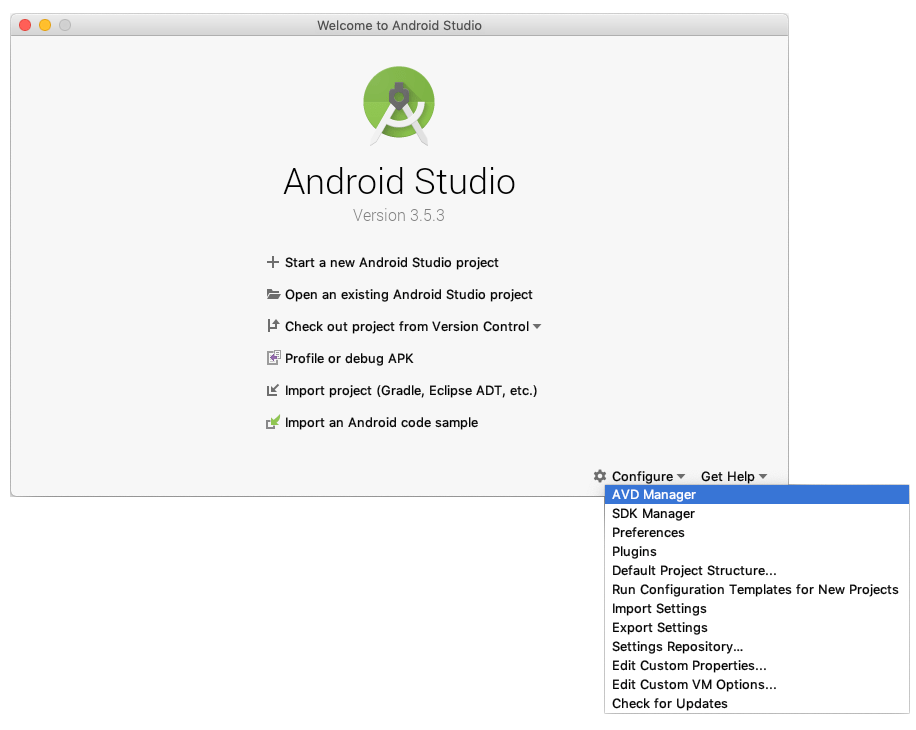
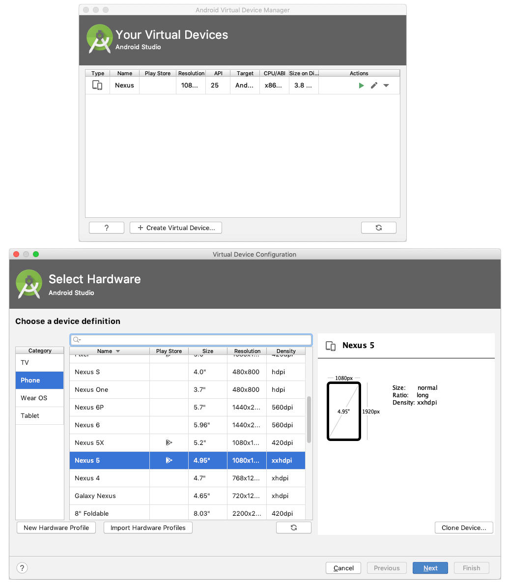
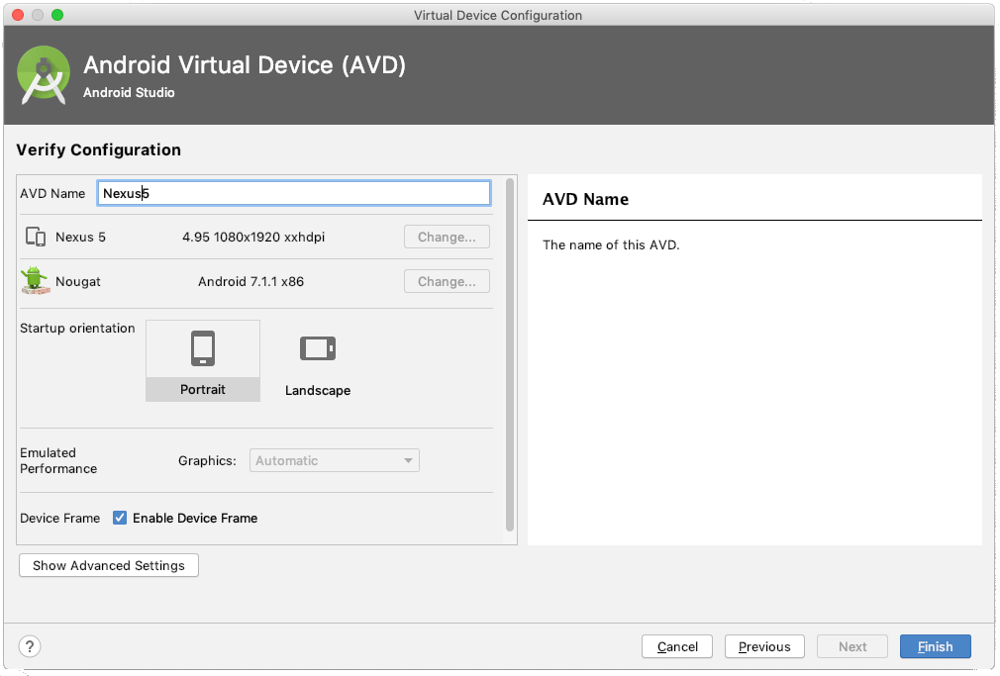
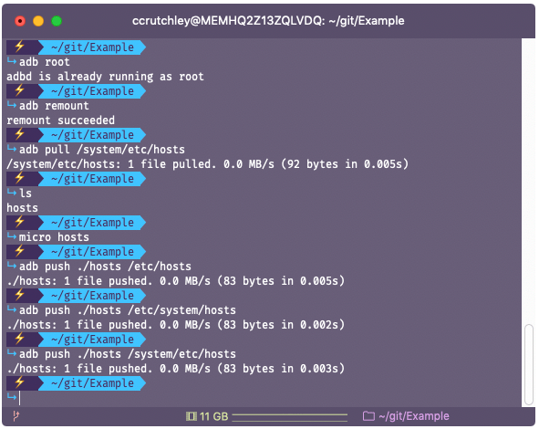

---
{
    title: "Change the Host File of an Android Emulator",
    description: "In order to test web applications with Android properly, you may need to edit the Android Emulator network host file. Here's how to do so.",
    published: '2019-12-27T22:12:03.284Z',
    authors: ['crutchcorn'],
    tags: ['android'],
    attached: [],
    license: 'cc-by-4',
    originalLink: "https://www.thepolyglotdeveloper.com/2019/12/change-host-file-android-emulator/"
}
---

While working on a bug in one of my projects recently, I found an  issue that I could only recreate on an Android device. However, due to  some cross-origin resource sharing (CORS) issues on my server, I had to  serve my development environment from a changed hostfile that had a  specific subdomain of my project.

With the ability to use a remote Chrome debugger from your desktop to a mobile device, you can use an  emulator and still have your full Chrome debugging capabilities. The  only problem then, is how to get the host file to match your desktop  environment. Following these steps will allow you to do just that!

## Pre-Requisites

In order to do this, you’ll need to install a few things first:

- [Download and install Android Studio](https://developer.android.com/studio/install)

During installation, it will ask you if you want to setup an emulator. You’ll  want to install all of the related Intel Virtualization packages, as it  will greatly increase your speed of the emulator.

- Download and install the android-platform-tools. This will include

  ```
  adb
  ```

  command directly on your path for you to utilize

  - For macOS, I suggest using [the Homebrew package manager](https://brew.sh/) and running `brew cask install android-platform-tools`
  - For Windows, I suggest using [the Chocolatey package manager](https://chocolatey.org/) and running `choco install adb`
  - For Linux, you’ll want to check with your package manager for one of the two above-mentioned package names

## Setup Steps

Once you have Android Studio installed, we’ll need to setup an emulator. To do so, open the application:


Then, press “Configure” in the bottom right corner. Then press the “AVD Manager” in the sub-menu.



You’ll see a popup window that will show you the list of virtual devices. _These are devices that will be used in order to run an emulator_. You may already have a virtual device setup from the initial setup of  Android Studio. They include the version of the operating system you use when you boot up the device. While the virtual device that was setup  out-of-the-box is fine for most operations, we’ll want to setup an older version of the emulator. This will allow us to change the host file in  Android, which requires root (something the default images won’t allow).

Select **Create Virtual Device**, then select a device type. In my example, I selected **Nexus 5**, but any device definition of a relatively modern phone should work.



As mentioned before, the default images that are provided will not allow us to replace the host files. In order to do so, _we have to download an older Android image_ (and one that does not include Google Play Store). To do this, I selected the **x86\_64 Android 7.1.1** (non Google API version) image to download and then selected **Next**.


It’s worth noting that we specifically must select a non-Google version,  otherwise our future commands will not work (per Google’s restrictions  on Google API images).

After this step, proceed to name the Android Device. _I’d suggest you name it something without any spaces in order to run a command later that you’ll need to run_. In this case, I called the image **Nexus5**.



## Handling the Emulator

Once the AVD is initially setup, open your terminal, and find your installation path of Android Studio.

- For MacOS, this should be under **\~/Library/Android/sdk**
- For Windows, this _should_ be **C:\Users<username>\AppData\Local\Android\sdk**

Once in that path, you want to run a specific emulator command:

```bash
./emulator/emulator -writable-system -netdelay none -netspeed full -avd <AVDName>
```

For example, given that I’m on macOS and my AVD name is **Nexus5**, I ran:

```bash
~/Library/Android/sdk/emulator/emulator -writable-system -netdelay none -netspeed full -avd Nexus5
```

This will start the emulator under specific  pretenses. These pretenses will allow you to write to any file on your  OS, including the host file.


Once you’re done with running the emulator, open a new tab and run the  following commands (in a folder you want to have the host file within):

- `adb root`
- `adb remount`
- `adb pull /system/etc/hosts`


Upon running these commands, you’ll find a **hosts** file. _This file is the file that tells your OS what path a given domain has._ You can, for example, map `example.com` to go to a specific IP address, similar to how DNS works for most domains.

Inside the emulator, the IP address `10.0.2.2` refers to the _host_ OS. For example, if you’re running a local server on your Windows/MacOS/Linux machine on `localhost:3000`, you can access it using `10.0.2.2:3000` from the Android emulator.

Knowing these two things, you can change the host file to make `example.com` refer to the host by adding the following to the host file:

```plaintext
10.0.2.2 example.com
```


## Pushing the Changes

Once you’ve made the changes to the host file that you want to have changed, you’ll have to push the host file to the OS of the AVD:

- `adb push ./hosts /etc/hosts`
- `adb push ./hosts /etc/system/hosts`
- `adb push ./hosts /system/etc/hosts`

While only one of these host file locations is needed to replaced, it’s  easier to run all three than only run one to see if it worked



In order for the changes to the host file to take effect, you’ll have to  restart the emulator. In order to do so, you’ll want to press and hold  the power button off to the right of the emulator. Then, press  “Restart”.

If you close the emulator and re-open it using the  command above, it may work, but I’ve found instances where it seems to  reset the host file, making you go through the whole process again


## Seeing the Results

Finally, you’re able to [sideload the Chrome APK’s x86 variant](https://www.apkmirror.com/apk/google-inc/chrome) in order to load the example codebase.

So, for example, using the above hostfile as an example, we can visit `example.com:8000` when running the development mode for [the project’s GitHub code](https://github.com/unicorn-utterances/unicorn-utterances/), you’re able to see a preview of the [Unicorn Utterances](https://unicorn-utterances.com) website from a different domain.


And that’s it! You now know how to modify and update the host file for an  emulated Android device. I hope this has helped with your development  usage!
