---
{
  title: "CSS Fundamentals",
  description: "A beginners course for CSS box model, HTML defaults, flexbox layout, gridbox layout, responsive design, selectors, units, and variables.",
  published: "2022-01-18T20:08:26.988Z",
  authors: ["ljtech"],
  tags: ["css", "design"],
  attached: [],
  license: "cc-by-4",
  originalLink: "https://ljtech.ca/posts/css-fundamentals"
}
---

## Introduction

This course will guide you through the fundamentals of CSS with a few of my own personal recommendations for further learning.

Keep in mind that some concepts or principles laid out here are broad and may not be accurate or reliable for every situation.

> 💡 This tutorial assumes basic knowledge of HTML and CSS

This tutorial will cover the following items in order:

- **[Box Model](#box-model)**
- **[HTML Defaults](#html-defaults)**
- **[Flexbox Layout](#flexbox-layout)**
- **[Gridbox Layout](#grid-box-layout)**
- **[Positioning](#positioning)**
- **[Where do I use Flexbox, Gridbox or Positioning?](#flex-grid-position)**
- **[Responsive Design](#responsive-design)**
- **[CSS Selectors](#css-selectors)**
- **[Units & Value Types](#units-&-value-types)**
- **[CSS Variables](#css-variables)**

---

## Box Model


The box model is a representation of a documents element through a set of boxes with the following properties:

- **Margin** - Wraps any border, padding, and content as white space.
- **Border** - Wraps any padding and content.
- **Padding** - Wraps any contents as white space.
- **Content** - Contains text, imagery, videos, etc.

Every element on the browser has a box model. You can inspect them using browser developer tools. Understanding the box model layers will help you identify element boundaries.

> 📚 [Learn More About Developer Tools](https://developer.mozilla.org/en-US/docs/Glossary/Developer_Tools)

---

## HTML Defaults

Nearly every HTML element has some default browser styles. These styles are called HTML defaults. These defaults may change depending on the browsers rendering engine.

> 🤓 Not every browser supports every CSS property! For up-to-date browser support I suggest checking out [Can I Use?](https://www.google.com/search?q=caniuse\&rlz=1C1CHBF_enCA963CA963\&oq=caniuse\&aqs=chrome.0.69i59j69i60l3.1776j0j4\&sourceid=chrome\&ie=UTF-8)

Every HTML element has a place and a purpose. Some HTML elements are strictly used for grouping content and are generally referred to as containers, while other HTML elements are used for text, images and more.

Here are some examples of HTML container elements:

```html
<aside>
	<!-- Represents anything indirectly related to the documents content -->
</aside>

<body>
	<!-- There can only be one body. It contains all the documents content -->
</body>

<div>
	<!-- A pure container as it does not inherently represent anything -->
</div>

<footer>
	<!-- Footers represent the last child of a given container -->
</footer>

<header>
	<!-- Headers represent the first child of a given container -->
</header>

<main>
	<!-- Contains the primary content inside a body container -->
</main>

<nav>
	<!-- Contains links for navigating to current or related documents -->
</nav>

<section>
	<!-- Contains a stand-alone piece of content -->
</section>

<ul>
	<!-- Represents a list of items -->
</ul>
```

Containing elements are very useful for styling as they allow developers to target groups of content easily through class, ID, and type selectors.

> ⚡ [Live Code Example: HTML Defaults](https://codesandbox.io/s/html-defaults-5lkjb)

It is important to know about HTML defaults and so you can work with them and not against them when styling a document.

> 📚 [Learn More About HTML](https://developer.mozilla.org/en-US/docs/Web/HTML)

---

## Flexbox Layout

The CSS property `display: flex` is also known as flexbox. Flexbox is used for creating one-dimensional layouts on a column (up and down) or row (left and right) direction.

#### Flex-Direction

```css
flex-direction: column;
```

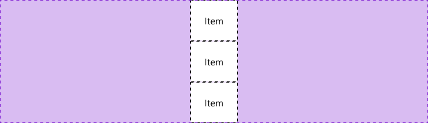

```css
flex-direction: row;
```

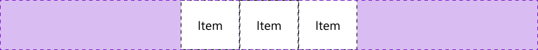

Adding `display: flex` to a container will cause any immediate descendants to become flex items. Using a few additional CSS properties we can align, justify, and space these same flex items inside the container.

#### Placement Methods

These placement methods are used to distribute both flex and gridbox items:

- [`place-content`](https://developer.mozilla.org/en-US/docs/Web/CSS/place-content) - shorthand property for [`align-content`](https://developer.mozilla.org/en-US/docs/Web/CSS/align-content) and [`justify-content`](https://developer.mozilla.org/en-US/docs/Web/CSS/justify-content)
- [`place-items`](https://developer.mozilla.org/en-US/docs/Web/CSS/place-items) - shorthand property for [`align-items`](https://developer.mozilla.org/en-US/docs/Web/CSS/align-items) and [`justify-items`](https://developer.mozilla.org/en-US/docs/Web/CSS/justify-items)
- [`place-self`](https://developer.mozilla.org/en-US/docs/Web/CSS/place-self) - shorthand property for [`align-self`](https://developer.mozilla.org/en-US/docs/Web/CSS/align-self) and [`justify-self`](https://developer.mozilla.org/en-US/docs/Web/CSS/justify-self)

> 🤓 These are some godly CSS properties that everyone should know about

#### Align-Items

```css
align-items: center;
```

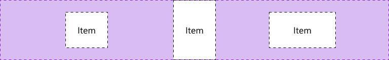

```css
align-items: flex-end;
```


```css
align-items: flex-start;
```

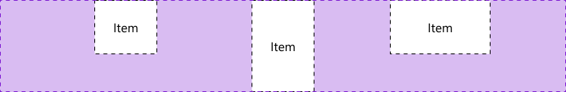

> 🤓 Keep everything inline with align-items

---

#### Justify-Content

```css
justify-content: center;
```

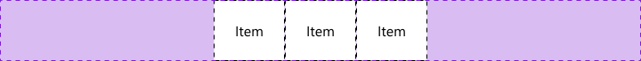

```css
justify-content: flex-end;
```


```css
justify-content: flex-start;
```

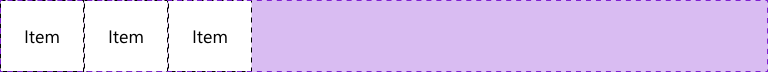

```css
justify-content: space-around;
```

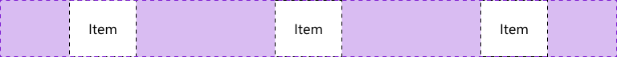

```css
justify-content: space-between;
```

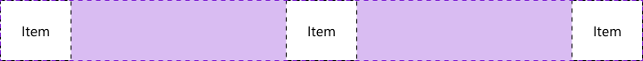

```css
justify-content: space-evenly;
```

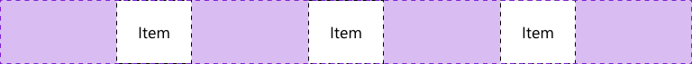

> 🤓 Space your content out with justify-content

Here is a list of CSS properties used to control flexbox properties:

- [`flex-direction`](https://developer.mozilla.org/en-US/docs/Web/CSS/flex-direction) - controls flexbox direction
- [`flex-grow`](https://developer.mozilla.org/en-US/docs/Web/CSS/flex-grow) - controls a flex items grow factor
- [`flex-shrink`](https://developer.mozilla.org/en-US/docs/Web/CSS/flex-shrink) - controls a flex items shrink factor
- [`flex-basis`](https://developer.mozilla.org/en-US/docs/Web/CSS/flex-basis) - controls the initial size of a flex item
- [`flex-wrap`](https://developer.mozilla.org/en-US/docs/Web/CSS/flex-wrap) - controls flex items wrapping onto multiple lines

> ⚡ [Live Code Example: Flexbox Layout](https://codesandbox.io/s/flexbox-layout-p4cy8?file=/styles.css)

---

## Gridbox Layout

The CSS property `display: grid` is commonly referred to as gridbox. Unlike flexbox, it is capable of creating two-dimensional layouts using intersecting columns and rows.

#### Grid-Template-Areas & Grid-Template-Columns

```css
grid-template-areas:
  "a a"
  "b c";
grid-template-columns: 1fr 1fr;
```

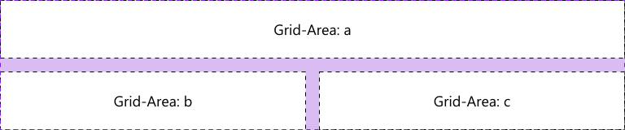

---

#### Grid-Template-Rows

```css
grid-template-rows: 1fr 2fr 1fr;
```

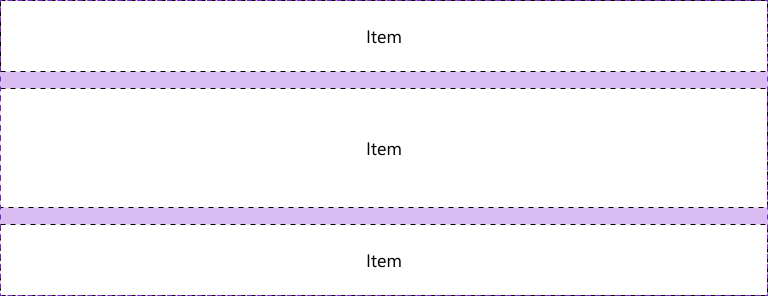

Adding `display: grid` to a container will cause any immediate descendants to become grid items. Similar to flexbox, we can use placement methods to help align, justify, and space grid items inside the container.

---

#### Place-Items

```css
place-items: center center;
```

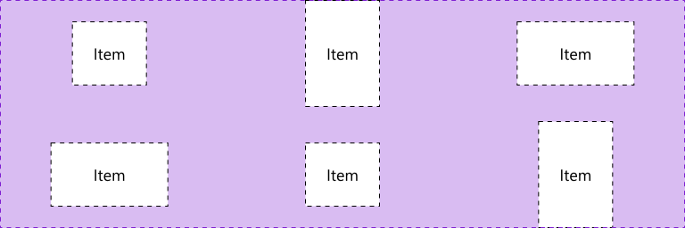

```css
place-items: end end;
```

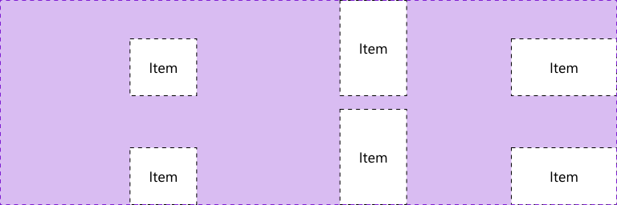

```css
place-items: start start;
```

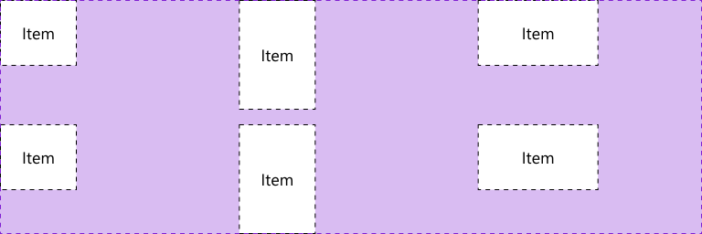

> 🤓 Place-items is super effective if using gridbox

Here is a list of CSS properties used to control gridbox properties:

- [`grid-area`](https://developer.mozilla.org/en-US/docs/Web/CSS/grid-area) - controls a grid item's location
- [`grid-template-areas`](https://developer.mozilla.org/en-US/docs/Web/CSS/grid-template-areas) - controls cells and assigns names
- [`grid-auto-columns`](https://developer.mozilla.org/en-US/docs/Web/CSS/grid-auto-columns) - controls the track size of grid columns
- [`grid-auto-flow`](https://developer.mozilla.org/en-US/docs/Web/CSS/grid-auto-flow) - controls the auto-placement algorithm
- [`grid-auto-rows`](https://developer.mozilla.org/en-US/docs/Web/CSS/grid-auto-rows) - controls the track size of grid rows
- [`grid-gap`](https://developer.mozilla.org/en-US/docs/Web/CSS/gap) - controls gaps between columns and rows
- [`grid-template-columns`](https://developer.mozilla.org/en-US/docs/Web/CSS/grid-template-columns) - controls line names and track size of grid columns
- [`grid-template-rows`](https://developer.mozilla.org/en-US/docs/Web/CSS/grid-template-rows) - controls line names and track size of grid rows

> ⚡ [Live Code Example: Gridbox Layout](https://codesandbox.io/s/gridbox-layout-tnu5b?file=/styles.css)

---

## Positioning

The CSS property `position` determines an elements flow inside a document.

The CSS properties `top`, `bottom`, `left`, `right` are used on positioned elements to control an offset while `z-index` controls the elements order (bringing it to the front or back).

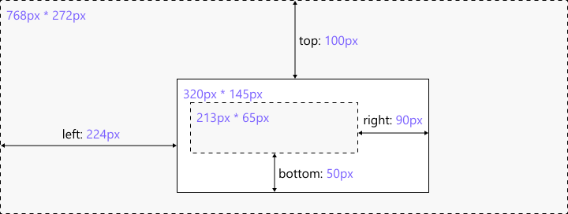

```css
.root {
	position: relative;
	width: 768px;
    height: 272px;
}

.container {
	position: absolute;
	left: 224px;
    top: 100px;
    width: 320px;
    height: 145px;
    z-index: 90;
}

.item {
	position: absolute;
    bottom: 50px;
    right: 90px;
	width: 213px;
	height: 65px;
    z-index: 100;
}
```

There are five types of element positions:

- **Absolute** - The element is removed from document flow and positioned relative to the nearest `position: relative` parent
  - Can be offset relative to the parent container and ordered
- **Fixed** - The element is removed from document flow and positioned relative to the initial container
  - Can be offset relative to the initial container and ordered
- **Relative** - The element flows normally and provides relative positioning for children elements
  - Can be offset relative to itself and ordered
- **Static** - The default position
  - Unaffected by offset and order
- **Sticky** - The element flows normally and "sticks" to the nearest container
  - A mixture between relative and fixed positions depending on the scroll mechanism
  - Can be offset relative to the parent container and ordered

> ⚡ [Live Code Example: Positioning](https://codesandbox.io/s/positioning-gzzv3?file=/styles.css)

---

## Where do I use Flexbox, Gridbox or Positioning?

#### Flexbox:

- Used in headers, lists, tags, or any other block or inline content with the correct flex-direction
- Primary method to align and justify content in small components
- Easy to use

For example, YouTube uses a flexbox to space out their headers children elements:


> 🤓 Mastering the flexbox will take you very far in CSS as it is used everywhere

#### Gridbox:

- Used in creating complex layouts that require both columns and rows
- Provides the easiest and shortest way to center elements
- Verbose and powerful

For example, Spotify uses a gridbox to achieve their playlist player layout:

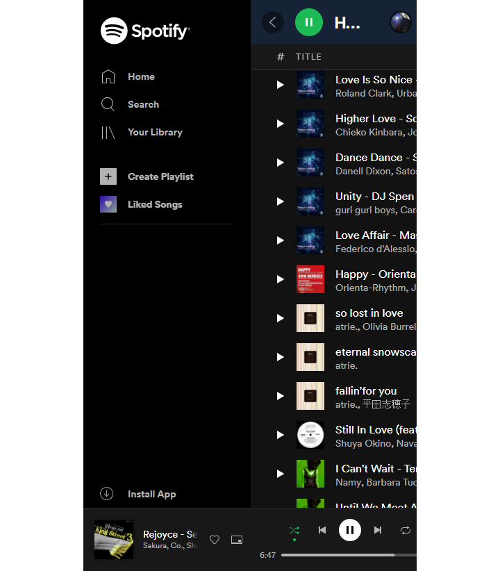

#### Positioning:

- Used in lightboxes, mobile menus, modal windows, and similar overlaying elements
- Primarily used to remove elements from document flow

For example, the cookies modal on stackoverflow uses a fixed position to stay on your screen while hovering above other document elements:

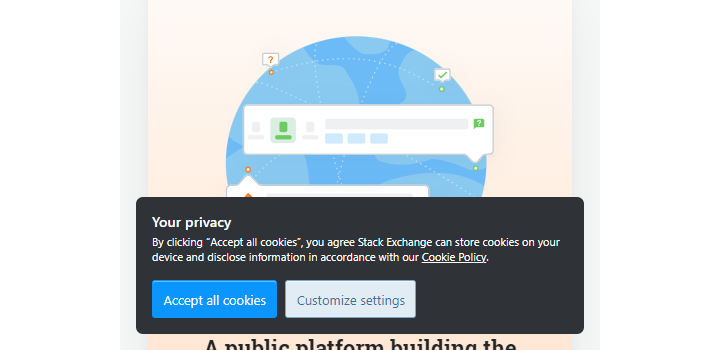

---

## Responsive Design

Responsive Design is an approach to web design where the goal is to create a layout that will render beautifully on any device or screen size.


To achieve this, designers can use media queries (AKA breakpoints) to add, override, and unset styles on any screen size.

The code snippet below shows how breakpoints can be used inside a `.css` file to override an existing CSS rule:

```css
.foobar {
  border: 1px solid red;
  color: red;
}

@media (min-width: 768px) {
  .foobar {
    border: unset;
    color: orange;
    display: flex;
	}
}
```

Here is a list of popular screen size breakpoints for max- and min-width:

- **320px** - Mobile S
- **375px** - Mobile M
- **425px** - Mobile L
- **768px** - Tablet
- **1024px** - Laptop
- **1440px** - Laptop L

#### Mobile First Design

One great method for responsive designing is called mobile first design. To use the mobile first method, simply use the min- prefix on your rules when applying breakpoints. This min- prefix will limit your breakpoints to a minimum screen size. This allows for smaller screens to be styled first, and exceptions made for larger devices.

> ⚡ [Live Code Example: Responsive Design](https://codesandbox.io/s/responsive-design-rkrns?file=/styles.css)

---

## CSS Selectors

CSS selectors are used inside `.css` files in order to target HTML elements and allows for CSS rules to be applied.

There are five basic CSS selectors:

- **Universal ( `*` )** - Targets all elements
- **Class (`.class`)** - Targets all with the given class
- **ID (`#id`)** -Targets all with the given ID
- **Type (`h1`)** - Targets all with the given type
- **Attribute (`[type="submit"]`)** Targets all with the given attribute

> 🤓 I recommend using the `.class` selector over the `#id` selector as ID attributes are unique

You can group selectors under one CSS rule using commas to share properties among multiple selectors:

```css
.foo {
  color: red;
}

#bar {
	color: blue;
}

.foo, #bar {
	padding: 1rem;
}
```

You can also combine selectors using a variety of syntax to target anything from descendants to siblings:

```css
section h1 {
	color: red;
}

section > h2 {
  color: orange;
}

section + h3 {
	color: yellow;
}

section ~ h4 {
	color: green;
}
```

Selectors can also be used to target browser pseudo-elements:

```css
input::placeholder {
  color: #dddddd;
}
```

Using this variety of combinators and selectors you can easily style any part of a web document.

> ⚡ [Live Code Example: Selectors](https://codesandbox.io/s/selectors-fqw6x?file=/styles.css)

> 📚 [Learn More About Selectors](https://developer.mozilla.org/en-US/docs/Web/CSS/CSS_Selectors)

---

## Units & Value Types

In CSS there are seven absolute and eight relative length unit types. Here are the popular ones:

- **px** - Pixels, absolute length unit
- **em** - Relative to the parent size
- **rem** - Relative to the root element size
- **vw** - View-width, relative to the current device
- **vh** - View-height, relative to the current device

These CSS units are used to determine the size of a property value.

> 🤓 I recommend using the units `px` and `rem` units

CSS property values will only accept certain syntax and types. Let's use `color` for example:

```css
.foobar__keyword {
  color: red; /* Color will accept certain keywords */	
}

.foobar__hex {
  color: #ff0000; /* It will also take hexadecimal values */
}

.foobar__rgb {
  color: rgb(255, 0, 0); /* As well as functional notations */
}
```

> [📚 Learn More About CSS Types](https://developer.mozilla.org/en-US/docs/Web/CSS/CSS_Types)

> 📚 [Learn More About Units & Values](https://developer.mozilla.org/en-US/docs/Learn/CSS/Building_blocks/Values_and_units)

---

## CSS Variables

CSS variables allow us to define arbitrary values for reuse across a stylesheet. For example:

```css
:root {
  --red: #ff0000;
}

.foo {
	background-color: var(--red);
}

.bar {
	color: var(--red);
}
```

It is common to use CSS variables for repeated values such as colors, font-size, padding, etc.

> ⚡ [Live Code Example: CSS Variables](https://codesandbox.io/s/css-variables-tx14z?file=/styles.css)
