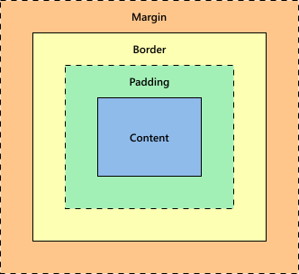

---
{
  title: "CSS Fundamentals",
  description: "A beginners course for CSS box model, HTML defaults, flexible box layout, grid box layout, responsive design, selectors, units, and variables.",
  published: "2022-01-18T20:08:26.988Z",
  authors: ["ljtech"],
  tags: ["CSS", "design"],
  attached: [],
  license: "cc-by-4",
  originalLink: "https://ljtech.ca/posts/css-fundamentals"
}
---

## Introduction

This course will guide you through a few fundamental CSS concepts.

Keep in mind that some principles laid out here are broad and may not be accurate or reliable for every situation.

> 💡 This tutorial assumes basic knowledge of CSS and HTML.

This tutorial will cover the following items in order:

- [Box Model](#box-model)
- [HTML Defaults](#html-defaults)
- [Flexible Box Layout](#flexible-box-layout)
- [Grid Box Layout](#grid-box-layout)
- [Responsive Design](#responsive-design)
- [Selectors](#selectors)
- [Units](#units)
- [Variables](#variables)

---

## Box Model

The box model is a representation of a documents element through a set of boxes with the following properties:

- Margin: Wraps any border, padding, and content as white space. Sized using `margin`.
- Border: Wraps any padding and content. Sized and styled using `border`.
- Padding: Wraps any contents as white space. Sized using `padding`.
- Content: Sized using `width` and `height`.

Every element on the browser has a box model. You can inspect them using browser developer tools. Understanding the box model layers will help you identify element boundaries.

> 📚 [Learn More About Developer Tools](https://developer.mozilla.org/en-US/docs/Glossary/Developer_Tools)

---

## HTML Defaults

Every HTML element has default browser styles. These styles are called HTML defaults.

For example, a div element by default has `display: block` and a `ul` element by default has `list-style-type: disc`.

> ⚡ [Live Code Example: HTML Defaults](https://codesandbox.io/s/serverless-resonance-s2c86?file=/index.html)

You can use default styles to create a layout with minimal styling. In most cases, these default styles are overridden or unset as they are not necessary or wanted.

Never use an HTML element without first reading its documentation. Simply put, every HTML element has a place and a purpose.

> 📚 [Learn More About HTML](https://developer.mozilla.org/en-US/docs/Web/HTML)

---

## Flexible Box Layout

Also known as flexbox, it is the primary method used to align, justify, and space elements. Flexbox creates one-dimensional layouts on a column(vertical axis, `block`) or row(horizontal axis, `inline`).

To create a flexbox, set the wrapping HTML elements `display` property to `flex`. Adding `flex` to a container will cause any immediate descendants to become flex items.

> ⚡ [Live Code Example: Flexible Box Layout](https://codesandbox.io/s/flexible-box-layout-p4cy8?file=/styles.css)

---

## Grid Box Layout

Commonly referred to as gridbox. It is capable of creating a two-dimensional layout using both columns and rows.

To create a gridbox, set the wrapping HTML elements `display` property to `grid`. Adding `grid` to a container will cause any immediate descendants to become grid items.

> ⚡ [Live Code Example: Grid Box Layout](https://codesandbox.io/s/grid-box-layout-tnu5b?file=/styles.css)

---

## Responsive Design

Responsive Design is an approach to web design where the goal is to create a layout that renders beautifully on any device or screen size.

Designers can use media queries (breakpoints) to override styles for targeted screen sizes, although the aim is to achieve a mobile-friendly layout without overriding too much.

A great method is to design for mobile devices first. This way, styles can be added as the screen sizes increase.

Here is a list of popular breakpoints:

- Mobile S: 320px
- Mobile M: 375px
- Mobile L: 425px
- Tablet: 768px
- Laptop: 1024px
- Laptop L: 1440px

> ⚡ [Live Code Example: Responsive Design](https://codesandbox.io/s/responsive-design-rkrns?file=/styles.css)

---

## Selectors

A CSS selector defines the targeted elements and allows for CSS rules to be applied. There are five basic CSS selectors:

- Universal: Targets all elements, eg: `*`.
- Class: Targets all with the given class, eg: `.class`.
- ID: Targets all with the given ID, eg: `#id`
- Type: Targets all with the given type, eg `h1`
- Attribute: Targets all with the given attribute, eg `[type="submit"]`

Sometimes CSS rules share the same properties. You can group selectors under one CSS rule using commas to share properties among multiple selectors.

You can also combine selectors using a variety of syntax to target anything from descendants to siblings.

I recommended using the class selector over the ID selector for styling.

> ⚡ [Live Code Example: Selectors](https://codesandbox.io/s/selectors-fqw6x?file=/styles.css)

> 📚 [Learn More About Selectors](https://developer.mozilla.org/en-US/docs/Web/CSS/CSS_Selectors)

---

## Units

CSS properties will only accept certain value types. For example, the CSS property color expects a color type value, which could be `red`, `#ff0000`, `rgb(255, 0, 0)`, etc.

There are four numeric value types:

- Integer: `1024` or `-55`
- Number: `0.255`, `128`, or `-1.2`
- Percentage: `50%`
- Dimension: covers four sub-types
  - Length: `10px`
  - Angle: `45deg`
  - Time: `5s`
  - Resolution: `300dpi`

Most CSS properties accept length values.

There are seven absolute and eight relative length units.

It is unusual to use them all, so included below is a list of the most common ones:

- `px`: Pixels, absolute length unit.
- `em`: Relative to the parent size.
- `rem`: Relative to the root element size.
- `vw`: View-width, relative to the current device.
- `vh`: View-height, relative to the current device.

My recommendations on what to use:

- use `px` for `font-sizing`, `border-width`, `@media` query breaks and similar properties
- use `rem` for `font-sizing`, `padding`, `margin`, and pretty much anything
- use `vh` for the CSS `height` property

> 📚 [Learn More About Units & Values](https://developer.mozilla.org/en-US/docs/Learn/CSS/Building_blocks/Values_and_units)

---

## Variables

CSS variables allow us to define CSS properties as arbitrary values for reuse across a CSS document. It is common to use CSS variables for color values or other repeated values.

> ⚡ [Live Code Example: Variables](https://codesandbox.io/s/variables-tx14z?file=/styles.css)
