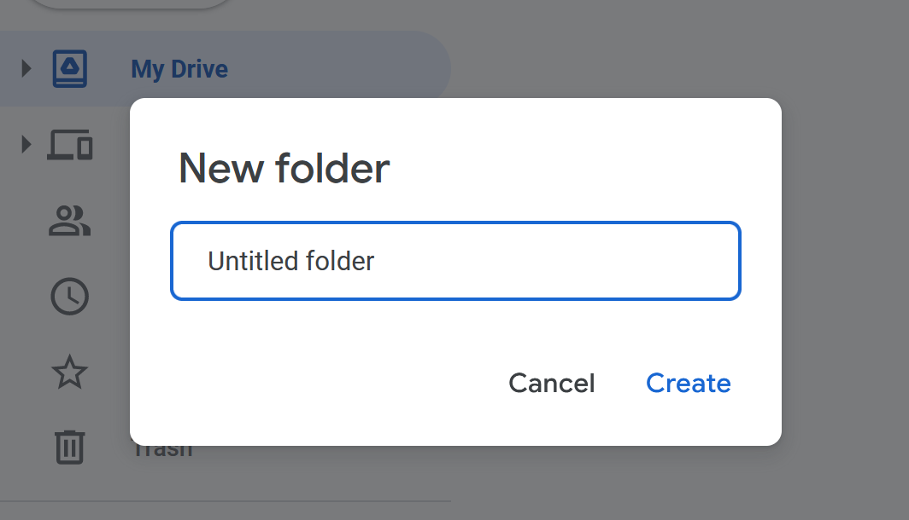
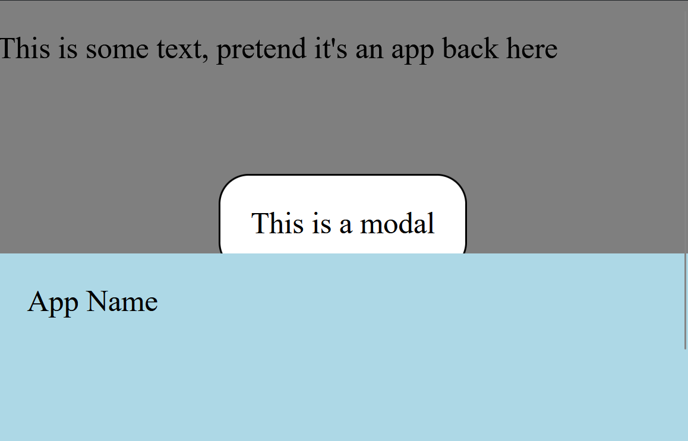
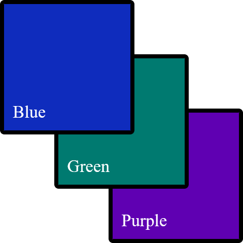
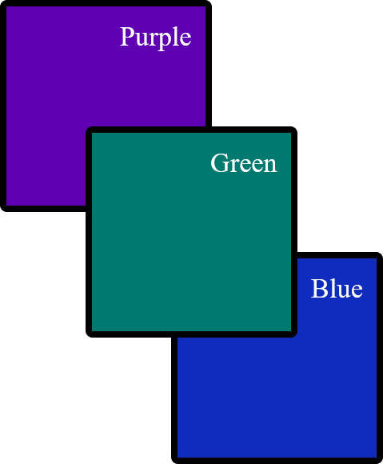
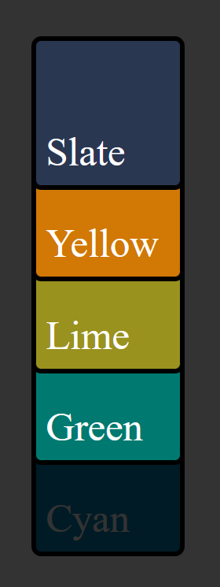
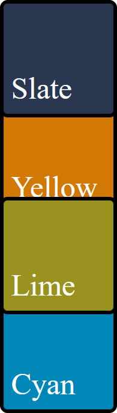
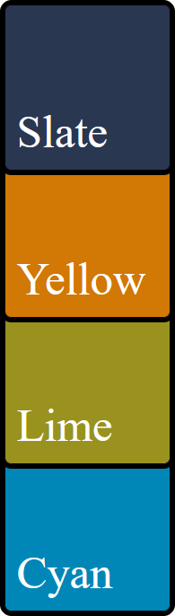

---
{
    title: "Why is z-index not working?! - Explaining CSS Stacking Context",
    description: "",
    published: '2023-01-01T22:12:03.284Z',
    authors: ['crutchcorn'],
    tags: ['webdev', 'css', 'html'],
    attached: [],
    license: 'cc-by-4'
}
---

Dimensions are weird. While most web apps seem to focus on the `x` and `y` axis, representing a 2D plane that the user interacts with, there's actually a `z` axis that's often ignored. Some browsers, such as [Microsoft Edge, even provide a way to see a website blown up into a 3D view](https://docs.microsoft.com/en-us/microsoft-edge/devtools-guide-chromium/3d-view/):


While this is cool, by introducing a third dimension to our webpages, we introduces the ability for elements to overlap with one another. Managing overlapping issues using CSS is _tricky_. 

Sure, you have [`z-index`](https://developer.mozilla.org/en-US/docs/Web/CSS/z-index), which many claim is an easy way to manage an element's `z` axis, but it seems so brittle and inconsistent!

> This article doesn't expect you to have pre-existing `z-index` knowledge. If you're being sent this article to learn how `z-index` works, you're in the right place.

For example, let's think about modals. Modals are UI elements that enable you to display information in a box that rests above the rest of your page's contents. This is what an example modal looks like from [Google Drive](https://drive.google.com/):



[Despite some some UX headaches modals can introduce into an app](https://modalzmodalzmodalz.com/), they're still a widely used UI element in many applications today. While building sufficiently useful modals can be a challenging task, a rudimentary modal can be completed even without JavaScript.

Let's use some CSS and HTML in order to build a basic modal:

```html
<div>
  <div id="body">
    <p>This is some text, pretend it's an app back here</p>
  </div>
  <div id="modal-container">
    <div id="modal">This is a modal</div>
  </div>
</div>

<style>
#modal-container {
  position: fixed;
  top: 0;
  left: 0;
  height: 100%;
  width: 100%;
  display: flex;
  justify-content: center;
  align-items: center;
  background: rgba(0, 0, 0, 0.5);
}

#modal {
  background: white;
  border: 1px solid black;
  padding: 1rem;
  border-radius: 1rem;
}
</style>
```


Tada! 🎉 Now we have a fairly basic modal to display whatever HTML we want inside.

But let's say that we keep building out the page. As we do, we might, for example, want to have a `footer` beneath our main page's content.

```html
<div>
  <div id="body" style="min-height: 50vh">
    <p>This is some text, pretend it's an app back here</p>
  </div>
  <div id="modal-container">
    <div id="modal">This is a modal</div>
  </div>
  <footer style="min-height: 50vh">App Name</footer>
</div>

<style>
#modal-container {
  position: fixed;
  top: 0;
  left: 0;
  height: 100%;
  width: 100%;
  display: flex;
  justify-content: center;
  align-items: center;
  background: rgba(0, 0, 0, 0.5);
}

#modal {
  background: white;
  border: 1px solid black;
  padding: 1rem;
  border-radius: 1rem;
}

footer {
  position: relative;
  background: lightblue;
  padding: 1rem;
}
</style>
```

At first glance, this might look like it's been successful, but let's take a look at the rendered output:



Oh dear! Why is the footer rendered above the modal?

Well, my friends, the modal is rendering under the footer due to something called "The Stacking Context".

# What is the stacking context?

While the concept of the "Stacking Context" in the DOM is quite complex, here's the gist of it:

While we often think about our browser as displaying a 2-dimensional image as a result of our HTML and CSS, this isn't the case. Take the following code example:

```html
<div id="container">
  <div id="blue">Blue</div>
  <div id="green">Green</div>
  <div id="purple">Purple</div>
</div>

<style>
#container {
  display: relative;
}

#blue,
#green,
#purple {
  height: 100px;
  width: 100px;
  position: absolute;
  padding: 8px;
  color: white;
  border: 4px solid black;
  border-radius: 4px;
}

#blue {
  background: #0f2cbd;
  left: 50px;
  top: 50px;
}

#green {
  background: #007a70;
  left: 100px;
  top: 100px;
}

#purple {
  background: #5f00b2;
  left: 150px;
  top: 150px;
}
</style>
```

Here, we have three different boxes that overlap on one another. Given that they overlap, **which one do you think takes priority and, at least visually, is on top of the other boxes**?

<br/>

No, really, guess! Stop reading, take a look at the code, and take a guess. 😊

<br/>

<br/>

<br/>

<br/>

<br/>

<br/>

<br/>

<br/>

<br/>

<br/>

<br/>

Ready to see the answer?

<br/>

<br/>

<br/>

<br/>

<br/>

<br/>

<br/>

<br/>

<br/>

<br/>

<br/>

<br/>

OK, here it is:


While some CSS pros might assume that purple is the priority [due to order in which the CSS is laid out, just like other CSS rules](https://wattenberger.com/blog/css-cascade#position), this isn't what's happening here.

Notice how the purple box seemingly remains on "top" when we re-arrange the CSS rules:

```css
#purple {
  background: #5f00b2;
  left: 150px;
  top: 150px;
}

#green {
  background: #007a70;
  left: 100px;
  top: 100px;
}

#blue {
  background: #0f2cbd;
  left: 50px;
  top: 50px;
}
```


> If changing the CSS order doesn't re-arrange the boxes, then what does?

Well...

# Re-arrange HTML Elements to Change the Stacking Order

Let's take the HTML we had before, and re-arrange it a bit:

```html
<div id="container">
  <div id="purple">Purple</div>
  <div id="green">Green</div>
  <div id="blue">Blue</div>
</div>
```

Now if we look at the box order, we'll see...



Now our boxes have reversed their height order! This is because one of the deciding factors of an element's `z` position is its relationship to other elements.

# Positioned Elements Behave Differently Than Non-Positioned Elements

> This is where things get confusing. Take your time with this chapter, it's okay to have to re-read this section multiple times.

While we were using `absolute`ly positioned elements for a simple demo before, let's take a step back and change our elements to be positioned using `margin` instead:

```css
<div id="container">
  <div id="purple">Purple</div>
  <div id="green">Green</div>
  <div id="blue">Blue</div>
</div>

<style>
#container {
  display: relative;
}

#container > div:nth-child(1) {
  margin-top: 50px;
  margin-left: 50px;
}

#container > div:nth-child(2) {
  margin-top: -50px;
  margin-left: 100px;
}

#container > div:nth-child(3) {
  margin-top: -50px;
  margin-left: 150px;
}

#blue,
#green,
#purple {
  height: 100px;
  width: 100px;
  padding: 8px;
  color: white;
  border: 4px solid black;
  border-radius: 4px;
}

#blue {
  background: #0f2cbd;
}

#green {
  background: #007a70;
}

#purple {
  background: #5f00b2;
}
</style>
```

Looks like a familiar output:


While working on styling, we wanted our `green` box to move to the left when you hover over it. This is straightforward enough to do [using CSS animations](https://developer.mozilla.org/en-US/docs/Web/CSS/CSS_Animations/Using_CSS_animations), let's add it:

```css
#green {
  background: #007a70;
  position: relative;
  left: 0px;
  transition: left 300ms ease-in-out;
}

#green:hover {
  left: 20px;
}
```

While our green button now smoothly moves left when you hover over it, there's a new problem: The green box is now on top of the purple and blue boxes.



This is because positioning an element introduces a "stacked context". This means that our `relative` positioned element takes priority in the `z` layer over non-positioned elements.

# Understanding more rules of Stacked Contexts

While `relative` positioning is one way that you can take priority in a stacked context, it's far from the only way to do so. Here's a list of CSS rules that will take priority in a stacked context, from the lowest priority to the highest priority:

- Positioned elements with a negative `z-index`
- The background and borders of the parent element
- Non-positioned elements
- Elements with a `float` style applied
- Non-positioned inline elements
- Positioned elements without a `z-index` applied, or with a `z-index` of `0`

So, if we have the following HTML:

```html
<div class="container" style="background: rgba(0, 0, 0, 0.8)">
    <div class="box slate" style="position: relative">Slate</div>
    <div class="box yellow" style="display: inline-block">Yellow</div>
    <div class="box lime" style="float: left">Lime</div>
    <div class="box green" style="">Green</div>
    <div class="box cyan" style="position: relative; z-index: -1">Cyan</div>
</div>
```

We would see, from top to bottom:

- A `slate` colored box
- A `yellow` colored box
- A `lime` colored box
- A `green` colored box
- The `container`'s background
- A `cyan` colored box



<!-- Editor's note: I'm cheating in that screenshot. `float` and `inline-display` are hard to makee elements align again, so I'm just using `z-index` for demonstration purposes -->

All of these rules are superseded by the order of the elements within the HTML, as we learned before. For example, with the following HTML:

```html
<div class="container" style="background: rgba(0, 0, 0, 0.8)">
  <div class="box slate" style="position: relative">Slate</div>
  <div class="box yellow" style="">Yellow</div>
  <div class="box lime" style="position: relative">Lime</div>
  <div class="box cyan" style="">Cyan</div>
</div>
```

You would see the following order of elements:

-  Lime
- Slate
- Cyan
- Yellow


This is because the `lime` and `slate` take priority over `yellow` and `cyan` thanks to their `relative` positioning, but are still in HTML order within the same `z` level priority and within the same stacking context. 

# Creating Stacking Contexts

> "Welp, that's enough reading in the book today"

You think to yourself. You go lay down and get some sleep. In your dreams, you can still hear the book speaking to you:

> [...] are still in HTML order within the same `z` level priority and within the same stacking context

> [...] within the same stacking context

The book repeats itself:

> [...] within the same stacking context

You wake up, realize that you don't yet know what that sentence means, and think to yourself:

> There's no way this gets even more complicated.

Unfortunately, it does.

----

At its heart, a stacking context is a group that you can move multiple items up or down the `z` axis at the same time.

Take the following HTML:

```html
<div class="container">
  <div id="top-container" style="position: relative">
    <div class="box slate" style="position: relative">Slate</div>
    <div class="box yellow" style="">Yellow</div>
  </div>
  <div id="bottom-container">
    <div class="box lime" style="position: relative">Lime</div>
    <div class="box cyan" style="">Cyan</div>
  </div>
</div>
```

What order do you think the `box`es are going to be in?



The answer is:

- Slate
- Lime
- Cyan
- Yellow

This is because, despite the parent `top-container` having `position: relative`, the `box`es are still within the same stacking context. This stacking context follows the same ordering rules as outlined before, which means that the positioned `slate` and `lime` `box`es take `z` priority over `cyan` and `yellow`.

Ready for the twist?

Let's add `z-index` to our `top-container`:

```html
<div class="container">
  <div style="position: relative; z-index: 1">
    <div class="box slate" style="position: relative">Slate</div>
    <div class="box yellow" style="">Yellow</div>
  </div>
  <div>
    <div class="box lime" style="position: relative">Lime</div>
    <div class="box cyan" style="">Cyan</div>
  </div>
</div>
```

Now what order do you think they'll be in?



- Slate
- Yellow
- Lime
- Cyan

This is because, in reality, what we're ordering here is not the `box`es, but instead is the `top-container` and `bottom-container` `div`s, **then** the `box`es, like so:

- `top-container`
  - `slate`
  - `yellow`
- `bottom-container`
  - `lime`
  - `cyan`

The reason this only occurred when we added a `z-index` to `top-container` is because that's when a new stacking context was created. When that context was created, we raised it to a higher `z` axis due to the same ordering rules as before.

> Remember, a stacking context is a grouping of elements that move together as a collection when the parent's `z` axis location is changed.

Stacking Contexts are created when:

- `z-index` is applied to a positioned element
- `z-index` is applied to a child of a `grid` or `flex` element

- Element with an [`opacity`](https://developer.mozilla.org/en-US/docs/Web/CSS/opacity) less than `1` 
- Element with any of the following properties:
  - [`transform`](https://developer.mozilla.org/en-US/docs/Web/CSS/transform)
  - [`filter`](https://developer.mozilla.org/en-US/docs/Web/CSS/filter)
  - [`backdrop-filter`](https://developer.mozilla.org/en-US/docs/Web/CSS/backdrop-filter)
  - [`perspective`](https://developer.mozilla.org/en-US/docs/Web/CSS/perspective)
  - [`clip-path`](https://developer.mozilla.org/en-US/docs/Web/CSS/clip-path)
  - [`mask`](https://developer.mozilla.org/en-US/docs/Web/CSS/mask) / [`mask-image`](https://developer.mozilla.org/en-US/docs/Web/CSS/mask-image) / [`mask-border`](https://developer.mozilla.org/en-US/docs/Web/CSS/mask-border)

> This list is non-exhaustive, but contains most of the highlights of when a stacking context is created.

It's worth mentioning that if a stacking context is created, then the element that created said stacking context is treated with priority `z` axis ordering.

For example, if you have:

```html
<div>
	<div style="position: absolute; top: 0; background: white">Absolute</div>
	<div style="opacity: 0.99; background: white">Opacity</div>
</div>
```

Then it will show "Absolute" above "Opacity", thanks to the order of the HTML sequence; this is all despite positioned elements typically being prioritized above HTML sequencing.

If we remove the `opacity: 0.99` from the `"Opacity"` `div`, then `"Absolute`" will be on top.

# Stacking Stacking Contexts

While the previous sections have been head scratchers, let's dive into mind melting territory: You can contain stacking contexts within other stacking contexts. 🤯

// TODO: Write


# The Problem with Stacking Contexts

// TODO: Explain that `z-index` cannot escape


> If you want to learn more about the "stacking context", I'd suggest reading through the following resources:
>
> - [Stacking elements - CSS z-index and stacking context explained - NetGen](https://netgen.io/blog/stacking-elements-css-z-index-and-stacking-context-explained)
> - [The stacking context - MDN](https://developer.mozilla.org/en-US/docs/Web/CSS/CSS_Positioning/Understanding_z_index/The_stacking_context)
> - [What The Heck, z-index?? - Josh W Comeau](https://www.joshwcomeau.com/css/stacking-contexts/)
> - [What No One Told You About Z-Index - Philip Walton](https://philipwalton.com/articles/what-no-one-told-you-about-z-index/)
> - [Appendix E. Elaborate description of Stacking Contexts - W3C](https://www.w3.org/TR/CSS2/zindex.html)

