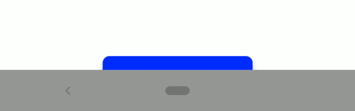
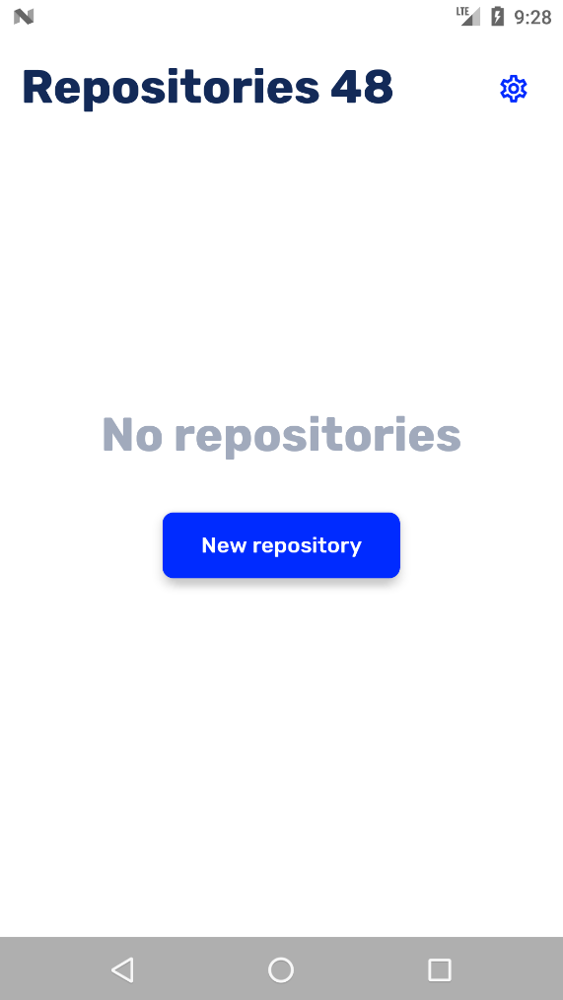

---
{
	title: "Draw under the Android NavBar Using React Native",
	description: "Android allows you to draw content under the navigation bar. It's a neat effect! Let's add that to our React Native apps.",
	published: '2020-04-16T05:12:03.284Z',
	authors: ['crutchcorn'],
	tags: ['android', 'react native'],
	attached: [],
	license: 'cc-by-nc-sa-4'
}
---

While working on [my React Native mobile app](https://gitshark.dev), [the super-talented designer for the project](/unicorns/edpratti) raised an interesting question to me:

> "Are we able to draw under the navigation bar and status bar? [Google officially recommends new apps to do so](https://youtu.be/Nf-fP2u9vjI).

The idea of drawing under the navbar intrigued me. After lots of research, I was finally able to implement it in my app, but not without struggles. Let's walk through how to do it manually and what I ended up doing to solve the issue myself.

Feel free to follow along with the code samples, but if you're looking for the easiest solution, [you might want to read to the bottom to see how to easily integrate it into your app without all of the manual work](#react-native-immersive-bars).

# The Wrong Way {#flag-layout-no-limits}

After doing some initial research, I found myself presented with various StackOverflows and official documentation pointing towards a Window flag [`FLAG_LAYOUT_NO_LIMITS`](https://developer.android.com/reference/android/view/WindowManager.LayoutParams#FLAG_LAYOUT_NO_LIMITS) to, quote:

> Window flag: allow window to extend outside of the screen.

This seemed perfect to me! Being able to draw content outside the edges of the screen would surely allow me to draw under the navbar, right? I looked for the `MainActivity.java` file that loads the project initially to make the configuration:

```
android > app > src > main > java > yourpackagepath > MainActivity.java
```

And added the respective flag to initialize once the app started:

```java
import android.os.Bundle;
import android.view.Window;
import android.view.WindowManager;

// ...

@Override
protected void onCreate(Bundle savedInstanceState) {
    Window w = getWindow();
    w.setFlags(
        WindowManager.LayoutParams.FLAG_LAYOUT_NO_LIMITS,
        WindowManager.LayoutParams.FLAG_LAYOUT_NO_LIMITS
    );
    super.onCreate(savedInstanceState);
}
```

Once this was done, I loaded my app and "et voilà"!


"Success," I'd thought to myself. Since the FAB was drawn under the navbar, I thought the goal had been achieved! However, once I tried [the `safe-area-context` package](https://github.com/th3rdwave/react-native-safe-area-context) to draw margins and paddings (to move the FAB above the navbar), I faced difficulties.

When I utilized the following code:

```jsx
import {useSafeArea} from "react-native-safe-area-context";

// ...

const insets = useSafeArea();

// ...

return <Text style={styles.headingText}>Repositories {insets.bottom}</Text>

```

I was expecting to see the text to read out the height of the navbar. Then, I'd be able to use the `bottom` property to position the FAB properly.


However, as you can see, it returned a height of `0`, which clearly wasn't the size of the navbar.

After some research, [I found out that the `safe-area-context` package does not work properly when using this flag](https://github.com/th3rdwave/react-native-safe-area-context/issues/8). It doesn't work because of [the underlying APIs that the library uses for Android detection](https://github.com/th3rdwave/react-native-safe-area-context/blob/master/android/src/main/java/com/th3rdwave/safeareacontext/SafeAreaViewManager.java) ([InsetsAPI](https://medium.com/androiddevelopers/windowinsets-listeners-to-layouts-8f9ccc8fa4d1)), does not support the `FLAG_LAYOUT_NO_LIMITS.` This was an automatic no-go for my app: I didn't want the contents of the app to be stuck under the navbar without a way to access it. I had to start over from the drawing board.

# Translucent Bars {#translucentcy}

After even further research, I'd found myself with a potential alternative: Translucent bars! I knew that the ability to draw under navbars was often accompanied with translucent bars in previous versions of Android! If we revert changes to the `MainActivity.java` file back to how they were initially, and simply update our `styles.xml` file located at:

```
android > app > src > main > res > values > styles.xml
```

And added the translucent flags, maybe that would work:

```xml
<resources>
    <!-- Base application theme. -->
    <style name="AppTheme" parent="Theme.AppCompat.Light.NoActionBar">
        <!-- Customize your theme here. -->
        <item name="android:textColor">#000000</item>
        <!-- Add these two new items -->
        <item name="android:windowTranslucentStatus">true</item>
        <item name="android:windowTranslucentNavigation">true</item>
    </style>
</resources>
```

After making the changes and restarting my app, I was greeted with the following:


Fantastic! It's not only drawing under the navbar, but it's also registering the correct `inset.bottom` height we wanted to display in the titlebar! That said, I was still hoping for a fully transparent navbar. I knew it was possible. Maybe if I added explicit code to make the navbar transparent, that would work:

```xml
<item name="android:statusBarColor">@android:color/transparent</item>
<item name="android:navigationBarColor">@android:color/transparent</item>
<item name="android:windowTranslucentStatus">true</item>
<item name="android:windowTranslucentNavigation">true</item>
```

Unfortunately for me, there was nothing brought about by this testing.

## Further Tests to no Avail {#fitsSystemWindows}

Before giving up on the `styles.xml` file, I tried two more flags that I thought might have helped.

```xml
 <!-- Boolean internal attribute to adjust view layout based on system windows such as the status bar.
    If true, adjusts the padding of this view to leave space for the system windows. API Level 1-->
<item name="android:fitsSystemWindows">true</item>
<!-- Flag indicating whether this Window is responsible for drawing the background for the system bars. API level 21-->
<item name="android:windowDrawsSystemBarBackgrounds">true</item>
```

Oddly enough, not only did this not solve the problem, but it made the bottom bar a solid color!



Drats! We'll have to start all over again.

# The Right Way

After re-reading some of the resources I was looking at, I realized the answer was in [the initial GitHub issue I was first looking into when `FLAG_LAYOUT_NO_LIMIT` didn't work](https://github.com/th3rdwave/react-native-safe-area-context/issues/8). It suggested using [a View flag called `SYSTEM_UI_FLAG_LAYOUT_HIDE_NAVIGATION`](https://developer.android.com/reference/android/view/View#SYSTEM_UI_FLAG_LAYOUT_HIDE_NAVIGATION). After reading the documentation for the flag, I knew it was a step in the right direction:

> View would like its window to be laid out as if it has requested `SYSTEM_UI_FLAG_HIDE_NAVIGATION`, even if it currently hasn't.

We'd also likely want to apply [the `SYSTEM_UI_FLAG_LAYOUT_STABLE` flag as well](https://developer.android.com/reference/android/view/View#SYSTEM_UI_FLAG_LAYOUT_STABLE):

> When using other layout flags, we would like a stable view of the content insets given to `fitSystemWindows`

While this might be a bit confusing, it's essentially saying that not only would it draw under the navbar, but it would do so consistently, allowing us to draw under the navbar, just like we wanted!

For good measure, let's add in explicitly transparent navbars and status bar codes:

```java
// MainActivity.java
import android.graphics.Color;
import android.os.Bundle;
import android.view.View;
import android.view.Window;

// ...

@Override
protected void onCreate(Bundle savedInstanceState) {
    Window w = getWindow();
    w.setStatusBarColor(Color.TRANSPARENT);
    w.setNavigationBarColor(Color.TRANSPARENT);
    w.getDecorView().setSystemUiVisibility(View.SYSTEM_UI_FLAG_LAYOUT_HIDE_NAVIGATION | View.SYSTEM_UI_FLAG_LAYOUT_STABLE);
    super.onCreate(savedInstanceState);
}
```


That's done it! Not only is the button being drawn under the navbar fully transparently, but the number at the top of the screen indicates that the Inset API is registering the height of the navbar still! This behavior is exactly what we were hoping for!

> If your bottom bar is still a solid color like the one here:
> 
>
> Then you've forgotten to remove the `fitsSystemWindows` flag that we added in our `styles.xml` flag previously. Once that (and the `windowDrawsSystemBarBackgrounds` flag) was removed, it worked for me

# Other API Versions {#api-versions}

While the code I've mentioned thus far works, it only really works _well_ on Android O (API Level 26) and above. That's only about 60% of Android devices out there! Why does this only work well on Android O? Well, if you have a light background, it only makes sense to have dark buttons in the navigation bar. That functionality has only existed since [Android introduced the `SYSTEM_UI_FLAG_LIGHT_NAVIGATION_BAR` Vew flag in API 26](https://developer.android.com/reference/android/view/View#SYSTEM_UI_FLAG_LIGHT_NAVIGATION_BAR). To edge-case this, we'll need to add some conditional logic to draw our own dark translucent bar for versions lower than this:

```java
if ( Build.VERSION.SDK_INT <= Build.VERSION_CODES.O) {
	w.setNavigationBarColor(Color.parseColor("#50000000"));
} else {
	w.setNavigationBarColor(Color.TRANSPARENT);
}
```

Likewise, [the support for dark status bar icons has only been present since API Level 23 (Android M)](https://developer.android.com/reference/android/view/WindowManager.LayoutParams#SYSTEM_UI_FLAG_LIGHT_STATUS_BAR). This too will need to be edge-cased:

```java
if (Build.VERSION.SDK_INT <= Build.VERSION_CODES.M) {
	w.setStatusBarColor(Color.parseColor("#50000000"));
} else {
	w.setStatusBarColor(Color.TRANSPARENT);
}
```

When viewing the app on older versions of Android (like M), you'll see the respective bars as a semi-transparent bar:


# The Easy Method {#react-native-immersive-bars}

Let's not sugar coat it: It's tedious to make changes to native Android code in order to support all of the various API levels there are, the various forms of OEM issues that could arise. Likewise, if your app implements a dark mode, there's now another level of challenge: You have to toggle the light and dark navigation buttons yourself!

Fear not, fellow developer! I've taken my learnings from implementing this into [my mobile Git Client](https://gitshark.dev) and created a package for you to utilize!

<https://github.com/crutchcorn/react-native-immersive-bars>

It's as simple to add as:

```
yarn add react-native-immersive-bars
```

```jsx
import {changeBarColors} from 'react-native-immersive-bars';

// ...

React.useEffect(() => {
    changeBarColors(isDarkMode);
}, [isDarkMode]);
```

It supports dark mode switching, as many API levels as React Native does, and much more!

<video src="./android_10.mp4" title="A working dark switch with transparent navbar"></video>

# Conclusion

This feature was not a trivial one for me to implement. Not often is it that such a short article reflects how long I'd spent debugging and researching this issue. I want to make sure to thank [James Fenn](/unicorns/fennifith) and [Sasi Kanth](https://github.com/msasikanth) for helping me debug and research for this. I'm happy I did so, though. I think it adds a nice level of polish to my app, and I think you'll find the same in your app as well. Hopefully, the package I made is able to ease the process for you. If you have any comments or questions regarding the package, please refer to the GitHub issues for said project.

Otherwise, if you have comments or questions about the article, you can leave them in the comments down below. We also have a newsletter that you can subscribe to for more articles like this: I plan on writing much more about React Native as I develop my app.
