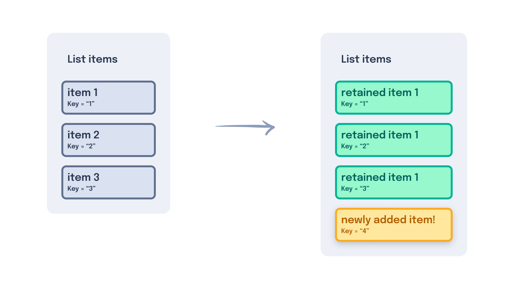

---
{
    title: "Dynamic HTML",
    description: "One of the primary advantages of using a framework is the ability to quickly generate dynamic HTML from JavaScript logic. Let's walk through some examples.",
    published: '2023-01-01T22:12:03.284Z',
    authors: ['crutchcorn'],
    tags: ['webdev'],
    attached: [],
    order: 3,
    series: "The Framework Field Guide"
}
---

Previously, we learned how to create components for our file application. These components included a way to create a component tree, add inputs to each component to pass data, and add an output of data back to a parent component.

Where we last left off, we manually input a list of files, which included file names and dates inside of a `button`. Let's take a look at our file component to start:

<!-- tabs:start -->

### React

```jsx
const File = ({ href, fileName, isSelected, onSelected }) => {
  return (
    <button
      onClick={onSelected}
      style={
        isSelected
          ? { backgroundColor: 'blue', color: 'white' }
          : { backgroundColor: 'white', color: 'blue' }
      }
    >
      <a href={href}>{fileName}</a>
      <FileDate inputDate={new Date()} />
    </button>
  );
};
```

### Angular

```typescript
@Component({
  selector: 'file',
  template: `
    <button
      (click)="selected.emit()"
      [style]="
        isSelected
          ? { backgroundColor: 'blue', color: 'white' }
          : { backgroundColor: 'white', color: 'blue' }
      "
    >
      <a [href]="href">
        {{ fileName }}
        <file-date [inputDate]="inputDate"></file-date>
      </a>
    </button>
  `,
})
export class FileComponent {
  @Input() fileName: string;
  @Input() href: string;
  @Input() isSelected: boolean;
  @Output() selected = new EventEmitter();
}
```

### Vue

```vue
<template>
  <button
    v-on:click="$emit('selected')"
    :style="isSelected ? { backgroundColor: 'blue', color: 'white' } : { backgroundColor: 'white', color: 'blue' }"
  >
    <a :href="href">
      {{ fileName }}
      <file-date [inputDate]="inputDate"></file-date>
    </a>
  </button>
</template>

<script setup>
import { defineProps, defineEmits } from 'vue'

const props = defineProps(['isSelected', 'fileName', 'href'])

defineEmits(['selected'])
</script>
```

<!-- tabs:end -->

This is a strong basis for a component without needing many changes for the moment.

One thing we would love to add is the ability to see folders listed alongside files. While we _could_ - and arguably should - add in a component that copy/pastes the code from the `File` component to create a new `Folder` component, let's reuse what we already have!

To do this, we'll create a new property called `isFolder`, which hides the date when set to true.

# Conditional Rendering

While one way to do this is to utilize `display: none`, let's go one step further and hide the rendered HTML entirely when not present. Here's a simplified example:

<!-- tabs:start -->

### React

```jsx {2}
const ConditionalRender = ({ bool }) => {
  return (
    <div>{bool && <p>Text here</p>}</div>
  );
};
```

Here, we're using React's `{}` JavaScript binding to add in an [`AND` statement](https://developer.mozilla.org/en-US/docs/Web/JavaScript/Reference/Operators/Logical_AND). This works by utilizing Boolean logic of ["short-circuiting"](https://developer.mozilla.org/en-US/docs/Web/JavaScript/Reference/Operators/Logical_AND#short-circuit_evaluation). This means that if we have:

```javascript
const val = true || {}
```

`val` will be set to `{}`, while if we have:

```javascript
const val = false || {}
```

`val` will be set to `false`. 

React then uses this return value to render the value when the condition inside of the curly braces is **not** `undefined` or `null`.

This means that these examples **will** render their contained values:

```jsx
<div>{0}</div>
<div>{"Hello"}</div>
<div>{true || <Comp/>}</div>
<div>{true}</div>
// Renders as
<div>0</div>
<div>Hello</div>
<div><Comp/></div>
<div>true</div>
```

But the following examples **will not** render their contained values:

```jsx
<div>{undefined}</div>
<div>{false}</div>
// Both render as
<div></div>
```

### Angular

```typescript {2}
@Component({
  selector: 'conditional-render',
  template: `<div><p *ngIf="bool">Text here</p></div>`,
})
export class ConditionalRenderComponent {
  @Input() bool: boolean;
}
```

### Vue

```vue
<template>
  <div><p v-if="bool">Text here</p></div>
</template>

<script setup>
import { defineProps } from 'vue'

const props = defineProps(['bool'])
</script>
```

<!-- tabs:end -->

In this example, when we pass `bool` as `true`, the component's HTML is rendered as:

```html
<div><p>Text here</p></div>
```

But when `bool` is set to `false`, it instead renders the following HTML:

```html
<div></div>
```

This is possible because React, Angular, and Vue control what is rendered to the screen. Utilizing this, they can remove or add HTML rendered to the DOM with nothing more than a simple Boolean instruction.

Knowing this, let's add conditional rendering to our application.

## Conditional Rendering our Date

Right now, we have a list of files to present to the user. However, if we look back at our mockups, we'll notice that we wanted to list folders alongside files.

Luckily for us, our `File` component already manages a lot that we would want a `Folder` component to as well. For example, when the user clicks on a folder, we want to select the folder like any other file in a list.

However, something currently preventing us from using `File` for our folders is that folders do not have a creation date. Otherwise, it becomes unclear to the user if the listed date refers to the first file created or the date the folder itself was created.

One way we could solve this problem and still reuse the `File` component to list out folders is to conditionally render the date if we know we're showing a folder instead of a file.

Let's add an input called `isFolder` and prevent the date from rendering if set to `true`.

Adding this to our component is just as easy as we outlined before:

<!-- tabs:start -->

### React

```jsx {11}
const File = ({ href, fileName, isSelected, onSelected, isFolder }) => {
  return (
    <button
      onClick={onSelected}
      style={
        isSelected
          ? { backgroundColor: 'blue', color: 'white' }
          : { backgroundColor: 'white', color: 'blue' }
      }
    >
      <a href={href}>{fileName}</a>
      {isFolder && <FileDate inputDate={new Date()} />}
    </button>
  );
};
```

### Angular

```typescript {13}
@Component({
  selector: 'file',
  template: `
    <button
      (click)="selected.emit()"
      [style]="
        isSelected
          ? { backgroundColor: 'blue', color: 'white' }
          : { backgroundColor: 'white', color: 'blue' }
      "
    >
      <a [href]="href">
        {{ fileName }}
        <file-date *ngIf="isFolder" [inputDate]="inputDate"></file-date>
      </a>
    </button>
  `,
})
export class FileComponent {
  @Input() fileName: string;
  @Input() href: string;
  @Input() isSelected: boolean;
  @Input() isFolder: boolean;
  @Output() selected = new EventEmitter();
}
```

### Vue

```vue
<template>
  <button
    v-on:click="$emit('selected')"
    :style="isSelected ? { backgroundColor: 'blue', color: 'white' } : { backgroundColor: 'white', color: 'blue' }"
  >
    <a :href="href">
      {{ fileName }}
      <file-date v-if="isFolder" [inputDate]="inputDate"></file-date>
    </a>
  </button>
</template>

<script setup>
import { defineProps, defineEmits } from 'vue'

const props = defineProps(['isSelected', 'isFolder', 'fileName', 'href'])

defineEmits(['selected'])
</script>
```

<!-- tabs:end -->

# Conditional Branches

One other way we can use conditional rendering inside of our `File` component is to inform the user if a listed item is a folder or file using a bit of text.

<!-- tabs:start -->

## React

```jsx
{isFolder && <span>Type: Folder</span>}
{!isFolder && <span>Type: File</span>}
```

## Angular

```html
<span *ngIf="isFolder">Type: Folder</span>
<span *ngIf="!isFolder">Type: File</span>
```

## Vue

```html
<span v-if="isFolder">Type: Folder</span>
<span v-if="!isFolder">Type: File</span>
```

<!-- tabs:end -->

While this works, those familiar with `if` statements in JavaScript will quickly point out that this is simply reconstructing an [`if ... else` statement](https://developer.mozilla.org/en-US/docs/Web/JavaScript/Reference/Statements/if...else).

Like the JavaScript environment these frameworks run in, they also implement a similar API for this exact purpose.


<!-- tabs:start -->

## React

```jsx
{
  isFolder ?
    <span>Type: Folder</span> :
    <span>Type: File</span>
}
```

## Angular

```html
<span *ngIf="isFolder; else fileDisplay">Type: Folder</span>
<ng-template #fileDisplay><span>Type: File</span></ng-template>
```

Undoubtably you're looking at this snippet of code and wondering what `ng-template` is doing here. 

The long answer is a bit complicated and might distract from the current focus of this chapter — [We will answer this further in our "Content Reference" chapter](/posts/content-reference#ng-templates).

The short answer is as simple as: "An `ng-template` is a bit of HTML that you can assign to an in-template variable for Angular to use in conditional statements and a few other places."

With this known, we can explain that the syntax looks something like this:

```html
<ng-template #varNameHere><p>HTML tags go in here as children</p></ng-template>
```

Which we can then use in an `*ngIf` statement like so:

```html
*ngIf="bool; else varNameHere"
```

## Vue

```html
<span v-if="isFolder">Type: Folder</span>
<span v-else>Type: File</span>
```

A `v-else` tag **must** immediately follow a `v-if`; otherwise, it won't work. 

<!-- tabs:end -->

## Expanded Branches

While an `if ... else` works wonders if you only have a single Boolean value you need to check, you'll often need more than a single conditional branch to check against.

For example, what if we added an `isImage` Boolean to differentiate between images and other file types?

While we could move back to a simple `if` statement for each condition:

<!-- tabs:start -->

### React

```jsx
{isFolder && <span>Type: Folder</span>}
{!isFolder && isImage && <span>Type: Image</span>}
{!isFolder && !isImage && <span>Type: File</span>}
```

### Angular

```html
<span *ngIf="isFolder">Type: Folder</span>
<span *ngIf="!isFolder && isImage">Type: Image</span>
<span *ngIf="!isFolder && !isImage">Type: File</span>
```

### Vue

```html
<span v-if="isFolder">Type: Folder</span>
<span v-if="!isFolder && isImage">Type: Image</span>
<span v-if="!isFolder && !isImage">Type: File</span>
```

<!-- tabs:end -->

This can get hard to read with multiple conditionals in a row. As a result, these frameworks have tools that you can use to make things a bit more readable.

<!-- tabs:start -->

### React

```jsx
{
  isFolder ?
    <span>Type: Folder</span> :
    isImage ?
      <span>Type: Image</span> :
      <span>Type: File</span>
}
```

### Angular

```html
<ng-container [ngSwitch]="true">
  <span *ngSwitchCase="isFolder">Type: Folder</span>
  <span *ngSwitchCase="isImage">Type: Image</span>
  <span *ngSwitchDefault>Type: File</span>
</ng-container>
```

Angular does not support `else if` statements in the template like the other frameworks do.

Instead, Angular has a mechanism for utilizing [`switch/case` statements](https://developer.mozilla.org/en-US/docs/Web/JavaScript/Reference/Statements/switch). These switch/case statements work by matching a value from a `case` to the `switch` value. So, if you had:

```html
<ng-container [ngSwitch]="'folder'">
  <span *ngSwitchCase="'folder'">Type: Folder</span>
  <span *ngSwitchCase="'image'">Type: Image</span>
  <span *ngSwitchDefault>Type: File</span>
</ng-container>
```

It would render:

```html
<span>Type: Folder</span>
```

Because the `[ngSwitch]` value of `'folder'` matched the `ngSwitchCase` value of `'folder'`.

Using this tool, we can simply set the `ngSwitch` value to `true` and add a conditional into the `ngSwitchCase`.

### Vue

```html
<span v-if="isFolder">Type: Folder</span>
<span v-else-if="isImage">Type: Image</span>
<span v-else>Type: File</span>
```

Once again, the `v-else-if` and `v-else` tags must follow one another to work as intended.

<!-- tabs:end -->

# Rendering Lists

While we've primarily focused on our `File` component until now, let's take another look at our `FileList` component.

<!-- tabs:start -->

## React

```jsx
const FileList = () => {
  const [selectedIndex, setSelectedIndex] = useState(-1);

  const onSelected = (idx) => {
    if (selectedIndex === idx) {
      setSelectedIndex(-1);
      return;
    }
    setSelectedIndex(idx);
  };

  return (
    <ul>
      <File
        isSelected={selectedIndex === 0}
        onSelected={() => onSelected(0)}
        fileName="File one"
        href="/file/file_one"
        isFolder={false}
      />
      <File
        isSelected={selectedIndex === 1}
        onSelected={() => onSelected(1)}
        fileName="File two"
        href="/file/file_two"
        isFolder={false}
      />
      <File
        isSelected={selectedIndex === 2}
        onSelected={() => onSelected(2)}
        fileName="File three"
        href="/file/file_three"
        isFolder={false}
      />
    </ul>
  );
};
```

## Angular

```typescript
@Component({
  selector: 'file-list',
  template: `
    <ul>
      <file
        (selected)="onSelected(0)"
        [isSelected]="selectedIndex === 0"
        fileName="File one" 
        href="/file/file_one"
        [isFolder]="false"
      ></file>
      <file
        (selected)="onSelected(1)"
        [isSelected]="selectedIndex === 1"
        fileName="File two" 
        href="/file/file_two"
        [isFolder]="false"
      ></file>
      <file
        (selected)="onSelected(2)"
        [isSelected]="selectedIndex === 2"
        fileName="File three" 
        href="/file/file_three"
        [isFolder]="false"
      ></file>
    </ul>
  `,
})
export class FileListComponent {
  selectedIndex = -1;

  onSelected(idx) {
    if (this.selectedIndex === idx) {
      this.selectedIndex = -1;
      return;
    }
    this.selectedIndex = idx;
  }
}
```

## Vue

```vue
<template>
  <ul>
    <file
      @selected="onSelected(0)"
      :isSelected="selectedIndex === 0"
      fileName="File one"
      href="/file/file_one"
      :isFolder="false"
    ></file>
    <file
      @selected="onSelected(1)"
      :isSelected="selectedIndex === 1"
      fileName="File two"
      href="/file/file_two"
      :isFolder="false"
    ></file>
    <file
      @selected="onSelected(2)"
      :isSelected="selectedIndex === 2"
      fileName="File three"
      href="/file/file_three"
      :isFolder="false"
    ></file>
  </ul>
</template>

<script setup>
import { ref } from 'vue'
import File from './File.vue'

const selectedIndex = ref(-1)

function onSelected(idx) {
  if (selectedIndex.value === idx) {
    selectedIndex.value = -1
    return
  }
  selectedIndex.value = idx
}
</script>
```

<!-- tabs:end -->

Upon second glance, something that might immediately jump out at you is just how long these code samples are! Interestingly, this is primarily due to the copy-pasted nature of our `File` component being repeated.

What's more, this method of hardcoding file components means that we cannot create new files in JavaScript and display them in the DOM.

Let's fix that by replacing the copy-pasted components with a loop and an array.

<!-- tabs:start -->

## React

```jsx {0-16,31-37}
const filesArray = [
    {
        fileName: "File one",
        href: "/file/file_one",
        isFolder: false
    },
    {
        fileName: "File two",
        href: "/file/file_two",
        isFolder: false
    },
    {
        fileName: "File three",
        href: "/file/file_three",
        isFolder: false
    }
]

const FileList = () => {
  const [selectedIndex, setSelectedIndex] = useState(-1);

  const onSelected = (idx) => {
    if (selectedIndex === idx) {
      setSelectedIndex(-1);
      return;
    }
    setSelectedIndex(idx);
  };

  return (
    <ul>
      {filesArray.map((file, i) => <File
        isSelected={selectedIndex === i}
        onSelected={() => onSelected(i)}
        fileName={file.fileName}
        href={file.href}
        isFolder={file.isFolder}
      />}
    </ul>
  );
};
```

React uses [JavaScript's built-in `Array.map` method](https://developer.mozilla.org/en-US/docs/Web/JavaScript/Reference/Global_Objects/Array/map) to loop through each item and map them to some React component.

We can then use the second argument inside of the `map` to gain access to the index of the looped item.

## Angular

```typescript {4-11,26-42}
@Component({
  selector: 'file-list',
  template: `
    <ul>
      <file
        *ngFor="let file of filesArray; let i = index"
        (selected)="onSelected(i)"
        [isSelected]="selectedIndex === i"
        [fileName]="file.fileName" 
        [href]="file.href"
        [isFolder]="file.isFolder"
      ></file>
    </ul>
  `,
})
export class FileListComponent {
  selectedIndex = -1;

  onSelected(idx) {
    if (this.selectedIndex === idx) {
      this.selectedIndex = -1;
      return;
    }
    this.selectedIndex = idx;
  }
    
  filesArray = [
    {
        fileName: "File one",
        href: "/file/file_one",
        isFolder: false
    },
    {
        fileName: "File two",
        href: "/file/file_two",
        isFolder: false
    },
    {
        fileName: "File three",
        href: "/file/file_three",
        isFolder: false
    }
  ]
}
```

Inside our `ngFor`, `index` may not seem like it is being defined; however, Angular declares it whenever you attempt to utilize `ngFor` under the hood. Assigning it to a template variable using `let` allows you to use it as the index of the looped item.

## Vue

```vue
<template>
  <ul>
    <file
      v-for="(file, i) in filesArray"
      @selected="onSelected(i)"
      :isSelected="selectedIndex === i"
      :fileName="file.fileName"
      :href="file.href"
      :isFolder="file.isFolder"
    ></file>
  </ul>
</template>

<script setup>
import { ref } from 'vue'
import File from './File.vue'

const filesArray = [
  {
    fileName: 'File one',
    href: '/file/file_one',
    isFolder: false,
  },
  {
    fileName: 'File two',
    href: '/file/file_two',
    isFolder: false,
  },
  {
    fileName: 'File three',
    href: '/file/file_three',
    isFolder: false,
  },
]

const selectedIndex = ref(-1)

function onSelected(idx) {
  if (selectedIndex.value === idx) {
    selectedIndex.value = -1
    return
  }
  selectedIndex.value = idx
}
</script>
```

<!-- tabs:end -->

If we look at the rendered output, we can see that we have all three files listing out as expected!

Now, all it would take to add a new item to the list of our files is to `push` to said array and force a re-render.

## Keys

If you're using React, you may encounter an error like the following:

> Warning: Each child in a list should have a unique "key" prop.

Or, in Vue, the error might say:

> Elements in iteration expect to have 'v-bind:key' directives

This is because each of these frameworks can only keep track of what's what inside a loop using a manually input unique ID of some kind.

If you don't provide a unique ID when you re-render the loop, it will destroy the entire tree.

Say you have the following:

<!-- tabs:start -->

### React

```jsx
const WordList = () => {
  const [words, setWords] = React.useState([]);

  const addWord = () => {
    const newWord = getRandomWord();
    // Remove ability for duplicate words
    if (words.includes(newWord)) return;
    setWords([...words, newWord]);
  };

  return (
    <div>
      <button onClick={addWord}>Add word</button>
      <ul>
        {words.map((word) => {
          return <li>{word.word}</li>;
        })}
      </ul>
    </div>
  );
};

const wordDatabase = [
  { word: 'who', id: 1 },
  { word: 'what', id: 2 },
  { word: 'when', id: 3 },
  { word: 'where', id: 4 },
  { word: 'why', id: 5 },
  { word: 'how', id: 6 },
];

function getRandomWord() {
  return wordDatabase[Math.floor(Math.random() * wordDatabase.length)];
}
```

### Angular

```typescript
import { Component } from '@angular/core';

@Component({
  selector: 'word-list',
  template: `
  <div>
      <button (click)="addWord()">Add word</button>
      <ul>
        <li *ngFor="let word of words">{{word.word}}</li>
      </ul>
    </div>
  `,
})
export class WordListComponent {
  words: Array<{ word: string; id: number }> = [];

  addWord() {
    const newWord = getRandomWord();
    // Remove ability for duplicate words
    if (this.words.includes(newWord)) return;
    this.words = [...this.words, newWord];
  }
}

const wordDatabase = [
  { word: 'who', id: 1 },
  { word: 'what', id: 2 },
  { word: 'when', id: 3 },
  { word: 'where', id: 4 },
  { word: 'why', id: 5 },
  { word: 'how', id: 6 },
];

function getRandomWord() {
  return wordDatabase[Math.floor(Math.random() * wordDatabase.length)];
}
```

### Vue

```vue
<!-- WordList.vue -->
<template>
  <div>
    <button @click="addWord()">Add word</button>
    <ul>
      <li v-for="word in words">{{ word.word }}</li>
    </ul>
  </div>
</template>

<script setup>
import { ref } from 'vue'

const wordDatabase = [
  { word: 'who', id: 1 },
  { word: 'what', id: 2 },
  { word: 'when', id: 3 },
  { word: 'where', id: 4 },
  { word: 'why', id: 5 },
  { word: 'how', id: 6 },
]

function getRandomWord() {
  return wordDatabase[Math.floor(Math.random() * wordDatabase.length)]
}

const words = ref([])

function addWord() {
  const newWord = getRandomWord()
  // Remove ability for duplicate words
  if (words.value.includes(newWord)) return
  words.value.push(newWord)
}
</script>
```

<!-- tabs:end -->

Without using some kind of `key` prop, when you run `addWord`, it will iterate through every item in the list and destroy them. This is because **the framework isn't able to detect which item in your array has changed, marks all DOM elements as "outdated", and destroys them in the process, only to immediately reconstruct them**.


To solve this problem, we need to tell the framework which DOM element associates with which item in our JavaScript array.

<!-- tabs:start -->

### React

```jsx {4}
<div>
  <button onClick={addWord}>Add word</button>
  <ul>
    {words.map((word) => {
      return <li key={word.id}>{word.word}</li>;
    })}
  </ul>
</div>
```

Here, we're using the `key` property to tell React which `li` is related to which `word` via the `word`'s unique `id` field.

### Angular

While Angular doesn't have quite the same API for `key` as React and Vue, Angular instead uses a [`trackBy` method](https://angular.io/api/core/TrackByFunction) to figure out which item is which.

```typescript {8,16-18}
import { Component } from '@angular/core';

@Component({
  selector: 'word-list',
  template: `
    <div>
      <button (click)="addWord()">Add word</button>
      <ul>
        <li *ngFor="let word of words; trackBy: wordTrackBy">{{word.word}}</li>
      </ul>
    </div>
  `,
})
export class WordListComponent {
  words: Array<{ word: string; id: number }> = [];

  wordTrackBy(index, word) {
    return word.id;
  }

  // ...
}
```

Another difference to the other frameworks is that while React and Vue have no default `key` behavior, Angular has a default `trackBy` function if one is not provided. If no `trackBy` is provided, the default will simply do strict equality (`===`) between the old item in the array and the new to check if the item is the same.

While this works in some cases, for the most part, it's suggested to provide your own `trackBy` to avoid problems with the limitations present with the default.

### Vue

```vue
<!-- WordList.vue -->
<template>
  <div>
    <button @click="addWord()">Add word</button>
    <ul>
      <li v-for="word in words" :key="word.id">{{ word.word }}</li>
    </ul>
  </div>
</template>

<!-- ... -->
```

Here, we're using the `key` property to tell Vue which `li` is related to which `word` via the `word`'s unique `id` field.

<!-- tabs:end -->

Now that this is done, when we re-render the list, the framework is able to know exactly which items have and have not changed.

As such, it will only re-render the new items, leaving the old and unchanged DOM elements alone.

 

## Keys As Render Hints

Because `key` is utilized to let the framework know which element to update, we can force re-renders on non-iterative items as well.

For example, let's assume we have a basic `input` that we want to be able to reset when a button is pressed.

To do this, we can simply have the button increment a local variable containing a number and set the `key` value to track said number as its internal reference.

<!-- tabs:start -->

### React

```jsx {6}
function KeyExample() {
  const [num, setNum] = useState(0);

  const increase = () => setNum(num + 1);

  return (
    <div>
      <input key={num} />
      <button onClick={increase}>Increase</button>
      <p>{num}</p>
    </div>
  );
}
```

### Angular

Because Angular does not have the concept of a `key`, it is unable to follow the same behavior as Vue and React in this instance. Therefore, this section is more useful in understanding the underlying DOM diffing logic as opposed to functional coding advice for Angular in particular. 

This isn't necessarily a bad thing, however. We'll touch on this more in a bit, but using `key` in this way is often an anti-pattern.

### Vue

```vue
<!-- KeyExample.vue -->
<template>
    <input :key="num" />
    <button @click="increase()">Increase</button>
    <p>{{ num }}</p>
</template>

<script setup>
import { ref } from 'vue'

const num = ref(0);

function increase() {
  this.num.value++;
}
</script>
```

<!-- tabs:end -->

This refresh works because we are not persisting the [`input`'s `value`](https://developer.mozilla.org/en-US/docs/Web/API/HTMLInputElement), and therefore when `key` is updated, and a new `input` is rendered in its place, the value is reset and not bound again.

This reset is what's causing the `input` to blank out after a button press. 

> This idea of an element's "reference" to a framework's understanding of an element can be a bit confusing.
>
> [In a future chapter, we'll learn more about how each framework handles these references under the hood.](// TODO: Link this)

# Putting it to Production

While rendering lists of words is neat, it doesn't help us much with our file management application.

Let's fix that by looping back to our file list.

<!-- tabs:start -->

## React

```jsx {0-13,28-33}
const filesArray = [
    {
        fileName: "File one",
        href: "/file/file_one",
        isFolder: false,
        id: 1
    },
    {
        fileName: "File two",
        href: "/file/file_two",
        isFolder: false,
        id: 2
    },
    {
        fileName: "File three",
        href: "/file/file_three",
        isFolder: false,
        id: 3
    }
]

const FileList = () => {
  const [selectedIndex, setSelectedIndex] = useState(-1);

  const onSelected = (idx) => {
    if (selectedIndex === idx) {
      setSelectedIndex(-1);
      return;
    }
    setSelectedIndex(idx);
  };

  return (
    <ul>
      {filesArray.map((file, i) => <File
        key={file.id}
        isSelected={selectedIndex === i}
        onSelected={() => onSelected(i)}
        fileName={file.fileName}
        href={file.href}
        isFolder={file.isFolder}
      />}
    </ul>
  );
};
```

## Angular

```typescript {4-10,25-38}
@Component({
  selector: 'file-list',
  template: `
    <ul>
      <file
      	*ngFor="let file of filesArray; let i = index; trackBy: fileTrackBy"
        (selected)="onSelected(i)"
        [isSelected]="selectedIndex === i"
        [fileName]="file.fileName" 
        [href]="file.href"
        [isFolder]="file.isFolder"
      ></file>
    </ul>
  `,
})
export class FileListComponent {
  selectedIndex = -1;

  fileTrackBy(index, file) {
    return file.id;
  }
    
  onSelected(idx) {
    if (this.selectedIndex === idx) {
      this.selectedIndex = -1;
      return;
    }
    this.selectedIndex = idx;
  }
    
  filesArray = [
    {
        fileName: "File one",
        href: "/file/file_one",
        isFolder: false,
        id: 1
    },
    {
        fileName: "File two",
        href: "/file/file_two",
        isFolder: false,
        id: 2
    },
    {
        fileName: "File three",
        href: "/file/file_three",
        isFolder: false,
        id: 3
    }
  ]
}
```

## Vue

```vue
<!-- FileList.vue -->
<template>
  <ul>
    <file
      v-for="(file, i) in filesArray"
      :key="file.id"
      @selected="onSelected(i)"
      :isSelected="selectedIndex === i"
      :fileName="file.fileName"
      :href="file.href"
      :isFolder="file.isFolder"
    ></file>
  </ul>
</template>

<script setup>
import { ref } from 'vue'
import File from './File.vue'

const filesArray = [
  {
    fileName: 'File one',
    href: '/file/file_one',
    isFolder: false,
    id: 1,
  },
  {
    fileName: 'File two',
    href: '/file/file_two',
    isFolder: false,
    id: 2,
  },
  {
    fileName: 'File three',
    href: '/file/file_three',
    isFolder: false,
    id: 3,
  },
]

const selectedIndex = ref(-1)

function onSelected(idx) {
  if (selectedIndex.value === idx) {
    selectedIndex.value = -1
    return
  }
  selectedIndex.value = idx
}
</script>
```

<!-- tabs:end -->

Here, we've added all of our proper `key` handling (or `trackBy` for Angular), which allows us to improve the performance of our file list when re-rendering.


# Using It All Together

While our file management application is only using a loop for now, what if our users want to filter our list to only display files instead of folders?

Let's allow that by adding in a button to toggle between the two views. We'll do this by adding in a conditional inside of our template loop!

<!-- tabs:start -->

## React

```jsx {11}
const FileList = () => {
  // ...

  const [onlyShowFiles, setOnlyShowFiles] = useState(false);
  const toggleOnlyShow = () => setOnlyShowFiles(!onlyShowFiles);

  return (
    <div>
      <button onClick={toggleOnlyShow}>Only show files</button>
      <ul>
        {filesArray.map((file, i) => (
          <li>
            {(!onlyShowFiles || !file.isFolder) &&
              <File
                key={file.id}
                isSelected={selectedIndex === i}
                onSelected={() => onSelected(i)}
                fileName={file.fileName}
                href={file.href}
                isFolder={file.isFolder}
              />
            }
          </li>
        ))}
      </ul>
    </div>
  );
};
```

## Angular

```typescript
@Component({
  selector: 'file-list',
  template: `
    <div>
      <button (click)="toggleOnlyShow()">Only show files</button>
      <ul>
        <li *ngFor="let file of filesArray; let i = index; trackBy: fileTrackBy">
            <file
              *ngIf="onlyShowFiles ? !file.isFolder : true"
              (selected)="onSelected(i)"
              [isSelected]="selectedIndex === i"
              [fileName]="file.fileName" 
              [href]="file.href"
              [isFolder]="file.isFolder"
            ></file>
        </li>
      </ul>
    </div>
  `,
})
export class FileListComponent {
  // ...

  onlyShowFiles = false;
  
  toggleOnlyShow() {
      this.onlyShowFiles = !onlyShowFiles;
  }
}
```

## Vue

```vue
<!-- FileList.vue -->
<template>
  <div>
    <button (click)="toggleOnlyShow()">Only show files</button>
    <ul>
      <li v-for="(file, i) in filesArray" :key="file.id">
        <file
          v-if="onlyShowFiles ? !file.isFolder : true"
          @selected="onSelected(i)"
          :isSelected="selectedIndex === i"
          :fileName="file.fileName"
          :href="file.href"
          :isFolder="file.isFolder"
        ></file>
      </li>
    </ul>
  </div>
</template>

<script setup>
import { ref } from 'vue'

// ...

const onlyShowFiles = ref(false);

// ...

toggleOnlyShow() {
  onlyShowFiles.value = !onlyShowFiles.value;
}

// ...
</script>
```

<!-- tabs:end -->

> While this code works, there's a silent-yet-deadly bug present. While we'll explain what that bug is within our ["Partial DOM Application"](/posts/partial-dom-application) chapter, I'll give you a hint: It has to do with conditionally rendering the `File` component instead of the `li` element.
