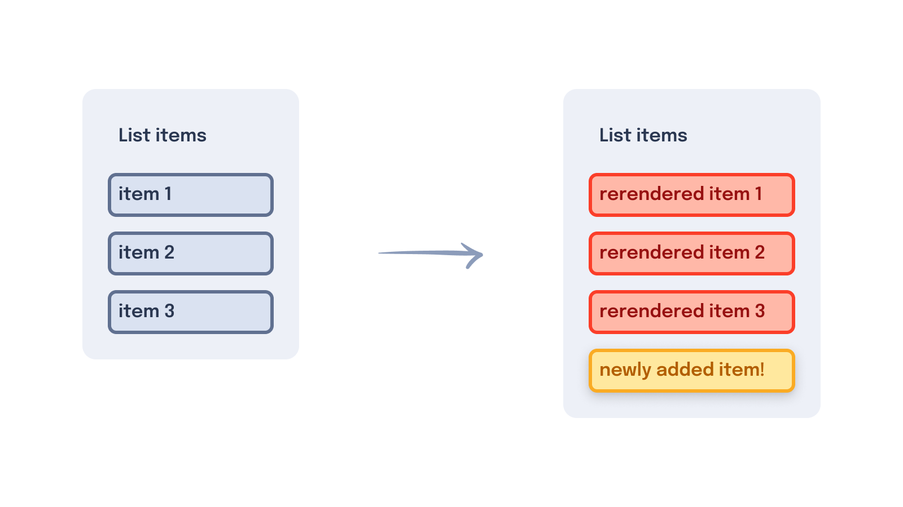
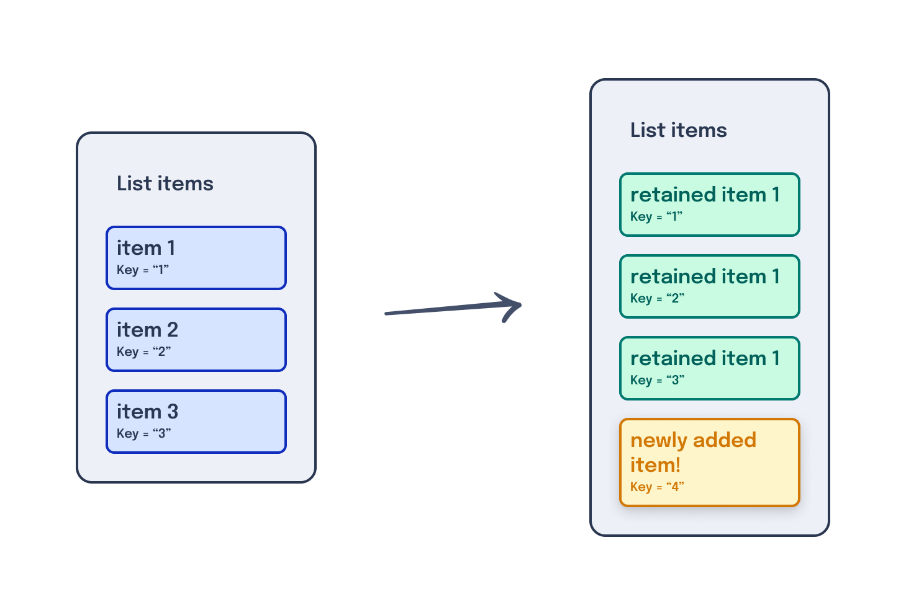

---
{
    title: "Dynamic HTML",
    description: "One of the primary advantages of using a framework is the ability to quickly generate dynamic HTML from JavaScript logic. Let's walk through some examples.",
    published: '2023-01-01T22:12:03.284Z',
    authors: ['crutchcorn'],
    tags: ['webdev'],
    attached: [],
    order: 3,
    series: "The Framework Field Guide"
}
---

Previously, we learned how to create components for our file application. These components included a way to create a component tree, add inputs to each component to pass data, and add an output of data back to a parent component.

Where we last left off, we manually input a list of files, which included file names and dates inside of a `button`. Let's take a look back at our existing file component to start:

<!-- tabs:start -->

### React

```jsx
const File = ({ href, fileName, isSelected, onSelected }) => {
  return (
    <button
      onClick={onSelected}
      style={
        isSelected
          ? { backgroundColor: 'blue', color: 'white' }
          : { backgroundColor: 'white', color: 'blue' }
      }
    >
      <a href={href}>{fileName}</a>
      <FileDate inputDate={new Date()} />
    </button>
  );
};
```

### Angular

```typescript
@Component({
  selector: 'file',
  standalone: true,
  imports: [FileDateComponent],
  template: `
    <button
      (click)="selected.emit()"
      [style]="
        isSelected
          ? { backgroundColor: 'blue', color: 'white' }
          : { backgroundColor: 'white', color: 'blue' }
      "
    >
      <a [href]="href">
        {{ fileName }}
        <file-date [inputDate]="inputDate"/>
      </a>
    </button>
  `,
})
export class FileComponent {
  @Input() fileName: string;
  @Input() href: string;
  @Input() isSelected: boolean;
  @Output() selected = new EventEmitter();
}
```

### Vue

```vue
<template>
  <button
    v-on:click="$emit('selected')"
    :style="isSelected ? { backgroundColor: 'blue', color: 'white' } : { backgroundColor: 'white', color: 'blue' }"
  >
    <a :href="href">
      {{ fileName }}
      <file-date [inputDate]="inputDate"></file-date>
    </a>
  </button>
</template>

<script setup>
const props = defineProps(['isSelected', 'fileName', 'href'])

defineEmits(['selected'])
</script>
```

<!-- tabs:end -->

This is a strong basis for a component without needing many changes for the moment.

One thing we would love to add is the ability to see folders listed alongside files. While we _could_ - and arguably should - add in a component that copy/pastes the code from the `File` component to create a new `Folder` component, let's reuse what we already have!

To do this, we'll create a new property called `isFolder`, which hides the date when set to true.

# Conditional Rendering

One way we can hide the `date` from displaying the user is by reusing an HTML attribute we introduced in the last chapter's challenge: [`hidden`](https://developer.mozilla.org/en-US/docs/Web/HTML/Global_attributes/hidden).

```html
<div hidden="true">
	<!-- This won't display to the user -->
    <FileDate/>
</div>
```

This works, but introduces a potential problem; while the contents are not _shown_ to the user (and are similarly [hidden from screen-readers](https://unicorn-utterances.com/posts/intro-to-web-accessability#css)) they _are_ still present within the DOM.

This means that if you have a large amount of these HTML elements that are marked as `hidden`, but still in the DOM; they can impact performance and memory usage as if they **were** being displayed to the user.

This might sound counterintuitive at first, but in-memory non-displayed UI elements have their place; they're particularly useful when trying to build out animation systems that visually transition items in and out of view.

In order to sidestep these performance concerns, React, Angular, and Vue all have a method to "conditionally render" HTML elements based off of a boolean. This means that if you pass `false`, it will entirely remove the child HTML elements out of the DOM.

Let's see what that looks like in usage:

<!-- tabs:start -->

### React

```jsx {2}
const ConditionalRender = ({ bool }) => {
  return (
    <div>{bool && <p>Text here</p>}</div>
  );
};
```

Here, we're using React's `{}` JavaScript binding to add in an [`AND` statement](https://developer.mozilla.org/en-US/docs/Web/JavaScript/Reference/Operators/Logical_AND). This works by utilizing Boolean logic of ["short-circuiting"](https://developer.mozilla.org/en-US/docs/Web/JavaScript/Reference/Operators/Logical_AND#short-circuit_evaluation). This means that if we have:

```javascript
const val = true || {}
```

`val` will be set to `{}`, while if we have:

```javascript
const val = false || {}
```

`val` will be set to `false`. 

React then uses this return value to render the value when the condition inside of the curly braces is **not** `undefined` or `null`.

This means that these examples **will** render their contained values:

```jsx
<div>{0}</div>
<div>{"Hello"}</div>
<div>{true || <Comp/>}</div>
<div>{true}</div>
// Renders as
<div>0</div>
<div>Hello</div>
<div><Comp/></div>
<div>true</div>
```

But the following examples **will not** render their contained values:

```jsx
<div>{undefined}</div>
<div>{false}</div>
// Both render as
<div></div>
```

### Angular

```typescript {2}
import { Component, Input } from '@angular/core';
import { NgIf } from '@angular/common';

@Component({
  selector: 'conditional-render',
  standalone: true,
  imports: [NgIf],
  template: `<div><p *ngIf="bool">Text here</p></div>`,
})
export class ConditionalRenderComponent {
  @Input() bool: boolean;
}
```

Here, we're using a special property called `ngIf` on our `p` tag to stop rendering the element if `bool` is `false`. This property is prefixed with an asterisk (`*`) to interact with Angular's compiler in special ways.

> These asterisk prefixed properties are called "Structural Directives" and are a unique feature to Angular. Their usage can be quite advanced, but you can read more about them when you're ready [in this blog post](https://unicorn-utterances.com/posts/angular-templates-start-to-source).

To use `ngIf`, we need to import `NgIf` from `@angular/common` and pass it to the `imports` array for the component.

>  If you forget to import and add the `NgIf` to your component's `imports` array, you might get an error something like:
>
> ```
> The `*ngIf` directive was used in the template, but neither the `NgIf` directive nor the `CommonModule` was imported. Please make sure that either the `NgIf` directive or the `CommonModule` is included in the `@Component.imports` array of this component.
> ```

### Vue

```vue
<template>
  <div><p v-if="bool">Text here</p></div>
</template>

<script setup>
const props = defineProps(['bool'])
</script>
```

Unlike Angular, where you need to import the ability to conditionally render an element, Vue treats `v-if` as a global attribute that can be added to any element or component.

<!-- tabs:end -->

In this example, when we pass `bool` as `true`, the component's HTML is rendered as:

```html
<div><p>Text here</p></div>
```

But when `bool` is set to `false`, it instead renders the following HTML:

```html
<div></div>
```

This is possible because React, Angular, and Vue control what is rendered to the screen. Utilizing this, they can remove or add HTML rendered to the DOM with nothing more than a boolean instruction.

Knowing this, let's add conditional rendering to our application.

## Conditional Rendering our Date

Right now, we have a list of files to present to the user. However, if we look back at our mockups, we'll notice that we wanted to list folders alongside files.


Luckily for us, our `File` component already manages much of the behavior we'd like to have with a potential `Folder` component to as well. For example, just like files, we want to select a folder when the user has clicked on it so that we can select multiple files and folders at once.

However, unlike files, folders do not have a creation date since there may be ambiguity of what the "Last modified" date would mean for a folder. Is is the last modified date when the folder was renamed? Or was it when a file within said folder was last modified? It's unclear, so we'll axe it.

Despite this difference in functionality, we can still reuse our `File` component for folders as well. We can reuse this component by conditionally rendering the date if we know we're showing a folder instead of a file.

Let's add an input to our `File` component called `isFolder` and prevent the date from rendering if said input set to `true`.

<!-- tabs:start -->

### React

```jsx {11}
const File = ({ href, fileName, isSelected, onSelected, isFolder }) => {
  return (
    <button
      onClick={onSelected}
      style={
        isSelected
          ? { backgroundColor: 'blue', color: 'white' }
          : { backgroundColor: 'white', color: 'blue' }
      }
    >
      <a href={href}>{fileName}</a>
      {isFolder && <FileDate inputDate={new Date()} />}
    </button>
  );
};
```

### Angular

```typescript {13}
@Component({
  selector: 'file',
  standalone: true,
  imports: [NgIf],
  template: `
    <button
      (click)="selected.emit()"
      [style]="
        isSelected
          ? { backgroundColor: 'blue', color: 'white' }
          : { backgroundColor: 'white', color: 'blue' }
      "
    >
      <a [href]="href">
        {{ fileName }}
        <file-date *ngIf="isFolder" [inputDate]="inputDate"></file-date>
      </a>
    </button>
  `,
})
export class FileComponent {
  @Input() fileName: string;
  @Input() href: string;
  @Input() isSelected: boolean;
  @Input() isFolder: boolean;
  @Output() selected = new EventEmitter();
}
```

### Vue

```vue
<template>
  <button
    v-on:click="emit('selected')"
    :style="isSelected ? { backgroundColor: 'blue', color: 'white' } : { backgroundColor: 'white', color: 'blue' }"
  >
    <a :href="href">
      {{ fileName }}
      <file-date v-if="isFolder" [inputDate]="inputDate"></file-date>
    </a>
  </button>
</template>

<script setup>
import { defineProps, defineEmits } from 'vue'

const props = defineProps(['isSelected', 'isFolder', 'fileName', 'href'])

const emit = defineEmits(['selected'])
</script>
```

<!-- tabs:end -->

# Conditional Branches

We're now able to conditionally show the user the last modified date depending on the `isFolder` boolean. However, it may still be unclear to the user what is a folder and what is a file, as we don't have this information clearly displayed to the user yet.

Let's use conditional rendering to show the type of item displayed based on the `isFolder` boolean.

<!-- tabs:start -->

## React

```jsx
{isFolder && <span>Type: Folder</span>}
{!isFolder && <span>Type: File</span>}
```

## Angular

```html
<span *ngIf="isFolder">Type: Folder</span>
<span *ngIf="!isFolder">Type: File</span>
```

## Vue

```html
<span v-if="isFolder">Type: Folder</span>
<span v-if="!isFolder">Type: File</span>
```

<!-- tabs:end -->

While working on this, it might become clear that we're effectively reconstructing an [`if ... else` statement](https://developer.mozilla.org/en-US/docs/Web/JavaScript/Reference/Statements/if...else), similar to the following logic in JavaScript.

```javascript
// This is psuedocode for the above using JavaScript as the syntax
if (isFolder) return "Type: Folder"
else return "Type: File"
```

Like the JavaScript environment these frameworks run in, they also implement a similar `else`-style API for this exact purpose.

<!-- tabs:start -->

## React

One of the benefits of React's JSX templating language is that you're able to embed JavaScript directly inside of an element. This embedded JavaScript will then render the return value of the JavaScript inside.

For example, we can use [a JavaScript ternary](https://developer.mozilla.org/en-US/docs/Web/JavaScript/Reference/Operators/Conditional_Operator) to return a different value if a boolean is `true` or `false`:

```javascript
// Will show "Folder" if `isFolder` is true, otherwise show "File"
const displayType = isFolder ? "Folder" : "File"; 
```

 We can combine this information with JSX's ability to treat a tag as a value you can assign to memory to create a `if...else`-style render in React:

```jsx
{
  isFolder ?
    <span>Type: Folder</span> :
    <span>Type: File</span>
}
```

 Here, if `isFolder` is `true`, the following will be rendered:

```html
<span>Type: Folder</span>
```

Otherwise, if `isFolder` is `false`, this will be rendered:

```html
<span>Type: File</span>
```

## Angular

```html
<span *ngIf="isFolder; else fileDisplay">Type: Folder</span>
<ng-template #fileDisplay><span>Type: File</span></ng-template>
```

Undoubtably you're looking at this snippet of code and wondering what `ng-template` is doing here. 

The long answer is a bit complicated and might distract from the current focus of this chapter — [We will answer this further in our "Content Reference" chapter](/posts/ffg-fundamentals-accessing-children#ng-templates).

The short answer is as simple as: "An `ng-template` is a bit of HTML that you can assign to an in-template variable for Angular to use in conditional statements and a few other places."

With this known, we can explain that the syntax looks something like this:

```html
<ng-template #varNameHere><p>HTML tags go in here as children</p></ng-template>
```

Which we can then use in an `*ngIf` statement like so:

```html
*ngIf="bool; else varNameHere"
```

## Vue

```html
<span v-if="isFolder">Type: Folder</span>
<span v-else>Type: File</span>
```

Here, Vue's `if...else` syntax looks fairly similar to the JavaScript pseudo-syntax we displayed above.

It's worth noting that a `v-else` tag **must** immediately follow a `v-if` tag; otherwise, it won't work. 

<!-- tabs:end -->

## Expanded Branches

While an `if ... else` works wonders if you only have a single Boolean value you need to check, you'll often need more than a single conditional branch to check against.

For example, what if we added an `isImage` Boolean to differentiate between images and other file types?

While we could move back to a simple `if` statement for each condition:

<!-- tabs:start -->

### React

```jsx
{isFolder && <span>Type: Folder</span>}
{!isFolder && isImage && <span>Type: Image</span>}
{!isFolder && !isImage && <span>Type: File</span>}
```

### Angular

```html
<span *ngIf="isFolder">Type: Folder</span>
<span *ngIf="!isFolder && isImage">Type: Image</span>
<span *ngIf="!isFolder && !isImage">Type: File</span>
```

### Vue

```html
<span v-if="isFolder">Type: Folder</span>
<span v-if="!isFolder && isImage">Type: Image</span>
<span v-if="!isFolder && !isImage">Type: File</span>
```

<!-- tabs:end -->

This can get hard to read with multiple conditionals in a row. As a result, these frameworks have tools that you can use to make things a bit more readable.

<!-- tabs:start -->

### React

We can chain together ternary operations to treat them as nested `if` statements.

By doing so, we can represent the following JavaScript pseudo-syntax:

```js
// JavaScript 
if (isFolder) {
	return "Folder";
} else {
	if (isImage) {
		return "Image"	
	} else {
		return "File"
	}
}
```

As the following React JSX

```jsx
{
  isFolder ?
    <span>Type: Folder</span> :
    isImage ?
      <span>Type: Image</span> :
      <span>Type: File</span>
}
```

### Angular

Angular does not support `else if` statements in the template like the other frameworks do.

Instead, Angular has a mechanism for utilizing [`switch/case` statements](https://developer.mozilla.org/en-US/docs/Web/JavaScript/Reference/Statements/switch). These switch/case statements work by matching a value from a `case` to the `switch` value. So, if you had:

```html
<ng-container [ngSwitch]="'folder'">
  <span *ngSwitchCase="'folder'">Type: Folder</span>
  <span *ngSwitchCase="'image'">Type: Image</span>
  <span *ngSwitchDefault>Type: File</span>
</ng-container>
```

It would render:

```html
<span>Type: Folder</span>
```

Because the `[ngSwitch]` value of `'folder'` matched the `ngSwitchCase` value of `'folder'`.

Using this tool, we can simply set the `ngSwitch` value to `true` and add a conditional into the `ngSwitchCase`.


```html
<ng-container [ngSwitch]="true">
  <span *ngSwitchCase="isFolder">Type: Folder</span>
  <span *ngSwitchCase="isImage">Type: Image</span>
  <span *ngSwitchDefault>Type: File</span>
</ng-container>
```

### Vue

Just as Vue's `v-if/v-else` attributes match JavaScript's `if...else` syntax, we can reuse similar logic to JavaScript's:

```js
if (isFolder) return "Folder";
else if (isImage) return "Image";
else return "File";
```

Using Vue's `v-else-if` attribute:

```html
<span v-if="isFolder">Type: Folder</span>
<span v-else-if="isImage">Type: Image</span>
<span v-else>Type: File</span>
```

Once again, the `v-else-if` and `v-else` tags must follow one another to work as intended.

<!-- tabs:end -->

# Rendering Lists

While we've primarily focused on our `File` component in this chapter, let's take another look at our `FileList` component.

<!-- tabs:start -->

## React

```jsx
const FileList = () => {
  const [selectedIndex, setSelectedIndex] = useState(-1);

  const onSelected = (idx) => {
    if (selectedIndex === idx) {
      setSelectedIndex(-1);
      return;
    }
    setSelectedIndex(idx);
  };

  return (
    <ul>
      <li><File
        isSelected={selectedIndex === 0}
        onSelected={() => onSelected(0)}
        fileName="File one"
        href="/file/file_one"
        isFolder={false}
      /></li>
      <li><File
        isSelected={selectedIndex === 1}
        onSelected={() => onSelected(1)}
        fileName="File two"
        href="/file/file_two"
        isFolder={false}
      /></li>
      <li><File
        isSelected={selectedIndex === 2}
        onSelected={() => onSelected(2)}
        fileName="File three"
        href="/file/file_three"
        isFolder={false}
      /></li>
    </ul>
  );
};
```

## Angular

```typescript
@Component({
  selector: 'file-list',
  standalone: true,
  imports: [FileComponent],
  template: `
    <ul>
      <li><file
        (selected)="onSelected(0)"
        [isSelected]="selectedIndex === 0"
        fileName="File one" 
        href="/file/file_one"
        [isFolder]="false"
      /></li>
      <li><file
        (selected)="onSelected(1)"
        [isSelected]="selectedIndex === 1"
        fileName="File two" 
        href="/file/file_two"
        [isFolder]="false"
      /></li>
      <li><file
        (selected)="onSelected(2)"
        [isSelected]="selectedIndex === 2"
        fileName="File three" 
        href="/file/file_three"
        [isFolder]="false"
      /></li>
    </ul>
  `,
})
export class FileListComponent {
  selectedIndex = -1;

  onSelected(idx) {
    if (this.selectedIndex === idx) {
      this.selectedIndex = -1;
      return;
    }
    this.selectedIndex = idx;
  }
}
```

## Vue

```vue
<template>
  <ul>
    <li><File
      @selected="onSelected(0)"
      :isSelected="selectedIndex === 0"
      fileName="File one"
      href="/file/file_one"
      :isFolder="false"
    /></li>
    <li><File
      @selected="onSelected(1)"
      :isSelected="selectedIndex === 1"
      fileName="File two"
      href="/file/file_two"
      :isFolder="false"
    /></li>
    <li><File
      @selected="onSelected(2)"
      :isSelected="selectedIndex === 2"
      fileName="File three"
      href="/file/file_three"
      :isFolder="false"
    /></li>
  </ul>
</template>

<script setup>
import { ref } from 'vue'
import File from './File.vue'

const selectedIndex = ref(-1)

function onSelected(idx) {
  if (selectedIndex.value === idx) {
    selectedIndex.value = -1
    return
  }
  selectedIndex.value = idx
}
</script>
```

<!-- tabs:end -->

Upon second glance, something that might immediately jump out at you is just how long these code samples are! Interestingly, this is primarily due to the copy-pasted nature of our `File` component being repeated.

What's more, this method of hardcoding file components means that we cannot create new files in JavaScript and display them in the DOM.

Let's fix that by replacing the copy-pasted components with a loop and an array.

<!-- tabs:start -->

## React

React uses [JavaScript's built-in `Array.map` method](https://developer.mozilla.org/en-US/docs/Web/JavaScript/Reference/Global_Objects/Array/map) to loop through each item and map them to some React component.

```jsx {0-16,31-37}
const filesArray = [
    {
        fileName: "File one",
        href: "/file/file_one",
        isFolder: false
    },
    {
        fileName: "File two",
        href: "/file/file_two",
        isFolder: false
    },
    {
        fileName: "File three",
        href: "/file/file_three",
        isFolder: false
    }
]

const FileList = () => {
  const [selectedIndex, setSelectedIndex] = useState(-1);

  const onSelected = (idx) => {
    if (selectedIndex === idx) {
      setSelectedIndex(-1);
      return;
    }
    setSelectedIndex(idx);
  };

  // This code sample is missing something and will throw a warning in development mode.
  // We'll explain more about this later.
  return (
    <ul>
      {filesArray.map((file, i) => <li><File
        isSelected={selectedIndex === i}
        onSelected={() => onSelected(i)}
        fileName={file.fileName}
        href={file.href}
        isFolder={file.isFolder}
      /></li>}
    </ul>
  );
};
```

We can then use the second argument inside of the `map` to gain access to the index of the looped item.

## Angular

Just as how the previous `*ngIf` structural directive is used to conditionally render items, Angular uses a different structural directive to render a list of items: `*ngFor`. 

```typescript {4-11,26-42}
import {NgFor} from '@angular/common';

@Component({
  selector: 'file-list',
  standalone: true,
  imports: [FileComponent, NgFor],
  template: `
    <ul>
      <li *ngFor="let file of filesArray; let i = index"><file
        (selected)="onSelected(i)"
        [isSelected]="selectedIndex === i"
        [fileName]="file.fileName" 
        [href]="file.href"
        [isFolder]="file.isFolder"
      /></li>
    </ul>
  `,
})
export class FileListComponent {
  selectedIndex = -1;

  onSelected(idx) {
    if (this.selectedIndex === idx) {
      this.selectedIndex = -1;
      return;
    }
    this.selectedIndex = idx;
  }
    
  filesArray = [
    {
        fileName: "File one",
        href: "/file/file_one",
        isFolder: false
    },
    {
        fileName: "File two",
        href: "/file/file_two",
        isFolder: false
    },
    {
        fileName: "File three",
        href: "/file/file_three",
        isFolder: false
    }
  ]
}
```

Inside our `ngFor`, `index` may not seem like it is being defined; however, Angular declares it whenever you attempt to utilize `ngFor` under the hood. Assigning it to a template variable using `let` allows you to use it as the index of the looped item.

Just like `NgIf` must be imported, we need to import `NgFor` into our component's `imports` array, least we be greeted with the following error:

```
The `*ngFor` directive was used in the template, but neither the `NgFor` directive nor the `CommonModule` was imported. Please make sure that either the `NgFor` directive or the `CommonModule` is included in the `@Component.imports` array of this component.
```

## Vue

Vue provides a `v-for` global attribute that does for lists what `v-if` does for conditionally rendering:

```vue
<template>
  <ul>
    <!-- This will throw a warning, more on that soon -->
    <li v-for="(file, i) in filesArray"><File
      @selected="onSelected(i)"
      :isSelected="selectedIndex === i"
      :fileName="file.fileName"
      :href="file.href"
      :isFolder="file.isFolder"
    /></li>
  </ul>
</template>

<script setup>
import { ref } from 'vue'
import File from './File.vue'

const filesArray = [
  {
    fileName: 'File one',
    href: '/file/file_one',
    isFolder: false,
  },
  {
    fileName: 'File two',
    href: '/file/file_two',
    isFolder: false,
  },
  {
    fileName: 'File three',
    href: '/file/file_three',
    isFolder: false,
  },
]

const selectedIndex = ref(-1)

function onSelected(idx) {
  if (selectedIndex.value === idx) {
    selectedIndex.value = -1
    return
  }
  selectedIndex.value = idx
}
</script>
```

Inside of our `v-for`, we're accessing both the value of the item (`file`) and the index of the looped item (`i`).

<!-- tabs:end -->

If we look at the rendered output, we can see that we have all three files listing out as expected!

Using this code as a base, we could extend this file list to any number of files just by adding another item to the hardcoded `filesArray` list; no templating code changes required!

## Keys

If you're using React, you may have encountered an error in the previous code sample that read like the following:

> Warning: Each child in a list should have a unique "key" prop.

Or, in Vue, the error might've said:

> Elements in iteration expect to have 'v-bind:key' directives

This is because in both of these frameworks, you're expected to pass a special property called `key` which is used by the respective framework to keep track of which item is which.

Without this `key` prop, the framework doesn't know which elements have been unchanged, and therefore must destroy and recreate each element in the array for every list re-render. This can cause massive performance problems and stability headaches.

> If you're confused, no worries - there was a lot of technical speak in that last paragraph. Continue reading to see what this means in practical terms and don't be afraid to come back and re-read this section when you're done with the chapter.

Say you have the following:

<!-- tabs:start -->

### React

```jsx
const WordList = () => {
  const [words, setWords] = useState([]);

  const addWord = () => {
    const newWord = getRandomWord();
    // Remove ability for duplicate words
    if (words.includes(newWord)) return;
    setWords([...words, newWord]);
  };

  return (
    <div>
      <button onClick={addWord}>Add word</button>
      <ul>
        {words.map((word) => {
          return <li>{word.word}</li>;
        })}
      </ul>
    </div>
  );
};

const wordDatabase = [
  { word: 'who', id: 1 },
  { word: 'what', id: 2 },
  { word: 'when', id: 3 },
  { word: 'where', id: 4 },
  { word: 'why', id: 5 },
  { word: 'how', id: 6 },
];

function getRandomWord() {
  return wordDatabase[Math.floor(Math.random() * wordDatabase.length)];
}
```

### Angular

```typescript
@Component({
  selector: 'word-list',
  standalone: true,
  imports: [NgFor],
  template: `
  <div>
      <button (click)="addWord()">Add word</button>
      <ul>
        <li *ngFor="let word of words">{{word.word}}</li>
      </ul>
    </div>
  `,
})
export class WordListComponent {
  words: Array<{ word: string; id: number }> = [];

  addWord() {
    const newWord = getRandomWord();
    // Remove ability for duplicate words
    if (this.words.includes(newWord)) return;
    this.words = [...this.words, newWord];
  }
}

const wordDatabase = [
  { word: 'who', id: 1 },
  { word: 'what', id: 2 },
  { word: 'when', id: 3 },
  { word: 'where', id: 4 },
  { word: 'why', id: 5 },
  { word: 'how', id: 6 },
];

function getRandomWord() {
  return wordDatabase[Math.floor(Math.random() * wordDatabase.length)];
}
```

### Vue

```vue
<!-- WordList.vue -->
<template>
  <div>
    <button @click="addWord()">Add word</button>
    <ul>
      <li v-for="word in words">{{ word.word }}</li>
    </ul>
  </div>
</template>

<script setup>
import { ref } from 'vue'

const wordDatabase = [
  { word: 'who', id: 1 },
  { word: 'what', id: 2 },
  { word: 'when', id: 3 },
  { word: 'where', id: 4 },
  { word: 'why', id: 5 },
  { word: 'how', id: 6 },
]

function getRandomWord() {
  return wordDatabase[Math.floor(Math.random() * wordDatabase.length)]
}

const words = ref([])

function addWord() {
  const newWord = getRandomWord()
  // Remove ability for duplicate words
  if (words.value.includes(newWord)) return
  words.value.push(newWord)
}
</script>
```

<!-- tabs:end -->

Without using some kind of `key` prop, your list will be destroyed and recreated every time you run `addWord`. 

This is because the framework **isn't able to detect which item in your array has changed** and as a result marks all DOM elements as "outdated". **These "outdated" elements are then destroyed by the framework only to be immediately reconstructed** in order to ensure the most up-to-date information is displayed to the user.



Instead of this, **we can tell the framework which list item is which with a unique "key"** associated with every list item. This key is then able to **allow the framework to intelligently prevent destruction on items that were not changed** in a list data change.



Let's see how we can do this in each framework.

<!-- tabs:start -->

### React

```jsx {4}
<div>
  <button onClick={addWord}>Add word</button>
  <ul>
    {words.map((word) => {
      return <li key={word.id}>{word.word}</li>;
    })}
  </ul>
</div>
```

Here, we're using the `key` property to tell React which `li` is related to which `word` via the `word`'s unique `id` field.

### Angular

While Angular doesn't have quite the same API for `key` as React and Vue, Angular instead uses a [`trackBy` method](https://angular.io/api/core/TrackByFunction) to figure out which item is which.

```typescript {8,16-18}
@Component({
  selector: 'word-list',
  standalone: true,
  imports: [NgFor],
  template: `
    <div>
      <button (click)="addWord()">Add word</button>
      <ul>
        <li *ngFor="let word of words; trackBy: wordTrackBy">{{word.word}}</li>
      </ul>
    </div>
  `,
})
export class WordListComponent {
  words: Array<{ word: string; id: number }> = [];

  wordTrackBy(index, word) {
    return word.id;
  }

  // ...
}
```

Another difference to the other frameworks is that while React and Vue have no default `key` behavior, Angular has a default `trackBy` function if one is not provided. If no `trackBy` is provided, the default will simply do strict equality (`===`) between the old item in the array and the new to check if the item is the same.

This function might look something like the following:

```jsx
defaultTrackBy(index, item) {
    // Angular checks to see if `item === item` between
    //  renders for each list item in `ngFor`
    return item;
}
```

While this works in some cases, for the most part, it's suggested to provide your own `trackBy` to avoid problems with the limitations present with the default.

### Vue

```vue
<!-- WordList.vue -->
<template>
  <div>
    <button @click="addWord()">Add word</button>
    <ul>
      <li v-for="word in words" :key="word.id">{{ word.word }}</li>
    </ul>
  </div>
</template>

<!-- ... -->
```

Here, we're using the `key` property to tell Vue which `li` is related to which `word` via the `word`'s unique `id` field.

<!-- tabs:end -->

Now when we re-render the list, the framework is able to know exactly which items have and have not changed.

As such, it will only re-render the new items, leaving the old and unchanged DOM elements alone.


## Keys As Render Hints

As we mentioned earlier, the `key` property is used by the framework to figure out which element is which. Change this `key` property for a given element, and it will be destroyed and recreated as if it were a fresh node.

While this is most applicable within lists, this is also true outside of them as well; assign a `key` to an element and change it and it will be recreated from scratch.

For example, let's assume we have a basic `input` that we want to be able to reset when a button is pressed.

To do this, we can assign a `key` property to the `input` and change the value of said `key` to force a re-creation of the `input`.

<!-- tabs:start -->

### React

```jsx {6}
function KeyExample() {
  const [num, setNum] = useState(0);

  const increase = () => setNum(num + 1);

  return (
    <div>
      <input key={num} />
      <button onClick={increase}>Increase</button>
      <p>{num}</p>
    </div>
  );
}
```

### Angular

Because Angular does not have the concept of a `key`, it is unable to follow the same behavior as Vue and React in this instance. Therefore, this section is more useful in understanding the underlying DOM diffing logic as opposed to functional coding advice for Angular in particular. 

This isn't necessarily a bad thing, however. We'll touch on this more in a bit, but using `key` in this way is often an anti-pattern.

### Vue

```vue
<!-- KeyExample.vue -->
<template>
    <input :key="num" />
    <button @click="increase()">Increase</button>
    <p>{{ num }}</p>
</template>

<script setup>
import { ref } from 'vue'

const num = ref(0);

function increase() {
  this.num.value++;
}
</script>
```

<!-- tabs:end -->

This refresh works because we are not persisting the [`input`'s `value`](https://developer.mozilla.org/en-US/docs/Web/API/HTMLInputElement), and therefore when `key` is updated, and a new `input` is rendered in its place, the in-memory DOM value is reset and not bound again.

This reset is what's causing the `input` to blank out after a button press. 

> This idea of an element's "reference" to a framework's understanding of an element can be a bit confusing.
>
> [In a future chapter, we'll learn more about how each framework handles these references under the hood.](/posts/ffg-fundamentals-element-reference)

# Putting it to Production

Since we now understand the stability and performance benefits of providing a key to our lists, let's add them to our `FileList` components.

<!-- tabs:start -->

## React

```jsx {0-13,28-33}
const filesArray = [
    {
        fileName: "File one",
        href: "/file/file_one",
        isFolder: false,
        id: 1
    },
    {
        fileName: "File two",
        href: "/file/file_two",
        isFolder: false,
        id: 2
    },
    {
        fileName: "File three",
        href: "/file/file_three",
        isFolder: false,
        id: 3
    }
]

const FileList = () => {
  const [selectedIndex, setSelectedIndex] = useState(-1);

  const onSelected = (idx) => {
    if (selectedIndex === idx) {
      setSelectedIndex(-1);
      return;
    }
    setSelectedIndex(idx);
  };

  return (
    <ul>
      {filesArray.map((file, i) => <li key={file.id}><File
        isSelected={selectedIndex === i}
        onSelected={() => onSelected(i)}
        fileName={file.fileName}
        href={file.href}
        isFolder={file.isFolder}
      /></li>}
    </ul>
  );
};
```

## Angular

```typescript {4-10,25-38}
@Component({
  selector: 'file-list',
  standalone: true,
  imports: [FileComponent, NgFor],
  template: `
    <ul>
      <li *ngFor="let file of filesArray; let i = index; trackBy: fileTrackBy">
          <file
            (selected)="onSelected(i)"
            [isSelected]="selectedIndex === i"
            [fileName]="file.fileName" 
            [href]="file.href"
            [isFolder]="file.isFolder"
          />
      </li>
    </ul>
  `,
})
export class FileListComponent {
  selectedIndex = -1;

  fileTrackBy(index, file) {
    return file.id;
  }
    
  onSelected(idx) {
    if (this.selectedIndex === idx) {
      this.selectedIndex = -1;
      return;
    }
    this.selectedIndex = idx;
  }
    
  filesArray = [
    {
        fileName: "File one",
        href: "/file/file_one",
        isFolder: false,
        id: 1
    },
    {
        fileName: "File two",
        href: "/file/file_two",
        isFolder: false,
        id: 2
    },
    {
        fileName: "File three",
        href: "/file/file_three",
        isFolder: false,
        id: 3
    }
  ]
}
```

## Vue

```vue
<!-- FileList.vue -->
<template>
  <ul>
    <li v-for="(file, i) in filesArray" :key="file.id">
        <File
          @selected="onSelected(i)"
          :isSelected="selectedIndex === i"
          :fileName="file.fileName"
          :href="file.href"
          :isFolder="file.isFolder"
        />
    </li>
  </ul>
</template>

<script setup>
import { ref } from 'vue'
import File from './File.vue'

const filesArray = [
  {
    fileName: 'File one',
    href: '/file/file_one',
    isFolder: false,
    id: 1,
  },
  {
    fileName: 'File two',
    href: '/file/file_two',
    isFolder: false,
    id: 2,
  },
  {
    fileName: 'File three',
    href: '/file/file_three',
    isFolder: false,
    id: 3,
  },
]

const selectedIndex = ref(-1)

function onSelected(idx) {
  if (selectedIndex.value === idx) {
    selectedIndex.value = -1
    return
  }
  selectedIndex.value = idx
}
</script>
```

<!-- tabs:end -->


# Using It All Together

Let's use our newfound knowledge of conditional and list rendering and combine them together in our application. 

Say that our users want to filter our `FileList` to only display files and not folders. We can enable this functionality by adding in a conditional statement inside of our template loop!

<!-- tabs:start -->

## React

```jsx {11}
const FileList = () => {
  // ...

  const [onlyShowFiles, setOnlyShowFiles] = useState(false);
  const toggleOnlyShow = () => setOnlyShowFiles(!onlyShowFiles);

  return (
    <div>
      <button onClick={toggleOnlyShow}>Only show files</button>
      <ul>
        {filesArray.map((file, i) => (
          <li>
            {(!onlyShowFiles || !file.isFolder) &&
              <File
                key={file.id}
                isSelected={selectedIndex === i}
                onSelected={() => onSelected(i)}
                fileName={file.fileName}
                href={file.href}
                isFolder={file.isFolder}
              />
            }
          </li>
        ))}
      </ul>
    </div>
  );
};
```

## Angular

```typescript
@Component({
  selector: 'file-list',
  standalone: true,
  imports: [FileComponent, NgFor],
  template: `
    <div>
      <button (click)="toggleOnlyShow()">Only show files</button>
      <ul>
        <li *ngFor="let file of filesArray; let i = index; trackBy: fileTrackBy">
            <file
              *ngIf="onlyShowFiles ? !file.isFolder : true"
              (selected)="onSelected(i)"
              [isSelected]="selectedIndex === i"
              [fileName]="file.fileName" 
              [href]="file.href"
              [isFolder]="file.isFolder"
            />
        </li>
      </ul>
    </div>
  `,
})
export class FileListComponent {
  // ...

  onlyShowFiles = false;
  
  toggleOnlyShow() {
      this.onlyShowFiles = !onlyShowFiles;
  }
}
```

## Vue

```vue
<!-- FileList.vue -->
<template>
  <div>
    <button (click)="toggleOnlyShow()">Only show files</button>
    <ul>
      <li v-for="(file, i) in filesArray" :key="file.id">
        <File
          v-if="onlyShowFiles ? !file.isFolder : true"
          @selected="onSelected(i)"
          :isSelected="selectedIndex === i"
          :fileName="file.fileName"
          :href="file.href"
          :isFolder="file.isFolder"
        />
      </li>
    </ul>
  </div>
</template>

<script setup>
import { ref } from 'vue'

// ...

const onlyShowFiles = ref(false);

// ...

toggleOnlyShow() {
  onlyShowFiles.value = !onlyShowFiles.value;
}

// ...
</script>
```

<!-- tabs:end -->

> While this code works, there's a silent-yet-deadly bug present. While we'll explain what that bug is within our ["Partial DOM Application"](/posts/ffg-fundamentals-transparent-elements) chapter, I'll give you a hint: It has to do with conditionally rendering the `File` component instead of the `li` element.

# Challenge

In our last chapter's challenge, we started to create dropdown file structure sidebar components.


We did this by hardcoding each of our `ExpandableDropdown` components as individual tags:

<!-- tabs:start -->

## React

```jsx
const ExpandableDropdown = ({ name, expanded, onToggle }) => {
  return (
    <div>
      <button onClick={onToggle}>
        {expanded ? 'V ' : '> '}
        {name}
      </button>
      <div hidden={!expanded}>More information here</div>
    </div>
  );
};

const Sidebar = () => {
  const [moviesExpanded, setMoviesExpanded] = useState(false);
  const [picturesExpanded, setPicturesExpanded] = useState(false);
  const [conceptsExpanded, setConceptsExpanded] = useState(false);
  const [articlesExpanded, setArticlesExpanded] = useState(false);
  const [redesignExpanded, setRedesignExpanded] = useState(false);
  const [invoicesExpanded, setInvoicesExpanded] = useState(false);
  return (
    <div>
      <h1>My Files</h1>
      <ExpandableDropdown
        name="Movies"
        expanded={moviesExpanded}
        onToggle={() => setMoviesExpanded(!moviesExpanded)}
      />
      <ExpandableDropdown
        name="Pictures"
        expanded={picturesExpanded}
        onToggle={() => setPicturesExpanded(!picturesExpanded)}
      />
      <ExpandableDropdown
        name="Concepts"
        expanded={conceptsExpanded}
        onToggle={() => setConceptsExpanded(!conceptsExpanded)}
      />
      <ExpandableDropdown
        name="Articles I'll Never Finish"
        expanded={articlesExpanded}
        onToggle={() => setArticlesExpanded(!articlesExpanded)}
      />
      <ExpandableDropdown
        name="Website Redesigns v5"
        expanded={redesignExpanded}
        onToggle={() => setRedesignExpanded(!redesignExpanded)}
      />
      <ExpandableDropdown
        name="Invoices"
        expanded={invoicesExpanded}
        onToggle={() => setInvoicesExpanded(!invoicesExpanded)}
      />
    </div>
  );
};
```

## Angular

```typescript
@Component({
  selector: 'expandable-dropdown',
  standalone: true,
  template: `
    <div>
      <button (click)="toggle.emit()">
        {{expanded ? "V" : ">" }}
        {{name}}
      </button>
      <div [hidden]="!expanded">
         More information here
      </div>
    </div>
  `,
})
export class ExpandableDropdownComponent {
  @Input() name: string;
  @Input() expanded: boolean;
  @Output() toggle = new EventEmitter();
}

@Component({
  selector: 'sidebar',
  standalone: true,
  imports: [ExpandableDropdownComponent],
  template: `
    <expandable-dropdown 
      name="Movies" 
      [expanded]="moviesExpanded" 
      (toggle)="moviesExpanded = !moviesExpanded"
    />
    <expandable-dropdown 
      name="Pictures" 
      [expanded]="picturesExpanded" 
      (toggle)="picturesExpanded = !picturesExpanded"
    />
    <expandable-dropdown 
      name="Concepts" 
      [expanded]="conceptsExpanded" 
      (toggle)="conceptsExpanded = !conceptsExpanded"
    />
    <expandable-dropdown 
      name="Articles I'll Never Finish" 
      [expanded]="articlesExpanded" 
      (toggle)="articlesExpanded = !articlesExpanded"
    />
    <expandable-dropdown 
      name="Website Redesigns v5" 
      [expanded]="redesignExpanded" 
      (toggle)="redesignExpanded = !redesignExpanded"
    />
    <expandable-dropdown 
      name="Invoices" 
      [expanded]="invoicesExpanded" 
      (toggle)="invoicesExpanded = !invoicesExpanded"
    />
  `,
})
export class SidebarComponent {
  moviesExpanded = false;
  picturesExpanded = false;
  conceptsExpanded = false;
  articlesExpanded = false;
  redesignExpanded = false;
  invoicesExpanded = false;
}
```

## Vue

```vue
<!-- ExpandableDropdown.vue -->
<template>
  <div>
    <button @click="emit('toggle')">
      {{ expanded ? 'V' : '>' }}
      {{ name }}
    </button>
    <div :hidden="!expanded">More information here</div>
  </div>
</template>
<script setup>
const props = defineProps(['name', 'expanded'])
const emit = defineEmits(['toggle'])
</script>
```

```vue
<!-- Sidebar.vue -->
<template>
  <h1>My Files</h1>
  <ExpandableDropdown name="Movies" 
    :expanded="moviesExpanded" 
    @toggle="moviesExpanded = !moviesExpanded" 
  />
  <ExpandableDropdown name="Pictures" 
    :expanded="picturesExpanded" 
    @toggle="picturesExpanded = !picturesExpanded" 
  />
  <ExpandableDropdown name="Concepts" 
    :expanded="conceptsExpanded" 
    @toggle="conceptsExpanded = !conceptsExpanded" 
  />
  <ExpandableDropdown
    name="Articles I'll Never Finish"
    :expanded="articlesExpanded"
    @toggle="articlesExpanded = !articlesExpanded"
  />
  <ExpandableDropdown
    name="Website Redesigns v5"
    :expanded="redesignExpanded"
    @toggle="redesignExpanded = !redesignExpanded"
  />
  <ExpandableDropdown name="Invoices" 
    :expanded="invoicesExpanded" 
    @toggle="invoicesExpanded = !invoicesExpanded" 
  />
</template>
<script setup>
import { ref } from 'vue'
import ExpandableDropdown from './ExpandableDropdown.vue'

const moviesExpanded = ref(false)
const picturesExpanded = ref(false)
const conceptsExpanded = ref(false)
const articlesExpanded = ref(false)
const redesignExpanded = ref(false)
const invoicesExpanded = ref(false)
</script>
```

<!-- tabs:end -->

What's more, we utilized the `hidden` HTML attribute to visually hide the collapsed content.

Let's use what we learned in this chapter to improve both of these challenges. In this challenge, we'll:

1. Use a list instead of hardcoding each `ExpandableDropdown` individually
2. Use a object map to keep track of each dropdown's `expanded` property
3. Migrate the usage of the `hidden` attribute to conditionally render instead

## Migrating hardcoded elements to a list

Let's start by creating an array of strings that we can use to render each dropdown with.

> Don't worry about the `expanded` functionality yet, for now let's hardcode `expanded` to `false` and point the toggle capability to an empty function.
>
> We'll come back to this soon.

<!-- tabs:start -->

### React

```jsx
const categories = [
  'Movies',
  'Pictures',
  'Concepts',
  "Articles I'll Never Finish",
  'Website Redesigns v5',
  'Invoices',
];

const Sidebar = () => {
  const onToggle = () => {};

  return (
    <div>
      <h1>My Files</h1>
      {categories.map((cat) => (
        <ExpandableDropdown
          key={cat}
          name={cat}
          expanded={false}
          onToggle={() => onToggle()}
        />
      ))}
    </div>
  );
};
```

###  Angular

```typescript
@Component({
  selector: 'sidebar',
  standalone: true,
  imports: [ExpandableDropdownComponent, NgFor],
  template: `
    <expandable-dropdown
      *ngFor="let cat of categories"
      [name]="cat"
      [expanded]="false"
      (toggle)="onToggle()"
    />
  `,
})
export class SidebarComponent {
	categories = [
        'Movies',
        'Pictures',
        'Concepts',
        "Articles I'll Never Finish",
        'Website Redesigns v5',
        'Invoices',
    ];

	onToggle() {}
}
```

### Vue

```vue
<!-- Sidebar.vue -->
<template>
  <h1>My Files</h1>
  <ExpandableDropdown v-for="cat of categories" :key="cat" :name="cat" :expanded="false" @toggle="onToggle()" />
</template>
<script setup>
import ExpandableDropdown from './ExpandableDropdown.vue'

const categories = ['Movies', 'Pictures', 'Concepts', "Articles I'll Never Finish", 'Website Redesigns v5', 'Invoices']

const onToggle = () => {}
</script>
```

<!-- tabs:end -->

Now that we've got an initial list of dropdowns rendering, let's move forward with re-enabling the `expanded` functionality.

To do this, we'll use an object map that uses the name of the category as the key and the `expanded` state as the key's value:

```js
{
    // This is expanded
    "Articles I'll Never Finish": true,
    // These are not
    "Concepts": false,
    "Invoices": false,
    "Movies": false,
    "Pictures": false,
    "Website Redesigns v5": false,
}
```

To create this object map, we can create a function called `objFromCategories` that takes our string array and constructs the above from above:

```javascript
function objFromCategories(categories) {
  let obj = {};
  for (let cat of categories) {
    obj[cat] = false;
  }
  return obj;
}
```

Let's see this in use:

<!-- tabs:start -->

### React

```jsx
const categories = [
  'Movies',
  'Pictures',
  'Concepts',
  "Articles I'll Never Finish",
  'Website Redesigns v5',
  'Invoices',
];

const Sidebar = () => {
  const [expandedMap, setExpandedMap] = useState(objFromCategories(categories));

  const onToggle = (cat) => {
    const newExpandedMap = { ...expandedMap };
    newExpandedMap[cat] = !newExpandedMap[cat];
    setExpandedMap(newExpandedMap);
  };

  return (
    <div>
      <h1>My Files</h1>
      {categories.map((cat) => (
        <ExpandableDropdown
          key={cat}
          name={cat}
          expanded={expandedMap[cat]}
          onToggle={() => onToggle(cat)}
        />
      ))}
    </div>
  );
};

function objFromCategories(categories) {
  let obj = {};
  for (let cat of categories) {
    obj[cat] = false;
  }
  return obj;
}
```

### Angular

```typescript
@Component({
  selector: 'sidebar',
  standalone: true,
  imports: [ExpandableDropdownComponent, NgFor],
  template: `
    <expandable-dropdown
      *ngFor="let cat of categories"
      [name]="cat"
      [expanded]="expandedMap[cat]"
      (toggle)="onToggle(cat)"
    />
  `,
})
export class SidebarComponent {
  categories = [
    'Movies',
    'Pictures',
    'Concepts',
    "Articles I'll Never Finish",
    'Website Redesigns v5',
    'Invoices',
  ];

  expandedMap = objFromCategories(this.categories);

  onToggle(cat) {
    this.expandedMap[cat] = !this.expandedMap[cat];
  }
}

function objFromCategories(categories) {
  let obj = {};
  for (let cat of categories) {
    obj[cat] = false;
  }
  return obj;
}
```

### Vue

```vue
<!-- Sidebar.vue -->
<template>
  <h1>My Files</h1>
  <ExpandableDropdown
    v-for="cat of categories"
    :key="cat"
    :name="cat"
    :expanded="expandedMap[cat]"
    @toggle="onToggle(cat)"
  />
</template>
<script setup>
import { ref } from 'vue'
import ExpandableDropdown from './ExpandableDropdown.vue'

const categories = ['Movies', 'Pictures', 'Concepts', "Articles I'll Never Finish", 'Website Redesigns v5', 'Invoices']

const expandedMap = ref(objFromCategories(categories))

const onToggle = (cat) => {
  expandedMap.value[cat] = !expandedMap.value[cat]
}

function objFromCategories(categories) {
  let obj = {}
  for (let cat of categories) {
    obj[cat] = false
  }
  return obj
}
</script>
```

<!-- tabs:end -->


## Conditionally rendering hidden content

Now that we've migrated our dropdowns to use a list instead of hardcoding each component instance, let's migrate our dropdown's collapsed content to conditionally render instead of using the `hidden` HTML attribute.

<!-- tabs:start -->

### React

```jsx
const ExpandableDropdown = ({ name, expanded, onToggle }) => {
  return (
    <div>
      <button onClick={onToggle}>
        {expanded ? 'V ' : '> '}
        {name}
      </button>
      {expanded && <div>More information here</div>}
    </div>
  );
};
```

### Angular

```typescript
@Component({
  selector: 'expandable-dropdown',
  standalone: true,
  imports: [NgIf],
  template: `
    <div>
      <button (click)="toggle.emit()">
        {{expanded ? "V" : ">" }}
        {{name}}
      </button>
      <div *ngIf="expanded">
         More information here
      </div>
    </div>
  `,
})
export class ExpandableDropdownComponent {
  @Input() name: string;
  @Input() expanded: boolean;
  @Output() toggle = new EventEmitter();
}
```

### Vue

```vue
<!-- ExpandableDropdown.vue -->
<template>
  <div>
    <button @click="emit('toggle')">
      {{ expanded ? 'V' : '>' }}
      {{ name }}
    </button>
    <div v-if="expanded">More information here</div>
  </div>
</template>
<script setup>
const props = defineProps(['name', 'expanded'])
const emit = defineEmits(['toggle'])
</script>
```

<!-- tabs:end -->

