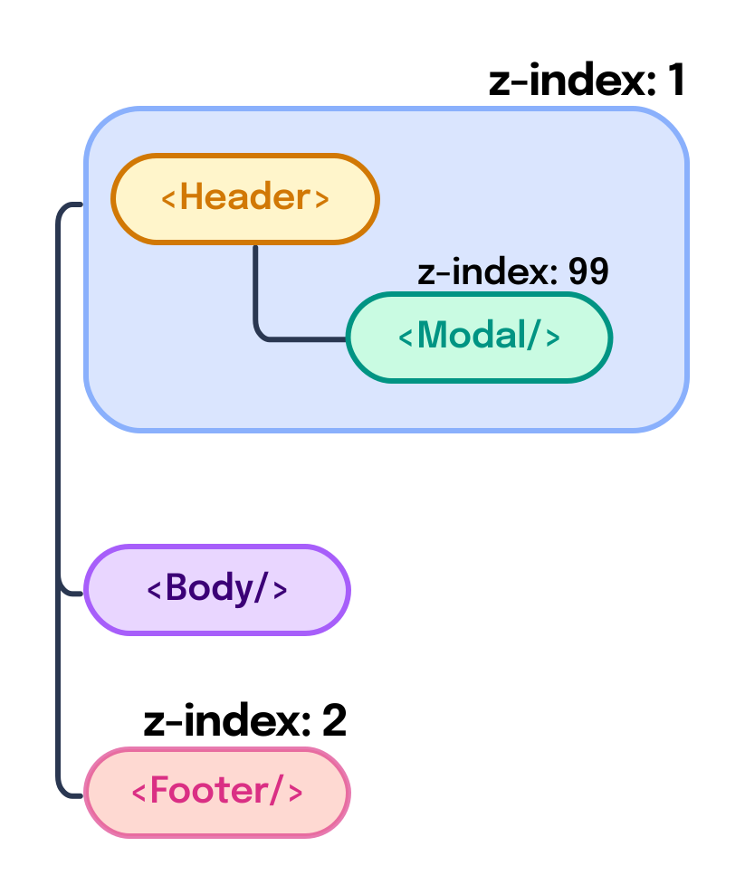

---
{
  title: "Portals",
  description: "When building an app in React, Angular, or Vue, you'll often find that overlapping components can become a real problem. Rendering order can be confusing; let's fix that with portals.",
  published: "2023-01-01T22:12:03.284Z",
  authors: ["crutchcorn"],
  tags: ["webdev"],
  attached: [],
  order: 12,
  collection: "The Framework Field Guide - Fundamentals",
}
---

You ever start up your favorite application, click an action button, then **boom**, there's a popup from the application about your interaction?

For example, you might click the "delete" button and are then greeted by a "Are you sure you'd like to delete the file?" pop up?


These are called "modals" and, [despite the decry of many developers](https://modalzmodalzmodalz.com), they're widely utilized as a method to grab a user's attention in applications of all kinds.

You may be surprised to learn that, despite their ubiquity, they can be rather challenging to implement.

However, you may not be surprised to learn that these modals are so common that **there's an API in React, Angular, and Vue each that makes modals easier to implement**; an API that's almost exclusively for these kinds of modal components.

What is this API called? **Portals**.

Why do we need a dedicated API for this use-case? **CSS**.

# The Problem with Modals; CSS Stacking Contexts

Let's build the "Delete file" modal we saw in our framework of choice:

<!-- tabs:start -->

## React

```jsx
export const Modal = () => {
	return (
		<div>
			<div class="modal-container">
				<h1 class="title">Are you sure you want to delete that file?</h1>
				<p class="body-text">
					Deleting this file is a permanent action. You’re unable to recover
					this file at a later date. Are you sure you want to delete this file?
				</p>
				<div class="buttons-container">
					<button class="cancel">Cancel</button>
					<button class="confirm">Confirm</button>
				</div>
			</div>
		</div>
	);
};
```

## Angular

```typescript
@Component({
	selector: "delete-modal",
	standalone: true,
	template: `
		<div>
			<div class="modal-container">
				<h1 class="title">Are you sure you want to delete that file?</h1>
				<p class="body-text">
					Deleting this file is a permanent action. You’re unable to recover
					this file at a later date. Are you sure you want to delete this file?
				</p>
				<div class="buttons-container">
					<button class="cancel">Cancel</button>
					<button class="confirm">Confirm</button>
				</div>
			</div>
		</div>
	`,
})
class ModalComponent {}
```

## Vue

```vue
<script setup></script>

<!-- Modal.vue -->
<template>
	<div>
		<div class="modal-container">
			<h1 class="title">Are you sure you want to delete that file?</h1>
			<p class="body-text">
				Deleting this file is a permanent action. You’re unable to recover this
				file at a later date. Are you sure you want to delete this file?
			</p>
			<div class="buttons-container">
				<button class="cancel">Cancel</button>
				<button class="confirm">Confirm</button>
			</div>
		</div>
	</div>
</template>
```

<!-- tabs:end -->

<br/>

<details>
<summary>
CSS for the modal
</summary>

<br/>

```
.modal-container {
  position: fixed;
  top: 50%;
  left: 50%;
  transform: translateX(-50%) translateY(-50%);
  padding: 20px 0px 0px;
  background: #e0e3e5;
  border-radius: 28px;
  font-family: 'Roboto', sans-serif;
  color: #001f28;
}

.title {
margin: 0;
padding: 0px 24px 16px;
font-size: 24px;
font-weight: 400;
}

.body-text {
margin: 0;
padding: 0px 24px 24px;
font-size: 14px;
}

.buttons-container {
display: flex;
justify-content: end;
padding: 16px;
gap: 8px;
}

.buttons-container button {
margin: 4px 0;
padding: 10px 24px;
border-radius: 1000px;
border: none;
}

.cancel {
background: #b8eaff;
}

.cancel:hover {
filter: brightness(0.8);
}

.cancel:active {
filter: brightness(0.6);
}

.confirm {
background: #2e6578;
color: white;
}

.confirm:hover {
filter: brightness(1.4);
}

.confirm:active {
filter: brightness(1.8);
}

```

</details>

Now that we have that modal, let's build out a small version of our folder app we've been building in this book. This version of the app should showcase the modal, the header, and a copyright footer:


<!-- tabs:start -->

## React

```jsx
export const App = () => {
  return (
    <div>
      <Header />
      <Body />
      <Footer />
    </div>
  );
};
```

```jsx
export const Header = () => {
	return (
		<>
			<div class="header-container">
				<span class="icon-container">
					<FolderIcon />
				</span>
				<span class="header-title">Main folder</span>
				<span class="auto"></span>
				<button class="icon-btn">
					<DeleteIcon />
				</button>
			</div>
		</>
	);
};
```

```jsx
export const Body = () => {
	return (
		<ul class="list-container">
			{Array.from({ length: 10 }, (_, i) => (
				<li class="list-item">
					<FolderIcon />
					<span>File number #{i + 1}</span>
				</li>
			))}
		</ul>
	);
};
```

```jsx
export const Footer = () => {
	return <div class="footer-container">Copyright 2022</div>;
};
```

```jsx
export const DeleteIcon = () => {
	return (
		<svg viewBox="0 0 20 21">
			<path d="M9 8V16H7.5L7 8H9Z" fill="currentColor" />
			<path d="M12.5 16L13 8H11V16H12.5Z" fill="currentColor" />
			<path
				d="M8 0C7.56957 0 7.18743 0.27543 7.05132 0.683772L6.27924 3H1C0.447715 3 0 3.44772 0 4C0 4.55228 0.447715 5 1 5H2.56055L3.38474 18.1871C3.48356 19.7682 4.79471 21 6.3789 21H13.6211C15.2053 21 16.5164 19.7682 16.6153 18.1871L17.4395 5H19C19.5523 5 20 4.55228 20 4C20 3.44772 19.5523 3 19 3H13.7208L12.9487 0.683772C12.8126 0.27543 12.4304 0 12 0H8ZM12.9767 5C12.9921 5.00036 13.0076 5.00036 13.0231 5H15.4355L14.6192 18.0624C14.5862 18.5894 14.1492 19 13.6211 19H6.3789C5.85084 19 5.41379 18.5894 5.38085 18.0624L4.56445 5H6.97694C6.99244 5.00036 7.00792 5.00036 7.02334 5H12.9767ZM11.6126 3H8.38743L8.72076 2H11.2792L11.6126 3Z"
				fill="currentColor"
			/>
		</svg>
	);
};
```

```jsx
export const FolderIcon = () => {
	return (
		<svg viewBox="0 0 20 16">
			<path
				d="M20 14C20 15.1046 19.1046 16 18 16H2C0.895431 16 0 15.1046 0 14V2C0 0.895431 0.89543 0 2 0H11C11.7403 0 12.3866 0.402199 12.7324 1H18C19.1046 1 20 1.89543 20 3V14ZM11 4V2H2V14H18V6H13C11.8954 6 11 5.10457 11 4ZM13 3V4H18V3H13Z"
				fill="currentColor"
			/>
		</svg>
	);
};
```

## Angular

```typescript
@Component({
	selector: "app-root",
	standalone: true,
	imports: [HeaderComponent, BodyComponent, FooterComponent],
	template: `
		<div>
			<header-comp />
			<body-comp />
			<footer-comp />
		</div>
	`,
})
export class AppComponent {}
```

```typescript
@Component({
	selector: "header-comp",
	standalone: true,
	imports: [FolderIconComponent, DeleteIconComponent],
	template: `
		<div class="header-container">
			<span class="icon-container">
				<folder-icon />
			</span>
			<span class="header-title">Main folder</span>
			<span class="auto"></span>
			<button class="icon-btn">
				<delete-icon />
			</button>
		</div>
	`,
})
export class HeaderComponent {}
```

```typescript
@Component({
	selector: "body-comp",
	standalone: true,
	imports: [FolderIconComponent],
	template: `
		<ul class="list-container">
			<li class="list-item" *ngFor="let fileIdx of files">
				<folder-icon />
				<span>File number {{ fileIdx + 1 }}</span>
			</li>
		</ul>
	`,
})
export class BodyComponent {
	files = Array.from({ length: 10 }, (_, i) => i);
}
```

```typescript
@Component({
	selector: "footer-comp",
	standalone: true,
	template: ` <div class="footer-container">Copyright 2022</div> `,
})
export class FooterComponent {}
```

```typescript
@Component({
	selector: "folder-icon",
	standalone: true,
	template: `
		<svg viewBox="0 0 20 16">
			<path
				d="M20 14C20 15.1046 19.1046 16 18 16H2C0.895431 16 0 15.1046 0 14V2C0 0.895431 0.89543 0 2 0H11C11.7403 0 12.3866 0.402199 12.7324 1H18C19.1046 1 20 1.89543 20 3V14ZM11 4V2H2V14H18V6H13C11.8954 6 11 5.10457 11 4ZM13 3V4H18V3H13Z"
				fill="currentColor"
			/>
		</svg>
	`,
})
class FolderIconComponent {}
```

```typescript
@Component({
	selector: "delete-icon",
	standalone: true,
	template: `
		<svg viewBox="0 0 20 21">
			<path d="M9 8V16H7.5L7 8H9Z" fill="currentColor" />
			<path d="M12.5 16L13 8H11V16H12.5Z" fill="currentColor" />
			<path
				d="M8 0C7.56957 0 7.18743 0.27543 7.05132 0.683772L6.27924 3H1C0.447715 3 0 3.44772 0 4C0 4.55228 0.447715 5 1 5H2.56055L3.38474 18.1871C3.48356 19.7682 4.79471 21 6.3789 21H13.6211C15.2053 21 16.5164 19.7682 16.6153 18.1871L17.4395 5H19C19.5523 5 20 4.55228 20 4C20 3.44772 19.5523 3 19 3H13.7208L12.9487 0.683772C12.8126 0.27543 12.4304 0 12 0H8ZM12.9767 5C12.9921 5.00036 13.0076 5.00036 13.0231 5H15.4355L14.6192 18.0624C14.5862 18.5894 14.1492 19 13.6211 19H6.3789C5.85084 19 5.41379 18.5894 5.38085 18.0624L4.56445 5H6.97694C6.99244 5.00036 7.00792 5.00036 7.02334 5H12.9767ZM11.6126 3H8.38743L8.72076 2H11.2792L11.6126 3Z"
				fill="currentColor"
			/>
		</svg>
	`,
})
class DeleteIconComponent {}
```

## Vue

```vue
<!-- App.vue -->
<script setup>
import Header from "./Header.vue";
import Body from "./Body.vue";
import Footer from "./Footer.vue";
</script>

<template>
	<div>
		<Header />
		<Body />
		<Footer />
	</div>
</template>
```

```vue
<!-- Header.vue -->
<script setup>
import FolderIcon from "./FolderIcon.vue";
import DeleteIcon from "./DeleteIcon.vue";
</script>

<template>
	<div class="header-container">
		<span class="icon-container">
			<FolderIcon />
		</span>
		<span class="header-title">Main folder</span>
		<span class="auto"></span>
		<button class="icon-btn">
			<DeleteIcon />
		</button>
	</div>
</template>
```

```vue
<!-- Body.vue -->
<script setup>
import FolderIcon from "./FolderIcon.vue";

const files = Array.from({ length: 10 }, (_, i) => i);
</script>

<template>
	<ul class="list-container">
		<li class="list-item" v-for="fileIdx of files">
			<FolderIcon />
			<span>File number {{ fileIdx + 1 }}</span>
		</li>
	</ul>
</template>
```

```vue
<!-- Footer.vue -->
<template>
	<div class="footer-container">Copyright 2022</div>
</template>
```

```vue
<!-- DeleteIcon.vue -->
<template>
	<svg viewBox="0 0 20 21">
		<path d="M9 8V16H7.5L7 8H9Z" fill="currentColor" />
		<path d="M12.5 16L13 8H11V16H12.5Z" fill="currentColor" />
		<path
			d="M8 0C7.56957 0 7.18743 0.27543 7.05132 0.683772L6.27924 3H1C0.447715 3 0 3.44772 0 4C0 4.55228 0.447715 5 1 5H2.56055L3.38474 18.1871C3.48356 19.7682 4.79471 21 6.3789 21H13.6211C15.2053 21 16.5164 19.7682 16.6153 18.1871L17.4395 5H19C19.5523 5 20 4.55228 20 4C20 3.44772 19.5523 3 19 3H13.7208L12.9487 0.683772C12.8126 0.27543 12.4304 0 12 0H8ZM12.9767 5C12.9921 5.00036 13.0076 5.00036 13.0231 5H15.4355L14.6192 18.0624C14.5862 18.5894 14.1492 19 13.6211 19H6.3789C5.85084 19 5.41379 18.5894 5.38085 18.0624L4.56445 5H6.97694C6.99244 5.00036 7.00792 5.00036 7.02334 5H12.9767ZM11.6126 3H8.38743L8.72076 2H11.2792L11.6126 3Z"
			fill="currentColor"
		/>
	</svg>
</template>
```

```vue
<!-- FolderIcon.vue -->
<template>
	<svg viewBox="0 0 20 16">
		<path
			d="M20 14C20 15.1046 19.1046 16 18 16H2C0.895431 16 0 15.1046 0 14V2C0 0.895431 0.89543 0 2 0H11C11.7403 0 12.3866 0.402199 12.7324 1H18C19.1046 1 20 1.89543 20 3V14ZM11 4V2H2V14H18V6H13C11.8954 6 11 5.10457 11 4ZM13 3V4H18V3H13Z"
			fill="currentColor"
		/>
	</svg>
</template>
```

<!-- tabs:end -->

<br/>

<details>
<summary>CSS for the Rest of the App</summary>

<br/>

```
body {
  margin: 0;
  padding: 0;
}

.header-container {
  display: flex;
  align-items: center;
  gap: 0.5rem;
  padding: 8px 12px;
  border: 2px solid #F5F8FF;
  background: white;
  color: #1A42E6;
  position: fixed;
  top: 0;
  left: 0;
  width: 100%;
  box-sizing: border-box;
  z-index: 1;
}

.header-title {
  font-family: 'Roboto', sans-serif;
  font-weight: bold;
}

.auto {
  margin: 0 auto;
}

.icon-btn, .icon-container {
  box-sizing: border-box;
  background: none;
  border: none;
  color: #1A42E6;
  border-radius: 0.5rem;
  height: 24px;
  width: 24px;
  display: flex;
  align-items: center;
  justify-content: center;
  padding: 4px;
}

.icon-btn svg {
  width: 100%;
}

.icon-btn:hover {
  background: rgba(26, 66, 229, 0.2);
}

.icon-btn:active {
  background: rgba(26, 66, 229, 0.4);
  color: white;
}

.list-container {
  list-style: none;
  display: flex;
  flex-direction: column;
  gap: 0.25rem;
  margin: 0;
  margin-top: 2.5rem;
  padding: 1rem;
}

.list-item {
  padding: 0.5rem 1rem;
  display: flex;
  align-items: center;
  gap: 1rem;
  color: #1A42E6;
  font-family: 'Roboto', sans-serif;
  border-radius: 0.5rem;
}

.list-item:hover {
  background: rgba(245, 248, 255, 1);
}

.list-item svg {
  width: 24px;
}

.footer-container {
  font-family: 'Roboto', sans-serif;
  position: relative;
  z-index: 2;
  background: white;
  color: #1A42E6;
  padding: 8px 12px;
  border: 2px solid #F5F8FF;
}
```

</details>

Awesome! This is looking good. Now, let's add in the ability to open our dialog from our `Header` component.

To do this, we'll:

- Add our `Modal` component into our `Header` component
- Add some state to conditionally render `Modal` depending on if the user has clicked on the delete icon

<!-- tabs:start -->

## React

```jsx
import React, { useState } from "react";
import { DeleteIcon, FolderIcon } from "./Icons";
import { Modal } from "./Modal";

export const Header = () => {
	const [showModal, setShowModal] = useState(false);
	return (
		<>
			<div class="header-container">
				{showModal && <Modal />}
				<span class="icon-container">
					<FolderIcon />
				</span>
				<span class="header-title">Main folder</span>
				<span class="auto"></span>
				<button class="icon-btn" onClick={() => setShowModal(true)}>
					<DeleteIcon />
				</button>
			</div>
		</>
	);
};
```

## Angular

```typescript
@Component({
	selector: "header-comp",
	standalone: true,
	imports: [ModalComponent, FolderIconComponent, DeleteIconComponent],
	template: `
		<div class="header-container">
			<delete-modal *ngIf="shouldShowModal" />
			<span class="icon-container">
				<folder-icon />
			</span>
			<span class="header-title">Main folder</span>
			<span class="auto"></span>
			<button class="icon-btn" (click)="showModal()">
				<delete-icon />
			</button>
		</div>
	`,
})
export class HeaderComponent {
	shouldShowModal = false;

	showModal() {
		this.shouldShowModal = true;
	}
}
```

## Vue

```vue
<!-- Header.vue -->
<script setup>
import FolderIcon from "./FolderIcon.vue";
import DeleteIcon from "./DeleteIcon.vue";
import Modal from "./Modal.vue";
import { ref } from "vue";
const shouldShowModal = ref(false);

function showModal() {
	shouldShowModal.value = true;
}
</script>

<template>
	<div class="header-container">
		<Modal v-if="shouldShowModal" />
		<span class="icon-container">
			<FolderIcon />
		</span>
		<span class="header-title">Main folder</span>
		<span class="auto"></span>
		<button class="icon-btn" @click="showModal()">
			<DeleteIcon />
		</button>
	</div>
</template>

<!-- ... -->
```

<!-- tabs:end -->

But wait... Now when we render the app and open our dialog it looks like it's _under_ the `Footer` component?!


Why is that? After all, `Modal` has a `z-index` of `99`, while `Footer` only has a `z-index` of `2`!

While the long answer of "why is the modal rendering under the footer in this example" includes a mention of [stacking contexts](https://unicorn-utterances.com/posts/css-stacking-context), the short answer is ["A higher `z-index` number doesn't always guarantee that your element is always on the top."](https://unicorn-utterances.com/posts/css-stacking-context)

> While both of those links lead to the same place, I worry that this might still be too subtle of a hint to [**go read the article I wrote that explains exactly why this `z-index` behavior occurs.**](https://unicorn-utterances.com/posts/css-stacking-context)

To solve this, we'll reach for the JavaScript API built into React, Angular, and Vue that we mentioned at the start of this chapter: Portals.

# What Is a JavaScript Portal?

The basic idea behind a JavaScript Portal builds on top of [the concepts of components we introduced in our first chapter](/posts/ffg-fundamentals-intro-to-components).

Imagine you have a set of components that represent the small app we just built:


In this component layout, the `Modal` was showing under the `Footer` component. The reason this was happening is because the `Modal` is trapped under a ["CSS Stacking Context"](https://unicorn-utterances.com/posts/css-stacking-context).

Let's simplify the chart and see what I mean;



Here, we can see that despite `Modal` being assigned a `z-index` of `99`, it's trapped under the `Header`, which is a `z-index` of `1`. The `Modal` cannot escape this encapsulated `z-index` painting order, and as a result, `Footer` shows up on top.

Ideally, to solve this problem, we'd want to move `Modal` to be in our HTML after the `Footer`, like so:


But how can we do this without moving the `Modal` component outside of the `Header` component?

This is where JavaScript portals come into play. **Portals allow you to render the HTML for a component in a different location of the DOM tree than the location of our component tree**.

This is to say that your framework components will be laid out like the tree on the left, but will render out like the flat structure on the right.

Let's take a look at how we can build these portals ourselves.

# Using Local Portals

While it's not the most useful example of using a portal, let's see how we can use a portal to teleport part of a UI to another part of the same component:

<!-- tabs:start -->

## React

While most of React's APIs can be imported directly from `react`, the ability to create portals actually comes from the `react-dom` package.

Once imported, we can use `ReactDOM.createPortal` to render JSX into an HTML element.

```jsx
import React, { useMemo, useState } from "react";
import ReactDOM from "react-dom";

export default function App() {
	const [portalRef, setPortalRef] = useState(null);

	const portal = useMemo(() => {
		if (!portalRef) return null;
		return ReactDOM.createPortal(<div>Hello world!</div>, portalRef);
	}, [portalRef]);

	return (
		<>
			<div
				ref={(el) => setPortalRef(el)}
				style={{ height: "100px", width: "100px", border: "2px solid black" }}
			>
				<div />
			</div>
			{portal}
		</>
	);
}
```

You'll notice that we're then displaying the return of `createPortal` - `portal` - within the component. This allows the portal to be activated, which will place the `Hello world!` inside of the `div`.

## Angular

While the other frameworks have something akin to a portal system built into their frameworks' core, Angular does not. Instead, the Angular team maintains a library called [the "Angular CDK"](https://cdk.angular.io) in order to have shared UI code for utilities such as portals.

To use the Angular CDK, you'll first need to install it into your project:

```
npm i @angular/cdk
```

From here, we can import components and utilities directly from the CDK.

```typescript
import { PortalModule, DomPortal } from "@angular/cdk/portal";

@Component({
	selector: "app-root",
	standalone: true,
	imports: [PortalModule],
	template: `
		<div style="height: 100px; width: 100px; border: 2px solid black;">
			<ng-template [cdkPortalOutlet]="domPortal" />
		</div>
		<div #portalContent>Hello world!</div>
	`,
})
class AppComponent implements AfterViewInit {
	@ViewChild("portalContent") portalContent: ElementRef<HTMLElement>;

	domPortal: DomPortal<any>;

	ngAfterViewInit() {
		// This is to avoid an:
		// "Expression has changed after it was checked"
		// error when trying to set domPortal
		setTimeout(() => {
			this.domPortal = new DomPortal(this.portalContent);
		}, 0);
	}
}
```

You'll notice that we're creating a variable called `domPortal` that we assign an instance of `DomPortal` into. This `DomPortal` instance allows us to take a captured reference to some HTML (in this case, a `div` with `Hello world!`), and project it elsewhere.

This `domPortal` is then assigned to a `[cdkPortalOutlet]` input. This input is automatically created on all `ng-template`s when `PortalModule` is imported.

> If you forget to import `PortalModule`, you'll see an error like so:
>
> ```
>  Can't bind to 'cdkPortalOutlet' since it isn't a known property of 'ng-template' (used in the 'AppComponent' component template).
> ```

This `cdkPortalOutlet` is where the captured HTML is then projected into.

> Our code here uses a `setTimeout` to avoid an error of "Expression has changed after it was checked".
>
> The reason for this occuring is quite complex (and out of scope), but you can read about it more with the following resources:
>
> - [Official Angular video explaining "Expression has changed"](https://angular.io/errors/NG0100)
> - [Everything you need to know about the `ExpressionChangedAfterItHasBeenCheckedError` error](https://indepth.dev/posts/1001/everything-you-need-to-know-about-the-expressionchangedafterithasbeencheckederror-error)
> - [Angular Debugging "Expression has changed after it was checked": Simple Explanation (and Fix)](https://blog.angular-university.io/angular-debugging/)

### Rendering `ng-template`

Because we're using a `div` to act as the parent element of the portal's contents, there might be a flash of the `div` on screen before our `ngAfterViewInit` occurs. This flash happens because a `div` is an HTML element, which renders its contents on screen, then our `ngAfterViewInit` goes back and removes the `div` from the DOM.

As such, we may want to use an `ng-template`, which does not render to the DOM in the first place:

```typescript
import { PortalModule, TemplatePortal } from "@angular/cdk/portal";

@Component({
	selector: "app-root",
	standalone: true,
	imports: [PortalModule],
	template: `
		<div style="height: 100px; width: 100px; border: 2px solid black;">
			<ng-template [cdkPortalOutlet]="domPortal" />
		</div>
		<ng-template #portalContent>Hello, this is a template portal</ng-template>
	`,
})
class AppComponent implements AfterViewInit {
	@ViewChild("portalContent") portalContent: TemplateRef<unknown>;

	viewContainerRef = inject(ViewContainerRef);
	domPortal: TemplatePortal<any>;

	ngAfterViewInit() {
		// This is to avoid an:
		// "Expression has changed after it was checked"
		// error when trying to set domPortal
		setTimeout(() => {
			this.domPortal = new TemplatePortal(
				this.portalContent,
				this.viewContainerRef,
			);
		}, 0);
	}
}
```

## Vue

Vue may have the most minimal portal API of them all; You use the built-in `Teleport` component, and tell it which HTML element you want it to render to using the `to` input.

```vue
<!-- App.vue -->
<script setup>
import { ref } from "vue";

const portalContainerEl = ref(null);
</script>

<template>
	<div style="height: 100px; width: 100px; border: 2px solid black">
		<div ref="portalContainerEl"></div>
	</div>
	<div v-if="portalContainerEl">
		<Teleport :to="portalContainerEl">Hello, world!</Teleport>
	</div>
</template>
```

> We need the `v-if` in this code to ensure that `portalContainerEl` has already been rendered and is ready to project content.

<!-- tabs:end -->

> It's worth mentioning that this is not the most useful example of a portal, because if we are within the same component, we could simply move the elements around freely, with full control over a component.

Now that we know how to apply portals within a component, let's see how we can apply a portal to be at the root of the entire application.

# Application-Wide Portals

In local portals, we were able to see that implementations of portals rely on an [element reference](/posts/ffg-fundamentals-element-reference) to be set to a variable. This tells us where we should render our portal's contents into.

While this worked, it didn't do much to solve the original issue that portals were set out to solve; overlapping stacking contexts.

If there was a way that we could provide a variable to all of the application's components, then we could have a way to solve the stacking context problem within our apps...

> But wait, Corbin, there _is_ a way we can provide all a variable to the rest of our app! We learned how to do that using [dependency injection from the root of the app!](/posts/ffg-fundamentals-dependency-injection)

Good call, keen reader! Let's do that.

<!-- tabs:start -->

## React

If we remember [our dependency injection chapter, React uses a `context` to provide and consume data using dependency injection](/posts/ffg-fundamentals-dependency-injection).

We can pair this with our `createPortal` API to keep track of where we want to provide a portal:

```jsx
import { useState, createContext, useContext } from "react";
import ReactDOM from "react-dom";

const PortalContext = createContext();

function ChildComponent() {
	const portalRef = useContext(PortalContext);
	if (!portalRef) return null;
	return ReactDOM.createPortal(<div>Hello, world!</div>, portalRef);
}

export default function App() {
	const [portalRef, setPortalRef] = useState(null);

	return (
		<PortalContext.Provider value={portalRef}>
			<div
				ref={(el) => setPortalRef(el)}
				style={{ height: "100px", width: "100px", border: "2px solid black" }}
			>
				<div />
			</div>
			<ChildComponent />
		</PortalContext.Provider>
	);
}
```

## Angular

In Angular, we can use a basic service to share our instance of a `Portal` between multiple components, parent and child alike.

```typescript
import { Portal, PortalModule, TemplatePortal } from "@angular/cdk/portal";

@Injectable({
	providedIn: "root",
})
class PortalService {
	portal: Portal<any> | null = null;
}

@Component({
	selector: "modal-comp",
	standalone: true,
	template: ` <ng-template #portalContent>Test</ng-template> `,
})
class ModalComponent implements OnDestroy {
	@ViewChild("portalContent") portalContent: TemplateRef<unknown>;

	viewContainerRef = inject(ViewContainerRef);
	domPortal: TemplatePortal<any>;

	portalService = inject(PortalService);

	ngAfterViewInit() {
		// This is to avoid an:
		// "Expression has changed after it was checked"
		// error when trying to set domPortal
		setTimeout(() => {
			this.portalService.portal = new TemplatePortal(
				this.portalContent,
				this.viewContainerRef,
			);
		});
	}

	ngOnDestroy() {
		this.portalService = null;
	}
}

@Component({
	selector: "app-root",
	standalone: true,
	imports: [PortalModule, ModalComponent, NgIf],
	template: `
		<div
			style="height: 100px; width: 100px; border: 2px solid black;"
			*ngIf="portalService.portal"
		>
			<ng-template [cdkPortalOutlet]="portalService.portal" />
		</div>
		<modal-comp />
	`,
})
class AppComponent {
	portalService = inject(PortalService);
}
```

We then `inject` that value to provide data into it and read from it in any related components.

We're also making sure that our portal exists before rending it in our `AppComponent` using `*ngIf="portalService.portal"`.

## Vue

Once again Vue's straightforward API approach is visible through the pairing of its `provide` API, which hosts a variable of the location to present portals into, and its `Teleport` API which enables the portal's usage.

```vue
<!-- App.vue -->
<script setup>
import { ref, provide } from "vue";
import Child from "./Child.vue";

const portalContainerEl = ref(null);
provide("portalContainerEl", portalContainerEl);
</script>

<template>
	<div style="height: 100px; width: 100px; border: 2px solid black">
		<div ref="portalContainerEl"></div>
	</div>
	<Child />
</template>
```

```vue
<!-- Child.vue -->
<script setup>
import { inject } from "vue";

const portalContainerEl = inject("portalContainerEl");
</script>

<template>
	<div v-if="portalContainerEl">
		<Teleport :to="portalContainerEl">Hello, world!</Teleport>
	</div>
</template>
```

<!-- tabs:end -->

Now our portals should be able to render over all the other content we draw within our apps!

# HTML-Wide Portals

If you only use React, Angular, or Vue in your apps, you can fairly safely use application-wide portals without any major hiccups... But most applications don't _just_ use React, Angular, or Vue.

Consider the following scenario:

You're tasked with implementing a chat overlay system on your marketing website; something to help users when they get stuck in a pinch get in touch with a customer support rep.

They want the UI to look something like this:


While you could build this out yourself, it's often costly to do so. Not only do you have to build out your own chat UI, but the backend login system for your customer reps to use, the server communciation between them, and more.

Luckily for you, it just so happens that there a service called "UnicornChat" that solves this exact problem!

> UnicornChat doesn't exist, but many other services exist like it. Any reference you see to "UnicornChat" in this article is purely fictional, but based on real companies that exist to solve this problem. The APIs I'll demonstrate are often very similar to what these companies really offer.

UnicornChat integrates with your app by adding in a `script` tag to your HTML's `head` tag:

```html
<!-- This is an example and does not really work -->
<script src="https://example.com/unicorn-chat.min.js"></script>
```

It handles everything else for you! It will add a button to the end of your `<body>` tag, like so:

```html
<body>
	<div id="app"><!-- Your React app here --></div>
	<div id="unicorn-chat-contents"><!-- UnicornChat UI here --></div>
</body>
```

This is awesome and solved your ticket immediately... Or so you thought.

When QA goes to test your app, they come back with a brand new bug you've never seen before; The UnicornChat UI draws on top of your file deletion confirm dialog.


This is because the contents of your React app are rendered before the UnicornChat UI, since the UnicornChat code is in a `div` that's after your React's container `div`.

How can we solve this? By placing our portal's contents in the `body` itself after the UnicornChat UI.

<!-- tabs:start -->

## React

Using the second argument of `createPortal`, we can pass a reference to the HTML `body` element by simply using a `querySelector`.

We'll then wrap that `querySelector` into a `useMemo` so that we know not to re-fetch that reference again after it is grabbed once.

```jsx
import React, { useMemo } from "react";
import ReactDOM from "react-dom";

function ChildComponent() {
	const bodyEl = useMemo(() => {
		return document.querySelector("body");
	}, []);
	return ReactDOM.createPortal(<div>Hello, world!</div>, bodyEl);
}

export default function App() {
	return <ChildComponent />;
}
```

## Angular

To use a portal that attaches directly to `body` in Angular, we need to switch from using a `cdkPortalOutlet` to manually attaching and detaching a portal to a `DomPortalOutlet`.

We can reuse our existing global service to create one of these `DomPortalOutlet`s and attach and detach in our `modal` component, like so:

```typescript
import { TemplatePortal, DomPortalOutlet } from "@angular/cdk/portal";

@Injectable({
	providedIn: "root",
})
class PortalService {
	outlet = new DomPortalOutlet(document.querySelector("body"));
}

@Component({
	selector: "modal-comp",
	standalone: true,
	template: ` <ng-template #portalContent>Test</ng-template> `,
})
class ModalComponent implements OnDestroy {
	@ViewChild("portalContent") portalContent: TemplateRef<unknown>;

	viewContainerRef = inject(ViewContainerRef);
	domPortal: TemplatePortal<any>;

	portalService = inject(PortalService);

	ngAfterViewInit() {
		// This is to avoid an:
		// "Expression has changed after it was checked"
		// error when trying to set domPortal
		setTimeout(() => {
			this.portalService.outlet.attach(
				new TemplatePortal(this.portalContent, this.viewContainerRef),
			);
		});
	}

	ngOnDestroy() {
		this.portalService.outlet.detach();
	}
}

@Component({
	selector: "app-root",
	standalone: true,
	imports: [ModalComponent],
	template: ` <modal-comp /> `,
})
class AppComponent {}
```

## Vue

While we've previously been passing a `ref` to `Teleport`'s `to` property, we can instead use a string of an element to query using `document.querySelector`.

This means that we can pass `"body"` to our `Teleport` component and have it render the portal contents at the end of the DOM body.

```vue
<!-- Child.vue -->
<script setup></script>

<template>
	<Teleport to="body">Hello, world!</Teleport>
</template>
```

```vue
<!-- App.vue -->
<script setup>
import Child from "./Child.vue";
</script>

<template>
	<Child />
</template>
```

<!-- tabs:end -->

Now when you test the issue again, you find your modal is above the UnicornChat UI.


# Challenge

// TODO: Write

Tooltip

<!-- tabs:start -->

### React

```jsx
const Tooltip = ({ text, children }) => {
	const [isVisible, setIsVisible] = useState(false);
	const targetRef = useRef();
	const tooltipRef = useRef();

	const showTooltip = () => {
		setIsVisible(true);
	};

	const hideTooltip = () => {
		setIsVisible(false);
	};

	useEffect(() => {
		const targetRect = targetRef.current.getBoundingClientRect();

		if (!tooltipRef.current) return;
		tooltipRef.current.style.left = `${targetRect.left}px`;
		tooltipRef.current.style.top = `${targetRect.bottom}px`;
	}, [isVisible]);

	return (
		<div>
			<div
				ref={targetRef}
				onMouseEnter={showTooltip}
				onMouseLeave={hideTooltip}
			>
				{children}
			</div>
			{isVisible &&
				ReactDOM.createPortal(
					<div ref={tooltipRef} className="tooltip">
						{text}
					</div>,
					document.body,
				)}
		</div>
	);
};

export default Tooltip;

const App = () => {
	return (
		<div>
			<Tooltip text="This is a tooltip">
				<button>Hover me</button>
			</Tooltip>
			<style
				children={`
           .tooltip {
            position: absolute;
            background-color: #333;
            color: #fff;
            padding: 8px;
            border-radius: 4px;
            z-index: 1000;
          }
      `}
			/>
		</div>
	);
};
```

### Angular

// TODO: Port code

### Vue

// TODO: Port code

<!-- tabs:end -->
