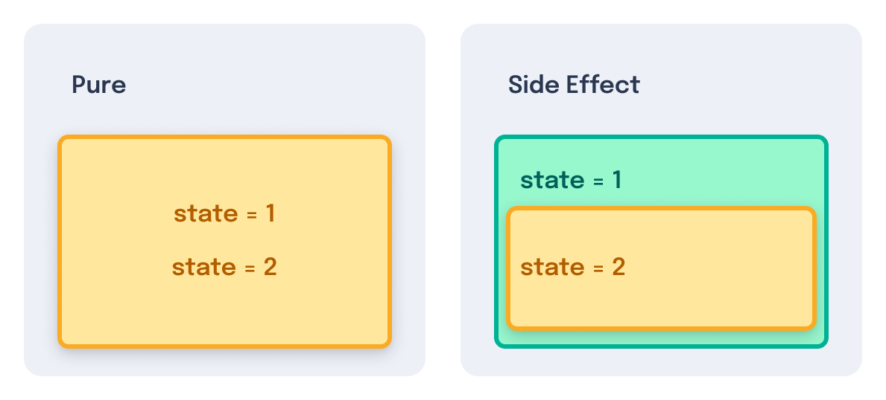
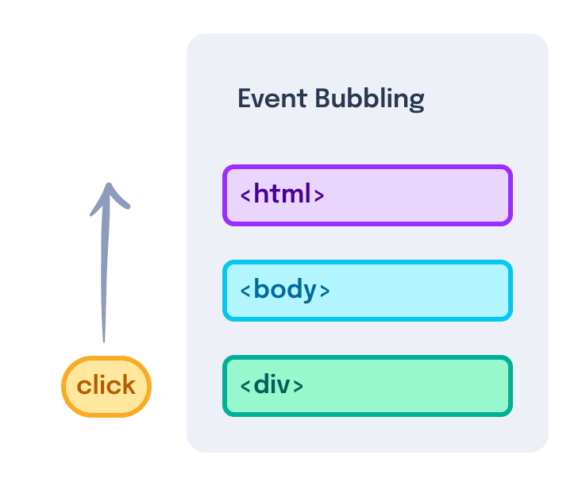
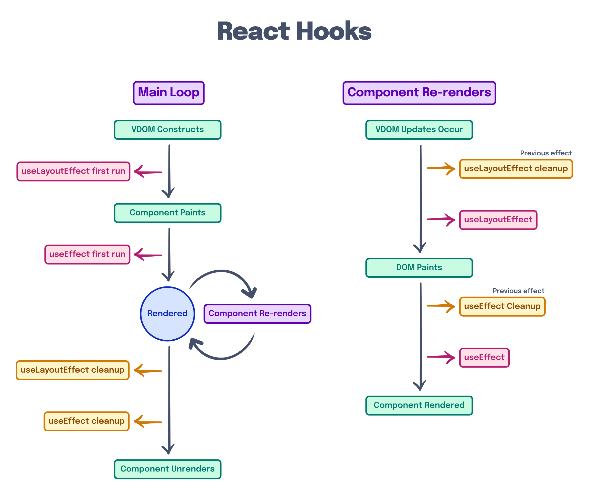
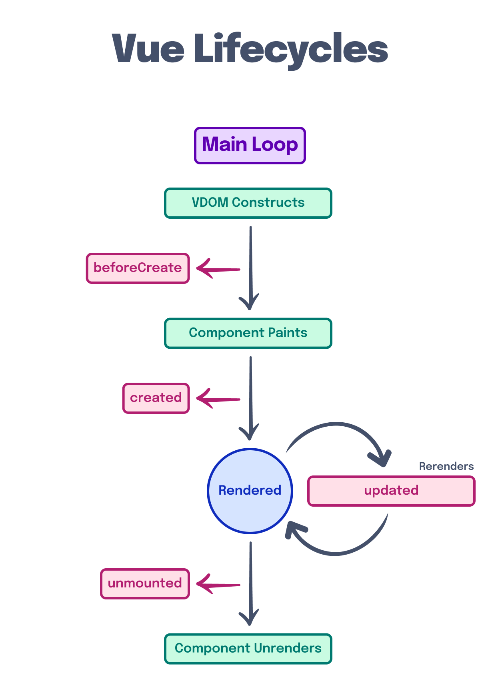
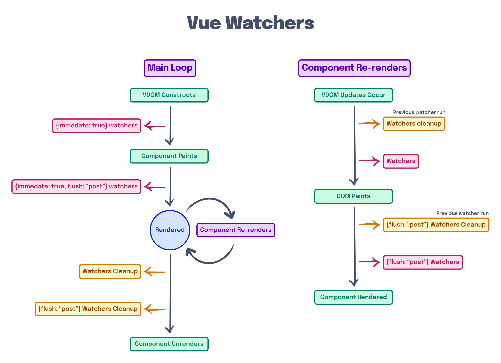

---
{
  title: "Side Effects",
  description: "",
  published: "2023-01-01T22:12:03.284Z",
  authors: ["crutchcorn"],
  tags: ["webdev"],
  attached: [],
  order: 4,
  collection: "The Framework Field Guide - Fundamentals",
}
---

While you _can_ build static websites with React, Angular, and Vue, these frameworks shine brightest when building _interactive **applications**_.

These applications come in many shape, forms, and functionalities, but all have one thing in common: They take live input from the user and display information back to the user.

This is the key difference between a static site and an interactive one; static sites show their contents and then allow the user to navigate through the site without drastic changes to the displayed content, meanwhile interactive sites drastically shift their displayed information based off of user input.

This difference carries through to how you build the application as well. While a static site might prioritize initial load by frontloading the HTML compilation [through server side render (SSR) or static site generation (SSG)](https://unicorn-utterances.com/posts/what-is-ssr-and-ssg), the interactive app is more likely to focus on processing information passed to it in order to customize your experience.

As interactive apps rely so heavily on processing information based on user input, React, Angular, and Vue all provide built-in ways of interacting, intercepting, and otherwise ingesting this information.

While each of these frameworks handles this input ingestion slightly differently, the underlying concepts are the same: **All user input and output generate "Side effects", which need to be handled.**

This raises more questions than it answers:

- What is a side effect?
- How do these frameworks handle side effects?
- How does the browser notify the framework about side effects?
- How do you ensure side effects are cleaned up?
- How do you handle in-component side effects?

Let's answer these questions one-by-one, starting with:

# What is a side effect?

A side effect is when a piece of code changes or relies on state outside its local environment. When a piece of code does not contain a side effect, it is considered "pure".



For example, say we have the following code:

```javascript
function pureFn() {
	let data = 0;
	data++;
	return data;
}
```

This logic would be considered "pure", as it does not rely on external data sources. However, if we move the `data` variable outside of the local environment and mutate it elsewhere:

```javascript
let data;

function increment() {
	data++;
}

function setupData() {
	data = 0;
	increment();
	return data;
}
```

`increment` would be considered a "side-effect" that mutates a variable outside of its own environment.

> When does this come into play in a production application?

This is a great question! A great example of this occurs in the browser with the `window` and `document` APIs.

Say we wanted to store a global counter that we use in multiple parts of the app, we might store this in `window`.

```javascript
window.shoppingCartItems = 0;

function addToShoppingCart() {
	window.shoppingCartItems++;
}

addToShoppingCart();
addToShoppingCart();
addToShoppingCart(); // window.shoppingCartItems is now `3`
```

Because `window` is a global variable, mutating a value within it is a "side effect" when done inside of a function; as the `window` variable was not declared within the `function`'s scope.

Notice how our `addToShoppingCart` method isn't returning anything; instead, it's mutating the `window` variable as a side effect to update a global value. If we attempted to remove side effects from `addToShoppingCart` without introducing a new variable, we'd be left with the following:

```js
window.shoppingCartItems = 0;

function addToShoppingCart() {
	// Nothing is happening here.
	// No side effects? Yay.
	// No functionality? Boo.
}

addToShoppingCart();
addToShoppingCart();
addToShoppingCart(); // window.shoppingCartItems is still `0`
```

Notice how `addToShoppingCart` now does nothing. To remove side effects while still retaining the functionality of incrementing a value, we'd have to both:

1. Pass an input
2. Return a value

With these changes, it might look something like this:

```js
function addToShoppingCart(val) {
	return val + 1;
}

let shoppingCartItems = 0;

shoppingCartItems = addToShoppingCart(shoppingCartItems);
shoppingCartItems = addToShoppingCart(shoppingCartItems);
shoppingCartItems = addToShoppingCart(shoppingCartItems);
// shoppingCartItems is now `3`
```

Because of the inherent nature of side effects, this demonstrates how **all functions that don't return a new value either do nothing or have a side effect within them**.

Further, because an application's inputs and outputs (combined often called "`I/O`") come from the user, rather than from the function itself, **all I/O operations are considered "side effects"**. This means that in addition to non-returning functions, all of the following are considered "side effects":

- A user typing something
- A user clicking something
- Saving a file
- Loading a file
- Making a network request
- Printing something to a printer
- Logging a value to `console`

# How do frameworks handle side effects?

As mentioned previously, side effects are mission critical for the kinds of applications that React, Angular, and Vue are all purpose-built for. To make side-effect handling easier, each framework has its own method of running code on behalf of the developer when specific events occur in the component.

Component events a framework might listen for include:

- User input events

- A component rendering for the first time

- [A component being removed from the screen as part of a conditional render](/posts/ffg-fundamentals-dynamic-html)
- A component's data or passed properties changing

The first of these component events are commonly fully transparent to most developers: User input bindings.

Take the following for example:

<!-- tabs:start -->

## React

```jsx
const Comp = () => {
	const sayHi = () => alert("Hi!");
	return <button onClick={sayHi}>Say hello</button>;
};
```

## Angular

```typescript
@Component({
	selector: "comp-comp",
	standalone: true,
	template: ` <button (click)="sayHi()">Say hello</button> `,
})
class CompComponent {
	sayHi() {
		alert("Hi!");
	}
}
```

## Vue

```vue
<!-- Comp.vue -->
<script setup>
const sayHi = () => alert("Hi!");
</script>

<template>
	<button @click="sayHi()">Say hello</button>
</template>
```

<!-- tabs:end -->

This component handles a `click` event (which is a user input, a side effect) and outputs an `alert` to the user in return (an output, another side effect).

See? Events are commonly hidden from the user when using one of these frameworks.

Let's look back at the four most common types of component side effect origin points:

- User input events

- A component rendering for the first time

- A component being removed from the screen as part of a conditional render
- A component's data or passed properties changing

While the first one was easy enough to tackle, the last three component events are often trickier to solve from a developer experience standpoint.

Oftentimes, a framework may implement an API that corresponds a developer-defined function (ran by the framework) as a one-to-one matching of these events that occur during a component's lifespan. When a framework has a one-to-one mapping of function-to-lifecycle event, **this mapping creates a series of APIs called "Lifecycle Methods"**. Angular and Vue both have lifecycle methods as part of their core APIs.

On the other hand, **some frameworks choose to implement side effect handling without lifecycle methods**. React is a key example of this, but Vue also has a non-lifecycle method of managing side effects in a component.

To explore what these side effect handlers can do, let's look at an example of a handler that runs during a component's initial render.

# Initial render side effects

When we introduced components, we touched on the [concept of "rendering"](/posts/ffg-fundamentals-intro-to-components#Rendering-the-app). This occurs when a component is drawn on-screen, either when the user loads a page for the first time or when shown or hidden using a [conditional render](/posts/ffg-fundamentals-dynamic-html#Conditional-Branches).

Say we have the following code:

<!-- tabs:start -->

## React

```jsx
const Child = () => {
	return <p>I am the child</p>;
};

const Parent = () => {
	const [showChild, setShowChild] = useState(true);

	return (
		<div>
			<button onClick={() => setShowChild(!showChild)}>Toggle Child</button>
			{showChild && <Child />}
		</div>
	);
};
```

<iframe data-frame-title="React Initial Render Demo - StackBlitz" src="uu-remote-code:./ffg-fundamentals-react-initial-render-demo-26?template=node&embed=1&file=src%2Fmain.jsx"></iframe>

## Angular

```typescript
@Component({
	selector: "child-comp",
	standalone: true,
	template: "<p>I am the child</p>",
})
export class ChildComponent {}

@Component({
	selector: "parent-comp",
	standalone: true,
	imports: [ChildComponent, NgIf],
	template: `
		<div>
			<button (click)="setShowChild()">Toggle Child</button>
			<child-comp *ngIf="showChild" />
		</div>
	`,
})
export class ParentComponent {
	showChild = true;
	setShowChild() {
		this.showChild = !this.showChild;
	}
}
```

<iframe data-frame-title="Angular Initial Render Demo - StackBlitz" src="uu-remote-code:./ffg-fundamentals-angular-initial-render-demo-26?template=node&embed=1&file=src%2Fmain.ts"></iframe>

## Vue

```vue
<!-- Child.vue -->
<template>
	<p>I am the child</p>
</template>
```

```vue
<!-- Parent.vue -->
<script setup>
import { ref } from "vue";
import Child from "./Child.vue";

const showChild = ref(true);

function setShowChild() {
	showChild.value = !showChild.value;
}
</script>

<template>
	<div>
		<button @click="setShowChild()">Toggle Child</button>
		<Child v-if="showChild" />
	</div>
</template>
```

<iframe data-frame-title="Vue Initial Render Demo - StackBlitz" src="uu-remote-code:./ffg-fundamentals-vue-initial-render-demo-26?template=node&embed=1&file=src%2Fmain.js"></iframe>

<!-- tabs:end -->

Here, `Child` is being added and removed from the DOM every time `setShowChild` is clicked. Let's say we wanted to add a way to call a `console.log` every time `Child` is shown on screen.

> Remember, `console.log` _outputs_ data to the user (albeit in a DevTools panel). As such, it's technically a side effect to call `console.log`.

While we _could_ add this log inside of `setShowChild`, it's more likely to break when we inevitably refactor the `Parent` component's code. Instead, let's use one of the aforementioned lifecycle methods to call `console.log` whenever `Child` is rendered.

<!-- tabs:start -->

## React

> React has two flavors of components: "class components", which has lifecycle methods, and "functional components", which use a different method of side effect handling. While we _could_ walk through class components, the React team has officially suggested all new applications to be developed with functional components. For this reason, we'll focus on them.

All side effects within React components are handled by two Hooks: `useEffect` and `useLayoutEffect`. Let's start by looking at `useEffect`:

```jsx
import { useEffect } from "react";

const Child = () => {
	// Pass a function that React will run for you
	useEffect(() => {
		console.log("I am rendering");
		// Pass an array of items to track changes of
	}, []);

	return <p>I am the child</p>;
};
```

Here, we're completing the task of "run `console.log` when `Child` is rendered for the first time" by allowing React to run the `console.log` side effect inside of `useEffect`. The empty array hints to React that we'd only like this function to run once: when the component initially renders.

> The empty array passed to `useEffect` has a fair bit of nuance to it, which we'll learn about later.

We mentioned earlier that there is another hook used to handle side effects: `useLayoutEffect`. While `useLayoutEffect` is useful, it requires a bit of pre-requisite knowledge that we'll touch on throughout this chapter. Let's put it to the side and come back to it later.

## Angular

In order to execute code during an initial render of a component, Angular uses a method called `ngOnInit`. This function is specially named so that Angular can call it on your behalf during the the "rendered" lifecycle event:

```typescript
import { Component, OnInit } from "@angular/core";

@Component({
	selector: "child-comp",
	standalone: true,
	template: "<p>I am the child</p>",
})
export class ChildComponent implements OnInit {
	ngOnInit() {
		console.log("I am rendering");
	}
}
```

All of Angular's lifecycle methods are prepended with `ng` and add `implements` to your component class.

This `implements` clause help TypeScript figure out which methods have which properties and throws an error when the related method is not included in the class.

## Vue

While Angular strictly uses lifecycle methods and React utilizes a `useEffect` hook to handle side effects, Vue does a bit of both.

Let's start by taking a look at Vue's lifecycle method of handling a side effect.

### Vue's `onMounted` Lifecycle Method

```vue
<!-- Child.vue -->
<script setup>
import { onMounted } from "vue";

onMounted(() => {
	console.log("I am rendering");
});
</script>

<template>
	<p>I am the child</p>
</template>
```

Here, we're importing the `onMounted` lifecycle handler from the `vue` import. Vue's lifecycle methods all start with an `on` prefix when used inside of a `<script setup>` component.

### Vue's `watchEffect` Hook

Just as React has a non-lifecycle method of running side effect, so too does Vue. This is done using Vue's `watchEffect` and `watch` APIs. Let's start with a simple example:

```vue
<!-- Child.vue -->
<script setup>
import { watchEffect } from "vue";

watchEffect(
	() => {
		console.log("I am rendering");
	},
	{ immediate: true },
);
</script>

<template>
	<p>I am the child</p>
</template>
```

Here, we're using `watchEffect` to run `console.log` as soon as the `Child` component renders.

This only occurs because we're passing `{immediate: true}` as the options for the `watchEffect`; this is not the default behavior of `watchEffect`.

Instead, `watchEffect` is commonly expected to be used alongside reactive values (like `ref` variables). We'll touch on how this works later on in the chapter.

<!-- tabs:end -->

As mentioned before, the framework itself calls these methods on your behalf when an internal event occurs; in this case, when `Child` is rendered.

Try clicking the toggle button repeatedly, and you'll see that the `console.log` occurs every time the `Child` component renders again.

# Using Side Effects in Production {#prod-side-effects}

On top of providing a global variable which we can mutate to store values, both [`window`](https://developer.mozilla.org/en-US/docs/Web/API/Window#methods) and [`document`](https://developer.mozilla.org/en-US/docs/Web/API/Document#methods) expose a number of APIs that can be useful in an application.

Let's say that inside of our component we'd like to display the window size:

<!-- tabs:start -->

## React

```jsx
const Parent = () => {
	const [height, setHeight] = useState(window.innerHeight);
	const [width, setWidth] = useState(window.innerWidth);

	return (
		<div>
			<p>Height: {height}</p>
			<p>Width: {width}</p>
		</div>
	);
};
```

## Angular

```typescript
@Component({
	selector: "window-size",
	standalone: true,
	template: `
		<div>
			<p>Height: {{ height }}</p>
			<p>Width: {{ width }}</p>
		</div>
	`,
})
export class WindowSizeComponent {
	height = window.innerHeight;
	width = window.innerWidth;
}
```

## Vue

```vue
<!-- WindowSize.vue -->
<script setup>
const height = window.innerHeight;
const width = window.innerWidth;
</script>

<template>
	<div>
		<p>Height: {{ height }}</p>
		<p>Width: {{ width }}</p>
	</div>
</template>
```

<!-- tabs:end -->

This works to display the window size on the initial render, but what happens when the user resizes their browser?

Because we aren't listening for the change in window size, we never get an updated render with the new screen size!

Let's solve this by using [`window.addEventListener`](https://developer.mozilla.org/en-US/docs/Web/API/EventTarget/addEventListener) to handle [`resize` events](https://developer.mozilla.org/en-US/docs/Web/API/Window/resize_event); emitted when the user changes their window size.

<!-- tabs:start -->

## React

```jsx {4-12}
const WindowSize = () => {
	const [height, setHeight] = useState(window.innerHeight);
	const [width, setWidth] = useState(window.innerWidth);

	useEffect(() => {
		function resizeHandler() {
			setHeight(window.innerHeight);
			setWidth(window.innerWidth);
		}

		// This code will cause a memory leak, more on that soon
		window.addEventListener("resize", resizeHandler);
	}, []);

	return (
		<div>
			<p>Height: {height}</p>
			<p>Width: {width}</p>
		</div>
	);
};
```

## Angular

```typescript {13-22}
@Component({
	selector: "window-size",
	standalone: true,
	template: `
		<div>
			<p>Height: {{ height }}</p>
			<p>Width: {{ width }}</p>
		</div>
	`,
})
export class WindowSizeComponent implements OnInit {
	height = window.innerHeight;
	width = window.innerWidth;

	resizeHandler() {
		this.height = window.innerHeight;
		this.width = window.innerWidth;
	}

	ngOnInit() {
		// This code will cause a memory leak, more on that soon
		window.addEventListener("resize", this.resizeHandler);
	}
}
```

## Vue

```vue {7-15}
<!-- WindowSize.vue -->
<script setup>
import { ref, onMounted } from "vue";

const height = ref(window.innerHeight);
const width = ref(window.innerWidth);

function resizeHandler() {
	height.value = window.innerHeight;
	width.value = window.innerWidth;
}

onMounted(() => {
	// This code will cause a memory leak, more on that soon
	window.addEventListener("resize", resizeHandler);
});
</script>

<template>
	<div>
		<p>Height: {{ height }}</p>
		<p>Width: {{ width }}</p>
	</div>
</template>
```

<!-- tabs:end -->

Now, when we resize the browser, our values on-screen should update as well.

## Event Bubbling Aside

In our introduction to components, we demonstrated that [components can listen to HTML events](/posts/ffg-fundamentals-intro-to-components#Event-Binding).

What if we changed our code above to listen for the `resize` event that way to sidestep `addEventListener`?

<!-- tabs:start -->

### React

```jsx
const WindowSize = () => {
	const [height, setHeight] = useState(window.innerHeight);
	const [width, setWidth] = useState(window.innerWidth);

	function resizeHandler() {
		setHeight(window.innerHeight);
		setWidth(window.innerWidth);
	}

	// This code doesn't work, we'll explain why soon
	return (
		<div onResize={resizeHandler}>
			<p>Height: {height}</p>
			<p>Width: {width}</p>
		</div>
	);
};
```

### Angular

```typescript
@Component({
	selector: "window-size",
	standalone: true,
	template: `
		<!-- This code doesn't work, we'll explain why soon -->
		<div (resize)="resizeHandler()">
			<p>Height: {{ height }}</p>
			<p>Width: {{ width }}</p>
		</div>
	`,
})
export class WindowSizeComponent implements OnInit {
	height = window.innerHeight;
	width = window.innerWidth;

	resizeHandler() {
		this.height = window.innerHeight;
		this.width = window.innerWidth;
	}
}
```

### Vue

```vue
<!-- WindowSize.vue -->
<script setup>
import { ref } from "vue";

const height = ref(window.innerHeight);
const width = ref(window.innerWidth);

function resizeHandler() {
	height.value = window.innerHeight;
	width.value = window.innerWidth;
}
</script>

<template>
	<!-- This code doesn't work, we'll explain why soon -->
	<div @resize="resizeHandler()">
		<p>Height: {{ height }}</p>
		<p>Width: {{ width }}</p>
	</div>
</template>
```

<!-- tabs:end -->

If we run this code, it will render as-expected with the initial screen size, but on subsequent re-renders will not update the value on screen. This is because the `resize` event is only triggered on the `window` object (associated with the `<html>` tag) and does not permeate downwards towards other elements.

You see, by default, events will always "bubble" upwards in the DOM tree from their emitted position. So, if we click on a `div`, the `click` event will start from the `div` and bubble all the way up to the `html` tag.



We can demonstrate this inside of our frameworks.

<!-- tabs:start -->

### React

```jsx
<div onClick={() => logMessage()}>
	<p>
		<span>Click me</span> or even me!
	</p>
</div>
```

### Angular

```html
<div (click)="logMessage()">
	<p><span>Click me</span> or even me!</p>
</div>
```

### Vue

```html
<div @click="logMessage()">
	<p><span>Click me</span> or even me!</p>
</div>
```

<!-- tabs:end -->

If you click on the `span`, the `click` event will start from the `span`, bubble up to the `p` tag, then finally bubble up to the `div`. Because we add an event listener on the `div`, it will run `logMessage`, even when clicking on the `span`.

This is why we don't we simply utilize event binding for the `resize` event: It's only ever emitted directly from the `html` node. Because of this behavior, if we want to access the `resize` event inside of our `WindowSize` component, we need to use `addEventListener`.

[You can learn more about event bubbling, how it works, and how to overwrite it in specific instances from Mozilla Developer Network.](https://developer.mozilla.org/en-US/docs/Learn/JavaScript/Building_blocks/Events#event_bubbling_and_capture)

# Cleaning up side effects

Let's put down the code for a moment and talk about side effects with an analogy.

Let's say you're watching a TV show on a television that lacks the ability to rewind or go forward, but does have the ability to pause.

> This might sound weird, but stick with me.

You're right at the peak moment of the show when suddenly your smoke alarm goes off.

"Oh no!" Your popcorn burnt in the microwave.

You have two options:

1. Pause the show then stop the microwave.
2. Don't pause the show, go stop the microwave immediately.

While the second option might be the more natural reaction at a moment's notice, you'll find yourself with a problem: You just missed the big announcement in the show and now you're left confused when you return to the TV.

Given your particular TV's lack of rewind functionality, you'd be stuck where you were without restarting the episode.

However, if you had paused the show, you would have been able to un-pause once you'd turned off the microwave and see what the big reveal was.

---

> Surely, this analogy doesn't have much to do with frontend development, does it?

Ahh, but it does!

See, think of the TV as being a component in your app with a side effect. Let's use this clock component as an example:

<!-- tabs:start -->

## React

```jsx
const Clock = () => {
	const [time, setTime] = useState(formatDate(new Date()));

	useEffect(() => {
		setInterval(() => {
			console.log("I am updating the time");
			setTime(formatDate(new Date()));
		}, 1000);
	}, []);

	return <p role="timer">Time is: {time}</p>;
};

function formatDate(date) {
	return (
		prefixZero(date.getHours()) +
		":" +
		prefixZero(date.getMinutes()) +
		":" +
		prefixZero(date.getSeconds())
	);
}

function prefixZero(number) {
	if (number < 10) {
		return "0" + number.toString();
	}

	return number.toString();
}
```

## Angular

```typescript
@Component({
	selector: "clock-comp",
	standalone: true,
	template: ` <p role="timer">Time is: {{ time }}</p> `,
})
export class ClockComponent implements OnInit {
	time = formatDate(new Date());

	ngOnInit() {
		setInterval(() => {
			console.log("I am updating the time");
			this.time = formatDate(new Date());
		}, 1000);
	}
}

function formatDate(date) {
	return (
		prefixZero(date.getHours()) +
		":" +
		prefixZero(date.getMinutes()) +
		":" +
		prefixZero(date.getSeconds())
	);
}

function prefixZero(number) {
	if (number < 10) {
		return "0" + number.toString();
	}

	return number.toString();
}
```

## Vue

```vue
<!-- Clock.vue -->
<script setup>
import { ref, onMounted } from "vue";

const time = ref(formatDate(new Date()));

onMounted(() => {
	setInterval(() => {
		console.log("I am updating the time");
		time.value = formatDate(new Date());
	}, 1000);
});

function formatDate(date) {
	return (
		prefixZero(date.getHours()) +
		":" +
		prefixZero(date.getMinutes()) +
		":" +
		prefixZero(date.getSeconds())
	);
}

function prefixZero(number) {
	if (number < 10) {
		return "0" + number.toString();
	}

	return number.toString();
}
</script>

<template>
	<p role="timer">Time is: {{ time }}</p>
</template>
```

<!-- tabs:end -->

In this example, we're [calling `setInterval` to run a function every second](https://developer.mozilla.org/en-US/docs/Web/API/setInterval). This function does two things:

1. Updates `time` to include [the current `Date`'s](https://developer.mozilla.org/en-US/docs/Web/JavaScript/Reference/Global_Objects/Date/Date) hour, minute, and second hand in its string
2. `console.log` a message

This `setInterval` call occurs on every `Clock` component render thanks to each frameworks' lifecycle methods.

Let's now render this `Clock` component inside of a conditional block:

<!-- tabs:start -->

## React

```jsx
export default function App() {
	const [showClock, setShowClock] = useState(true);

	return (
		<div>
			<button onClick={() => setShowClock(!showClock)}>Toggle clock</button>
			{showClock && <Clock />}
		</div>
	);
}
```

## Angular

```typescript
@Component({
	selector: "app-root",
	standalone: true,
	imports: [NgIf, ClockComponent],
	template: `
		<div>
			<button (click)="setShowClock(!showClock)">Toggle clock</button>
			<clock-comp *ngIf="showClock" />
		</div>
	`,
})
export class AppComponent {
	showClock = true;

	setShowClock(val) {
		this.showClock = val;
	}
}
```

## Vue

```vue
<!-- App.vue -->
<script setup>
import Clock from "./Clock.vue";
import { ref } from "vue";

const showClock = ref(true);

function setShowClock(val) {
	showClock.value = val;
}
</script>

<template>
	<div>
		<button @click="setShowClock(!showClock)">Toggle clock</button>
		<Clock v-if="showClock" />
	</div>
</template>
```

<!-- tabs:end -->

In `App`, we're defaulting `showClock` to `true`. This means that our `Clock` component will render on `App`'s first render.

We can visually see that our clock is updating every second, but the really interesting part to us is the `console.log`. If we open up our browser's developer tools, we can see that it's logging every time it's updating on screen as well.

However, let's toggle the `Clock` component a couple of times by clicking the button.

<video src="./lifecycle_timer.mp4" title="A browser showing developer tools and clock component rendering. On first render, the console.log occurs once per visual clock update, but on subsequent renders of the Clock component, the console.log runs too frequently"></video>

When we toggle the clock from rendering each time, it doesn't stop the `console.log` from running. However, when we re-render `Clock`, it creates a new interval of `console.log`s. This means that if we toggle the `Clock` component three times, it will run `console.log` three times for each update of the on-screen time.

**This is really bad behavior**. Not only does this mean that our computer is running more code than needed in the background, but it also means that the function which was passed to the `setInterval` call cannot be cleaned up by your browser. This means that your `setInterval` function (and all variables within it) stay in-memory, which may eventually cause an out-of-memory crash if it occurs too frequently.

Moreover, this can directly impact your applications' functionality as well. Let's take a look at how that can happen:

## Broken Production Code

Imagine you're building an alarm clock application. You want to have the following functionality:

- Show the remaining time on an alarm
- Show a "wake up" screen
- "Snooze" alarms for 5 minutes (temporarily reset the countdown of the timer to 5 minutes)
- Disable alarms entirely

Additionally, let's throw in **the ability to auto-snooze alarms that have been going off for 10 minutes**. After all, someone in deep sleep is more likely to wake up from a change in noise volume rather than a repeating loud noise.

Let's build that functionality now, but reduce the "minutes" to "seconds" for easier testing:

<!-- tabs:start -->

### React

```jsx
function AlarmScreen({ snooze, disable }) {
	useEffect(() => {
		setTimeout(() => {
			// Automatically snooze the alarm
			// after 10 seconds of inactivity
			// In production this would be 10 minutes
			snooze();
		}, 10 * 1000);
	}, []);

	return (
		<div>
			<p>Time to wake up!</p>
			<button onClick={snooze}>Snooze for 5 seconds</button>
			<button onClick={disable}>Turn off alarm</button>
		</div>
	);
}

function App() {
	const [secondsLeft, setSecondsLeft] = useState(5);
	const [timerEnabled, setTimerEnabled] = useState(true);

	useEffect(() => {
		setInterval(() => {
			setSecondsLeft((v) => {
				if (v === 0) return v;
				return v - 1;
			});
		}, 1000);
	}, []);

	const snooze = () => {
		// In production this would add 5 minutes, not 5 seconds
		setSecondsLeft((v) => v + 5);
	};

	const disable = () => {
		setTimerEnabled(false);
	};

	if (!timerEnabled) {
		return <p>There is no timer</p>;
	}

	if (secondsLeft === 0) {
		return <AlarmScreen snooze={snooze} disable={disable} />;
	}

	return <p>{secondsLeft} seconds left in timer</p>;
}
```

### Angular

```typescript
@Component({
	selector: "alarm-screen",
	standalone: true,
	template: `
		<div>
			<p>Time to wake up!</p>
			<button (click)="snooze.emit()">Snooze for 5 seconds</button>
			<button (click)="disable.emit()">Turn off alarm</button>
		</div>
	`,
})
export class AlarmScreenComponent implements OnInit {
	@Output() snooze = new EventEmitter();
	@Output() disable = new EventEmitter();

	ngOnInit() {
		setTimeout(() => {
			// Automatically snooze the alarm
			// after 10 seconds of inactivity
			// In production this would be 10 minutes
			this.snooze.emit();
		}, 10 * 1000);
	}
}

@Component({
	selector: "app-root",
	standalone: true,
	imports: [NgIf, AlarmScreenComponent],
	template: `
		<p *ngIf="!timerEnabled; else timerDisplay">There is no timer</p>
		<ng-template #timerDisplay>
			<alarm-screen
				*ngIf="secondsLeft === 0; else secondsDisplay"
				(snooze)="snooze()"
				(disable)="disable()"
			/>
		</ng-template>
		<ng-template #secondsDisplay>
			<p>{{ secondsLeft }} seconds left in timer</p>
		</ng-template>
	`,
})
export class AppComponent implements OnInit {
	secondsLeft = 5;
	timerEnabled = true;

	ngOnInit() {
		setInterval(() => {
			if (this.secondsLeft === 0) return;
			this.secondsLeft = this.secondsLeft - 1;
		}, 1000);
	}

	snooze() {
		this.secondsLeft = this.secondsLeft + 5;
	}

	disable() {
		this.timerEnabled = false;
	}
}
```

### Vue

```vue
<!-- AlarmScreen.vue -->
<script setup>
import { ref, onMounted } from "vue";

const emit = defineEmits(["snooze", "disable"]);

onMounted(() => {
	setTimeout(() => {
		// Automatically snooze the alarm
		// after 10 seconds of inactivity
		// In production this would be 10 minutes
		emit("snooze");
	}, 10 * 1000);
});
</script>

<template>
	<div>
		<p>Time to wake up!</p>
		<button @click="emit('snooze')">Snooze for 5 seconds</button>
		<button @click="emit('disable')">Turn off alarm</button>
	</div>
</template>
```

```vue
<!-- App.vue -->
<script setup>
import AlarmScreen from "./AlarmScreen.vue";
import { ref, onMounted } from "vue";

const secondsLeft = ref(5);
const timerEnabled = ref(true);

onMounted(() => {
	setInterval(() => {
		if (secondsLeft.value === 0) return;
		secondsLeft.value = secondsLeft.value - 1;
	}, 1000);
});

const snooze = () => {
	secondsLeft.value = secondsLeft.value + 5;
};

const disable = () => {
	timerEnabled.value = false;
};
</script>

<template>
	<p v-if="!timerEnabled">There is no timer</p>
	<AlarmScreen
		v-else-if="secondsLeft === 0"
		@snooze="snooze()"
		@disable="disable()"
	/>
	<p v-else>{{ secondsLeft }} seconds left in timer</p>
</template>
```

<!-- tabs:end -->

Yes! It renders the seconds to countdown, and then shows the `AlarmScreen` as expected. Even our "auto-snooze" functionality is working as intended.

Let's test our manual "snooze" button and see if that works as expe-...

> Wait, did the timer screen go from 4 seconds to 9? That's not how a countdown works!

<video src="./timer_incorrect_loop.mp4" title="A browser displays the second countdown to the alarm screen, but when the user clicks on the 'snooze' button, the countdown goes from '4 seconds left' to '9 seconds left' and keeps counting down from there like normal"></video>

Sure enough, if you happen to click the manual "Snooze" button right before the auto-snooze goes off, it will add an extra 5 seconds to your existing countdown.

This occurs because we never tell the `AlarmScreen`'s `setTimeout` to stop running, even when `AlarmScreen` is no longer rendered.

```javascript
// AlarmScreen component
setTimeout(() => {
	snooze();
}, 10 * 1000);
```

When the above code's `snooze` runs, it will add 4 seconds to the `secondsLeft` variable through the `App`'s `snooze` method.

To solve this, we simply need to tell our `AlarmScreen` component to cancel the `setTimeout` when it's no longer rendered. Let's look at we can do that with an `unmounted` lifecycle method.

## Unmount Lifecycle Method

In our previous code sample, we showed that mounted lifecycle methods left unclean will cause bugs in our apps and performance headaches for our users.

Let's cleanup these lifecycle methods using a lifecycle method that runs during unmounting. To do this, we'll use JavaScript's `clearTimeout` to remove any `setTimeout`s that are left unrun:

```javascript
const timeout = setTimeout(() => {
	// ...
}, 1000);

// This stops a timeout from running if unran.
// Otherwise, it does nothing.
clearTimeout(timeout);
```

Similarly, when using `setInterval`, there's a `clearInterval` method we can use for cleanup:

```javascript
const interval = setInterval(() => {
	// ...
}, 1000);

// This stops an interval from running
clearInterval(interval);
```

<!-- tabs:start -->

### React

To run a cleanup function on React's `useEffect`, return a function inside of the `useEffect`.

```jsx
const Comp = () => {
	useEffect(() => {
		return () => {
			console.log("I am cleaning up");
		};
	}, []);
};
```

This returned function will be ran whenever:

- `useEffect` is re-ran.
  - The returned function is ran before the new `useEffect` instance is run.
- `Comp` is unrendered.

> It may seem like I said the same thing twice here, however `useEffect` can be ran independent of a component's initial render lifecycle. More on that soon.

Let's apply this returned function to our code sample previously:

```jsx
function AlarmScreen({ snooze, disable }) {
	useEffect(() => {
		const timeout = setTimeout(() => {
			// Automatically snooze the alarm
			// after 10 seconds of inactivity
			// In production this would be 10 minutes
			snooze();
		}, 10 * 1000);

		return () => clearTimeout(timeout);
	}, []);

	// ...
}

function App() {
	// ...

	useEffect(() => {
		const timeout = setInterval(() => {
			setSecondsLeft((v) => {
				if (v === 0) return v;
				return v - 1;
			});
		}, 1000);

		return () => clearInterval(timeout);
	}, []);

	// ...
}
```

### Angular

When we add a mounted lifecycle to Angular, we:

- Import `OnInit`
- Add `OnInit` to the component's `implements` keyword
- Add `ngOnInit` method to the component

To add an unmounted lifecycle method to an Angular component, we do the same steps as above, but with `OnDestroy` instead:

```typescript
import {
	Component,
	EventEmitter,
	OnInit,
	Output,
	OnDestroy,
} from "@angular/core";

@Component({
	selector: "alarm-screen",
	standalone: true,
	// ...
})
export class AlarmScreenComponent implements OnInit, OnDestroy {
	// ...

	timeout: number | undefined = undefined;

	ngOnInit() {
		this.timeout = setTimeout(() => {
			if (this.secondsLeft === 0) return;
			this.secondsLeft = this.secondsLeft - 1;
		}, 1000);
	}

	ngOnDestroy() {
		clearTimeout(this.timeout);
	}

	// ...
}

@Component({
	selector: "app-root",
	standalone: true,
	// ...
})
export class AppComponent implements OnInit, OnDestroy {
	// ...

	interval: number | undefined = undefined;

	ngOnInit() {
		this.interval = setInterval(() => {
			if (this.secondsLeft === 0) return;
			this.secondsLeft = this.secondsLeft - 1;
		}, 1000);
	}

	ngOnDestroy() {
		clearInterval(this.interval);
	}

	// ...
}
```

### Vue

Similar to how we import `onMounted` we can import `onUnmounted` in Vue to run the relevant lifecycle method.

```vue
<!-- AlarmScreen.vue -->
<script setup>
import { ref, onMounted, unUnmounted } from "vue";

const emit = defineEmits(["snooze", "disable"]);

// We don't need to wrap this in `ref`, since it won't be used in `template`
let timeout;

onMounted(() => {
	timeout = setTimeout(() => {
		// Automatically snooze the alarm
		// after 10 seconds of inactivity
		// In production this would be 10 minutes
		emit("snooze");
	}, 10 * 1000);
});

unUnmounted(() => {
	clearTimeout(timeout);
});
</script>

<template>
	<!-- ... -->
</template>
```

```vue
<!-- App.vue -->
<script setup>
import AlarmScreen from "./AlarmScreen.vue";
import { ref, onMounted, onUnmounted } from "vue";

// We don't need to wrap this in `ref`, since it won't be used in `template`
let interval;

onMounted(() => {
	interval = setInterval(() => {
		if (secondsLeft.value === 0) return;
		secondsLeft.value = secondsLeft.value - 1;
	}, 1000);
});

unUnmounted(() => {
	clearInterval(interval);
});

// ...
</script>

<template>
	<!-- ... -->
</template>
```

#### Vue's `watchEffect` cleanup

As mentioned previously, Vue has two methods of handling side effects; Lifecycle methods and `watchEffect`. Luckily, `watchEffect` also has the ability to cleanup side effects that were created before.

To cleanup effect, `watchEffect` provides an argument to the inner `watchEffect` function, which we'll name `onCleanup`. This property is, in itself, a function which we call with the cleanup logic:

```javascript
// onCleanup is a property passed to the inner `watchEffect` function
watchEffect(
	(onCleanup) => {
		const interval = setInterval(() => {
			console.log("Hello!");
		}, 1000);

		// We then call `onCleanup` with the expected cleaning behavior
		onCleanup(() => {
			clearInterval(interval);
		});
	},
	{ immediate: true },
);
```

Let's rewrite the previous code samples to use `watchEffect`:

```vue
<!-- App.vue -->
<script setup>
import AlarmScreen from "./AlarmScreen.vue";
import { ref, watchEffect } from "vue";

const secondsLeft = ref(5);
const timerEnabled = ref(true);

watchEffect(
	(onCleanup) => {
		const interval = setInterval(() => {
			if (secondsLeft.value === 0) return;
			secondsLeft.value = secondsLeft.value - 1;
		}, 1000);

		onCleanup(() => {
			clearInterval(interval);
		});
	},
	{ immediate: true },
);

const snooze = () => {
	secondsLeft.value = secondsLeft.value + 5;
};

const disable = () => {
	timerEnabled.value = false;
};
</script>

<template>
	<p v-if="!timerEnabled">There is no timer</p>
	<AlarmScreen
		v-else-if="secondsLeft === 0"
		@snooze="snooze()"
		@disable="disable()"
	/>
	<p v-else>{{ secondsLeft }} seconds left in timer</p>
</template>
```

```vue
<!-- AlarmScreen.vue -->
<script setup>
import { ref, watchEffect } from "vue";

const emit = defineEmits(["snooze", "disable"]);

watchEffect((onCleanup) => {
	const timeout = setTimeout(() => {
		// Automatically snooze the alarm
		// after 10 seconds of inactivity
		// In production this would be 10 minutes
		emit("snooze");
	}, 10 * 1000);

	onCleanup(() => clearTimeout(timeout));
});
</script>

<template>
	<div>
		<p>Time to wake up!</p>
		<button @click="emit('snooze')">Snooze for 5 seconds</button>
		<button @click="emit('disable')">Turn off alarm</button>
	</div>
</template>
```

<!-- tabs:end -->

## Cleaning up event listeners

[We had a code sample earlier in the chapter that relied on `addEventListener` to get the window size](#prod-side-effects). This code sample, you may have guessed, had a memory leak in it because we never cleaned up this event listener.

To clean up an event listener, we must remove its reference from the `window` object via `removeEventListener`:

```javascript
const fn = () => console.log("a");
window.addEventListener("resize", fn);
window.removeEventListener("resize", fn);
```

> Something to keep in mind with `removeEventListener` is that it needs to be the same function passed as the second argument to remove it from the listener.
>
> This means that inline arrow functions like this:
>
> ```javascript
> window.addEventListener("resize", () => console.log("a"));
> window.removeEventListener("resize", () => console.log("a"));
> ```
>
> Won't work, but the following will:
>
> ```javascript
> const fn = () => console.log("a");
> window.addEventListener("resize", fn);
> window.removeEventListener("resize", fn);
> ```

Let's fix our `WindowSize` component from before by cleaning up the event listener side effect using the knowledge we have now.

<!-- tabs:start -->

### React

```jsx
const WindowSize = () => {
	const [height, setHeight] = useState(window.innerHeight);
	const [width, setWidth] = useState(window.innerWidth);

	useEffect(() => {
		function resizeHandler() {
			setHeight(window.innerHeight);
			setWidth(window.innerWidth);
		}
		window.addEventListener("resize", resizeHandler);

		return () => window.removeEventListener("resize", resizeHandler);
	}, []);

	return (
		<div>
			<p>Height: {height}</p>
			<p>Width: {width}</p>
		</div>
	);
};
```

### Angular

```typescript
@Component({
	selector: "window-size",
	standalone: true,
	template: `
		<div>
			<p>Height: {{ height }}</p>
			<p>Width: {{ width }}</p>
		</div>
	`,
})
export class WindowSizeComponent implements OnInit, OnDestroy {
	height = window.innerHeight;
	width = window.innerWidth;

	// This must be an arrow function, see below for more
	resizeHandler = () => {
		this.height = window.innerHeight;
		this.width = window.innerWidth;
	};

	ngOnInit() {
		window.addEventListener("resize", this.resizeHandler);
	}

	ngOnDestroy() {
		window.removeEventListener("resize", this.resizeHandler);
	}
}
```

Here, we're making sure to use an arrow function for `resizeHandler` in order to make sure that `removeEventListener` works as-expected.

To learn more about _why_ that is, [read this article I wrote about this topic](https://unicorn-utterances.com/posts/javascript-bind-usage).

### Vue

Using lifecycles, this would be:

```vue
<!-- WindowSize.vue -->
<script setup>
import { ref, onMounted, onUnmounted } from "vue";

const height = ref(window.innerHeight);
const width = ref(window.innerWidth);

function resizeHandler() {
	height.value = window.innerHeight;
	width.value = window.innerWidth;
}

onMounted(() => {
	window.addEventListener("resize", resizeHandler);
});

onUnmounted(() => {
	window.removeEventListener("resize", resizeHandler);
});
</script>

<template>
	<div>
		<p>Height: {{ height }}</p>
		<p>Width: {{ width }}</p>
	</div>
</template>
```

Or, using `watchEffect`, this is:

```vue
<!-- WindowSize.vue -->
<script setup>
import { ref, watchEffect } from "vue";

const height = ref(window.innerHeight);
const width = ref(window.innerWidth);

function resizeHandler() {
	height.value = window.innerHeight;
	width.value = window.innerWidth;
}

watchEffect(
	(onCleanup) => {
		window.addEventListener("resize", resizeHandler);
		onCleanup(() => window.removeEventListener("resize", resizeHandler));
	},
	{ immediate: true },
);
</script>

<template>
	<div>
		<p>Height: {{ height }}</p>
		<p>Width: {{ width }}</p>
	</div>
</template>
```

<!-- tabs:end -->

## Ensuring lifecycle cleanup

Some frameworks have taken extra steps to ensure your lifecycle methods always clean up side effects.

<!-- tabs:start -->

### React

When React 16.3 came out, [it introduced a new component called `StrictMode`](https://reactjs.org/blog/2018/03/29/react-v-16-3.html#strictmode-component).

`StrictMode` was developed to help warn developers of potential problems that lie dormant in their applications. It's commonly enabled in most production codebases and is used at the root of the app like so:

```jsx
import React from "react";
import ReactDOM from "react-dom";
import App from "./App";

ReactDOM.render(
	<App />,
	<React.StrictMode>
		<App />
	</React.StrictMode>,
	document.getElementById("root"),
);
```

Specifically, `StrictMode` helps find issues with:

- Unsafe lifecycle usage
- Legacy API usage
- Unexpected side effects

It does so by modifying slight behaviors of your app and printing errors when needed.

> `StrictMode` only does this on development builds of your app and does not impact your code whatsoever during production.

[Since React 18, `StrictMode` will re-run all `useEffect`s twice](https://unicorn-utterances.com/posts/why-react-18-broke-your-app). This change was made by the React team in order to highlight potential bugs in your application that are caused by un-cleaned side effects.

If you have code that does not work with `StrictMode`, this is most likely the culprit and you should investigate all side effect cleanups in your components.

### Angular

Angular does not have any special behaviors with `OnInit` to force component cleanup. React, however, does.

### Vue

Vue does not have any special behaviors with `OnInit` to force component cleanup. React, however, does.

<!-- tabs:end -->

# Re-renders

While rendering and un-rendering are primary actions in a component's lifecycle, they're not the _only_ lifecycle methods on the table.

Each of the frameworks has a handful of lifecycle methods beyond the two we've looked at today. However, this is where these frameworks tend to diverge, as their lifecycle methods tend to reflect the framework's internals. While we'll touch on the framework's internals [in the third book of the series](https://unicorn-utterances.com/collections/framework-field-guide#internals-title), for now, let's take a look at one more component lifecycle that's _relatively_ consistent between most frameworks: Re-rendering.

Re-rendering is what it sounds like; While the initial "render" is what allows us to see the first contents on screen being drawn, subsequent updates — like our live-updated values — are drawn during subsequent "re-renders".

Re-renders may occur for many reasons:

- Props being updated
- State being changed
- Explicitly calling a re-render via other means

Let's take a look at how each framework exposes re-rendering to the user via lifecycle methods.

<!-- tabs:start -->

## React

Up until this point, we've only ever passed an empty array to `useEffect`:

```jsx
useEffect(() => {
	doSomething();
	// This doesn't have to be an empty array
}, []);
```

This empty array _hints_ to React to "only run this side effect once: when the component is first rendered".

> React may choose in specific instances, such as `StrictMode`, to ignore this hint. Because of this, `useEffect`'s array should be treated as a performance optimization for React, not a steadfast rule.

Let's take a look at the inverse of this "never run this function again" React hint:

```jsx
useEffect(() => {
	doSomething();
	// Notice no array
});
```

Here, we're _not passing an array_ to `useEffect` which tells the framework that it can (and should) run the side effect on **every** single render, regardless of if said render has updated the DOM or not.

See, not every re-render of a component triggers an on-screen change. Some re-renders will update values, re-run the function body of a component, but not update the screen.

While **all** renders have a state comparison step, like the one that occurs to validate if the `useEffect` array has changed, **only renders that update the value on-screen have a "paint" step**. This "paint" updates the values on-screen to the user.

Given this, the following code will _re-render but not paint_ when the user clicks the `button`.

```jsx
const ReRenderListener = () => {
	const [_, updateState] = useState(0);

	useEffect(() => {
		console.log("Component has re-rendered");
	}); // Notice the lack of an array

	return <button onClick={() => updateState((v) => v + 1)}>Re-render</button>;
};
```

Because the `button` triggers a re-render, `useEffect` will run, even if there is not a paint.

> You may think we're done with `useEffect` now, but there's yet another usage for the passed array, which we'll touch on shortly.

## Angular

We mentioned earlier that outside of the basics of "rendering" and "un-rendering", each framework tends to diverge. Well, dear reader, it's coming into play here.

Angular does not have a lifecycle method specifically for when a component re-renders. This is because Angular does not track DOM changes internally the same way the other two frameworks do.

This isn't to say that Angular components don't re-draw the DOM — we've already demonstrated that it's able to live-refresh the DOM when data changes — just that Angular doesn't provide a lifecycle for detecting when it does.

To answer "why" is a much longer topic, [which I've written about in a dedicated blog post](https://unicorn-utterances.com/posts/angular-internals-zonejs), but in the meantime feel free to see how the other two frameworks work as a reference for what you might expect elsewhere.

## Vue

```vue
<!-- ReRenderListener.vue -->
<script setup>
import { onUpdated } from "vue";

const props = defineProps(["val"]);

onUpdated(() => {
	console.log("Component was painted");
});
</script>

<template>
	<div>{{ val }}</div>
</template>
```

Every time the `ReRenderListener` component updates the DOM with new changes, the `onUpdated` method will run.

<!-- tabs:end -->

# In-component property side effects

Up to this point, we've looked at component-wide events such as "rendering the component" and "unrendering the component".

While these events are undeniably helpful to be able to hook into, most user input doesn't cause this drastic of a change.

For example, let's say we wanted to update the browser tab's title when we select a new document:

 <!-- tabs:start -->

## React

```jsx
const App = () => {
	const [title, setTitle] = useState("Movies");

	return <div>
      <button onClick={() => setTitle('Movies')}">Movies</button>
      <button onClick={() => setTitle('Music')}">Music</button>
      <button onClick={() => setTitle('Documents')}">Documents</button>
	</div>
}
```

## Angular

```typescript
@Component({
	selector: "app-root",
	standalone: true,
	template: `
		<button (click)="title = 'Movies'">Movies</button>
		<button (click)="title = 'Music'">Music</button>
		<button (click)="title = 'Documents'">Documents</button>
	`,
})
export class AppComponent {
	title = "Movies";
}
```

## Vue

```vue
<!-- App.vue -->
<script setup>
import { ref, watchEffect } from "vue";

const title = ref("Movies");
</script>

<template>
	<button @click="title = 'Movies'">Movies</button>
	<button @click="title = 'Music'">Music</button>
	<button @click="title = 'Documents'">Documents</button>
</template>
```

<!-- tabs:end -->

Here, `title` is a variable that is being updated, which triggers a re-render. Because the framework knows how to trigger a re-render based of a reactive change, it also has the ability to trigger a side effect whenever a value is changed.

Let's see how we do this in React, Angular, and Vue:

<!-- tabs:start -->

## React

Earlier in the chapter, we looked at how an empty array passed to `useEffect` hints to React that you only want the inner function running once. We also saw how passing no array will cause `useEffect`'s function to run in every re-render.

These are two ends of an extreme; the middle-ground comes in the form of passing specific functions to your `useEffect`:

```jsx
const App = () => {
	const [title, setTitle] = useState("Movies");

	useEffect(() => {
        document.title = title.value;

        // Ask React to only run this `useEffect` if `title` has changed
    }, [title])

	return <div>
      <button onClick={() => setTitle('Movies')}">Movies</button>
      <button onClick={() => setTitle('Music')}">Music</button>
      <button onClick={() => setTitle('Documents')}">Documents</button>
	</div>
}
```

By doing this, we're _hinting_ to React that this side effect should only ever run when the `test` variable's _reference_ has changed during a render.

### Stale Values

When using a component's variables within `useEffect`, **it's absolutely imperative that we include all of the utilized variables within the `useEffect` array**.

This is because any variables left outside of `useEffect` will likely result in "stale" data.

"Stale" data is any data that is out-of-date from the "true"/intended value. This occurs when you pass data to a function inside of [a "closure"](https://whatthefuck.is/closure) and do not update the value later.

Take the following code sample:

```jsx
function App() {
	const [count, setCount] = useState(0);

	useEffect(() => {
		setInterval(() => {
			console.log("Count is: " + count);
		}, 1000);
	}, []);

	return (
		<div>
			{count}
			<button onClick={() => setCount(count + 1)}>Add</button>
		</div>
	);
}
```

Here, we're telling React to `console.log` the `count` value every second inside of a `setInterval`.

However, because we're not passing `count` to the `useEffect` array, the `console.log` will never show any value other than:

```js
"Count is: 0";
```

This is because our `useEffect` has a "stale" value of `count` and React is never telling the function to update with the new `count` value.

To solve this, we can add `count` to the `useEffect` array:

```js
useEffect(() => {
	setInterval(() => {
		console.log("Count is: " + count);
	}, 1000);
}, [count]);
```

### Persist data without re-rendering using `useRef`

Let's go back to our `document.title` example. Say that instead of updating the `title` and `document.title` right away, we want to delay the updating of both using a `setTimeout`:

```jsx
const App = () => {
	const [title, setTitle] = useState("Movies");

	function updateTitle(val) {
		setTimeout(() => {
	        setTitle(val);
	        document.title = title.value;
		}, 5000);
	}

	return <div>
      <button onClick={() => updateTitle('Movies')}">Movies</button>
      <button onClick={() => updateTitle('Music')}">Music</button>
      <button onClick={() => updateTitle('Documents')}">Documents</button>
	</div>
}
```

If we click one of these buttons, and un-render the `App` component, our `setTimeout` will still execute because we've never told this component to cancel the timeout.

While we could solve this problem using a `useState`:

```jsx
const App = () => {
	const [title, setTitle] = useState("Movies");

    const [timeoutExpire, setTimeoutExpire] = useState(null);

	function updateTitle(val) {
		const timeout = setTimeout(() => {
	        setTitle(val);
	        document.title = title.value;
		}, 5000);

        setTimeoutExpire(timeout);
	}

    useEffect(() => {
        return () => clearTimeout(timeoutExpire);
    }, [timeoutExpire]);

	return <div>
      <button onClick={() => updateTitle('Movies')}">Movies</button>
      <button onClick={() => updateTitle('Music')}">Music</button>
      <button onClick={() => updateTitle('Documents')}">Documents</button>
	</div>
}
```

This will trigger a re-render of `App` when we run `updateTitle`. This re-render will not display any new changes, since our `timeoutExpire` property is not used in the DOM, but may be computationally expensive depending on the size of your `App` component.

To sidestep this, we can use an `useRef` hook to store our `setTimeout` return without triggering a re-render:

```jsx
import {useState, useRef, useEffect} from "react";

const App = () => {
	const [title, setTitle] = useState("Movies");

    const timeoutExpire = useRef(null);

	function updateTitle(val) {
		timeoutExpire.current = setTimeout(() => {
	        setTitle(val);
	        document.title = title.value;
		}, 5000);
   	}

    useEffect(() => {
        return () => clearTimeout(timeoutExpire.current);
    }, [timeoutExpire]);

	return <div>
      <button onClick={() => updateTitle('Movies')}">Movies</button>
      <button onClick={() => updateTitle('Music')}">Music</button>
      <button onClick={() => updateTitle('Documents')}">Documents</button>
	</div>
}
```

`useRef` allows you to persist data across renders, similar to `useState`. There are two major differences from `useState`:

1. You access data from a ref using `.current`
2. It does not trigger a re-render when updating values (more on that soon)

This makes `useRef` perfect for things like `setTimeout` and `setInterval` returned values; they need to be persisted in order to cleanup properly, but do not need to display to the user so we can avoid re-rendering.

### `useRef`s don't trigger `useEffect`s

Because `useRef` doesn't trigger a re-render, our `useEffect` will never re-run; **`useEffect` doesn't listen to the passed array values, but rather checks _the reference_ of the array's value**.

> What does this mean?

Take the following JavaScript:

```javascript
const obj1 = { updated: false };

const obj2 = obj1;

obj1.updated = true;

console.log("Is object 2 updated?", obj2.updated); // true
console.log("Is object 1 and 2 the same?", obj1 === obj2); // true
```

This code snippet demonstrates how you can mutate a variable's value without changing its underlying memory location.

> [I've written about this underlying concept in JavaScript; if the above is unfamiliar to you, I'd suggest reading through it](https://unicorn-utterances.com/posts/object-mutation).

The `useRef` hook is implemented under-the-hood similar to the following:

```jsx
const useRef = (initialValue) => {
	const [value, _] = useState({ current: initialValue });

	return value;
};
```

Because the updates to `useRef` do not trigger the second argument of `useState`, it _mutates_ the underlying object rather than _referentially changes_ the object, which would trigger a re-render.

Now, let's see how this fundamental change impacts our usage of `useRef`. Take the following code sample:

```jsx
import { useRef, useEffect } from "react";

const Comp = () => {
	const ref = useRef();

	useEffect(() => {
		ref.current = Date.now();
	});

	return <p>The current timestamp is: {ref.current}</p>;
};
```

Why doesn't this show a timestamp?

This is because when you change `ref` it never causes a re-render, which then never re-draws the `p` .

Here, `useRef` is set to `undefined` and only updates _after_ the initial render in the `useEffect`, which does not cause a re-render.

To solve for this, we must set a `useState` to trigger a re-render.

```jsx
const Comp = () => {
	// Set initial value for first render
	const ref = useRef(Date.now());

	// We're not using the `_` value, just the `set` method in order to force a re-render
	const [_, setForceRenderNum] = useState(0);

	useEffect(() => {
		ref.current = Date.now();
	});

	return (
		<>
			// First render won't have `ref.current` set
			<p>The current timestamp is: {ref.current}</p>
			<button onClick={() => setForceRenderNum((v) => v + 1)}>
				Check timestamp
			</button>
		</>
	);
};
```

Here, the timestamp display will never update until you press the `button`. Even then, however, `useEffect` will run _after_ the render, meaning that the displayed timestamp will be from the _previous_ occurrence of the `button` press.

[I wrote more about why we shouldn't use `useRef` in `useEffect`s and when and where they're more useful in another article linked here.](https://unicorn-utterances.com/posts/react-refs-complete-story)

## Angular

While Angular _today_ does not include a method for tracking internal state changes, a future version of Angular will introduce the concept of ["Signals"](https://github.com/angular/angular/discussions/49090), which will allow us to watch changes made to a variable, regardless of where the state change come from.

Instead, we'll have to use a `setTitle` function that calls the variable mutation as well as sets the `document.title` as a side effect:

```typescript
@Component({
	selector: "app-root",
	standalone: true,
	template: `
		<button (click)="setTitles('Movies')">Movies</button>
		<button (click)="setTitles('Music')">Music</button>
		<button (click)="setTitles('Documents')">Documents</button>
	`,
})
export class AppComponent {
	setTitles(val: string) {
		document.title = val;
		return val;
	}

	title = this.setTitles("Movies");
}
```

## Vue

I have to come clean about something: `watchEffect` isn't primarily utilized to run an effect on a component's first render, as we've been using it for to this point.

Instead, `watchEffect` does something pretty magical: It re-runs the inner function whenever a "tracked" `ref` is updated:

```vue
<!-- App.vue -->
<script setup>
import { ref, watchEffect } from "vue";

const title = ref("Movies");

// watchEffect will re-run whenever `title.value` is updated
watchEffect(
	() => {
		document.title = title.value;
	},
	{ immediate: true },
);
</script>

<template>
	<button @click="title = 'Movies'">Movies</button>
	<button @click="title = 'Music'">Music</button>
	<button @click="title = 'Documents'">Documents</button>
</template>
```

How does `watchEffect` know what refs to watch? The long answer dives deep into Vue's source code and is a challenge to introduce at this stage.

The short answer is "Vue's `ref` code contains a bit of logic inside of it to register to the nearest `watchEffect`, but only when `ref` is inside of a synchronous operation".

This means that if we have the following code:

```javascript
const title = ref("Movies");
const count = ref(0);

// watchEffect will re-run whenever `title.value` or `count.value` is updated
watchEffect(
	() => {
		console.log(count.value);
		document.title = "Title is " + title.value + " and count is " + count.value;
	},
	{ immediate: true },
);
```

The `watchEffect` will run whenever `title` or `count` are updated. However, if we do the following:

```javascript
const title = ref("Movies");
const count = ref(0);

// watchEffect will re-run only when `count.value` is updated
watchEffect(
	() => {
		console.log(count.value);
		// This is an async operation, inner `ref` usage won't be tracked
		setTimeout(() => {
			document.title =
				"Title is " + title.value + " and count is " + count.value;
		}, 0);
	},
	{ immediate: true },
);
```

It will only track changes to `count`, as the `title.value` usage is inside of an async operation.=

This is also why `watchEffect` has an `immediate: true` option which you can pass; it's not the intended default. Instead, it's more common to only run `watchEffect` on the first update of a tracked `ref`:

```javascript
watchEffect(() => {
	// This will run only after `count.value` has been updated once
	console.log(count.value);
});
```

### Manually track changes with `watch`

`watchEffect` is a bit magic, aye? Maybe it's a bit too much for your needs, maybe you need to be more specific about what you do and do not track. This is where Vue's `watch` function comes into play.

While `watchEffect` seemingly magically detects what variables to listen to, `watch` requires you to be explicit about what properties to listen for changes on:

```javascript
import AlarmScreen from "./AlarmScreen.vue";
import { ref, watch } from "vue";

const title = ref("Movies");

watch(
	// Only listen for changes to `title`, despite what's in the function body
	title,
	() => {
		document.title = title.value;
	},
	{ immediate: true },
);
```

To watch multiple items, we can pass an array of reactive variables:

```javascript
const title = ref("Movies");
const count = ref(0);

// This will run when `title` and `count` are updated, despite async usage
watch(
	[title, count],
	() => {
		setTimeout(() => {
			document.title =
				"Title is " + title.value + " and count is " + count.value;
		}, 0);
	},
	{ immediate: true },
);
```

Similarly, `watch` supports both of the following carried over from `watchEffect`:

1. Removing `{immediate: true}` to not run on first render
2. Passing an `onCleanup` method to cleanup watched side effects

```javascript
const title = ref("Movies");
const count = ref(0);

// This will run when `title` and `count` are updated, despite async usage
watch([title, count], (currentValue, previousValue, onCleanup) => {
	const timeout = setTimeout(() => {
		document.title = "Title is " + title.value + " and count is " + count.value;
	}, 1000);

	onCleanup(() => clearTimeout(timeout));
});
```

<!-- tabs:end -->

# Rendering, Committing, Painting

While we might attribute the definition of "rendering" to mean "showing something new on-screen", this is only partially true. While Angular follows this definition to some degree, React and Vue do not.

Instead, React and Vue both have a trick up their sleeves; the virtual DOM (VDOM). While explaining the VDOM is a bit complex, here's the basics:

- The framework mirrors [the nodes in the DOM tree](https://unicorn-utterances.com/posts/understanding-the-dom) so that it can recreate the entire app's UI at any given moment.

- When you tell the framework to update the value on screen, it tries to figure out the specific part of the screen to render and nothing more.

- After the framework has decided specifically which elements it wants to re-render with new contents, it will:
  1. Create a set of instructions that are needed to run in order to update the DOM
  2. Run those instruction on the VDOM
  3. Reflect the changes made in VDOM on the actual browser DOM
  4. The browser then takes the updates made to the DOM and shows them to the user

Let's pause on these four steps of the last bullet point here. This process of deciding which elements framework needs to update is called "reconciliation". This reconciliation step has three parts to it and are named respectively:

1. Diffing
2. Pre-committing
3. Committing
4. Painting


> Keep in mind, this "reconciliation" process occurs **as part of** a render. Your component **may** render due to reactive state changes, but **may not** trigger the entire reconciliation process if it detects nothing has changed during the `diffing` stage.

React and Vue both provide a way to access parts of these internal stages of reconciliation with their own APIs.

<!-- tabs:start -->

## React

Early in this article, we mentioned there were two ways of handling side effects in React: `useEffect` and `useLayoutEffect`. While we've sufficiently covered the usage of `useEffect`, we haven't yet explored `useLayoutEffect`.

There are two big differences between `useEffect` and `useLayoutEffect`:

1. While `useEffect` runs **after** a component's paint, `useLayoutEffect` occurs **before** the component's paint, but **after** a component's **commit** phase.
2. `useLayoutEffect` blocks the browser, which `useEffect` does not.

If `useLayoutEffect` _only_ ran prior to the browser's paint, it might be acceptable to use it more frequently. However, because it _does_ block the browser from painting, it should only be used in very specific circumstances.

For example, let's say you want to measure the size of an HTML element and display that information as part of the UI, you'd want to use `useLayoutEffect` instead of `useEffect`, as otherwise it would flash the contents on screen momentarily before the component re-rendered to hide the initialization data.

Let's use `useLayoutEffect` to calculate the bounding box of an element in order to position another element:

```jsx
import { useState, useLayoutEffect } from "react";

export default function App() {
	const [num, setNum] = useState(10);

	const [bounding, setBounding] = useState({
		left: 0,
		right: 0,
		top: 0,
		bottom: 0,
		height: 0,
	});

	// This runs before the DOM paints
	useLayoutEffect(() => {
		// This should be using a `ref`. More on that in a future chapter
		const el = document.querySelector("#number");
		const b = el?.getBoundingClientRect();
		if (
			bounding.top === b.top &&
			bounding.bottom === b.bottom &&
			bounding.left === b.left &&
			bounding.right === b.right &&
			bounding.height === b.height
		) {
			// Prevent infinite re-renders
			return;
		}
		console.log(b);
		setBounding(b);
	});

	return (
		<div>
			<input
				type="number"
				value={num}
				onChange={(e) => setNum(e.target.valueAsNumber || "0")}
			/>
			<div style={{ display: "flex", justifyContent: "flex-end" }}>
				<h1 id="number" style={{ display: "inline-block" }}>
					{num}
				</h1>
			</div>
			<h1
				style={{
					position: "absolute",
					left: bounding.left,
					top: bounding.top + bounding.height,
				}}
			>
				^
			</h1>
		</div>
	);
}
```

While the initial value is set to `10` with an arrow pointing to the `1`, if we change this value to `1000`, it will move the arrow to underneath the `1`, without flashing an instance of the arrow not facing the `1`:


## Angular

 <!-- Note to author: This is because Angular does not use a virtual DOM but instead uses an incremental DOM. This is why there's no clean direct "re-render" lifecycle method -->

Because Angular does not use a virtual DOM, it does not have a method to detect specific parts of the reconciliation process.

## Vue

We've been using `watch` and `watchEffect` throughout the course of this chapter, primarily as a means to listen for global events of some kind.

However, what if we wanted to localize our side effects to an element on-screen as part of a component's child? Let's try it:

```vue
<!-- App.vue -->
<script setup>
import { ref, watch } from "vue";

const title = ref("Movies");

watch(
	title,
	() => {
		const el = document.querySelector("#title-paragraph");

		console.log(el?.innerText);
	},
	{ immediate: true },
);
</script>

<template>
	<button @click="title = 'Movies'">Movies</button>
	<button @click="title = 'Music'">Music</button>
	<button @click="title = 'Documents'">Documents</button>
	<p id="title-paragraph">{{ title }}</p>
</template>
```

Here, when we click any of the buttons to trigger a `title` change you may notice that it shows the _previous_ value of the element's `innerText`. For example, when we press "Music", it shows the `innerText` of `Movies`, which was the previous value of `title`.

> That doesn't seem to follow the behavior we're looking for!

There's another hint that things aren't working as-expected either; on the first immediate run of `watch`

> Why is this happening?

See, by default both `watch` and `watchEffect` run _before_ the DOM's contents have been committed from Vue's VDOM.

To change this behavior, we can add `{flush: 'post'}` to either `watch` or `watchEffect` to run the watcher's function _after_ the DOM commit phase.

```javascript
watch(
	title,
	() => {
		const el = document.querySelector("#title-paragraph");

		console.log(el?.innerText);
	},
	{ immediate: true, flush: "post" },
);
```

Now when we click on an item, it will print out the current version of `title` for the element's `innerText`.

<!-- tabs:end -->

While this level of internals knowledge is seldomly utilized when getting started building applications, they can provide you powerful ability to optimize and improve your applications; think of this information like your developer superpower.

Like any other superpower, you should use these last few APIs with care, knowing that they may make your application worse rather than better; With great APIs comes great responsibility.

# Lifecycle Chart

Let's take a look visually at how each framework calls the relevant lifecycle methods we've touched on today:

<!-- tabs:start -->

## React



## Angular


## Vue

Because Vue has two different APIs, I made two charts for them.

### Vue Lifecycle Methods



### Vue Watchers



<!-- tabs:end -->

# Challenge

Since the start of this book, we've been working on a storage app. While our mockups to this point have been using a light mode, which is an important default for all apps [due to accessibility concerns](https://www.vice.com/en/article/ywyqxw/apple-dark-mode-eye-strain-battery-life), let's add in a dark mode for the app:


This can be done by using a combination of technologies:

- A manual theme toggle with three options:
  - Light Mode
  - Inherit Mode from OS
  - Dark Mode
- [CSS variables](https://developer.mozilla.org/en-US/docs/Web/CSS/Using_CSS_custom_properties)
- [The browser's `matchMedia` API](https://developer.mozilla.org/en-US/docs/Web/API/Window/matchMedia) to detect the operating system's theme.
- Persist the user's theme selection with `localstorage`

Let's start by building out the theme toggle using our respective frameworks.

<!-- tabs:start -->

## React

```jsx
function DarkModeToggle() {
	const [explicitTheme, setExplicitTheme] = React.useState("inherit");

	return (
		<div style={{ display: "flex", gap: "1rem" }}>
			<label style={{ display: "inline-flex", flexDirection: "column" }}>
				<div>Light</div>
				<input
					name="theme"
					type="radio"
					checked={explicitTheme === "light"}
					onChange={() => setExplicitTheme("light")}
				/>
			</label>
			<label style={{ display: "inline-flex", flexDirection: "column" }}>
				<div>Inherit</div>
				<input
					name="theme"
					type="radio"
					checked={explicitTheme === "inherit"}
					onChange={() => setExplicitTheme("inherit")}
				/>
			</label>
			<label style={{ display: "inline-flex", flexDirection: "column" }}>
				<div>Dark</div>
				<input
					name="theme"
					type="radio"
					checked={explicitTheme === "dark"}
					onChange={() => setExplicitTheme("dark")}
				/>
			</label>
		</div>
	);
}
```

## Angular

```typescript
@Component({
	selector: "dark-mode-toggle",
	standalone: true,
	template: `
		<div style="display: flex; gap: 1rem">
			<label style="display: inline-flex; flex-direction: column">
				<div>Light</div>
				<input
					name="theme"
					type="radio"
					[checked]="explicitTheme === 'light'"
					(change)="setExplicitTheme('light')"
				/>
			</label>
			<label style="display: inline-flex; flex-direction: column">
				<div>Inherit</div>
				<input
					name="theme"
					type="radio"
					[checked]="explicitTheme === 'inherit'"
					(change)="setExplicitTheme('inherit')"
				/>
			</label>
			<label style="display: inline-flex; flex-direction: column">
				<div>Dark</div>
				<input
					name="theme"
					type="radio"
					[checked]="explicitTheme === 'dark'"
					(change)="setExplicitTheme('dark')"
				/>
			</label>
		</div>
	`,
})
class DarkModeToggleComponent {
	explicitTheme = "inherit";

	setExplicitTheme(val) {
		this.explicitTheme = val;
	}
}
```

## Vue

```vue
<!-- DarkModeToggle.vue -->
<script setup>
import { ref } from "vue";

const explicitTheme = ref("inherit");
</script>

<template>
	<div style="display: flex; gap: 1rem">
		<label style="display: inline-flex; flex-direction: column">
			<div>Light</div>
			<input
				name="theme"
				type="radio"
				:checked="explicitTheme === 'light'"
				@change="explicitTheme = 'light'"
			/>
		</label>
		<label style="display: inline-flex; flex-direction: column">
			<div>Inherit</div>
			<input
				name="theme"
				type="radio"
				:checked="explicitTheme === 'inherit'"
				@change="explicitTheme = 'inherit'"
			/>
		</label>
		<label style="display: inline-flex; flex-direction: column">
			<div>Dark</div>
			<input
				name="theme"
				type="radio"
				:checked="explicitTheme === 'dark'"
				@change="explicitTheme = 'dark'"
			/>
		</label>
	</div>
</template>
```

<!-- tabs:end -->

Now that we have this theme toggle, let's make the `dark` mode work by using some CSS and a side effect handler to listen for changes to `value`:

<!-- tabs:start -->

## React

```jsx
function DarkModeToggle() {
	const [explicitTheme, setExplicitTheme] = React.useState("inherit");

	React.useEffect(() => {
		document.documentElement.className = explicitTheme;
	}, [explicitTheme]);

	// ...
}

function App() {
	return (
		<div>
			<DarkModeToggle />
			<p style={{ color: "var(--primary)" }}>This text is blue</p>
			<style
				children={`
        :root {
          --primary: #1A42E5;
        }
        
        .dark {
          background: #121926;
          color: #D6E4FF;
          --primary: #6694FF;
        }
      `}
			/>
		</div>
	);
}
```

## Angular

```typescript
import { Component, ViewEncapsulation } from "@angular/core";

@Component({
	selector: "dark-mode-toggle",
	standalone: true,
	// ...
})
class DarkModeToggleComponent {
	explicitTheme = "inherit";

	setExplicitTheme(val) {
		this.explicitTheme = val;

		document.documentElement.className = val;
	}
}

@Component({
	selector: "app-root",
	standalone: true,
	imports: [DarkModeToggleComponent],
	// This allows our CSS to be global, rather than limited to the component
	encapsulation: ViewEncapsulation.None,
	styles: [
		`
			:root {
				--primary: #1a42e5;
			}

			.dark {
				background: #121926;
				color: #d6e4ff;
				--primary: #6694ff;
			}
		`,
	],
	template: `
		<div>
			<dark-mode-toggle />
			<p style="color: var(--primary)">This text is blue</p>
		</div>
	`,
})
class AppComponent {}
```

## Vue

```vue
<!-- DarkModeToggle.vue -->
<script setup>
import { ref, watch } from "vue";

const explicitTheme = ref("inherit");

watch(explicitTheme, () => {
	document.documentElement.className = explicitTheme.value;
});
</script>

<template>
	<!-- ... -->
</template>
```

```vue
<!-- App.vue -->
<script setup>
import DarkModeToggle from "./DarkModeToggle.vue";
</script>

<template>
	<div>
		<DarkModeToggle />
		<p style="color: var(--primary)">This text is blue</p>
	</div>
</template>

<style>
:root {
	--primary: #1a42e5;
}

.dark {
	background: #121926;
	color: #d6e4ff;
	--primary: #6694ff;
}
</style>
```

<!-- tabs:end -->

Now, we can use the `matchMedia` API to add a check if the user's OS has changed its theme or not.

See, we can detect the user's preferred color theme by doing the following in JavaScript:

```javascript
// If true, the user prefers dark mode
window.matchMedia("(prefers-color-scheme: dark)").matches;
```

We can even add a listener for when the user changes this preference real-time by doing the following:

```javascript
window
	.matchMedia("(prefers-color-scheme: dark)")
	.addEventListener("change", (e) => {
		// If true, the user prefers dark mode
		e.matches;
	});
```

Now that we know the JavaScript API, let's integrate it with our application:

<!-- tabs:start -->

## React

```javascript
const isOSDark = window.matchMedia("(prefers-color-scheme: dark)");

function DarkModeToggle() {
	const [explicitTheme, setExplicitTheme] = useState("inherit");
	const [osTheme, setOSTheme] = useState(isOSDark.matches ? "dark" : "light");

	useEffect(() => {
		if (explicitTheme === "implicit") {
			document.documentElement.className = osTheme;
			return;
		}
		document.documentElement.className = explicitTheme;
	}, [explicitTheme, osTheme]);

	useEffect(() => {
		const changeOSTheme = () => {
			setOSTheme(isOSDark.matches ? "dark" : "light");
		};
		isOSDark.addEventListener("change", changeOSTheme);
		return () => {
			isOSDark.removeEventListener("change", changeOSTheme);
		};
	}, []);

	// ...
}
```

## Angular

```typescript
@Component({
	selector: "dark-mode-toggle",
	standalone: true,
	// ...
})
class DarkModeToggleComponent implements OnInit, OnDestroy {
	explicitTheme = "inherit";

	isOSDark = window.matchMedia("(prefers-color-scheme: dark)");

	osTheme = this.isOSDark.matches ? "dark" : "light";

	// Remember, this has to be an arrow function, not a method
	changeOSTheme = () => {
		this.setExplicitTheme(this.isOSDark.matches ? "dark" : "light");
	};

	ngOnInit() {
		this.isOSDark.addEventListener("change", this.changeOSTheme);
	}

	ngOnDestroy() {
		this.isOSDark.removeEventListener("change", this.changeOSTheme);
	}

	setExplicitTheme(val) {
		this.explicitTheme = val;

		if (val === "implicit") {
			document.documentElement.className = val;
			return;
		}

		document.documentElement.className = val;
	}
}
```

## Vue

```vue
<!-- DarkModeToggle.vue -->
<script setup>
import { ref, watch, onMounted, onUnmounted } from "vue";

const explicitTheme = ref("inherit");

watch(explicitTheme, () => {
	if (explicitTheme.value === "implicit") {
		document.documentElement.className = explicitTheme.value;
		return;
	}

	document.documentElement.className = explicitTheme.value;
});

const isOSDark = window.matchMedia("(prefers-color-scheme: dark)");

const changeOSTheme = () => {
	explicitTheme.value = isOSDark.matches ? "dark" : "light";
};

onMounted(() => {
	isOSDark.addEventListener("change", changeOSTheme);
});

onUnmounted(() => {
	isOSDark.removeEventListener("change", changeOSTheme);
});
</script>

<template>
	<!-- ... -->
</template>
```

<!-- tabs:end -->

Now when the user changes their operating system's dark mode settings, it will reflect through our website.

Finally, let's remember the preference the user selected in the manual toggle by using [the browser's `localstorage` API](https://developer.mozilla.org/en-US/docs/Web/API/Window/localStorage). This API works like a JSON object that persists through multiple browser sessions. This means we can do the following in JavaScript:

```javascript
// Will be `null` if nothing is defined
const car = localStorage.getItem("car");
if (!car) localStorage.setItem("car", "Hatchback");
```

Let's integrate this in our `DarkModeToggle` component:

<!-- tabs:start -->

## React

```jsx {3-5,9-11}
const isOSDark = window.matchMedia("(prefers-color-scheme: dark)");

function DarkModeToggle() {
	const [explicitTheme, setExplicitTheme] = useState(
		localStorage.getItem("theme") || "inherit",
	);

	const [osTheme, setOSTheme] = useState(isOSDark.matches ? "dark" : "light");

	useEffect(() => {
		localStorage.setItem("theme", explicitTheme);
	}, [explicitTheme]);

	useEffect(() => {
		if (explicitTheme === "implicit") {
			document.documentElement.className = osTheme;
			return;
		}
		document.documentElement.className = explicitTheme;
	}, [explicitTheme, osTheme]);

	useEffect(() => {
		const changeOSTheme = () => {
			setOSTheme(isOSDark.matches ? "dark" : "light");
		};
		isOSDark.addEventListener("change", changeOSTheme);
		return () => {
			isOSDark.removeEventListener("change", changeOSTheme);
		};
	}, []);

	return (
		<div style={{ display: "flex", gap: "1rem" }}>
			<label style={{ display: "inline-flex", flexDirection: "column" }}>
				<div>Light</div>
				<input
					name="theme"
					type="radio"
					checked={explicitTheme === "light"}
					onChange={() => setExplicitTheme("light")}
				/>
			</label>
			<label style={{ display: "inline-flex", flexDirection: "column" }}>
				<div>Inherit</div>
				<input
					name="theme"
					type="radio"
					checked={explicitTheme === "inherit"}
					onChange={() => setExplicitTheme("inherit")}
				/>
			</label>
			<label style={{ display: "inline-flex", flexDirection: "column" }}>
				<div>Dark</div>
				<input
					name="theme"
					type="radio"
					checked={explicitTheme === "dark"}
					onChange={() => setExplicitTheme("dark")}
				/>
			</label>
		</div>
	);
}

function App() {
	return (
		<div>
			<DarkModeToggle />
			<p style={{ color: "var(--primary)" }}>This text is blue</p>
			<style
				children={`
        :root {
          --primary: #1A42E5;
        }
        
        .dark {
          background: #121926;
          color: #D6E4FF;
          --primary: #6694FF;
        }
      `}
			/>
		</div>
	);
}
```

## Angular

```typescript {36,58}
@Component({
	selector: "dark-mode-toggle",
	standalone: true,
	template: `
		<div style="display: flex; gap: 1rem">
			<label style="display: inline-flex; flex-direction: column">
				<div>Light</div>
				<input
					name="theme"
					type="radio"
					[checked]="explicitTheme === 'light'"
					(change)="setExplicitTheme('light')"
				/>
			</label>
			<label style="display: inline-flex; flex-direction: column">
				<div>Inherit</div>
				<input
					name="theme"
					type="radio"
					[checked]="explicitTheme === 'inherit'"
					(change)="setExplicitTheme('inherit')"
				/>
			</label>
			<label style="display: inline-flex; flex-direction: column">
				<div>Dark</div>
				<input
					name="theme"
					type="radio"
					[checked]="explicitTheme === 'dark'"
					(change)="setExplicitTheme('dark')"
				/>
			</label>
		</div>
	`,
})
class DarkModeToggleComponent implements OnInit, OnDestroy {
	explicitTheme = localStorage.getItem("theme") || "inherit";

	isOSDark = window.matchMedia("(prefers-color-scheme: dark)");

	osTheme = this.isOSDark.matches ? "dark" : "light";

	// Remember, this has to be an arrow function, not a method
	changeOSTheme = () => {
		this.setExplicitTheme(this.isOSDark.matches ? "dark" : "light");
	};

	ngOnInit() {
		this.isOSDark.addEventListener("change", this.changeOSTheme);
	}

	ngOnDestroy() {
		this.isOSDark.removeEventListener("change", this.changeOSTheme);
	}

	setExplicitTheme(val) {
		this.explicitTheme = val;

		localStorage.setItem("theme", val);

		if (val === "implicit") {
			document.documentElement.className = val;
			return;
		}

		document.documentElement.className = val;
	}
}

@Component({
	selector: "app-root",
	standalone: true,
	imports: [DarkModeToggleComponent],
	// This allows our CSS to be global
	encapsulation: ViewEncapsulation.None,
	styles: [
		`
			:root {
				--primary: #1a42e5;
			}

			.dark {
				background: #121926;
				color: #d6e4ff;
				--primary: #6694ff;
			}
		`,
	],
	template: `
		<div>
			<dark-mode-toggle />
			<p style="color: var(--primary)">This text is blue</p>
		</div>
	`,
})
class AppComponent {}
```

## Vue

```vue {4,6-8}
<!-- DarkModeToggle.vue -->
<script setup>
import { ref, watch, onMounted, onUnmounted } from "vue";

const explicitTheme = ref(localStorage.getItem("theme") || "inherit");

watch(explicitTheme, () => {
	localStorage.setItem("theme", explicitTheme);
});

watch(explicitTheme, () => {
	if (explicitTheme.value === "implicit") {
		document.documentElement.className = explicitTheme.value;
		return;
	}

	document.documentElement.className = explicitTheme.value;
});

const isOSDark = window.matchMedia("(prefers-color-scheme: dark)");

const changeOSTheme = () => {
	explicitTheme.value = isOSDark.matches ? "dark" : "light";
};

onMounted(() => {
	isOSDark.addEventListener("change", changeOSTheme);
});

onUnmounted(() => {
	isOSDark.removeEventListener("change", changeOSTheme);
});
</script>

<template>
	<div style="display: flex; gap: 1rem">
		<label style="display: inline-flex; flex-direction: column">
			<div>Light</div>
			<input
				name="theme"
				type="radio"
				:checked="explicitTheme === 'light'"
				@change="explicitTheme = 'light'"
			/>
		</label>
		<label style="display: inline-flex; flex-direction: column">
			<div>Inherit</div>
			<input
				name="theme"
				type="radio"
				:checked="explicitTheme === 'inherit'"
				@change="explicitTheme = 'inherit'"
			/>
		</label>
		<label style="display: inline-flex; flex-direction: column">
			<div>Dark</div>
			<input
				name="theme"
				type="radio"
				:checked="explicitTheme === 'dark'"
				@change="explicitTheme = 'dark'"
			/>
		</label>
	</div>
</template>
```

```vue
<!-- App.vue -->
<script setup>
import DarkModeToggle from "./DarkModeToggle.vue";
</script>

<template>
	<div>
		<DarkModeToggle />
		<p style="color: var(--primary)">This text is blue</p>
	</div>
</template>

<style>
:root {
	--primary: #1a42e5;
}

.dark {
	background: #121926;
	color: #d6e4ff;
	--primary: #6694ff;
}
</style>
```

<!-- tabs:end -->
