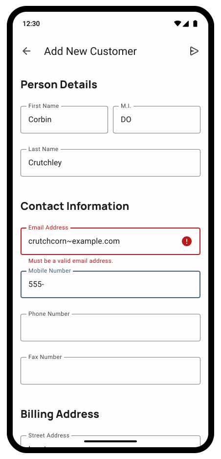

---
{
	title: "Formik Works Great; Here's Why I Wrote My Own",
	description: "",
	published: "2023-02-25T04:45:30.247Z",
	authors: ["crutchcorn"],
	tags: ["react", "opinion"],
	attached: [],
	license: "cc-by-nc-sa-4"
}
---

If you've looked into form validation with React, [you'll likely have heard of Formik](https://github.com/jaredpalmer/formik). My first run-in with Formik was at a large company I worked; it was already established as the go-to form library for our projects, and I immediately fell in love with it.

My time at this company was in 2019, [right before Formik surpassed one million weekly downloads](https://npmtrends.com/formik). Thanks to my experience using Formik at this company, I was left with a strong recommendation in favor of the tool for all future React forms usage.

Fast forward to today. I'm leading a front-end team in charge of many applications. One such application we inherited was very heavily form-focused. Formik is still the wildly popular, broadly adopted intuitive forms API I used all those years ago.

So, if we loved Formik, why did we not only remove it from our projects but replace it with [a form library of our own](https://github.com/crutchcorn/houseform)?

I think this question is answered by taking a look at the whole story:

- Why is Formik great?
- Why don't we want to use Formik?
- What can be improved about Formik?
- What alternatives are there?
- How does our own form library differ?
- How did we write it?
- What's next?

# Why is Formik great?

Let's take a step back from Formik for a second. I started web development [in 2016 with the advent of Angular 2](https://en.wikipedia.org/wiki/Angular_(web_framework)#Version_2). While it has its ups and downs, one of its strengths is in [its built-in abilities to do form validation](https://angular.io/guide/form-validation) - made only stronger when [recent versions of Angular (namely, 14) introduced fully typed forms](https://angular.io/guide/typed-forms).

React doesn't have this capability baked in, so during my early explorations into the framework I was dearly missing the ability to do validated forms for more complex operations.

While an Angular form might look something like this:

```typescript
@Component({
  selector: 'my-app',
  standalone: true,
  imports: [CommonModule, FormsModule, ReactiveFormsModule],
  template: `
  <form [formGroup]="form" (ngSubmit)="onSubmit()" > 
    <label>
      <div>Name</div>
      <input type="text" required minlength="4" formControlName="name">
    </label>
    <button>Submit</button>

    <div *ngIf="form.controls.name.invalid && (form.controls.name.dirty || form.controls.name.touched)">
      <div *ngIf="form.controls.name.errors?.['required']">
        Name is required.
      </div>
      <div *ngIf="form.controls.name.errors?.['minlength']">
        Name must be at least 4 characters long.
      </div>
    </div>
  </form>
  `,
})
export class App {
  form = new FormGroup({
    name: new FormControl('', [Validators.required, Validators.minLength(4)]),
  });

  onSubmit() {
    if (!this.form.valid) return;
    alert(JSON.stringify(this.form.value));
  }
}
```

The React version (without any libraries) might look something like this:

```jsx
function runValidationRulesGetErrors(rules, val) {
  return rules.map((fn) => fn(val)).filter(Boolean);
}

export default function App() {
  const [form, setForm] = useState({
    name: { value: '', isTouched: false, isDirty: false },
  });

  const validationRules = {
    name: [
      (val) => (!!val ? null : 'Name is required.'),
      (val) =>
        !!val && val.length >= 4
          ? null
          : 'Name must be at least 4 characters long.',
    ],
  };

  const [errors, setErrors] = useState({ name: [] });

  const runValidation = (name, val) => {
    const errors = runValidationRulesGetErrors(validationRules[name], val);
    setErrors((v) => {
      return {
        ...v,
        [name]: errors,
      };
    });
  };

  const onFieldChange = (name, val) => {
    setForm((v) => {
      return {
        ...v,
        [name]: {
          ...v[name],
          isDirty: true,
          value: val,
        },
      };
    });

    runValidation(name, val);
  };

  const onFieldBlur = (name) => {
    setForm((v) => {
      return {
        ...v,
        [name]: {
          ...v[name],
          isTouched: true,
        },
      };
    });

    runValidation(name, form[name].value);
  };

  const onSubmit = (e) => {
    e.preventDefault();
    alert(JSON.stringify(form));
  };

  return (
    <form onSubmit={onSubmit}>
      <label>
        <div>Name</div>
        <input
          value={form.name.value}
          onChange={(e) => onFieldChange('name', e.target.value)}
          onBlur={() => onFieldBlur('name')}
          type="text"
        />
      </label>
      <button>Submit</button>

      {errors.name.length !== 0 && (form.name.isDirty || form.name.isTouched) && (
        <div>
          {errors.name.map((error) => (
            <div key={error}>{error}</div>
          ))}
        </div>
      )}
    </form>
  );
}
```

That's a difference of ~50 LOC for the Angular version vs. 90 LOC for the React version.

Clearly something needed changing in the React ecosystem.

## How Formik saved the day

Here's the previous React code sample, but this time using Formik:

```jsx
import { Formik, Form, Field } from 'formik';
import * as Yup from 'yup';

const schema = Yup.object().shape({
  name: Yup.string()
    .min(4, 'Name must be at least 4 characters long.')
    .required('Name is required.'),
});

export default function App() {
  return (
    <Formik
      initialValues={{
        name: '',
      }}
      validationSchema={schema}
      onSubmit={(values) => {
        alert(JSON.stringify(values));
      }}
    >
      {({ errors, touched, dirty }) => (
        <Form>
          <label>
            <div>Name</div>
            <Field name="name" />
          </label>
          <button>Submit</button>

          {errors.name && (touched.name || dirty) && <div>{errors.name}</div>}
        </Form>
      )}
    </Formik>
  );
}
```

'Nough said?

Not only is this example shorter than even the Angular example, but it's significantly easier to follow the flow of what's happening and when. On top of this, we're able to use existing validation logic from [the exceedingly popular Yup library](https://github.com/jquense/yup) to make sure our form follows a consistent schema.

Is it any wonder I fell in love with Formik the first time I used it?

# Why don't we want to use Formik?

We've talked a lot about my past with Formik in this article; Fast forward to today. Nowadays, I'm leading a small frontend team in charge of a plethora of applications. One such application we inherited is very heavily form-focused:



> This is not a real screenshot from the app, but is a mockup used to reflect how heavily form-heavy it is. We have multiple pages like this in our app; all of which with more fields than are displayed here.


<!-- Talk about maintainance issues -->


# What can be improved about Formik?

<!-- Talk about Form-centric API issues -->


# What alternatives are there?

<!-- Talk about React Hook Form -->


# How does our own form library differ?

<!-- Talk Field-first API -->


# How did we write HouseForm?

<!-- Talk about registration of Fields into Form, talk about Vite/Vitest/Vitepress -->


# What's next?

<!-- conclusion -->