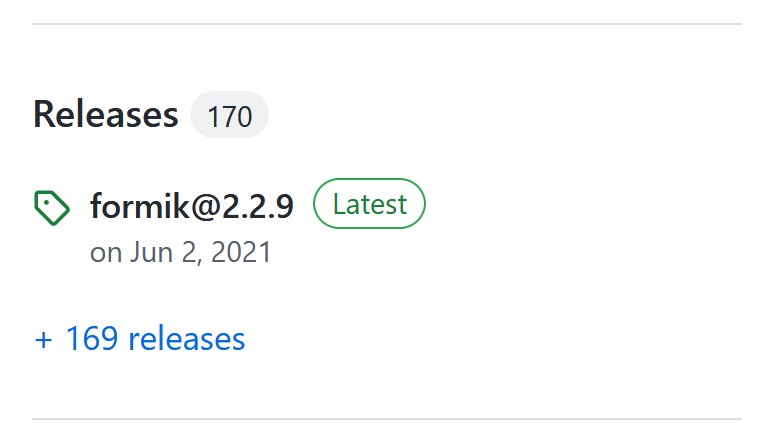

---
{
	title: "Formik Works Great; Here's Why I Wrote My Own",
	description: "",
	published: "2023-02-25T04:45:30.247Z",
	authors: ["crutchcorn"],
	tags: ["react", "opinion"],
	attached: [],
	license: "cc-by-nc-sa-4"
}
---

If you've looked into form validation with React, [you'll likely have heard of Formik](https://github.com/jaredpalmer/formik). My first run-in with Formik was at a large company I worked; it was already established as the go-to form library for our projects, and I immediately fell in love with it.

My time at this company was in 2019, [right before Formik surpassed one million weekly downloads](https://npmtrends.com/formik). Thanks to my experience using Formik at this company, I was left with a strong recommendation in favor of the tool for all future React forms usage.

Fast forward to today. I'm leading a front-end team in charge of many React and React Native applications. One such application we inherited was very heavily form-focused. Formik is still the wildly popular, broadly adopted intuitive forms API I used all those years ago.

So, if we loved Formik, why did we not only remove it from our projects but replace it with [a form library of our own](https://github.com/crutchcorn/houseform)?

I think this question is answered by taking a look at the whole story:

- Why is Formik great?
- Why don't we want to use Formik?
- What can be improved about Formik?
- What alternatives are there?
- How does our own form library differ?
- How did we write it?
- What's next?

# Why is Formik great?

Let's take a step back from Formik for a second. I started web development [in 2016 with the advent of Angular 2](https://en.wikipedia.org/wiki/Angular_(web_framework)#Version_2). While it has its ups and downs, one of its strengths is in [its built-in abilities to do form validation](https://angular.io/guide/form-validation) - made only stronger when [recent versions of Angular (namely, 14) introduced fully typed forms](https://angular.io/guide/typed-forms).

React doesn't have this capability baked in, so during my early explorations into the framework I was dearly missing the ability to do validated forms for more complex operations.

While an Angular form might look something like this:

```typescript
@Component({
  selector: 'my-app',
  standalone: true,
  imports: [CommonModule, FormsModule, ReactiveFormsModule],
  template: `
  <form [formGroup]="form" (ngSubmit)="onSubmit()" > 
    <label>
      <div>Name</div>
      <input type="text" required minlength="4" formControlName="name">
    </label>
    <button>Submit</button>

    <div *ngIf="form.controls.name.invalid && (form.controls.name.dirty || form.controls.name.touched)">
      <div *ngIf="form.controls.name.errors?.['required']">
        Name is required.
      </div>
      <div *ngIf="form.controls.name.errors?.['minlength']">
        Name must be at least 4 characters long.
      </div>
    </div>
  </form>
  `,
})
export class App {
  form = new FormGroup({
    name: new FormControl('', [Validators.required, Validators.minLength(4)]),
  });

  onSubmit() {
    if (!this.form.valid) return;
    alert(JSON.stringify(this.form.value));
  }
}
```

The React version (without any libraries) might look something like this:

```jsx
function runValidationRulesGetErrors(rules, val) {
  return rules.map((fn) => fn(val)).filter(Boolean);
}

export default function App() {
  const [form, setForm] = useState({
    name: { value: '', isTouched: false, isDirty: false },
  });

  const validationRules = {
    name: [
      (val) => (!!val ? null : 'Name is required.'),
      (val) =>
        !!val && val.length >= 4
          ? null
          : 'Name must be at least 4 characters long.',
    ],
  };

  const [errors, setErrors] = useState({ name: [] });

  const runValidation = (name, val) => {
    const errors = runValidationRulesGetErrors(validationRules[name], val);
    setErrors((v) => {
      return {
        ...v,
        [name]: errors,
      };
    });
  };

  const onFieldChange = (name, val) => {
    setForm((v) => {
      return {
        ...v,
        [name]: {
          ...v[name],
          isDirty: true,
          value: val,
        },
      };
    });

    runValidation(name, val);
  };

  const onFieldBlur = (name) => {
    setForm((v) => {
      return {
        ...v,
        [name]: {
          ...v[name],
          isTouched: true,
        },
      };
    });

    runValidation(name, form[name].value);
  };

  const onSubmit = (e) => {
    e.preventDefault();
    alert(JSON.stringify(form));
  };

  return (
    <form onSubmit={onSubmit}>
      <label>
        <div>Name</div>
        <input
          value={form.name.value}
          onChange={(e) => onFieldChange('name', e.target.value)}
          onBlur={() => onFieldBlur('name')}
          type="text"
        />
      </label>
      <button>Submit</button>

      {errors.name.length !== 0 && (form.name.isDirty || form.name.isTouched) && (
        <div>
          {errors.name.map((error) => (
            <div key={error}>{error}</div>
          ))}
        </div>
      )}
    </form>
  );
}
```

That's a difference of ~50 LOC for the Angular version vs. 90 LOC for the React version.

Clearly something needed changing in the React ecosystem.

## How Formik saved the day

Here's the previous React code sample, but this time using Formik:

```jsx
import { Formik, Form, Field } from 'formik';
import * as Yup from 'yup';

const schema = Yup.object().shape({
  name: Yup.string()
    .min(4, 'Name must be at least 4 characters long.')
    .required('Name is required.'),
});

export default function App() {
  return (
    <Formik
      initialValues={{
        name: '',
      }}
      validationSchema={schema}
      onSubmit={(values) => {
        alert(JSON.stringify(values));
      }}
    >
      {({ errors, touched, dirty }) => (
        <Form>
          <label>
            <div>Name</div>
            <Field name="name" />
          </label>
          <button>Submit</button>

          {errors.name && (touched.name || dirty) && <div>{errors.name}</div>}
        </Form>
      )}
    </Formik>
  );
}
```

'Nough said?

Not only is this example shorter than even the Angular example, but it's significantly easier to follow the flow of what's happening and when. On top of this, we're able to use existing validation logic from [the exceedingly popular Yup library](https://github.com/jquense/yup) to make sure our form follows a consistent schema.

Is it any wonder I fell in love with Formik the first time I used it?

# Why don't we want to use Formik?

We've talked a lot about my past with Formik in this article; Fast forward to today. Nowadays, I'm leading a small frontend team in charge of a plethora of applications. One such application we inherited is very heavily form-focused:


> This is not a real screenshot from the app, but is a mockup used to reflect how heavily form-heavy it is. We have multiple pages like this in our app; all of which with more fields than are displayed here.

While this kind of application may seem simple at first glance, there's a lot of moving parts to it. Ignoring the other functionality within the app, this type of form page might contain:

- On blur field formatting
- Per-field validation type (Some fields validate on field blur, some validate on value change)
- Detection of if a field is touched or dirty
- Internationalized error messages

As a result, our hand-written field validation code was quickly getting out-of-hand. Because of the difficulty in maintaining that much complexity by hand, bugs, regressions, and otherwise unexpected behavior started occurring. What's worse; One form page would differ wildly in implementation from another, leading to inconsistent user experience.

While this was okay for a short while; while we were under crunch time and this project was not a high priority - it quickly became a thorn in the side.

As such, I asked one of the engineers on my team to look into React form libraries; pointing them towards Formik as a reference of what I knew existed in the ecosystem.

After a day or two of research that engineer came back: They liked Formik but had some concerns over its maintenance.

See, when they went to [the Formik GitHub repository](https://github.com/jaredpalmer/formik), they noticed the high number of issues and pull requests.


When they then realized that its last release date was in 2021 - nearly 2 years ago - they wanted to look into it more:



After looking into it more, there were no fewer than [three](https://github.com/jaredpalmer/formik/issues/3601) [separate](https://github.com/jaredpalmer/formik/issues/3613) [issues](https://github.com/jaredpalmer/formik/issues/3663) asking if the project was still under maintenance.


"No problem," we thought, "surely there must be a community fork of the project."

After some time looking into it, we found a single option: An individual contributor [by the name of `johnrom` hacking away at a version 3](https://github.com/jaredpalmer/formik/pull/3231).

It's sincerely impressive! While the main v3 PR we linked has 97 commits, [John also started working on documentation for this potential v3 release with an additional 76 commits](https://github.com/johnrom/formik/pull/11).

Unfortunately, he's made it clear that [he's not a maintainer of Formik](https://github.com/jaredpalmer/formik/pull/3231#issuecomment-1020379986) and admits:

>[...] whether my changes are ever merged into Formik itself isn't up to me [...]
>
> \- [John Rom on May 3, 2021](https://github.com/jaredpalmer/formik/issues/3099#issuecomment-831319020)

It was clear to use that it was time to find an alternative to Formik.

----

> I want to be very explicit here; neither Jared nor John owe us anything. Their contributions to the ecosystem are not assured, nor should they be.
>
> Almost all open-source maintainers are unpaid for their work, and it's an immense responsibility to bear the load. You constantly have to keep up with the outside ecosystem changes, manage others' contributions, answer questions, and more. It's exceedingly easy to burn out from a project with such immense loads and little personal return.
>
> I'm very grateful for their work on Formik and admire their engineering capabilities and even their abilities to maintain and upkeep Formik while they did. Their work on Formik should be celebrated, not chastised - even while dormant.

----

# What alternatives are there?

After looking through GitHub issues, forums, and chats, there appears to be two primary alternatives to Formik available today:

- [React Final Form](https://final-form.org/react) 
- [React Hook Form](https://react-hook-form.com/)

While React Final Form initially looked promising - [it's only seen 5 commits to the `main` branch since 2021](https://github.com/final-form/react-final-form/commits/main), and has [over 300 issues](https://github.com/final-form/react-final-form/issues).

Let's check on [the React Hook Form GitHub](https://github.com/react-hook-form/react-hook-form) and see if things are more lively:


WOW! Now **that's** an actively maintained repository!


One thing we really liked was the ability to do per-field validation right inline with the input itself:

https://react-hook-form.com/get-started#Applyvalidation

But the challenge is that it doesn't support `Yup` or `Zod` validation.


https://react-hook-form.com/get-started#IntegratingControlledInputs

But here's the challenge with this method; It introduces multiple different ways of doing things. 


# What can be improved about Formik?

<!-- Talk about Form-centric API issues -->


# How does our own form library differ?

<!-- Talk Field-first API -->


# How did we write HouseForm?

<!-- Talk about registration of Fields into Form, talk about Vite/Vitest/Vitepress -->


# What's next?

<!-- conclusion -->