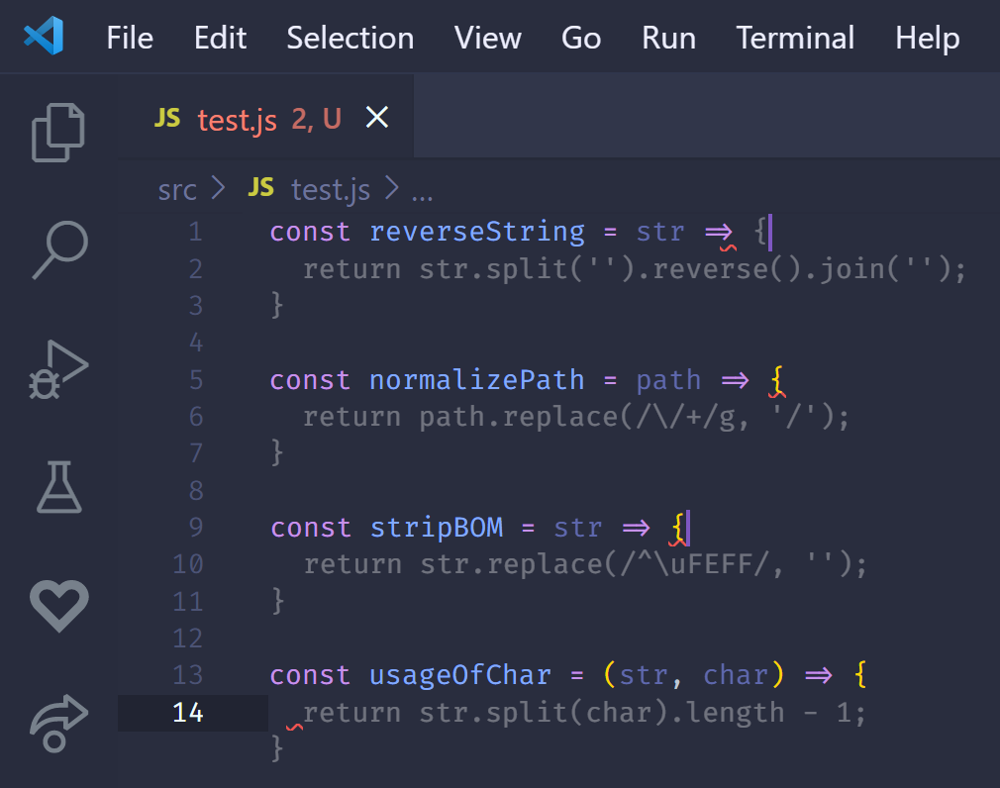

---
 {
    title: "GitHub Copilot is Amazing - It Won't Replace Developers",
    description: "GitHub Copilot is an amazing tool that I think will drastically improve the way that I code. But it won't replace me. Here's why.",
    published: '2021-10-04T22:12:03.284Z',
    authors: ['crutchcorn'],
    tags: ['opinion', 'tools', 'copilot'],
    attached: [],
    license: 'cc-by-nc-sa-4'
}
---

I recently touched on how [GitHub Copilot](https://copilot.github.com/), an AI-powered code generation tool from GitHub and OpenAI, [is going to shift the way we’ll need to do interviews](/posts/github-copilot-breaks-bad-interviews/). Copilot frankly is astonishing in its abilities to generate complex algorithm implementations from nothing more than a function name. This makes sense given it's training data of GitHub's publicly hosted community code ([a controversial decision](https://twitter.com/eevee/status/1410037309848752128)).

Some have taken these advanced algorithm assessment capabilities as a warning sign that developers will soon be fully automated using tech similar to Copilot, I’m not sold on that idea.

# Copilot Isn't An Engineer

Automation is amazing. Some would argue the whole point of programming is to automate as much as possible.

But when you automate things you often lose a fair amount of nuance within the problem-space you're trying to automate. This is true for any industry and any problem you run into: Especially so with programming.

We all know the meme: The junior engineer asks a question and the senior mentor answers "it depends"


But there's a reason for this "joke" having such prevalence: it's true. A lot of software engineering requires a lot of context be kept in mind.

Knowing this, can an AI take on the required nuance and act an additional engineer to the team?

On first glance, GitHub Copilot may appear to walk the "I'm an Engineer replacement" walk, and it may even talk the talk from time-to-time: but it falters in some key areas.

## Architecture

Let’s first remember what the job of an engineer or developer is. While on the surface, yes, developers do type code into their IDE - the real work is done in the developer’s mind. To code something is to consider a problem’s expected outcome, its constraints, edge cases, and to take those into account to decide on an implementation.

While Copilot is highly capable of generating _a_ solution, it doesn’t know your engineering constraints. This is where architecture decisions come into play. Sure, you may know that you want a sorting algorithm - but _which_ sorting algorithm may be more important than being able to implement it. After all, if you are wanting to implement a complex sort on a large dataset with limited memory, your biggest problems are likely to stem from knowing where to store your data in an [external sort](https://en.wikipedia.org/wiki/External_sorting) as opposed to the specific code syntax you’ll utilize to make that a reality.

That said, not every engineer is at or needs to be at an architectural level. Some of us are most comfortable when we can focus within our IDEs as opposed to meeting rooms where those constraints often come to light. However, there is a skill that every developer will need to develop as they code: Debugging.

## Bugs

Even when assisted by a tool like Copilot, bugs are inevitable in any system. Even if your code is perfection itself captured in text, we still have to rely on others code in upstream dependencies. Knowing how to work through finding the root cause and solving a bug is integral to development. Oftentimes, I find myself spending more time debugging complex issues than building a significant portion of fresh code.

Regardless of if you use the debugger or print statements (which, we all do at some point, be honest), Copilot isn’t able to automate that process for you.

## Refactors

Likewise, a common task in an existing codebase is to refactor it in order to be more secure, efficient, fast, readable, or otherwise better. While Copilot is able to glean context from the current file you’re presently in, refactors can often span multiple files as you modify the underlying abstractions in a codebase. Even then, while [GitHub says they’re adding support for full project-based context in the future](https://copilot.github.com/#faq-what-context-does-github-copilot-use-to-generate-suggestions), automated refactors would be extremely difficult to attain.

> When I'm talking about automated refractors, I'm _not_ talking about [codemods](https://www.sitepoint.com/getting-started-with-codemods/) powered by AST manipulation to, say, migrate from one version of a library to another. Codemods like those rely on consistent information existing for both versions of the library code being migrated. Further, these codemods don’t come for free and libraries must usually engineer specifically with automated migrations in mind.

In order to automate refactors, Copilot would not only need to know how things _were_ done, but what the newer method of doing things is. After all, the previous code exists for a reason, what is it doing, why is it doing what it is, and how are we able to improve it? When application-wide refactors occur, a team often sits down and discusses the advantages of standards and sets a level of consistency to strive for. However, refactors often have hidden levels of complexity within. When actually diving into a refactor, there may be constraints in the new technology that may not have been known previously. When this occurs, the team must make decisions based on many parameters. A machine simply isn’t up for the task.

## Code Review

When GitHub Copilot first launched, there was a lot of discussion about how good its generated code would be in the end. Can Copilot understand the nuances in `useEffect`? Does it know that you need a consistent memory reference to avoid triggering change detection?

Maybe, but you can’t be certain it will get it right every time. However, the same can be said for others: you can’t be certain another person on the team will get it right every time.

This nuance brings another point against the concept of developers being fully automated by Copilot: Code review.

Ideally, you shouldn't be allowing developers to push code directly to production on a regular basis. While there will always be emergency scenarios where this doesn't apply, it's dangerous to ignore the code review stage. This isn't to say that you shouldn't trust your developers, but we're only human after all. If [Google can make a single-character typo to wipe every ChromeOS laptop with a certain update installed](https://www.androidpolice.com/2021/07/20/a-new-chrome-os-91-update-is-breaking-chromebooks-like-a-bull-in-a-china-shop/), it's not impossible your team may make a similar mistake.

During this process of code review, your team may discover bugs, realize that an experience is impacted by planned implementation, or even point out a more optimized or easier-to-read implementation. Having this team environment allows for a more diverse pooled perspective on the code that's being contributed towards a codebase and results in a better product.

# GitHub Copilot’s Strengths

None of this is to say that Copilot as a tool isn’t advantageous. Copilot is often able to make suggestions that impress me. In particular, if I have a somewhat repetitive task or are simply exploring a commonly implemented function, Copilot can fill in the blanks for me with only the name.

All of these utils are generated with Copilot using only the function name as an argument passed in:

```javascript
const reverseString = str => {
  return str.split('').reverse().join('');
}

const normalizePath = path => {
  return path.replace(/\/+/g, '/');
}

const stripBOM = str => {
  return str.replace(/^\uFEFF/, '');
}

const usageOfChar = (str, char) => {
  return str.split(char).length - 1;
}
```



While there may be _faster_ implementations of some of these, they're undoubtedly extremely readable and maintainable  - they're how I'd implement these functions myself!

This isn't to say that GitHub Copilot is simply limited to small-scale utility functions, either. I recently wanted to make an implementation of a binary search tree. I was barely a class name into implementing when Copilot made the following suggestion:

```javascript
// Only typed `class Node` to get this suggestion
class Node {
    constructor(data) {
        this.data = data;
        this.left = null;
        this.right = null;
    }
}

// Copilot suggested all of this without any help whatsoever
class BinarySearchTree {
    constructor() {
        this.root = null;
    }

    insert(data) {
        if (!this.root) {
            this.root = new Node(data);
        } else {
            this._insert(this.root, data);
        }
    }
```

This isn't all that was suggested by Copilot, either - [it generated a full implementation of a depth-first binary tree](https://github.com/CoderPad/github-copilot-interview-question/blob/main/questions/javascript/binary-depth-search.js)!


This is an impressive range of capabilities for an automated code generation tool. While I would likely want to customize or otherwise modify this exact implementation, this is a very valid base of a binary tree that I could take an expand into something production-ready.

## Invisible Helper

I've read a lot of conversations about GitHub Copilot. Participated in a lot of them too. Something that often comes up is how distracting Copilot can be at times.

I'd be lying if I said I hadn't encountered this myself. I got access to Copilot very early on and when first using it my editor would be **flooded** with irrelevant suggestions. Oftentimes, these suggestions would even be a few words repeating until the generated code limit.

Despite this argument, over time I've come around and started to enjoy having Copilot around in daily development.

While I wasn't a developer when traditional autocomplete tools (such as Intellisense) came into play of daily development, I'm certain there were arguments from some against using. I'm sure the first time someone went to type a method name they'd memorized the dropdown of seemingly irrelevant method names seemed obtuse and distracting.

However, once used to tools like Intellisense, it can become easy to ignore it when working in environments that don't suit it well. I regularly find myself not even looking at code suggestions - especially when dealing with minified code I'm debugging. And I think that's the key: **developer tools do best when they become invisible**. Copilot is able to do that quite well and gets out of your way when you don't need it

For a start, while I had significant problems with Copilot going overboard with suggestions early on, I've since noticed two things:

1. It's gotten a **lot** better since then. Undoubtedly due to it being an AI and learning from it's usage and some tweaks made by the GitHub team
2. This only _really_ occurs when I sit still in my editor for extended periods of time with an incomplete variable typed out

The first point feels fairly self-explanatory, but let's stop and explore the practical side-effect of the second point being made. When I am programming, I am often doing one of three things:

1. Thinking of what code is doing or how to move forward next
2. Actively typing something I have thought of
3. Making small changes and waiting to see if the compiler/linter is angry at me (it usually is)

For my workflow in particular, I tend to pause for extended periods of time before actually typing something in my main IDE file. It's only really when dealing with unfamiliar codebases, concepts, or naming conventions that I pause in significant level of frequency in the middle of typing something. Oftentimes, this is because I'm trying to remember how to do something by memory or looking at some documentation/reference APIs I have pulled up elsewhere.

This leaves me with pausing typing on unfinished variables realistically only when I'm starting a new project or waiting to see my autocomplete's results. As a result, I often completely ignore Copilot until a fair amount of scaffolding of a project has been created - often as a result of it wanting to overzealously generate boilerplate I'm not looking for.

It's once deep within a project that Copilot stops begging for attention and can sneakily seep into average development. I honestly have a hard time telling when a code suggestion is made from traditional code analyzation and when it's coming from a smarter Copilot from time-to-time. However, as much as it sounds like one: This isn't an insult, it's a good thing!

Because Copilot can grok more complex implementation details, it's often able to make the same type of single-property name suggestions in my editor without the multi-line codegen we've come to expect from many of its demos. These suggestions aren't just extremely helpful and get less in the way, but they help me as a developer feel more in control as to what's happening.

This capability is so good at the "transparent tools that get out of your way" test that while [streaming on my Twitch](https://twitch.tv/crutchcorn), I was confident I didn't have Copilot enabled and had to check after a particularly clever suggestion, hours after starting work.

<https://clips.twitch.tv/TacitFitIcecreamTriHard-KgJCKYYIEPqxe4dQ>

It's this transparency that I feel is Copilot's _true_ strength. It's important to remember that even GitHub isn't poising Copilot as a replacement to developers of any kind - simply a tool that developers can utilize to make their jobs easier.

## Learning Tool

I recently saw a tweet that showcased Copilot generating the following JavaScript:

```javascript
const range = (start, size) => Array.from({length: size}, (_, i) => start + i)
```

And remarking "I didn't know you could make an array this way".

While I couldn't find that tweet again after searching for it later, it stuck out in my mind. I had learned of the trick only by scrolling through WebDev Twitter one day. Had I been on vacation that day or even decided not to check Twitter, I would have not likely learned for a long time afterwards.

I distinctly remember learning that method from Twitter because I was so surprised about how it worked that I did some research and read more. That day I learned a lot about [JavaScript's implementation about Iterators](https://developer.mozilla.org/en-US/docs/Web/JavaScript/Guide/Iterators_and_Generators) and the fact that, in JavaScript, [arrays are objects under-the-hood](https://stackoverflow.com/a/5048482). One step closer to understanding JavaScript primitives: A concept I struggled with in my early days of WebDev.

After all, when I am learning how to program something new, it's always been useful for me to see an implementation of how it's done elsewhere. I remember being in my first programming job as a Junior and learning so much simply by seeing how others in the team wrote similar code.

Now, my early career was somewhat formed by what I'd seen others do in codebases I was adjacent to. Because I was assigned tasks, the things I learned about tended to pertain specifically to those tasks. Further, I found it somewhat tricky to find symbols like `!.` After all, [Google search is not kind to many symbols we use in programming](https://stackoverflow.com/a/3737197).

But honestly, I was lucky to've been taken on as a Junior so early on into my code learning experience; Not everyone is so privileged.

This is why that Tweet stuck out so much in my mind. Would I have learned code as quickly if I was doing independent study without a such in-depth reference point to others' code? Likely not.

Sure, theoretically a new developer could jump into any number of open source projects and gain experience that way. But **how many of those projects are able to provide 1:1 mentorship** and code review on every PR? As it stands open-source maintainers are regularly overworked and unpaid for their efforts.

Moreover: how does a new developer's confidence play into that? I started with Angular as my first web framework, didn't have a formal education, and saw Google as an infallible agent of raw engineering in my first year. **Terms like "Dependency injection" and "Ahead-of-time compiler" scared me into feeling as if it were "unsafe" to read through any of the project's source code until I had found out that [I was rewriting it's source code without knowing it](https://unicorn-utterances.com/posts/angular-templates-start-to-source/#directive-same-name-input)**.

Even today, a developer of 7 years professionally - having written compilers and apps with millions of users - I am still oftentimes intimidated to read through large project's codebase. **I regularly have to psyche myself out and reassure myself that it's okay to explore before diving into big source projects.**

The beauty (and, unfortunately, again, [controversy](https://twitter.com/eevee/status/1410037309848752128)) of **GitHub Copilot in this instance is that it doesn't tell you where large chunks of its generated code comes from**. You're able to find new ways to do things and want to learn and research more without all the self-imposed stress I mentioned.

I've seen code generated by Copilot that could easily pass for logic within any major framework or application I've ever read through.

But **I don't just see Copilot as an opportunity for newcomer developers to learn**. For example, I'm familiar with binary search trees. I have written implementations before. But I won't lie: It's been a long time. Further, the last time I saw a tree in a production codebase, it was significantly more complex than an early implementation with only the core concepts exposed.

Being able to generate a decent implementation to a tree in my IDE is helpful for me to compare-and-contrast methods done there vs. what I would instinctually think of doing.

## Documentation

"Types are not documentation". If you've heard me say it once, you've probably heard me say it a dozen times. It's sorta a mantra for me.

> Here, I'll say it again: "Types are not documentation"

Unfortunately for me: My mantras don't define the outcome of a popular library's state of documentation. While making an upstream PR is almost always the way-to-go to solve this problem long-term - it can be a long process to figure out how something works without any usage examples to go off of.

While Copilot is far from _solving_ this problem, it can help. Having GitHub's projects as a reference point, it may suggest usages of non-documented APIs that it's seen elsewhere.

Honestly though? The number of external codebases that are not documented at all that I'm working in nowadays is fairly low.

More often than not, I'm working in a codebase like Vue that has a massive surface area, good docs, but I'm not always sure where to look.

While it's no replacement to a helpful community (which Vue absolutely has) or some masterful [GoogleFu](https://www.urbandictionary.com/define.php?term=google-fu), Copilot can often help guide me towards what I'm looking for by that same "teaching by reference" principle I outlined earlier.

# Conclusion

GitHub Copilot is an innovative tool. With many forms of innovation, there's a lot of uncertainty on how useful a tool is. Copilot isn't perfect by any means, but for many use-cases it can potentially speed up development.

Also similar to other innovative ideas, there's a lot of "what if in the future" being merged with "it is this way today". While Copilot (or other AI-powered code generators) has the potential to go a long distance in lowering the barrier to entry and making development easier and smoother, it's not at the stage of "robot uprising" today.

GCP, I love your work, but I don't think your suggestion that [humans need not apply](https://www.youtube.com/watch?v=7Pq-S557XQU) isn’t quite here yet. At least not for developers.

After all, GitHub’s tool is called “Copilot”, not “Autopilot”

What do you think? Let us know [on Twitter](https://twitter.com/UnicornUttrncs) or [join our Discord](https://discord.gg/FMcvc6T) and start a conversation with us! We're an open-source community ran project with no ads, no spam.

We'd love to hear your thoughts!
