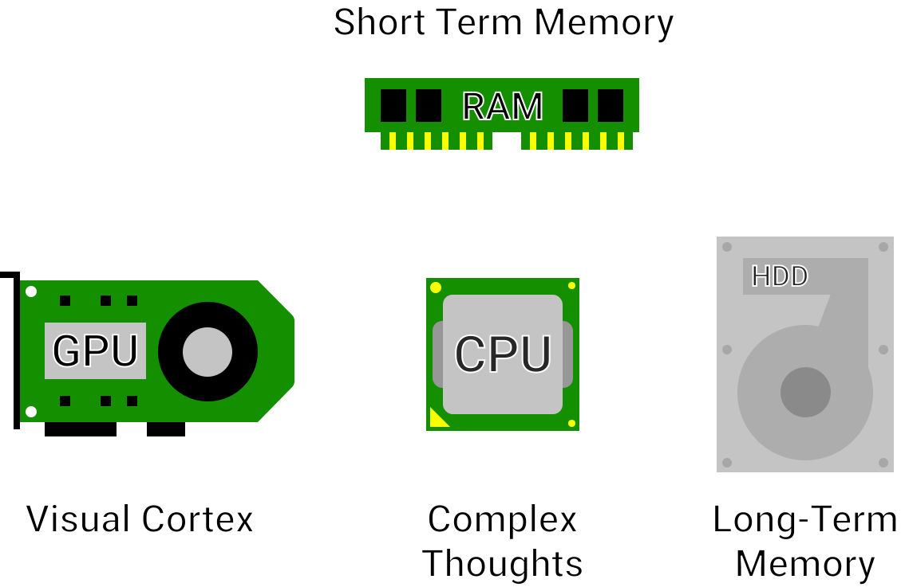
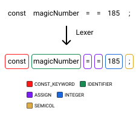

---
{
	title: "How Computers Speak: Assembly to AST",
	description: "Have you wondered how programming languages are able to be ran on your hardware? This article explains how your code is processed and ran",
	published: "2020-08-25T04:45:30.247Z",
	edited: "2020-08-25T04:45:30.247Z",
	authors: ["crutchcorn", "reikaze"],
	tags: ["hardware", "javascript", "computer science"],
	attached: [],
	license: "cc-by-nc-sa-4"
}
---

During my time learning programming, I found myself lacking foundational knowledge about how a computer worked under-the-hood. It wasn't until much later in my career that I started learning about how certain puzzle pieces fit together and had a more holistic image of how computers worked. I feel that having this insight made me a better developer and shifted my thinking during debugging to reflect more accurately what was happening.

In this article, we're going to introduce you to various concepts to helping you understand how computers are able to parse and understand common programming languages and process the instructions you pass to it.

We'll ask and answer the following questions:

- [What is "source code"?](#source-code)

- [What are the major components of a computer, and how do they tie together?](#computer-hardware)

- [What language does the computer speak natively?](#assembly-code)

- [Why do I need a custom program to run some programming languages?](#compiled-vs-runtime)

- [How does a computer turn letters and symbols into instructions that it knows how to run?](#lexer)

- [Why do some programming languages have different rules and look different from one another?](#parser)

- [Why can't we simply give the computer English instructions and have it run those with a special program?](#english-vs-ast)

> I'm writing this article as a starting point to a developer's journey or even just to learn more about how computers work under-the-hood. I'll make sure to cover as many of the basics as possible before diving into the more complex territory. That said, we all learn in different ways, and I am not a perfect author. If you have questions or find yourself stuck reading through this, drop a comment down below or [join our Discord](https://discord.gg/FMcvc6T) and ask questions there. We have a very friendly and understanding community that would love to explain more in-depth.

# Source Code {#source-code}

If you've spent any time with developers, you'll likely have heard of the term "source code." Source code simply refers to the text that programmers type  to make their programs. Take the following text:

```javascript
const magicNumber = 185;

console.log(magicNumber);
```

If you're not familiar with what that code does,  we'll explain it in a bit. Right now, it's just important to focus on what's being typed. If you opened Notepad, you'd be able to type this in using a typical QWERTY keyboard.

**This type of file, regardless of the file name, is known as a "plain text" file**. Plain text files are those that contain only the alpha-numeric values that you're able to type. There are other types of files - such as **"binary" files - that contain special encoding that, were you to open them in Notepad, humans would not be able to easily read**.

> Notice that I mention using Notepad instead of a program like Microsoft Word. This is because Word actually includes special formatting in its files that would break any source code stored within a file created in Word

The mention of "regardless of file name" might seem like an odd thing to mention until you consider [the file extension](/posts/what-do-files-extensions-do/) is part of the file name.
This means that you can store source code in a `.txt` file and still have it run if executed properly. Most programming languages have their own file extensions, which they tell your computer they own. Still, even  if you change a file's extension, [the contents of the file are exactly the same, just the file name (ala extension) is different](/posts/what-do-files-extensions-do/).

Let's assume that we've stored the `magicNumber` code inside of a text file. Go ahead and open Notepad, copy+paste that code, and save it to `/User/Destop/code.js`. Now, download [NodeJS](https://nodejs.org/). NodeJS is a program that runs JavaScript source code files. [Not all programming languages are run this way](#compiled-vs-runtime), but JavaScript is.

Once NodeJS is downloaded, open your terminal (also known as CMD in Windows), go to your desktop, and run `node code.js`, it will output the number `185` so that you can see it.


This same behavior would happen even if you called the file `code.txt`. While understanding what a source code file is, it does lend itself to a question:
How does your computer understand what to do when running a programming language? Why do some languages, like JavaScript, need another program to run its code while others don't?

The answer to all of these involves an understanding of how hardware works, and one of the best ways to learn programming is to learn how a computer works in the first place.

# How A Computer Works {#computer-hardware}

> This section won't be a complete "Computers 101" course. While we _will_ be writing material that dives deeper into these subject matters, this is meant as a short description to supplement explanations later on in the article. If you'd like to see that type of content in the future, be sure to [sign up for our newsletter](https://newsletter.unicorn-utterances.com/)

Your computer is comprised of many components, but today we'll be focusing on five of the primary ones:

- Motherboard
- Long Term Storage ("HDD" or "SSD")
- Graphics Processing Unit ("GPU")
- Central Processing Unit ("CPU")
- Random Access Memory ("RAM")

These are used to connect each of these parts together, make up the "brains" of your computer. Whenever you take an action on your computer, these components launch into action to bring you the output you'd expect. Be it auditory, visual, or some other form of output, these components will do the "thinking" required to make it happen.

## Motherboard {#mobo}

**A motherboard is the platform in which all other components connect together and communicate through**. There are various integrated components to your motherboard, like storage controllers and chipsets necessary for your computer to work. Fancier motherboards include additional functionality like high-speed connectivity (PCI-E 4.0) and Wi-Fi.

When you turn on your computer, the first that will happen is your motherboard will do a "POST"; a hardware check to see if everything connected is functioning properly. Then the motherboard will start the boot sequence; which starts with storage

## Long Term Storage {#hdd}

**There are 2 primary types of storage in computers; Solid State Drives (SSD), and Hard Disk Drives (HDD)**. When the boot sequence hits storage, your drive will scan the very first bit of its disk ([also known as the "boot sector"](https://en.wikipedia.org/wiki/Boot_sector)) to find the installed operating system. Once your storage is done finding the relevant files, your computer reads the rest of the information off of the drive to load your system. This includes configuration files that you've updated by setting up your computer (like your username, wallpaper, and more) and the system files set up when you installed your operating system (like Windows). Moreover, this is also where your documents live. If you've written a document in Microsoft Word, downloaded a song from iTunes, or anything in between, it lives on your hard drive.

## Memory {#ram}

**While SSDs and HDDs are fantastic for long-term file storage, they're too slow (in terms of reading speeds) to store data needed to run your computer**. This is why we have memory in the form of Registers and Random Access Memory (RAM).  **Registers are the closest memory to your processor and are extremely fast, but they are extremely small.** System Memory, or RAM, is outside of the processor but allows us to store entire programs in a responsive manner.  Everything from your operating system to your video player utilizes memory to store data while processing. We'll see how the computer utilized registers and RAM in programs [later in the article](#assembly-code).

**While this information is magnitudes faster to access than hard-drives, it's volatile.** That means that when you turn off your computer, the data stored in RAM is lost forever. Memory is also much more expensive than Storage. This is why we don't store our files to RAM for long-term access.

## GPU {#gpu}

Computers are a marvel, but without some ability to interact with them, their applications are limited. For many, that interaction comes through their computer screens - seeing the results of an action they've taken. **Your computer's "graphics processing unit" (GPU) is the hardware used to calculate the complex maths required to draw things on-screen.** The GPUs' complex mathematics prowess can also be utilized for things other than graphics (data analytics, cryptocurrency mining, scientific computation).

## CPU {#cpu}

Your CPU is what does all of the computation needed to perform tasks you do on your computer. **It does the math and logic to figure out what the other components need to be doing, and it coordinates them.** An example of this is telling the GPU what to draw. While your GPU does the calculations for what's to be drawn, the command to do such comes from the CPU. If your interaction requires data to be stored, it's the one that dispatches those actions to your HDD or RAM.

You can think of these components working together similarly to this:



> For those unaware, the visual cortex is the part of the brain that allows us to perceive and understand the information provided to us by our eyes. Our eyes simply pass the light information gathered to our brains, which makes sense of it all. Likewise, the GPU does the computation but does not display the data it processes; it passes that information to your monitor, which in turn displays the image source to you.

# Assembly: What's that? {#assembly-code}

At the start of this article, one of the questions I promised to answer was, "What language does the computer speak natively?". The answer to this question is, as you may have guessed from the section title, assembly.

When [introducing CPUs](#cpu), I mentioned that they contain the logic to do maths, instruct other components to execute operations, and more. To support a wide range of operations needed to run a computer, **CPU manufacturers implement an "instruction set."** This instruction set handles everything from basic arithmetic to basic memory handling. Once an instruction set is settled upon, **the CPU hardware is built around the instruction set**. That's right: Processors are built with their instructions (code) in mind first, and hardware is meant to backup that code.

These instructions often map very plainly to a sequence of bits (ones and zeros). For example:

```
100001 # addu
101011 # sw
100100 # and
```

While [understanding binary can be a task all on its own](/posts/non-decimal-numbers-in-tech/), suffice it to say that the processor hardware is built to understand the order of `1`s and `0`s, and which command they map to. Because of the direct one-to-one match between instruction and assembly code, this is considered the closest a programming language can get to the hardware.

> Because of this close proximity to hardware, each type of CPU has a different flavor of assembly. Because of this, the actual assembly code isn't particularly important, nor is it particularly accurate. Keep that in mind as we go forward.
>
> For record-keeping purposes: we'll be trying our best to stick to the [MIPS instruction set](http://www.mrc.uidaho.edu/mrc/people/jff/digital/MIPSir.html) with [Pseudoinstructions assembler macros](https://en.wikibooks.org/wiki/MIPS_Assembly/Pseudoinstructions)

Since assembly is the closest to hardware that any programming can get, **all programming languages end up as assembly instructions at one stage or another (we'll touch on how that conversion takes place later on)**. Because of this, we'd like to show you how to do some basic programming using assembly to help connect some dots.

Let's assume we want to do the math `180 + 5`. A fairly straightforward example, let's evaluate how we might go about doing so in MIPS assembly.

When you and I do math, we need to keep the concepts of the numbers `180` and `5` in our minds separately to combine them. Likewise, the computer needs to store both of these hardcoded values in [registers (remember, we touched on what registers are in the "memory section")](#ram) before they can be added together.

Let's assume that we have two (2) registers. We can use `$1` as shorthand for "register 1," while `$2` will be shorthand for "register 2".

```nasm
li      $1,180     # Loads "180" into register 2
li      $2,5       # Loads "5" into register 2
```

> The `li` command stands for "load immediate".

Now that we have that data loaded into registers, we can now do the `addu` instruction to combine these numbers and store the final value back in register 1

```nasm
addu    $1,$2,$1   # Add (+) data from registers 1 and 2, store the result back into register 1
```

Finally, if you were to inspect the value within register 1, you'd find a value representing the number `185`.

This works well, but what happens if we want to add 3 numbers together? We don't have enough registers to store all of these values at once!

This is where RAM comes into play. To store items into RAM, we can use `sw` instruction (short for "Store word") to store register values into RAM with a "tag" of sorts. This "tag" then can read and write values into RAM for you.

> The method in which these values are stored is into [a Stack](/posts/virtual-memory-overview/#stack). For simplicity's sake, we won't review that here, but it's suggested you read the [related article](/posts/virtual-memory-overview/#stack) that covers the topic

```nasm
# Saving "180" to RAM w/ tag "8"

li      $1,180     # Loads "180" into register 1
sw      $1,8($fp)  # Store data in register 1 into RAM (with the tag "8")

# Saving "5" to RAM w/ tag "8"

li      $1,5       # Loads "5" into register 1
sw      $1,12($fp) # Stores data in register 1 into RAM (with the tag "12")

# Saving "20" to RAM w/ tag "16"

li      $1,20      # Loads "20" into register 1
sw      $1,16($fp) # Stores data in register 1 into RAM (with the tag "16")

lw      $1,8($fp)  # Load RAM tag 8 data into register 1
lw      $2,12($fp) # Load RAM tag 12 data into register 2
addu    $1,$2,$1   # Add (+) data from register 1 and 2, store the result back into register 1

# Register 1 now contains the value "185"

lw      $2,12($fp) # Load RAM tag 16 data into register 2

# Remember, register 2 now contains the value "20"

addu    $1,$2,$1   # Add (+) data from register 1 and 2, store the result back into register 1

# Register 1 now contains the value "205"
```

> Editors note: There's a way to add the numbers together without using RAM. We're only doing things this way to demonstrate how you use RAM in assembly. If you can figure out how this is done (hint: move some lines around), leave a comment! 😉

# This (code) Keeps Lifting me Higher {#introducing-c-code}

As efficient as assembly code is, you may have noticed that it's not particularly readable. Further, for larger projects, it's impossible to manage a project of that scale without some abstractions that higher-level languages provide. This is where languages like C or JavaScript come into play.

While in-memory "tags" are useful for storing data into RAM using assembly, the numbers spit out from the stack are hardly memorable. Remembering what value is present in RAM spot #16 is tricky on its own, and only grows more and more complex the larger the application is. As such, **higher-level languages have the concept of "variables."** They're an abstraction around storing values in RAM, but instead of number "tags," you can make them alpha-numeric human-readable values. For example, the following code in C:

```c
void main() {
   int magicNumber = 185;
}
```

Might map to something like this:

```nasm
li      $1,185
sw      $1,8($fp)
```

Without the comments in the assembly, it's much easier to tell what the C code is doing. This is made more dramatic when using more than a single value. Let's take the three number addition from before:

```c
int main() {
	int magicNumber = 180;
	int number2 = 5;
	int thirdNumber = 20;

	return magicNumber + number2 + thirdNumber;
}
```

## Portability {#compilation}

While the previous example already demonstrates the readability that higher-level languages hold over assembly, when it comes to code complexity, there's no contest: High-level languages make I/O like printing something on-screen readily available.

Take the following:

```c
#include <stdio.h>

int main() {
    int magicNumber = 185;
    
    printf("%d", magicNumber);
}
```

This code simply says, "print the number 185 to the screen so the user can see it". **To do the same in assembly requires a massive amount of knowledge about the system** you're intending to run code on, due to the lack of portability granted by higher-level languages.

What do I mean by portability? Well, let's say you want to write code that runs on both low-end Chromebooks and high-end Desktops alike, you need to adapt your code to run on their respective processors. Most low-end Chromebooks use a type of CPU called "ARM", while most high-end Desktops run "x86\_64" processors. **This difference in CPU architecture means an entirely different instruction set, which requires a different set of assembly instructions to be written to do the same thing in both**.

Meanwhile (with a few exceptions), simple C code will run both platforms equally with some minor changes. This is because of C's _compiler_.

What is a compiler?

**A compiler is a program that converts a given programming language into instructions that the computer can understand and run**. With the above example, you can use a compiler like [GCC](https://gcc.gnu.org/) in order to convert that into the assembly instructions for x86 or ARM. Simply save the code to a file `code.c`, then run the command:

```
gcc -S code.c
```

It should output a `code.s` file. This contains the assembly code that's generated from the relevant C code. Here's the `code.s` file generated from the C example targeting MIPS (for familiarity):

```nasm
main:
	addiu	$sp,$sp,-40
	sw	$31,36($sp)
	sw	$fp,32($sp)
	move	$fp,$sp
	lui	$28,%hi(__gnu_local_gp)
	addiu	$28,$28,%lo(__gnu_local_gp)
	.cprestore	16
	li	$2,185			# 0xb9
	sw	$2,28($fp)
	lw	$5,28($fp)
	lui	$2,%hi($LC0)
	addiu	$4,$2,%lo($LC0)
	lw	$2,%call16(printf)($28)
	move	$25,$2
	.reloc	1f,R_MIPS_JALR,printf
1:	jalr	$25
	nop

	lw	$28,16($fp)
	move	$2,$0
	move	$sp,$fp
	lw	$31,36($sp)
	lw	$fp,32($sp)
	addiu	$sp,$sp,40
	jr	$31
	nop
```

There's a lot there that's not familiar to us. That's okay. There's a lot of Vudu that the compiler does to make sure your code is efficient and compatible with as many computers (of the same CPU type) as possible. You'll still likely recognize the `addiu`, `li`, and `sw` instructions [from before](#assembly-code).

Further, some abstractions make higher-level languages easier to build and scale than assembly, which doesn't have trivial 1:1 mappings. This is why compilers are so complex: there are many tricks up a compiler's sleeve to convert code to run and even internally "rewrite" your code to be more efficient - All without know knowing.

This is why to run your C code, you need to run the compiler to convert your source code into an executable file to run your program.

## Compiled vs. Runtime {#compiled-vs-runtime}

At [the start of this section](#introducing-c-code), we mentioned that languages like C or JavaScript are higher-level languages than assembly. However, long-time developers will be quick to remind that these two languages are drastically different. The most significant difference between these being that C is a "compiled" language while JavaScript is a dynamic "runtime" language.

If you download [NodeJS](https://nodejs.org/en/) for your computer and run the `node` command from a computer terminal, you can write JavaScript and have it executed right then and there, without having to have compiled your source code ahead-of-time (also known as A.O.T. compilation)

How are these runtime languages able to run without compiling beforehand?

**That's because they utilize a program (known as the runtime) to compile the code while running it**. While this gives the advantage of even more portable code, it comes at the cost of having to download a separate program (the runtime) to run your programs. Instead of having to port your entire codebase to support a new operating system or CPU flavor, you port the runtime the language runs on. Once this is done, you can run all programs written in that language on the new platform.

Because the compilation on these languages happens during runtime (this method of compilation is called J.I.T compilation - "just in time compilation"), **it is a common misconception that these languages are not compiled**. This is not true.

Simply because a language is compiled at run-time does not mean that there is a lack of optimizations. The compilers for these J.I.T languages can be just as complex (if not more so) than those for pre-compiled languages. Typically, **J.I.T compilers are able to "warm-up" and increase speed as they optimize the code they're running**, due to repetitions in execution cycles.

In fact, many J.I.T languages - like Python - contain a way to optimize your code by **running your code through a pre-compiler to generate what's known as "bytecode."** This bytecode is often closer in resemblance to your instruction set, while not going so far as to compile all the way down to assembly. **You can think of this pre-optimization as pre-heating the oven** - you'll be faster to cook your food if much of the prep work is already handled. As such, you still need the runtime to run this optimized code, but because you've done the early optimization, the code will load much faster. In Python, once you [precompile your code](http://effbot.org/zone/python-compile.htm), it gets turned into a `.pyc` file, which is faster to run on first load.

# Introducing the AST {#ast}

While we've talked about compiled languages (A.O.T. and J.I.T. alike), we haven't yet talked about how computers can convert high-level language source code into assembly. How does it know what commands to map to which instructions?

I'm glad you asked! Inside of **every compiler** is a piece of software that **turns your source code into something called an "Abstract Syntax Tree" (AST)**. An AST takes the human-readable text and turns it into machine-understandable data using a rigid set of rules. Once in this state, an AST is easier to map and match to the related instructions.

Let's take the following JavaScript variable assignment:

```javascript
const magicNumber = 185;
```

While this code sample is extremely trivial (and doesn't do anything on its own), it contains enough complexity in how the computer understands it to use as an introductory example.

## The Lexer {#lexer}

There are (typically) two steps to turning source code into something that the computer can transform into assembly instruction sets.

First, the computer goes through a _"lexer."_ **The lexer is what turns individual characters into collections of characters called _"tokens."_** These tokens can either be a single character or a collection of characters. Both the lexer and the token identifiers are programmed into the language compiler. Taking the code snippet, we can see that 5 tokens are generated:


> These lexer demos are a general approximation of how a lexer might work. This particular example isn't based on any specific JavaScript lexer

While these tokens' collective functions may seem obvious to you and me, the computer does not yet understand that we want to assign a variable, despite the "ASSIGN" name of the `=` token. **At this stage of tokenization, syntax errors do not exist yet, code logic does not exist yet**, simply characters and tokens.

What do I mean by that? Let's take the following intentionally incorrect example:

```javascript
const magicNumber = = 185;
```

To a developer, this is obviously a syntax error. However, the lexer is not in charge of finding syntax errors, simply assigning tokens to the characters it's been taught to recognize. As such, running the above through a lexer would likely yield us something like this:



It's not until later (with the parser) that the computer recognizes that there is a syntax error, at which point it will throw an error:

```
Uncaught SyntaxError: Unexpected token '='
```

Notice how it reports "Unexpected token"? That's because the lexer is converting that symbol into a token before the parser recognizes that it's an invalid syntax.

## The Parser {#parser}

Now that we've loosely touched on the parser at the end of the last section let's talk more about it!

After the lexer has converted the code into a series of tokens (complete with metadata about the tokens, like the line number and column start/end), the parser is ready to convert the tokens into a tree for further computing.

> A tree is a kind of memory structure that represents a hierarchy of information related to one another. While [we touched on this concept in our "Understanding the DOM" article](/posts/understanding-the-dom/), here's a quick chart from that article to show an example tree:
>
> 
>
> Once a set of data is turned into a tree, the computer knows how to "walk" through this tree and utilize the data (and metadata of their relationships) to take actions. In this case, the tree that is created by the parser is traversed to compile the code into instruction sets.

Once the tokenized code is ran through the parser, we're left with the "syntax tree" of the code in question. For example, when run through Babel's parser (A JavaScript parser that's written itself in JavaScript), we're left with something like the following:


While the above chart represents the code in a flat manner, it's anything but:


As you can see, there's a top-down view of the AST for the expected code. However, that's not all I'm able to provide. Because Babel's parser is implemented in JavaScript itself, I'm able to show the AST in the shape of a JavaScript object:

```javascript
{
  type: "File",
  program: {
    type: "Program",
    body: [
      {
        type: "VariableDeclaration",
        declarations: [
          {
            type: "VariableDeclarator",
            id: {
              type: "Identifier",
              name: "magicNumber",
            },
            init: {
              type: "NumericLiteral",
              value: 185,
            },
          },
        ],
        kind: "const",
      },
    ],
  },
};
```

> This is not the exact output of the Babel Parser. There is a great deal more metadata that has been stripped for the sake of simplicity

This showcases how much metadata is stored during the parsing process. Everything from operator order to variable naming is stored during this process. Because of this, the conversion to instructions is made possible.

Whether you're using a compiled language or a runtime language, you're using an A.S.T. at some point in using the language.

## Why Not English? {#english-vs-ast}

An A.S.T. seems like it's a lot of work just to convert code into other code. Wouldn't it make development simpler if we were to cut out the middle-man and build computers that can understand English (or some other human native tongue)?

While this may seem like a logical progression of tech, there are some extreme limitations with the idea that prevent it from being executed in practice.

Let's start with the biggest problem that even humans face when communicating with language: Ambiguity.

Take the following sentence:

> "I wonder what time it will happen."

This sentence is complete but lacks the proper context required to fully understand what the sentence is saying. This would cause massive problems when trying to convert our language to operable instructions. This is exacerbated by homonyms like "fish" that change meaning depending on context:

> "I fish for fishy fish."

While humans have grown to parse this type of language, doing so for computers is an extreme challenge. This is because of both the massive amounts of complexity in the English language and the looseness of the rules that apply to the language. While computer programming languages are more strict, they contain their own grammar; this grammar simply fits computers better than our native tongues.

I'll make my point by presenting you an extremely confusing grammatically correct sentence:

> ["Buffalo buffalo Buffalo buffalo buffalo buffalo Buffalo buffalo."](https://simple.wikipedia.org/wiki/Buffalo_buffalo_Buffalo_buffalo_buffalo_buffalo_Buffalo_buffalo)

Yes, that's a complete and valid English sentence. Have fun writing a parser for that one.

### The Future {#AI}

While writing a parser for the English language is near-impossible to do perfectly, there is some hope for using English in the programming sphere in the future. This hope comes in the form of AI, natural language processing.

AI has been used for years to help computers understand our language. If you've ever used a Google Home, Amazon Alexa, or Apple's Siri, you've utilized an AI that tries its best to parse your language into instructions pre-determined by the parent company's developers.

Likewise, there are projects such as [OpenAPI's GPT-3.0](https://beta.openai.com/) that make some moonshot ideas closer to reality.

Some folks have even been able to write [React code using GPT-3.0](https://twitter.com/sharifshameem/status/1284807152603820032).

Only time travelers will know precisely how AI will play out with using English for our programming in the future, but there are many obstacles to overcome before it becomes the norm.

# Conclusion {#conclusion}

While computers can be incredibly complex, most of their foundation can be understood. We've touched on a lot in this article: a bit about hardware, some language design, even some linguistical parsing! This is both the blessing and the curse when it comes to a field as large as computer science: there are so many avenues to go down. If the path you're looking for is more in-depth explanations of how languages are parsed and understood by the computer, be sure to sign up for our newsletter down below! We're wanting to write an article explaining what "grammars" languages can follow.

If you have any questions about the article or CS in general, drop a comment down below or [join our community Discord](https://discord.gg/FMcvc6T).
