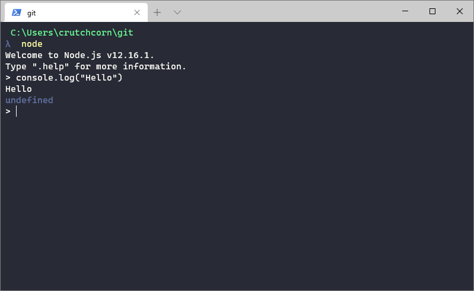

---
{
    title: "WebDev 101: How to use npm and Yarn",
    description: "",
    published: '2021-10-13T22:12:03.284Z',
    authors: ['crutchcorn'],
    tags: ['webdev', 'javascript', 'node'],
    attached: [],
    license: 'cc-by-4'
}
---

If you're new to web development, it can be difficult to figure out when (and how) to use the package manager most commonly used to install app dependencies and utilities: `npm`. Likewise, if you've looked into projects that are already established, you may find yourself looking at instructions to use `yarn`.

In this article, we'll outline what Node and npm are, how to use both `npm` and `yarn` to install dependencies for your project, and point out some "gotcha's" that are good to keep in mind while using them.

## What's Node and `npm`, anyway?

If you're new to web development - well, firstly, welcome! - you may wonder what Node and `npm` are. Great questions!

### Node

Let's start with Node. Node is a [JavaScript runtime](/posts/how-computers-speak/#compiled-vs-runtime) that allows you to run JavaScript code on your machine without having to run your JavaScript in a browser. This means that you can write JavaScript that interacts with your computer in ways your browser cannot. For example, you can host a REST web server from Node, write files to your hard drive, interact with operating system APIs (like notifications), and more!

> You can [learn more about what a runtime is and how they work from our article that introduces the concept](/posts/how-computers-speak/#compiled-vs-runtime)

Node also comes with an advantage over browsers for running JavaScript: you can interface with lower-level programming languages such as C via [Node's N-API](). This means that libraries you rely on can build on top of this N-API to provide a way to do things like send native desktop notifications, show something particular in your taskbar, or any other action that would require lower-level access to your local machine than JavaScript typically provides.

### `npm`

Any sufficiently useful programming language needs an ecosystem to rely on. One of the primary elements for an ecosystem is a collection of libraries that you can use to build out your own libraries and applications.

> A library is a snippet of code that other people have written that you can easily import into your own code and use yourself - often with a single line of code

`npm` is a combination of two things:

1) The registry - the servers and databases that host the packages with their specific named packages. 
2) The client-side CLI utility - the program that runs on your computer in order to install and manage the packages on your local disk

When, say, Facebook wants to publish a new version of `react`, someone from the React team (with publishing credentials) will setup and build the production version of the React source code, open the client-side utility in order to run the command `npm publish`, which will send the production code to the registry. From there, when you install `react` using the `npm` command on your device, it will pull the relevant files from the registry onto your local machine for you to use.

While the registry is vital for the usage of the CLI utility, most of the time we say `npm` in this article, we're referring to the CLI tool. We'll make sure to be explicit when talking about the registry itself

## Setting Up Node

Before we explain how to install Node, let's explain something about the release process of the software. 

When it comes to install options there are two: 

1) LTS

2) Current

The "LTS" release stands for "long-term release" is considered the most "stable" release, and is recommended for production usage. This is because LTS releases will recieve critical bug fixes and improvements even after a new version comes along. LTS releases often see years of support.

The "current" release, on the other hand, usually sees new features of JavaScript implemented that may not be present in the LTS release. This is often used to experiment and tests new features and functionality before the next LTS release.

NodeJS swiches back and forth between LTS and non-LTS stable releases. For example, Node 12 and 14 were LTS releases, but Node 13 and 15 were not. You can [read more about their release cycle on their website](https://nodejs.org/en/about/releases/)

### Installing Node

You can find pre-build binaries ready-to-install from [NodeJS' website](https://nodejs.org/en/download/). Simply download the package you want and install it. 

> If you're unsure which version of Node to go with, stick to the LTS release

Node installs come pre-packaged with their own version of `npm`, so don't worry about having to install that seperately.

However, the process of upgrading and changing version of NodeJS can be difficult. This is why I (and many others) recommend using NVM to manage your Node versions.

#### NVM

While Node has a fairly stable API (and their LTS releases are often supported for many years at a time), there may be instances where it's benificial to have the ability to quickly upgrade and change the currently installed Node versions.

For example, some webdev projects only work on specific versions of Node, while other times specific JavaScript features are only available on new versions of Node.

Both Windows, macOS, and Linux all have versions of a program called `nvm`, which allows you to change the installed version of node based on a single CLI command:

```
nvm use --lts
```

Additionally, you can (and, in order to use `nvm`, **must** use `nvm` to do so) install new versions of node using `nvm` . To do this, simply type:

```
nvm install --lts
```

##### Switching Node Versions {#nvm-switch-node-ver}

While NVM's entire point is to switch Node versions, there is something that should be noted before you do so. When you switch Node versions, it also resets the globally installed packages. This means that if you ran:

```
npm i -g create-react-app
```

On Node 12, when you switch to Node 14, and attempt to run a `create-react-app` command, you'll find yourself with a "cannot find that package" message.

It's also worth noting that some packages (like `sass`) have native dependencies. This means that they need to run specific commands on install depending on the version of Node you have installed. Because of this, if you switch from Node 12 to Node 14, you may need to re-run `npm i` on your packages before you attempt to re-run your applications.

##### Windows NVM

It's worth noting that the Windows variant of `nvm` does not support the same commands as the macOS and Linux variants. As such, when you find instructions for `nvm` online, you may have to find the alternative versions of those commands for the Windows version

For example, the previously mentioned `lts` command does not work on Windows. Instead, you'll have to lookup the newest LTS release of Node (from their website) and install it as such:

```
nvm install 12.16.3
```

Then, simply declare it as your main version of node:

```
nvm use 12.16.3
```

#### Upgrading NPM

The version of `npm` that's shipped with Node is typically good enough for 99.99% of use-cases. Like any other software, however, bug fixes and features are added to new versions of `npm`. You can follow [the official `npm` blog](https://blog.npmjs.org/) to read about new features and bug fixes the versions introduce.

Ironically enough, the method of upgrading `npm` is by using `npm` itself:

```
npm i -g npm@latest
```

> Keep in mind that if you switch Node versions using `nvm`, you will need to re-run this command on every version of installed Node, as switching Node also switches the installed version of `npm`.

### Yarn

`npm` isn't the only game in town when it comes to installing packages for use in webdev. One of the biggest alternatives to `npm` is the `yarn` package manager.

Yarn does not host it's own registry. Because of this, when you install a library using yarn, you're using the NPM registry and the `yarn` CLI tool. It's the method of how the packages are extracted, maintained, and handled on your local system that are changed when you use `yarn` over `npm` - not the package's contents or functionality.

Because of this, if you run into a library that tells you to run:

```
yarn add library-name
```

But your project utilizes the `npm` CLI instead, you can safely replace that command with:

```
npm i library-name
```

And vice-versa to retrieve the same package's contents.

However, the ways `npm` and `yarn` install packages on your local machine are different enough that, for some projects specifically built around Yarn's functionality, you cannot simply replace `yarn` for `npm` without some re-engineering. The differences between `npm` CLI and `yarn` are numerous and nuanced. While most projects can get by with `npm`, if a project instructs you to use `yarn` to setup your development environment, there are usually good engineering reasons for it.

> Want to learn the differences between `npm` and `yarn` yourself? We have an article that outlines the major differences between the two.

### Installing Yarn

Once you have node and npm installed, installing yarn is as simple as:

```
npm i -g yarn
```

It's worth noting that, just like `npm` and any other globally installed packages, [when you change Node version using `nvm`, you'll need to re-run this command](#nvm-switch-node-ver). However, if you're able to natively install `yarn`, you can sidestep this issue and have `yarn` persist through `nvm` version changes.

#### macOS

If you're using macOS and want to utilize `nvm`, you can also use Homebrew (a third party package manager for Macs) to install `yarn` natively:

```
brew install yarn
```

> There are other methods to install Yarn on macOS if you'd rather. [Look through `yarn`'s official docs for more](https://classic.yarnpkg.com/en/docs/install/#mac-stable)

#### Windows

Just as there's a method for installing `yarn` natively on macOS, you can do the same on Windows using [the same third-party package manager we suggest using for installing and maintaining Windows programs on your machine, Chocolatey](https://unicorn-utterances.com/posts/ultimate-windows-development-environment-guide/#package-management):

```
choco install yarn
```


> There are other methods to install Yarn on Windows if you'd rather. [Look through `yarn`'s official docs for more](https://classic.yarnpkg.com/en/docs/install/#windows-stable)


## Using Node

Now that you have it setup, let's walk through how to use Node. First, start by opening your terminal.

> On macOS, you can find your terminal by opening finder (Meta+Space) and typing "Terminal".
>
> For Windows usage, there are a few more options. We suggest reading through [our article that outlines those options and explains how to setup and use your terminal correctly.](https://unicorn-utterances.com/posts/ultimate-windows-development-environment-guide/#terminal-usage)

Once you have your terminal open, run the following command:

```
node
```

Once this is done, you should see a cursor that indicates where in the terminal:

```
>
```

From here, you can type in JavaScript code, and hit "enter" to execute:

```javascript
> console.log("Hello")
```



This view of Node - where you have an interactive terminal you can type code into - is known as the REPL.

### Executing JS Files

While Node's REPL is super useful for application prototyping, the primary usage of Node comes into effect when running JavaScript files.

To show how this works, create a file in an empty folder called "index.js". Then, place valid JavaScript in that file:

```javascript
// index.js

const randomNumber = Math.random() * 100;

if (randomNumber > 75) {
    console.log("You got really lucky and won 100 points!");
} else if (randomNumber > 50) {
    console.log("You got pretty lucky and won 50 points!");
} else if (randomNumber > 25) {
    console.log("You got 25 points!");
} else {
    console.log("You got unlucky and gained no points");
}
```

Then, in your terminal, `cd` into the directory the `index.js` file is and run `node index.js`. It will run the code and execute a `console.log` and exit immediately after.


While this particular program will automatically exits Node once it's completed running, programs like the following may run until manually halted: 

```javascript
// index.js

var points = 0;

function checkNumber() {
    const randomNumber = Math.random() * 100;

    if (randomNumber > 75) {
        console.log("You got really lucky and won 100 points!");
        points += 100;
    } else if (randomNumber > 50) {
        console.log("You got pretty lucky and won 50 points!");
        points += 50;
    } else if (randomNumber > 25) {
        console.log("You got 25 points!");
        points += 25;
    } else {
        console.log("You got unlucky and gained no points");
    }

    console.log("You now have " + points + " points");
}

setInterval(checkNumber, 2000);
```

Some other programs that may run continually includes servers (REST, GraphQL),  file watchers, or background programs. It is worth mentioning that [unless you change the default behavior with a library](#nodemon), programs that do not have an exit condition pre-programmed need to be manually restarted in order to see changes to your code executed properly.

This means that if you change the interval at-which the `checkNumber` function is ran:

```javascript
setInterval(checkNumber, 3000);
```

You'll need to re-start Node to catch that update.

The way you restart a Node process is the same on Windows as it is on macOS - it's the same way you stop the process. simply type Ctrl+C in your terminal to stop the process running. Then, re-run your Node command.

#### Hot Reload on File Edit {#nodemon}

Node being able to run JavaScript files is useful once you have a finished product ready-to-run. However, while you're actively developing a file, it can be frustrating to manually stop and restart Node every time you make a change. I've had so many instances where I've Googled "NodeJS not updating JavaScript file" at some point in my debugging, only to realize that I'd forgotten to restart the process.

Introducing `nodemon`: a library (installable via `npm`) that listens for your file changes and restarts the process whenever any of your dependencies change.

To install `nodemon`, use `npm`:

```
npm i -g nodemon
```

Then, simply replace your `node index.js` command with `nodemon index.js`.

## Using NPM/Yarn

With basic Node usage established, we can expand our abilities by learning how to use `npm`/`yarn` efficiently.

Let's start by explaining what the `package.json` file is.

When you `clone` a project, you might see a file in the root called `package.json`, it might look something like this:

```json
{
  "name": "unicorn-utterances-site",
  "description": "Learning programming from magically majestic words",
  "version": "0.1.0",
  "bugs": {
    "url": "https://github.com/unicorn-utterances/unicorn-utterances/issues"
  },
  "scripts": {
    "start": "node index.js",
  },
  "dependencies": {
    "classnames": "^2.1.3"
  },
  "devDependencies": {
    "prettier": "^1.19.1"
  }
}
```

This is how `npm` is able to track what versions of what libraries for your project, as well as keeping a consolidated list of what commands you'd like to have a shorthand for, and other project metadata. We'll explain what each of these sections does in sub-sections.

You're able to generate a fresh `package.json` file for your project using either:

```
npm init
```

Or:

```
yarn init
```

### Dependencies

Most projects you'll run into will have at least one dependency. A dependency is a library that your project depends on for it's functionality. For example, if I use the [`classnames` library](https://www.npmjs.com/package/classnames) to generate CSS-friendly class names from a JavaScript object:

```javascript
const classNames = require('classnames');
const classes = classNames({ foo: true, bar: false });
console.log({classes});
```

I would need to make sure that `classnames` is installed before running this code. Otherwise, I'd run into an error like this:

```
internal/modules/cjs/loader.js:985
  throw err;
  ^

Error: Cannot find module 'classnames'
```

In order to fix this error, we need to make sure that `classnames` is in our dependency object in `package.json` and that we've ran `npm i` or a `yarn install` to install the package.

If your `package.json` already has the dependency listed:

```
"dependencies": {
  "classnames": "^2.1.3"
},
```

Then it should be as easy as `npm i` or `yarn install` to tell it "Install the packages listed as dependencies". However, if you're starting with a fresh `package.json` file without any dependencies (or simply want to add a new dependency), you can do so with a single command.

If you're using `npm`, you can add a new dependency using:

```
npm install classnames
```

Otherwise, if you're using `yarn`, the command is:

```
yarn add classnames
```

> While we're using `classnames` as an example here, you can use the name of whatever dependency you're wanting to add.

#### Semantic Versioning {#semver}

For each dependency listed, there is a number with three dots associated with it. These numbers represent the version of the library to install when running commands like `npm i`.

While you can use these numbers arbitrarily, most projects follow [a standard called "Semantic versioning"](https://semver.org/) (aka "SemVer" for short).

The basics of semantic versioning can be broken down into three parts:

1) The major version
2) The minor version
3) The patch version

In SemVer, a package version might look something like `MAJOR.MINOR.PATCH`. A package with `2.1.3` has a "**major** version" of `2`, a "**minor** version" of `1`, and a "**patch** version" of `3`.

What are major, minor, and patch versions?

They describe what changes were made in each release. Let's start from the bottom and work our way up.

A patch release might contain documentation updates, bug fixes, security patch, or anything else that doesn't add functionality or breaking changes (more on that later).

A minor release is usually a feature update. This release added some new functionality to the library without any breaking changes.

A major release is a change to the library that requires a change (any change) in the consuming code. These changes, which may require dependants to rewrite sections of their code to utilize, are called **breaking changes**. In large libraries, breaking changes are often withheld from smaller releases and grouped together to create a major release, complete with documentation for how to change your code to reflect these changes.

Because minor and patch releases do not contain breaking changes (when following SemVer), you can safely update dependencies that utilize SemVer without having to check the changelog for every minor/patch release.

Again, this isn't the _only_ way to version a library, but it is an increasingly common method for making sure that new versions won't break your project's functionality.

##### SemVer Setting {#package-json-semver}

How can we leverage SemVer in our `package.json`? If you looked at the `dependencies` object in our example previously, you may have noticed an odd character that's not a number: `^`.

```
"dependencies": {
  "classnames": "^2.1.3"
},
```

This is a character that's understood by `npm` to mean "you may install any version of `classnames` that's a minor version above `2.1.3`"

For example, `classnames` has had the following releases:

- `2.1.2`
- `2.1.3`
- `2.1.4`
- `2.2.0`
- `2.2.1`
- `...`
- `2.2.6`

If we set our version to include the caret (`^`) of `2.1.3`(`^2.1.3`), the following versions are allowed to be installed:

```diff
- 2.1.2
+ 2.1.3
+ 2.1.4
+ 2.2.0
+ ...
+ 2.2.6
- 3.0.0
```

> A `-` means that this version is out-of-range and should not be installed, while `+` means that this version is in-range and is able to be installed by your package manager.

This allows us to set a bare-minimum version that we rely the functionality of without worrying about breaking changes from a major release.

However, `^` isn't the only character you can use to tell your package manager which version to install. You can also use `~` like `~2.1.3` to indicate that you'd like to install patch releases, but not minor releases.

```diff
- 2.1.2
+ 2.1.3
+ 2.1.4
- 2.2.0
- ...
- 2.2.6
- 3.0.0
```

This can be useful when a package isn't following SemVer and instead includes breaking changes in minor releases.

There are other modifiers you can use such as version ranges that cross-over major releases, pre-release versions, and more. To learn more about these additional modifiers and to experiment with the tilde and caret modifiers, [NPM has setup a website that teaches you and lets you visually experiment with the modifiers](https://semver.npmjs.com/).

#### Dev Dependencies

#### Peer Dependencies

### Scripts {#npm-scripts}

You'll notice that the above `package.json` has a `start` script. When `npm run start` or `yarn start` is ran, it will execute `node index.js` to run the file with Node. While `node` usage is common, you're also able to leverage any command that's valid on your machine. You could have:

```json
"scripts": {
  "start": "gatsby build",
}
```

To reference an `npm` package script, or even a system command like:

```
"scripts": {
  "start": "ls",
}
```

You're not limited to a single command, either. Most projects will have "scripts" for things like building your project for production, starting development servers, running linters, and much more:

```json
"scripts": {
  "build": "gatsby build",
  "develop": "gatsby develop",
  "lint": "eslint ./src/**/*.{ts,tsx}",
  "start": "npm run develop",
  "test": "jest"
}
```

### `package-lock.json`


### Ignoring `node_modules`