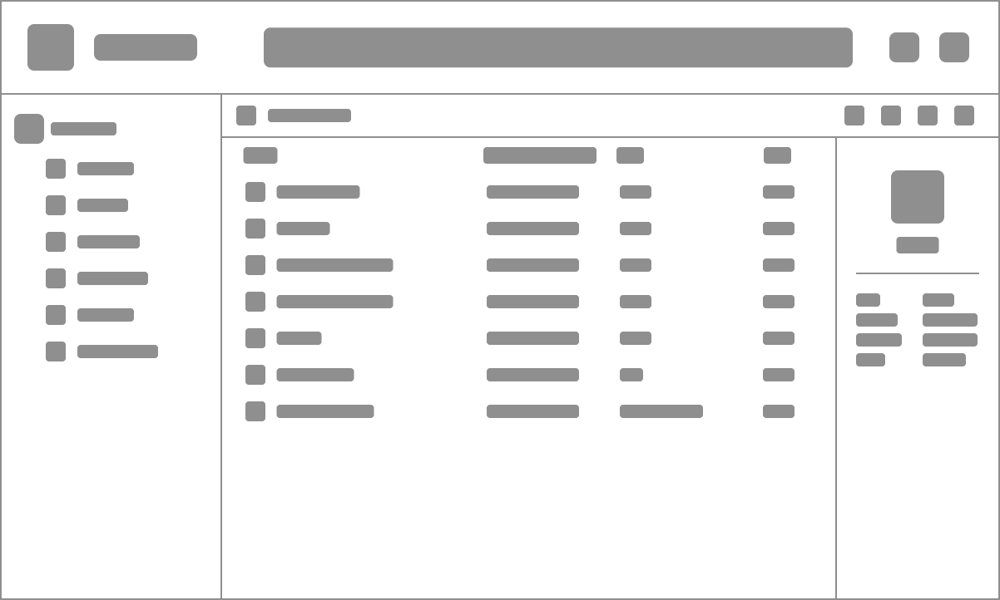
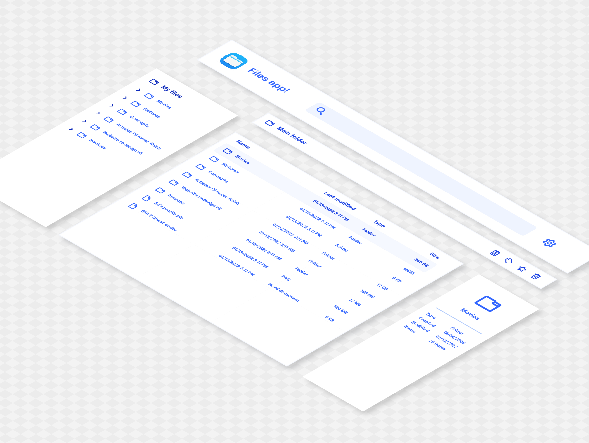

---
{
    title: "Introduction to Components",
    description: "",
    published: '2023-01-01T22:12:03.284Z',
    authors: ['crutchcorn'],
    tags: ['webdev'],
    attached: [],
    order: 1,
    series: "The Framework Field Guide"
}
---

> Before we can dive into how many front-end frameworks that you may have heard of work, we need to set a baseline of information. If you're already familiar with how the DOM represents a tree and how the browser takes that information and utilizes it, great! You're ready to read ahead! Otherwise, it's strongly suggested that you take a look at [our post introducing the concepts](https://unicorn-utterances.com/posts/understanding-the-dom/) required to understanding some of the baseline to this post

You may have heard about various frameworks and libraries that modern front-end developers utilize to build large-scale applications. Some of these frameworks you may have heard of are Angular, React, and Vue. While each of these libraries bring their own strengths and weaknesses, many of the core concepts are shared between them.

With this course, we're going to be outlining core concepts that are shared between them and how you can implement them in code in all three of the frameworks. This should provide a good reference when trying to learn one of these frameworks without a pre-requisite knowledge or even trying to learn another framework with some pre-requisite of a different one.

Let's first explain why frameworks like Angular, React, or Vue differ from other libraries that may have come before it, like jQuery.

It all comes down to a single core concept at the heart of each of them: **Componentization**.

# What's an app, anyway?

Before we dive into the technical aspects, let's think about what an app consists of at a high level.

Take the following application into consideration.


Here, our app has many parts to it. A sidebar to contain navigation links, a list of files for a user to navigate, and a details pane about the file the user currently has selected.

What's more, each part of the app needs different things.

The sidebar may not require complex programming logic, but we may want to style it with nice colors and highlight effects when the user hovers. Likewise, the file list may contain complex logic to handle a user right clicking or dragging and dropping files.

When you break it down, each part of the app has three primary concerns:

- Logic - What the app does
- Styling - How the app looks visually
- Structure - How the app is laid out

While the mockup above does a good job at displaying things structurally, let's look at what the app looks like structurally:



Here, each section is laid out without any additional styling. Simply a wireframe of what the page will look like with each section containing blocks that are laid out in fairly simple ways. This is what HTML will help us build.

Now that we understand the structure, let's add some functionality. We'll include a small snippet of text to each section to outline what the goals are. In the future, we'd use these as "acceptance" criteria. This is what our logic will provide to the app.


Great! Now let's go back and add in the styling to recreate the mockup we had before!


For each step of the process, we can think of it like we're adding in a new programming language.

- HTML is used for adding in the strucuture of an application. The sidenav might be a `<nav>` tag, for example
- JavaScript adds in the logic of the application on top of the structure.
- CSS is utilized to make all of it look nice, and to potentially add some smaller UX improvements


The way I typically think about these 3 pieces of tech is:

HTML is like the building blueprints. It allows you to see the overarching pictures of what the end result will look like. They define the walls, doors, and flow of a home. 

JavaScript is like the electrical, plumbing, and appliances of the house. They allow you to interact with the building in a meaningful way.

CSS is like the paint and other decor that goes into a home. They're what makes the house feel lived in and inviting. They can't exist without the rest of the home, but rest assured without it it's a miserable experience.

# Parts of the app

Now that we've introduced the idea of what an app looks like, let's go back for a moment. Remember how I said each app is made of parts? Let's explode the app's mockup and take a look at that in more depth.



Here, we can more distinctly see how each part of the app has it's own structure, styling, and logic.

The files list, for example, contains the structure of each files being its own item, logic about what buttons do which actions, and some CSS to make it look engaging.

While the code for this section might look something like this:

```html
<section>
    <button id="addButton"><span class="icon">plus</span></button>
    <!-- ... -->
</section>
<ul>
    <li><a href="/file/file_one">File one<span>12/03/21</span></a></li>
    <!-- ... -->
<ul>
<script>
var addButton = document.querySelector("#addButton")
addButton.addEventListener('click', () => {
  // ...
})
</script>
```

We might have a mental model to break down each section into smaller ones. If we use psuedo-code to represent our mental model of the actual codebase, it might look something like this:

```html
<files-buttons>
	<add-button></add-button>
</files-buttons>
<files-list>
	<file name="File one"></file>
</files-list>
```

Luckily, by using frameworks, this mental model can be reflect in real code!

Let's look at what `<file>` might look like in each framework:

<!-- tabs:start -->

## React

```jsx
const File = () => {
  return <li><a href="/file/file_one">File one<span>12/03/21</span></a></li>
}
```

> Here, we're using a syntax very similar to HTML - but in JavaScript instead. This syntax is called ["JSX"](https://reactjs.org/docs/introducing-jsx.html) and powers the show for every React application.
>
> While JSX looks closer to HTML than normal JS, it is not supported in the language itself. Instead, it requires a compiler (or transpiler) like [Babel](https://babeljs.io/) to compile down to normal JS. Under-the-hood this JSX compiles down to function calls.
>
> For example, the above would be turned into:
>
> ```javascript
> var spanTag = React.createElement("span", null, "12/03/21");
> var aTag = React.createElement("a", {
>     href: "/file/file_one"
> }, "File one", spanTag);
> React.createElement("li", null, aTag);
> ```
>
> While the above seems intimidating, it's worth mentioning that you'll likely never need to fall back on using `createElement` in an actual production application. This is simply to demonstrate why you need Babel in React applications.
>
> You also likely do not need to setup Babel yourself from scratch. [Create React App](https://create-react-app.dev) - the tool React team recommends to manage your React apps - handles it out-of-the-box for you invisibly.

## Angular

```typescript
import {Component} from '@angular/core';

@Component({
  selector: 'file',
  template: `
    <li><a href="/file/file_one">File one<span>12/03/21</span></a></li>
  `
})
export class FileComponent {
}
```

> Here, we're using the `@Component` decorator to define a class component in Angular. However, it's important to note that decorators (`@`) are not supported in JavaScript itself. Instead, Angular uses [TypeScript](https://unicorn-utterances.com/posts/introduction-to-typescript/) to add types and other features to the language. From there, TypeScript compiles down to JavaScript.
>
> Luckily for us, the Angular CLI handles all of that for us. You simply need to generate a new project to get started!

## Vue

```javascript
const File = { 
	template: `<li><a href="/file/file_one">File one<span>12/03/21</span></a></li>`
}
```

<!-- tabs:end -->

These are called "components". Components have multiple properties, which we'll touch on shortly. 

We can see that each framework has their own syntax to display these components. While each framework has its pros and cons, many of the fundamental concepts behind them are shared. 

While this is cool - it leads to a good question: how do you _use_ these components in HTML?

# Rendering the app

While these components might look like simple HTML, they're rather capable of further usage. Because of this, each framework actually uses JavaScript under-the-hood to draw these components on-screen.

**This process of "drawing" is called "rendering".** A component may render at various times, in particular when it needs to update data shown on-screen, which we'll touch on later.

Because modern web apps consist of multiple files (that are then often bundled with [Node](https://unicorn-utterances.com/posts/how-to-use-npm/#whats-node) and some CLI tool), all apps with React, Angular, and Vue start with an `index.html` file. 

<!-- tabs:start -->

## React

```html
<!-- index.html -->
<html>
	<body>
		<div id="root"></div>
	</body>
</html>
```


## Angular

```html
<!-- index.html -->
<html>
	<body>
		<!-- This should match the `selector` of the -->
    <!-- component you want here -->
		<file></file>
	</body>
</html>
```

## Vue

```html
<!-- index.html -->
<html>
	<body>
		<div id="root"></div>
	</body>
</html>
```

<!-- tabs:end -->


Then, in JavaScript, you "render" a component into this element.

<!-- tabs:start -->

## React


```jsx
import { createRoot } from 'react-dom';

const File = () => {
  return <li><a href="/file/file_one">File one<span>12/03/21</span></a></li>
}

createRoot(document.getElementById('root')).render(<File />);
```

## Angular

```typescript
import {Component, NgModule} from '@angular/core';
import { BrowserModule } from '@angular/platform-browser';
import { platformBrowserDynamic } from '@angular/platform-browser-dynamic';

@Component({
  selector: 'file',
  template: `
    <li><a href="/file/file_one">File one<span>12/03/21</span></a></li>
  `
})
export class FileComponent {
}

@NgModule({
  imports: [BrowserModule],
  declarations: [FileComponent],
  bootstrap: [FileComponent],
})
export class AppModule {}

platformBrowserDynamic().bootstrapModule(AppModule);
```

> Angular has the concept of ["Modules"](https://angular.io/guide/architecture-modules) that allows you to opimize your application by keeping bundle size small. While it's an important part of Angular, don't worry too much about it for the moment.
>
> What _is_ important to note is that for each component, you need to register components within the `declarations` before usage

## Vue

```javascript
const File = { 
	template: `<li><a href="/file/file_one">File one<span>12/03/21</span></a></li>`
}

import { createApp } from 'vue';

createApp(File).mount("#root");
```

<!-- tabs:end -->

Once a component is rendered, you're able to do a lot more with it!

For example, just like [nodes in the DOM]() have relationships, so too can components.

# Children, siblings, and more oh my!

While our `File` component currently contains HTML elements, components may also contain other components!

<!-- tabs:start -->

## React

```jsx
const File = () => {
  return <li><a href="/file/file_one">File one<span>12/03/21</span></a></li>
}

const FileList = () => {
    return <ul>
    	<File/>
    </ul>
}
```

## Angular

```typescript
@Component({
  selector: 'file',
  template: `
    <li><a href="/file/file_one">File one<span>12/03/21</span></a></li>
  `
})
export class FileComponent {
}

@Component({
  selector: 'file-list',
  template: `
    <ul>
		<file></file>
    </ul>
  `
})
export class FileListComponent {
}
```

## Vue

```javascript
const File = { 
	template: `<li><a href="/file/file_one">File one<span>12/03/21</span></a></li>`
}

const FileList = {
    template: `
    	<ul>
    		<file></file>
        </ul>
    `,
    components: {
        File
    }
}
```

We need to make sure to register all of the components we'll be using in our component! Otherwise, Vue will throw an error:

> Failed to resolve component: file

<!-- tabs:end -->


Looking through our `File` component, we can also notice that we're rendering multiple elements inside of a single component. Funnily enough, this has the fun side effect that we can also render multiple components inside of a parent component.

<!-- tabs:start -->

## React

```jsx
const FileList = () => {
    return <ul>
    	<File/>
    	<File/>
    	<File/>
    </ul>
}
```

## Angular

```typescript
@Component({
  selector: 'file-list',
  template: `
    <ul>
		<file></file>
		<file></file>
		<file></file>
    </ul>
  `
})
export class FileListComponent {
}
```

## Vue

```javascript
const FileList = {
    template: `
    	<ul>
    		<file></file>
    		<file></file>
    		<file></file>
        </ul>
    `,
    components: {
        File
    }
}
```

<!-- tabs:end -->

This is a particularly useful feature of components. It allows you to reuse aspects of your structure (and styling + logic, but I'm getting ahead of myself) without having to repeat yourself. It allows for a very DRY architecture where your code is declared once and reused elswhere.

> That stands for "Don't repeat yourself" and is often heralded as a gold standard of code quality!

It's worth remembering that we're using the term "parent" to refer to our `FileList` component in relation to our `File` component. This is because, like the DOM tree, each framework's set of components reflect a tree.

**// Add in DOM tree representation of `File` and `FileList`**

This means that the related `File` components are "siblings" of one-another, each with a "parent" of `FileList`.

We can extend this hierarchical relationship to have "grandchildren" and beyond as well:

<!-- tabs:start -->

## React

```jsx
const FileDate = () => {
  return <span>12/03/21</span>    
}


const File = () => {
  return <li><a href="/file/file_one">File one<FileDate/></a></li>
}

const FileList = () => {
    return <ul>
    	<File/>
    	<File/>
    	<File/>
    </ul>
}
```

## Angular

```typescript
import {Component} from '@angular/core';

@Component({
  selector: 'file-date',
  template: `
    <span>12/03/21</span>
  `
})
export class FileDateComponent {
}

@Component({
  selector: 'file',
  template: `
    <li><a href="/file/file_one">File one<file-date></file-date></a></li>
  `
})
export class FileComponent {
}

@Component({
  selector: 'file-list',
  template: `
    <ul>
		<file></file>
		<file></file>
		<file></file>
    </ul>
  `
})
export class FileListComponent {
}
```

## Vue

```javascript
const FileDate = { 
	template: `<span>12/03/21</span>`
}

const File = { 
	template: `<li><a href="/file/file_one">File one<file-date></file-date></a></li>`,
    components: {
        FileDate
    }
}

const FileList = {
    template: `
    	<ul>
    		<file></file>
    		<file></file>
    		<file></file>
        </ul>
    `,
    components: {
        File
    }
}
```

<!-- tabs:end -->

# Logic

HTML isn't the only thing components are able to store, however! Like we mentioned earlier, apps (and by extension, each part of the respective apps) require three parts:

- Structure (HTML)
- Styling (CSS)
- Logic (JS)

Components can handle all three!

While we'll touch on styling more in the future, let's take a look at how we can declare logic in a component by making `date` show the current date instead of a static date.

We'll start by adding in a simple function to display the current date in a human readable form.


<!-- tabs:start -->

## React

```jsx
const FileDate = () => {
  const date = `${(new Date()).getMonth() + 1}/${(new Date()).getDate()}/${(new Date()).getFullYear()}`
  return <span>12/03/21</span>
}
```

## Angular

```typescript
@Component({
  selector: 'date',
  template: `
    <span>12/03/21</span>
  `
})
export class FileDateComponent {
	date = `${(new Date()).getMonth() + 1}/${(new Date()).getDate()}/${(new Date()).getFullYear()}`;
}
```

## Vue

```javascript
const FileDate = { 
	template: `<span>12/03/21</span>`,
    data() {
        return {
            date: `${(new Date()).getMonth() + 1}/${(new Date()).getDate()}/${(new Date()).getFullYear()}`
        }
    }
}
```

<!-- tabs:end -->

While this logic works, it's a bit verbose (and slow, due to recreating the `Date` object thrice) - let's break it out into a method, contained within the component.

```javascript
function formatDate() {
	const today = new Date();
	// Month starts at 0, annoyingly
	const month = today.getMonth() + 1;
    const date = today.getDate();
    const year = today.getFullYear();
    return month + "/" + date + "/" + year;
}
```

<!-- tabs:start -->

## React

```jsx
function formatDate() {
	const today = new Date();
	// Month starts at 0, annoyingly
	const month = today.getMonth() + 1;
  const date = today.getDate();
  const year = today.getFullYear();
  return month + "/" + date + "/" + year;
}

const FileDate = () => {    
  const date = formatDate();
  return <span>12/03/21</span>
}
```

> Because React can easily access functions outside of the component declaration, we decided to move it outside of the component scope. This allows us to avoid redeclaring this function in every render, which the other frameworks don't do thanks to different philosophies.

## Angular

```typescript
@Component({
  selector: 'date',
  template: `
    <span>12/03/21</span>
  `
})
export class FileDateComponent {
	date = this.formatDate();
    
    formatDate() {
	  const today = new Date();
      // Month starts at 0, annoyingly
      const month = today.getMonth() + 1;
      const date = today.getDate();
      const year = today.getFullYear();
      return month + "/" + date + "/" + year;
    }
}
```

## Vue

```javascript
const FileDate = {
  template: `<span>{{date}}</span>`,
  data() {
    return {
      date: this.formatDate(),
    };
  },
  methods: {
    formatDate() {
      const today = new Date();
      // Month starts at 0, annoyingly
      const month = today.getMonth() + 1;
      const date = today.getDate();
      const year = today.getFullYear();
      return month + '/' + date + '/' + year;
    },
  },
};
```

> This syntax might look a bit off. After all, why are we using `this` when it's not a class we're calling within.
>
> Luckily for us, Vue expects us to declare our methods and data in this way. As a result, it'll automatically bind `this` for us.

<!-- tabs:end -->


# Intro to Lifecycles

While you can rest assured this code works, since I'm the author and I'd probably be a bit embarrassed by it not running...

> Way to temp fate there, author

... It's important to realize that not all of our code will functions will work as intended first try. Moreover: What on earth is that function even outputting - we don't currently have a way to evaluate the output?

Let's fix that by telling our components that "once you're rendered on screen, `console.log` the value of that data".

<!-- tabs:start -->

### React

```jsx
import {useEffect} from 'react';

function formatDate() {
  const today = new Date();
  // Month starts at 0, annoyingly
  const month = today.getMonth() + 1;
  const date = today.getDate();
  const year = today.getFullYear();
  return month + "/" + date + "/" + year;
}

const FileDate = () => {  
  useEffect(() => {
	  const date = formatDate();

    console.log({date})
  }, []);
  
  return <span>12/03/21</span>
}
```

> React is a bit different from the rest of the group when it comes to lifecycles. Take a look at the other examples. Instead of an explicit "when this is rendered", we have a mention of a "side effect". We'll touch on why that is in a moment.

### Angular

```typescript
import {Component, OnInit} from '@angular/core';

@Component({
  selector: 'date',
  template: `
    <span>12/03/21</span>
  `
})
export class FileDateComponent implements OnInit {
	date = this.formatDate();

  ngOnInit() {
    console.log(date);
  }
  
    formatDate() {
	  const today = new Date();
      // Month starts at 0, annoyingly
      const month = today.getMonth() + 1;
      const date = today.getDate();
      const year = today.getFullYear();
      return month + "/" + date + "/" + year;
    }
}
```

### Vue

```javascript
const FileDate = {
  template: `<span>{{date}}</span>`,
  data() {
    return {
      date: this.formatDate(),
    };
  },
  mounted() {
    console.log(this.date);
  },
  methods: {
    formatDate() {
      const today = new Date();
      // Month starts at 0, annoyingly
      const month = today.getMonth() + 1;
      const date = today.getDate();
      const year = today.getFullYear();
      return month + '/' + date + '/' + year;
    },
  },
};
```

<!-- tabs:end -->

Here, we're telling each respective framework to simply log the value of `date` to the console once the component is rendered for the first time.

> Wait, "for the first time"?

Yup! React, Angular, and Vue all are capable of updating (or, re-rendering) when they need to.

For example, let's say you want to show `date` to a user, but then later in the day the time switches over. While you'd have to handle the code to keep track of the time, **the respective framework would notice that you've modified the values of `date` and re-render the component to display the new value**.

While the method each framework uses to tell _when_ to re-render is different, they all have a highly stable method of doing so.

This feature is arguably the biggest advantage of building an application with one of these frameworks.

**This idea of having a bit of code run at a specific time relative to a component is called a compoent's "Lifecycle"**. Each part of a component's lifecycle has some kind of method behind it. There are many more types of lifecycle methods, including one that updates any time a value on-screen is changed, but we'll dive deeper into them at another time.

Speaking of updating data on screen - let's take a look at how we can dynamically display data on a page.


# Display

While displaying the value in the console works well for debugging, it's not of much help to the user. After all, more than likely your users won't know what a console even is. Let's show that code on-screen


# Inputs

A file list containing only a single kind of file isn't much of a file list, however. Luckily for us, components accept arguments just like functions! These arguments are most often called "inputs" or "props" in the component world.

Let's have the file name be an input to our `File` component: 


------

Components can have multiple methods

Components can have multiple classes

------

Components can be re-used

Components can be used for organized. Keeping files logic with files

Components can contain themselves

Components can accept inputs

Components can output*

Components make up tree relationship
