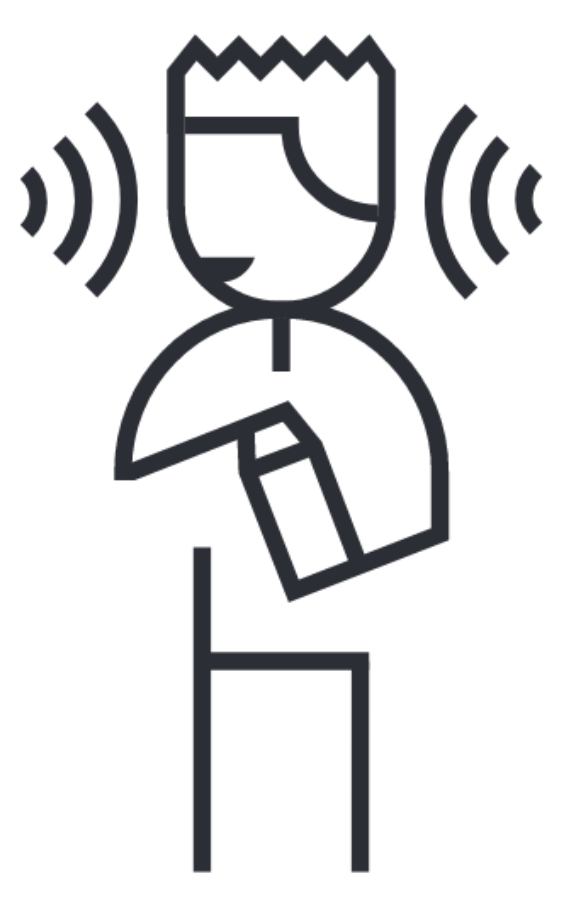
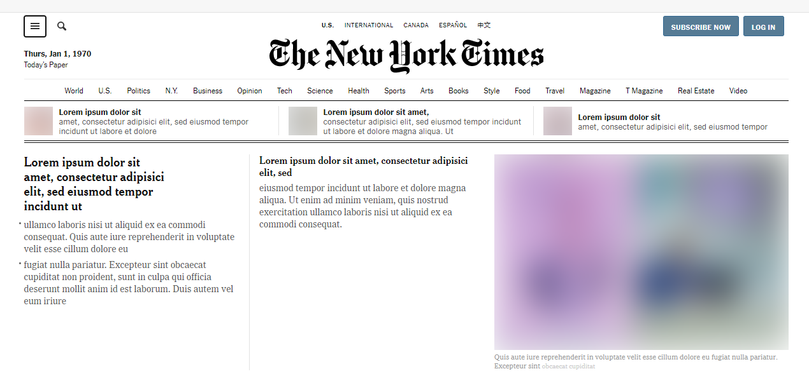
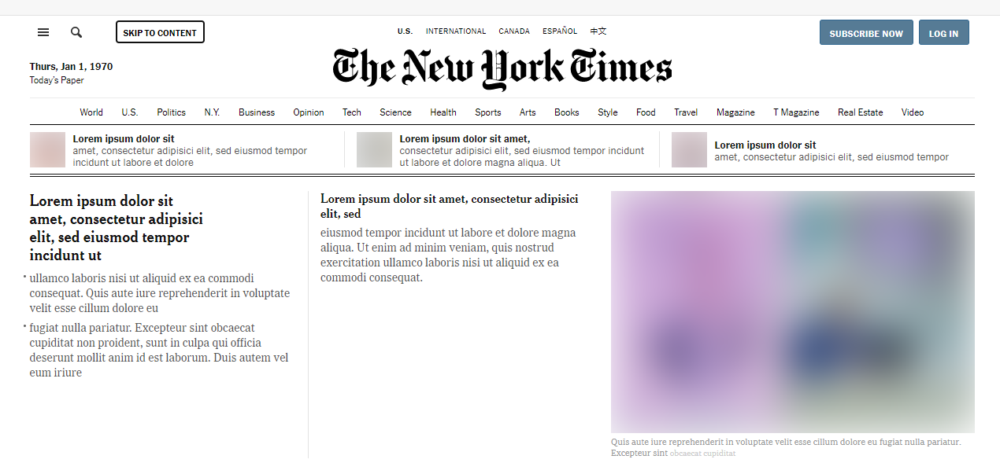

---
{
    title: "Introduction to Web Accessibility (A11Y)",
    description: "Accessibility allows as many people to use your product as possible. That, in turn, generates more profit. Here's how to improve it on web.",
    published: '2021-05-30T22:12:03.284Z',
    authors: ['crutchcorn'],
    tags: ['accessibility', 'webdev'],
    attached: [],
    license: 'coderpad',
    originalLink: 'https://coderpad.io/blog/introduction-to-web-accessibility-a11y/'
}
---

If you’ve come across this article but haven't heard about web accessibility (often shortened to "A11Y") before, that's okay. We're all learning at different speeds and come across new things all the time. That said, accessibility is a critical component of any frontend engineer's responsibilities. We implore you to explore what that means, not just in this blog post but beyond with your teams and communities.

First, let's define what "accessibility" is. Accessibility in engineering is ["the process of creating products that are usable by people with the widest possible range of abilities."](https://dl.acm.org/doi/10.1145/2596695.2596719)

One example of accessibility is the needs of blind or low-vision users. They may rely on [screen readers](https://www.afb.org/blindness-and-low-vision/using-technology/assistive-technology-products/screen-readers) or other assistive technologies, which allows them to navigate their computer with their other senses. These methods may be used in tandem with the visual experience for some or used independently to navigate their computer auditorily or tactilely.

Another example is users with limited mobility who utilize specialty hardware, such as buttons, to trigger different behaviors on their machine.

> If you're a visual learner who would like to see some short-and-quick workflows from users like this, [one of Apple's ads](https://www.youtube.com/watch?v=XB4cjbYywqg) displays a few use cases that proper accessibility support can enable.

Something to keep in mind is that these disabilities may not be permanent. For instance, if you fall and break your arm, you may be only using one arm while healing. Likewise, there are situational impairments as well. If you're holding a cup of coffee in one hand, you'll only be using the other for device usage. Here's a chart that outlines a few more of these examples:

<table>
	<tr>
	  <th></th>
		<th scope="col">Permanent</th>
		<th scope="col">Temporary</th>
		<th scope="col">Situational</th>
	</tr>
	<tr>
		<th scope="row">Touch</th>
		<td><br/>One arm</td>
		<td><br/>Arm injury</td>
		<td><br/>New parent</td>
	</tr>
	<tr>
		<th scope="row">See</th>
		<td><br/>Blind</td>
		<td><br/>Cataract</td>
		<td><br/>Distracted driver</td>
	</tr>
	<tr>
		<th scope="row">Hear</th>
		<td><br/>Deaf</td>
		<td><br/>Ear infection</td>
		<td><br/>Bartender</td>
	</tr>
	<tr>
		<th scope="row">Speak</th>
		<td><br/>Non-verbal</td>
		<td><br/>Laryngitis</td>
		<td><br/>Heavy accent</td>
	</tr>
</table>

> Microsoft originally created this chart as part of their [Inclusive Toolkit](https://download.microsoft.com/download/b/0/d/b0d4bf87-09ce-4417-8f28-d60703d672ed/inclusive_toolkit_manual_final.pdf) manual

Creating an application that's accessible means that you're making a better experience for _all_ of your users.

By making your services accessible to more people, you are most importantly making them more equitable, but there is often a business case for accessibility. Opening your doors to more users may create an additional financial incentive, and many organizations have a legal requirement to meet accessibility guidelines. For instance, the U.S. Federal Government is subject to [Section 508](https://www.section508.gov/manage/laws-and-policies), which requires compliance with [Web Content Accessibility Guidelines (also known as WCAG, which we'll touch on later)](#wcag). Likewise, private US companies may be subject to compliance due to the "Americans with Disabilities Act" (shortened to "ADA"). The U.S. isn't the only country with these requirements, either. According to [WCAG's reference page for various legal laws](https://www.w3.org/WAI/policies/), there are at least 40 such laws in place around the world.

> Please note that we are _not_ giving legal advice. This article is simply meant for educational purposes for individuals. Consult legal authorities for the appropriate jurisdiction

Accessibility isn't a pure science, however. If you aren’t a user of assistive technology, this may be an abstract idea at first. However, think of it like this: the colors an app uses or a button's visual placement may convey different messages and meanings depending on their context. This same problem applies to users of screen-readers and other accessible tech as well, just with different constraints. If the screen is visually cluttered, the content may be more difficult to read. Likewise, different accessibility methods will lead to different experiences for users of assistive technology. In both of these scenarios, there may not be objectively correct answers - some may prefer a button placed visually to the left, while others might advocate for it on the right. Similarly, how something is read using a screen reader may make sense to some, but might be confusingly expressed to others.

# Sensible Standards {#wcag}

While accessibility has some levels of subjectivity, it's important to note that there _are_ standards surrounding web application's accessibility support. ["Web Content Accessibility Guidelines"](https://www.w3.org/WAI/) (shortened to "WCAG") are guidelines to follow when considering your app's accessibility.  These guidelines are published by a subgroup of the [World Wide Web Consortium](https://www.w3.org/) (shortened to "W3C"), the main international standards organization for the Internet. WCAG acts as the de-facto standard for accessibility guidelines.

There are different scales of accessibility as well. [WCAG includes three different levels of conformance](https://www.w3.org/WAI/WCAG2AA-Conformance):

> - Level A is the minimum level.
> - Level AA includes all Level A and AA requirements. Many organizations strive to meet Level AA.
> - Level AAA includes all Level A, AA, and AAA requirements.

Meeting AA requirements is typically seen as a good commitment to accessibility, but AAA will open more doors to your users and is the gold standard for accessible user experience.

Far from a comprehensive list, A requires:

- [Non-text content to have alternative text](https://www.w3.org/TR/WCAG21/#non-text-content)
- [Automatically moving elements (such as GIFs) must be able to be paused](https://www.w3.org/TR/WCAG21/#pause-stop-hide)

Meanwhile, AA covers things like:

- Screen reader experience
- [Minimum contrast guidelines](#contrast)
- [Text resize support](#font-resize)
- [Video captions](https://www.w3.org/TR/WCAG21/#captions-live)
- [Basic support for keyboard navigation](#keyboard)

Finally, AAA includes support for:

- [Enhanced contrast](https://www.w3.org/TR/WCAG21/#contrast-enhanced)
- [Reduced/restricted animations](https://www.w3.org/TR/WCAG21/#animation-from-interactions)
- [Video sign language support](https://www.w3.org/TR/WCAG21/#sign-language-prerecorded)
- [Full website functionality with keyboard](#keyboard)

Interested in reading the full list? [Read the quick reference to WCAG 2.1](https://www.w3.org/WAI/WCAG21/quickref/).

# Smartly using Semantic HTML Tags {#html-semantic-tags}

One of the easiest things you can do for your application's accessibility is to use semantic HTML tags.

Let's say we have HTML to display fruits in a list:

```html
<!-- Inaccessible -->
<div>
    <div>Orange</div>
    <div>Banana</div>
    <div>Grapefruit</div>
</div>
```

While this will display the contents, and you may be able to use CSS to add styling to make this look like a list, the browser has no way of knowing that this is a list. This is reflected in how screen readers read that HTML output.

<video src="./div.mp4" width="100%" height="auto" preload="auto" title="Voiceover reading of the content above"  controls></video>

Likewise, search engine crawlers won't know that this is a list. If you're only using `div` tags as far as Google's concerned, you have no lists, no headings, nothing. This makes the page significantly less engaging and therefore rank more poorly.

Let's compare that to using the correct HTML tags for a list.

```html
<!-- Accessible -->
<ul aria-label="Fruits">
    <li>Orange</li>
    <li>Banana</li>
    <li>Grapefruit</li>
</ul>
```

<video src="./semantic.mp4" width="100%" height="auto" preload="auto" title="Voiceover reading of the content above" controls></video>

As you may be able to hear, this screen reader is now able to read out that it's a list and its name. It makes navigation of that list easier for those users by allowing them to quickly skip to the next list item and hear the index of an item in the list.

Not only does this enhance the experience of assistive technology users browsing your list, but because search engine crawlers rely on HTML tags to inform what's what, your site may rank better in search engine queries as well! This is a massive boon to your site's SEO score.

# Understand `aria-` properties {#aria}

In our previous example, we used an HTML attribute [`aria-label`](https://developer.mozilla.org/en-US/docs/Web/Accessibility/ARIA/ARIA_Techniques/Using_the_aria-label_attribute) on our `ul`. [ARIA is collection of HTML attributes that allow you to enhance the accessibility in applications](https://developer.mozilla.org/en-US/docs/Web/Accessibility/ARIA). That said, _**it is highly encouraged to use the suggested HTML tags instead of `aria` attributes whenever possible**_. Think of `aria` as a complex low level API that can enhance your experience when done properly, but drastically harm user experience when improperly utilized.

> No ARIA is better than Bad ARIA
> [WCAG WAI-ARIA Authoring Practices](https://www.w3.org/TR/wai-aria-practices-1.1/#no_aria_better_bad_aria)

A super small small subsection of `aria-` attributes includes:

- [`aria-labelledby`](https://developer.mozilla.org/en-US/docs/Web/Accessibility/ARIA/ARIA_Techniques/Using_the_aria-labelledby_attribute) — Associate the element with another element's text as the label
- `aria-expanded` — A Boolean value meant to communicate when a dropdown is expanded
- `aria-valuemin` — The minimum allowed value in a numerical input
- `aria-valuemax` — The maximum allowed value of a numerical input

Additional to `aria` props, [the `role` property](https://developer.mozilla.org/en-US/docs/Web/Accessibility/ARIA/ARIA_Techniques#roles) tells the browser what an element's intended purpose is, thus changing its behavior with accessible tech. Again, this is a highly advanced (and often incorrectly deployed) API for complex apps. To learn more, [read through Mozilla's ARIA basics article.](https://developer.mozilla.org/en-US/docs/Learn/Accessibility/WAI-ARIA_basics)

# Classy CSS {#css}

While HTML relays a significant amount of information to assistive technologies like screen readers, it's not the only thing used to inform those tools. Certain CSS rules can change the functionality as well. After all, screen readers (and other tools) don't look through the source code of a website. Instead, they're looking at [the accessibility tree](https://developers.google.com/web/fundamentals/accessibility/semantics-builtin/the-accessibility-tree): a modified version of the DOM. The accessibility tree and the DOM are both constructed by the browser from the website's source code.

> Want to learn more about the DOM, how the browser constructs it, and what it's used for internally? [This article helps explain this in detail](https://unicorn-utterances.com/posts/understanding-the-dom/).

Because the DOM is influenced by CSS, it impacts the accessibility tree as well. For example, `display: none` removes the element from the [accessibility tree](https://benmyers.dev/blog/accessibility-tree/) and from the browsers visual output. This means that screen readers won't read the contents of an element with that rule applied. However, `visibility: hidden`  or `width: 0px` will hide an element visually, but will still be read by screen readers.

For this reason, there's a frequently used CSS class used to hide elements visually but not from screen readers:

```css
.sr-only {
	position: absolute;
	width: 1px;
	height: 1px;
	padding: 0;
	margin: -1px;
	overflow: hidden;
	clip: rect(0, 0, 0, 0);
	white-space: nowrap;
	border-width: 0;
}
```

There are many ways which CSS can influence assistive technologies. [Ben Myers covers this more in his blog post](https://benmyers.dev/blog/css-can-influence-screenreaders/).

# Contrast is Cool {#contrast}

While screen readers are imperative to frontend accessibility testing, a site's visuals can help provide a good experience for many users. While a certain color palette may be aesthetically pleasing, it may be difficult to read for a colorblind user. Colorblind users aren't the only ones impacted, however.

While there are various reasons a user might not be able to see weakly contrasted color, everyone is different. See if you can distinguish the text from the background in the displayed image with poor contrast:


Now, compare that to highly contrasting colors:


The contents are not only easier to distinguish from the background, but it's made easier to focus on as a result of the increased contrast.

This said, not all contrasts are the same. Per [WCAG guidelines](#wcag), you may have a different ratio of contrast for different compliance levels. These contrast ratios depend on both font size as well as compliance level.


In this example you can see that the text passes the WCAG AA requirements for large text, but fails the same requirements for small text.

# Fantastic Fonts {#font-resize}

One of the most widely used accessibility features is font scaling. While many browsers default to a font size of `16px`, the user is actually able to change settings on their device to configure websites to use a larger font size.

Many phones using iOS and Android allow users to change the font size on their mobile devices. This feature is so commonplace that it often prompts users to change this setting when the phone is being set up.

<div style="display: flex; justify-content: space-around">
    <figure>
		            
        <figcaption>
            iOS font size settings screen
        </figcaption>
    </figure>
    <figure>
        
        <figcaption>
            Android font size settings screen
        </figcaption>
    </figure>
</div>

Not only do you have these settings on mobile devices, but they're available on desktop as well.

Using Chrome, go to [your settings page](chrome://settings/?search=font+size), and you should be able to set your font size.


You can do the same in Firefox in [your preferences](about:preferences#general).


## Implementation {#font-rem}

While browsers have the ability to set the font size, if you're using `px`, `vw`, `vh`, or other unit values for your fonts, the browser will not update these font sizes for you. In order to have your application rescale the font size to match the browser settings, you'll need to use the `rem` unit.

You can think of `rem` as a multiplier to apply to the default font size. When the browser's font size is set to `16px`:

- `1rem` will be `16px` (1 \* 16px)
- `1.5rem` will be `24px` (1.5 \* 16px)
- `3rem` will be `48px` (3 \* 16px)

Likewise, when the browser's font size is set to `20px`:

- `1rem` will be `20px` (1 \* 20px)
- `1.5rem` will be `30px` (1.5 \* 20px)
- `3rem` will be `60px` (3 \* 20px)

> Something to keep in mind is that `rem` is a _relative_ font size. It's relative to the root element's font size. _This means that you cannot set a default `px` value font size in CSS to the `<html>` tag or to the `:root` selector, as it will disable font scaling, even if the rest of your page is using `rem` values._

It's highly encouraged to keep body text size standardized around the `1rem` value. While this may seem like a frustrating limitation at first, see it from the user's perspective. Font sizes can, of course, be larger than this for things like headers or callouts, but the primary content of your site should default to this sizing.

Say site "A" sets their font size to `1rem`, and site "B" sets their font size to `0.8rem`. When the user switches from "A" to "B", the font size drastically decreases, requiring the user to change their font size. Then, when they switch back to site "A", they're left with too large of font size. By respecting the user's setting of font size, you're ensuring that their experience jumping from site to site is more consistent and a nicer experience.

Want to learn more about `rem` and font sizing? [Take a look at this in-depth blog post that covers even more](https://www.24a11y.com/2019/pixels-vs-relative-units-in-css-why-its-still-a-big-deal/).

# Keyboard is King {#keyboard}

Just as developers have preferences with keyboard or mouse, so too do your end-users. Some people may only be able to utilize the keyboard to navigate the digital world. Not only is keyboard navigation critical for accessibility, but it enables power users of your application to be more efficient as well.

While you may immediately think of "keyboard shortcuts" to trigger different applications, it's often easy to forget about smaller interactions as well.

> This isn't to say that keyboard shortcuts aren't helpful - they can serve as shorthand for operations that might otherwise take considerable more effort using only the keyboard. Do consider implementing them in your app when they make sense.

Consider a site with a large number of navigation links like [The New York Times](https://www.nytimes.com/).



Their site has 30+ individual items in their header that you'd need to tab through in order to get to the main portion of the website. Safe to say that most users of the site are likely to want to access that main content quickly. Additionally, users that rely on a screen reader that aren't familiar with the site's layout wouldn't know when to stop tabbing without slogging through every item in the header.

As such, many sites (including New York Times) include a "Skip to Content" button that doesn't become visible until you've tabbed into it. Unless you were navigating the site by keyboard, you wouldn't know it was there.



This is far from the only considerations that should be made when considering a site's keyboard navigability, but is a prime example of a solution to a problem that might not be immediately obvious to users that primarily use the mouse.

## Focus Indicators {#focus-indicator}

Something to keep in mind is that not all keyboard users use screen readers. Because of this, it's important to have an outline around the element you're currently focused on. Without this outline, how would a sighted person know where they are on the page?

Imagine trying to use your mouse without being able to see your cursor or hover effects on elements — it would be nearly impossible to know what you were doing!

Luckily, the browser provides a default outline out-of-the-box. That said, some developers unfamiliar with accessibility requirements may disable the outline, as they "don't like the look of the outline when using a mouse" or "think the outline is too obtrusive visually". They often do this by adding an `outline: none` rule to the element, which breaks the behavior of the browser.

Instead, it's suggested to either:

- Style the outline to be more consistent with your project's visuals (similarly to how The New York times made their outline styling black to match their site)
- Style the element in some other way to indicate focus (avoid only using colors to differentiate, as colorblind users may not be able to distinguish the differences)
- Use JavaScript to disable the behavior when mouse-events are detected (and re-enable if keyboard events are detected)

To learn more about the focus indicator and how to work alongside it, [check out this blog post from The A11Y Project](https://www.a11yproject.com/posts/2013-01-25-never-remove-css-outlines/).

# Humans Can’t Be Automated {#no-automation}

The perception for some is that accessibility is something that can be 1:1 adapted from an existing design. This is often untrue. You may want to add a "Skip to contents" button that only shows up with tabbing for some sites, while the visual order and tab order might need to be flipped for a better experience for screen-reader users. Remember, accessibility is a form of user experience that has to be crafted by hand. Each decision has nuance to it, and there are rarely objectives of which experience is better than others. Because of this, many companies will have dedicated accessibility specialists alongside their design and engineering teams.

You also need to make sure to [test your application](#testing) as you would any other part of your app. Automation is helpful here, but humans are still critical. We'll touch on this more in a future section.

If anyone is ever advertising to you that your inaccessible project can be made accessible (or prevent lawsuits) without any changes to your codebase, they're either lying to you or don't understand accessibility.

## Assistance is Amicable {#eslint}

While full automation will never be possible for improving a project's accessibility, not everyone proposing assistance in the process is trying to sell snake oil.

For example, [Deque's open-source Axe project](https://github.com/dequelabs/axe-core) can help identify issues such as common HTML semantic errors, contrast problems, and more. There are even libraries that help integrate Axe into your project's linters, such as one for React called [`eslint-plugin-jsx-a11y`](https://github.com/jsx-eslint/eslint-plugin-jsx-a11y).

However, keep in mind that these tools are not infallible and are meant to supplement accessibility experts working with your engineering team, not replace them.

# Test, Test, Test Again {#testing}

Testing is a critical component of any application release. Whether using automated testing solutions or QA teams, they help ensure that your users are getting the best experience possible without regressions in an application's behavior.

As a developer working on the frontend, you should be regularly using an assistive technology like a screen reader to analyze your site and navigating your application [with only your keyboard](#keyboard). This will help enforce the feedback loop between building the functionality and getting it shipped to users. Make it part of your code review process — have other members of your team test with a screen reader as they would visually analyze new features.

You're also able to include automated tests that will help with accessibility regressions. Either using [integration tests](https://kentcdodds.com/blog/write-tests) or end-to-end tests, you can use real-world behavior such as "search for an element with this label" or "tab over to this button" to ensure your application is functioning as intended.

As mentioned in [a previous section](#no-automation), the process to make your app accessible cannot be fully automated. This extends to testing as well. While real-world automated tests are fine and well, you need someone to experience the application on a broader scale to make sure the experience is as fluid as it can be. While a specific component might be accessible by default, perhaps in specific usages, it falls flat. [Displaying an accessibility statement](https://www.w3.org/WAI/planning/statements/) while transforming your users' reported problems into bug tickets and performing user testing with disabled users are great ways to close the loop with the real people affected.

# Fantastic Features {#features}

While there is plenty you can do to make existing functionality accessibility friendly, it's often forgotten that a strongly accessible app may opt to add specific functionality for its users with disabilities.

Some great examples of things like this are sites with lots of user-generated content. For example, Twitter allows its users to [add alternative (alt) text to their uploaded images and GIFs](https://help.twitter.com/en/using-twitter/picture-descriptions). Likewise, YouTube has the ability to [add subtitles and captions](https://support.google.com/youtube/answer/2734796?hl=en) to uploaded videos on their platform.

Oftentimes, you'll find that these features benefit everyone, not just assistive technology users. You may want to watch a video in a crowded area; with closed captions, that's a much easier sell than trying to hear over others and interrupting everyone around you.

# Radical Research {#further-reading}

While we've done our best to have this article act as a starting point for accessibility, there's always more to cover.  Let's talk about some of the ways you can continue learning more.

## Terminology

During your journey to learn more, you may run into terms that you're not familiar with. Let's take a look at some of the more predominant ones. We'll start this discussion of terminology with a common question:

> What's "A11Y"?

A11Y is [a nymeronym](https://www.a11yproject.com/posts/2017-08-26-a11y-and-other-numeronyms/) which stands for "accessibility". It's used as shorthand for the word in conversations about the subject.

Some other terms that might helpful are:

- "UI" — "User interface". The visual styling of an app
- "UX" — "User experience". The interaction the user has with the app that defines their experience. This extends to assistive technology
- ["WCAG"](#wcag) — "W3C Accessibility Guidelines", the standard guidelines for applications' accessibility support
- "W3C" — "World Wide Web Consortium", the organization that publishes WCAG
- "ADA" — "Americans with Disabilities Act", regulations in the US for businesses and governments which prohibits discrimination based on disability
- "Alternative text"/"Alt text" — Short text used to describe images and other non-text assets

## Tools

People in need of a screen reader have multiple options at their disposal. Just a few of them include:

- [JAWS](https://www.freedomscientific.com/products/software/jaws/) — An incredibly popular paid Windows screen reader
- [NVDA](https://www.nvaccess.org/) — A Windows screen reader
- [VoiceOver](https://www.apple.com/accessibility/vision/)  — The screen reader for iOS and macOS
- [TalkBack](https://support.google.com/accessibility/android/answer/6283677?hl=en) — The screen reader for Android

It's important to keep in mind that just as browsers may have differing behaviors for CSS or JavaScript, so too may these screen readers. Be sure to test with more than one of them as you would with different browsers.

Screen readers aren't the only accessible tech, however. A small example of them might be:

- [Braille Displays](https://www.afb.org/node/16207/refreshable-braille-displays)
- [Switches](https://axesslab.com/switches/)
- [Eye tracking](https://en.wikipedia.org/wiki/Eye_tracking#Assistive_technology)

## Additional Resources

- [Google's accessibility tips for web developers](https://web.dev/a11y-tips-for-web-dev/)
- [Apple's accessibility guidelines](https://developer.apple.com/design/human-interface-guidelines/accessibility/overview/introduction/)
- [WebAIM's website with a plethora of resources](https://webaim.org/)
- [The A11Y Project](https://www.a11yproject.com/)

Additionally, there are a few sites that contain extensive lists of additional resources:

- [A11Y project's list of external resources](https://www.a11yproject.com/resources/)
- [A11Y & Me resource list](https://a11y.me/)

# Conclusion {#conclusion}

We hope you've enjoyed learning from our accolade-worthy alliterative headlines.

There are so many things that we wanted to include in this article but couldn't. Like most parts of engineering, the field of accessible design and the nuances within can be incredibly complex in fringe scenarios. Getting accessibility in a great place for your users takes active effort - just like any other part of building your app. Because of this, we encourage you to do [further research](#further-reading) on the topic. Don't be afraid to ask questions of community members, either! Many in the community are incredibly helpful and friendly.

Speaking of community, we'd love to hear your thoughts on this article. Did you learn something from it? Have questions about something accessibility-related? Think we missed something? [Join our Slack community](https://bit.ly/coderpad-slack) and chat with us or [send us a Tweet](https://twitter.com/coderpad)!
