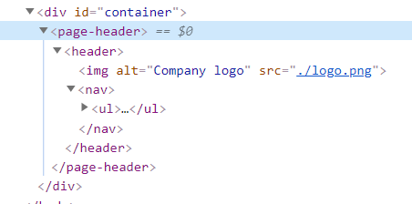

---
{
    title: "Web Components 101: Vanilla JS",
    description: "One of the ways web components differs from a framework is that it works right in the browser. Here's how to build them from scratch.",
    published: '2021-07-15T22:12:03.284Z',
    authors: ['crutchcorn'],
    tags: ['javascript', 'html', 'webdev'],
    attached: [],
    license: 'coderpad',
    originalLink: 'https://coderpad.io/blog/intro-to-web-components-vanilla-js/',
    series: "Web Components 101",
    order: 2
}
---

Many modern web apps today are built using components. While frameworks like React exist to add an implementation, web components seek to make those practices standardized and part of your browser.

In this article, we’ll touch on what web components are, how we can build them without a framework, and some limitations to keep in mind during development. Later, in a follow-up article, we’ll show how a lightweight framework (such as Lit) can provide quality-of-life improvements for those looking to build larger scale applications.

## What are Web Components?

There are a lot of misconceptions about what web components even are. While some might assume that it’s simply the ability to make custom elements with dedicated UI, style, and logic in one consolidated place (more on that later), there’s definitely more to it

Web components are a mix of 3 different web standards that, when utilized together, can offer a viable alternative to using a framework like React which offers similar functionality. These web standards consist of:

1. [Custom elements](https://developer.mozilla.org/en-US/docs/Web/Web_Components/Using_custom_elements) - the ability to create new elements that will provide unique UI and app logic when the related HTML tag is added
2. [Shadow DOM](https://developer.mozilla.org/en-US/docs/Web/Web_Components/Using_shadow_DOM) - the ability to keep specific elements segmented off from your main document DOM, allowing you to avoid document collision issues
3. [HTML templates](https://developer.mozilla.org/en-US/docs/Web/Web_Components/Using_templates_and_slots) - elements that allow you to write HTML that is not drawn to the page, but can be used as a template for markup to reuse elsewhere

While the Shadow DOM and HTML templates are undoubtedly useful in applications, we’ll be focusing on custom elements today, as we feel they’re the easiest place to start in introducing web components as a whole.

> While these are the only official specifications part of Web Components, they’re often utilized with other JavaScript and browser features to create a cohesive development experience.
>
> One of these features often used is [JavaScript Modules](https://v8.dev/features/modules). While the concept of breaking your app into multiple files has been commonplace with bundlers like Webpack for a while, being built into the browser has been game changing.

## What are Custom Elements?

At their core, custom elements essentially allow you to create new HTML tags. These tags are then used to implement custom UI and logic that can be used throughout your application.

```
<!-- page.html -->

<!-- These are custom elements, combined to make a page -->
<page-header></page-header>
<page-contents></page-contents>
<page-footer></page-footer>
```

These components can be as simple as a styled button or as complex as an entire page of your application, complete with your business logic.

While we tend to think of HTML tags as directly mapping to a single DOM element, that’s not always the case with custom elements. For example, the “page-header” tag in the example above might contain “nav” and “a” elements as a list of their children.



Because of this, we’re able to improve an app’s organization by reducing the amount of tags visible in a single file to read with better flow.

But custom elements aren’t just made up of HTML - you’re able to associate JavaScript logic with these tags as well! This enables you to keep your logic alongside it’s associated UI. Say your header is a dropdown that’s powered by JavaScript. Now you can keep that JavaScript inside of your “page-header” component, keeping your logic consolidated.

Finally, a significant improvement that components provide is composability. You’re able to use these components on different pages, allowing you to keep your header code in sync between pages. This reduces the potential for having variations in standard components - like having multiple differently sized buttons in a page - that might confuse your users. As long as you’re vigilant about utilizing your existing components, you’re able to make your app more consistent this way.

## Lifecycle Methods

While many implementations of components have differences, one concept that is fairly universal is “lifecycle methods”. At their core, lifecycle methods enable you to run code when events occur on an element. Even frameworks like React, which haved moved away from classes, still have similar concepts of doing actions when a component is changed in some way.

Let’s take a look at some of the lifecycle methods that are baked into the browser’s implementation.

Custom elements have 4 lifecycle methods that can be attached to a component.

| connectedCallback        | Ran when attached to the DOM                                                     |
| ------------------------ | -------------------------------------------------------------------------------- |
| disconnectedCallback     | Ran when unattached to the DOM                                                   |
| attributeChangedCallback | Ran when one of the web component’s attributes is changed. Must explicitly track |
| adoptedCallback          | Ran when moved from one HTML document to another                                 |

> While each of them has their uses, we’ll primarily be focusing on the first 3. `adoptedCallback` is primarily useful in niche circumstances and is therefore difficult to make a straightforward demo of.

Now that we know what the lifecycle methods are, let’s see an example of them in action.

### Connection Lifecycles

The first two lifecycle methods we’ll be talking about are typically used as a pair together: `connectedCallback` and `disconnectedCallback`

`connectedCallback` is ran when a component is mounted onto the DOM. This means that when you want the element to be shown, you can change your `innerHTML`, add event listeners to elements, or do any other kind of code logic meant to setup your component.

Meanwhile, `disconnectedCallback` is run when the element is being removed from the DOM. This is often used to remove event listeners added during the `connectedCallback`, or do other forms of cleanup required for the element.

Here’s a simple web component that renders a header with the text “Hello world”.

```javascript
class MyComponent extends HTMLElement {
  connectedCallback() {
      console.log("I am connecting");
      this.innerHTML = `<h1>Hello world</h1>`;
  }

  disconnectedCallback() {
      console.log("I am leaving");
  }
}

customElements.define('my-component', MyComponent);
```

### Attribute Changed

While there are other methods to pass data to an element (which we’ll touch on shortly), the undeniable simplicity of attributes is hard to deny. They’re widely utilized in HTML-spec tags, and most display custom elements should be able to utilize attributes to pass data from a parent trivially.

While `attributeChangedCallback` is the lifecycle method used to detect when an attribute’s value is changed, you must tell the component which attributes to track.

For example, in this example we’re tracking the `message` attribute. If the `message` attribute value changes, it will run `this.render()`. However, any other attribute’s value changing will not trigger `attributeChangedCallback` because nothing else is marked to be tracked.

```javascript
class MyComponent extends HTMLElement {
  connectedCallback() {
      this.render();
  }

   // Could also be:
  // static observedAttributes = ['message'];
  static get observedAttributes() {
      return ['message'];
  }

  attributeChangedCallback(name, oldValue, newValue) {
      this.render();
  }

  render() {
      const message = this.attributes.message.value || 'Hello world';
      this.innerHTML = `<h1>${message}</h1>`;
  }
}

customElements.define('my-component', MyComponent);
```

You’ll notice that the “`attributeChangedCallback`” receives the name of the attribute changed, it’s previous value, and it’s current value. This is useful for granular manual change detection optimizations.

However, utilizing attributes to pass values to a component has its limitations. To explain these limitations, we must first start by talking about serializability.

## Serializability

Serialization is the process of turning a data structure or object into a format that can be stored and reconstructed later. A simple example of serialization is using JSON to encode data.

```javascript
SON.stringify([
    {hello: 1},
    {other: 2}
])

// "[{\"hello\": 1}, {\"other\":2}]"
```

Because this JavaScript object is simple and only utilizes [primitive data types](https://developer.mozilla.org/en-US/docs/Glossary/Primitive), it’s relatively trivial to turn into a string. This string can then be saved to a file, sent over HTTP to a server (and back), and be reconstructed when the data is needed again.

> This simplicity of serialization to JSON is one reason why JSON is such a popular format for transferring data over REST endpoints.

### Serializing Limitations

While simple objects and arrays can be serialized relatively trivially, there are limitations. For example, take the following code:

```javascript
const obj = {
    method() {
        console.log(window);
    }
}
```

While this code’s behavior may seem simple to us reading it as developers, think about it from a machine’s perspective.

If we wanted to send this object to a server from a client remotely with the method intact, how should we do that?

`window`, while available in the browser, is not available in NodeJS, which the server may likely be written in. Should we attempt to serialize the `window` object and pass it along with the method? What about methods on the `window` object? Should we do the same with those methods?

On the other end of the scale, while `console.log` \***is\*** implemented in both NodeJS and browsers alike, it’s implemented using native code in both runtimes. How would we even begin to serialize native methods, even if we wanted to? _Maybe_ we could pass machine code? Even ignoring the security concerns, how would we handle the differences in machine code between a user’s ARM device and a server’s x86\_64 architecture?

All of this becomes a problem before you even consider that your server may well not be running NodeJS. How would you even begin to represent the concept of `this` in a language like Java? How would you handle the differences between a dynamically typed language like JavaScript and C++?

#### Let’s Stringify Some Functions

Now knowing the problems with serializing functions, you may wonder what happens if you run `JSON.stringify()` on `obj`?

```javascript
const obj = {
    method() {
        console.log(this, window);
    }
}

JSON.stringify(obj); // "{}"
```

It simply omits the key from the JSON string. This is important to keep in mind as we go forward.

### HTML Attribute Strings

Why are we talking about serialization in this article? To answer that, I want to mention two truths about HTML elements.

- HTML attributes are case insensitive
- HTML attributes must be strings

The first of these truths is simply that for any attribute, you can change the key casing and it will respond the same. According to HTML spec, there is no difference between:

```html
<input type="checkbox"/>
```

And:

```html
<input tYpE="checkbox"/>
```

The second truth is much more relevant to us in this discussion. While it might seem like you can assign non-string values to an attribute, they’re always parsed as strings under-the-hood.

You might think about being tricky and using JavaScript to assign non-string values to an attribute:

```javascript
const el = document.querySelector('input');
el.setAttribute('data-arr', [1, 2, 3, 4]);
```

However, the attribute’s assigned value may not match your expectations:

```html
<input type="checkbox" data-arr="1,2,3,4">
```

You’ll notice the lack of brackets in the attribute. This is because JavaScript is implicitly running `toString` on your array, which turns it into a string before assigning it to the attribute.

No matter how you spin it - your attribute will be a string.

This is also why when trying to use attributes for non-string values you may run into otherwise unexpected behavior. This is true even for built-in elements, such as `input`.

```html
<input type="checkbox" checked="false"/>
```

Without being aware of this HTML attribute limitation, you may well expect the checkbox to be unchecked. However, when rendered, it appears checked.

This is because you’re not passing the boolean `false`, you’re passing the string `"false"`, which is (confusingly) truthy.

```javascript
console.log(Boolean("false")); // true
```

Some attributes are smart enough to know when you’re intending to assign a number or other primitive value to an element via an attribute, but the implementation internally might look something like:

```javascript
class NumValidator extends HTMLElement {
  connectedCallback() {
      this.render();
  }

  static get observedAttributes() {
      return ['max'];
  }

  attributeChangedCallback(name, oldValue, newValue) {
      this.render();
  }

  render() {
      // Coerce "attribute.value" to a number. Again, attributes
      // can only be passed as a string
      const max = Number(this.attributes.max.value || Infinity);
      // ...
  }
}
```

While this tends to be the extent of HTML element’s deserializing of attributes, we can extend this functionality much further.

## Pass Array of Strings

As we touched on shortly, if we simply try to pass an array to an attribute using JavaScript’s `setAttribute`, it will not include the brackets. This is due to `Array.toString()`’s output.

If we attempted to pass the array `["test", "another", "hello"]` from JS to an attribute, the output would look like this:

```javascript
<script>
  class MyComponent extends HTMLElement {
      connectedCallback() {
          this.render();
      }

      static get observedAttributes() {
          return ['todos'];
      }

      attributeChangedCallback(name, oldValue, newValue) {
          this.render();
      }

      render() {
          const todos = this.attributes.todos.value || '';
          this.innerHTML = `<p>${todos}</p>`;
      }
  }

  customElements.define('my-component', MyComponent);
</script>

<my-component id="mycomp" todos="test,another,hello"></my-component>
```

Because of the output of `toString`, it’s difficult to convert the attribute value back into a string. As such, we only display the data inside of a `<p>` tag. But lists don’t belong in a single paragraph tag! They belong in a `ul` with individual `li`s per item in the list. After all, [semantic HTML is integral for an accessible website](https://coderpad.io/blog/introduction-to-web-accessibility-a11y/)!

Lets instead use `JSON.stringify` to serialize this data, pass that string to the attribute value, then deserialize that in the element using `JSON.parse`.

```html
<script>
  class MyComponent extends HTMLElement {
      connectedCallback() {
          this.render();
      }

      static get observedAttributes() {
          return ['todos'];
      }

      attributeChangedCallback(name, oldValue, newValue) {
          this.render();
      }

      render() {
          const todosArr = JSON.parse(this.attributes.todos.value || '[]');
          console.log(todosArr);
          const todoEls = todosArr.map(todo => `<li>${todo}</li>`).join('\n');
          this.innerHTML = `<ul>${todoEls}</ul>`;
      }
  }

  customElements.define('my-component', MyComponent);
</script>

<my-component todos="[&quot;hello&quot;,&quot;this&quot;]">
</my-component>
```

Using this method, we’re able to get an array in our `render` method. From there, we simply `map` over that array to create `li` elements, then pass that to our `innerHTML`.

## Pass Array of Objects

While an array of strings is a straightforward demonstration of serializing attributes, it’s hardly representative of real-world data structures.

Let’s start working towards making our data more realistic. A good start might be to turn our array of strings into an array of objects. After all, we want to be able to mark items “completed” in a todo app.

For now, we’ll keep it small, and we’ll grow it later. Let’s keep track of the “name” of the todo item, and whether or not it’s been completed:

```javascript
const data = [{name: "hello", completed: false}];
```

Let’s take a look at how we can display this in a reasonable manner using our custom element:

```html
<script>
  class MyComponent extends HTMLElement {
      connectedCallback() {
          this.render();
      }

      static get observedAttributes() {
          return ['todos'];
      }

      attributeChangedCallback(name, oldValue, newValue) {
          this.render();
      }

      render() {
          const todosArr = JSON.parse(this.attributes.todos.value || '[]');
          const todoEls = todosArr
              .map(todo => `
              <li>                 
                <!-- checked=”false” doesn’t do what you might think -->
                <input type="checkbox" ${todo.completed ? 'checked' : ''}/>
                ${todo.name}
              </li>
          `)
              .join('\n');
          this.innerHTML = `<ul>${todoEls}</ul>`;
      }
  }

  customElements.define('my-component', MyComponent);
</script>

<my-component
  id="mycomp"
  todos="[{&quot;name&quot;:&quot;hello&quot;,&quot;completed&quot;:false}]">
</my-component>
```

> Remember, checked=”false” will leave a checkbox checked. This is because “false” is a truthy string. Reference our “serializing limitations” sections for more reading.

Now that we’re displaying these checkboxes, let’s add a way to toggle them!

```javascript
var todoList = [];

function toggleAll() {
  todoList = todoList.map(todo => ({...todo, completed: !todo.completed}));
  changeElement();
}

function changeElement() {
  const compEl = document.querySelector('#mycomp');
  compEl.attributes.todos.value = JSON.stringify(todoList);     
}
```

Now, all we need to do is run the function “toggleAll” on a button press and it will update the checkboxes in our custom element.

Now that we have a way to toggle all checkboxes, let’s look at how we can toggle individual todo items.

## Pass Objects with Functions

While there are many ways to have user input in a custom element interact with a parent’s data set, let’s store a method in each todo object and pass it into the custom element.

This pattern follows best practices for components by keeping the data passing unidirectional. In the past, we’ve touched on how to [keep your components unidirectional](https://coderpad.io/blog/master-react-unidirectional-data-flow/) for React and Web Components alike.

Let’s change a todo object to reflect something similar:

```javascript
todoList.push({
  name: inputEl.value,
  completed: false,
  id: todoId,
  onChange: () => {
    toggleTodoItem(todoId)
  }
});
```

Then, we’ll simply implement our `toggleTodoItem` method using the ID to modify the related todo object:

```javascript
function toggleTodoItem(todoId) {
  thisTodo = todoList.find(todo => todo.id == todoId);
  thisTodo.completed = !thisTodo.completed;
  changeElement();
}

function changeElement() {
  const compEl = document.querySelector('#mycomp');
  compEl.attributes.todos.value = JSON.stringify(todoList);
}
```

With these changes, we have all of the logic we need from our parent to handle the checkbox logic. Now we need to update our custom element to trigger the `onChange` method when the checkbox is checked. In order to bind an event listener the “input” element, we need to access the underlying [HTMLElement](https://developer.mozilla.org/en-US/docs/Web/API/HTMLElement) reference. To do this, we’ll need to migrate away from the `innerHTML` logic we were using previously in favor of `document.createElement`.

```javascript
render() {
  this.clear();

  // Create list element
  const todosArr = JSON.parse(this.attributes.todos.value || '[]');
  const todoEls = todosArr
      .map(todo => {
          // Use `createElement` to get access to the element. We can then add event listeners
          const checkboxEl = document.createElement('input');
          checkboxEl.type = "checkbox";

          // This doesn't work, we'll explain why shortly
          checkboxEl.addEventListener('change', todo.onChange);

          checkboxEl.checked = todo.completed;

          const liEl = document.createElement('li');
          liEl.append(checkboxEl);
          liEl.append(todo.name);
          return liEl;
      });

  const ulEl = document.createElement('ul');
  for (const liEl of todoEls) {
      ulEl.append(liEl);
  }

  // Add header. This should update to tell us how many items are completed
  const header = document.createElement('h1');
  header.innerText = todosArr.filter(todo => todo.completed).length;

  // Reconstruct logic
  this.append(header);
  this.append(ulEl);
}
```

Awesome! Now we’ve made all of the changes required, let’s see if it all works together!

[
](https://app.coderpad.io/sandbox?question_id=181066)Oh… Weird… While our checkboxes seem to be updating, our `h1` is not. What’s more, if we look in our developer console, we don’t see the `console.log`s we would expect to see during a re-render.

Why is that?

Well, as we mentioned in our section about serialization limitations, functions are not serializable. Because of this, when an object with methods are passed to `JSON.parse`, those keys are removed. When we’re adding our event listener, the function is `undefined`, and therefore doesn’t do anything.

```javascript
checkboxEl.addEventListener('change', todo.onChange); // onChange is undefined
```

The checkbox’s state visually updating without being reflected in our data is an example of a misalignment between the DOM and the data we used to build the DOM.

However, we can verify that our code is correct outside of serialization issues. If we change that line of code to utilize the global function `toggleTodoItem` directly, it functions as expected:

```javascript
checkboxEl.addEventListener('change', () => toggleTodoItem(todo.id))
```

> Update this line of code in the sandbox above to see the correct behavior!

While this works for our current setup, one of the advantages of building custom elements is the ability to split out your application to multiple files in order to keep your app’s codebase organized. As soon as `toggleTodoItem` is no longer in the same scope as the custom element, this code will break.

If this isn’t a good long-term solution, what can we do to fix our issue with serialization?

## Pass via Props, not Attributes

Attributes provide a simple method of passing primitive data to your custom elements. However, as we’ve demonstrated, it falls flat in more complex usage due to the requirement to serialize your data.

Knowing that we’re unable to bypass this limitation using attributes, let’s instead take advantage of JavaScript classes to pass data more directly.

Because our components are classes that extend `HTMLElement`, we’re able to access our properties and methods from our custom element’s parent. Let’s say we want to update `todos` and render once the property is changed.

To do this, we’ll simply add a method to our component’s class called “`setTodos`”. This method will then be accessible when we query for our element using `document.querySelector`.

```javascript
class MyComponent extends HTMLElement {
  todos = [];

  connectedCallback() {
      this.render();
  }

  setTodos(todos) {
      this.todos = todos;
      this.clear();
      this.render();
  }

  render() {
      // ...
  }
}

// ...

function changeElement() {
  const compEl = document.querySelector('#mycomp');
  compEl.setTodos(todoList);
}
```

Now, if we toggle items in our todo list, our `h1` tag updates as we would expect: we’ve solved the mismatch between our DOM and our data layer!

Because we’re updating the _properties_ of our custom elements, we call this “passing via properties”, which solves the serialization issues of “passing via attributes”.

But that’s not all! Properties have a hidden advantage over attributes for data passing as well: memory size.

When we were serializing our todos into attributes, we were duplicating our data. Not only were we keeping the todo list in-memory within our JavaScript, but the browser keeps loaded DOM elements in memory as well. This means that for every todo we added, not only were we keeping a copy in JavaScript, but in the DOM as well (via attribute string).

But surely, that’s the only way memory is improved when migrating to properties, right? Wrong!

Because keep in mind, on top of being loaded in-memory in JS in our main `script` tag, and in the browser via the DOM, we were also deserializing it in our custom element as well! This meant that we were keeping a _third_ copy of our data initialized in-memory simultaneously!

While these performance considerations might not matter in a demo application, they would add significant complications in production-scale apps.

## Conclusion

We’ve covered a lot today! We’ve introduced some of the core concepts at play with web components, how we’re able to best implement various functionality, and the limitations of the DOM.

While we spoke a lot about passing data by attributes vs. properties today, there are pros and cons to both. Ideally, we would want the best of both worlds: the ability to pass data via property in order to avoid serialization, but keep the simplicity of attributes by reflecting their value alongside the related DOM element.

Something else we’ve lost since the start of this article is code readability in element creation. Originally, when we were using `innerHTML`, we were able to see a visual representation of the output DOM. When we needed to add event listeners, however, we were required to switch to `document.createElement`. Preferably, we could attach event listeners without sacrificing the in-code HTML representation of our custom element’s rendered output.

While these features may not be baked into the web component specifications themselves, there are other options available. In our next article, we’ll take a look at a lightweight framework we can utilize to build better web components that can integrate with many other frontend stacks!
