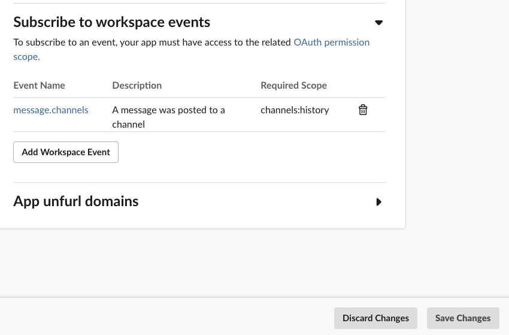
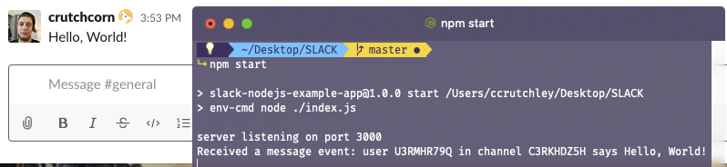

---
{
	title: "Making a Slack Bot using NodeJS and MongoDB",
	description: 'Have you ever wanted to run native Java and Kotlin code from your mobile game written in Unity? Well you can! This article outlines how to set that up!',
	published: '2020-02-04T05:12:03.284Z',
	authors: ['crutchcorn'],
	tags: ['mongodb', 'node', 'slack'],
	attached: [],
	license: 'cc-by-nc-sa-4'
}
---

Modern-day remote live communication has never been as efficient or fast as it is today. You're able to use services like Slack to join huge multi-channel communication workspaces for pleasure or buisness. These channels are often able to be super-powered by in-chat bots and applications that can inform you of new information from external services or even add new functionality to the chat. Luckily for us, Slack has put a lot of effort into making these extensions to Slack easy to write.

One way they've eased the effort of their creation is by providing an SDK for Node developers to take and create extensions with. This post will outline how we can create a Slack bot to add functionality to chats.

# Initial Signup {#signup-for-dev-account}

To start, we'll need to [signup for a developer account and create an app to host our applicaiton logic using this link](https://api.slack.com/apps). This will allow us to create new Slack apps and bots to add into our workspace.


Enter in an app name, and assign the workspace you want the app to live during development. Once done, you should be greeted by a dashboard for your Slack app. You'll want to keep this screen open during development, as we'll be refering to it throughout this post. 


This screen (and the tabs off to the side) are able to configure all of the interactions with Slack that we'll build upon with our code. We're even able to customize the look of our application in our Slack settings at the bottom of this homepage.


As mentioned previously, Slack provides an SDK for Node applications. [You can find the homepage for the npm package at the following URL.](https://github.com/slackapi/node-slack-sdk)

In order to quickly set up the SDK, we'll create a new directory for our code to live. Once we have a clear directory, we can run:

```
npm init -y
```

To setup an initial `package.json`. Once we have a `package.json`, we can add the packages we require to use the Slack SDK:

```
npm install @slack/web-api @slack/events-api
```

After this, we'll then be able to use their example API from the README of their project as a baseline to our app:

```javascript
// index.js
// Initialize using signing secret from environment variables
const { createEventAdapter } = require('@slack/events-api');
// Slack requires a secret key to run your bot code. We'll find and figure out this signing secret thing in the next steps
const slackEvents = createEventAdapter(process.env.SLACK_SIGNING_SECRET);
const port = process.env.PORT || 3000;

// Attach listeners to events by Slack Event "type". See: https://api.slack.com/events/message.im
slackEvents.on('message', (event) => {
  console.log(`Received a message event: user ${event.user} in channel ${event.channel} says ${event.text}`);
});

// Handle errors (see `errorCodes` export)
slackEvents.on('error', console.error);

// Start a basic HTTP server
slackEvents.start(port).then(() => {
  // Listening on path '/slack/events' by default
  console.log(`server listening on port ${port}`);
});
```

This code is what we'll need to run a `console.log` every time a user sends a message. However, _we'll need to setup more to get this code actually running due to Slack's permissions systems_ and such. For now, we'll save this code to `index.js` in the same folder we saved our `package.json` file.

Another thing that was mentioned in the code sample was the `process.env.SLACK_SIGNING_SECRET`. This is the key that Slack will use to connect your code to your workspace. We'll want to keep in mind how to store the signing secret (as the name implies, _we want to keep this key a secret as otherwise anyone can highjack your Slack app_). As the above code hints at, it's suggested to use an environmental file or configuration.

While environmental variables are typically assigned by system configurations, to make development easier, we'll setup a `.env` file with the expected credentials. Then, to inject the `.env` file contents into our `process`, we'll run our code using [the `env-cmd` package](https://www.npmjs.com/package/env-cmd). We'll start by installing the package:

```
npm i env-cmd
```

This package will look for a `.env` file and inject it into your command that follows `env-cmd`. So, for example, you can **make a new file called `.env` and place the following contents in it**:

```
SLACK_SIGNING_SECRET=<SIGNING_SECRET_FROM_HOMESCREEN>
```

Then, in your `package.json`, you can **edit your `start` command** to reflect the following:

```
{
  "scripts": {
    "start": "env-cmd node ./index.js"
  }
}
```

Now, whenever your code shows `process.env.SLACK_SIGNING_SECRET`, it'll represent the value present in your `.env` file

# Development Hosting {#development-environment-setup}

In order to have these events called, we'll need to get a public URL to route to our local development server. In order to do this, we can [use `ngrok`](https://github.com/inconshreveable/ngrok) to host a public URL in our local environment:

```
npm i -D ngrok
npx ngrok http 3000
```

> Keep in mind that this should NOT be used to host your Slack application when you're ready to publish.
> This should only be used during development process. In order to see how to deploy, you'll want to checkout [the section on doing so using Heroku](#deployment)

After doing so, you should be given an `ngrok.io` subdomain to map to your local IP address with a message like the following:

```
Forwarding https://9fca9f3e.ngrok.io -> http://localhost:3000
```


We're now able to use this URL as a map to the external world to the local environment we're in. This is how we'll tell Slack to run our `index.js` file when we recieve a new event.

However, there's yet another step to enable the functionality. Slack, in order to ensure a more strict security, wants to ensure that you own this domain. As such, they have _a utility you'll need to run to ensure that you own this domain_. So, for example, in order to add in the events subscription to our current code, we'll run the following commmand:

```
./node_modules/.bin/slack-verify --secret <signing_secret>
```

Where the `<signing_secret>` is the same signing secret from the `.env` file.


With this command still running, you can **press on the "Add features and functionality" tab** in the homescreen you saw when you first created your Slack app in the browser. Once the "features and functionality" is open, **press "Event Subscriptions"**.

This will bring you to a page with an "On/Off" toggle. **Toggle it to "On"** and **add the `ngrok` domain** in the request URL.


This should show "Verified" to explain that your domain is verified to have belonged to you, but the domain isn't saved yet; We first need to **add workspace events to subscribe to**. This is to ensure that any app doesn't simply have root permissions to everything for privacy and security's sake and instead has to ask for grainular permissions.


Let's say we want to handle all of the public messages to a channel, we can add `message.channels` to get the permissions to do so.



If you look through the code that we now have in the `index.js` file, you'll see that we're listening for `messages`:

```javascript
slackEvents.on('message', (event) => {
  console.log(`Received a message event: user ${event.user} in channel ${event.channel} says ${event.text}`);
});
```

I can hear you asking "But here we're requesting `message.channels`, how do we know that those two match each other?"

You can actually check the event `type` from [the API reference documentation](https://api.slack.com/events/message.channels) to see that the `type`s match up.

# Development App Installation {#development-installation}

You'll notice, as I first did, that if you start your server with `npm start` and then send a message to a public channel that you'll notice something in your terminal. Or, well, rather, a lack of something in your terminal. The `console.log` that you expect to've ran isn't doing so - why is that?

That's because the app isn't actually enabled in your workspace yet (A real 🤦‍♂️ for me when I discovered this one)

To do so, check the sidebar to the right of your Slack API homepage for the `install` section


Simply click `Install App to Workspace`, then `Allow` to give permissions to add the app to your workspace.

> Keep in mind, folks can use Slack for personal communication. You may want to give folks in your workspace a heads-up or simply create a new Slack workspace for testing

Once this is done, you can send a test message to a public channel and see it printed out in your console!




# App Interactivity {#interactive-message-package}

While listening to events alone can be very useful in some circumstances, oftentimes having a way to interact with you application can be very helpful. As a result, the Slack SDK also includes the `@slack/interactive-messages` package to help you provide interactions with the user more directly. Using this package, you can respond to the user's input. For example, let's say we wanted to reproduce the [PlusPlus](https://go.pluspl.us/) Slackbot as a way to track a user's score. 

We want to have the following functionality for an MVP:

- `@UserOrThing++`: A way to add a point to a user or thing
- `@UserOrThing--`: A way to remove a point from a user or thing
- `@PointsRUs leaderboard`: A flat list of the items/people with points

Each of these messages will prompt the bot to respond with a message in the same channel. Ideally we'd use a database to store score for long-term projects, but for the interim, let's use in-memory storage


## Setup

First and foremost, something you'll need to do is add a new OAuth permission to enable the functionality for the bot to write to the channel


After enabling the new Oauth permission, you'll need to reinstall your app. This is because you're changing the permissions of your apps and you need to accept the new permissions when you reinstall the app. If you scroll to the top of the same Oauth page, you should see a `Reinstall App` button that will help you do this easily

Once this is done, you can access the oauth token for the installation of your workspace. This token will enable us to send messages to the workspace itself. This token is unique per-workspace, so if you're intending for a broader release of your bot (to be easily added with a single button click), you'll likely need to walk through their oauth token request system. Since this is meant as an introductory look, we'll just copy this token and store it into our `.ENV` file,


You'll want to place this into your `.ENV` file. I named the environmental variable `OAUTH_TOKEN`, so when you see that in code examples, know that this is in reference to this value

## The Code

To start, we need to install the package that'll allow us to use the web API:

```
npm i @slack/web-api
```

The web API should enable us to use the [`postMessage`](https://api.slack.com/methods/chat.postMessage) method to send messages to a channel when they send a message

Once this is installed, we're able to instanciate the web API with the oauth token we grabbed earlier

```javascript
const { WebClient } = require('@slack/web-api');
const token = process.env.OAUTH_TOKEN;
const web = new WebClient(token);
```

After this is setup, we could run code like:

```javascript
web.chat.postMessage({
  text: 'A post message',
  channel: channelId,
});
```

To send a message. Let's try to use this API to add some trivial logic into our existing `events` listening functionality.

```javascript
const { createEventAdapter } = require('@slack/events-api');
const { WebClient } = require('@slack/web-api');

const token = process.env.OAUTH_TOKEN;
const slackSigningSecret = process.env.SLACK_SIGNING_SECRET;

const slackEvents = createEventAdapter(slackSigningSecret);
const web = new WebClient(token);
const port = process.env.PORT || 3000;

slackEvents.on('message', async event => {
	console.log(`Received a message event: user ${event.user} in channel ${event.channel} says ${event.text}`);

  // Check if the text includes the text we'd want to use to check the leaderboard
	if (/@pointsrus leaderboard/i.exec(event.text)) {
		const result = await web.chat.postMessage({
      // We'll add more functionality in the future. We just want to test it works, first
			text: 'This should output a leaderboard',
			channel: event.channel,
		});

		console.log(`Successfully send message ${result.ts} in conversation ${event.channel}`);
	}
});

slackEvents.on('error', console.error);

slackEvents.start(port).then(() => {
	console.log(`server listening on port ${port}`);
});
```

The above code should 

## Adding State {#interactive-local-state}


# Adding a Database {#mongodb}

# Deployment {#deployment}

We'll then want to deploy


https://blog.heroku.com/how-to-deploy-your-slack-bots-to-heroku
