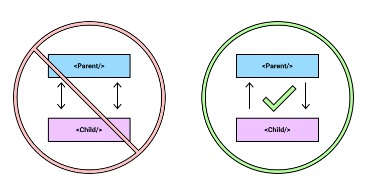

---
{
    title: "Master React Unidirectional Data Flow",
    description: "Making sure your app's code is structured well is critical. Mastering React Unidirectionality is a huge part of that. Learn how to here.",
    published: '2021-04-27T22:12:03.284Z',
    authors: ['crutchcorn'],
    tags: ['react', 'javascript'],
    attached: [],
    license: 'coderpad',
    originalLink: 'https://coderpad.io/blog/master-react-unidirectional-data-flow/'
}
---

As with any form of programming, there are dozens of ways to manage data inside a React application. That said, not all methods are equally capable of scaling. There are some "suggested patterns" for your React applications to follow that will ensure you're not forced to pause in order to reorganize or re-evaluate your existing code when you’re building the application.

Today, we'll be covering one of the most important structural best practices to follow when building your React applications: Unidirectional data flow.

# What is Unidirectional Data Flow?

Unidirectional data flow is the idea that components should only raise data in one direction. Child components should only call functions from parent components, while parent components should only set/pass data to their children.



In order to explain how both of these look in real code, let's start with how a properly unidirectional parent and child component would be written.

# Unidirectional Demo

A great example of a set of components we'll use to demonstrate unidirectionality is a parent "App" component and a child "Form" component.

Let's take a look at a code sample that follows this unidirectionality first:

<iframe src="https://app.coderpad.io/sandbox?question_id=176771" loading="lazy"></iframe>

As you can see we're passing the `onChange` and value props to `SimpleForm`. This keeps our state consolidated inside of the `App` component rather than split between `App` and `SimpleForm`. Once you "submit" the form, `SimpleForm` calls `onDone` which changes the state stored inside of `App`. This in turn causes a re-render of `SimpleForm`.

While `SimpleForm` is displaying the data to the user, the logic itself stays within `App`. `SimpleForm` contains no state or application logic; we call components like these "dumb" components. "Dumb" components are utilized for styling and composability, but not for app logic or state.

This is what a set of proper React components _should_ look like. This pattern of raising state out of the component itself and leaving "dumb" component comes from the guidance of the React team itself. This pattern is called[ "lifting state up"](https://reactjs.org/docs/lifting-state-up.html).

Now that we have a better understanding of the patterns to follow let's take a look at the wrong way to do things.

# Breaking from Suggested Patterns

Now that we've "lifted" the state, let's drop back down into `SimpleForm`. We'll start by changing `SimpleForm` to a class component and adding state.

```jsx
class SimpleForm extends React.Component {
// State is now a part of the SimpleForm component
  state = {
    input: ""
  }

  onChange(e) {
    this.setState({
      input: e.target.value
    })
  }

  render() {
    return (
      <div>
        <label>
          <div>Username</div>
          <input onChange={this.onChange.bind(this)} value={this.state.input}/>
        </label>
        <button onClick={this.props.onDone}>Submit</button>
      </div>
    )
  }
}
```

Now, we can use ref in `App` to access the class methods and state.

```jsx
export default function App() {
  const simpleRef = React.useRef()
  const [displayTxt, setDisplayTxt] = React.useState("")

  const onDone = () => {
    // Reach into the Ref to access the state of the component instance
    setDisplayTxt(simpleRef.current.state.input)
  }

  return (
    <div>
      <SimpleForm
        onDone={onDone}
        ref={simpleRef}
      />
      <p>{displayTxt}</p>
    </div>
  )
}
```

<iframe src="https://app.coderpad.io/sandbox?question_id=176773" loading="lazy"></iframe>

This code works, but has some inherent complexity issues. When you start expanding this component, this idea of separating your state and having to inspect the child reference from the parent makes development more difficult. Let's take a look visually how following the application logic is now more difficult with this pattern.

# Visualizing the Problem

First, let's start by taking a look at the `simpleRef` component, where the state is "lowered down" to the `SimpleForm` component:


In this example, the flow of the application state is as follows:

- `App` (and its children, `SimpleForm`) render
- The user makes changes to the data stored in `SimpleForm`
- The user triggers the `onDone` action, which triggers a function in `App`
- The `App` `onDone` method inspects the data from `SimpleForm`
- Once the data is returned to `App`, it changes its own data, thus triggering a re-render of `App` and `SimpleForm` both

As you can see from the chart above and the outline of the data flow, one action goes back and forth between the parent and child as `App` attempts to access the data stored in `SimpleForm`. This is a prime example of a bi-directional component action. This code sample gets even more complex when onDone is expected to change the state in SimpleForm.

Now, let's contrast that to the mental model needed to work with unidirectionality enforced.


- App (and its children, `SimpleForm`) render
- The user makes changes in `SimpleForm`, the state is raised up to `App` through callbacks
- The user triggers the `onDone` action, which triggers a function in App
- The `App` `onDone` method already contains all of the data it needs in it's own component, so it simply re-renders `App` and `SimpleForm` without any additional logic overhead

As you can see, while the number of steps is similar between these methods (but may not be in a less trivial example), the unidirectional flow is much more streamlined and easier to follow.

This is why the React core team (and the community at large) strongly suggests you use unidirectionality as often as possible.

# Conclusion & Challenge

Understanding unidirectionality is integral to scaffolding scalable React applications. Unidirectionality doesn't just apply to React, either - Angular and Vue applications often require similar patterns for large scale codebases to be easier to follow and more performant.

Now that we have a deeper understanding of unidirectionality, here's a challenge for you: Refactor the following components to better reflect unidirectionality in this coding pad.

<iframe src="https://app.coderpad.io/sandbox?question_id=176774" loading="lazy"></iframe>

The functionality of the app should be consistent with the previous version. Stuck?

Start with:

- Move the `getNewActivity` into a `React.useEffect` in App
- Move the `state.activity` into a `React.useState` in App
- Pass all props to `DisplayActivities`, making it a "dumb" component

Still stuck? Maybe you're excited to share your solution?[ Send us a Tweet @CoderPad](https://twitter.com/CoderPad) or[ ask us in our community Slack](https://bit.ly/coderpad-slack). We'd be excited to hear from you!
