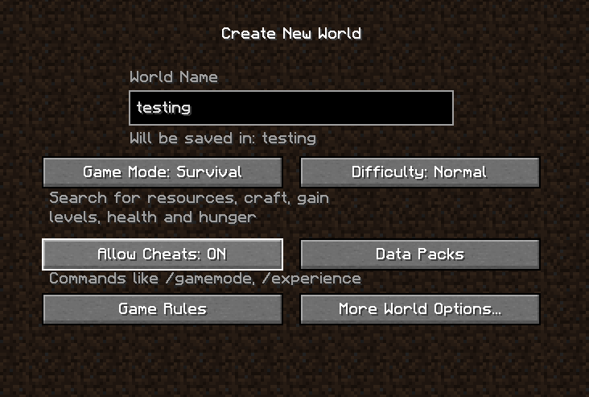

---
{
	title: "Minecraft Data Pack Programming: Introduction",
	description: "Learn the beginnings of data pack development in Minecraft - using commands and functions to add custom behavior from scratch!",
	published: '2022-06-14T21:12:03.284Z',
	authors: ['fennifith'],
	tags: [],
	attached: [],
	license: 'cc-by-nc-sa-4',
	series: "Minecraft Data Pack Programming",
	order: 1
}
---

> Please note: this guide specifically covers the **Java Edition** version of Minecraft. Bedrock Edition does not use data packs, but provides customization through [add-ons](https://minecraft.fandom.com/wiki/Add-on).

The data packs built in this series can be found in the [unicorn-utterances/mc-datapacks-tutorial](https://github.com/unicorn-utterances/mc-datapacks-tutorial/tree/main/1-introduction) repository. Feel free to use it for reference as you read through these articles!

# What is a data pack?

Minecraft's data pack system allows players to fundamentally modify existing behavior of the game by "replacing" or adding to its data files. Data packs typically use `.mcfunction` files to specify their functionality as a list of commands for the game to run, and `.json` files for writing advancements or loot tables.

One thing to note: While data packs are simple to use and enable a huge amount of functionality, they do have a couple drawbacks. One is that, while data packs allow most game features to be _changed_, they do not allow players to _add new features_ into the game (although some can convincingly create that illusion with a few tricks).

If you want to add new controls to the game, integrate with external services, or provide a complex user interface, a Minecraft modding framework such as [Fabric](https://fabricmc.net) or [Spigot](https://www.spigotmc.org/wiki/spigot/) might be better for you.

## Advantages of Minecraft mods

- ###### Can communicate with external services
  Mods can perform HTTP requests, talk to other applications, or use any library that is compatible with Minecraft's Java runtime.
- ###### Able to modify the user interface and settings menus
  Some data packs have used innovative (and highly complex) workarounds to this [using modified item textures](https://www.youtube.com/watch?v=z4tvTrqhBZE), but in general, Minecraft's controls and user interface cannot be fundamentally changed without the use of a mod.
- ###### Can add entirely new functionality to the game
  While data packs _can_ add things like custom mobs or items through a couple workarounds, there are always some limitations. Mods can add _any_ code to the game with no restrictions on their behavior.
- ###### More performant than data packs when running large operations
  This obviously depends on how well their functionality is written, but mods can provide much better performance with multithreading, asynchronous code, and generally faster access to the data they need. In comparison, data packs are limited by the performance of the commands available to them.

## Advantages of data packs

- ###### Easy to install on any Minecraft (Java Edition) version
  Data packs are widely supported in almost any Minecraft launcher, mod loader, and hosting provider. In comparison, mods will require players to set up a specific Minecraft installation (such as Fabric or Forge) before they can be used.
- ###### Generally simpler to test and write
  While some modding tools can provide fairly seamless testing & debugging, they all require programming knowledge in Java and/or Kotlin, and it can be tedious to set up a development environment for that if you don't have one already. Most data pack behavior can be written in any text editor and tested right in the text chat of your game!
- ###### Safer to make mistakes with
  Since data packs are restricted to interacting with the commands Minecraft provides, it typically isn't possible to do anything that will entirely break your game. Mods can run any arbitrary code on your system, however — which means there's a higher chance that things can go wrong.
- ###### Typically better update compatibility
  While some commands do change in new Minecraft updates, I have (anecdotally) found the changes to be less impactful than the work required to bring mods up to date with new versions. Since mods often use [mixins](https://github.com/SpongePowered/Mixin/wiki) and directly interact with Minecraft's internal code, they can be affected by under-the-hood changes that wouldn't make any difference to a data pack.

## Summary

I usually prefer to write data packs for most things I work on, as I find them to be more useful to a wider audience because of their easier installation process. Some players simply don't want the trouble of setting up another installation folder or using a different Minecraft loader to play with a specific mod, and data packs can work with almost any combination of other mods and server technology.

With that said, data packs can certainly be tedious to write at times — while they are easier to build for simple functionality that can be directly invoked through commands, more complex behavior might be better off as a mod if those advantages are more appealing. Nothing is without its drawbacks, and any choice here is a valid one.

# Writing our first Minecraft function

Data packs make frequent use of `.mcfunction` files, which are text files that contain a list of commands for Minecraft to run. But how do we know which commands to write? We can actually test them in Minecraft first!

Let's try making a new Minecraft world; I'll name mine "testing" so I can find it easily. Make sure that the "Allow Cheats" option is set to "ON", then press "Create World".



If you press "t" to bring up the text chat, then type "/s", a list of commands should appear! This list can be navigated with the "up" and "down" arrow keys, and includes every command in the game. If you start typing one out, it should prompt you for any additional syntax it requires. If the command turns red, that means the syntax is invalid.


Let's try making a list of commands that can spawn some animals. The below commands should all work when typed into the text chat, and will summon the entity at the same location as the player.

```shell
/summon cow
/summon sheep
/summon pig
/summon goat
/summon llama
```

Now let's see if we can put these into a function!

## Building a data pack folder structure

We'll need to make a new folder to build our data pack in — I'll name mine "1-introduction" to reflect the name of this article. We then need to place a "pack.mcmeta" file inside this folder to describe our pack.

```json
{
    "pack": {
        "pack_format": 10,
        "description": "Spawns a bunch of animals around the player"
    }
}
```

The `"pack_format": 10` in this file corresponds to Minecraft 1.19; typically, the format changes with each major update, so for newer versions you might need to increase this number...

| Minecraft Version | `"pack_format"` value |
| ----------------- | --------------------- |
| 1.19              | `"pack_format": 10`   |
| 1.18.2            | `"pack_format": 9`    |
| 1.18-1.18.1       | `"pack_format": 8`    |
| 1.17-1.17.1       | `"pack_format": 7`    |

We then need to create a series of folders next to this file, which should be nested inside each other as follows:

```
data/fennifith/functions/animals/
```

In this path, the `fennifith/` folder can be called a _namespace_ — this should be unique to avoid potential clashes if someone tries to use multiple data packs at once; if two data packs use exactly the same function name, at least one of them won't work as expected.

The namespace and the `animals/` folder can be renamed as you like, but the `data/` and `functions/` folders must stay the same for the data pack to work. Additionally, it is important that the "functions" folder is exactly _one level_ below the "data" folder. For example, `data/functions/` or `data/a/b/functions/` would **not** be valid structures.

Finally, we should make our `.mcfunction` file in this folder. I'm going to name mine `spawn.mcfunction`:

```shell
summon cow
summon sheep
summon pig
summon goat
summon llama
```

Note that, while a preceding `/` is needed to type these commands into the text chat, it should **not** be included in the `.mcfunction` file.

We should now have our data pack organized as follows:

```shell
1-introduction/
  pack.mcmeta
  data/
    fennifith/
      functions/
        animals/
          spawn.mcfunction
```

## Installing & testing the data pack

To turn this folder into a data pack, we simply need to convert the "1-introduction" folder into a zip file.

<!-- tabs:start -->

# Windows

This can be done by holding down the Shift key and selecting both the `pack.mcmeta` and `data/` files in the file explorer. Then, right click and choose "Send to > Compressed (zipped) folder".

This should create a zip file in the same location — you might want to rename this to the name of your data pack. Right click & copy it so we can move it to the Minecraft world!

To find the location of your world save, open Minecraft and find the "testing" world that we created earlier. Click on it, then choose the "Edit" option, and "Open World Folder".

In the Explorer window that opens, enter the "datapacks" folder. Right click and paste the zip file here.

# MacOS

This can be done by opening your data pack in Finder and selecting both the `pack.mcmeta` and `data/` files. Control-click or tap the selected files using two fingers, then choose "Compress" from the options menu.

You should now have a file named "Archive.zip" — you might want to rename this to the name of your data pack. Then, copy this file so we can move it to the Minecraft world!

To find the location of your world save, open Minecraft and find the "testing" world that we created earlier. Click on it, then choose the "Edit" option, and "Open World Folder".

In the Finder window that opens, enter the "datapacks" folder, then paste the zip file inside it.

# Linux

This can be done using the `zip` command in your terminal. After `cd`-ing into the data pack folder, run the command below to create a zip file.

```shell
cd 1-introduction/
zip -r 1-introduction.zip ./*
```

Then, assuming you named your world "testing", the command `ls ~/.minecraft/saves/testing` should list that world's save files. Run `mv ./1-introduction.zip ~/.minecraft/saves/testing/datapacks/` to move the zip file into the world's datapacks folder.

<!-- tabs:end -->

Now that we've installed the data pack, you should be able to enter the world save again (or use the `/reload` command if you still have it open). But nothing happens!

That's because, while our function exists, it isn't connected to any game events — we still need to type a command to actually run it. Here's what the command should look like for my function:

```shell
/function fennifith:animals/spawn
```

If you didn't use the same folder names, autocomplete should help you figure out what your function is named. After running this command, if you see all your animals spawn, you have a working data pack!

# Specifying a function tag

In order to run a function automatically, Minecraft provides two built-in [function tags](https://minecraft.fandom.com/wiki/Tag#Function_tags) that run during specific events: `load` (when the world is opened) and `tick` (every game tick).

## Using the "load" event

We'll start with `load` — for which we'll need to create two new files in our folder structure! Below, I'm creating a new `load.mcfunction` next to our previous function, and a `minecraft/tags/functions/load.json` file for the `load` tag.

```shell
1-introduction/
  pack.mcmeta
  data/
    minecraft/
      tags/
        functions/
          load.json
    fennifith/
      functions/
        animals/
          load.mcfunction
          spawn.mcfunction
```

Note that, while I'm using the `fennifith/` namespace for my functions, the tag file lives under the `minecraft/` namespace. This helps to keep some data isolated from the rest of the game — any files in the `minecraft/` folder are _modifying Minecraft's functionality,_ while anything in a different namespace is creating something that belongs to my data pack.

Inside `load.json`, we can add a JSON array that contains the name of our load function as follows:

```json
{
	"values": ["fennifith:animals/load"]
}
```

In `load.mcfunction`, I'll just write one command for testing:

```shell
say Hello, world!
```

## Testing the "load" event

If you repeat the steps to [install the data pack](#Installing--testing-the-data-pack) now, you should see a "Hello, world" message appear in the chat window! You could modify this message to display information about your data pack or explain how to use it.

To invoke the "load" tag manually, you can either use the `/reload` command, or type `/function #minecraft:load` (note the `#` symbol used to specify the tag).

## And the "tick" event...

> **Be aware** that when using the tick event, it is very easy to do things that cause humongous amounts of lag in your game. For example, connecting this to our `spawn.mcfunction` from earlier might have some adverse consequences when summoning approximately 100 animals per second.

Now, what if we try adding a file for the `tick` event with the same contents? We could add a `tick.json` file pointing to a `fennifith:animals/tick` function — and write a `tick.mcfunction` file for it to run.

The chat window fills up with "Hello, world" messages! Every time the `tick` function tag is invoked (the game typically runs 20 ticks per second) it adds a new message! This is probably not something we want to do.

Could there be a way to check some kind of condition before running our commands? For example, if we wanted to run our `say` command when the player stands on a specific block...

Try experimenting! See if you can find a command that does this — and check out the next post in this series for the solution!

# Conclusion

If your data pack hasn't worked first try — don't worry! There are a lot of steps here, and the slightest typo or misplacement will cause Minecraft to completely ignore your code altogether. If you're ever stuck and can't find the issue, the [Unicorn Utterances discord](https://discord.gg/FMcvc6T) is a great place to ask for help!

So far, we've covered the basics of data packs and how to write them — but there's a lot more to get into. Next, we'll start writing conditional behavior using block positions and entity selectors!
