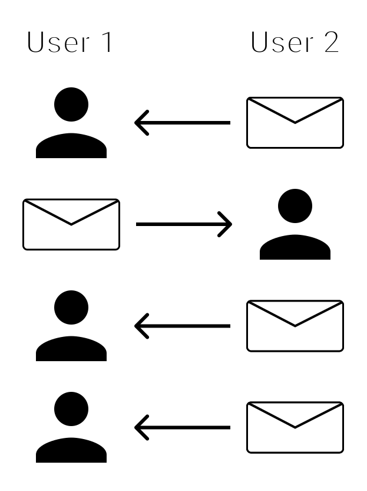

---
{
	title: "Networking 101: UDP",
	description: 'An introduction to the User Datagram Protocol, the simplest method of communicating over a network',
	published: '2019-09-26T05:12:03.284Z',
	authors: ['crutchcorn'],
	tags: ['udp', 'networking'],
	attached: [],
	license: 'cc-by-nc-sa-4',
	series: "Networking 101",
	order: 2
}
---

In the last article in the series, we outlined what a packet architected network was, what the OSI layers represent, and demonstrated how we could use physical mail as an analogy for how packet-based networks function. Since we've gone to a hundred-mile view in the last series, I figured we'd take a look at what we deliver in an HTTP network. You see, the internet, as you know it, is merely a large scale HTTP network; it's built upon the packet architecture. There are two common types of packets that are delivered in the HTTP network: UDP and TCP.

# Commonalities {#udp-and-tcp-both}

Let's start by talking about what similarities UDP and TCP have. While they do have their distinct differences, they share a lot in common. 

Since they're both packet-based, they both require an "address" of sorts to infer where they've come from and where they're going.

## IP Addresses {#ip-address}

The "address" used to identify the "to" and "from" metadata about a packet is an "IP Address." When you send a packet of data out, you label it with an IP address to go to; then, through a process of various other utilities processing that data, it's sent! An IP address might look something like this: `127.0.0.0`, or something like this: `0:0:0:0:0:0:0:1`

### Different Types of IP Addresses {#ipv4-vs-ipv6}

While IP addresses may seem somewhat arbitrary at first glance, there are important rules to abide by to have what's considered a "valid" IP address. What's considered "valid" is defined by the TCP/IP specification, which is lead by the [Internet Engineering Task Force](https://en.wikipedia.org/wiki/Internet_Engineering_Task_Force), a group created specifically to manage and handle network protocol standardization. As time has gone on, there have been various revisions to the IP validation methods. What was once valid is now considered outdated and migrated to a newer standard of IP address. The two most commonly used standards for defining IP addresses today are:

- IPv4 (Internet Protocol version 4)
- IPv6 (Internet Protocol version 6)

Due to the explosion of internet enabled-devices, we have had to make changes to the way we assign network addresses. The previous version of the IP protocol (v4) allowed for 4,294,967,296 (2^32) unique IP addresses. While this number may seem excessive, it's important to realize that we ran out of unique IP addresses in 2017. The only reason why we even lasted that long is due to a myriad of techniques that networking companies (like your ISP) utilized to extend the life of the IPv4 protocol. With IPv6, we're able to have 340,282,366,920,938,463,463,374,607,431,768,211,456 (2^128) (yes, that's correct) unique addresses - no fear of immediate exhaustion of addresses.

#### What Happened to version 5? {#ipv5}

As mentioned previously, the Internet Engineering Task Force manages various specifications regarding the standardization of internet communication. Back in 1995, they gathered to attempt to create a new version of the protocol to handle the growing use of live-streamed communication. To make a long story short, IPv5 was abandoned for various reasons, and they moved on to tackle the issue of unique identifiers rapidly diminishing. To avoid confusion with the attempted streaming protocol improvements, when a new version of the protocol was being worked on afterward, it was called IPv6.

> If you'd like to read more about this version for fun, you can read through [the Wikipedia page](https://en.wikipedia.org/wiki/Internet_Stream_Protocol). Unfortunately, there's limited information, and things get very quickly highly technical due to the "in progress" nature that things were left at.

## Ports  {#udp-ports}

Continuing with the mail analogy, just like an apartment complex can have a single mailbox for multiple apartments living within the same building, so too can a single machine have multiple landing sites for network packets.

These separated landing sites are called "ports"; called as such because they operate very similarly to the seaside "ports" that are used to dock ships. You're able to "open" a port to start engaging in network activity through that port, or "close" it to stop communication from flowing through that port. A single machine may choose to open a myriad of ports ranging anywhere from `0` to `65,535`. Any one of these ports can receive a different stream of information in-bound and out-bound alike.

This method of port address selection even has it's own shorthand. For example, if you wanted to send data to IP address `192.168.1.50` on port `3000`, you'd send that data to: `192.168.1.50:3000`, being sure to use a colon to delineate between the IP address and the port number.

### Pre-Assigned Ports {#standard-ports}

Like an apartment complex may pre-assign individuals to specific rooms, so too does the specification for Internet Protocol pre-assign specific applications to specific ports. For example, port 21 is officially designated to the [File Transfer Protocol (FTP)](https://en.wikipedia.org/wiki/File_Transfer_Protocol), which can be used to transfer files if a server is set up on a machine to handle this protocol. As a result, it's strongly discouraged to use these ports that are reserved for your application stack if you want to use a specific port for networking in your app or project.

### A Note On IP Addresses {#localhost}

You might remember from [the start of this section](#ip-addresses) that I listed `127.0.0.1` and `0:0:0:0:0:0:0:1` as examples of IPv4 and IPv6 addresses. This isn't without reason! These addresses are known as "loopback" addresses, and forward all traffic addressed to those IP addresses back to your machine! Why might this be useful? Let's take the following real-world example:

Let's say you're developing a web application using React and want to see it hosted on your local development environment without deploying it to the public internet to see. In this example, you could spin up a server to host the React code on `127.0.0.1:3000`, and you could then access it via `localhost:3000` in your browser. For programs like React, this functionality is built-in to [it's CLI utility](https://reactjs.org/docs/create-a-new-react-app.html), but this isn't limited to React; It's universal for any form of network communication you need to test locally.

# UDP {#udp}

UDP is the **"User Datagram Protocol"**. Of the acronym, you may be familiar with "User" and "Protocol", but the term **"datagram"** may be new. 

If you're familiar with how a telegram (like the old-school messaging method, not the new-age messaging platform) used to work, you may already be familiar with how a datagram works.

_A datagram is a unidirectional, non-verifiably-sent piece of communication that contains data._

Whoa. What's that even mean?

Okay, let's take a step back and understand what's going on with a datagram. Let's imagine you want to send a letter with some information to a friend in another state. Using the postal service, you're unable to verify that your friend has received the letter, only wait for a reply. There's also interaction required in order to send a letter. So long as you know the address of your friend, you can send as many letters as you'd like.

In a typical correspondence, you'd send off a letter, include a return address, and wait for a response back. That said, there's nothing stopping someone from sending more than a single letter before receiving a response. This chart is a good example of that:

Similarly, a datagram is sent from a single sender, recieved by a single recipient, addressed where to go, and contains a set of information.

However, one of the biggest weakness of a datagram is that you have no guarantee that what you sent was delivered. Because of this, other methods of sending data have been created in order to have assurance of data being received.

That said, just because you're unsure whether or not it was sent does not mean that it's a useless delivery method. After all, we still utilize the postal service for various aspects of foundational infrastructure, despite similar flaws. For example, due to UDP's relatively short time-to-send (as compared to other methods we'll cover later), UDP is often used as the primary method for streaming data live.

# IP Addresses and Packets {#ip-addresses-and-packets}

_With a datagram, you send a group of data to another client that you know the address of_. This address is known as an **"IP Address"**. This address is composed of numbers (and sometimes letters) _in order to tell your computer where the other is_.

The group of data that is sent using a datagram is known as a **"packet"**. This packet contains both a header and a body.

These headers can contain information (also called "metadata") like what size the content is, what type of data format the body of the packet contains, and more. This information can be then used to route specific packets to various routes. For example, say that I send a packet of data to a server that has the type 

`video: title: "A simulation of a packet that has a header stating the body to be in XML format being routed to a server that specifically handles XML files and a packet with a header that notes the data being in JSON being routed to a server that handles JSON": ./redirect-based-on-headers.mp4`

# Conclusion

This has been a brief overview of UDP. In this series, we're hoping to introduce the fundamentals of networking, and while UDP is not often seen in higher-level coding directly, it's usage is integral to understand many other aspects of networking. In the next article in the series, we'll introduce TCP and how you're able to verify that your messages are being sent to the other client. Even further into the series, we'll explain how IP addresses are assigned by using UDP thanks to DHCP.

To make sure you don't miss any of these articles, you may want to subscribe to our newsletter. We promise not to spam you with unrelated stuff and keep emails to a minimal. Otherwise, we also have a Discord you can join that we'll share new articles with. We also help others learn in the Discord as well.
