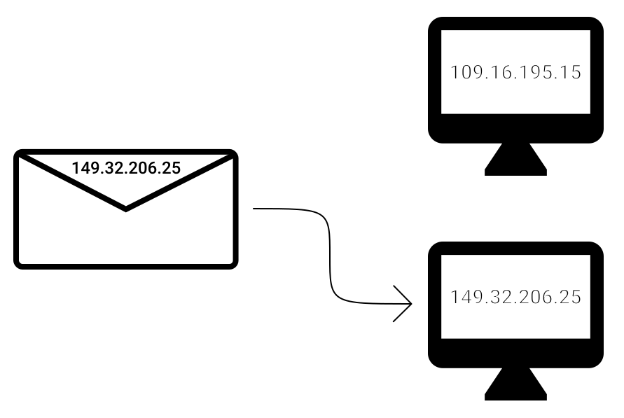

---
{
	title: "Networking 101: UDP & TCP",
	description: "If networking is analogous to physical mail, then let's take a look at the letters being sent themselves. Let's dive into UDP and TCP",
	published: '2020-03-31T05:12:03.284Z',
	authors: ['crutchcorn'],
	tags: ['networking'],
	attached: [],
	license: 'cc-by-nc-sa-4',
	series: "Networking 101",
	order: 2
}
---

In the last article in the series, we outlined what a packet architected network was, what the OSI layers represent, and demonstrated how we could use physical mail as an analogy for how packet-based networks function. Since we've gone to a hundred-mile view in the last series, I figured we'd take a look at what we deliver in an HTTP network. You see, the internet, as you know it, is merely a large scale HTTP network; it's built upon the packet architecture. There are two common types of packets that are delivered in the HTTP network: UDP and TCP.

# Commonalities {#udp-and-tcp-both}

Let's start by talking about what similarities UDP and TCP have. While they do have their distinct differences, they share a lot in common.

Since they're both packet-based, they both require an "address" of sorts to infer where they've come from and where they're going.

## IP Addresses {#ip-address}

The "address" used to identify the "to" and "from" metadata about a packet is an "IP Address." When you send a packet of data out, you label it with an IP address to go to; then, through a process of various other utilities processing that data, it's sent! An IP address might look something like this: `127.0.0.0`, or something like this: `0:0:0:0:0:0:0:1`

This IP address is then stored in a packet's header ([if you recall, that's where the metadata about the packet lives](/posts/basic-overview-of-packets-and-osi/#packet-metadata)), and that's then used to direct the packet to its correct recipient.

### Different Types of IP Addresses {#ipv4-vs-ipv6}

While IP addresses may seem somewhat arbitrary at first glance, there are important rules to abide by to have what's considered a "valid" IP address. What's considered "valid" is defined by the TCP/IP specification, which is lead by the [Internet Engineering Task Force](https://en.wikipedia.org/wiki/Internet_Engineering_Task_Force), a group created specifically to manage and handle network protocol standardization. As time has gone on, there have been various revisions to the IP validation methods. What was once valid is now considered outdated and migrated to a newer standard of IP address. The two most commonly used standards for defining IP addresses today are:

- IPv4 (Internet Protocol version 4)
- IPv6 (Internet Protocol version 6)

Due to the explosion of internet enabled-devices, we have had to make changes to the way we assign network addresses. The previous version of the IP protocol (v4) allowed for 4,294,967,296 (2^32) unique IP addresses. While this number may seem excessive, it's important to realize that we ran out of unique IP addresses in 2017. The only reason why we even lasted that long is due to a myriad of techniques that networking companies (like your ISP) utilized to extend the life of the IPv4 protocol. With IPv6, we're able to have 340,282,366,920,938,463,463,374,607,431,768,211,456 (2^128) (yes, that's correct) unique addresses - no fear of immediate exhaustion of addresses.

#### What Happened to version 5? {#ipv5}

As mentioned previously, the Internet Engineering Task Force manages various specifications regarding the standardization of internet communication. Back in 1995, they gathered to attempt to create a new version of the protocol to handle the growing use of live-streamed communication. To make a long story short, IPv5 was abandoned for various reasons, and they moved on to tackle the issue of unique identifiers rapidly diminishing. To avoid confusion with the attempted streaming protocol improvements, when a new version of the protocol was being worked on afterward, it was called IPv6.

> If you'd like to read more about this version for fun, you can read through [the Wikipedia page](https://en.wikipedia.org/wiki/Internet_Stream_Protocol). Unfortunately, there's limited information, and things get very quickly highly technical due to the "in progress" nature that things were left at.

## Ports  {#udp-ports}

Continuing with the mail analogy, just like an apartment complex can have a single mailbox for multiple apartments living within the same building, so too can a single machine have multiple landing sites for network packets.

These separated landing sites are called "ports"; called as such because they operate very similarly to the seaside "ports" that are used to dock ships. You're able to "open" a port to start engaging in network activity through that port, or "close" it to stop communication from flowing through that port. A single machine may choose to open a myriad of ports ranging anywhere from `0` to `65,535`. Any one of these ports can receive a different stream of information in-bound and out-bound alike.

This method of port address selection even has it's own shorthand. For example, if you wanted to send data to IP address `192.168.1.50` on port `3000`, you'd send that data to: `192.168.1.50:3000`, being sure to use a colon to delineate between the IP address and the port number.

### Pre-Assigned Ports {#standard-ports}

Like an apartment complex may pre-assign individuals to specific rooms, so too does the specification for Internet Protocol pre-assign specific applications to specific ports. For example, port 21 is officially designated to the [File Transfer Protocol (FTP)](https://en.wikipedia.org/wiki/File_Transfer_Protocol), which can be used to transfer files if a server is set up on a machine to handle this protocol. As a result, it's strongly discouraged to use these ports that are reserved for your application stack if you want to use a specific port for networking in your app or project.

### A Note On IP Addresses {#localhost}

You might remember from [the start of this section](#ip-addresses) that I listed `127.0.0.1` and `0:0:0:0:0:0:0:1` as examples of IPv4 and IPv6 addresses. This isn't without reason! These addresses are known as "loopback" addresses, and forward all traffic addressed to those IP addresses back to your machine! Why might this be useful? Let's take the following real-world example:

Let's say you're developing a web application using React and want to see it hosted on your local development environment without deploying it to the public internet to see. In this example, you could spin up a server to host the React code on `127.0.0.1:3000`, and you could then access it via `localhost:3000` in your browser. For programs like React, this functionality is built-in to [it's CLI utility](https://reactjs.org/docs/create-a-new-react-app.html), but this isn't limited to React; It's universal for any form of network communication you need to test locally.

# UDP {#udp}

Now that we've explained what IP addresses are and what ports are let's walk through how UDP is unique. _UDP stands for "User datagram protocol."_ You may be familiar with "User" and "Protocol," but the term **"datagram"** may be new.

If you're familiar with how a telegram (like the old-school messaging method, not the new-age messaging platform) used to work, you may already be familiar with how a datagram works.

_A datagram is a unidirectional, non-verifiably-sent piece of communication that contains data._

Whoa. What's that even mean?

When you send a letter through the mail (barring any additional "protections" you might add to a valuable package. We'll get to that later), you have no way of knowing if it made it to the intended recipient.

Because the packet of information could be lost somewhere or sustain damage, which makes the data unreadable (say, via data corruption), you are unable to reliably ensure that it was received.

Likewise, if you've sent multiple packets at once, you have no way of knowing if your data is received in the same order they came in. While this isn't much of a problem for small-scale communication, this can become a problem for larger-scale bi-directional data transfer.

## When is UDP Useful? {#udp-uses}

UDP is useful for various low-level communication used to set up networks in ways that we'll touch later in the series. That said, there are also application-level usages for UDP's core strength: Speed. See, because UDP does not engage in any form of delivery confirmation, it tends to be significantly faster than it's TCP counterpart. As such, if you require high-speed data throughput and can afford to lose some data, UDP is the way to go. This speed is why it's often utilized in video calling software. You can scale up/down the video quality based on which packets are able to make it through but keep latency low due to pressing forward when packets don't arrive in time.

# TCP {#tcp}

If you've ever sent an expensive package through a mail courier service, you may have opted to have the recipient "sign" for the package, as a method of certifying that they did, in fact, get the package.

That's what TCP is for HTTP packets. TCP stands for "Transmission Control Protocol" and solves one of the biggest problems in UDP: delivery verification. It does this by using a three-way "handshake" to verify an open connection between the clients, and a number associated with each packet to tell which order the data should arrive in.

The three-step handshake is broken down to these steps:

1. The client sends a request to the host, asking if it's acceptable to connect. It includes a "Synchronize Sequence Number" (SYN), which tells which packet number the communication is going to start with. This step is formally known as SYN

2. The host then acknowledges (ACK) the request, and sends it's own SYN. This step is formally known as SYN/ACK

3. The client acknowledges the SYN from the host, and data starts transmitting. This step is formally known as ACK.

When you disconnect from the host, a similar disconnect handshake is done. Once the setup handshake is completed, and data starts flowing, every request to host will be returned by an acknowledgment of delivery. This ACK makes sure that you know your packets are delivered. If your packet acknowledgment is not resolved within a certain time, TCP includes the idea of timers running on the client that will re-send the packet.

Because of this more robust delivery pattern, TCP is often used for most high-level network connections.

# Conclusion

This has been a brief overview of UDP and TCP! In this series, we're hoping to introduce the fundamentals of networking. While UDP/TCP is not often seen in higher-level coding directly, it's usage is integral to understand many other aspects of networking. In the next article in the series, we'll explain how IP addresses are assigned by using UDP thanks to DHCP.  Even further into the series, we'll walk through how the domain name URLs you type into your web browser are resolved into IP addresses through the domain name system (DNS).

To make sure you don't miss any of these articles, you may want to subscribe to our newsletter. We promise not to spam you with unrelated stuff and keep emails to a minimum. Otherwise, [we also have a Discord](https://discord.gg/FMcvc6T) you can join to see announcements for new articles, ask questions of the posts' authors, and engage in general community chatter
