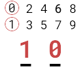
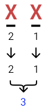
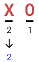
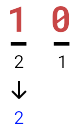
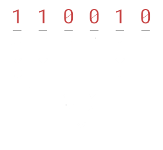
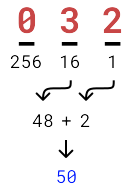
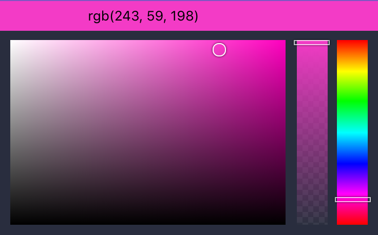

---
{
  title: "How Binary and Hexadecimal Work: An introduction to non-decimal number systems",
  description: "Learn how to convert decimal to binary and hexadecimal, how CSS colors are calculated, and how your computer interprets letters into binary.",
  published: "2019-11-07T05:12:03.284Z",
  authors: ["crutchcorn"],
  tags: ["computer science"],
  attached: [],
  license: "cc-by-nc-sa-4",
}
---

Computers, on a very low level, are built upon binary (ones and zeros). Think about that — all of the text you're reading on your screen started life as either a one or a zero in some form. That's incredible! How can it turn something so simple into a sprawling sheet of characters that you can read on your device? Let's find out together!

# Decimal {#decimal}

When you or I count, we typically use 10 numbers in some variation of combination to do so: `0`, `1`, `2`, `3`, `4`, `5`, `6`, `7`, `8`, and `9`.

When you count to `10`, you're really using a combination of `1` and `0` in order to construct a larger number that we cognizantly recognize. The number `10` persists in our minds even when we have it written out; **ten**.

Knowing that we can separate the number from our thoughts allows us to further categorize the number, mentally breaking it down into smaller groupings. For example, the number `34` can be broken down into three groups: the _ones_, the _tens_, and the _hundreds_.

For the number `34`, we break it down into: `0` _hundreds_, `3` _tens_, and `4` _ones_. We can then multiply the higher number with the lower number (the column they're in) to get the numbers **`30`** (`3` _tens_) and **`4`** (`4` _ones_). Finally, we add them all together to make the number we all know and love: **`34`**.

This breakdown showcases a limitation with having 10 symbols to represent numbers; with only a single column, the highest number we can represent is _`9`_.
Remember that the number **`10`** is a combination of **`1`** and **`0`**? That's due to this limitation. Likewise - with two columns - the highest number we can represent is _`99`_.

# Binary {#binary}

Now this may seem rather simplistic, but it's an important distinction to be made to understand binary. Our typical decimal numeral system is known as the _base 10_ system. **It's called as such because there are 10 symbols used to construct all other numbers** (once again, that's: `0`, `1`, `2`, `3`, `4`, `5`, `6`, `7`, `8`, and `9`).
Binary, on the other hand, is _base two_. **This means that there are only two symbols that exist in this numeral system.**

> For the Latin enthusiasts, binary comes from "binarius" meaning "two together". _Deca_, meaning 10, is where "decimal" comes from.
> Additionally, the term "radix" is sometimes used instead of "base" when describing numeral systems, especially in programming.

Instead of using numbers, which can get very confusing very quickly while learning for the first time, let's use \*\*`X`\*\*s and \*\*`O`\*\*s as our two symbols for our first few examples. _An **`X`** represents if a number is present and that we should add it to the final sum; an **`O`** means that the number is not present and that we should not add it_.
Take the following example:

In this example, both `1` and `2` are present, so we add them together to make **`3`**. You'll see that since we can only have a value present or not present — because we only have two symbols in binary — this conversion has fewer steps than using decimal. For example, if you only wanted the number two, you could simply mark the `1` as "not present" using the **`O`**:

You can even replace the two symbols with `1` and `0` to get the actual binary number of `10` in order to represent `2`:

So, how does this play out when trying to represent the number **`50`** in binary?

As you can see, we create columns that are powers of `2` for similar reasons as using powers of `10` in decimal; you can't represent `4`, `8`, `16`, or `32` without creating a new column otherwise.

> Remember, in this system, a number can only be present or not; there is no _`2`_. This means that only the symbols `1` and `0` are present. Keeping this in mind, it then means that we can only have `11` as the highest represented number without another column. **`11`** in binary is **`3`** in decimal. _This shows that with only 2 binary digits, only the decimal numbers that can be represented are: `0`, `1`, `2`, and `3`_. As a result, we need to add a _`4`_ column in order to represent that number in binary.
>
> Continuing on with this pattern: without an **`8`** column, you can only have a `4`, `2`, and `1` which would yield a maximum value of **`7`**. It's important to note that these values are always one less than a power of 2.

Once each of these powers is laid out, we can start adding `1`s where we have the minimum amount of each value. For example:

- Is `64` less than or equal to `50`? No. That's a **`0`**.
- Is `32 <= 50`? Yes, therefore that's a **`1`**.
  - `50 - 32 = 18`
- Moving down the list, is `16 <= 18`? Yes, that's a **`1`**.
  \-`18 - 16 = 2`
- Is `8 <= 2`? No, that's a **`0`**.
- `4 <= 2`? No, that's a **`0`** as well.
- `2 <= 2`? Yes, that's a **`1`**.
  - `2 - 2 = 0`
- Now that we're left with `0`, we know that the rest of the digits will be `0`.

Add up all those numbers:

| Column | Value   |
| ------ | ------- |
| `64`   | **`0`** |
| `32`   | **`1`** |
| `16`   | **`1`** |
| `8`    | **`0`** |
| `4`    | **`0`** |
| `2`    | **`1`** |
| `1`    | **`0`** |

And voilà, you have the binary representation of `50`: **`0110010`**.

> Author's note:
>
> While there are plenty of ways to find the binary representation of a decimal number, this example uses a "greedy" algorithm. I find this algorithm to flow the best with learning the binary number system, but it's not the only way (or even the best way, oftentimes).

# Hexadecimal {#hexadecimal}

Binary isn't the only non-decimal system. You're able to use any number as your base as long as you have enough symbols to represent the digits. Let's look at another example of a non-decimal system: _hexadecimal_.

Hexadecimal is the base 16 number system.

> _Hexa_ means "six" in Latin, and _deca_ means "ten", so these are combined to form "sixteen".

Now you may wonder how you can count to 16 in a single column when we only use 10 symbols to represent numbers. The answer, to many developers, is to fill the remaining last 6 with other symbols: alphabetical letters.

`0`, `1`, `2`, `3`, `4`, `5`, `6`, `7`, `8`, `9`, `A`, `B`, `C`, `D`, `E`, `F`

These are the symbols that make up the hexadecimal numeral system for many developers. _`A`_, in this case, represents the number **`10`**; _`F`_ represents the number **`15`**. In this numeral system, there are the _sixteens_, the _two-hundred fifty sixes_ (gathered by multiplying 16 by itself — 162), and other powers of 16.

Given this information, how would we represent the number **`50`**?

Assuming we have a _ones_ column, a _sixteens_ column, and a _two-hundred fifty sixes_ column, we can calculate the number in a similar way to the binary example earlier:

- Is `256` less than or equal to `50`? No. That's a **`0`**
- Is `16 <= 50`? Yes. So we know it's _at least `1`_.
  - Now, how many times can you put `16` in `50`?
    - `16 * 2 = 32` and `32 <= 50`, so it's _at least_ _`2`_.
    - `16 * 3 = 48` and `48 <= 50` so it's _at least_ _`3`_.
    - `16 * 4 = 64`. However, `64 > 50`, therefor the _sixteenth_ place cannot be _`4`_, therefore it must be **`3`**.
  - Now that we know the most we can have in the _sixteenth_ place, we can subtract the sum (`48`) from our result (`50`).
    - `50 - 48 = 2`
- Now onto the _ones_ place: how many _ones_ can fit into _`2`_?
  - `1 * 1 = 1` and `1 <= 2`, so it's _at least_ _`1`_.
  - `1 * 2 = 2` and `2 <= 2` and because these numbers are equal, we know that there must be **`2`** _twos_.

Now if we add up these numbers:

| Column | Value   |
| ------ | ------- |
| `256`  | **`0`** |
| `16`   | **`3`** |
| `1`    | **`2`** |

## Why `256`?

While reading through this, you may wonder, "Where did the `256` come from?". Let's take a step back to analyze this question.

If you recall, we use these 15 symbols to represent digits in hexadecimal:

`0`, `1`, `2`, `3`, `4`, `5`, `6`, `7`, `8`, `9`, `A`, `B`, `C`, `D`, `E`, `F`

Using just a single digit (or, phrased in another way: A single number column), the biggest number we can represent is `F`, or `15` in decimal.

This is similar to how the biggest number we can represent with a single digit in decimal is `9`.

In order to add a number larger than `15` in the hexadecimal system, we need to add another digit/column. This column would represent the _sixteens_ place. Having `F` in both this column and the _ones_ column, the highest number we can represent would be `FF`, or `255` in decimal. As a result, we need to add a _two-hundred-fifty-six_ column to represent any numbers higher.

> For those that have experience in algebra, you'll notice that these are all powers of 16.
>
> Just as _`100`_ is 102 for the decimal system, `256` is 162. We can follow this pattern to the next number in the hexadecimal column: `4096`, which is 163. You can even apply it to `1` which is 160.
>
> Binary works in the same manner. The first 5 columns/digits of binary are: `1`, `2`, `4`, `8`, `16`. These numbers align respectively to their binary exponents: 20, 21, 22, 23, 24.
>
> It's also worth noting that decimal numbers can be written out the same way.
>
> _`732`_ for example, in base 10, can be written as (7 × 102) + (3 × 101) + (2 × 100).

## To Binary {#hexadecimal-to-binary}

Remember that at the end of the day, hexadecimal is just another way to represent a value using a specific set of symbols. Just as we're able to convert from binary to decimal, we can convert from hexadecimal to binary and vice versa.
In binary, the set of symbols is much smaller than in hexadecimal, and as a result, the symbolic representation is longer.

After all, they're just reflections of the numbers that we represent using a specific set of symbols. In binary, those symbols are more restrictive than in hexadecimal, and therefore the symbolic representation is longer.

# Applications

## CSS Colors {#hex-css}

Funnily enough, if you've used a "hex" value in HTML and CSS, you may already be loosely familiar with a similar scenario to what we walked through with the hexadecimal section.

For example, take the color `#F33BC6` (a pinkish color). This color is a combination of `3` two-column hexadecimal numbers back-to-back. These numbers are:

`F3`, `3B`, `C6`

_They reflect the amount of red, green, and blue (respectively) in that color._ Because these numbers are two-digit hexadecimal numbers, _the highest a number can be to reflect one of these colors is `255`_ (which is **FF** in hexadecimal).

> If you're unfamiliar with how red, green, and blue can combine to make the colors we're familiar with (such as yellow, orange, purple, and much more), it might be worth taking a look at some of the color theory behind it. [You can find resources on the topic on Wikipedia](https://en.wikipedia.org/wiki/RGB_color_model) and elsewhere.

These numbers, in decimal, are as follows:

| Hex  | Decimal |
| ---- | ------- |
| `F3` | `243`   |
| `3B` | `59`    |
| `C6` | `196`   |

And construct the amount of `Red`, `Green`, and `Blue` used to construct that color

| Represents | Hex  | Decimal |
| ---------- | ---- | ------- |
| Red        | `F3` | `243`   |
| Green      | `3B` | `59`    |
| Blue       | `C6` | `196`   |

Even without seeing a visual representation, you can tell that this color likely has a purple hue - since it has a high percentage of red and blue.

## Text Encoding {#ascii}

Although hexadecimal has a much more immediately noticeable application with colors, we started this post off with a question: "How does your computer know what letters to display on the screen from only binary?"

The answer to that question is quite complex, but let's answer it in a very simple manner (despite missing a lot of puzzle pieces in a very ["draw the owl"](https://knowyourmeme.com/memes/how-to-draw-an-owl) kind of way).

Let's take a real way that computers used to (and still do, to some extent) represent letters internally: [ASCII](https://en.wikipedia.org/wiki/ASCII). ASCII is an older standard for representing each textual character as a different number inside your computer. Take the following (simplified) chart:

When the user types _"This"_, what the computer interprets (using ASCII) is `84`, `104`, `105`, and `115` for `T`, `h`, `i`, and `s`, respectively.

> You might be wondering, "Why are there a bunch of missing numbers"?
>
> I've removed them to keep the examples simple, but many of them are for symbols (EG: `#`, `/`, and more), and some of them are for internal key commands that were used for terminal computing long ago that your computer now does without you noticing.
>
> It's also worth mentioning that ASCII (which does have more characters than what's presented here) was eventually replaced in various applications by [Unicode](https://en.wikipedia.org/wiki/Unicode) and other text encoding formats as it lacks various functionality we expect of our machines today, such as emoji and non-latin symbols (like Kanji). ASCII still sticks around to some extent though, as the first 255 characters in Unicode are the same as they originally were in ASCII.

While I've used the above chart to reflect _A_ as `65`, it'd be more accurate to say that your computer interprets the symbol as `01000001` internally. This is again due to the fact that your computer must interpret every number and letter as binary.

# Conclusion

While this has been only a high-level overview of how your computer interprets these non-decimal numbers (and some of their applications), it can provide some basic insights to what your computer is doing every time you make a keystroke or see a color on screen. Under the hood, everything is binary, and now you understand the introduction to how to convert binary to numbers you and I may understand better: to decimal!
