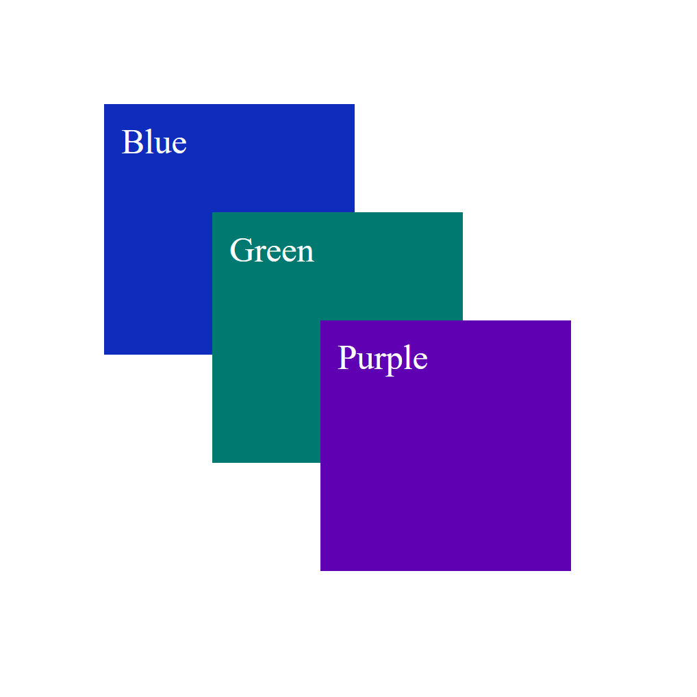
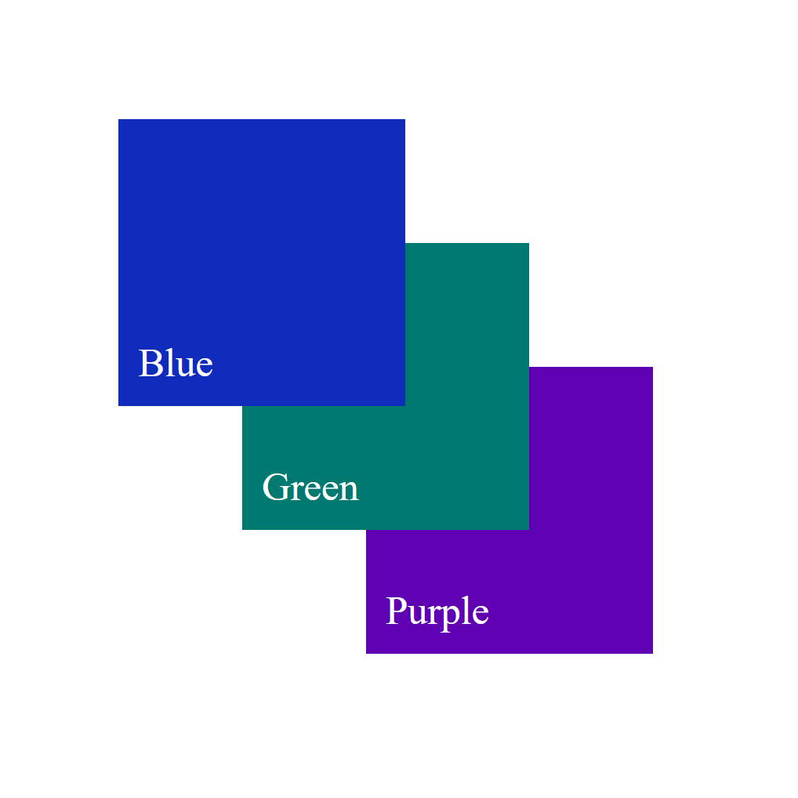
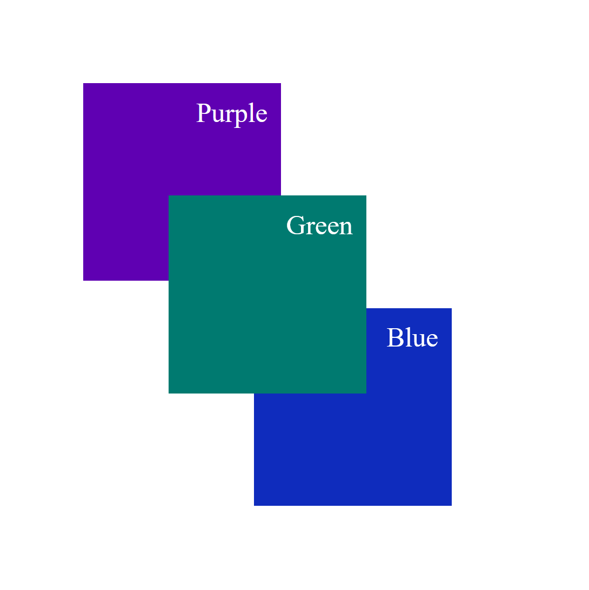

---
{
    title: "Portals",
    description: "",
    published: '2023-01-01T22:12:03.284Z',
    authors: ['crutchcorn'],
    tags: ['webdev'],
    attached: [],
    order: 15,
    series: "The Framework Field Guide"
}
---

[Despite some some UX headaches modals can introduce into an app](modalzmodalzmodalz.com/), they're still a widely used UI element in many applications today.

While building sufficiently useful modals can be a challenging task, a rudimentary modal can be completed even without JavaScript.

Let's use some CSS and HTML in order to build a basic modal:

```html
<div>
  <div id="body">
    <p>This is some text, pretend it's an app back here</p>
  </div>
  <div id="modal-container">
    <div id="modal">This is a modal</div>
  </div>
</div>

<style>
#modal-container {
  position: fixed;
  top: 0;
  left: 0;
  height: 100%;
  width: 100%;
  display: flex;
  justify-content: center;
  align-items: center;
  background: rgba(0, 0, 0, 0.5);
}

#modal {
  background: white;
  border: 1px solid black;
  padding: 1rem;
  border-radius: 1rem;
}
</style>
```


Tada! 🎉 Now we have a fairly basic modal to display whatever HTML we want inside.

But let's say that we keep building out the page. As we do, we might, for example, want to have a `footer` beneath our main page's content.

```html
<template>
  <div id="body" style="min-height: 50vh">
    <p>This is some text, pretend it's an app back here</p>
  </div>
  <div id="modal-container">
    <div id="modal">This is a modal</div>
  </div>
  <footer style="min-height: 50vh">App Name</footer>
</template>

<style>
#modal-container {
  position: fixed;
  top: 0;
  left: 0;
  height: 100%;
  width: 100%;
  display: flex;
  justify-content: center;
  align-items: center;
  background: rgba(0, 0, 0, 0.5);
}

#modal {
  background: white;
  border: 1px solid black;
  padding: 1rem;
  border-radius: 1rem;
}

footer {
  position: relative;
  background: lightblue;
  padding: 1rem;
}
</style>
```

At first glance, this might look like it's been successful, but let's take a look at the rendered output:


Oh dear! Why is the footer rendered above the modal?

Well, my friends, the modal is rendering under the footer due to something called "The Stacking Context".

# What is the stacking context?

While the concept of the "Stacking Context" in the DOM is quite complex, here's the gist of it:

While we often think about our browser as displaying a 2-dimensional image as a result of our HTML and CSS, this isn't the case. Take the following code example:

```html
<div id="container">
  <div id="blue">Blue</div>
  <div id="green">Green</div>
  <div id="purple">Purple</div>
</div>

<style>
#container {
  display: relative;
  height: 325px;
  width: 325px;
  border: 1px solid;
}

#blue,
#green,
#purple {
  height: 100px;
  width: 100px;
  position: absolute;
  padding: 8px;
  color: white;
}

#blue {
  background: #0f2cbd;
  left: 50px;
  top: 50px;
}

#green {
  background: #007a70;
  left: 100px;
  top: 100px;
}

#purple {
  background: #5f00b2;
  left: 150px;
  top: 150px;
}
</style>
```

Here, we have three different boxes that overlap on one another. Given that they overlap, **which one do you think takes priority and, at least visually, is on top of the other boxes**?

<br/>

No, really, guess! Stop reading, take a look at the code, and take a guess. 😊

<br/>

<br/>

<br/>

<br/>

<br/>

<br/>

<br/>

<br/>

<br/>

<br/>

<br/>

Ready to see the answer?

<br/>

<br/>

<br/>

<br/>

<br/>

<br/>

<br/>

<br/>

<br/>

<br/>

<br/>

<br/>

OK, here it is:


While some CSS pros might assume that purple is the priority [due to order in which the CSS is laid out, just like other CSS rules](https://wattenberger.com/blog/css-cascade#position), this isn't what's happening here.

Notice how the purple box seemingly remains on "top" when we re-arrange the CSS rules:

```css
#purple {
  background: #5f00b2;
  left: 150px;
  top: 150px;
}

#green {
  background: #007a70;
  left: 100px;
  top: 100px;
}

#blue {
  background: #0f2cbd;
  left: 50px;
  top: 50px;
}
```


> If changing the CSS order doesn't re-arrange the boxes, then what does?

Well...

### Re-arrange HTML Elements to Change the Stacking Order

Let's take the HTML we had before, and re-arrange it a bit:

```html
<div id="container">
  <div id="purple">Purple</div>
  <div id="green">Green</div>
  <div id="blue">Blue</div>
</div>
```

Now if we look at the box order, we'll see...



Now our boxes have reversed their height order! This is because one of the deciding factors of an element's `z` position is its relationship to other elements.

### Positioned Elements Behave Differently Than Non-Positioned Elements

> This is where things get confusing. Take your time with this chapter, it's okay to have to re-read this section multiple times.

While we were using `absolute`ly positioned elements for a simple demo before, let's take a step back and change our elements to be positioned using `margin` instead:

```css
<template>
  <div id="container">
    <div id="purple">Purple</div>
    <div id="green">Green</div>
    <div id="blue">Blue</div>
  </div>
</template>

<style>
#container {
  display: relative;
  height: 350px;
  width: 350px;
  border: 1px solid;
}

#container > div:nth-child(1) {
  margin-top: 50px;
  margin-left: 50px;
}

#container > div:nth-child(2) {
  margin-top: -50px;
  margin-left: 100px;
}

#container > div:nth-child(3) {
  margin-top: -50px;
  margin-left: 150px;
}

#blue,
#green,
#purple {
  height: 100px;
  width: 100px;
  padding: 8px;
  color: white;
}

#blue {
  background: #0f2cbd;
}

#green {
  background: #007a70;
}

#purple {
  background: #5f00b2;
}
</style>
```

Looks like a familiar output:


While working on styling, we wanted our `green` box to move to the left when you hover over it. This is straightforward enough to do [using CSS animations](https://developer.mozilla.org/en-US/docs/Web/CSS/CSS_Animations/Using_CSS_animations), let's add it:

```css
#green {
  background: #007a70;
  position: relative;
  left: 0px;
  transition: left 300ms ease-in-out;
}

#green:hover {
  left: 20px;
}
```

While our green button now smoothly moves left when you hover over it, there's a new problem: The green box is now on top of the purple and blue boxes.



This is because positioning an element introduces a "stacked context". This means that our `relative` positioned element takes priority in the `z` layer over non-positioned elements.

### Understanding more rules of Stacked Contexts

While `relative` positioning is one way that you can take priority in a stacked context, it's far from the only way to do so. Here's a list of CSS rules that will take priority in a stacked context, from the lowest priority to the highest priority:

- Positioned elements with a negative `z-index`
- The background and borders of the parent element
- Non-positioned elements
- Elements with a `float` style applied
- Non-positioned inline elements
- Positioned elements without a `z-index` applied

So, if we have the following HTML:

```html
<div class="container" style="background: rgba(0, 0, 0, 0.8)">
    <div class="box slate" style="position: relative">Slate</div>
    <div class="box yellow" style="display: inline-block">Yellow</div>
    <div class="box lime" style="float: left">Lime</div>
    <div class="box green" style="">Green</div>
    <div class="box cyan" style="position: relative; z-index: -1">Cyan</div>
</div>
```

We would see, from top to bottom:

- A `slate` colored box
- A `yellow` colored box
- A `lime` colored box
- A `green` colored box
- The `container`'s background
- A `cyan` colored box


<!-- Editor's note: I'm cheating in that screenshot. `float` and `inline-display` are hard to makee elements align again, so I'm just using `z-index` for demonstration purposes -->

All of these rules are superseded by the order of the elements within the HTML, as we learned before. For example, with the following HTML:

```
```

 


Stacking Contexts are created when:

- `z-index` is applied to a positioned element
- `z-index` is applied to a child of a `grid` or `flex` element

- Element with an [`opacity`](https://developer.mozilla.org/en-US/docs/Web/CSS/opacity) less than `1` 
- Element with any of the following properties:
  - [`transform`](https://developer.mozilla.org/en-US/docs/Web/CSS/transform)
  - [`filter`](https://developer.mozilla.org/en-US/docs/Web/CSS/filter)
  - [`backdrop-filter`](https://developer.mozilla.org/en-US/docs/Web/CSS/backdrop-filter)
  - [`perspective`](https://developer.mozilla.org/en-US/docs/Web/CSS/perspective)
  - [`clip-path`](https://developer.mozilla.org/en-US/docs/Web/CSS/clip-path)
  - [`mask`](https://developer.mozilla.org/en-US/docs/Web/CSS/mask) / [`mask-image`](https://developer.mozilla.org/en-US/docs/Web/CSS/mask-image) / [`mask-border`](https://developer.mozilla.org/en-US/docs/Web/CSS/mask-border)

> This list is non-exhaustive, but contains most of the highlights of when a stacking context is created.

Confusingly, when a stacking context is created, it does not overwrite the position of an element within the parent stacking context.


> If you want to learn more about the "stacking context", I'd suggest reading through the following resources:
>
> - [Stacking elements - CSS z-index and stacking context explained - NetGen](https://netgen.io/blog/stacking-elements-css-z-index-and-stacking-context-explained)
> - [The stacking context - MDN](https://developer.mozilla.org/en-US/docs/Web/CSS/CSS_Positioning/Understanding_z_index/The_stacking_context)
> - [What The Heck, z-index?? - Josh W Comeau](https://www.joshwcomeau.com/css/stacking-contexts/)
> - [What No One Told You About Z-Index - Philip Walton](https://philipwalton.com/articles/what-no-one-told-you-about-z-index/)
> - [Appendix E. Elaborate description of Stacking Contexts - W3C](https://www.w3.org/TR/CSS2/zindex.html)

# What is a JavaScript portals?


// TODO: Write

Z-index example


https://developer.mozilla.org/en-US/docs/Web/CSS/CSS_Positioning/Understanding_z_index/The_stacking_context

https://www.joshwcomeau.com/css/stacking-contexts/

https://philipwalton.com/articles/what-no-one-told-you-about-z-index/


# Using Local Portals

// TODO: Write this


<!-- tabs:start -->

## React

// TODO: Write this

```jsx
import React, { useMemo, useState } from 'react';
import ReactDOM from 'react-dom';

export default function App() {
  const [portalRef, setPortalRef] = useState(null);

  const portal = useMemo(() => {
    if (!portalRef) return null;
    return ReactDOM.createPortal(<div>Hello, world!</div>, portalRef);
  }, [portalRef]);

  return (
    <>
      <div
        ref={(el) => setPortalRef(el)}
        style={{ height: '100px', width: '100px', border: '2px solid black' }}
      >
        <div />
      </div>
      {portal}
    </>
  );
}
```


## Angular

While the other frameworks have something akin to a portal system built into their frameworks' core, Angular does not. Instead, the Angular team maintains a library called "Angular CDK" in order to have shared UI code for utilities such as portals.

To use the Angular CDK, you'll first need to install it into your project:

```
npm i @angular/cdk
```

From here, we can import components and utilities directly from the CDK.

```typescript
import { PortalModule } from '@angular/cdk/portal';
import { DomPortal } from '@angular/cdk/portal';

@Component({
  selector: 'my-app',
  template: `
  <div style="height: 100px; width: 100px; border: 2px solid black;">
    <ng-template [cdkPortalOutlet]="domPortal"></ng-template>
  </div>
  <div #portalContent>Hello, world!</div>
  `,
})
class AppComponent implements AfterViewInit {
  @ViewChild('portalContent') portalContent: ElementRef<HTMLElement>;

  domPortal: DomPortal<any>;

  ngAfterViewInit() {
    // This is to avoid an:
    // "Expression has changed after it was checked"
    // error when trying to set domPortal
    setTimeout(() => {
      this.domPortal = new DomPortal(this.portalContent);
    });
  }
}

@NgModule({
  declarations: [AppComponent],
  imports: [BrowserModule, PortalModule],
  providers: [],
  bootstrap: [AppComponent],
})
export class AppModule {}
```

### Rendering `ng-template`

There might be a flash of the `div` on screen before our `ngAfterViewInit` occurs. As such, we may want to use an `ng-template`:

// TODO: Write

```typescript
import { PortalModule, TemplatePortal } from '@angular/cdk/portal';

@Component({
  selector: 'my-app',
  template: `
  <div style="height: 100px; width: 100px; border: 2px solid black;">
    <ng-template [cdkPortalOutlet]="domPortal"></ng-template>
  </div>
  <ng-template #portalContent>Hello, this is a template portal</ng-template>
  `,
})
class AppComponent implements AfterViewInit {
  @ViewChild('portalContent') portalContent: TemplateRef<unknown>;

  viewContainerRef = inject(ViewContainerRef);
  domPortal: TemplatePortal<any>;

  ngAfterViewInit() {
    // This is to avoid an:
    // "Expression has changed after it was checked"
    // error when trying to set domPortal
    setTimeout(() => {
      this.domPortal = new TemplatePortal(
        this.portalContent,
        this.viewContainerRef
      );
    });
  }
}
```


## Vue

// TODO: Write this

```vue
<!-- App.vue -->
<script setup>
import { ref } from 'vue'

const portalContainerEl = ref(null)
</script>

<template>
  <div style="height: 100px; width: 100px; border: 2px solid black">
    <div ref="portalContainerEl"></div>
  </div>
  <div v-if="portalContainerEl">
    <Teleport :to="portalContainerEl">Hello, world!</Teleport>
  </div>
</template>
```

We need this `v-if` in order to ensure that `portalContainerEl` has already been rendered and is ready to project content.

<!-- tabs:end -->

// TODO: Write this


# Application-Wide Portals

// TODO: Write this

<!-- tabs:start -->

## React

// TODO: Write this

```jsx
import React, { useState, createContext, useContext } from 'react';
import ReactDOM from 'react-dom';

// We start by creating a context name
const PortalContext = React.createContext();

function ChildComponent() {
  const portalRef = useContext(PortalContext);
  if (!portalRef) return null;
  return ReactDOM.createPortal(<div>Hello, world!</div>, portalRef);
}

export default function App() {
  const [portalRef, setPortalRef] = useState(null);

  return (
    <PortalContext.Provider value={portalRef}>
      <div
        ref={(el) => setPortalRef(el)}
        style={{ height: '100px', width: '100px', border: '2px solid black' }}
      >
        <div />
      </div>
      <ChildComponent />
    </PortalContext.Provider>
  );
}
```


## Angular

We can use a basic service to share our instance of a `Portal` between multiple components, parent and child alike.

```typescript
import { Portal, PortalModule, TemplatePortal } from '@angular/cdk/portal';

@Injectable({
  providedIn: 'root',
})
class PortalService {
  portal: Portal<any> | null = null;
}

@Component({
  selector: 'modal',
  template: `
  <ng-template #portalContent>Test</ng-template>
  `,
})
class ModalComponent implements OnDestroy {
  @ViewChild('portalContent') portalContent: TemplateRef<unknown>;

  viewContainerRef = inject(ViewContainerRef);
  domPortal: TemplatePortal<any>;

  portalService = inject(PortalService);

  ngAfterViewInit() {
    // This is to avoid an:
    // "Expression has changed after it was checked"
    // error when trying to set domPortal
    setTimeout(() => {
      this.portalService.portal = new TemplatePortal(
        this.portalContent,
        this.viewContainerRef
      );
    });
  }

  ngOnDestroy() {
    this.portalService = null;
  }
}

@Component({
  selector: 'my-app',
  template: `
  <div style="height: 100px; width: 100px; border: 2px solid black;" *ngIf="portalService.portal">
    <ng-template [cdkPortalOutlet]="portalService.portal"></ng-template>
  </div>
  <modal></modal>
  `,
})
class AppComponent {
  portalService = inject(PortalService);
}
```


## Vue

```
<!-- App.vue -->
<script setup>
import { ref, provide } from 'vue'
import Child from './Child.vue'

const portalContainerEl = ref(null)
provide('portalContainerEl', portalContainerEl)
</script>

<template>
  <div style="height: 100px; width: 100px; border: 2px solid black">
    <div ref="portalContainerEl"></div>
  </div>
  <Child />
</template>
```


<!-- tabs:end -->

// TODO: Write this


# HTML-Wide Portals

// TODO: Write

<!-- tabs:start -->

## React

// TODO: Write

Alternatively, `ReactDOM.createPortal` supports passing an arbitrary HTML DOM node, such as `html.body`:

```jsx
import React, { useMemo } from 'react';
import ReactDOM from 'react-dom';

function ChildComponent() {
  const bodyEl = useMemo(() => {
    return document.querySelector('body');
  }, []);
  return ReactDOM.createPortal(<div>Hello, world!</div>, bodyEl);
}

export default function App() {
  return <ChildComponent />;
}
```

## Angular

// TODO: Write

Can't do this

## Vue

// TODO: Write

```vue
<!-- Child.vue -->
<script setup></script>

<template>
  <Teleport to="body">Hello, world!</Teleport>
</template>
```

```vue
<!-- App.vue -->
<script setup>
import Child from './Child.vue'
</script>
    
<template>
  <Child />
</template>
```


<!-- tabs:end -->
