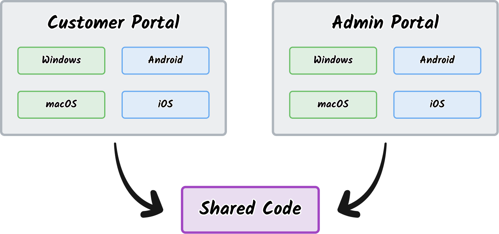

---
{
	title: "How to Setup a React Native Monorepo",
	description: "",
	published: '2023-05-05T13:45:00.284Z',
	authors: ['crutchcorn'],
	tags: ['react', 'react native'],
	attached: [],
	license: 'cc-by-nc-sa-4'
}
---

[React Native](https://reactnative.dev/) allows you to write React code that outputs to native applications for various platforms, including:

- Android
- iOS
- Windows
- macOS

It's an undeniably powerful way to share code between web applications and your mobile apps; particularly within small teams that either don't have the knowledge or the capacity to go fully native.

Similarly, [monorepos](https://monorepo.tools/) can be a fantastic way to share code between multiple projects with a similar tech stack.

Combined together and even a small team can maintain multiple React Native applications seamlessly.



Unfortunately, it can be rather challenging to build out a monorepo that properly supports React Native. While [Expo supports monorepo usage](https://docs.expo.dev/guides/monorepos/), one common complaint when using Expo is that [Expo does not support many popular React Native libraries that require native code](https://web.archive.org/web/20230321191807/https://docs.expo.dev/introduction/why-not-expo/#expo-go).

To further exacerbate the issue, React Native comes with many uncommon edgecases that makes monorepos particularly challenging to create. Many of the tutorials I've found outlining how to build a monorepo for this purpose use outdated tools to work around this.

Knowing just how potent the potential impact of a monorepo would be to my projects, I disregarded these headaches and spent a month or two building out a monorepo that solved my problems.

By the end of it all, I had a monorepo structure that looked something like the following:


<!-- filetree:start -->

- `apps/`
  - `customer-portal/`
      - `android/`
      - `ios/`
      - `src`
          - `App.tsx`
          - `components/`
          - `hooks/`
          - `utils/`
          - `types/`
      - `.eslintrc.js`
      - `app.json`
      - `babel.config.js`
      - `index.js`
      - `metro.config.js`
      - `node_modules`
      - `package.json`
      - `tsconfig.json`
  - `admin-portal/`
      - `android/`
      - `ios/`
      - `src`
          - `App.tsx`
          - `components/`
          - `hooks/`
          - `utils/`
          - `types/`
      - `.eslintrc.js`
      - `app.json`
      - `babel.config.js`
      - `index.js`
      - `metro.config.js`
      - `node_modules`
      - `package.json`
      - `tsconfig.json`
- `packages/`
  - `config/`
    - `.eslintrc.js`
    - `babel-config.js`
    - `eslint-preset.js`
    - `package.json`
    - `tsconfig.json`
  - `shared-elements/`
    -  `src/`
       -  `components/`
       -  `hooks/`
       -  `utils/`
       -  `types/`
    -  `.eslintrc.js`
    -  `package.json`
    -  `vite.config.ts`
- `.eslintrc.js`
- `.gitignore`
- `.yarnrc.yml`
- `README.md`
- `package.json`
- `yarn.lock`

<!-- filetree:end -->

 
I'd like to share how you can do the same in this article. Let's walk through how to:

- [Set up a React Native app](#setup-app)

- [Have multiple `package.json` files for each app and package](#yarn-berry)
- [Run interdependent tasks in your monorepo easily](#turborepo)
- [Fix issues with React Native's bundler](#metro)
- [Build basic shared React Native components](#building-components)
- [Style shared components](#styled-components)
- [Test your shared application logic](#jest)
- [Enforce consistent project configuration across your monorepo](#config-package)
- [Prepare for further code sharing](#conclusion)

# Setup React Native Project {#setup-app}

Let's setup a basic React Native project to extend using a monorepo.

> Before you get started with this section, make sure you have [your environment set up](https://reactnative.dev/docs/environment-setup), including XCode/Android Studio.

To setup a basic React Native project from scratch, run the following:

```shell
npx react-native init CustomerPortal
```

Once this command finishes, you should have a functioning React Native project scaffolded in `CustomerPortal` folder:

<!-- filetree:start -->

- `android/`
- `ios/`
- `.eslintrc.js`
- `app.json`
- `App.tsx`
- `babel.config.js`
- `index.js`
- `metro.config.js`
- `node_modules`
- `package.json`
- `tsconfig.json`
<!-- filetree:end -->

We now have a basic demo application that we can extend by adding it to our monorepo.

# Maintain Multiple Package Roots with Yarn {#yarn}

In a monorepo, however, we might have multiple apps and packages that we want to keep in the same repository. To do this, our filesystem should look something akin to this structure:

<!-- filetree:start -->

- `apps/`
  - `customer-portal/`
      - `android/`
      - `ios/`
      - `src`
          - `App.tsx`
          - `components/`
          - `hooks/`
          - `utils/`
          - `types/`
      - `.eslintrc.js`
      - `app.json`
      - `babel.config.js`
      - `index.js`
      - `metro.config.js`
      - `node_modules`
      - `package.json`
      - `tsconfig.json`
  - `admin-portal/`
      - `android/`
      - `ios/`
      - `src`
          - `App.tsx`
          - `components/`
          - `hooks/`
          - `utils/`
          - `types/`
      - `.eslintrc.js`
      - `app.json`
      - `babel.config.js`
      - `index.js`
      - `metro.config.js`
      - `node_modules`
      - `package.json`
      - `tsconfig.json`
- `packages/`
  - `config/`
    - `.eslintrc.js`
    - `babel-config.js`
    - `eslint-preset.js`
    - `package.json`
    - `tsconfig.json`
  - `shared-elements/`
    -  `src/`
       -  `components/`
       -  `hooks/`
       -  `utils/`
       -  `types/`
    -  `.eslintrc.js`
    -  `package.json`
    -  `vite.config.ts`
- `.eslintrc.js`
- `.gitignore`
- `.yarnrc.yml`
- `README.md`
- `package.json`
- `yarn.lock`

<!-- filetree:end -->

Notice how each of our sub-projects has it's own `package.json`? This allows us to split out our dependencies based on which project requires them, rather than having a single global `package.json` with every project's dependencies in it.

To do this, we need some kind of "workspace" support, which tells our package manager to install deps from every `package.json` in our system.

Here are the most popular Node package managers that support workspaces:

- [`npm`](https://docs.npmjs.com/cli/v7/using-npm/workspaces) (as of v7)
- [`yarn`](https://yarnpkg.com/)
- [`pnpm`](https://pnpm.io/)

While NPM is often reached for as the default package manager for Node apps, it lacks a big feature that's a nice-to-have in large-scale monorepos: Patching NPM packages.

While NPM can [use a third-party package](https://www.npmjs.com/package/patch-package) to enable this functionality, it has shakey support for monorepos. Compare this to PNPM and Yarn which both have this functionality built-in for monorepos.

This leaves us with a choice between `pnpm` and `yarn` for our package manager in our monorepo.

While pnpm is well loved by developers for [it's offline functionality](https://pnpm.io/cli/install#--offline), I've had more experience with Yarn and found it to work well for my needs.

## Using Yarn 3 (Berry)

When most people talk about using Yarn, they're often talking about using Yarn v1 which [originally launched in 2017](https://github.com/yarnpkg/yarn/releases/tag/v1.0.0). While Yarn v1 works for most needs, I've ran into bugs with its monorepo support that halted progress at times.

Here's the bad news: Yarn v1's [last release was in 2022](https://github.com/yarnpkg/yarn/releases/tag/v1.22.19) and is [in maintainance mode](https://github.com/yarnpkg/yarn/issues/8583#issuecomment-783161589).

Here's the good news: Yarn has continued development with breaking changes and is now on Yarn 3. These newer versions of Yarn are colloquially called ["Yarn Berry"](https://github.com/yarnpkg/berry).

To setup Yarn Berry from your project, you'll need:

- Node 16 or higher
- ... That's it.

While there's more extensive documentation on [how to install Yarn on their docs pages](https://yarnpkg.com/getting-started/install), you need to enable [Corepack](https://nodejs.org/dist/latest/docs/api/corepack.html) by running the following in your terminal:

```shell
corepack enable
```

Then, you can run the following:

````shell
corepack prepare yarn@stable --activate
````


### Disabling Yarn Plug'n'Play (PNP)

https://yarnpkg.com/features/pnp#incompatible


> It's worth mentioning that while PNPM doesn't use PNP as its install mechanism, it does extensively use symlinks for monorepos. If you're using PNPM for your project, you'll likely want to [disable the symlinking functionality for your monorepo](https://pnpm.io/7.x/npmrc#node-linker).


## A note about `nohoist`

https://twitter.com/larixer/status/1570459837498290178


# Package Shared Elements using Vite


# Fixing issues with the Metro Bundler {#metro}

```
// eslint-disable-next-line @typescript-eslint/no-var-requires
const path = require("path");

/**
 * @param {string} __dirname 
 */
module.exports = (__dirname) => {
const packagesWorkspace = path.resolve(path.join(__dirname, "../../packages"));

const watchFolders = [packagesWorkspace];

const nodeModulesPaths = [path.resolve(path.join(__dirname, "./node_modules"))];

return {
  transformer: {
    getTransformOptions: async () => ({
      transform: {
        experimentalImportSupport: true,
        inlineRequires: true,
      },
    }),
  },
  resolver: {
    resolveRequest: (context, moduleName, platform) => {
      if (moduleName === 'react') {
        return {
          filePath: path.resolve(path.join(__dirname, "./node_modules/react/index.js")),
          type: 'sourceFile',
        };
      }
      if (moduleName === 'react-native') {
        return {
          filePath: path.resolve(path.join(__dirname, "./node_modules/react-native/index.js")),
          type: 'sourceFile',
        };
      }
      // Optionally, chain to the standard Metro resolver.
      return context.resolveRequest(context, moduleName, platform);
    },
    nodeModulesPaths,
  },
  watchFolders,
};
}
```


## Better Method {#metro-improved} 

```
// eslint-disable-next-line @typescript-eslint/no-var-requires
const path = require("path");

/**
 * @param {string} __dirname
 */
module.exports = (__dirname) => {
  const packagesWorkspace = path.resolve(
    path.join(__dirname, "../../packages")
  );

  const watchFolders = [packagesWorkspace];

  const nodeModulesPaths = [
    path.resolve(path.join(__dirname, "./node_modules")),
  ];

  return {
    transformer: {
      getTransformOptions: async () => ({
        transform: {
          experimentalImportSupport: true,
          inlineRequires: true,
        },
      }),
    },
    resolver: {
      resolveRequest: (context, moduleName, platform) => {
        if (
          moduleName.startsWith("react") ||
          moduleName.startsWith("@react-navigation") ||
          moduleName.startsWith("@react-native") ||
          moduleName.startsWith("@react-native-community") ||
          moduleName.startsWith("@tanstack") ||
          moduleName.startsWith("styled-components") ||
          moduleName.startsWith("@redux") ||
          moduleName.startsWith("redux")
        ) {
          const pathToResolve = path.resolve(
            __dirname,
            "node_modules",
            moduleName
          );
          return context.resolveRequest(context, pathToResolve, platform);
        }
        // Optionally, chain to the standard Metro resolver.
        return context.resolveRequest(context, moduleName, platform);
      },
      nodeModulesPaths,
    },
    watchFolders,
  };
};
```


# Run Distributed Tasks with Turborepo {#turborepo}


# Building Basic React Native Components {#building-components}


# Styling Components using Styled Components {#styled-components}


# Add Testing to our Monorepo with Jest {#jest}


## Make Tests More Representative with Testing Library {#testing-library}


# Sharing Configuration Files between Apps {#config-package}


## Enforce Consistent TypeScript Usage with `tsconfig` {#tsconfig}


## Lint Your Apps with ESLint {#eslint}


# Next Stop: The Web {#conclusion}

<!-- Conclusion section, talk about React Native for Web, Storybooks, Vite -->

