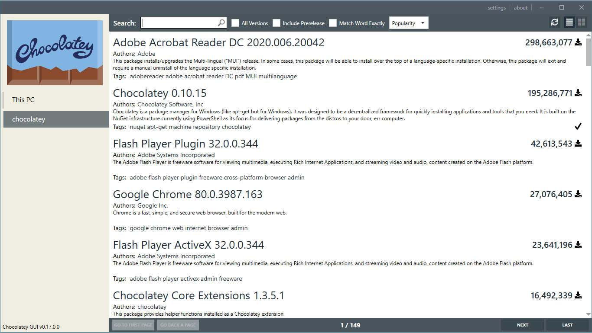

---
{
	title: "Setup a Development Environment in Windows",
	description: "Many developers like MacOS or Linux for development environments, but don't know that Windows has plenty to offer. Let's explore that!",
	published: '2020-04-06T05:12:03.284Z',
	authors: ['crutchcorn'],
	tags: ['tooling', 'windows'],
	attached: [],
	license: 'cc-by-nc-sa-4'
}

---

Ask any developer running off of a Linux or macOS machine, and they'll be able to tell you what about their systems make them such a strong contender for development usage. Some of the top contenders I've heard are:

- [Package management](#package-management)
- [Terminal usage](#terminal-usage)
- Window Tiling
- Customization

What many don't know is that Windows has gained many of these options over the years. Between official tooling such as WSL2 right around the corner to third-party offerings becoming more-and-more mature, there's never been a better time to be a developer on the Windows platform.

Moreover, much of what we'll be taking a look at today is either free, open-source, or both! There will be a few mentions of paid software as alternatives to free options, but I've personally used every paid software that I'll be mentioning.

> I understand that for some, Windows simply isn't their cup of tea. Additionally, I acknowledge that other platforms may do things *_better_* than Windows can. However, Windows is undisputedly a cheaper option than MacOS and often required for application usage where WINE and others fall flat. Just keep an open mind and understand that this isn't a put-down of other options.

# Package Management {#package-management}

When it comes to CLI package management on Windows, nothing beats [Chocolatey](https://chocolatey.org/). [It only takes a single PowerShell command to install](https://chocolatey.org/install), not unlike [Homebrew for macOS](https://brew.sh/). The comparisons with Homebrew don't stop there, either; Much like it, Chocolatey is an unofficial repository of software but does include checks of verification for a select number of popular packages.

It's also popular amongst sysadmins due to its ease of deployment across multiple devices and stability.

You'll need to run in an administrator window, but once you do, you'll find the utility straightforward. A simple `choco search package-name` will find related packages to the name you input where areas `choco install package-name` will install the package.

## Manage Packages via GUI {#chocolatey-gui}

Readers, I won't lie to you. I'm not the kind of person to use CLIs for everything. I see their worth entirely, but it's simply not my strong suit remembering various commands even if I understand the core concepts entirely. For people like me, you might be glad to hear that _Chocolatey has a GUI for installing, uninstalling, updating, and searching packages_. It's as simple as (Chocolate) pie!


You can see that it gives a list of installed packages with a simple at-glance view of what packages need updating.



## Suggested Packages {#suggested-packages}

While Chocolatey has a myriad of useful packages to developers, there are some packages that I have installed on my local machine that I'd like to highlight.

For starters, what's a developer machine without `git`? Let's throw that on:

```
choco install git.install
```

Additionally, I know a lot of developers would like to have access to common GNU utilities, such as `rm` and `touch`. Using an install flag, you're able to add those to your path for usage:

```
choco install git.install--params "/GitAndUnixToolsOnPath"
```

### CLI Utilities {#cli-packages}

| Package Name | Explanation                                                  |
| ------------ | ------------------------------------------------------------ |
| `micro`      | A great terminal editor (ala Nano). It even supports using mouse usage! |
| `bat`        | A great alternative to `cat` with line numbers and syntax highlighting |
| `gh`         | GitHub's official CLI for managing issues, PRs, and more     |
| `nvm`        | "Node version manager" - Enables users to have multiple installs of different Node versions and dynamically switch between them |
| `yarn`       | An alternative to `npm` with better monorepo support. If installed through `choco`, it will support `nvm` switching seamlessly. |

You're able to install all of these packages using `choco install micro bat gh nvm yarn`.

### IDEs {#ides}

| Package Name                                                 | Explanation                                                |
| ------------------------------------------------------------ | ---------------------------------------------------------- |
| `vscode`                                                     | Popular Microsoft IDE for many languages                   |
| `sublimetext3`                                               | Popular text editor with syntax support for many languages |
| `visualstudio2019professional` / `visualstudio2019community` | Microsoft's flagship IDE                                   |

You're able to install all of these packages using:

```
choco install vscode sublimetext3 visualstudio2019community
```

### Others {#utilities}

| Package Name                               | Explanation                                                  |
| ------------------------------------------ | ------------------------------------------------------------ |
| `powertoys`                                | Built by MS itself, provides SVG/Markdown previews, provides utility for mass renaming, image resizing all from the file explorer itself. It also allows you to configure tiling and more. We'll talk about this more later |
| `virtualbox`                               | A program that allows you to create, run, and edit virtual machines |
| `virtualbox-guest-additions-guest.install` | The extension to `virtualbox` that provides better USB passthrough support |
| `firacode`                                 | A popular programming font that supports ligatures           |
| `scrcpy`                                   | A utility that allows you to mirror your Android phone screen via ADB |
| `typora`                                   | A markdown editor with a "preview edit" mode allowing you to edit markdown files similarly to Word |
| `postman`                                  | A REST API tester                                            |
| `Firefox`                                  | The popular web browser by Mozilla                           |
| `licecap`                                  | A quick-and-easy GIF capture software                        |
| `7zip`                                     | Compressed file format manager. Allows you to extract files from various formats |
| `jdk` / `jre`                              | Java runtime and development kit                             |

You're able to install all of these packages using:

```
choco install powertoys virtualbox virtualbox-guest-additions-guest.install firacode scrcpy typora postman Firefox licecap 7zip jdk jre
```

## Windows Store {#windows-store}

I'm sure some avid Microsoft fans will have pointed out by now that I forgot something. You know, the official solution by Microsoft? Naturally, I haven't forgotten about the Windows Store.

While some of you may be surprised to hear this, the Microsoft Store has gained a fair number of development tools on its storefront. For example, there's now a package for Python that's now there. You're also able to get quick updates for all of your apps and seamlessly integrate them as-if they were typical windows apps.


# Terminal Usage {#terminal-usage}

Terminal usage is essential for most developers. It's a relatively universal utility regardless of what form of programming you're into. It's important to make sure that your terminal is fully featured for functionality and customizable for tastes and fun.


## Terminal Options {#terminals}

One of the most important elements to one's terminal usage is, well, the terminal itself! While Windows has not historically had many options in this regard, things have turned around in recent years. Additional to the built-in CMD and PowerShell windows, we now have many newcomers, including one from Microsoft itself.

First, let's start with the unofficial offerings. We have many options, but the two I want to highlight is `Cmder` and `Terminus`.

### Cmder {#cmder}

[Cmder is an open-source terminal offering](https://github.com/cmderdev/cmder) built on top of a long-standing base called [ConEmu](https://conemu.github.io/). It provides a massive set of configurations that I think make the terminal much more useful and pretty. For example, this is the default view of Cmder:


As you can see, there's some custom logic for embedding Git metadata in the prompt, a custom `λ` prompt, and even contains some logic for more effective tab autocomplete. You're even able to install it via Chocolatey using `choco install cmder`! 

The terminal itself contains all kinds of functionality:

- Multi-line copy+paste
- Tiling
- Tabs
- Customizable UI

Those are just the features at the top of my head! What's nice about Cmder is that even if you don't use the terminal itself, you can use the configurations for CMD and PowerShell with other shells if you'd like. All of the screenshots for the other terminals will be shown using the Cmder configs.

### Terminus {#terminus}

Terminus is another excellent option for those looking for alternative terminal shells. Because it's rendered using web tech, it's UI is much more customizable. It also has an easy-to-install plugin system to add further functionality to the shell. What you're seeing is the initial out-of-the-box experience [with the Cmder configuration applied](https://github.com/cmderdev/cmder/wiki/Seamless-Terminus-Integration)


### Windows Terminal {#windows-terminal}

Last, but certainly not least, we have the newly-introduced Windows Terminal. This is the new terminal that's being built by Microsoft themselves. [The project is open-source](https://github.com/microsoft/terminal) and the preview is even installable   [via the Windows Store](https://aka.ms/windowsterminal).


This terminal shell has been the most stable in my usage. It supports tabs, a highly customizable UI, and different tabs with the different shells supported.

#### Cmder Integration {#windows-terminal-cmder}

While Cmder integration with Windows Terminal is relatively trivial, it's not very well documented. Let's walk through how to do so.

You'll want to start by making sure you have an environmental variable called `cmder_root`. This should be set up by default if you installed it using `choco`, but if you're unsure, you can check manually. [We outline how to set environmental variables in this article](#env-variables).

Once we're sure that we have the configuration setup properly, we'll open up the settings file in Windows Terminal by pressing the dropdown button and selecting "Settings."


Once this is done, update your `cmd` setting to have the following `commandline` config property:

```json
"commandline": "cmd.exe /k %cmder_root%/vendor/init.bat",
```

You can even do so for PowerShell:

```json
"commandline": "powershell.exe -ExecutionPolicy Bypass -NoLogo -NoProfile -NoExit -Command \"Invoke-Expression 'Import-Module ''%cmder_root%/vendor/profile.ps1'''\"",
```

This is what my `profiles` looks like all together:

```json
"profiles": [
    {
        "guid": "{5b4ef9a8-4506-4ac9-930a-5eb1fd0ebf20}",
        "name": "Cmder",
        "commandline": "cmd.exe /k %cmder_root%/vendor/init.bat",
        "icon": " %cmder_root%/icons/cmder.ico",
        "hidden": false,
        "startingDirectory": "%USERPROFILE%/git"
    },
    {
        "guid": "{61c54bbd-c2c6-5271-96e7-009a87ff44bf}",
        "name": "Windows PowerShell",
        "commandline": "powershell.exe -ExecutionPolicy Bypass -NoLogo -NoProfile -NoExit -Command \"Invoke-Expression 'Import-Module ''%cmder_root%/vendor/profile.ps1'''\"",
        "hidden": false,
        "startingDirectory": "%USERPROFILE%/git",
    },
],
```

Finally, if you want to set one of these profiles as default (I wanted to make my new PowerShell config default), you can update the `defaultProfile ` parameter at the top of the file. Mine looked like this:

```json
"defaultProfile": "{61c54bbd-c2c6-5271-96e7-009a87ff44bf}",
```

#### Color Configuration {#windows-terminal-colors}

Windows terminal also supports customization of the colors for the terminal, among other things. The color settings I used for the screenshot above is the Dracula color theme.  You can add that color theme by adding the following to the `schemes` array in the `profiles.json` file:

```json
"schemes": [
    {
        "name" : "Dracula",
        "background" : "#282A36",
        "black" : "#21222C",
        "blue" : "#BD93F9",
        "brightBlack" : "#6272A4",
        "brightBlue" : "#D6ACFF",
        "brightCyan" : "#A4FFFF",
        "brightGreen" : "#69FF94",
        "brightPurple" : "#FF92DF",
        "brightRed" : "#FF6E6E",
        "brightWhite" : "#FFFFFF",
        "brightYellow" : "#FFFFA5",
        "cyan" : "#8BE9FD",
        "foreground" : "#F8F8F2",
        "green" : "#50FA7B",
        "purple" : "#FF79C6",
        "red" : "#FF5555",
        "white" : "#F8F8F2",
        "yellow" : "#F1FA8C"
    }
],
```

Then, for each of the profiles you want to have that color scheme, add the following property:

```
"colorScheme": "Dracula"
```

Resulting in the following for my PowerShell config:

```json
{
    "guid": "{61c54bbd-c2c6-5271-96e7-009a87ff44bf}",
    "name": "Windows PowerShell",
    "commandline": "powershell.exe -ExecutionPolicy Bypass -NoLogo -NoProfile -NoExit -Command \"Invoke-Expression 'Import-Module ''%cmder_root%/vendor/profile.ps1'''\"",
    "hidden": false,
    "startingDirectory": "%USERPROFILE%/git",
    "colorScheme": "Dracula"
}
```

## Make Configuration Changes {#terminal-system-config}

While terminals are important, another factor to be considered is the configuration of those terminal shells. It's important to keep system-level configuration settings in mind as well. For example, if you need to [make or modify environmental variables](#env-variables) or [make changes with the system path](#env-path). Luckily for us, they both live on the same path. As such, let's showcase how to reach the dialog that contains both of these settings before explaining each one in depth.


After this, select "Advanced system settings."


After this, a dialog should pop up. This dialog should contain as one of the lower buttons "Environmental variables," which is where settings for both environmental variables and path should live.


### Environmental Variables {#env-variables}

When working with the CLI, it's often important to have environmental variables to customize the functionality of a utility or program. Because Windows has the concept of users, there are two kinds of environment variables that can be set:

- User-specific
- System-level

Each of them follows their namesakes in their usage. If I set a user-specific environmental variable and change users, I will not receive the same value as the user I'd set the variable for. Likewise, if I set it for the system, it will apply to all users. The top of the "environmental variables" section applies to the user-level, whereas the bottom level applies to the system. 

In order to add a new one, simply select "New" on whichever level you want to create the environmental variables on. You should see this dialog appear:


Simply add the name of the variable and the value of the environmental variable to continue.

You're able to do the same with editing a variable. Simply find the variable, highlight it, then select "Edit" and follow the same process.

### Adding Items to Path {#env-path}

Have you ever run into one of these errors?

- `The term 'program-name' is not recognized as the name of a cmdlet, function, script file, or operable program.`
- `'program-name' is not recognized as an internal or external command, operable program or batch file.`

It could be because you don't have the program attached to your system path. Your path is what dictates what scripts and programs you're able to access globally. For example, there's a tool that I like to use [to count the LOC I have in a given project: `scc`](https://github.com/boyter/scc). This project is incredibly useful for quick estimations for fun. The problem? It doesn't live on Chocolatey and doesn't have an MSI installer. This means that it's harder to access via the terminal. Well, no longer! [If I download the ZIP from the releases tab](https://github.com/boyter/scc/releases), and extract it, I'll see that it contains a file called `scc.exe`. If I move that folder to `C:\tools\scc` and add it to the path, then I can use it in the terminal as if it were any other global util.


In order to add the file to the path, I need to edit the `path` environmental variable.

> [Just as there are two sets of environmental variables](#env-path), there are two sets of `path` env variables. As such, you'll have to decide if you want all users to access a variable or if you want to restrict it to your current user. In this example, I'll be adding it to the system. 

Find the `path` environmental variable and select `"Edit."` 


Just as before, you're able to delete and edit a value by highlighting and pressing the respective buttons to the left. Otherwise, you can press "new" which will allow you to start typing. Once you're done, you can press "OK" to save your new path settings.

> In order to get SCC running, you may have to close and then re-open an already opened terminal window. Otherwise, running `refreshenv` often updates the path so that you can use the new commands.