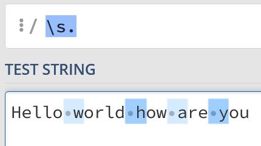
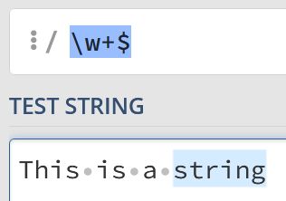
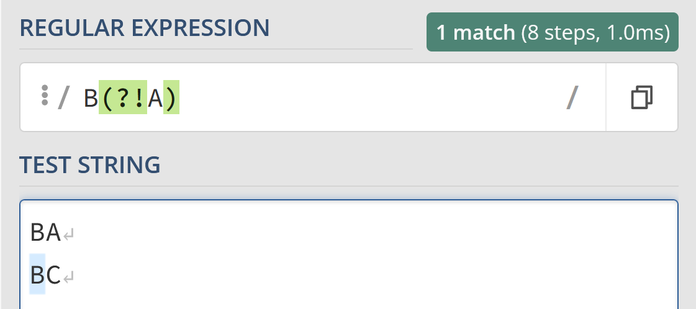
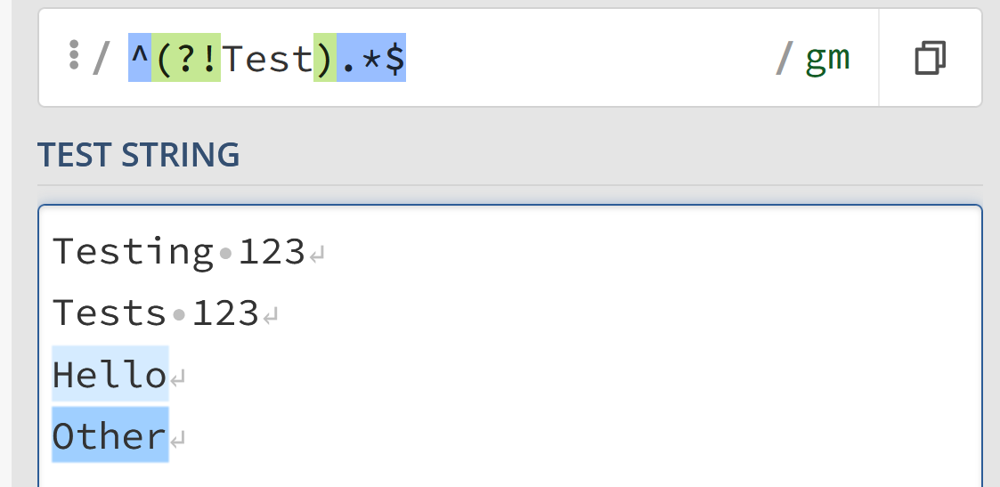

---
{
    title: "The Complete Guide to Regular Expressions (Regex)",
    description: "A Regular Expression – or regex for short – is a syntax that allows you to match strings with specific patterns. Think of it as a suped-up text search",
    published: '2022-04-17T22:12:03.284Z',
    authors: ['crutchcorn'],
    tags: ['regex', 'computer science'],
    attached: [],
    license: 'coderpad',
    originalLink: 'https://coderpad.io/blog/development/the-complete-guide-to-regular-expressions-regex/'
}
---

A Regular Expression – or regex for short– is a syntax that allows you to match strings with specific patterns. Think of it as a suped-up text search shortcut, but a regular expression adds the ability to use quantifiers, pattern collections, special characters, and capture groups to create extremely advanced search patterns.
Regex can be used any time you need to query string-based data, such as:

- Analyzing command line output
- Parsing user input
- Examining server or program logs
- Handling text files with a consistent syntax, like a CSV
- Reading configuration files
- Searching and refactoring code

While doing all of these is _theoretically_ possible without regex, when regexes hit the scene they act as a superpower for doing all of these tasks.

In this guide we'll cover:

- [What does a regex look like?](#what-does-a-regex-look-like)
- [How to read and write a regex](#how-to-read-write-regex)
  - [What's a "quantifier"?](#quantifiers)
  - [What's a "pattern collection"?](#pattern-collections)
  - [What's a "regex token"?](#general-tokens)
- [How to use a regex](#how-to-use-a-regex)
- [What's a "regex flag"?](#flags)
- [What's a "regex group"?](#groups)

> [Download our Regex Cheat Sheet](https://coderpad.io/regular-expression-cheat-sheet/)

# What does a regex look like? {#what-does-a-regex-look-like}

In its simplest form, a regex in usage might look something like this:


> This screenshot is of the [regex101 website](https://regex101.com/). All future screenshots will utilize this website for visual reference.

In the "Test" example the letters test formed the search pattern, same as a simple search.
These regexes are not always so simple, however. Here's a regex that matches 3 numbers, followed by a "-", followed by 3 numbers, followed by another "-", finally ended by 4 numbers.

You know, like a phone number:

```
^(?:\d{3}-){2}\d{4}$
```


This regex may look complicated, but two things to keep in mind:

1. We'll teach you how to read and write these in this article
2. This is a fairly complex way of writing this regex.

In fact, most regexes can be written in multiple ways, just like other forms of programming. For example, the above can be rewritten into a longer but slightly more readable version:

```
^[0-9]{3}-[0-9]{3}-[0-9]{4}$
```

> Most languages provide a built-in method for searching and replacing strings using regex. However, each language may have a different set of syntaxes based on what the language dictates.
>
> In this article, we'll focus on the ECMAScript variant of Regex, which is used in JavaScript and shares a lot of commonalities with other languages' implementations of regex as well.

# How to read (and write) regexes {#how-to-read-write-regex}

## Quantifiers {#quantifiers}

Regex quantifiers check to see how many times you should search for a character.

Here is a list of all quantifiers:

- `a|b` - Match either "a" or "b
- `?` - Zero or one
- `+` - one or more
- `*` - zero or more
- `{N}` - Exactly N number of times (where N is a number)
- `{N,}` - N or more number of times (where N is a number)
- `{N,M}` - Between N and M number of times (where N and M are numbers and N < M)
- `*?` - Zero or more, but stop after first match

For example, the following regex:

```
Hello|Goodbye
```

Matches both the string "Hello" and "Goodbye".

Meanwhile:

```
Hey?
```

Will track "y" zero to one time, so will match up with "He" and "Hey".

Alternatively:

```
Hello{1,3}
```

Will match "Hello", "Helloo", "Hellooo", but not "Helloooo", as it is looking for the letter "o" between 1 and 3 times.

These can even be combined with one another:

```
He?llo{2}
```

Here we're looking for strings with zero-to-one instances of "e" and the letter "o" times 2, so this will match "Helloo" and "Hlloo".

### Greedy matching

One of the regex quantifiers we touched on in the previous list was the `+` symbol. This symbol matches one or more characters. This means that:

```
Hi+
```

Will match everything from "Hi" to "Hiiiiiiiiiiiiiiii". This is because all quantifiers are considered "greedy" by default.

However, if you change it to be "lazy" using a question mark symbol (`?`) to the following, the behavior changes.

```
Hi+?
```

Now, the `i` matcher will try to match as few times as possible. Since the `+` icon means "one or more", it will only match one "i". This means that if we input the string "Hiiiiiiiiiii", only "Hi" will be matched.

While this isn't particularly useful on its own, when combined with broader matches like the the `.` symbol, it becomes extremely important as we'll cover in the next section. The `.` symbol is used in regex to find "any character".

Now if you use:

```
H.*llo
```

You can match everything from "Hillo" to "Hello" to "Hellollollo".


However, what if you want to only match "Hello" from the final example?

Well, simply make the search lazy with a `?` and it'll work as we want:

```
H.*?llo
```


## Pattern collections {#pattern-collections}

Pattern collections allow you to search for a collection of characters to match against. For example, using the following regex:

```
My favorite vowel is [aeiou]
```

You could match the following strings:

```
My favorite vowel is a
My favorite vowel is e
My favorite vowel is i
My favorite vowel is o
My favorite vowel is u
```

But nothing else.

Here's a list of the most common pattern collections:

- `[A-Z]` - Match any uppercase character from "A" to "Z"
- `[a-z]` - Match any lowercase character from "a" to "z"
- `[0-9]` - Match any number
- `[asdf]` - Match any character that's either "a", "s", "d", or "f"
- `[^asdf]` - Match any character that's not any of the following: "a", "s", "d", or "f"

You can even combine these together:

- `[0-9A-Z]` - Match any character that's either a number or a capital letter from "A" to "Z"
- `[^a-z]` - Match any non-lowercase letter

## General tokens {#general-tokens}

Not every character is so easily identifiable. While keys like "a" to "z" make sense to match using regex, what about the newline character?

> The "newline" character is the character that you input whenever you press "Enter" to add a new line.

- `.` - Any character
- `\n` - Newline character
- `\t` - Tab character
- `\s` - Any whitespace character (including `\t`, `\n` and a few others)
- `\S` - Any non-whitespace character
- `\w` - Any word character (Uppercase and lowercase Latin alphabet, numbers 0-9, and `_`)
- `\W` - Any non-word character (the inverse of the `\w` token)
- `\b` - Word boundary: The boundaries between `\w` and `\W`, but matches in-between characters
- `\B` - Non-word boundary: The inverse of `\b`
- `^` - The start of a line
- `$` - The end of a line
- `\\ `- The literal character ""

So if you wanted to remove every character that starts a new word you could use something like the following regex:

```
\s.
```

And replace the results with an empty string. Doing this, the following:

```
Hello world how are you
```

Becomes:

```
Helloorldowreou
```



## Combining with collections

These tokens aren't just useful on their own, though! Let's say that we want to remove any uppercase letter or whitespace character. Sure, we could write

```
[A-Z]|\s
```

But we can actually merge these together and place our `\s` token into the collection:

```
[A-Z\s]
```


We're using a regex `/[A-Z\s]/` to look for uppercase letters and whitespaces in the string "Hello World how are you"

## Word boundaries

In our list of tokens, we mentioned `\b` to match word boundaries. I thought I'd take a second to explain how it acts a bit differently from others.

Given a string like "This is a string", you might expect the whitespace characters to be matched – however, this isn't the case. Instead, it matches between the letters and the whitespace:


This can be tricky to get your head around, but it's unusual to simply match against a word boundary. Instead, you might have something like the following to match full words:

```
\b\w+\b
```


You can interpret that regex statement like this:

"A word boundary. Then, one or more 'word' characters. Finally, another word boundary".

## Start and end line

Two more tokens that we touched on are `^` and `$`. These mark off the start of a line and end of a line, respectively.

So, if you want to find the first word, you might do something like this:

```
^\w+
```

To match one or more "word" characters, but only immediately after the line starts. Remember, a "word" character is any character that's an uppercase or lowercase Latin alphabet letters, numbers 0-9, and `_`.


Likewise, if you want to find the last word your regex might look something like this:

```
\w+$
```



However, just because these tokens **typically** end a line doesn't mean that they can't have characters after them.

For example, what if we wanted to find every whitespace character between newlines to act as a basic [JavaScript minifier](https://en.wikipedia.org/wiki/Minification_\(programming\))?

Well, we can say "Find all whitespace characters after the end of a line" using the following regex:

```
$\s+
```


## Character escaping

While tokens are super helpful, they can introduce some complexity when trying to match strings that actually contain tokens. For example, say you have the following string in a blog post:

```
"The newline character is '\n'"
```

Or want to find every instance of this blog post's usage of the "\n" string. Well, you can escape characters using `\`. This means that your regex might look something like this:

```
\\n
```

# How to use a regex {#how-to-use-a-regex}

Regular expressions aren't simply useful for _finding_ strings, however. You're also able to use them in other methods to help modify or otherwise work with strings.

While many languages have similar methods, let's use JavaScript as an example.

## Creating and searching using regex

First, let's look at how regex strings are constructed.

In JavaScript (along with many other languages), we place our regex inside of `//` blocks. The regex searching for a lowercase letter looks like this:

```javascript
/[a-z]/
```

This syntax then generates [a RegExp object](https://developer.mozilla.org/en-US/docs/Web/JavaScript/Reference/Global_Objects/RegExp) which we can use with [built-in methods, like `exec`](https://developer.mozilla.org/en-US/docs/Web/JavaScript/Reference/Global_Objects/RegExp/exec), to match against strings.

```javascript
/[a-z]/.exec("a"); // Returns ["a"]
/[a-z]/.exec("0"); // Returns null
```

We can then use this [truthiness](https://developer.mozilla.org/en-US/docs/Glossary/Truthy) to determine if a regex matched, like we're doing in line #3 of this example:

<iframe loading="lazy" src="https://app.coderpad.io/sandbox?question_id=211635"></iframe>

We can also alternatively call a `RegExp` constructor with the string we want to convert into a regex:

```javascript
const regex = new RegExp("[a-z]"); // Same as /[a-z]/
```

## Replacing strings with regex

You can also use a regex to search and replace a file's contents as well. Say you wanted to replace any greeting with a message of "goodbye". While you could do something like this:

```javascript
function youSayHelloISayGoodbye(str) {
  str = str.replace("Hello", "Goodbye");
  str = str.replace("Hi", "Goodbye");
  str = str.replace("Hey", "Goodbye");  str = str.replace("hello", "Goodbye");
  str = str.replace("hi", "Goodbye");
  str = str.replace("hey", "Goodbye");
  return str;
}
```

There's an easier alternative, using a regex:

```javascript
function youSayHelloISayGoodbye(str) {
  str = str.replace(/[Hh]ello|[Hh]i|[Hh]ey/, "Goodbye");
  return str;
}
```

<iframe loading="lazy" src="https://app.coderpad.io/sandbox?question_id=211638"></iframe>

However, something you might notice is that if you run `youSayHelloISayGoodbye` with "Hello, Hi there": it won't match more than a single input:


If the regex /\[Hh]ello|\[Hh]i|\[Hh]ey/ is used on the string "Hello, Hi there", it will only match "Hello" by default.

Here, we should expect to see both "Hello" and "Hi" matched, but we don't.

This is because we need to utilize a Regex "flag" to match more than once.

# Flags {#flags}

A regex flag is a modifier to an existing regex. These flags are always appended after the last forward slash in a regex definition.

Here's a shortlist of some of the flags available to you.

- `g` - Global, match more than once
- `m` - Force $ and ^ to match each newline individually
- `i` - Make the regex case insensitive

This means that we could rewrite the following regex:

```javascript
/[Hh]ello|[Hh]i|[Hh]ey/
```

To use the case insensitive flag instead:

```javascript
/Hello|Hi|Hey/i
```

With this flag, this regex will now match:

```
Hello
HEY
Hi
HeLLo
```

Or any other case-modified variant.

## Global regex flag with string replacing

As we mentioned before, if you do a regex replace without any flags it will only replace the first result:

```javascript
let str = "Hello, hi there!";
str = str.replace(/[Hh]ello|[Hh]i|[Hh]ey/, "Goodbye");
console.log(str); // Will output "Goodbye, hi there"
```

However, if you pass the `global` flag, you'll match every instance of the greetings matched by the regex:

```javascript
let str = "Hello, hi there!";
str = str.replace(/[Hh]ello|[Hh]i|[Hh]ey/g, "Goodbye");
console.log(str); // Will output "Goodbye, hi there"
```

## A note about JavaScript's global flag

When using a global JavaScript regex, you might run into some strange behavior when running the `exec` command more than once.

In particular, if you run `exec` with a global regex, it will return `null` every other time:

This is because, as [MDN explains](https://developer.mozilla.org/en-US/docs/Web/JavaScript/Reference/Global_Objects/RegExp/exec):

> JavaScript[ RegExp](https://developer.mozilla.org/en-US/docs/Web/JavaScript/Reference/Global_Objects/RegExp) objects are **stateful** when they have the[ global](https://developer.mozilla.org/en-US/docs/Web/JavaScript/Reference/Global_Objects/RegExp/global) or[ sticky](https://developer.mozilla.org/en-US/docs/Web/JavaScript/Reference/Global_Objects/RegExp/sticky) flags set… They store a[ lastIndex](https://developer.mozilla.org/en-US/docs/Web/JavaScript/Reference/Global_Objects/RegExp/lastIndex) from the previous match. Using this internally, exec() can be used to iterate over multiple matches in a string of text…

The `exec` command attempts to start looking through the `lastIndex` moving forward. Because `lastIndex` is set to the length of the string, it will attempt to match `""` – an empty string – against your regex until it is reset by another `exec` command again. While this feature can be useful in specific niche circumstances, it's often confusing for new users.

To solve this problem, we can simply assign `lastIndex` to 0 before running each `exec` command:


# Groups {#groups}

When searching with a regex, it can be helpful to search for more than one matched item at a time. This is where "groups" come into play. Groups allow you to search for more than a single item at a time.

Here, we can see matching against both `Testing 123` and `Tests 123` without duplicating the "123" matcher in the regex.

```javascript
/(Testing|tests) 123/ig
```

Groups are defined by parentheses; there are two different types of groups--capture groups and non-capturing groups:

- `(...)` - Group matching any three characters
- `(?:...)` - Non-capturing group matching any three characters

The difference between these two typically comes up in the conversation when "replace" is part of the equation.

For example, using the regex above, we can use the following JavaScript to replace the text with "Testing 234" and "tests 234":

```javascript
const regex = /(Testing|tests) 123/ig;

let str = `
Testing 123
Tests 123
`;

str = str.replace(regex, '$1 234');
console.log(str); // Testing 234\nTests 234"
```

We're using `$1` to refer to the first capture group, `(Testing|tests)`. We can also match more than a single group, like both `(Testing|tests)` and `(123)`:

```javascript
const regex = /(Testing|tests) (123)/ig;

let str = `
Testing 123
Tests 123
`;

str = str.replace(regex, '$1 #$2');
console.log(str); // Testing #123\nTests #123"
```

However, this is only true for capture groups. If we change:

```javascript
/(Testing|tests) (123)/ig
```

To become:

```javascript
/(?:Testing|tests) (123)/ig;
```

Then there is only one captured group – `(123)` – and instead, the same code from above will output something different:

```javascript
const regex = /(?:Testing|tests) (123)/ig;

let str = `
Testing 123
Tests 123
`;

str = str.replace(regex, '$1');
console.log(str); // "123\n123"
```

<iframe loading="lazy" src="https://app.coderpad.io/sandbox?question_id=211705"></iframe>

## Named capture groups

While capture groups are awesome, it can easily get confusing when there are more than a few capture groups. The difference between `$3` and `$5` isn't always obvious at a glance.

To help solve for this problem, regexes have a concept called "named capture groups"

- `(?<name>...)` - Named capture group called "name" matching any three characters

You can use them in a regex like so to create a group called "num" that matches three numbers:

```javascript
/Testing (?<num>\d{3})/
```

Then, you can use it in a replacement like so:

```javascript
const regex = /Testing (?<num>\d{3})/
let str = "Testing 123";
str = str.replace(regex, "Hello $<num>")
console.log(str); // "Hello 123"
```

## Named back reference

Sometimes it can be useful to reference a named capture group inside of a query itself. This is where "back references" can come into play.

- `\k<name>` Reference named capture group "name" in a search query

Say you want to match:

```
Hello there James. James, how are you doing?
```

But not:

```
Hello there James. Frank, how are you doing?
```

While you could write a regex that repeats the word "James" like the following:

```javascript
/.*James. James,.*/
```

A better alternative might look something like this:

```javascript
/.*(?<name>James). \k<name>,.*/
```

Now, instead of having two names hardcoded, you only have one.

<iframe loading="lazy" src="https://app.coderpad.io/sandbox?question_id=211711"></iframe>

## Lookahead and lookbehind groups

Lookahead and behind groups are extremely powerful and often misunderstood.

There are four different types of lookahead and behinds:

- `(?!)` - negative lookahead
- `(?=)` - positive lookahead
- `(?<=)` - positive lookbehind
- `(?<!)` - negative lookbehind

Lookahead works like it sounds like: It either looks to see that something _is_ after the lookahead group or _is not_ after the lookahead group, depending on if it's positive or negative.

As such, using the negative lookahead like so:

```javascript
/B(?!A)/
```

Will allow you to match `BC` but not `BA`.



You can even combine these with `^` and `$` tokens to try to match full strings. For example, the following regex will match any string that **does not** start with "Test"

```javascript
/^(?!Test).*$/gm
```



Likewise, we can switch this to a positive lookahead to enforce that our string **must** start with "Test"

```javascript
/^(?=Test).*$/gm
```


# Putting it all together

Regexes are extremely powerful and can be used in a myriad of string manipulations. Knowing them can help you refactor codebases, script quick language changes, and more!

Let's go back to our initial phone number regex and try to understand it again:

```
^(?:\d{3}-){2}\d{4}$
```

Remember that this regex is looking to match phone numbers such as:

```
555-555-5555
```

Here this regex is:

- Using `^` and `$` to define the start and end of a regex line.
- Using a non-capturing group to find three digits then a dash
  - Repeating this group twice, to match `555-555-`
- Finding the last 4 digits of the phone number

Hopefully, this article has been a helpful introduction to regexes for you. If you'd like to see quick definitions of useful regexes, check out our cheat sheet.

> [Download our Regex Cheat Sheet](https://coderpad.io/regular-expression-cheat-sheet/)
