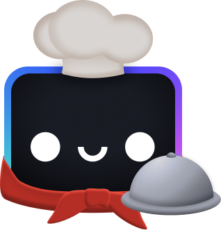

---
{
	title: "The Rear-Vue Mirror: My Journey into Open Source",
	description: "Dan Jutan finally reflects on how he got into open source.",
	published: '2023-04-10T05:12:03.284Z',
	authors: ['jutanium'],
	tags: ['open source', 'opinion', 'vue', 'solid'],
	license: 'cc-by-nc-nd-4'
}
---

People tend to find me interesting, especially my short career in open source. I look like a success story. I get paid to do what I love: build open source docs and communities. I work on projects that hundreds of thousands of people use every month, and I do it with people that I look up to and learn from every day.

Open source is software with _open_ source code, accessible by everyone. It usually starts with one person, one idea. They write it like an artist writes a song&mdash;but they publish it for anyone to remix, comment on, and contribute to. If the project succeeds, a community will form around it, sparking friendships, discussions, and innovation. 

Open source is the most rewarding thing you can do on the internet.

People ask me how I got started and what my tips are for them, so they can replicate the same experience. You can't replicate it. It's unique, circumstantial, and premised on privilege. But I do think anyone can build a life&mdash;if not a career&mdash;in open source, and I hope my story can inspire others to take a stab.

https://twitter.com/jutanium/status/1643958691379462144?s=20

My twelve-year-old self would _love_ what I do at 23.

At 12, I was learning new tech and writing tutorials. At 23, I learn new tech and write tutorials. The difference is that now people actually read the tutorials, and now I get to be friends and teammates with the people who _made_ the tech in the first place.

About halfway between 12 and 23 I learned how to build websites. Whereas previous programming languages I'd tried were self-contained, web development had me mixing HTML, CSS, and JavaScript in a chunky stew. 

Web development was hard, but it was also inherently accessible. You could get started with any editor, run your code in any browser, and share it with anyone on any device, anywhere in the world. I could build content sites or highly dynamic apps, and I could easily protoype new ideas. [I was hooked.](https://github.com/Jutanium/MathPlayground)

Before long, I realized that JavaScript alone wasn't enough to easily build complex interactive apps, which was what I was most interested in creating. I needed to learn a _framework_, a tool that extends JavaScript and makes it easier to build reusable interactive pieces.

https://twitter.com/jutanium/status/1643677722063904778?s=20

