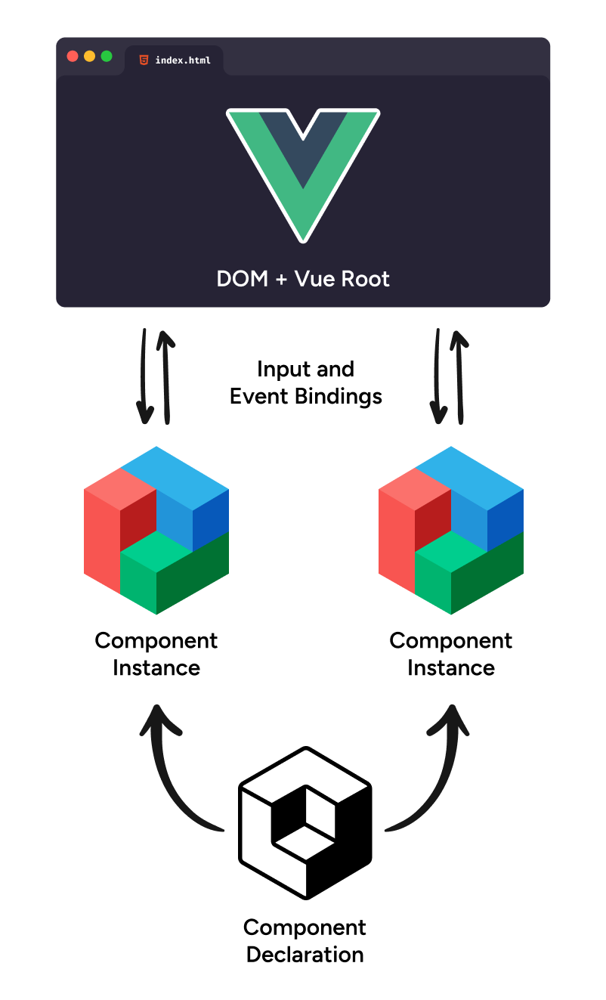
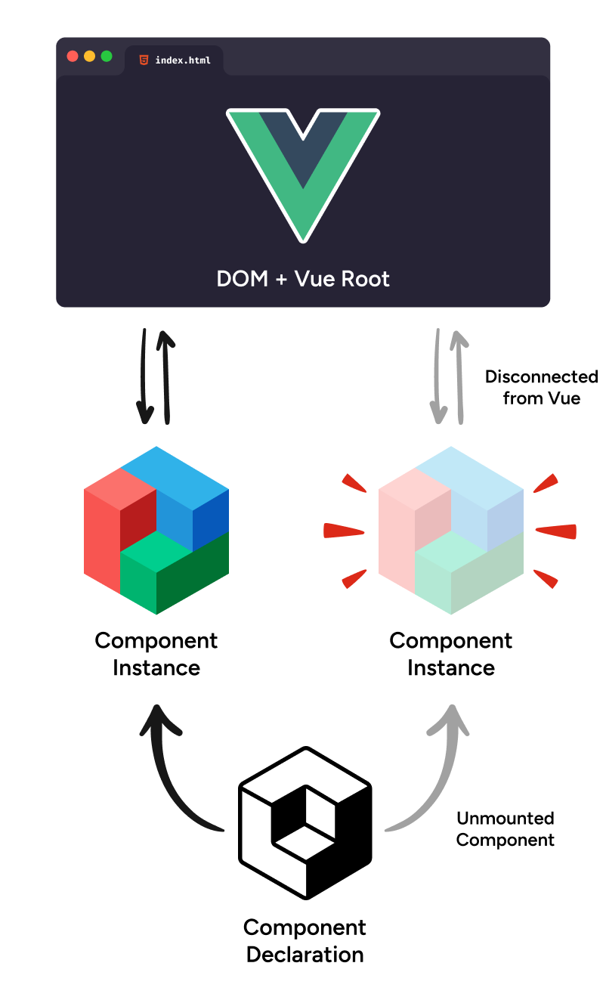

---
{
    title: "Hidden Memory Leaks in Vue",
    description: "",
    published: '2023-12-15T21:52:59.284Z',
    authors: ['crutchcorn'],
    tags: ['vue', 'webdev'],
    attached: [],
    license: 'cc-by-4'
}
---

Let's make a component that shows an alert after a second. We'll use `setTimeout` to delay the alert, and we'll use `onMounted` to set up the timeout.

We'll also use `defineProps` and `defineEmits` to allow for multiple ways to consume this component.

```vue
<!-- Alert.vue -->
<script setup>
import { onMounted } from "vue";

const emit = defineEmits(["alert"]);
const props = defineProps(["alert"]);

// We are intentionally not cleaning up `onMounted`
onMounted(() => {
	setTimeout(() => {
		emit("alert");
		props.alert?.();
		console.log("I am showing the alert");
	}, 1000);
});
</script>

<template>
	<p>Showing alert...</p>
</template>
```

Now, if we consume this component like so:

```vue {15-16}
<!-- App.vue -->
<script setup>
import { ref } from "vue";
import Alert from "./Alert.vue";

const show = ref(false);

const toggle = () => (show.value = !show.value);

const alertUser = () => alert("I am an alert!");
</script>

<template>
	<!-- Try clicking and unclicking quickly -->
	<button @click="toggle()">Toggle</button>
    <!-- Passing a function -->
	<Alert v-if="show" :alert="alertUser" />
</template>
```

We can see that the alert is shown. This is because we're setting up a timeout, and then unmounting the component before the timeout is complete. This is a memory leak, and an easy one to identify and fix because of its visibility to the user.

However, if we change this code to use an event instead of a function, we seemingly don't see the memory leak anymore.

```vue {15-16}
<!-- App.vue -->
<script setup>
import { ref } from "vue";
import Alert from "./Alert.vue";

const show = ref(false);

const toggle = () => (show.value = !show.value);

const alertUser = () => alert("I am an alert!");
</script>

<template>
	<!-- Try clicking and unclicking quickly -->
	<button @click="toggle()">Toggle</button>
    <!-- Passing an event -->
    <Alert v-if="show" @alert="alertUser()" />
</template>
```

Try it for yourself:

<iframe data-frame-title="Vue Unmounted Emit Behavior Demo - StackBlitz" src="uu-code:./vue-unmounted-behavior?embed=1&file=src/App.vue" sandbox="allow-modals allow-forms allow-popups allow-scripts allow-same-origin"></iframe>

# Why does this happen?

This difference in behavior occurs because Vue cleans up inter-component event listeners when a component is unmounted.

> What does that mean?

Well, when you think about how Vue components work, you might visualize them akin to this:



Here, we can see that despite there being one component declaration:

```vue
<!-- Comp.vue -->
<script setup>
  const obj = {};
</script>

<template>
  <p>Hello, world</p>
</template>
```

Every time we use this component:

```vue {6-9}
<!-- App.vue -->
<script setup>
import Comp from "./Comp.vue";
</script>

<template>
  <!-- One: -->
  <Comp/>
  <!-- Two: -->
  <Comp/>
</template>
```

Each of the individual `Comp` usages generates a component _instance_. These instances have their own separate memory usage, which
allows you to control state from them both independently from one another.

Moreover, though, because each component instance has its own connection to the Vue root instance,
it can do some cleanup of event listeners when an instance is detached without impacting other instances:



It's important to note that this disconnect is why we see different behavior between passing a function and using an event
to trigger a function call in the parent;

**While Vue is able to detach event listeners to a specific component instance,
it lacks the ability to remove a reference of a function passed to it,
[as the component already has a reference to that function's memory location](/posts/object-mutation)**.
After all, [a function is just a value in JavaScript](/posts/javascript-functions-are-values).

While this behavior allows our users to avoid seeing the alert, it also means that we're still leaking memory.

# Comparison to Other Frameworks

While this disconnect of props and event bindings seems sensible and works well with Vue's established patterns, it's not
the way many other frameworks handle things.

Let's take a look at some of the other frameworks and see how they do it.

<!-- tabs:start -->

## React

While Vue and Angular both have methods for being able to emit an event from a child to a parent, React's method of doing
so is entirely based on passing a function from a parent to a child, then calling said function in the child:

```jsx
const Alert = ({alert}) => {
    useEffect(() => {
        setTimeout(() => {
            alert();
        }, 1000)
    })
    
    return (
        <p>Showing alert...</p>
    )
}
const App = () => {
    const [show, setShow] = useState(false);
    const alertUser = () => alert("I am an alert!");

    return (
        <>
            <button onClick={() => setShow(!show)}>Toggle</button>
            {show && <Alert alert={alertUser}/>}
        </>
    )
}
```

<iframe data-frame-title="React Unmounted Emit Behavior Demo - StackBlitz" src="uu-code:./react-unmounted-behavior?embed=1&file=src/main.jsx" sandbox="allow-modals allow-forms allow-popups allow-scripts allow-same-origin"></iframe>

// TODO: Write

## Angular

Angular behaves the same as Vue?!?!

```typescript
@Component({
    selector: "app-alert",
    standalone: true,
    template: `
        <p>Showing alert...</p>
    `
})
class AlertComponent implements OnInit {
    @Output() alert = new EventEmitter();

    ngOnInit() {
        setTimeout(() => {
            this.alert.emit();
        }, 1000)
    }
}

@Component({
    selector: "app-root",
    standalone: true,
    imports: [AlertComponent, NgIf],
    template: `
        <button (click)="toggle()">Toggle</button>
        <app-alert *ngIf="show" (alert)="alertUser()"/>
    `
})
class AppComponent {
    show = false;
    
    toggle() {
        this.show = !this.show;
    }

    alertUser() {
        alert("I am an alert!");
    }
}
```

<iframe data-frame-title="React Unmounted Emit Behavior Demo - StackBlitz" src="uu-code:./react-unmounted-behavior?embed=1&file=src/main.ts" sandbox="allow-modals allow-forms allow-popups allow-scripts allow-same-origin"></iframe>

// TODO: Write

<!-- tabs:end -->
