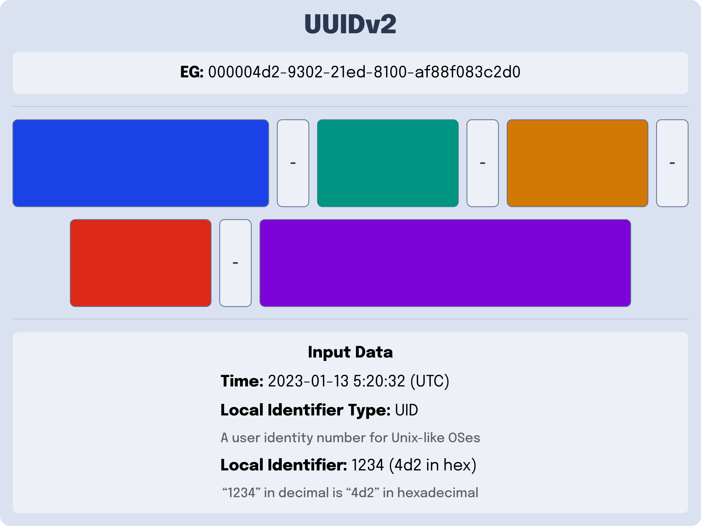

---
{
    title: "What are UUIDs?",
    description: "",
    published: '2023-02-20T21:52:59.284Z',
    authors: ['crutchcorn'],
    tags: ['computer science'],
    attached: [],
    license: 'cc-by-4'
}
---

Oftentimes, in computer programming, you'll find yourself needing a way to give a unique identifier to a digital asset. Whether those are books in your "To Read" digital bookshelf, computers on your network, or anything in between; you need a quick and easy way to access that data with an ID that's distinct.

If you've done much research on this problem, you'll likely have heard of a "universally unique identifier" (UUID) or "globally unique identifier" (GUID); a way to generate IDs for these assets quickly. After all, UUID usage is wide reaching in the software industry.

While it's good to recognize popular technologies, a few questions remain:

- What is a UUID?
- What are the various versions of UUID?
- Why are they so widely utilized?

# What is a UUID?

Broadly speaking, a UUID is a numerical value of 128 bits that can be used to provide an identification number to a resource. 

While there are multiple different kinds of UUIDs, which we'll touch on shortly, all UUID formats follow a few general ideas.

**First**; UUIDs are, for all intents and purposes, unique. While that might seem obvious, here's the part that isn't: The garuntee that a number is unqiue does not require previous knowledge of other generated UUIDs.

This differs from a simple counter up from `0`, where you would need to lookup the previous number stored in order to generate a new number. 

> We'll explore why this has led to UUID's prolific usage at the end of the article.

**Second**; While it's not literally impossible to generate two UUIDs with the same value, it's generally safe to assume that it's _nearly_ impossible.

**Finally**, all UUIDs are formatted in a similar manner. The numerical value of the UUID is encoded into a string of [hexidecimal numbers](/posts/non-decimal-numbers-in-tech) and dashes (`-`) when displayed a string. An example UUIDv4 might be formatted to look something like this:

```
a5abec44-7ce0-437c-972a-cf451b4fde2b
```

Two of these characters include information about which kind of UUID it is:

```
xxxxxxxx-xxxx-Mxxx-Nxxx-xxxxxxxxxxxx
```

Here, `M` is the UUID version number, while `N` is the variant of UUID version. Think of this as information encoded within the UUID _about_ the UUID generation process that yeilded the output value. 

> While we'll explain what the UUID "version" is in the next section, let's quickly explain what the "variant" means:
>
> - If the variant is `0` through `7`, it means the UUID is backwards compatible with [**very** old computer systems from the 1980s](https://en.wikipedia.org/wiki/Apollo_Computer).
> - If the variant is `8` through `b`, it means the UUID is part of [the "RFC 4122" standard](https://www.ietf.org/rfc/rfc4122.txt)
> - If the variant is `c` or `d`, it means the UUID is compatible with early Windows systems
> - Variants `e` and `f` are reserved for future UUID versions

This means that we can take the previous UUID:

```
a5abec44-7ce0-437c-972a-cf451b4fde2b
```

And determine that this is a UUID with the version of `4` and the variant of `9`.

> Speaking of "UUID version numbers", what are those? I know we outlined earlier that there were different ways of generating an UUID; what are they?

I'm glad you asked.

# What are the different types of UUID?

A "UUID version" outlines which type of UUID you're generating; each version of UUID has a different generation mechanism, and therefore different usecases.

At the time of writing, [there are 5 different types of UUIDs](https://ietf-wg-uuidrev.github.io/rfc4122bis/draft-00/draft-ietf-uuidrev-rfc4122bis.html) that are part of [the official UUID specification](https://datatracker.ietf.org/doc/html/rfc4122):

- [UUIDv1](#UUIDv1)
  - A machine's network card information + a timestamp
- [UUIDv2](#UUIDv2)
  - UUIDv1 + Obscure Security Stuff (it's complicated)
- [UUIDv3](#UUIDv3and5)
  - Encode a string using MD5
- [UUIDv4](#UUIDv4)
  - Random UUID with effectively zero chance of producing the same number twice
- [UUIDv5](#UUIDv3and5)
  - UUIDv3 but more secure (uses SHA-1)

## Track Network Systems Using UUIDv1 {#UUIDv1}


https://www.mparticle.com/blog/what-is-a-uuid/

https://ietf-wg-uuidrev.github.io/rfc4122bis/draft-00/draft-ietf-uuidrev-rfc4122bis.html#name-uuid-version-1

https://www.sohamkamani.com/uuid-versions-explained/

https://versprite.com/blog/universally-unique-identifiers/


### Pros of UUIDv1

- **Low likelyhood of collision**: While Mac addresses are not _truly_ unique, [thanks to vender re-use](https://www.howtogeek.com/228286/how-is-the-uniqueness-of-mac-addresses-enforced/), the combination of timestamp and Mac address makes it **extremely** unlikely to duplicate the same UUID in mutliple generations on the same network system. Furthermore, introducing a clock sequence adds another layer of protection against UUIDv1 collision.

### Cons of UUIDv1

- **Anonymity**: Because we're encoding a system's Mac address into the UUIDv1, it cannot be used as an anonymous value - since it links the UUID to a system that can be identified by its network card metadata. 

- **Easy to guess the sequence**: Likewise, let's say you want to use a UUID to generate a reset password link to the user:

  ```
  https://example.com/reset/ef5dc6d0-93ca-11ed-acdd-6fb6f98f3ada
  ```

  An attacker can decode the Mac address of the server (in this case, `6f:b6:f9:8f:3a:da`) and use it to brute force the rest of the URL, as demonstrated [in this article by Versprite](https://versprite.com/blog/universally-unique-identifiers/).


## UUIDv2s are _weird_ {#UUIDv2}

As you may have noticed; UUIDs aren't a free-for-all. There are specific rules that apply to UUID that come from a document released in 2005 by the "[Internet Engineering Task Force](https://www.ietf.org/)" (IETF). This document is known as [`RFC 4122`](https://datatracker.ietf.org/doc/html/rfc4122) and acts as the de-facto UUID specification.

This is all [the official UUID specification has to say about UUIDv2](https://datatracker.ietf.org/doc/html/rfc4122#section-4.1.3): 

> Description: DCE Security version, with embedded POSIX UIDs.

That's it.

This makes the UUIDv2 the only official version of UUID that does not have an explicit definition as part of the 2005 specification.

This doesn't mean that it doesn't have rules, however; The UUIDv2 specification can be found in an older standard set for UUIDs. This older standard was created by an organizational body then called the "Open Software Foundation" (OSF), now called "The Open Group"

This older specification, which outlines the rules for UUIDv2 and was released in 1997, is called [the DCE 1.1 Authentication and Security Services specification](https://pubs.opengroup.org/onlinepubs/9696989899/toc.htm).

While the specification is happy to go in-depth about [the fine-grained details of UUIDv2](https://pubs.opengroup.org/onlinepubs/9696989899/chap5.htm#tagcjh_08_02_01_01), here's the gist of it:

UUIDv2 is almost to UUIDv1. It contains the same components of:

- A timestamp
- A version
- A variant
- A clock sequence
- A Mac address

However, there are a few small differences. Namely:

- The "Clock Sequence" from UUIDv1 is changed from 3 bytes to 1 as the last 2 bytes are replaced with a new "Local Domain" enum value.

- The "Low Time" is replaced with a "Local Domain Number" 



> What is a "Local Domain" or "Local Domain Number"?

Well, in [Unix-like operating systems](https://en.wikipedia.org/wiki/Unix-like) such as Linux and macOS, your machine needs a way to keep track of the users on its system. The primary way computers in this family of OSes do this is by assigning you a ["User ID", or "UID"](https://en.wikipedia.org/wiki/User_identifier).

This what the "Local Domain" is referring to. The `0` in the "Local Domain" field is saying that "Local Domain Number" is tracking the UID of a Unix-like system's user. The "Local Domain Number" is the UID itself.

> But wait, why would we need a "Local Domain" field anyway?

Well, as it turns out, Unix-like systems track more data on the user than a single number. Consider the following usecase for a Linux-based school server:

You want to provide permissions to all teachers to access the `Homework Answers` directory, but not the student users. Wouldn't it be nice to have a "group" of users that you could assign specific permissions to?

It was with this thought process that the concept of a ["Group ID" or "GID"](https://en.wikipedia.org/wiki/Group_identifier) was invented. Similar to UIDs, GIDs are a number that keeps information about a group of users on the system.

UUIDv2s are able to track a GID rather than a UID by changing the `Local Domain` to the number `1`. 

> Are those the only two "Local Domains"?

Alas, they are not. Let's continue our example of a school Linux server once more to explain why. Assume you're the [University of California system of schools](https://en.wikipedia.org/wiki/University_of_California) and want to create a directory that allows for emails to be sent to everyone in the [UC Davis campus](https://en.wikipedia.org/wiki/University_of_California,_Davis). That's where an organization might come into play.

This organization would relate to a collection of groups, which in turn relates to a collection of users. This would be tracked with an "organization ID" and assigned a `Local Domain` of `2`.

----

### Pros of UUIDv2

- **Encoding of POSIX data**: There are application instances where having the user's operating system information easily accessible would be handy in a unique ID.

### Cons of UUIDv2

- **High likelyhood of collision**: Because UUIDv2 replaces UUIDv1's Low Time, the precision amount 

  This is a showstopper for most applications, which is why they are rarely used in applications.

- **Few implementations**: Because of the scaresity of UUIDv2 usage and the lack of formal specification in RFC 4122 there are very few implementations of UUIDv2 in most languages and libraries. This may make implementing them more challenging than other versions of UUID.

## Namespace Your IDs with UUIDv3 and UUIDv5 {#UUIDv3and5}

https://stackoverflow.com/questions/20342058/which-uuid-version-to-use

https://www.uuidtools.com/uuid-versions-explained

> The UUID specification establishes 4 pre-defined namespaces. The pre-defined namespaces are:
>
> - DNS — `6ba7b810-9dad-11d1-80b4-00c04fd430c8`
> - URL — `6ba7b811-9dad-11d1-80b4-00c04fd430c8`
> - OID — `6ba7b812-9dad-11d1-80b4-00c04fd430c8`
> - X.500 DN — `6ba7b814-9dad-11d1-80b4-00c04fd430c8`


You can think of the generation algorthm for both of these UUID versions as the following:

```
UUID = hash(NAMESPACE_IDENTIFIER + NAME)
```


// TODO: Write


## Generate non-clashing random IDs with UUIDv4 {#UUIDv4}

// TODO: Write


# Why would you want to use UUID?

// TODO: Write
