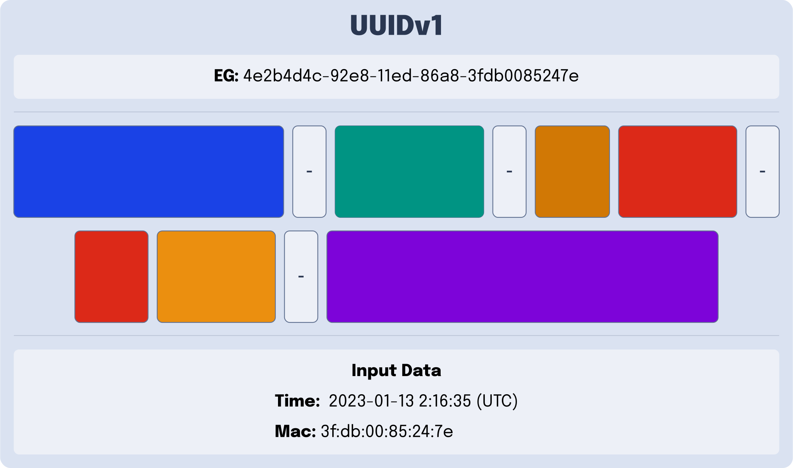
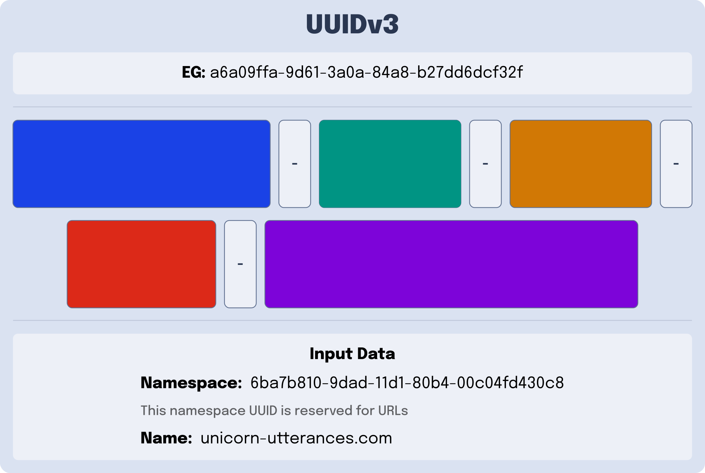
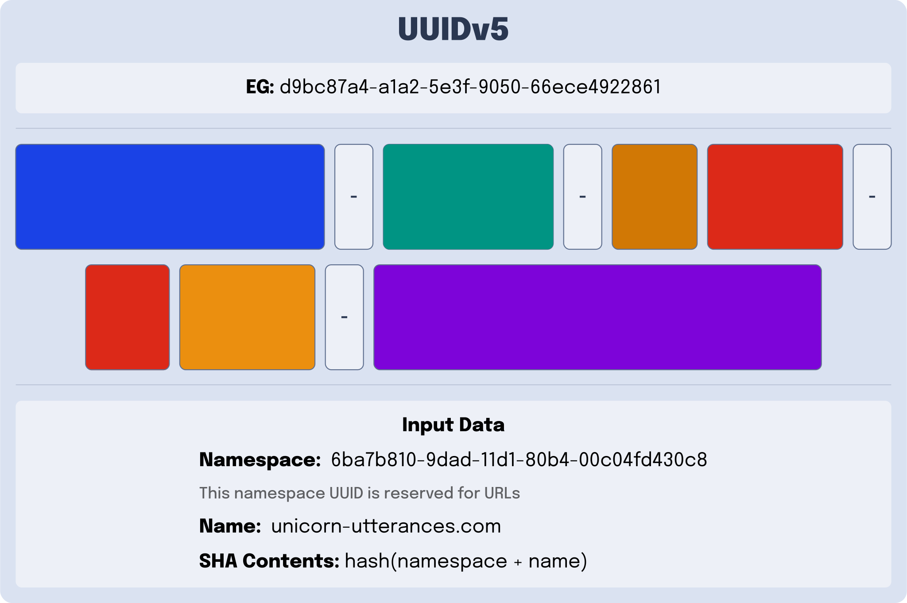
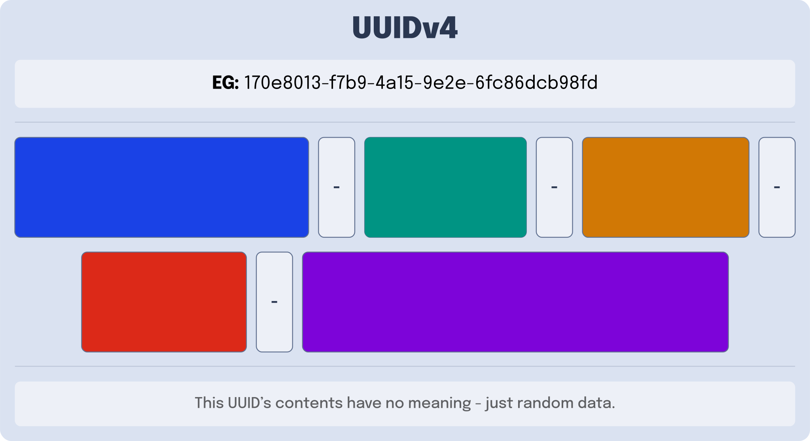

---
{
    title: "What are UUIDs?",
    description: "",
    published: '2023-02-20T21:52:59.284Z',
    authors: ['crutchcorn'],
    tags: ['computer science'],
    attached: [],
    license: 'cc-by-4'
}
---

Oftentimes, in computer programming, you'll find yourself needing a way to give a unique identifier to a digital asset. For example, items such as books in your "to read" digital bookshelf, computers on your network, or rows in your database need a quick and easy way to access them. This is typically done with a distinct ID for each item.

If you've done much research on this problem, you'll likely have heard of a "universally unique identifier" (UUID) or "globally unique identifier" (GUID); a way to generate IDs for these assets quickly. After all, UUID usage is wide-reaching in the software industry.

While it's good to recognize popular technologies, a few questions remain:

- What is a UUID?
- What are the various versions of UUID?
- Why are they so widely utilized?

# What is a UUID?

Broadly speaking, a UUID is a numerical value of 128 bits that can be used to provide an identification number for a resource. 

While there are multiple different kinds of UUIDs, which we'll touch on shortly, all UUID formats follow a few general ideas.

**First**, UUIDs are, for all intents and purposes, unique. While that might seem obvious, here's the part that isn't: The guarantee that a number is unique does not require previous knowledge of other generated UUIDs.

This differs from a simple counter that counts up from `0`, where you would need to look up the previous number stored to generate a new one. 

**Second**, while it's not literally impossible to generate two UUIDs with the same value, it's generally safe to assume that it's _nearly_ impossible with the proper inputs.

**Finally**, all UUIDs are formatted similarly. The numerical value of the UUID is encoded into a string of [hexadecimal numbers](/posts/non-decimal-numbers-in-tech) and dashes (`-`) when displayed as a string. An example UUIDv4 might be formatted to look something like this:

```
a5abec44-7ce0-437c-972a-cf451b4fde2b
```

Two of these characters include information about which kind of UUID it is:

```
xxxxxxxx-xxxx-Mxxx-Nxxx-xxxxxxxxxxxx
```

Here, `M` is the UUID version number, while `N` is the variant of the UUID version. Think of this as information encoded within the UUID _about_ the UUID generation process that yielded the output value. 

> While we'll explain what the UUID "version" is in the next section, let's quickly explain what the "variant" means:
>
> - If the variant is `0` through `7`, the UUID is backward compatible with [**very** old computer systems from the 1980s](https://en.wikipedia.org/wiki/Apollo_Computer).
> - If the variant is `8` through `b`, it means the UUID is part of [the "RFC 4122" standard](https://www.ietf.org/rfc/rfc4122.txt)
> - If the variant is `c` or `d`, it means the UUID is compatible with early Windows systems
> - Variants `e` and `f` are reserved for future UUID versions

This means that we can take the previous UUID:

```
a5abec44-7ce0-437c-972a-cf451b4fde2b
```

And determine that this is a UUID with the version of `4` and the variant of `9`.

> Speaking of "UUID version numbers", what are those? I know we outlined earlier that there were different ways of generating a UUID; what are they?

I'm glad you asked.

# What are the different types of UUID?

A "UUID version" outlines which type of UUID you're generating; each version of UUID has a different generation mechanism and, therefore, different use cases.

At the time of writing, [there are 5 different types of UUIDs](https://ietf-wg-uuidrev.github.io/rfc4122bis/draft-00/draft-ietf-uuidrev-rfc4122bis.html) that are part of [the official UUID specification](https://datatracker.ietf.org/doc/html/rfc4122):

- [UUIDv1](#UUIDv1)
  - A machine's network card information + a timestamp
- [UUIDv2](#UUIDv2)
  - It's a long story.
- [UUIDv3](#UUIDv3and5)
  - Encode a string using MD5
- [UUIDv4](#UUIDv4)
  - Random UUID with effectively zero chance of producing the same number twice
- [UUIDv5](#UUIDv3and5)
  - UUIDv3 but more secure (uses SHA-1)

## Track Network Systems Using UUIDv1 {#UUIDv1}

As mentioned previously, a UUID is composed of:

- A timestamp
- A UUID version of `1`
- A UUID variant value
- A random number called a "Clock Sequence"
- A unique ID number of a computer's network card - called a ["MAC address"](https://en.wikipedia.org/wiki/MAC_address)

This data is then converted to raw numerical values and encoded into UUID with the following format:



### Pros of UUIDv1

- **Low likelihood of collision**: While Mac addresses are not _truly_ unique, [thanks to vendor re-use](https://www.howtogeek.com/228286/how-is-the-uniqueness-of-mac-addresses-enforced/), the combination of timestamp and Mac address makes it **extremely** unlikely to duplicate the same UUID in multiple generations on the same network system. Furthermore, introducing a clock sequence adds another layer of protection against UUIDv1 collision.

### Cons of UUIDv1

- **Anonymity**: Because we're encoding a system's Mac address into the UUIDv1, it cannot be used as an anonymous value - since it links the UUID to a system that can be identified by its network card metadata. 

- **Easy to guess the sequence**: Likewise, let's say you want to use a UUID to generate a reset password link to the user:

  ```
  https://example.com/reset/ef5dc6d0-93ca-11ed-acdd-6fb6f98f3ada
  ```

  An attacker can decode the Mac address of the server (in this case, `6f:b6:f9:8f:3a:da`) and use it to brute force the rest of the URL, as demonstrated [in this article by Versprite](https://versprite.com/blog/universally-unique-identifiers/).

## UUIDv2s are _weird_ {#UUIDv2}

> I know you mentioned it's a long story with UUIDv2 when outlining the different versions of UUID... Surely it can't be that bad, can it?

No, really, it's a ***long*** story. It's complex enough that I'm writing a second blog post explaining what UUIDv2s are, why they're not widely used, and how they came to be.

In the meantime, the short version of UUIDv2 is:

----

UUIDv2 matches the specification for UUIDv1 but replaces some of the timing and clock information with identification numbers for operating system usage.

They're rarely implemented into most UUID libraries and are used even more rarely. This is because of 2 reasons:

1) They're not documented as part of the newest UUID specification
2) Significant pitfalls in UUIDv2's generation schema that **regularly** leads to collision with other generated UUIDv2s

As a result, we won't talk about UUIDv2s anymore today. Stay tuned for an upcoming article outlining them more.

## Namespace Your IDs with UUIDv3 and UUIDv5 {#UUIDv3and5}

Let's say you're creating a database of URLs tracked on your website. You want to use the URL as [the primary key in your database](https://en.wikipedia.org/wiki/Primary_key) but don't want to use the full URL, as it will bloat your key's storage requirements.

On the other side of the coin: You can't use any random data to store as your URL's primary key since it could introduce duplicate URL entries into your database table. 

Is there a good way to generate a unique ID based on a string that will output the same ID if the inputs are the same?

Intro: UUIDv3 and UUIDv5.

Both of these UUID versions take the following information:

- A pre-defined UUID "namespace"
- Any string for a "name"

> The UUID specification establishes 4 pre-defined namespaces for common use cases. The pre-defined namespaces are:
>
> - [DNS](https://en.wikipedia.org/wiki/Domain_Name_System): `6ba7b810-9dad-11d1-80b4-00c04fd430c8`
> - [URL](https://en.wikipedia.org/wiki/URL): `6ba7b811-9dad-11d1-80b4-00c04fd430c8`
> - [OID](https://en.wikipedia.org/wiki/Object_identifier): `6ba7b812-9dad-11d1-80b4-00c04fd430c8`
> - [X.500 DN](https://en.wikipedia.org/wiki/X.500): `6ba7b814-9dad-11d1-80b4-00c04fd430c8`

These UUID versions output a UUID that contains a hash of the namespace and name concatenated together.

You can think of the generation algorithm for both of these UUID versions as the following:

```javascript
UUID = hash(NAMESPACE + NAME)
```

For example, here's UUIDv3, which uses [MD5](https://en.wikipedia.org/wiki/MD5) to hash the concatenated value:



Compare this to UUIDv5, which uses [SHA-1](https://en.wikipedia.org/wiki/SHA-1) to generate the hash:




### When should you use UUIDv3 vs. UUIDv5?

When provided the option, when should you use UUIDv3 against UUIDv5? When should you do the opposite?

**You should use UUIDv3 when**:

- Performance is key, or system resources are limited
- It's not critical that `name` or `namespace` contents can be decoded

This is because UUIDv3 uses the less secure MD5 hashing method for its contents. 

Likewise, **you should use UUIDv5 when**:

- It's critical that `name` or `namespace` contents cannot be decoded
- Performance is less of a concern

As UUIDv5's SHA-1 is significantly more secure with hashing its contents.

### Pros of UUIDv3 and UUIDv5

- **Contents are stable**: In instances where you need the input to match the output every time, there are no other UUIDs that can fulfill this use case.

### Cons of UUIDv3 and UUIDv5

- **Contents are not random**. While output stability _can_ be incredibly useful, it has somewhat limited usage in ID generation. As such, it may not fit your needs that other UUIDs may.


## Generate non-clashing random IDs with UUIDv4 {#UUIDv4}

While the previous versions of UUID have had some kind of input data, UUIDv4 breaks from this pattern. Instead, a UUIDv4 is defined as random data alongside the standard `version` and `variant` UUID standards.



### Pros of UUIDv4

- **No required metadata**: There are many instances where you won't have the proper metadata for other UUID versions.

- **Near-`0` chance of collision**: While there's still *theoretically* a possibility that you can have two UUIDv4 UUIDs match one another, the likelihood of this happening is...

  Well, let's put it this way. [You would have to generate 1 billion UUIDs per second for about 85 years before you even hit a 50% chance of a collision.](https://en.wikipedia.org/wiki/Universally_unique_identifier#Collisions)

### Cons of UUIDv4

- **No encoded metadata**: This UUID does not convey any information about the item it's being generated for. This means you must store this data elsewhere and do additional lookups to find this data.

# Conclusion

And that's it; That's all of the UUID versions that are part of the original 2005 specification! Hopefully, this has been helpful in learning about the different UUID versions and when each is useful.

In the next article, we'll talk about how UUIDs came to be, what happened to UUIDv2, and why you shouldn't use it.

Until then, happy ~~hacking~~ ID generating!
