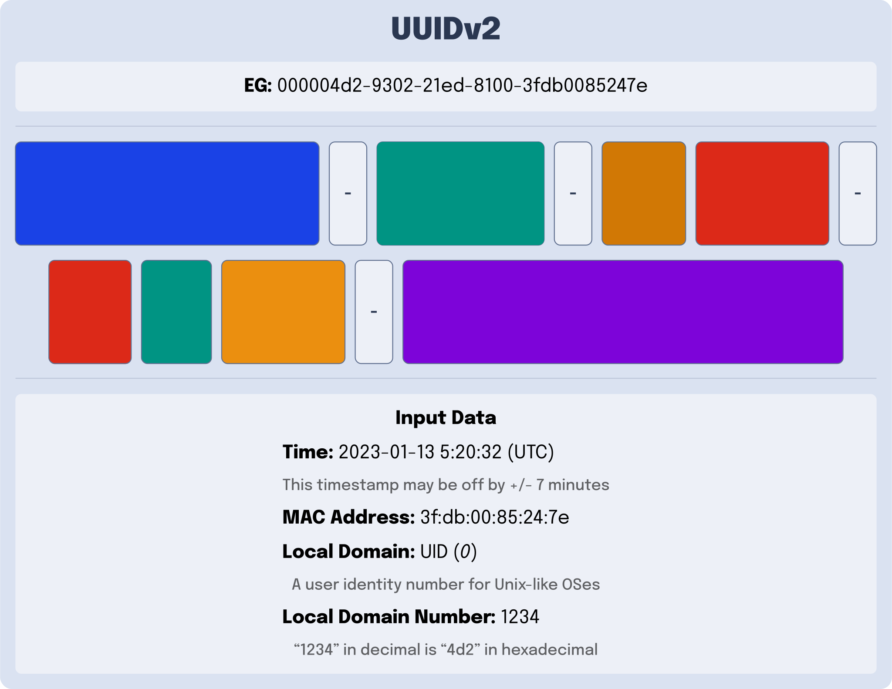

---
{
    title: "What Happened to UUIDv2?",
    description: "",
    published: '2023-02-20T21:52:59.284Z',
    authors: ['crutchcorn'],
    tags: ['computer science'],
    attached: [],
    license: 'cc-by-4',
    series: "Explaining UUIDs",
    order: 2
}
---

// TODO: Write

# What makes a UUID a UUID? {#specs}

As you may have noticed; UUIDs aren't a free-for-all. There are specific rules that apply to UUID that come from a document released in 2005 by the "[Internet Engineering Task Force](https://www.ietf.org/)" (IETF). This document is known as [`RFC 4122`](https://datatracker.ietf.org/doc/html/rfc4122) and acts as the de-facto UUID specification.

This is all [the official UUID specification has to say about UUIDv2](https://datatracker.ietf.org/doc/html/rfc4122#section-4.1.3): 

> Description: DCE Security version, with embedded POSIX UIDs.

That's it.

This makes the UUIDv2 the only official version of UUID that does not have an explicit definition as part of the 2005 specification.

This doesn't mean that it doesn't have rules, however; The UUIDv2 specification can be found in an older standard set for UUIDs. This older standard was created by an organizational body then called the "Open Software Foundation" (OSF), now called "The Open Group"

This older specification, which outlines the rules for UUIDv2 and was released in 1997, is called [the DCE 1.1 Authentication and Security Services specification](https://pubs.opengroup.org/onlinepubs/9696989899/toc.htm).

# UUIDv2 Definition

While the specification is happy to go in-depth about [the fine-grained details of UUIDv2](https://pubs.opengroup.org/onlinepubs/9696989899/chap5.htm#tagcjh_08_02_01_01), here's the gist of it:

UUIDv2 is almost to UUIDv1. It contains the same components of:

- A timestamp
- A version
- A variant
- A clock sequence
- A Mac address

However, there are a few small differences. Namely:

- The "Clock Sequence" from UUIDv1 is changed from 3 bytes to 1 as the last 2 bytes are replaced with a new "Local Domain" enum value.

- The "Low Time" is replaced with a "Local Domain Number" 

> What is a "Local Domain" or "Local Domain Number"?

Well, in [Unix-like operating systems](https://en.wikipedia.org/wiki/Unix-like) such as Linux and macOS, your machine needs a way to keep track of the users on its system. The primary way computers in this family of OSes do this is by assigning you a ["User ID", or "UID"](https://en.wikipedia.org/wiki/User_identifier).

This what the "Local Domain" is referring to. The `0` in the "Local Domain" field is saying that "Local Domain Number" is tracking the UID of a Unix-like system's user. The "Local Domain Number" is the UID itself.

> But wait, why would we need a "Local Domain" field anyway?

Well, as it turns out, Unix-like systems track more data on the user than a single number. Consider the following usecase for a Linux-based school server:

You want to provide permissions to all teachers to access the `Homework Answers` directory, but not the student users. Wouldn't it be nice to have a "group" of users that you could assign specific permissions to?

It was with this thought process that the concept of a ["Group ID" or "GID"](https://en.wikipedia.org/wiki/Group_identifier) was invented. Similar to UIDs, GIDs are a number that keeps information about a group of users on the system.

UUIDv2s are able to track a GID rather than a UID by changing the `Local Domain` to the number `1`. 

> Are those the only two "Local Domains"?

Alas, they are not. Let's continue our example of a school Linux server once more to explain why. Assume you're the [University of California system of schools](https://en.wikipedia.org/wiki/University_of_California) and want to create a directory that allows for emails to be sent to everyone in the [UC Davis campus](https://en.wikipedia.org/wiki/University_of_California,_Davis). That's where an organization might come into play.

This organization would relate to a collection of groups, which in turn relates to a collection of users. This would be tracked with an "organization ID" and assigned a `Local Domain` of `2`.

----

### Pros of UUIDv2

- **Encoding of POSIX data**: There are application instances where having the user's operating system information easily accessible would be handy in a unique ID.

### Cons of UUIDv2

- **High likelyhood of collision**: Because UUIDv2 replaces UUIDv1's Low Time, the precision amount 

  This is a showstopper for most applications, which is why they are rarely used in applications.

- **Few implementations**: Because of the scaresity of UUIDv2 usage and the lack of formal specification in RFC 4122 there are very few implementations of UUIDv2 in most languages and libraries. This may make implementing them more challenging than other versions of UUID.

# Why do UUIDv2s suck?

