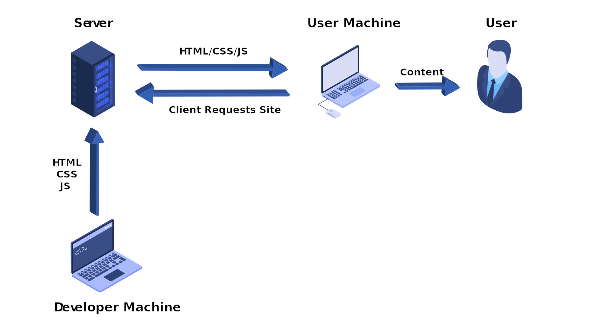
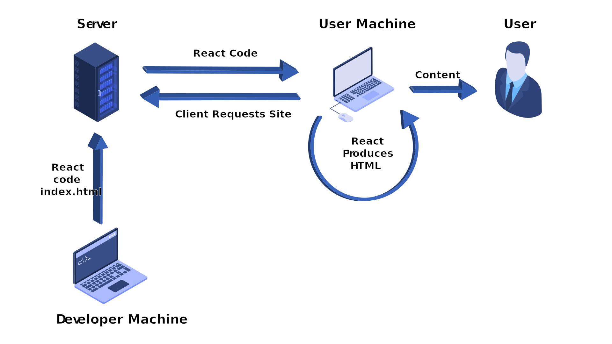

---
{
	title: "What is Server Side Rendering (SSR) and Static Site Generation (SSG)?",
	description: "An explanation of what server-side rendering is, what static site generation is, and how you can utilize them in React, Angular, or Vue!",
	published: '2020-03-30T05:12:03.284Z',
	authors: ['crutchcorn'],
	tags: ['ssr', 'ssg', 'nextjs', 'react'],
	attached: [],
	license: 'cc-by-nc-sa-4'
}
---

# Vanilla HTML Sites

1) You build HTML, CSS, JS
2) You put it on a server
3) The client downloads the HTML, CSS, JS from server
4) The client immediately sees content on screen

# Client Side Rendering {#csr}

While you may not be familiar with this term, you're more than likely familiar with how you'd implement one of these; After all, this is the default when building a React site. When you build a typical React application without using a framework for SSR or SSG, you'd:

1) You build the React JS code
2) You put it on a server
3) The client downloads the React JS code from server
4) The React JS code runs and generates the HTML/CSS on the client's computer
5) The user THEN sees the content on screen after React runs

# Server Side Rendering (SSR) {#ssr}

1) You build the ReactJS code
2) You put it on a server
3) The client requests data
4) The server runs the ReactJS code on the server to generate the HTML/CSS
5) The server then sends the generated HTML/CSS on screen
6) The user then sees the content on screen. React doesn't have to run on their computer

# Static Site Generation (SSG) {#ssg}

While the industry widely recognizes the term "Static Site Generation", I prefer the term "Compile-side Rendering" or "Compile-Time Server-Side Rendering". This is because I feel they outline a better explanation of the flow of displaying content to the user. On a SSG site, you'd:

1) You build the ReactJS code
2) You generate the HTML and CSS on your development machine before deploying to server (run build)
3) You put the generated built code on a server
4) The client downloads the HTML, CSS, JS from the built code on the server
5) The client immediately sees content on screen

# Pros and Cons {#pros-and-cons}

It may be tempting to look through these options, find one that you think is the best, and [overfit](https://en.wiktionary.org/wiki/overfit) yourself into a conclusion that one is superior to all the others. That said, each of these methods have their own strengths and weaknesses.

| Tool                         | Pros                                                         | Cons                                                         |
| ---------------------------- | ------------------------------------------------------------ | ------------------------------------------------------------ |
| Vanilla HTM                  | <ul aria-label="HTML Pros"><li>Fast</li></ul>                | <ul aria-label="HTML Cons"><li>Hard to scale</li></ul>       |
| Client Side Rendering (CSR)  | <ul aria-label="CSR Pros"><li>Easy to scale</li><li>Ease of engineering</li></ul> | <ul aria-label="CSR Cons"><li>Slow JS initialization</li><li>SEO concerns</li></ul> |
| Server Server Render (SSR)   | <ul aria-label="SSR Pros"><li>Query based optimization</li><li>Better SEO handling</li><li>Usable without client JS enabled</li></ul> | <ul aria-label="SSR Cons"><li>Heavier server load</li><li>Needs specific server</li><li>More dev effort than CSR</li></ul> |
| Compile Time Rendering (SSG) | <ul aria-label="SSG Pros"><li>Layout based optimization</li><li>Better SEO handling</li><li>Usable without client JS enabled</li><li>CDN hostable</li></ul> | <ul aria-label="SSG Cons"><li>No access to query data</li><li>More dev effort than CSR</li></ul> |

Consider each of these utilities a tool in your toolbox. You may be working on a landing page for a client where SSG would fit best. Working on an internal SPA that only has a limited budget allocated to it? Client-side rendering might be your best bet there! Working on a public-facing app that highly depends on real-time data? SSR's for you! Each of these has their utility in their own problem-space, and it's good to keep that in mind when selecting one for your next project.