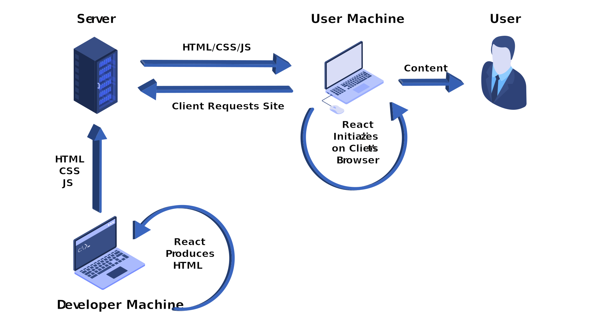

---
{
	title: "What is Server Side Rendering (SSR) and Static Site Generation (SSG)?",
	description: "An explanation of what server-side rendering is, what static site generation is, and how you can utilize them in React, Angular, or Vue!",
	published: '2020-03-30T05:12:03.284Z',
	authors: ['crutchcorn'],
	tags: ['ssr', 'ssg', 'nextjs', 'react'],
	attached: [],
	license: 'cc-by-nc-sa-4'
}
---

In recent years, projects like [Zeit's NextJS](https://nextjs.org/) and [Gatsby](https://www.gatsbyjs.org/) have garnered acclaim and higher and higher usage numbers. Not only that, but their core concepts of Server Side Rendering (SSR) and Static Site Generation (SSG) have been seen in other projects and frameworks such as [Angular Universal](https://angular.io/guide/universal), [ScullyIO](https://scully.io/), and [NuxtJS](https://nuxtjs.org/). Why is that? What _is_ SSR and SSG? How can I use I use these concepts in my applications?

We'll walk through all of these questions and provide answers for each. First, we have to have an understanding of how a typical HTML site is able to serve content to your user.

# Vanilla HTML Sites

While many sites today are built using a component-based framework like Angular, React, or Vue, there's nothing wrong with good ol' HTML. When you deploy a website like this to a server, you typically provide an HTML file for each of the routes of your site. When the user requests one of the routes, your server will return the HTML for it. From there, [your browser parses that code and provides the content directly to the user](/posts/understanding-the-dom/). All in all, the process looks something like this:

1) You build HTML, CSS, JS
2) You put it on a server
3) The client downloads the HTML, CSS, JS from server
4) The client immediately sees content on screen

This is a fairly straightforward flow once you get the hang of it. Let's take a look at what happens when you throw a component-based framework into the fray.

# Client Side Rendering {#csr}

While you may not be familiar with this term, you're more than likely familiar with how you'd implement one of these; After all, this is the default when building a Angular, React, or Vue site. Let's use a React site as an example. When you build a typical React SPA without utilizing a framework like NextJS or Gatsby, you'd:

1) You build the React code
2) You put it on a server
3) The client downloads the React code from server
4) The React code runs and generates the HTML/CSS on the client's computer
5) The user **then** sees the content on screen after React runs

This is because React's code has to initialize in order to render the components on screen before it can spit out HTML for the browser to parse. Sure, there's an initial HTML file that might have loading spinner, but until your components have time to render, that's hardly useful content for your user to interact with. _While these load times can be sufficient for smaller applications_, if you have many components loading on-screen, _you may be in trouble if you're wanting to keep your time-to-interactive (TTI) low_. That's oftentimes where SSR comes into play.

# Server Side Rendering (SSR) {#ssr}

Because React has to initialize _somewhere_, what if we were to move the initial rendering off to the server? Imagine - for each request the user sends your way, you spin up an instance of React. Then, you're able to serve up the initial render (also called "fully hydrated") HTML and CSS to the user, ready to roll. That's just what server-side rendering is!

1) You build the React code
2) You put it on a server
3) The client requests data
4) The server runs the React code on the server to generate the HTML/CSS
5) The server then sends the generated HTML/CSS on screen
6) The user then sees the content on screen. React doesn't have to run on their computer

There's more improvements than there might initially see, however! Because you're hosting from a server - which has better network connectivity than a user's machine - you're able to make much faster network requests in order to perform that initial render. Say you need to grab data from the database to populate the screen's data, you're able to do that much faster as a result. Instead of displaying the user a loading screen while you wait to grab the data, you can simply tell your client "don't show anything until I send you HTML that I've generated from React" and due to the speed of your network, can ship down a hydrated UI from database data.

Moreover, if you have your server and database in the same hosting location, you're even able to avoid out-of-intranet calls, which would provide faster, more reliable connectivity for your initial render.

# Static Site Generation (SSG) {#ssg}

While the industry widely recognizes the term "Static Site Generation", I prefer the term "Compile-side Rendering" or "Compile-Time Server-Side Rendering". This is because I feel they outline a better explanation of the flow of displaying content to the user. On a SSG site, you'd:

1) You build the React code
2) You generate the HTML and CSS on your development machine before deploying to server (run build)
3) You put the generated built code on a server
4) The client downloads the HTML, CSS, JS from the built code on the server
5) The client immediately sees content on screen

# Pros and Cons {#pros-and-cons}

It may be tempting to look through these options, find one that you think is the best, and [overfit](https://en.wiktionary.org/wiki/overfit) yourself into a conclusion that one is superior to all the others. That said, each of these methods have their own strengths and weaknesses.

| Tool                         | Pros                                                         | Cons                                                         |
| ---------------------------- | ------------------------------------------------------------ | ------------------------------------------------------------ |
| Vanilla HTM                  | <ul aria-label="HTML Pros"><li>Fast</li></ul>                | <ul aria-label="HTML Cons"><li>Hard to scale</li></ul>       |
| Client Side Rendering (CSR)  | <ul aria-label="CSR Pros"><li>Easy to scale</li><li>Ease of engineering</li></ul> | <ul aria-label="CSR Cons"><li>Slow JS initialization</li><li>SEO concerns</li></ul> |
| Server Server Render (SSR)   | <ul aria-label="SSR Pros"><li>Query based optimization</li><li>Better SEO handling</li><li>Usable without client JS enabled</li></ul> | <ul aria-label="SSR Cons"><li>Heavier server load</li><li>Needs specific server</li><li>More dev effort than CSR</li></ul> |
| Compile Time Rendering (SSG) | <ul aria-label="SSG Pros"><li>Layout based optimization</li><li>Better SEO handling</li><li>Usable without client JS enabled</li><li>CDN hostable</li></ul> | <ul aria-label="SSG Cons"><li>No access to query data</li><li>More dev effort than CSR</li></ul> |

Consider each of these utilities a tool in your toolbox. You may be working on a landing page for a client where SSG would fit best. Working on an internal SPA that only has a limited budget allocated to it? Client-side rendering might be your best bet there! Working on a public-facing app that highly depends on real-time data? SSR's for you! Each of these has their utility in their own problem-space, and it's good to keep that in mind when selecting one for your next project.

In fact, if you're using a framework that supports more than one of these methods ([like NextJS does as-of version 9.3](https://nextjs.org/blog/next-9-3)), knowing which of these utilities to use for which pages can be critical for optimizing your app.

# A Note Regarding Performance Benchmarks

I was once tasked with migrating a landing page with an associated blog from CSR to use SSG. Once I had done so, however I noticed that my Lighthouse score had gone _down_ despite my page rendering a much more useful initial page significantly faster than it'd taken for my app's spinner to go away.

> "Why did my lighthouse scores go down when using SSG?"

I wasn't able to find an answer quickly, but eventually I found out. Lighthouse scores based on many factors. One of those factors is "time until fully loaded". Here's where my problems came into play:

When doing server-side rendering or static site generation, you're shipped HTML and CSS. Then, in order to ensure your app fully works and is interactive afterwards, it will preload the framework you built your site in. Once your framework preloads, it will oftentimes re-render the initial page that was shipped with HTML/CSS. Because the page is being loaded with both the hydrated HTML as well as initializing the framework afterwards on the client machine, your benchmarks may potentially suffer, despite the experience being better.

> While it's _technically_ possible to do things like [compile React entirely out of an exported NextJS site](https://github.com/zeit/next.js/issues/5054), it's far from trivial and doesn't fit _most_ usage very well. It's certainly a harder mental model at the very least

Here's an anecdote that was told to me by [Aaron Frost](https://twitter.com/aaronfrost) (the creator of the SSG utility [Scully](http://scully.io/)) about this scenario:

> There once was an airport that had low ratings from a audit company that rated an airport's speed and quality. The biggest complaint from the rating was that the time it took to get un-boarded and to the baggage claim was too long. One of the reasons for this was due to how the planes were landing. When the planes landed, they were far away from the baggage claim, forcing their customers to walk a long distance before getting to the baggage claim.
>
> The airport decided to re-arrange how their planes landed in the future. While the customers seemed to be much happier overall, they received a lower rating on their next audit. This clearly contradicted with the claims of their fliers. It turns out that the way the auditor was rating the airport was how much downtime they had before receiving a bag. While the others enjoyed reading articles on their phones during the downtime, the auditor was able to start their timer sooner as a result of walking for a shorter period of time.

All in all, while lighthouse might score you lower, you can rest assured that your customers will be happier knowing that you have a much more useful interaction on first glance than a site that doesn't use something like SSG.