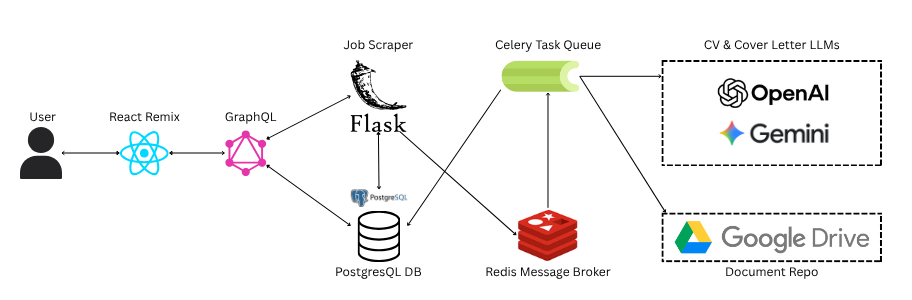

---
{
  title: "How I Chose The Tech Stack For Job Helper",
  description: "Choosing a tech stack isn’t just about picking trendy tools, it’s about aligning architecture with real-world needs.",
  published: '2025-10-27',
  tags: ["react", "typescript", "python"],
  license: 'cc-by-4'
}
---

The job market is tough right now.

In 2022, the industry saw a lot of layoffs. Then, high interest rates and the rise of AI tools like ChatGPT has caused many companies to slow down hiring, re-evaluate roles, and even try to automate the work of developers.

This has created a situation, where hiring has become very competitive. Staring at the speed at which job opportunities get filled up with 100s of applications, I asked myself, how can I use tech, along with the trend of the moment - Large Language Models (LLMs) - to increase the chances of me getting a job? As they say in financial markets, I was looking for an edge. That's why I built Job Helper, to reduce some of the emotional and logistical friction of job searching.

However from the very beginning, I realised that this was not going to be your regular CRUD app. The requirements were a bit more tailored. During the design phase, I asked myslef one important question shaped the entire project: How do I design a stack that balances performance, maintainability, and real-world usefulness?

This article, inspired by Corbin Crutchley's [How to Pick Tech Stacks For New Projects](https://playfulprogramming.com/posts/how-to-pick-tech-stacks-for-new-projects), walks through the functional needs of Job Helper, the technical decisions I made to support them, and my thought process when making these decisions. (why I believe they were the right tradeoffs.)



## Functional Goals
I started by defining what the app actually needed to do. These capabilities formed the foundation of every architectural decision:

- Schedule recurring job scrapes (from platforms like LinkedIn, Indeed, etc.)
- Generate CVs and cover letters using AI, customized per job
- Send automated emails with links to those tailored documents
- Manage the full job search lifecycle: saved jobs, applications, rejections, follow-ups

The goal was to build a system that not only notifies the user about jobs, but also allows them to perform analysis on their job search. I wanted to track applications, recording information about rejections etc. All this needed to be done while the application performs user-defined searches on the web, and create documents for each job application.

## Application Architecture
With those goals defined, I decided to decompose the system into separate services since it was apparent that the system would have long running processes. So some processes needed to be separate to prevent interference with other core services. These services are listed below.

- **GraphQL Gateway:** The GraphQL (GQL) service is the API that interacts with the frontend. It is the only service that is publicly accessible, and is responsible for interacting with the Scraper service which interacts with AI service.
- **Scraping Service:** This service will be responsible for running scheduled scrapes on the various platforms at their specified times. It was separated into its own service since scraping is a long-running process. I wanted to keep it isolated so it doesn't block API responses, creating a poor user experience. During the scraping process, it will post each job to the AI service.
- **AI Service:** The AI service has two main functionalities. After a job is passed from the scraper service, this service constructs a prompt to send to an LLM (OpenAI or Gemini) to generate a cover letter and CV using the job description and a master CV as input. It responds with a JSON document of the data in the structure below.

```python
from pydantic import BaseModel

class Work_Experience(BaseModel):
    company: str
    job_role: str
    dates: str
    bullet_points: list[str]

class CV(BaseModel):
    professional_summary: str
    professional_experience: list[Work_Experience]
    additional_work: list[Work_Experience]

class Document(BaseModel):
    cover_letter: list[str]
    cv: CV
```

### Tech Stack
Let's now look at the tech stack chosen and my thought process for making these choices.

- **Scraping Service:** This service uses **Python & Flask**. I chose this because web scraping is quite popular in Python and I have a lot of experience doing web scraping in Python. This allowed me to move fast and stay productive. I also chose Flask because I wanted to use an API to manage the jobs. Flask provides a lightweight web server that allows me to do this.
- **AI Service:** The AI service is built on **Celery** task queue with a **Redis** instance operating as the message broker. Messages about the job are sent to the broker (from the scraper service), then forwarded to the AI service in real-time which then makes requests to an LLM to create a tailored CV and cover letter using the job description and master CV data. The data returned is used to generate the documents. When this is done, an email notification is sent out to the user letting them know of the job opportunity with links to the CV & cover letter.
- **Backend API:** Here, I used a **GraphQL Gateway**. While this choice was driven by a personal desire to get some exposure to the technology, it came with the benefits that GraphQL provides out of the box. Using GQL allowed me to specify the data I needed from the frontend. This gave me the flexibility where my UI could retrieve specific pieces of data from a resolver. This interface also created a clear separation of responsibilities as it sepaarated data queries and mutations from internal processing.
- **Database**: I used PostgreSQL database since it's reliable, battle-tested, and handles relational data like job searches, applications, and document metadata very well. I didn’t need anything fancy here, no document stores nor NoSQL solution.
- **LLM:** The Large Language Models I use are Google Gemini and OpenAI ChatGPT, Gemini allowed me to do testing without charges, but for each job search, I can specify which LLM to use. Similar to my DB choice, I didn't need to do anything fancy here. I just chose two solid LLMs, with Google being helpful during testing.
- **Document Editor:** For this functionality, I used Google Docs. The options were to embed a Rich-text editor into the site or use an cloud-based Document editor (Microsoft Office, Google Docs etc). I decided to go with the latter because those editors are more feature rich. There are features such as version/edit history, and PDF exports. 
- **Frontend:** I chose **Remix** as the UI framework because React now officially recommends it as one of the frameworks to use. I also wanted exposure to one of Next.js or Remix Run and found this project to be a good opportunity to do so. I have no regrets with this decision, as it gave me the chance to work with features such as file-based routing, server-side rendering and nested layouts. It also did make for some interesting architectural choices later on since I had to handle browser-based and server-based frontend requests.
- **Containerization:** I used Docker to containerize the project since I needed a way to orchestrate the app locally and in production. With all these moving parts, Docker allows me to:
    - Keep services isolated
    - Control which containers could talk to each other
    - Restrict public access to only the GraphQL API
    - Easily spin up staging environments

## Security
For security, I’ve implemented several key security measures. Authentication is done between the GQL API and the frontend (Remix server and browser). It is implemented using HTTP-only cookies. Docker networking is used to separate internal services such as the database, Redis, and Celery workers in a private Docker network to control service level communication. Docker also allowed me to avoid public exposure on the relevant servies. 

Internal endpoints are secured with API keys to control service-to-service communication. GraphQL requests are also scoped to each user session by forwarding cookies, ensuring proper isolation between users. This was needed because the HTTP-only cookie is returned to the Remix server, which has to forward to it the browser. The process happens in reverse for any queries & mutations which has to go through the Remix server after logging in. Redis is also hardened by requiring a password

## Conclusion
Choosing the tech stack for Job Helper was about balancing the needs of the app by making practical choices. Sprinkled in there, were decisions which were centered around giving me exposure to other technologies that I was interested in. Overall I think I did a good job aligning tools with the real-world problem I set out to solve: making job hunting more streamlined and effective. Each decision, from Python for scraping to Docker for orchestration, was guided by a balance of speed, maintainability, and practical usefulness. 

This stack has already proven itself by handling long-running processes, keeping services secure and isolated, and integrating seamlessly with LLMs and tools like Google Docs. As the project evolves, I may have to refine and extend the architecture, but I think that the current tech stack gives me a very modular, performant application. I’ve built many applications in my career, but Job Helper was a different kind of project, it forced me to zoom out and look at architecture holistically. Rather than just building a regular CRUD app, I had to abstract features into entire technologies and micro-apps all operating independently within a larger application.

I’ll be open-sourcing this project soon and would love to hear feedback from other devs, architects, or hiring managers. If you would've made similar decisions, or different ones, reach out let’s talk. I am always looking to grow.