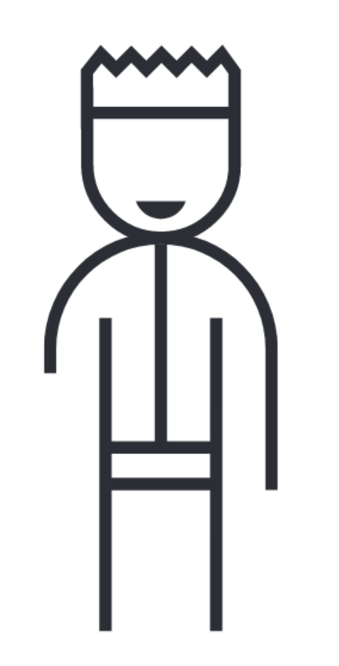
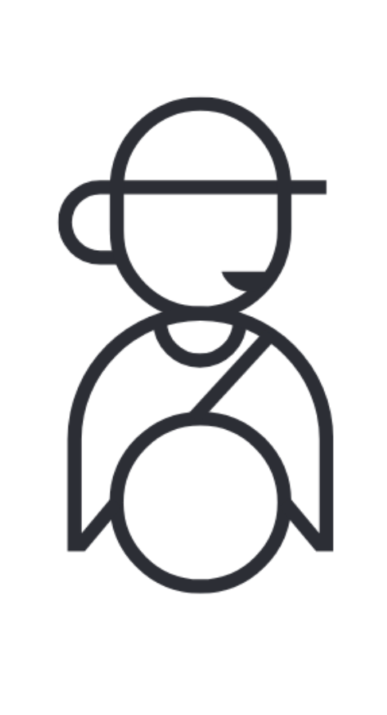

---
{
    title: "Accessibility",
    description: "",
    published: '2023-01-01T22:12:03.284Z',
    authors: ['crutchcorn'],
    tags: ['webdev'],
    attached: [],
    order: 17,
    series: "The Framework Field Guide"
}
---

As application developers, our job is to make sure that people have a good experience with the apps we build; While performance and stability make up part of that story, a user's experience (or, UX) is made up of multiple different aspects of their interactions with the app. 

One of the crucial aspects of UX is the ability to interact with the ability to have information presented in a way that's easily digestible.

There's multiple ways to think about this; some UX rules are objective while others are much more subjective.

Here's an example of what I'm talking about:

```html
<button style="background: transparent; border: none; color: transparent">
  Buy Now
</button>
```

This button is fully transparent. Render it on a page and any user (that's not looking at the HTML) will not be able to find it. It's clear that we should not use this button on our page.

Now, take this button:

```html
<button
  style="background: #ffabab; border: 2rem solid #082450; color: #213224; font-size: 4rem;"
>
  Buy Now
</button>
```

<button aria-label="A large button with dark blue border, dark green 'buy now' text, and light red text" style="background: #ffabab; border: 2rem solid #082450; color: #213224; font-size: 4rem;" > Buy Now </button>

This button works, [has good contrast](https://unicorn-utterances.com/posts/intro-to-web-accessability#contrast), but might confuse some users whether it's a button or not.

Compare this button, with harsh edges and three different colors, against a button from Google's Material Design:

```html
    <button
      style="
        height: 9rem;
        font-size: 4rem;
        border: medium none;
        border-radius: 1rem;
        padding: 0rem 4rem;
        background: rgb(98, 0, 238);
        color: rgb(255, 255, 255);
        box-shadow: 0px 0.75rem 0.25rem -0.5rem rgba(0, 0, 0, 0.2),
          0px 0.5rem 0.5rem 0px rgba(0, 0, 0, 0.14),
          0px 0.25rem 1.25rem 0px rgba(0, 0, 0, 0.12);
      "
    >
      Buy Now
    </button>
```

 <button aria-label="A large button with dark a rounded purple background, white 'buy now' text, and a shadow"  style=" height: 9rem; font-size: 4rem; border: medium none; border-radius: 1rem; padding: 0rem 4rem; background: rgb(98, 0, 238); color: rgb(255, 255, 255); box-shadow: 0px 0.75rem 0.25rem -0.5rem rgba(0, 0, 0, 0.2), 0px 0.5rem 0.5rem 0px rgba(0, 0, 0, 0.14), 0px 0.25rem 1.25rem 0px rgba(0, 0, 0, 0.12); " > Buy Now </button>

This button is more rounded, has a drop shadow, and matches Google's designs.

Between the three buttons, which one do you want to use on your page?

The first button is clearly not a good contender, since it's invisible to the end user. That said; between the last two buttons, I think a reasonable argument could be made for either of them. There's few "objectively" correct guidelines for what a button _should_ look like.

It's important, however, to acknowledge that your decisions on the UX can impact your users long into their usage. We should be sure to test our behaviors and verify with those users that they enjoy using your app.

> Why are you talking about this now? How does it matter?

It matters because if the end users don't enjoy the experience of working with our apps, we have some work to do.

One area which many developers have work to do is "Accessibility".

# What is accessibility?

Put simply, accessibility is the idea that your apps should be usable and enjoyable to as many people as possible. For some, this means that your app is easy to think through - there aren't three buttons that all have the same icon and do different things.

For others, however, it means supporting keyboard-only usage of your app for those that cannot use the mouse, supporting screen-readers for blind users, and enabling other forms of assistive tech.

> What's a screen-reader? What's "assistive tech"?

A screen reader is a form of assistive technologies that allow users with a myriad of capabilities to use their computers.

Consider; If you can't see the screen many use to access their emails, how can you still do so?

The answer? A screen-reader, which reads the contents of the screen out loud, and a keyboard to navigate through the page using <kbd>Tab</kbd>.

---

Consider the following button:

<button>Go home</button>

This button might be read by a screen-reader as "Button, Go home". Meanwhile, this list of items:

- Ice Cream
- Pizza

Might read out as "List of 2 items." when the user has the list focused. Then, upon pressing <kbd>Tab</kbd>, it might read "Item one, Ice Cream".

---

A screen reader is one of many examples of assistive technologies, but is far from alone in a wide array of assistive technologies. A small list of assistive tech might include:

- [Braille displays](https://en.wikipedia.org/wiki/Refreshable_braille_display)
- [Screen readers](https://en.wikipedia.org/wiki/Screen_reader)
- [Closed captioning](https://en.wikipedia.org/wiki/Closed_captioning)
- [Text-to-Speech](https://en.wikipedia.org/wiki/Speech_synthesis)
- Vibration motors, for non-visual alerts
- Buttons, for those with limited mobility ([one such workflow is demonstrated by this Apple ad](https://www.youtube.com/watch?v=XB4cjbYywqg))

> How does accessibility pertain to React, Angular, and Vue?

Like every other aspect of application development; you don't get perfect results without putting in the effort to making sure that aspect of your app works well.

To ensure your app is accessible, you need to:

- Learn what makes an app accessible
- Make programming considerations in your markup and styling
- Build out dedicated features to make your apps more accessible
- Test your app using assistive technologies

This _can_ be a lot of work, which may lead some to ask: "Why?"

# Why you should make your apps accessible

> Why would I spend time supporting devices like screen readers? How many of my users are blind or hard of sight?

Well, there's some major points I'd like to speak to:

1) Accessibility leads to more users, and even more funds.
2) Accessibility enhances the user experience for everyone.
3) You may have a legal requirement to be accessible.
4) Being accessible is the right thing to do.

## 1. Accessibility leads to more users, and even more funds

If you build something, isn't there a certain draw to having as many people engage with it as possible?

There's an appeal to having your work appreciated by an audience, especially for side projects.

Worried about the bottom line? Accessibility helps here, too.

Keep in mind, any user is potentially a paying user. By widening the pool of users that are able to utilize your application, you're enabling the ability for these users to pay for your services.

If I, the end user, aren't able to make the most of your services, why would I pay for them?

Likewise, word of mouth can make a massive impact to custom success and growth. I'm much more likely to use a product that has universally glowing reviews as opposed to one that has a range of usability issues.

Given all of this; It's no surprise that the classic verbiage of a product's success isn't "Gate away as many users as you can". Rather, a wise business person will make their doors as open as possible to new customers.

## 2. Accessibility enhances the user experience for everyone

Are you sighted? Have you ever stepped outside from a dark interior to the bright outdoors and been unable to see momentarily?

Maybe you're able to hear, but have been in a loud club where you were unable to hear your phone ring?

If so, you've experienced a situational disability; one that an applications with considerations for accessibility could have helped with.

That bar example? A vibration motor could help you notice receiving a phone call.

As [Microsoft's Inclusive Toolkit](https://download.microsoft.com/download/b/0/d/b0d4bf87-09ce-4417-8f28-d60703d672ed/inclusive_toolkit_manual_final.pdf) points out, there are a myriad of these scenarios that could lead someone to use assistive technologies. Here's a few they were able to mention in the toolkit specifically:

<table>
	<tr>
	  <th></th>
		<th scope="col">Permanent</th>
		<th scope="col">Temporary</th>
		<th scope="col">Situational</th>
	</tr>
	<tr>
		<th scope="row">Touch</th>
		<td><br/>One arm</td>
		<td><br/>Arm injury</td>
		<td><br/>New parent</td>
	</tr>
	<tr>
		<th scope="row">Sight</th>
		<td><br/>Blind</td>
		<td><br/>Cataract</td>
		<td><br/>Distracted driver</td>
	</tr>
	<tr>
		<th scope="row">Hearing</th>
		<td><br/>Deaf</td>
		<td><br/>Ear infection</td>
		<td><br/>Bartender</td>
	</tr>
	<tr>
		<th scope="row">Speaking</th>
		<td><br/>Non-verbal</td>
		<td><br/>Laryngitis</td>
		<td><br/>Heavy accent</td>
	</tr>
</table>

Similarly, even if you're not disabled in any way, you may still take advantage of accessibility features. Take keyboard navigation, for example; many power users of their machines don't take their fingers off of their keyboard row for many reasons.

By making sure that your apps are accessible, you're making sure your users are being respected and taken care of, regardless of scenario.

## 3. You may have a legal requirement to be accessible

Not only do you make money by making your tools accessible, but you may likely save money by dodging legal action against your company.

See, there are a wide range of businesses that have a legal obligation to be accessible. 

Do government contracts? If those government contracts are in the U.S, they're often subject to [Section 508](https://www.section508.gov/manage/laws-and-policies/) compliance. 

Maybe you're in the United Kingdom? You may have to comply with [The Equality Act of 2010](https://www.legislation.gov.uk/ukpga/2010/15/contents).

These laws are regulations are not only applicable in English speaking countries, either; [there is a wide range of countries that have legal requirements for applications to be accessible.](https://www.w3.org/WAI/policies/)

### Legal Repercussions

It may be easy to hear about some of these rules and assume they're not enforced; dead wrong.

In the U.S. alone, there have been a wide range of cases where these laws have been enforced.

From [Hilton being forced to pay a civil penalty of $50,000](https://www.justice.gov/opa/pr/justice-department-reaches-agreement-hilton-worldwide-inc-over-ada-violations-hilton-hotels), to [H&R Block paying a combined $145,000 to plaintiffs and civil penalties](https://www.justice.gov/opa/pr/justice-department-enters-consent-decree-national-tax-preparer-hr-block-requiring), to [a case brought against Target yielding $3.7 million dollars awarded to the plaintiffs](https://www.courtlistener.com/docket/4165835/214/national-federation-of-the-blind-v-target-corporation/), there are a swath of cases that have come forth in favor of ensuring an accessible web for all.

## 4. Accessibility is the right thing to do

While the other points make for good business sense, ensuring our tools and products are accessible for as many people as possible is a moral imperative. 

Unfair challenges against a specific group of people - intentional or not - impose frustration, heartache, and pain for those users. Even small pitfalls in their experience, which others may not have to deal with, add up to an immense mental toll, as users go from application to application and face similar difficulties. 

Building products for human beings requires empathy, something best shown by fixing issues and enabling inclusion; all of which is within our capabilities as engineers.

# Semantic HTML

You ever look through a codebase and just see a sea of `div`s as far as the eye can see?

```html
<div>
	<div>Add todo item</div>
	<div class="todos">
		<div>Play games</div>
		<div>Eat ice cream</div>
		<div>Do chores</div>
	</div>
</div>
```

While this may show the contents on screen, it's not the most readable code there is. Instead, let's replace these `div`s with elements that describe what they're doing:

```html
<div>
	<button>Add todo item</button>
	<ul class="todos">
		<li>Play games</li>
		<li>Eat ice cream</li>
		<li>Do chores</li>
	</ul>
</div>
```

See, the HTML specification gives us a wide range of HTML elements we can use, each with their own meaning and intent behind them.

A `ul` is an `unordered list`, while a `li` is a `list item`.

Not only does this help codebase readability, it helps immensely with accessibility and UX. For example, compare and contrast the two versions of HTML without any added CSS or JavaScript.

---

**The `div` soup:**

<div>
	<div>Add todo item</div>
	<div class="todos">
		<div>Play games</div>
		<div>Eat ice cream</div>
		<div>Do chores</div>
	</div>
</div>

----

**The correct HTML tags:**

<div>
	<button>Add todo item</button>
	<ul class="todos">
		<li>Play games</li>
		<li>Eat ice cream</li>
		<li>Do chores</li>
	</ul>
</div>

-----

Notice how, by default, the correct HTML tags show bullet points next to the list? Or how the button actually is clickable?

This is because the browser knows what a `button` is, and will apply default styling and behavior to the element, that you can then overwrite if need be. Without this information, it doesn't know how to handle a `div` in any special kind of way.

Similarly, a screen-reader doesn't know that our first `<div class="todos">` was a list, and as such wouldn't indicate to the user that it has a list of items, or how many items are in the list. By using an `ul`, it will do all of that for us, without any additional code on our end.

These HTML elements are not just supported in `.html` files; **React, Angular, and Vue support all valid HTML elements.**

# ARIA

Sometimes we have custom UI requirements. Like, _really_ custom UI requirements. We may want a dropdown that also has the ability to filter results as the user types.


While some of this component has clear analogs in HTML elements:

- The search input should be an `input` component
- The dropdown list should be an `ul` with `li` to indicate that it's a list

Other parts of this UI are unclear how to communicate to the user at first glance.

How do we indicate to the user that the suggestion dropdown is active? How can we associate the text input element with the suggestion list element for screen readers?

This type of ultra-custom UI is where ARIA comes into play.

ARIA is an acronym for "Accessible Rich Internet Applications", and is a collection of HTML attributes that help provide additional UI information to the end user.

 For example, the dropdown arrow might have an attribute of `aria-expanded="true"` or `aria-expanded="false"` to indicate to screen readers that the dropdown is expanded or not.

The following HTML:

```html
<button aria-expanded="true">States</button>
```

Might be read by a screen reader as "States button, expanded", which tells our user that they have more information they can access pertaining to the button.

Likewise, the `aria-controls` attribute tells the assistive technology which element the button expands. This attribute takes an HTML `id`'s name and enables the user to quickly jump to the controlled element using a user-defined key combo.

```html
<button aria-expanded="true" aria-controls="states-list">States</button>
<ul id="states-list">
   <li>Alabama</li>
   <li>Alaska</li>
   <li>Arizona</li>
   <!-- ... -->
</ul>
```

> This is an wildly incomplete example of an "Editable Combobox with Autocomplete" UI component. A more complete example of such a component [can be found on the W3C's website](https://www.w3.org/WAI/ARIA/apg/example-index/combobox/combobox-autocomplete-list), though even they admit their example is for demonstration purposes only.
>
> This component in particular has significantly more nuance than you might assume, and as such is an extremely tricky component to implement properly. If you're looking to add one to your production site, make sure you do sufficient user testing before shipping to your generalized end-users.

While a complete list of these ARIA attributes are out of the scope of this book, [you can find a reference to them on MDN](https://developer.mozilla.org/en-US/docs/Web/Accessibility/ARIA/Attributes). Each comes with their own use-cases and nuance.

## ARIA Roles

While ARIA attributes can be a massive boon to accessibility, there's an attribute that we should proceed with immense caution when using; `role`.

The `role` attribute allows us to signal the an element maps to a select list of UI components. For example, if we had a list of tabs, our markup _might_ look something like:

```html
<div>
    <ul role="tablist">
        <li role="tab" id="javascript-tab" aria-selected="true" aria-controls="javascript-panel">
            JavaScript
        </li>
        <li role="tab" id="python-tab" aria-selected="false" aria-controls="python-panel">
            Python
        </li>
    </ul>
    <div role="tabpanel" id="javascript-panel" aria-labelledby="javascript-tab">
        <code>console.log("Hello, world!");</code>
    </div>
    <div role="tabpanel" id="python-panel" aria-labelledby="python-tab">
        <code>print("Hello, world!")</code>
    </div>
</div>
```

Here, the `role` enables us to tell the user that there is a list of tabs, `aria-controls` and `aria-labelledby` tells the user which contents belong to which tab, and `aria-selected` informs the user which tab is currently selected.

> Keep in mind, we have to change these `aria` attributes on-the-fly as the information changes; say, with the `aria-selected` indicating which tab is active.
>
> HTML does not provide a way to automatically change the `aria` attributes for us without JavaScript.
>
> We'll build an interactive version of this `tab` component using React, Angular, and Vue later in this chapter that handles these things.

While `role` is imperative in its usage here, it can lead to subpar or even actively hostile user experiences for assistive technologies.

This is because, using `role`, you have the ability to tell HTML that one element should be reflected to the end-user as an entirely different element, without actually providing any of the expected functionality.

To explain this more, let's look at how an HTML `button` works.

When you create an HTML element like `button`, the browser implicitly assigns it a`role` internally, regardless of if you assigned one or not.

In this case:

```html
<button>Click me!</button>
```

Is implicitly treated by the browser as having `role="button"` assigned to it.

> If that's the case, then surely `<div type="button">` must act the same as a `<button>`, right?

Not quite.

While you could create a partially analogous `button` element using a `div`:

```html
<div tabindex="0" role="button">Save</div>
```

 You might notice a problem with it when displayed on a web page:

---

<div tabindex="0" role="button">Save</div>

---

Notice that the fake "button" here doesn't appear to "press" down? There's no styling to indicate when the user is hovered over the "button", nor is there any visual indication when the user is hovered over the "button" with their mouse.

This is why it's often **highly discouraged to use `role` in place of an HTML element with an implicit `role` enabled**; they simply don't have feature parity without a substantial amount of work and expertise.


---

# Element Association

In the last section, we showed some markup that looked like this:
```html
<!-- ... -->

<li role="tab" id="javascript-tab" aria-selected="true" aria-controls="javascript-panel">
JavaScript
</li>

<!-- ... -->

<div role="tabpanel" id="javascript-panel" aria-labelledby="javascript-tab">

<!-- ... -->
```

While we shortly explained in the last section that `aria-controls` is looking for a `role="tabpanel"` with the same `id` as the attribute's value we never fully explained _why_. 

The reason we're doing this is to link two seemingly unrelated HTML elements together, so that assistive technologies are able to provide this information to the user.

Let's say that you have an HTML login form like so:

```html
<form>
    <input name="username" type="text"/>
    <input name="password" type="password"/>
    <button type="submit">Login</button>
</form>
```

By default, this will look like the following:

----

<form>
    <input name="username" type="text"/>
    <input name="password" type="password"/>
    <button type="submit">Login</button>
</form>


----

Notice that our form doesn't indicate which text input is for which field; neither to sighted or blind users. Let's change that and make a visual label for our inputs:

```html
<form style="display: flex; gap: 1rem;">
	<div style="display: flex; flex-direction: column;">
        <p>Username</p>
        <input name="username" type="text"/>
	</div>
	<div style="display: flex; flex-direction: column;">
        <p>Password</p>
	    <input name="password" type="password"/>
    </div>
    <button type="submit">Login</button>
</form>	
```

----

<form style="display: flex; gap: 1rem;">
	<div style="display: flex; flex-direction: column;">
        <p>Username</p>
        <input name="username" type="text"/>
	</div>
	<div style="display: flex; flex-direction: column;">
        <p>Password</p>
	    <input name="password" type="password"/>
    </div>
    <button type="submit">Login</button>
</form>	

---

Now the fields visually _look_ like they're labelled, but we've just introduced a critical accessibility issue into our app: Assistive technologies do not indicate which label belongs to which field.

After all, how would a screen reader know that adjacent `input` and `p` tags are supposed to be related? After all, how would the code automatically know how to link the following HTML:

```html
<p>Sign up for our newsletter</p>
<input name="email" />
<p>Email</p>
```

> You might think that the `input`'s `name` attribute provides a hint to accessibility technologies, but alas this is not the case. The `name` attribute is simply there to tell the `form` which input relates to what dataset it should track.

Because of this semantic ambiguity, there are two different ways of linking elements together:

- Implicit element association
- Explicit element association

Let's start with "implicit element association" and go from there.

## Implicit Element Association

Luckily, when dealing with `input`s, there's an easy way to link a text input to a text label: simply wrap your `input` in a `label` element:

```html
<form>
	<label>
        Username
        <input name="username" type="text"/>
	</label>
	<label>
        Password
	    <input name="password" type="password"/>
    </label>
    <button type="submit">Login</button>
</form>	
```

---

<form>
	<label>
        Username
        <input name="username" type="text"/>
	</label>
	<label>
        Password
	    <input name="password" type="password"/>
    </label>
    <button type="submit">Login</button>
</form>	

---

This allows screen-readers to associate elements together and read out "Text input, username" when the user has the first text input focused.

Don't like the inline styling of the labels? No problem. Mix them with a [block-level element](https://developer.mozilla.org/en-US/docs/Web/HTML/Block-level_elements), such as a `div`, to have them take up the full width and allow you to style them a bit more:

```html
<form style="display: flex; gap: 1rem;">
	<label style="display: flex; flex-direction: column;">
        <div>Username</div>
        <input name="username" type="text"/>
	</label>
	<label style="display: flex; flex-direction: column;">
        <div>Password</div>
	    <input name="password" type="password"/>
    </label>
    <button type="submit">Login</button>
</form>	
```

----

<form style="display: flex; gap: 1rem;">
	<label style="display: flex; flex-direction: column;">
        <div>Username</div>
        <input name="username" type="text"/>
	</label>
	<label style="display: flex; flex-direction: column;">
        <div>Password</div>
	    <input name="password" type="password"/>
    </label>
    <button type="submit">Login</button>
</form>	

---

### Why You Shouldn't Use Placeholders

Whenever the topic of element association comes up, I regularly get asked the following:

> Why don't you just use placeholders in an element?

It's a valid question, given that it's been adopted as a broadly utilized pattern for many forms in recent years. Additionally, at least visually, it seems like placeholders provide a similar level of information as labels might.

<form style="display: flex; gap: 1rem;" aria-hidden="true">
    <input placeholder="Username" name="username" type="text"/>
    <input placeholder="password" type="password"/>
    <button type="submit">Login</button>
</form>

Despite their popularity, **placeholders have been widely seen as a harmful U.X. pattern for inputs by accessibility experts**. Some of the issues with placeholders these experts cite are:

- **Inadequate color contrast for placeholders**
- **Confusion if a placeholder is pre-filled data or not**
- **Confusion when the user has the input focused due to disappearing hints**
- **Inability for the browser to automatically translate the placeholde**r (using services like Google Translate)

Not only that, but [many screen readers handle the placeholder attribute inconsistently from one-another](https://www.davidmacd.com/blog/is-placeholder-accessible-label.html).

> It's important to remember that blind users are not the only ones that benefit from accessibility. Many of the points above can directly apply to users with cognitive disabilities. In addition, the overall improved U.X. enhances your forms for everyone.

Want to read more? Here are a few resources that explore the problems with placeholders in forms and text inputs:

- [Placeholder Research - Low Vision Accessibility Task Force - W3C](https://www.w3.org/WAI/GL/low-vision-a11y-tf/wiki/Placeholder_Research)

- [The Anatomy of Accessible Forms: The Problem with Placeholders | Deque](https://www.deque.com/blog/accessible-forms-the-problem-with-placeholders/)

- [Don’t Use The Placeholder Attribute — Smashing Magazine](https://www.smashingmagazine.com/2018/06/placeholder-attribute/)

- [Why you should avoid placeholder text  - Tolu Adegbite](https://www.tolu.xyz/blog/why-you-should-avoid-placeholder-text)

- [Placeholders in Form Fields Are Harmful - Nielsen Norman Group](https://www.nngroup.com/articles/form-design-placeholders/)

## Explicit Element Association

> If `label` is able to link an `input` and a label together, why don't we always do this?

Well, while you're able to place `div`s and other elements inside of a `label` element, let's say that you want to provide the following style, where your labels and inputs are in a table side-by-side:

---

<table>
    <tbody>
        <tr>
            <td><label for="username-input">Username</label></td>
            <td><input id="username-input" type="text"></td>
        </tr>
        <tr>
            <td><label for="password-input">Password</label></td>
            <td><input id="password-input" type="password"></td>
        </tr>
        <tr>
            <td><label for="confirm-password-input">Confirm Password</label></td>
            <td><input id="confirm-password-input" type="password"></td>
        </tr>
    </tbody>
</table>

----

Doing this with the implicit element association _might_ be possible, but would be very challenging to do properly. Instead, let's use a `table` element to layout the labels and elements:

```html
<table>
    <tbody>
        <tr>
            <td><label>Username</label></td>
            <td><input type="text"/></td>
        </tr>
        <tr>
            <td><label>Password</label></td>
            <td><input type="password"/></td>
        </tr>
        <tr>
            <td><label>Confirm Password</label></td>
            <td><input type="password"/></td>
        </tr>
    </tbody>
</table>
```

While this gives us the visual style we're looking for, we've reintroduced an earlier accessibility issue: The `label` elements are not associated with the `input` elements anymore. To solve this, we can create a unique `id` for each input:

```html
<input id="username-input"/>
```

Then we can use this `id` value inside of a `for` attribute on our `label` element:

```html
<label for="username-input">Username</label>
```

This links the two elements and behave exactly as if the `label` element was wrapping the `input` element.

We can apply this explicit element association to our entire table, which solves our accessibility error: 

```html
<table>
    <tbody>
        <tr>
            <td><label for="username-input">Username</label></td>
            <td><input id="username-input" type="text"/></td>
        </tr>
        <tr>
            <td><label for="password-input">Password</label></td>
            <td><input id="password-input" type="password"/></td>
        </tr>
        <tr>
            <td><label for="confirm-password-input">Confirm Password</label></td>
            <td><input id="confirm-password-input" type="password"/></td>
        </tr>
    </tbody>
</table>
```

### Non-`for` Usage

While a `label`'s `for` field can be important to link a `label` and an `input` together, there's other examples of explicit element association that can be important for application development.

For example, let's say that we have the following form field:

```html
<label for="email">Email address:</label>
<input type="email" name="email" id="email" />
```

But oh no! The user has typed in an invalid email address! How do we inform the user of this?

Well, we can add an error message to indicate that there's a problem:

```html
<!-- This isn't accessible as-is -->
<label for="email">Email address:</label>
<input type="email" name="email" id="email" />
<span class="errormessage">Error: Enter a valid email address</span>
```

But once again, we run into the problem where a user utilizing a screen reader won't know that the error is present when focused on the `input` element.

To solve this, we can:

- Add in a `aria-invalid="true"` attribute to the `input` when the user's input is invalid
- Link the error message `span` using `aria-errormessage` and a unique ID for the error `span`

```html
<p>
  <label for="email">Email address:</label>
  <input
    type="email"
    name="email"
    id="email"
    aria-invalid="true"
    aria-errormessage="err1" />
  <span id="err1" class="errormessage">Error: Enter a valid email address</span>
</p>
```

Now, when we focus on the element during an invalid state, it properly tells our user that they need to input a valid email.

`aria-errormessage` isn't the only attribute that follows this same pattern however; there's a slew of other attributes that do the same as well.

Here's an incomplete list of attributes that use this same pattern of an explicit `id` passed to the attribute to link two otherwise unrelated elements:

- [`for`](https://developer.mozilla.org/en-US/docs/Web/HTML/Attributes/for)

- [`aria-controls`](https://developer.mozilla.org/en-US/docs/Web/Accessibility/ARIA/Attributes/aria-controls)
- [`aria-describedby`](https://developer.mozilla.org/en-US/docs/Web/Accessibility/ARIA/Attributes/aria-describedby)
- [`aria-details`](https://developer.mozilla.org/en-US/docs/Web/Accessibility/ARIA/Attributes/aria-details)
- [`aria-errormessage`](https://developer.mozilla.org/en-US/docs/Web/Accessibility/ARIA/Attributes/aria-errormessage)
- [`aria-labelledby`](https://developer.mozilla.org/en-US/docs/Web/Accessibility/ARIA/Attributes/aria-labelledby)

### Generating Unique IDs for Input Components

<!-- UUIDv4 -->


# Tab focusing

- Outline styles

- TabIndex handling
- `ref` usage with `focus()`


# Mouse events

Use CSS!, not JS (for hover states, focus states)


# Building a tab component with ARIA

Now that we've seen a few examples of accessible, but non-interactive, markup let's see what we can do to breath life into these UI components using a framework.

Namely, I want to demonstrate how we can build our own accessible tab component using aria attributes.


Let's start by reusing our markup from the previous section, and adding in some JavaScript to make the tabs interactive.

<!-- tabs:start -->

## React

```jsx
const App = () => {
  const [activeTab, setActiveTab] = useState('javascript');

  return (
    <div>
      <ul role="tablist">
        <li
          role="tab"
          id="javascript-tab"
          aria-selected={activeTab === 'javascript'}
          aria-controls="javascript-panel"
          onClick={() => setActiveTab('javascript')}
        >
          JavaScript
        </li>
        <li
          role="tab"
          id="python-tab"
          aria-selected={activeTab === 'python'}
          aria-controls="python-panel"
          onClick={() => setActiveTab('python')}
        >
          Python
        </li>
      </ul>
      <div
        role="tabpanel"
        id="javascript-panel"
        aria-labelledby="javascript-tab"
        hidden={activeTab !== 'javascript'}
      >
        <code>console.log("Hello, world!");</code>
      </div>
      <div
        role="tabpanel"
        id="python-panel"
        aria-labelledby="python-tab"
        hidden={activeTab !== 'python'}
      >
        <code>print("Hello, world!")</code>
      </div>
    </div>
  );
};
```

## Angular

```typescript
@Component({
  selector: 'my-app',
  template: `
  <div>
    <ul role="tablist">
      <li
        role="tab"
        id="javascript-tab"
        [attr.aria-selected]="activeTab === 'javascript'"
        aria-controls="javascript-panel"
        (click)="setActiveTab('javascript')"
      >
        JavaScript
      </li>
      <li
        role="tab"
        id="python-tab"
        [attr.aria-selected]="activeTab === 'python'"
        aria-controls="python-panel"
        (click)="setActiveTab('python')"
      >
        Python
      </li>
    </ul>
    <div
      role="tabpanel"
      id="javascript-panel"
      aria-labelledby="javascript-tab"
      [hidden]="activeTab !== 'javascript'"
    >
      <code>console.log("Hello, world!");</code>
    </div>
    <div
      role="tabpanel"
      id="python-panel"
      aria-labelledby="python-tab"
      [hidden]="activeTab !== 'python'"
    >
      <code>print("Hello, world!")</code>
    </div>
  </div>
  `,
})
export class AppComponent {
  activeTab = 'javascript';

  setActiveTab(val: string) {
    this.activeTab = val;
  }
}
```

## Vue

```vue
<template>
  <div>
    <ul role="tablist">
      <li
        role="tab"
        id="javascript-tab"
        :aria-selected="activeTab === 'javascript'"
        aria-controls="javascript-panel"
        @click="setActiveTab('javascript')"
      >
        JavaScript
      </li>
      <li
        role="tab"
        id="python-tab"
        :aria-selected="activeTab === 'python'"
        aria-controls="python-panel"
        @click="setActiveTab('python')"
      >
        Python
      </li>
    </ul>
    <div role="tabpanel" id="javascript-panel" aria-labelledby="javascript-tab" :hidden="activeTab !== 'javascript'">
      <code>console.log("Hello, world!");</code>
    </div>
    <div role="tabpanel" id="python-panel" aria-labelledby="python-tab" :hidden="activeTab !== 'python'">
      <code>print("Hello, world!")</code>
    </div>
  </div>
</template>

<script setup>
import { ref } from 'vue'

const activeTab = ref('javascript')

function setActiveTab(val) {
  activeTab.value = val
}
</script>
```

<!-- tabs:end -->


> 🎉 Tad-whoa. 😵‍💫


> Are we sure this worked?

Well, it's not the prettiest UI visually, but we can verify it's functionality by clicking on the `JavaScript` or `Python` text in order to show the `console.log` or `print` statements respectively.

Now all we need to do is add a bit of CSS...

```css
/* index.css */
[role="tablist"] {
  margin: 0;
  padding: 0; 
  display: flex;
  gap: 0.25rem;
}

[role="tab"] {
  display: inline-block;
  padding: 1rem;
  border: solid black;
  border-width: 2px 2px 0 2px;
  border-radius: 1rem 1rem 0 0;
}

[role="tab"]:hover {
  background: #d3d3d3;
}

[role="tab"]:active {
  background: #878787;
}

[role="tab"][aria-selected="true"] {
  background: black;
  color: white;
}

[role="tabpanel"] {
  border: solid black;
  border-width: 2px;
  padding: 1rem;
  border-radius: 0 1rem 1rem 1rem;
}
```

And tada! 🎉 (For real this time.)


Now these are some tabs we can work with.

## Adding in Keyboard Interactions to Our Tab Component

While our _markup_ might be fairly accessible, the component as a whole is missing a few things.

Namely, we should make sure that our tabs are accessible using only the keyboard. As things stand right now, we cannot tab to the other tabs and enable them using only our keyboard.

We can fix this by adding in a `tabindex` attribute with a value of `0`. While [the `tabindex` has more nuance to it than this](https://developer.mozilla.org/en-US/docs/Web/HTML/Global_attributes/tabindex), you can think of `tabindex` as a way of manually adding or removing the ability to tab to an HTML element.

A `tabindex` value of `0` allows a user to tab to an element, regardless of element type. Meanwhile, a `tabindex` value of `-1` disables the ability to tab to an otherwise tab-able element. 

> A negative `tabindex` value also provides us a way to `focus` an element using JavaScript, but more on that later... 🤫

Let's use this knowledge of `tabindex` to add the ability to keyboard cycle through each tab header:

```html
<div>
    <ul role="tablist">
        <li tabindex="1">JavaScript</li>
        <li tabindex="1">Python</li>
    </ul>
    <!-- ... -->
</div>
```

Yay! We can now navigate through each of the tab headers using the <kbd>Tab</kbd> key! Let's deploy this change to the Framework Field Guide website!

Oh no, when we deployed this version of tabs, users came back to complain about its behavior! 😱

It turns out that when you have as many tabs as we do on the website, having to tab through _every single tab header_ can be a bit of a headache. Instead, our users have requested the ability to tab to the first tab header, then use arrow keys to navigate left and right through the remaining tabs. That way, instead of having to tab through `n` tabs, they can simply tab through a single tab list, and use arrow key navigation to access the other tabs - much better!

Let's do that!

To make this change, we'll utilize our understanding of `tabindex`. Remember, a `tabindex` of `0` means that you can actively tab to the element, while a `tabindex` of `-1` enables you to focus an element using JavaScript, but not using a keyboard alone. This means that we can change our markup to the following:

```html
<div>
    <ul role="tablist">
        <li tabindex="0">JavaScript</li>
        <li tabindex="-1">Python</li>
    </ul>
    <!-- ... -->
</div>
```

After we change our markup, we can use some JavaScript to:

- Listen for the `keydown` event
  - On `keydown`, `focus()` the next tab
  - Change the `tabindex` to reflect the newly focused tab

To do this, we'll use a number to track which element is currently focused, rather than a string. This will allow us to easily increment and decrement our `currentTab` using our `keydown` listener:

```javascript
let currentTab = 0;

function setNextTab() {
	currentTab = currentTab + 1;
}

function setPreviousTab() {
	currentTab = currentTab - 1;
}
```

Lastly, let's clamp the users navigation input. This means both that:

- If the user is on the last tab and tries to navigate to the "next" tab, they won't go anywhere
- If the user is on the first tab and tries to navigate to the "previous" tab, they won't go anywhere

Alright! Let's get to coding:

<!-- tabs:start -->

### React

```jsx {0-24,30,36,41,47}
// JavaScript
const minTabIndex = 0;

// Python
const maxTabIndex = 1;

export const App = () => {
  const [activeTab, setActiveTab] = useState(0);

  function onKeyDown(i) {
    return (e) => {
      if (e.key === 'ArrowLeft') {
        const newIndex = Math.max(minTabIndex, i - 1);
        setActiveTab(newIndex);
        document.getElementById(`tab-${newIndex}`).focus();
        return;
      }
      if (e.key === 'ArrowRight') {
        const newIndex = Math.min(maxTabIndex, i + 1);
        setActiveTab(newIndex);
        document.getElementById(`tab-${newIndex}`).focus();
        return;
      }
    };
  }

  return (
    <div>
      <ul role="tablist">
        <li
          tabindex={activeTab === 0 ? '0' : '-1'}
          role="tab"
          id="tab-0"
          aria-selected={activeTab === 0}
          aria-controls="javascript-panel"
          onClick={() => setActiveTab(0)}
          onKeyDown={onKeyDown(0)}
        >
          JavaScript
        </li>
        <li
          tabindex={activeTab === 1 ? '0' : '-1'}
          role="tab"
          id="tab-1"
          aria-selected={activeTab === 1}
          aria-controls="python-panel"
          onClick={() => setActiveTab(1)}
          onKeyDown={onKeyDown(1)}
        >
          Python
        </li>
      </ul>
      <div
        role="tabpanel"
        id="javascript-panel"
        aria-labelledby="tab-0"
        hidden={activeTab !== 0}
      >
        <code>console.log("Hello, world!");</code>
      </div>
      <div
        role="tabpanel"
        id="python-panel"
        aria-labelledby="tab-1"
        hidden={activeTab !== 1}
      >
        <code>print("Hello, world!")</code>
      </div>
    </div>
  );
};
```

### Angular

```typescript {0-4,12,18,23,29,60-73}
// JavaScript
const minTabIndex = 0;

// Python
const maxTabIndex = 1;

@Component({
  selector: 'my-app',
  template: `
  <div>
    <ul role="tablist">
      <li
        [tabIndex]="activeTab === 0 ? '0' : '-1'"
        role="tab"
        id="javascript-tab"
        [attr.aria-selected]="activeTab === 0"
        aria-controls="javascript-panel"
        (click)="setActiveTab(0)"
        (keydown)="onKeyDown(0, $event)"
      >
        JavaScript
      </li>
      <li
        [tabIndex]="activeTab === 1 ? '0' : '-1'"
        role="tab"
        id="python-tab"
        [attr.aria-selected]="activeTab === 1"
        aria-controls="python-panel"
        (click)="setActiveTab(1)"
        (keydown)="onKeyDown(1, $event)"
      >
        Python
      </li>
    </ul>
    <div
      role="tabpanel"
      id="javascript-panel"
      aria-labelledby="javascript-tab"
      [hidden]="activeTab !== 0"
    >
      <code>console.log("Hello, world!");</code>
    </div>
    <div
      role="tabpanel"
      id="python-panel"
      aria-labelledby="python-tab"
      [hidden]="activeTab !== 1"
    >
      <code>print("Hello, world!")</code>
    </div>
  </div>
  `,
})
export class AppComponent {
  activeTab = 0;

  setActiveTab(val: number) {
    this.activeTab = val;
  }

  onKeyDown(i, e) {
    if (e.key === 'ArrowLeft') {
      const newIndex = Math.max(minTabIndex, i - 1);
      this.setActiveTab(newIndex);
      document.getElementById(`tab-${newIndex}`).focus();
      return;
    }
    if (e.key === 'ArrowRight') {
      const newIndex = Math.min(maxTabIndex, i + 1);
      this.setActiveTab(newIndex);
      document.getElementById(`tab-${newIndex}`).focus();
      return;
    }
  }
}
```

### Vue

```vue {4,10,15,21,50-65}
<template>
  <div>
    <ul role="tablist">
      <li
        :tabIndex="activeTab === 0 ? '0' : '-1'"
        role="tab"
        id="tab-0"
        :aria-selected="activeTab === 0"
        aria-controls="javascript-panel"
        @click="setActiveTab(0)"
        @keydown="onKeyDown(0)"
      >
        JavaScript
      </li>
      <li
        :tabIndex="activeTab === 1 ? '0' : '-1'"
        role="tab"
        id="tab-1"
        :aria-selected="activeTab === 1"
        aria-controls="python-panel"
        @click="setActiveTab(1)"
        @keydown="onKeyDown(1)"
      >
        Python
      </li>
    </ul>
    <div role="tabpanel" id="javascript-panel" aria-labelledby="tab-0" :hidden="activeTab !== 0">
      <code>console.log("Hello, world!");</code>
    </div>
    <div role="tabpanel" id="python-panel" aria-labelledby="tab-1" :hidden="activeTab !== 1">
      <code>print("Hello, world!")</code>
    </div>
  </div>
</template>

<script setup>
import { ref } from 'vue'

// JavaScript
const minTabIndex = 0

// Python
const maxTabIndex = 1

const activeTab = ref(0)

function setActiveTab(val) {
  activeTab.value = val
}

function onKeyDown(i) {
  return (e) => {
    if (e.key === 'ArrowLeft') {
      const newIndex = Math.max(minTabIndex, i - 1)
      setActiveTab(newIndex)
      document.getElementById(`tab-${newIndex}`).focus()
      return
    }
    if (e.key === 'ArrowRight') {
      const newIndex = Math.min(maxTabIndex, i + 1)
      setActiveTab(newIndex)
      document.getElementById(`tab-${newIndex}`).focus()
      return
    }
  }
}
</script>
```

<!-- tabs:end -->

# Live announcements


<!-- Move to dedicated blog post? -->


# External resources

- Official WCAG guidelines
- Unofficial resources

