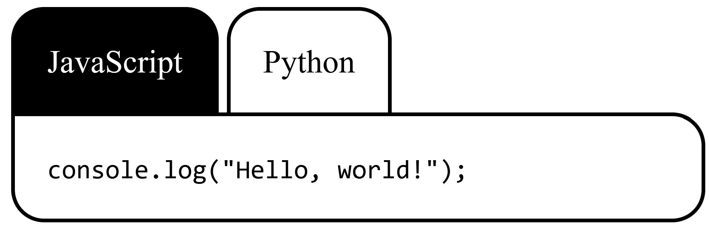

---
{
    title: "Keyboard Input",
    description: "TODO: Change",
    published: '2026-01-01T22:12:03.284Z',
    tags: ['webdev', 'accessibility'],
    order: 5
}
---

[In our Semantic Elements chapter, we made a tab component with some keyboard interactivity:](/posts/art-of-a11y-semantic-markup#Tabs-Interactivity)



We broke this into three different steps:

1) Semantic markup
2) Styling
3) Keyboard handling

While the first was the topic of the chapter and the second is a form of expected pre-requisite knowledge, we completely glossed over the keyboard handling section. I wouldn't blame you if you felt lost in that section.

Let's go back and explain the fundamentals of what we wrote in that example.

# Focus Management

We've discussed before how imperative it is to enable your users to be able to navigate your site using their keyboard alone. To do this, we need to make sure that they can properly <kbd>Tab</kbd> throughout the elements on your screen.

But how does the user know what element is focused? How does the browser know which element to focus next? How can we build a nicer user experience using insights to the previous two questions? 

Let's answer each of these questions, starting with...

## Outline Styles

Let's try an experiment.

Given the following image, what is currently focused?

// TODO: Replace these images


Okay, now which one is focused in this image:


You might assume "None", but you'd be wrong. In this image, the "Part 6" is focused, but the element has had the following CSS applied:

```css
/* This CSS demonstrates how to remove an outline on keyboard focus. Do not do this in production */
outline: none;
```

This is a common "trick" used by many engineers in order to avoid having the blue glow around elements when focused. But here's the thing; if you don't have that glow, how will you know if your element is focused or not?

This is why the accessibility community has been fairly prescriptive with usage of `outline`: **"Never use `outline: none` unless you know what you're doing."**

### Creating custom outline states

Just because the rule of thumb is to not use `outline: none` without good cause doesn't mean we can't ever customize our focus outline. While the browser's default focus outline is typically a blue outline, what if our page has primarily green colors as part of its brand and we wanted our focus states to match?

Let's change that using CSS to customize the ["All elements" selector (`*`)](https://developer.mozilla.org/en-US/docs/Web/CSS/Universal_selectors) and [the `:focus` state selector](https://developer.mozilla.org/en-US/docs/Web/CSS/:focus):

```css
body {
	/* Green 100 */
    background: #C9FBE2;
	/* Green 900 */
    color: #00524F;
}

a {
    /* Green 900 */
    color: #00524F;
}

*:focus {
	/* Green 600 */
    outline: 4px solid #009483;
    /* Add a gap between the element and the outline */
    outline-offset: 4px;
}
```

We can check this against a link element to verify that we have a focus indicator when the user has the element tabbed to.

---


<div>
<div class="green-test-1">
<a href="#">This is a link</a>
</div>
<style>
.green-test-1  {
padding: 1rem;
min-height: 150px;
min-width: 300px;
max-width: 100%;
background: #C9FBE2;
}
.green-test-1 a {
color: #00524F;
}
.green-test-1 *:focus {
outline: 4px solid #009483;
outline-offset: 4px;
}
</style>
</div>


---

Awesome! We know have a focus ring that has our page's branding colors applied! Now let's apply this focus ring to a button:

---


<div>
<div class="green-test-2">
<button>This is a button</button>
</div>
<style>
.green-test-2  {
  padding: 1rem;
  min-height: 150px;
  min-width: 300px;
  max-width: 100%;
  background: #C9FBE2;
}
.green-test-2 a {
  color: #00524F;
}
.green-test-2 *:focus {
  outline: 4px solid #009483;
  outline-offset: 4px;
}
</style>
</div>


---

Everything looks good, but... Wait... Why is the focus ring visible when the user is clicking on the button with a mouse? That's not how the browser default focus indicator works!

That's correct. To solve this problem. we need not eleminate the custom outline, but instead we can replace our `:focus` psuedo-selector with [a `:focus-visible` selector](https://developer.mozilla.org/en-US/docs/Web/CSS/:focus-visible):

```css
*:focus-visible {
	/* Green 600 */
    outline: 4px solid #009483;
    /* Add a gap between the element and the outline */
    outline-offset: 4px;
}
```

This CSS state selector enables you to customize the behavior when the browser would typically show a focus ring by default.

Let's see if it's fixed the issue with our button annnnd...

---


<div>
<div class="green-test-3">
<button>This is a button</button>
</div>
<style>
.green-test-3  {
  padding: 1rem;
  min-height: 150px;
  min-width: 300px;
  max-width: 100%;
  background: #C9FBE2;
}
.green-test-3 a {
  color: #00524F;
}
.green-test-3 *:focus-visible {
  outline: 4px solid #009483;
  outline-offset: 4px;
}
</style>
</div>


---

It has! 🎉 Hooray!

## `tabindex` Handling

One easy to conceptualize way to make your site navigable via a keyboard is by making sure all interactive elements are able to be tabbed into. Some elements are marked as "tab-able" by the browser without any extra effort:

- Links (`<a>`)
- Inputs (`<input>`)
- Select Dropdowns (`<select>`)
- Textareas (`<textarea>`)
- Buttons (`<button>`)
- iFrames (`<iframe>`)

While the browser does a good job at marking most relevant elements, some applications have more unique requirements.

For example, let's look at our tabs example from before:


While tabbing through the different tabs might not be _too_ bad if you only have a single instance of tab groupings and only two tabs per group; this problem grows exponentially as you add more tabs and tab groups to a page.

As a result, if we took the naïve approach of having each tab being its own `<button>`, the user would have to tab through each tab one-by-one:

----


<div class="__tab_example_1">
<div class="tablist">
<button class="tab selected">
JavaScript
</button>
<button class="tab">
Python
</button>
</div>
<div class="tabpanel">
<code>console.log("Hello, world!");</code>
</div>
</div>
<style>
.__tab_example_1 button {
all:unset;
}
.__tab_example_1 code {
all:unset !important;
font-family: monospace !important;
}
.__tab_example_1 .tablist {
margin: 0;
padding: 0; 
display: flex;
gap: 0.25rem;
}
.__tab_example_1 .tab {
background:white;
display: inline-block;
padding: 1rem;
border: solid black;
border-width: 2px 2px 0 2px;
border-radius: 1rem 1rem 0 0;
}
.__tab_example_1 .tab:focus-visible {
	outline: none;
	box-shadow:
		0 0 0 2px #000,
		0 0 0 4px #fff,
		0 0 0 6px #000;
}
.__tab_example_1 .tab:hover {
background: #d3d3d3;
}
.__tab_example_1 .tab:active {
background: #878787;
}
.__tab_example_1 .tab.selected {
background: black;
color: white;
}
.__tab_example_1 .tabpanel {
background:white;
border: solid black;
border-width: 2px;
padding: 1rem;
border-radius: 0 1rem 1rem 1rem;
}
</style>

> This is a demonstration of an inaccessible tab panel. Try to use it without using your mouse. It's intended to be non-functional, but even with that constraint, moving through each tab on a <kbd>Tab</kbd> keypress is obnoxious.

---

> So how do we solve this problem?

Well, ideally we'd have the flexibility to control the flow the user takes when they hit <kbd>Tab</kbd> and add additional keyboard controls to ensure the user has the ability to move using the left and right arrow keys.

> Well, let's focus on the tab flow control — how do we do that?

The answer? `tabindex`.

While [the `tabindex` attribute has more nuance to it than this](https://developer.mozilla.org/en-US/docs/Web/HTML/Global_attributes/tabindex), you can think of `tabindex` as a way of manually adding or removing the ability to tab to an HTML element.

See, a `tabindex` value of `0` allows a user to tab to an element, regardless of element type. Meanwhile, a `tabindex` value of `-1` disables the ability to tab to an otherwise tab-able element.

> A negative `tabindex` value also provides us a way to `focus` an element using JavaScript, but more on that later... 🤫

So, if we change our markup from:

```html
<!-- THIS IS INACCESSIBLE MARKUP FOR DEMONSTRATION PURPOSES ONLY -->
<div class="tabgroup">
    <div class="tablist">
        <button class="tab selected">JavaScript</button>
        <button class="tab">Python</button>
    </div>
    <div class="tabpanel">
        <code>console.log("Hello, world!");</code>
    </div>
</div>
```

And add `tabindex` of `-1` or `0` depending on if the tab is selected or not:

```html
<!-- THIS IS STILL INACCESSIBLE MARKUP FOR DEMONSTRATION PURPOSES ONLY -->
<div class="tabgroup">
    <div class="tablist">
        <button tabindex="0" class="tab selected">JavaScript</button>
        <button tabindex="-1" class="tab">Python</button>
    </div>
    <div class="tabpanel">
        <code>console.log("Hello, world!");</code>
    </div>
</div>
```

We can see the `selected` button is able to be tabbed to, while the other button is not:

---


<div class="__tab_example_2">
<div class="tablist">
<button tabindex="0" class="tab selected">
JavaScript
</button>
<button  tabindex="1" class="tab">
Python
</button>
</div>
<div class="tabpanel">
<code>console.log("Hello, world!");</code>
</div>
</div>
<style>
.__tab_example_2 button {
all:unset;
}
.__tab_example_2 code {
all:unset !important;
font-family: monospace !important;
}
.__tab_example_2 .tablist {
margin: 0;
padding: 0; 
display: flex;
gap: 0.25rem;
}
.__tab_example_2 .tab {
background:white;
display: inline-block;
padding: 1rem;
border: solid black;
border-width: 2px 2px 0 2px;
border-radius: 1rem 1rem 0 0;
}
.__tab_example_2 .tab:focus-visible {
	outline: none;
	box-shadow:
		0 0 0 2px #000,
		0 0 0 4px #fff,
		0 0 0 6px #000;
}
.__tab_example_2 .tab:hover {
background: #d3d3d3;
}
.__tab_example_2 .tab:active {
background: #878787;
}
.__tab_example_2 .tab.selected {
background: black;
color: white;
}
.__tab_example_2 .tabpanel {
background:white;
border: solid black;
border-width: 2px;
padding: 1rem;
border-radius: 0 1rem 1rem 1rem;
}
</style>


> This is a demonstration of an non-functional inaccessible tab panel. This time, only one tab is focusable through the <kbd>Tab</kbd> key.

---

### When to not use `tabindex`

While it may seem initially intuitive to add `tabindex="0"` to many elements on your site, be careful in doing so.

One place I've seen aspiring accessible engineers add errant tabindexes is to make it "convinient" for users to navigate to common 

Most screen readers and accessibility technologies already provide a way to rapidly jump from heading to heading with nothing more than their keyboard. As a result, adding `tabindex="0"` to headings can be a duplicate effort to tab past and make things worse than they were before.

### Positive `tabindex`

> To add a preemptive disclaimer: **You should never use `tabindex="n"` where `n` is a positive number. `tabindex="1"` and above cause substantial problems for your users' ability to understand how to navigate your site**.
> 
> Now that's out of the way; Let's learn what positive tab indexes do and why they're so harmful. 

## Element Reference `focus()`

// TODO: Use `ref` to `focus` an element

# Keyboard Shortcuts


## Element default shortcuts

// TODO: Label + checkbox to toggle checkbox on `Enter`

## Element-specific Shortcuts

// TODO: `Up` and `Down` to navigate list

## Global Shortcuts

// TODO: `Esc` to dropdown

## Multi-key shortcuts

// TODO: `Ctrl` + `A` to select all
