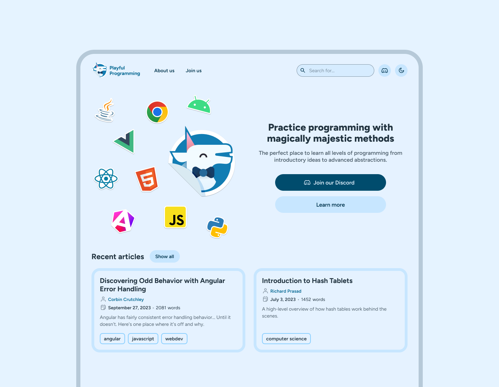

---
{
    title: "Semantic Markup",
    description: "When talking about web accessibility, the story starts and ends with semantic markup. Let's learn what that means and how to leverage it in our apps.",
    published: '2025-04-30T22:12:03.284Z',
    tags: ['webdev', 'accessibility'],
    order: 2
}
---

Have you ever look through a codebase and just see a sea of `div`s as far as the eye can see?

```html
<div>
	<div>Add todo item</div>
	<div class="todos">
		<div>Play games</div>
		<div>Eat ice cream</div>
		<div>Do chores</div>
	</div>
</div>
```

While this may show the contents on screen, it's not the most readable code there is. Instead, let's replace these `div`s with elements that describe what they're doing:

```html
<div>
	<button>Add todo item</button>
	<ul class="todos">
		<li>Play games</li>
		<li>Eat ice cream</li>
		<li>Do chores</li>
	</ul>
</div>
```

See, the HTML specification gives us a wide range of HTML elements we can use, each with their own meaning and intent behind them.

> A `ul` is an `unordered list`, while a `li` is a `list item`.

Not only does this help codebase readability, it helps immensely with accessibility and UX. For example, compare and contrast the two versions of HTML without any added CSS or JavaScript.

---

**The `div` soup:**

<div>
	<div>Add todo item</div>
	<div class="todos">
		<div>Play games</div>
		<div>Eat ice cream</div>
		<div>Do chores</div>
	</div>
</div>

----

**The correct HTML tags:**

<div>
	<button>Add todo item</button>
	<ul class="todos">
		<li>Play games</li>
		<li>Eat ice cream</li>
		<li>Do chores</li>
	</ul>
</div>

-----

Notice how, by default, the correct HTML tags show bullet points next to the list? Or how the button actually is clickable?

This is because the browser knows what a `button` is, and will apply default styling and behavior to the element, that you can then overwrite if need be. Without this information, it doesn't know how to handle a `div` in any special kind of way.

Similarly, a screen-reader doesn't know that our first `<div class="todos">` was a list, and as such wouldn't indicate to the user that it has a list of items, or how many items are in the list. By using an `ul`, it will do all of that for us, without any additional code on our end.

We can see a before and after of this in action using the macOS voiceover screen-reader:

<video src="./semantic_voiceover.mp4" title="The macOS voiceover screen-reader shows the before and after demo of the semantic markup"></video>

These HTML elements are not just supported in `.html` files; **React, Angular, and Vue support all valid HTML elements.**

> **Note:**
> There are a **lot** of HTML elements supported by the latest HTML specification. To find the right element for the job, it may be worthwhile to explore the [HTML elements list from MDN](https://developer.mozilla.org/en-US/docs/Web/HTML/Element) until you're familiar with the list.

# Page Structure

While individual elements like `button` or `ul` provide context on a micro-level, there's also a broader understanding of a page's layout you can convey to the user via proper semantic markup.

Take a homepage like ours:



When the user is able to see the page, they might typically break it down into different visual components like so:


Similarly, we can convey the same structure of our page more programmatically using semantic markup.

Instead of:

```html
<!-- Inaccessible, do not use -->
<div class="header"></div>
<div class="main-contents">
    <div class="top-section"></div>
    <div class="recent-articles-section"></div>
</div>
```

Our markup should instead be:

```html
<header></header>
<main>
    <section class="top"></section>
    <section class="recent-articles"></section>
</main>
```

These structure-based elements, often called "landmark elements", help non-sighted users navigate the page better and even provides a good SEO boost to your site.

## Landmark elements and their meaning

- `<header>`: The header of a site, consistent between different pages.
- `<nav>`: The navigation elements of a site.
- `<main>`: The main contents of a site.
- `<section>`: A grouping of related items, most often with an associated heading.
- `<article>`: A group of related items with all the relevant context contained within.
- `<aside>`: A tangential item to the main contents on a page.
- `<footer>`: The footer of a site, consistent between different pages.

## Landmarks and screen readers

Landmark elements are a great way to help users navigate your site; while sighted users can see the page structure, non-sighted users need to rely on screen readers to help them navigate the page.

This can be done in a number of ways, including Voiceover's "Rotor" feature, which allows users to quickly navigate between different landmarks on the page:

<video src="./landmark_rotor.mp4" title="Voiceover's rotor feature, which allows users to quickly navigate between different landmarks on the page"></video>

### A note on `<section>` elements and screen readers

While `<section>` elements are a great way to group related items together and keep semantic meaning, they don't always act as a landmark element.

[It's only when an `aria-label` attribute - something we'll cover soon - is added to a `<section>` does it act like a landmark element. Without this, they're treated no differently than `div`s.](https://www.scottohara.me/blog/2021/07/16/section.html)

Check the difference between how a screen-reader treats a `<section>` with an `aria-label` and one without:

<video src="./section_voiceover.mp4" title="Voiceover reading out the section with and without an aria-label differently"></video>

> While this may lead you to assume a `<section>` without a label is useless, it does have its place as a semantic element.
> 
> If nothing else, a `<section>` provides information to your team that a given bit of markup is a section of the page, and not just a random `div` with a class name.

> **Warning:**
> After learning this, you may be tempted to add `aria-label` attributes to all of your `<section>` elements; **do not do this**.
> 
> Not only do these kinds of labels typically end up duplicative with the heading of the section, they can also lead to confusion for screen reader users.
> 
> [We'll learn more about how to structure a page with headings in the next chapter all about Text.](/posts/art-of-a11y-text)

## Landmarks Screen Reader Cheat Sheet

Here's a list of screen reader commands related to landmarks in [Voiceover](https://support.apple.com/guide/voiceover/welcome/mac), [NVDA](https://www.nvaccess.org/download/), and [JAWS](https://www.freedomscientific.com/products/software/jaws/):

| Screen Reader | Command                                                        | Shortcut                                                |
|:--------------|:---------------------------------------------------------------|---------------------------------------------------------|
| Voiceover     | Show landmark list (via the Voiceover rotor in the demo above) | <kbd>Command (⌘)</kbd> + <kbd>Ctrl</kbd> + <kbd>U</kbd> |
| NVDA          | Show a list of all elements, including landmarks               | <kbd>Insert</kbd> + <kbd>F7</kbd>                       |
| NVDA          | Go to next landmark                                            | <kbd>D</kbd>                                            |
| JAWS          | Show a list of all elements, including landmarks               | <kbd>Insert</kbd> + <kbd>F3</kbd>                       |
| JAWS          | Go to next landmark                                            | <kbd>R</kbd>                                            |
| JAWS          | Go to the main content region                                  | <kbd>Q</kbd>                                            |

# ARIA

Sometimes we have custom UI requirements. Like, _really_ custom UI requirements. We may want a dropdown that also has the ability to filter results as the user types.


While some of this component has clear analogs in HTML elements:

- The search input should be an `input` component
- The dropdown list should be an `ul` with `li` to indicate that it's a list

Other parts of this UI are unclear how to communicate to the user at first glance.

How do we indicate to the user that the suggestion dropdown is active? How can we associate the text input element with the suggestion list element for screen readers?

This type of ultra-custom UI is where ARIA comes into play.

ARIA is an acronym for "Accessible Rich Internet Applications", and is a collection of HTML attributes that help provide additional UI information to the end user.

 For example, the dropdown arrow might have an attribute of `aria-expanded="true"` or `aria-expanded="false"` to indicate to screen readers that the dropdown is expanded or not.

The following HTML:

```html
<button aria-expanded="true">States</button>
```

Might be read by a screen reader as "States button, expanded", which tells our user that they have more information they can access pertaining to the button.

Likewise, the `aria-controls` attribute tells the assistive technology which element the button expands. This attribute takes an HTML `id`'s name and enables the user to quickly jump to the controlled element using a user-defined key combo.

```html
<button aria-expanded="true" aria-controls="states-list">States</button>
<ul id="states-list">
   <li>Alabama</li>
   <li>Alaska</li>
   <li>Arizona</li>
   <!-- ... -->
</ul>
```

> This is a wildly incomplete example of a "Select-only Combobox" UI component. A more complete example of such a component [can be found on the W3C's website](https://www.w3.org/WAI/ARIA/apg/patterns/combobox/examples/combobox-select-only/), though even they admit their example is for demonstration purposes only.
>
> This component in particular has significantly more nuance than you might assume, and as such is an extremely tricky component to implement properly. If you're looking to add one to your production site, make sure you do sufficient user testing before shipping to your generalized end-users.

While a complete list of these ARIA attributes are out of the scope of this book, [you can find a reference to them on MDN](https://developer.mozilla.org/en-US/docs/Web/Accessibility/ARIA/Attributes). Each comes with their own use-cases and nuance.

## ARIA Roles

> What if we need an accessible UI pattern that HTML doesn't provide with native elements?

This is where an attribute comes into play that we should proceed to use with immense caution; `role`.

The `role` attribute allows us to tell the browser that an element should be treated as a different element than it actually is, including some elements that HTML itself doesn't provide.

For example, say we wanted to provide the user tabs in their UI:


This is a common UI pattern that HTML doesn't provide a native element for. As a result, our markup _might_ look something like:

```html
<div>
    <ul role="tablist">
        <li role="tab" id="javascript-tab" aria-selected="true" aria-controls="javascript-panel">
            JavaScript
        </li>
        <li role="tab" id="python-tab" aria-selected="false" aria-controls="python-panel">
            Python
        </li>
    </ul>
    <div role="tabpanel" id="javascript-panel" aria-labelledby="javascript-tab">
        <code>console.log("Hello, world!");</code>
    </div>
    <div role="tabpanel" id="python-panel" aria-labelledby="python-tab">
        <code>print("Hello, world!")</code>
    </div>
</div>
```

Here, the `role` enables us to tell the user that there is a list of tabs, `aria-controls` and `aria-labelledby` tells the user which contents belong to which tab, and `aria-selected` informs the user which tab is currently selected.

> Keep in mind, we have to change these `aria` attributes on-the-fly as the information changes; say, with the `aria-selected` indicating which tab is active.
>
> HTML does not provide a way to automatically change the `aria` attributes for us without JavaScript.
>
> We'll build an interactive version of this `tab` component using React, Angular, and Vue later in this chapter that handles these things.

While `role` is imperative in its usage here, it _can_ lead to subpar or even actively hostile user experiences for assistive technologies.

This is because, using `role`, you have the ability to tell HTML that one element should be reflected to the end-user as an entirely different element, without actually providing any of the expected functionality.

To explain this more, let's look at how an HTML `button` works.

### Defaulted HTML Roles

When you create an HTML element like `button`, the browser implicitly assigns it a `role` internally, regardless of if you assigned one or not.

In this case:

```html
<button>Click me!</button>
```

Is implicitly treated by the browser as having `role="button"` assigned to it.

> If that's the case, then surely `<div type="button">` must act the same as a `<button>`, right?

Not quite.

While you could create a partially analogous `button` element using a `div`:

```html
<!-- Inaccessible, do not use -->
<div tabindex="0" role="button">Save</div>
```

 You might notice a problem with it when displayed on a web page:

---

<div tabindex="0" role="button">Save</div>

---

Notice that the fake "button" here doesn't appear to "press" down? There's no styling to indicate when the user is hovered over the "button", nor is there any visual indication when the user is hovered over the "button" with their mouse.

Not only that, but if we go to add a `click` event to the `div`, it won't work when the user presses the `Enter` or `Space` keys, which is the expected behavior of a button.

This is why it's often **highly discouraged to use `role` in place of an HTML element with an implicit `role` enabled**; they simply don't have feature parity without a substantial amount of work and expertise.

# Building a tab component with ARIA

Now that we've seen a few examples of accessible, but non-interactive, markup let's see what we can do to breath life into these UI components using a framework.

Namely, I want to demonstrate how we can build our own accessible tab component using aria attributes:


Let's start by reusing our markup from the previous section, and adding in some JavaScript to make the tabs interactive.

<!-- ::start:tabs -->

## React

```jsx
const App = () => {
  const [activeTab, setActiveTab] = useState('javascript');

  return (
    <div>
      <ul role="tablist">
        <li
          role="tab"
          id="javascript-tab"
          aria-selected={activeTab === 'javascript'}
          aria-controls="javascript-panel"
          onClick={() => setActiveTab('javascript')}
        >
          JavaScript
        </li>
        <li
          role="tab"
          id="python-tab"
          aria-selected={activeTab === 'python'}
          aria-controls="python-panel"
          onClick={() => setActiveTab('python')}
        >
          Python
        </li>
      </ul>
      <div
        role="tabpanel"
        id="javascript-panel"
        aria-labelledby="javascript-tab"
        hidden={activeTab !== 'javascript'}
      >
        <code>console.log("Hello, world!");</code>
      </div>
      <div
        role="tabpanel"
        id="python-panel"
        aria-labelledby="python-tab"
        hidden={activeTab !== 'python'}
      >
        <code>print("Hello, world!")</code>
      </div>
    </div>
  );
};
```

## Angular

```angular-ts
@Component({
  selector: 'app-root',
  changeDetection: ChangeDetectionStrategy.OnPush,
  template: `
  <div>
    <ul role="tablist">
      <li
        role="tab"
        id="javascript-tab"
        [attr.aria-selected]="activeTab() === 'javascript'"
        aria-controls="javascript-panel"
        (click)="setActiveTab('javascript')"
      >
        JavaScript
      </li>
      <li
        role="tab"
        id="python-tab"
        [attr.aria-selected]="activeTab() === 'python'"
        aria-controls="python-panel"
        (click)="setActiveTab('python')"
      >
        Python
      </li>
    </ul>
    <div
      role="tabpanel"
      id="javascript-panel"
      aria-labelledby="javascript-tab"
      [hidden]="activeTab() !== 'javascript'"
    >
      <code>console.log("Hello, world!");</code>
    </div>
    <div
      role="tabpanel"
      id="python-panel"
      aria-labelledby="python-tab"
      [hidden]="activeTab() !== 'python'"
    >
      <code>print("Hello, world!")</code>
    </div>
  </div>
  `,
})
export class AppComponent {
  activeTab = signal('javascript');

  setActiveTab(val: string) {
    this.activeTab.set(val);
  }
}
```

## Vue

```vue
<script setup>
  import { ref } from 'vue'

  const activeTab = ref('javascript')

  function setActiveTab(val) {
    activeTab.value = val
  }
</script>

<template>
  <div>
    <ul role="tablist">
      <li
        role="tab"
        id="javascript-tab"
        :aria-selected="activeTab === 'javascript'"
        aria-controls="javascript-panel"
        @click="setActiveTab('javascript')"
      >
        JavaScript
      </li>
      <li
        role="tab"
        id="python-tab"
        :aria-selected="activeTab === 'python'"
        aria-controls="python-panel"
        @click="setActiveTab('python')"
      >
        Python
      </li>
    </ul>
    <div role="tabpanel" id="javascript-panel" aria-labelledby="javascript-tab" :hidden="activeTab !== 'javascript'">
      <code>console.log("Hello, world!");</code>
    </div>
    <div role="tabpanel" id="python-panel" aria-labelledby="python-tab" :hidden="activeTab !== 'python'">
      <code>print("Hello, world!")</code>
    </div>
  </div>
</template>
```

<!-- ::end:tabs -->


> 🎉 Tad-whoa. 😵‍💫


> Are we sure this worked?

Well, it's not the prettiest UI visually, but we can verify it's functionality by clicking on the `JavaScript` or `Python` text in order to show the `console.log` or `print` statements respectively.

Now all we need to do is add a bit of CSS...

<details>
<summary>The required CSS for the tab component</summary>

```css
/* index.css */
[role="tablist"] {
  margin: 0;
  padding: 0; 
  display: flex;
  gap: 0.25rem;
}

[role="tab"] {
  display: inline-block;
  padding: 1rem;
  border: solid black;
  border-width: 2px 2px 0 2px;
  border-radius: 1rem 1rem 0 0;
}

[role="tab"]:hover {
  background: #d3d3d3;
}

[role="tab"]:active {
  background: #878787;
}

[role="tab"][aria-selected="true"] {
  background: black;
  color: white;
}

[role="tabpanel"] {
  border: solid black;
  border-width: 2px;
  padding: 1rem;
  border-radius: 0 1rem 1rem 1rem;
}
```

</details>

And tada! 🎉 (For real this time.)


<!-- ::start:tabs -->

## React

<iframe data-frame-title="React Tab Component - StackBlitz" src="pfp-code:./art-of-a11y-react-tab-comp-1?embed=1&file=src/main.jsx" sandbox="allow-modals allow-forms allow-popups allow-scripts allow-same-origin"></iframe>

## Angular

<iframe data-frame-title="Angular Tab Component - StackBlitz" src="pfp-code:./art-of-a11y-angular-tab-comp-1?embed=1&file=src/app/main.ts" sandbox="allow-modals allow-forms allow-popups allow-scripts allow-same-origin"></iframe>

## Vue

<iframe data-frame-title="Vue Tab Component - StackBlitz" src="pfp-code:./art-of-a11y-vue-tab-comp-1?embed=1&file=src/App.vue" sandbox="allow-modals allow-forms allow-popups allow-scripts allow-same-origin"></iframe>

<!-- ::end:tabs -->

Now _these_ are some tabs we can work with.

