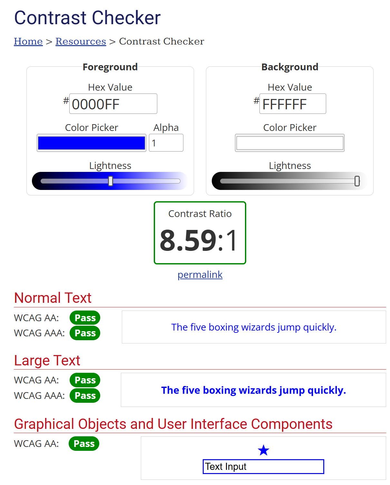
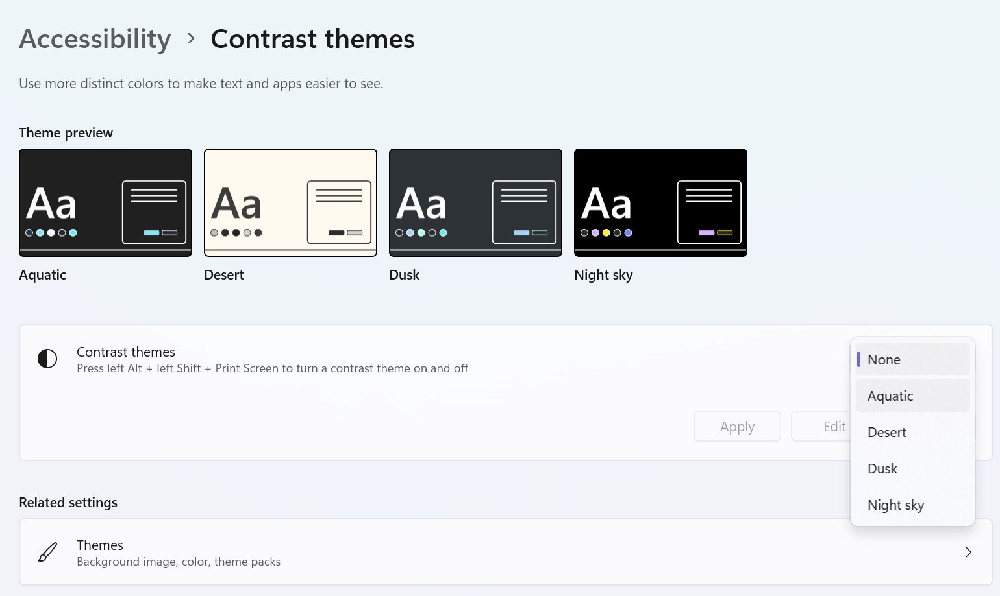
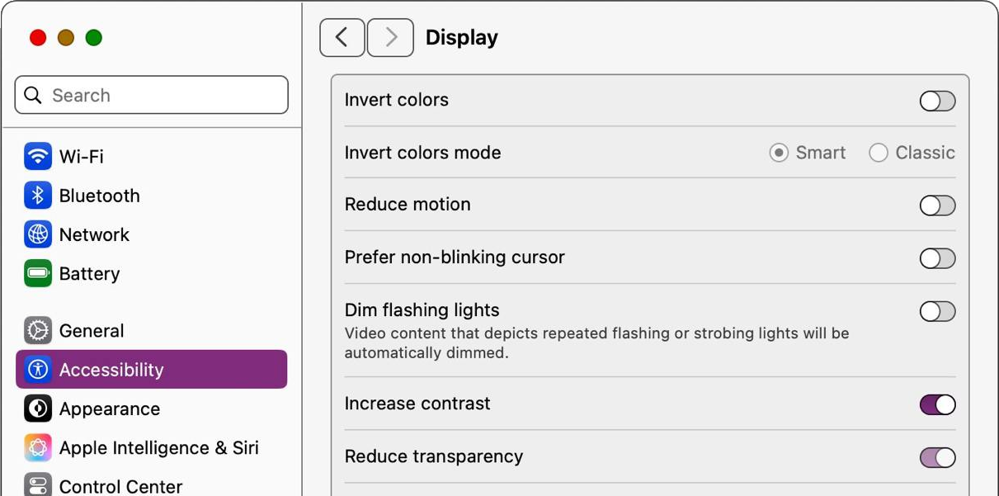
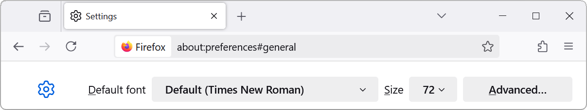
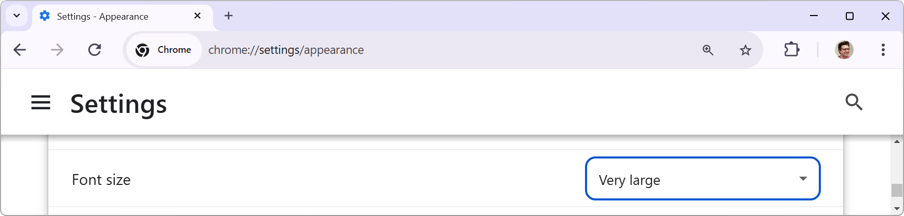
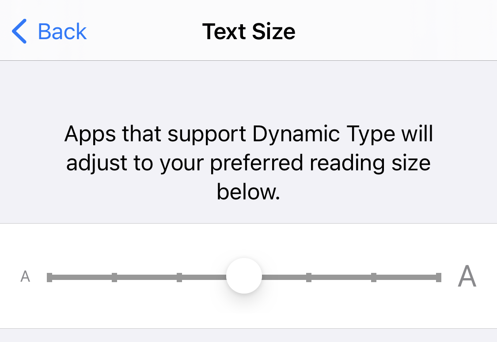
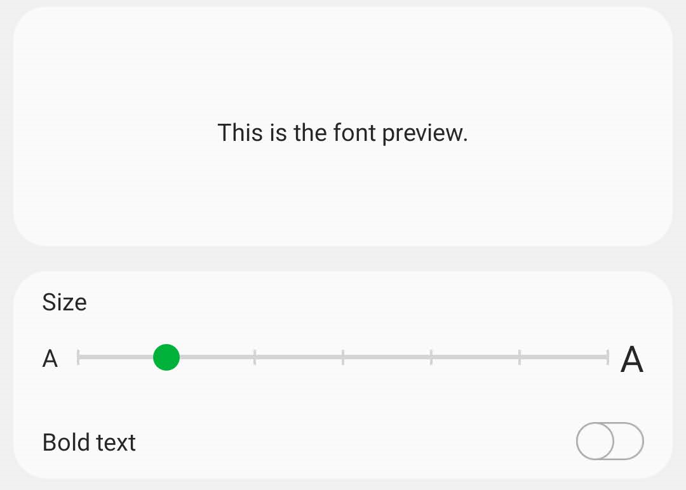
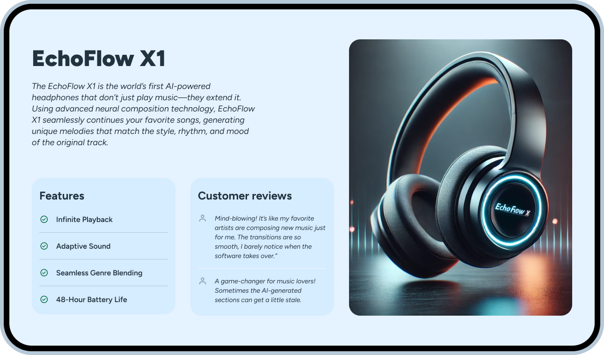

---
{
    title: "The Art of Accessibility: Text",
    description: "Text makes up most of our apps. Lets make sure that our app's text is legible and able to be accessed through assistive technologies like screen readers.",
    published: '2025-04-30T22:12:03.284Z',
    tags: ['webdev', 'accessibility'],
    order: 3
}
---

Think about your site. Yes, the one you're working on. What is it mostly comprised of?

If the answer isn't "text", you're either thinking on too high of an abstraction level (remember, a button has text too), or you're working on something _very_ bespoke.

Given the predominance of text on most sites, it probably won't come as a surprise that there's some important paradigms to follow to ensure your text is accessible.

# Color Contrast

Take the following text:

<p style="opacity: 0.2">This is hard to read</p>

> If you can't see the text, it says "This is hard to read" and is intentionally visually challenging to see due to a low opacity. We'll cover why in a moment.

Can you read it well? How about if you squint? How about from far away?

<p style="opacity: 0.2; filter: blur(2px)">This is hard to read</p>

> This text says the same thing but is now also blurred.

How about _now_?

The reason you're struggling to see this is because it has _low contrast_. For users with [twenty-twenty vision](https://en.wikipedia.org/wiki/Visual_acuity#Definition), the blurred text helps emulate what it _might_ be like to see some text in low contrast for other users.

Let's see what that blurred text looks like with proper color contrast:

 <p style="filter: blur(2px)">This is hard to read</p>

A little easier to see? Good! That's the point. Sufficient contrast can help many users - especially those with color blindness or other visual challenges - see what might otherwise be too difficult to visualize otherwise.

> It's important to note that good contrast doesn't supplement proper screen-reader usage and vice-versa. 
>
> Some users may utilize both their eyes and screen reader technology at the same time to help clarify any challenging to see parts of the screen.

## WCAG AA vs AAA

[As mentioned in the preface](/posts/art-of-a11y-preface), there are three levels of compliance with the "Web Content Accessibility Guidelines" (WCAG) - the industry standard guidelines on accessibility: A, AA, and AAA.

While there are no rules in WCAG's A ruleset, AA and AAA both have different requirements for color contrast between a foreground color and background color:

| Ruleset | Content Type | Min Contrast Ratio |
| --- | --- | --- |
| AA | Small Text | `4.5:1` |
| AA | Large Text | `3:1` |
| AA | Graphical Elements | `3:1` |
| AAA | Small Text | `7:1` |
| AAA |Large Text | `4.5:1` |
| AAA | Graphical Elements| `3:1` |

[This ratio can be calculated either programmatically](https://www.w3.org/TR/WCAG20-TECHS/G17.html#G17-procedure):

```javascript
const CONTRAST_RATIO = (L1 + 0.05) / (L2 + 0.05)
```

> L1 is the relative luminance of the lighter of the colors.
> L2 is the relative luminance of the darker of the colors.

Or manually, using various tools such as [WebAIM's Color Contrast Checker](https://webaim.org/resources/contrastchecker/):



## CSS Detection

When comparing AA to AAA compliance, a common qualm lodged against AAA is that its contrast requirements feel too constrictive for a site's "look and feel" compared to AA's easier compliance ratios.

Luckily, there are ways we can have both!

Users are able to opt into an operating system's "high contrast" mode, which will notify the browser to follow in suit.





This, in turn, is exposed to our site's CSS through [the `prefers-contrast` media query](https://developer.mozilla.org/en-US/docs/Web/CSS/@media/prefers-contrast) :

```css
@media (prefers-contrast: more) {
  .contrast {
    color: black;
    background: #f0efef;
  }
}
```

-----

We can even use JavaScript to detect this media query from inside of our runtime code:

```javascript
// Use JS to detect the user's preference for contrast
const mediaQuery = window.matchMedia("(prefers-contrast: more)");

function changeText(matches) {
	if (matches) {
		el.textContent = "The user prefers more contrast";
	} else {
		el.textContent = "The user has not specified a preference for contrast";
	}
}

// To check the initial value:
changeText(mediaQuery.matches);

// To listen for changes:
mediaQuery.addEventListener("change", (e) => {
	changeText(e.matches);
});
```

<iframe data-frame-title="HTML CSS Detection - StackBlitz" src="pfp-code:./art-of-a11y-html-contrast-detection-2?embed=1&file=src/main.js" sandbox="allow-modals allow-forms allow-popups allow-scripts allow-same-origin"></iframe>

# Text Size

Let's do a similar demo to the one above. Can you read this?

<p style="font-size: 0.5rem">This is very small text</p>

> There is text above this that says "This is very small text".

How about this?

<p style="font-size: 0.5rem; filter: blur(2px)">This is very small text</p>

> The same text is now blurred.

Probably not? Alright! Now how about _this_ one?

<p style="font-size: 3rem; filter: blur(2px)">This is large text</p>

> It now says "This is large text"!

This demonstrates how important text sizing is for so many of our users. 

## `rem` vs `px` Values

In web development, we often use `px` to represent sizing of things. `1px` _roughly_ means `1 pixel`, which works fine for many things on the web.

Want an image to be a certain size? `px` is fine.

Want to add some padding to your header? `px` is probably fine.

Want to set the size of a font to be larger or smaller than the default? `px` is.... **not** fine.

> Wait, what?

Yes, my dear reader; with very few exceptions your font sizes should not be based on `px` values, but rather utilize an `rem` value instead.

`rem` stands for `root em`. See, `em` is another CSS unit that roughly means "Relative to the parent element's font-size."

```html
<p style="font-size: 1.25rem">
    This is a paragraph that is going to contain some code:
    <br/>
    <code style="font-size: 0.9em">console.log("test")</code>
</p>
```

Here, we're using `rem` to tell our `<p>` element that "regardless of the size of the parent elements, size it 1.25 times the user's default font size" and that the `<code>` element should be "0.9 times the size of the `<p>` element's `font-size`".

> While [we have a guide that explains `em` and `rem` in more depth](https://playfulprogramming.com/posts/web-fundamentals-css), the gist of it is that `em` should be used when you want to position an element's `font-size` relative to its parent, while `rem` should be used for any absolute value of `font-size`.


Keep in mind that any kind of user-facing font resizing will break if you set a `font-size` property to a `px` value on any of the following CSS selectors:

- `:root`
- `html`
- `body`

To preserve user-facing font-sizing, you should be keeping all font-values as either `rem` or, in specific usages, `em`.


## Browser Behaviors

> Why does this matter? `px` seems to work fine to me.

Let's do an experiment:

- Open your browser
- Find your settings
  - [In Chrome, this is a deep-link to the right page](chrome://settings/appearance)
  - In Firefox, this is a link to your settings: `about:preferences` - you'll need to copy-paste this into your URL 
- Change your font size to either "Very large" (Chrome) or "72" (Firefox)
  - 
  - 
- Come back to this page and see how the following text sizes change

----


<p style="font-size: 16px">This text size will always be 16px</p>

-----

<p style="font-size: 1rem">This text size will change based on the user's preferences</p>

----

> If the top and bottom font sizes are the same, try changing the `Font size` again, but this time to the lowest setting. Does it look different then?

Imagine being stuck with the earlier `This is very small text` font size for every page you land on. If you're using `px` for font sizing, that's exactly how many of your users will end up feeling.

By default, _most_ browsers have their `font-size` set to roughly `16px`, so if it helps you to think about relative sizing; you can approximate your `rem` values as multiplications of that `font-size` value (where `1.25rem` is ~`20px`).

### OS Behaviors

This text sizing behavior doesn't _just_ occur on desktop, nor does it only occur in the browser. Many users will have this text resizing behavior occur because they set it up during the initial configuration of their phone's set up:

<div style="display: flex; justify-content: space-around">
    <figure>
		            
        <figcaption>
            iOS font size settings screen
        </figcaption>
    </figure>
    <figure>
        
        <figcaption>
            Android font size settings screen
        </figcaption>
    </figure>
</div>

In fact, this may be the most common way your user is establishing their font sizes for your site usage.

## Dynamic Font Sizes

In some designs, it can be a fun addon to scale a header's visual size with the viewport of the window; Typically to get the width of the text to more closely align with the edges of the screen for visual flair.

This can be done using the `vw` or even `vh` CSS units.

----

<p style="font-size: 2vw; line-height: 2.5vw">Each character on this line takes up 2% of screen width</p>

<p style="font-size: 2vh; line-height: 2.5vh">Each character on this line takes up 2% of screen height</p>

----

> This works, but on some smaller screen sizes, the text is unreadably small. Likewise, large screens have the text far too big.

Well, to solve this, we can use CSS' `min()` to fix the first problem:

```css
p {
	font-size: min(12px, 2vw);
}
```

Or even CSS' `max` to fix the second problem:

```css
p {
	font-size: max(2vw, 36px);
}
```

And even mix-n-match them:

```css
p {
	font-size: max(12px, min(2vw, 36px);
}
```

There's even a `clamp` utility to shorthand the `max`/`min` combination usage from above:

```css
p {
	font-size: clamp(12px, 2vw, 36px);
}
```

----

> But how do we do this without ruining the user's ability to change their font size at the upper and lower ends of allowed font scaling?

Great question!

To support user-resizable mins and maxes on dynamically sized fonts, we can use `rem` instead of `px` in our `min()`, `max()`, and `clamp()` usages:

```css
p {
	font-size: clamp(0.75rem, 2vw, 2.25rem);
}
```

----

<p style="font-size: clamp(0.75rem, 2vw, 2.25rem); line-height: clamp(1rem, 2.5vw, 2.5rem)">Each character on this line takes up 2% of screen width but has a min and max <code>rem</code> value</p>

-----

# Headings

When talking about text, it's only natural that heading would come into the conversation.

In HTML, we have 6 levels of headings:

- <p class="text-style-headline-1"><code>h1</code></p>
- <p class="text-style-headline-2"><code>h2</code></p>
- <p class="text-style-headline-3"><code>h3</code></p>
- <p class="text-style-headline-4"><code>h4</code></p>
- <p class="text-style-headline-5"><code>h5</code></p>
- <p class="text-style-headline-6"><code>h6</code></p>

Each of these heading levels represents a new segment of the site with information to all users about how to scan and navigate a page's contents.

While headings might seem fairly straightforward at first, they have a bit more depth than you might expect at first.

## Screen Readers

Headings help structure the page for your users. Not only can they provide visual structure to a page with the font size, but they can report to a screen-reader to help quickly navigate through a page as well.

Here's one such example of a screen reader - Voiceover built into macOS - navigating [our home page](/) via their "rotor" feature, which lists all headings:

<video src="./macos_voiceover_heading_navigation.mp4" title="The macOS voiceover shows a list of headings to the user and allows them to quickly navigate a table of headings"></video>

### Screen Reader Cheat Sheet

Here's a list of screen reader commands related to headings in [Voiceover](https://support.apple.com/guide/voiceover/welcome/mac), [NVDA](https://www.nvaccess.org/download/), and [JAWS](https://www.freedomscientific.com/products/software/jaws/):

| Screen Reader | Command                                                      | Shortcut                                                     |
| :------------ | :----------------------------------------------------------- | ------------------------------------------------------------ |
| Voiceover     | Show heading list (via the Voiceover rotor in the demo above) | <kbd>Command (⌘)</kbd> + <kbd>Ctrl</kbd> + <kbd>U</kbd>      |
| Voiceover     | Go to next heading                                           | <kbd>Command (⌘)</kbd> + <kbd>Ctrl</kbd> + <kbd>H</kbd>      |
| Voiceover     | Go to previous heading                                       | <kbd>Command (⌘)</kbd> + <kbd>Ctrl</kbd> + <kbd>Shift</kbd> + <kbd>H</kbd> |
| NVDA          | Go to next heading                                           | <kbd>H</kbd>                                                 |
| NVDA          | Go to next heading of level [1-6]                            | <kbd>1</kbd> - <kbd>6</kbd>                                  |
| NVDA          | List all headings                                            | <kbd>Insert</kbd> + <kbd>F7</kbd>                            |
| JAWS          | Go to next heading                                           | <kbd>H</kbd>                                                 |
| JAWS          | List all headings                                            | <kbd>Insert</kbd> + <kbd>F6</kbd>                            |
| JAWS          | Go to next heading of level [1-6]                            | <kbd>1</kbd> - <kbd>6</kbd>                                  |

## Heading order

Because headings are often used to orient users on a page, it's important that we structure them in ways that make sense at a quick "glance". This is where heading order becomes very important.

Many of the rules around the order of headings come from how we naturally count. Let's explore two different rules that resonate with this natural counting method.

### One `h1` per page

While most programmers might disagree, ask most people to count to `10` and they'd likely start at `1`.

Similarly, you want to make sure that each of your pages has an `h1` at the top of the page:

```html
<!-- This is good! -->
<h1>Search page</h1>
<!-- ... -->
<h2>Collections</h2>
<!-- ... -->
<h2>Posts</h2>
<!-- ... -->
```

However, while other heading levels can be repeated without any concern, **`h1`s are expected to be uniquely added only once per page**, to allow the rest of the page's structure to be defined by an `h1`:

```html
<!-- This is bad -->
<!-- "Collections" and "Posts" shoud be h2s -->
<h1>Search page</h1>
<!-- ... -->
<h1>Collections</h1>
<!-- ... -->
<h1>Posts</h1>
<!-- ... -->
```

### Descending heading orders

If we asked our imaginary population to count to `10` again, we'd find that most folks are likely to assume an increment of one counting up: `1`, `2`, `3`, and so on.

After all, it would be atypical for someone to go from `2` to `4` when counting upwards, right?

The same applies for headings: **Headings are expected to be added in a descending order of `1` level of depth at a time**.

For example:

```html
<h2>Heading two</h2>
<!-- Good! Went from 2 to 3 -->
<h3>Heading three</h3>
<!-- Bad! Missing an `h4` -->
<h5>Heading three</h5>
```

However, while you should only count heading levels down by `1` at a time, you can jump back up the count by any number you'd like:

``` html
<!-- This is all allowed -->
<h2>Heading two</h2>
<h3>Heading three</h3>
<h4>Heading four</h4>
<h2>Heading five</h2>
```

## Content Grouping

When working with content that has a distinct grouping of information, it may be tempting to assume that the user can simply use headings to distinguish different parts of the site.

Alas, this isn't true! Take the following example:



This mockup might be naïvely marked up as such:

```html
<h1>EchoFlow X1</h1>

<h2 class="visually-hidden">Description</h2>
<p>The EchoFlow X1 is the world's first...</p>
<h2>Features</h2>
<ul>
    <li>Infinite Playback</li>
    <li>Adaptive Sound</li>
</ul>
<h2>Customer Reviews</h2>
<p>Mind blowing! It's like...</p>
<p>A game-changer for music...</p>
```

But this introduces a problem: Where does one part of the app stop and another part begin?

This is where `<section>` tags come into play. Let's change our markup to the following:

```html
<h1>EchoFlow X1</h1>
<main>
  

  <section>
    <h2 class="visually-hidden">Description</h2>
    <p>The EchoFlow X1 is the world's first...</p>
  </section>

  <section>
    <h2>Features</h2>
    <ul>
        <li>Infinite Playback</li>
        <li>Adaptive Sound</li>
  	</ul>
  </section>

  <section>
    <h2>Customer Reviews</h2>
    <ul>
        <li>Mind blowing! It's like...</li>
        <li>A game-changer for music...</li>
      </ul>
  </section>
</main>
```

Now it's more clear which headings belong to which sections.

>  **Keep in mind:**
>
> Sections should almost always have a heading as the first child; otherwise it's challenging to figure out what a given section is intended to do.

# Invisible Text

In our previous code sample, you may have noticed that we had the following:

```html
<h2 class="visually-hidden">Description</h2>
```

> What is that class doing?

Well, as the name suggests, `visually-hidden` is a custom class that allows you to keep text accessible by screen-readers and programmatic access, but hidden visually:

```css
.visually-hidden {
  position: absolute;
  width: 1px;
  height: 1px;
  padding: 0;
  margin: -1px;
  overflow: hidden;
  clip: rect(0, 0, 0, 0);
  white-space: nowrap;
  border: 0;
}
```

> Why would we want to have a heading that's visually hidden?

Good question! In the example we showed earlier, it allows for further clarity in the `<section>` to have an associated header.

Let's take a look at some common "do" and "do not"s with visually hidden text.

**Do**:

- Use invisible text to convey information to the user that might only be visual otherwise:

    ```html
    <span>
        <span aria-hidden="true">★★★★☆</span>
        <span class="visually-hidden"> Rating: 4 out of 5 stars</span>
    </span>
    ```

    > **Tip:**
    >
    > You may even want to add in a tooltip when the user is focused or hovered on a visual-only element to display this text as well.

    ```html
    <button>
        <svg aria-hidden="true">...</svg>
        <span class="visually-hidden">Settings</span>
    </button>
    ```

    > **Note:**
    > When dealing with SVGs, you may want to use the SVG `<title>` element instead. [See this guide from Deque for more nuance on the topic](https://www.deque.com/blog/creating-accessible-svgs/).

**Do not**:

- Use invisible text to override pronunciation of screen-readers

    ```html
    <span>
        $99
        <span aria-hidden="true">/mo</span>
        <span class="visually-hidden"> per month</span>
    </span>
    ```

    > **Tip:**
    >
    > Instead, if you're using an acronym more than once on a page, it's better to define it once up front and shrink it for all other instances:
    >
    > ```
    > Accessibility (A11Y) is cool! We love A11Y!
    > ```
    > 
    > [You can read more about this rule of thumb on Adrian Roselli's blog post on the topic](https://adrianroselli.com/2023/04/dont-override-screen-reader-pronunciation.html)

- Convey textual information only to screen-reader users:

    ```html
    <!-- Don't do this -->
    <!-- Instead, expand the visual text -->
    Read More <span class="visually-hidden"> about Accessible Design Principles</span>
    ```
    
    ```html
    <!-- Don't do this -->
    <!-- Instead, expand the visual text -->
    <span class="required-field-indicator">*<span class="visually-hidden"> Required</span></span>
    ```
    
    
