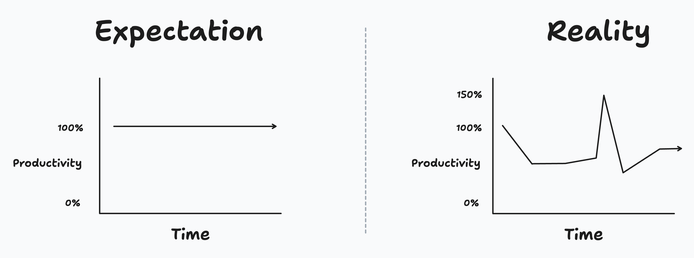

---
{
    title: "Tradeoffs in Engineering Identity",
    description: "Finding your engineering identity is a journey of balancing tradeoffs. Let's explore the key tradeoffs that shape your path.",
    published: "2025-12-01T13:45:00.284Z",
    tags: ['leadership', 'opinion'],
    license: 'cc-by-4',
    order: 1
}
---

Shortly after I signed the contracts for [my new VP role](/posts/negotiating-for-vp-role), my newly minted CTO and I met up and I got to ask him many questions. While we discussed a lot, one question kept coming to mind:

"Why did you select me to lead the team without any prior experience in upper leadership?"

He answered:

"When we were looking for other leads, we found that they had extremely specific skills in the industry we were looking in, but not very deep skills outside that industry-specific knowledge. We kept finding that someone had spent the last few years specifically working on search in the company and wanted to sell us on making search our #1 experience, even when it didn't make sense. It wasn't until we talked to you that you ended up looking at things from a more holistic view and the expertise to execute on many of the aspects you were able to talk about"

This answer from my then newly minted CTO reminded me of guidance on hiring I was provided by a past Director of Technology I had at a company we'll call `"PDRT"`:

"We want to look for T-shaped individuals. Not only do they have breadth in generalized topics of technology, but they have depth in a few key areas they've invested in previously."

> "What does a T-shaped individual look like?"

Assume you\'re hiring for a frontend web development position. Yes, a T-shaped individual might excel at the day-to-day of CSS, TypeScript, and — say — React, but they'd also be able to articulate the reasoning for why you might want to use GraphQL over RESTful APIs and vice versa.

This intersection is tough to look for in a candidate. There are different rewards given to being specialized than to being generalized in your knowledge. I've often found that being generalized was more helpful in the early stage of my career. My ability to fix a bug across a system as a full-stack engineer allowed me to aim for any number of companies when looking for work. Especially when I'd take anything for my abilities, that flexibility in hire-ability remained king for many years of my youth.

On the other hand, specialization tends to be more difficult to train for. It requires not just a foundation of knowledge on a topic, but necessitates the kind of deep-dives that education doesn't often cover. As a result, I optimized much of my mid-career determined to learn everything I could about specific niches. This worked out well for me; I found that many companies were willing to pay me much more for this gated knowledge due to its rarity on their teams and need within the organization.

As a result, the incentives to becoming a "T-shaped individual" are difficult to measure oftentimes. An organization needs to give you the time and compensation to deep-dive on problems on their product but still enable you to grow horizontally and find tickets for you outside your typical purview.

-----

The T-shaped employee search wasn't the only thing that this Director of Technology had in mind when searching for candidates. When I joined that team, he sent me a link to an article along the lines of "[What Engineering Superhero are You?]( https://review.firstround.com/how-to-spot-and-magnify-the-powers-of-your-engineering-superheroes/)" I laughed at the idea of a quizzical introduction to the team; a silly exercise that provided little to no insights of my real capabilities. I'd almost preferred to know what tabletop fantasy class I'd be instead.

I put away the article and got to work, focusing on my duties and the rest of the onboarding tasks. But to my surprise, he reminded me of this article a week or so into my role; he was serious about me reading through it.

As it turns out, it wasn't the pop-culture listical I expected; it was an insightful piece that touched on the core of what it means to be on a team. The core of the argument presented in the article is that each of us has our own personalities in our engineering work. In engineering, we face a number of tradeoffs that help us define who we are on a team.

### Speed vs. consistency

Additional logging and validation code can slow down your application in some instances, but may play a critical role in your user experience and the consistency of your software's abilities.

Likewise, as an individual on a team, we often find ourselves in lulls of productivity. While many consider "consistency" the idea of remaining at a set productivity level day-in day-out, I find that productivity is more granular and challenging to keep at high levels for overly long. Instead, the focus on showing up daily and doing your best is often much more important to me.

I used to share a meme similar to this with my team on a regular basis when they needlessly felt down on their productivity levels:

> The usage of 150% is a humorous play on how — on rare occasions — we can often feel like we're in hyper-turbo mode. It's an addicting feeling that one often wants to chase once they've experienced it. This, too, plays into the damage that burnout can do to our psyche and why breaks matter.

Acknowledging this can help with burnout as well. Burnout often comes as a result of mismatched intent of high yield met with the reality of one's pragmatic limitations.

Put another way, burnout is the consequence of treating the expectation of consistent delivery as a mandate rather than a myth.

As a result, many dig themselves in an ever-growing pit of failure where they spiral their expectations ever-higher and refuse to take a much-needed rest to recuperate their physical and mental selves. Left unmitigated, one will see their productivity careen towards an infinite zero — often causing further duress. How one balances this knock-on effect often carries from one's interpersonal philosophy into their project management skills on a team.

### Customer Focus vs. Tech Focus

Because of this looming threat of burnout, it becomes increasingly important to prioritize the work you do. The marriage of ever-increasing user requests and limited resources means that most teams will never need for additional work on their plates.

For many, this means that there are tradeoffs one must make between technical debt and net-new development. I've often heard this tradeoff discussed as different levels of a teams' ability to ship code. In ["An Elegant Puzzle: Systems of Engineering Management" by Will Larson](https://press.stripe.com/an-elegant-puzzle), he outlines that a team's ability to ship can be represented by one of four states:

1) Falling behind
2) Treading water
3) Repaying debt
4) Innovating

Will has outlines for how to move from one stage to the next, and I often find that different team members will come with their own interests on how to improve that pipeline of success.

For some, "repaying debt" may mean adding more documentation, for others it may mean a freshening on the UI layer to ensure consistency in existing product lines before moving on to new ones. Wherever their area of focus lies, it's important that we do our best as managers to help support one's abilities and challenge where they could improve.

------

The four states outlined above aren't referencing which technologies are in use: It's referring to the team's ability to ship net-new functionality.

It's worth noting that "repaying debt" need not inherently mean using technology that's more "modern" than alternatives. Despite the stereotype of engineers always wanting to innovate, I've found that's not always the case.

Some folks are tired of the iteration on base concepts they've found stable for many years in their career; many of these kinds are more focused on the core ideals of a given technology rather than syntax. Likewise, I've worked with engineers that not only want to use the bleeding edge but be a part of it; you'll find this personality often involved in various new open-source projects.

Again, it goes back to tradeoffs. More modern tools may come with developer experience niceties while older tools may have more stability on their side.

### Career Growth vs. Stability

One unexpected area of developer tradeoff I was taught to consider from my then Director of Technology was an employee's willingness to stay at a company for long.

While it's often seen as a red flag for a candidate to have jumped too many times between roles, it's not usually done without good reason. For myself, I found that I regularly had 20 to 30% raises for each instance of a new job on my résumé. Not only that, but I was typically challenged with different problems that the previous workplace had not seen during my time there; This allowed me to grow particularly quickly compared to peers that were more likely to stay put at a single organization.

On the other hand, pivoting workplaces so often comes with its own set of downsides:

- Unable to see the long-term effects of technical decision-making
- Challenges with understanding the organization's problem space and solving non-technical problems
- Inability to form more cohesive bonds with peers at the company
