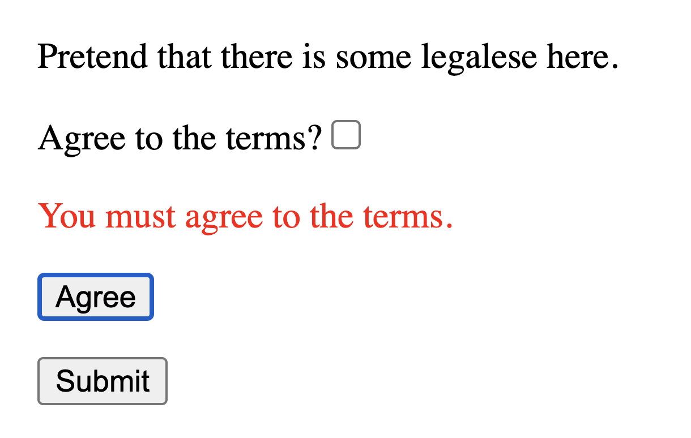

---
{
    title: "Forms",
    description: "Forms are a core part of any application. Even when a single input, it can be tricky to manage where the state should live. Let's learn how to do so with React, Angular, and Vue.",
    published: '2026-01-01T22:12:03.284Z',
    tags: ["react", "angular", "vue", "webdev"],
    order: 4
}
---

<details>
<summary>What tools are we learning in this chapter?</summary>
Forms, being widely used parts of many apps, have many options available to build with.

Here's a few tools we **won't** be looking at in this chapter:

- Formik
- React Hook Form
- VeeValidate
- FormKit
- Angular's Official Form Package

Instead, we'll be looking at a single library for Forms, regardless of the framework:

[TanStack Form](https://tanstack.com/form)

This is predominantly because it's cross-framework support enables a more apples-to-apples comparison when talking about each framework.

> Disclaimer: I (the author of this book) am the lead maintainer of TanStack Form.
> 
> While I believe that TanStack Form covers most needs a newcomer would need to learn to use other tools, I've written articles about a few of the other form solutions linked above.

</details>

One of the most common types of front-end applications that I've seen in my career can be classified as some form of "Form wrapper". Whether it's a payment form, a user-submitted tracking form, or anything of the like - these pages exist in almost every app I've ever seen.

What's more, even in less obvious "form wrapper" style pages, you'll always need a way to track a user's input for usage in some kind of processing.

To do this, React, Angular, and Vue all have a few tools at their disposal.

# Uncontrolled Bindings

While this book focuses on frontend frameworks, let's begin by covering the basics: What the browser supports by default without any additional tooling.

See, the browser is able to store data inside a DOM node via properties:

```javascript
const soundEl = document.createElement('audio');
// Set the initial time for the audio file to be 100 seconds into the file
soundEl.currentTime = 100;
```

> Properties are not attributes. While attributes are strings stored in the DOM's markup, properties are in-memory values attributed to a given DOM node and can be non-string values.

And like most parts of our UI, a form is a representation of data we want to visualize to our users:

```javascript
const inputEl = document.createElement('input');
inputEl.value = "Hello, world!";
```

<iframe data-frame-title="Uncontrolled Forms" src="pfp-code:./ffg-ecosystem-uncontrolled-16?template=node&embed=1&file=src%2Findex.html" sandbox="allow-modals allow-forms allow-popups allow-scripts allow-same-origin"></iframe>

We can use this ability to store values inside a DOM node alongside a set of other APIs — namely [the `<form>` element](https://developer.mozilla.org/en-US/docs/Web/HTML/Reference/Elements/form) — to build out a form without ever duplicating the value in JavaScript:

````html
<form>
  <p>What is your name?</p>
  <label>
    Name:
    <input id="name" />
  </label>
  <div style="margin-top: 1em">
	  <button type="submit">Submit</button>
  </div>
</form>
<script>
  const form = document.querySelector("form");

  const nameInput = document.querySelector("#name");

  form.addEventListener('submit', (event) => {
    event.preventDefault();
    alert(`Hello, ${nameInput.value}!`);
  });
</script>
````

<iframe data-frame-title="Uncontrolled Form Submit" src="pfp-code:./ffg-ecosystem-uncontrolled-form-submit-17?template=node&embed=1&file=src%2Findex.html" sandbox="allow-modals allow-forms allow-popups allow-scripts allow-same-origin"></iframe>

## Uncontrolled Form Validation

But storing the values is only half of the battle: What happens when we want to validate our users' input against a set of rules?

Maybe the user must agree to legal terms to sign up for your service. How can you reject the user when they forget to select the checkbox? 

Well, using [the browser's `setCustomValidity` API ](https://developer.mozilla.org/en-US/docs/Web/API/HTMLObjectElement/setCustomValidity) and [the `input` event](https://developer.mozilla.org/en-US/docs/Web/API/Element/input_event) we can do just that:

```html
<form>
  <p>Pretend that there is some legalese here.</p>
  <label>
    <span>Agree to the terms?</span>
    <input id="agree" type="checkbox" />
  </label>
  <div style="margin-top: 1em">
    <button type="submit">Submit</button>
  </div>
</form>
<script>
  const form = document.querySelector("form");
  const agreeCheckbox = document.querySelector("#agree");

  // Without this, the user will never be able to submit after a failed submission
  agreeCheckbox.addEventListener('input', () => {
    agreeCheckbox.setCustomValidity("");
  })

  form.addEventListener("submit", (event) => {
    // Prevent the form from resetting the page
    event.preventDefault();
    if (!agreeCheckbox.checked) {
      agreeCheckbox.setCustomValidity("You must agree to the terms.");
      agreeCheckbox.reportValidity();
    } else {
      agreeCheckbox.setCustomValidity("");
      alert("You have successfully signed up for our service, whatever that is")
    }
  });
</script>
```

<iframe data-frame-title="Uncontrolled Form Submit" src="pfp-code:./ffg-ecosystem-uncontrolled-validation-18?template=node&embed=1&file=src%2Findex.html" sandbox="allow-modals allow-forms allow-popups allow-scripts allow-same-origin"></iframe>

Now, when the user tries to submit the form without accepting, they'll be greeted with the following:


## Uncontrolled Frameworks

These features we've been using are built into the browser. Because of this, we can use these built-in APIs in our frameworks as well:

<!-- ::start:tabs -->

### React

```jsx
function App() {
	const agreeCheckbox = useRef();

	// This must be an `onChange` event, which differs from vanilla JS and other frameworks
	const onAgreeChange = () => {
		agreeCheckbox.current.setCustomValidity("");
	}

	const submit = (event) => {
		event.preventDefault();
		if (!agreeCheckbox.current.checked) {
			agreeCheckbox.current.setCustomValidity("You must agree to the terms.");
			agreeCheckbox.current.reportValidity();
		} else {
			agreeCheckbox.current.setCustomValidity("");
			alert("You have successfully signed up for our service, whatever that is");
		}
	}

	return (
		<form onSubmit={submit}>
			<p>Pretend that there is some legalese here.</p>
			<label>
				<span>Agree to the terms?</span>
				<input ref={agreeCheckbox} onChange={onAgreeChange} type="checkbox" />
			</label>
			<div style={{ marginTop: "1em" }}>
				<button type="submit">Submit</button>
			</div>
		</form>
	)
}
```

<iframe data-frame-title="Uncontrolled React" src="pfp-code:./ffg-ecosystem-react-uncontrolled-19?template=node&embed=1&file=src%2FApp.jsx" sandbox="allow-modals allow-forms allow-popups allow-scripts allow-same-origin"></iframe>

### Angular

```angular-ts
@Component({
	selector: "app-root",
	changeDetection: ChangeDetectionStrategy.OnPush,
	template: `
		<form (submit)="submit($event)">
			<p>Pretend that there is some legalese here.</p>
			<label>
				<span>Agree to the terms?</span>
				<input #agreeCheckbox (input)="onAgreeChange()" type="checkbox" />
			</label>
			<div style="margin-top: 1em;">
				<button type="submit">Submit</button>
			</div>
		</form>
	`,
})
export class App {
	agreeCheckbox = viewChild("agreeCheckbox", {read: ElementRef<HTMLInputElement>});

	onAgreeChange() {
		this.agreeCheckbox()?.nativeElement.setCustomValidity("");
	}

	submit(event: Event) {
		event.preventDefault();
		const checkbox = this.agreeCheckbox()?.nativeElement;
		if (!checkbox) return;
		if (!checkbox.checked) {
			checkbox.setCustomValidity("You must agree to the terms.");
			checkbox.reportValidity();
		} else {
			checkbox.setCustomValidity("");
			alert("You have successfully signed up for our service, whatever that is");
		}
	}
}
```

<iframe data-frame-title="Uncontrolled Angular" src="pfp-code:./ffg-ecosystem-angular-uncontrolled-19?template=node&embed=1&file=src%2Fmain.ts" sandbox="allow-modals allow-forms allow-popups allow-scripts allow-same-origin"></iframe>

### Vue

```vue
<script setup>
import { ref } from 'vue';

const agreeCheckbox = ref(null);

	const onAgreeChange = () => {
		agreeCheckbox.value?.setCustomValidity("");
	}

	const submit = (event) => {
		event.preventDefault();
		const checkbox = agreeCheckbox.value;
		if (!checkbox) return;
		if (!checkbox.checked) {
			checkbox.setCustomValidity("You must agree to the terms.");
			checkbox.reportValidity();
		} else {
			checkbox.setCustomValidity("");
			alert("You have successfully signed up for our service, whatever that is");
		}
	}
</script>

<template>
		<form @submit="submit($event)">
			<p>Pretend that there is some legalese here.</p>
			<label>
				<span>Agree to the terms?</span>
				<input ref="agreeCheckbox" @input="onAgreeChange()" type="checkbox" />
			</label>
			<div style="margin-top: 1em;">
				<button type="submit">Submit</button>
			</div>
		</form>
</template>
```

<iframe data-frame-title="Uncontrolled Vue" src="pfp-code:./ffg-ecosystem-vue-uncontrolled-19?template=node&embed=1&file=src%2FApp.vue" sandbox="allow-modals allow-forms allow-popups allow-scripts allow-same-origin"></iframe>

<!-- ::end:tabs -->

You'll notice that all of these components use [an element reference](/posts/ffg-fundamentals-element-reference) to track the element for the `input` event.

## Custom Error UX

While `setCustomValidity` is the built-in method of valdiating fields, it's not always a perfect fit. For example, many companies may want their own UI to display field errors to their users to align with the user experience further.

To do this, we can track the value of the field in JavaScript and use this value check to conditionally render error messages.

<!-- ::start:tabs -->

### React

```jsx
function App() {
	const [checked, setChecked] = useState(false);
	const [showError, setShowError] = useState(false);

	// This must be an `onChange` event, which differs from vanilla JS and other frameworks
	const onAgreeChange = (e) => {
		setChecked(e.target.checked);
		setShowError(false);
	}

	const submit = (event) => {
		event.preventDefault();
		if (!checked) {
			setShowError(true);
		} else {
			setShowError(false);
			alert("You have successfully signed up for our service, whatever that is");
		}
	}

	return (
		<form onSubmit={submit}>
			<p>Pretend that there is some legalese here.</p>
			<label>
				<span>Agree to the terms?</span>
				<input onChange={onAgreeChange} type="checkbox" />
			</label>
			{showError && !checked && <p style={{ color: "red" }}>You must agree to the terms.</p>}
			<div style={{ marginTop: "1em" }}>
				<button type="submit">Submit</button>
			</div>
		</form>
	)
}
```

<iframe data-frame-title="React Custom Error UX" src="pfp-code:./ffg-ecosystem-react-custom-error-ux-20?template=node&embed=1&file=src%2FApp.jsx" sandbox="allow-modals allow-forms allow-popups allow-scripts allow-same-origin"></iframe>

### Angular

```angular-ts
@Component({
	selector: "app-root",
	changeDetection: ChangeDetectionStrategy.OnPush,
	template: `
		<form (submit)="submit($event)">
			<p>Pretend that there is some legalese here.</p>
			<label>
				<span>Agree to the terms?</span>
				<input (input)="onAgreeChange($event)" type="checkbox" />
			</label>
			@if(showError()) {
				<p style="color: red;">You must agree to the terms.</p>
			}
			<div style="margin-top: 1em;">
				<button type="submit">Submit</button>
			</div>
		</form>
	`,
})
export class App {
	checked = signal(false);
	showError = signal(false);

	onAgreeChange(event: Event) {
		const checkbox = event.target as HTMLInputElement;
		this.checked.set(checkbox.checked);
		this.showError.set(false);
	}

	submit(event: Event) {
		event.preventDefault();
		if (!this.checked()) {
			this.showError.set(true);
		} else {
			this.showError.set(false);
			alert("You have successfully signed up for our service, whatever that is");
		}
	}
}
```

<iframe data-frame-title="Angular Custom Error UX" src="pfp-code:./ffg-ecosystem-angular-custom-error-ux-20?template=node&embed=1&file=src%2Fmain.ts" sandbox="allow-modals allow-forms allow-popups allow-scripts allow-same-origin"></iframe>

### Vue

```vue
<script setup>
import { ref } from 'vue';

const checked = ref(false);
const showError = ref(false);

const onAgreeChange = (e) => {
	checked.value = e.target.checked;
	showError.value = false;
}

const submit = (event) => {
	event.preventDefault();
	if (!checked.value) {
		showError.value = true;
	} else {
		showError.value = false;
		alert("You have successfully signed up for our service, whatever that is");
	}
}
</script>

<template>
	<form @submit="submit($event)">
		<p>Pretend that there is some legalese here.</p>
		<label>
			<span>Agree to the terms?</span>
			<input @input="onAgreeChange($event)" type="checkbox" />
		</label>
		<p v-if="showError" style="color: red;">You must agree to the terms.</p>
		<div style="margin-top: 1em;">
			<button type="submit">Submit</button>
		</div>
	</form>
</template>
```

<iframe data-frame-title="Vue Custom Error UX" src="pfp-code:./ffg-ecosystem-vue-custom-error-ux-20?template=node&embed=1&file=src%2FApp.vue" sandbox="allow-modals allow-forms allow-popups allow-scripts allow-same-origin"></iframe>

<!-- ::end:tabs -->

## Uncontrolled Problems

Using forms in the way we have been is close to how the browser's default behavior works, but comes with its own set of challenges when integrating with a framework in the day-to-day of form-building.

Assume our UI team comes back with a new requirement: An additional `Agree` button if the user forgets to agree to the license agreement previously in the page.



This button should:

- Toggle the checkbox
- Clear the error
- Allow the user to submit

By using uncontrolled form state, we quickly run into a problem: We must have many elements of state present to make this work.

We'd need to store:

- A reference to the underlying `<input/>` element
- The `showError` boolean state
- The `checked` state boolean

Let's see what that looks like in our respective frameworks:

<!-- ::start:tabs -->

### React

```jsx
function App() {
	const checkboxRef = useRef(null);
	const [checked, setChecked] = useState(false);
	const [showError, setShowError] = useState(false);

	// This must be an `onChange` event, which differs from vanilla JS and other frameworks
	const onAgreeChange = (e) => {
		setChecked(e.target.checked);
		setShowError(false);
	};

	const submit = (event) => {
		event.preventDefault();
		if (!checked) {
			setShowError(true);
		} else {
			setShowError(false);
			alert(
				"You have successfully signed up for our service, whatever that is",
			);
		}
	};

	const onAgreeClick = () => {
		if (!checkboxRef.current) return;
		checkboxRef.current.checked = true;
		// Trigger the change event manually
		const event = new Event("input");
		// Yes, really, this is needed for `e.target` to work in the handler
		Object.defineProperty(event, "target", {
			writable: false,
			value: checkboxRef.current,
		});
		onAgreeChange(event);
	};

	return (
		<form onSubmit={submit}>
			<p>Pretend that there is some legalese here.</p>
			<label>
				<span>Agree to the terms?</span>
				<input ref={checkboxRef} onChange={onAgreeChange} type="checkbox" />
			</label>
			{showError && !checked && (
				<div>
					<p style={{ color: "red" }}>You must agree to the terms.</p>
					<button type="button" onClick={onAgreeClick}>
						Agree
					</button>
				</div>
			)}
			<div style={{ marginTop: "1em" }}>
				<button type="submit">Submit</button>
			</div>
		</form>
	);
}
```

<iframe data-frame-title="React Uncontrolled Problems" src="pfp-code:./ffg-ecosystem-react-uncontrolled-problems-21?template=node&embed=1&file=src%2FApp.jsx" sandbox="allow-modals allow-forms allow-popups allow-scripts allow-same-origin"></iframe>

### Angular

```angular-ts
@Component({
	selector: "app-root",
	changeDetection: ChangeDetectionStrategy.OnPush,
	template: `
		<form (submit)="submit($event)">
			<p>Pretend that there is some legalese here.</p>
			<label>
				<span>Agree to the terms?</span>
				<input #agreeCheckbox (input)="onAgreeChange($event)" type="checkbox" />
			</label>
			@if (showError()) {
				<div>
					<p style="color: red;">You must agree to the terms.</p>
					<button type="button" (click)="onAgreeClick()">Agree</button>
				</div>
			}
			<div style="margin-top: 1em;">
				<button type="submit">Submit</button>
			</div>
		</form>
	`,
})
export class App {
	checked = signal(false);
	showError = signal(false);

	agreeCheckbox = viewChild("agreeCheckbox", {
		read: ElementRef<HTMLInputElement>,
	});

	onAgreeChange(event: Event) {
		const checkbox = event.target as HTMLInputElement;
		this.checked.set(checkbox.checked);
		this.showError.set(false);
	}

	submit(event: Event) {
		event.preventDefault();
		if (!this.checked()) {
			this.showError.set(true);
		} else {
			this.showError.set(false);
			alert(
				"You have successfully signed up for our service, whatever that is",
			);
		}
	}

	onAgreeClick() {
		const el = this.agreeCheckbox()?.nativeElement;
		if (!el) return;
		el.checked = true;
		const event = new Event("input");
		el.dispatchEvent(event);
	}
}
```

<iframe data-frame-title="Angular Uncontrolled Problems" src="pfp-code:./ffg-ecosystem-angular-uncontrolled-problems-21?template=node&embed=1&file=src%2Fmain.ts" sandbox="allow-modals allow-forms allow-popups allow-scripts allow-same-origin"></iframe>

### Vue

```vue
<script setup>
import { ref } from "vue";

const agreeCheckbox = ref(null);

const checked = ref(false);
const showError = ref(false);

const onAgreeChange = (e) => {
	checked.value = e.target.checked;
	showError.value = false;
};

const submit = (event) => {
	event.preventDefault();
	if (!checked.value) {
		showError.value = true;
	} else {
		showError.value = false;
		alert("You have successfully signed up for our service, whatever that is");
	}
};

const onAgreeClick = () => {
	const el = agreeCheckbox.value;
	if (!el) return;
	el.checked = true;
	const event = new Event("input");
	el.dispatchEvent(event);
};
</script>

<template>
	<form @submit="submit($event)">
		<p>Pretend that there is some legalese here.</p>
		<label>
			<span>Agree to the terms?</span>
			<input
				ref="agreeCheckbox"
				@input="onAgreeChange($event)"
				type="checkbox"
			/>
		</label>
		<div v-if="showError">
			<p style="color: red">You must agree to the terms.</p>
			<button type="button" @click="onAgreeClick()">Agree</button>
		</div>
		<div style="margin-top: 1em">
			<button type="submit">Submit</button>
		</div>
	</form>
</template>
```

<iframe data-frame-title="Vue Uncontrolled Problems" src="pfp-code:./ffg-ecosystem-vue-uncontrolled-problems-21?template=node&embed=1&file=src%2FApp.vue" sandbox="allow-modals allow-forms allow-popups allow-scripts allow-same-origin"></iframe>

<!-- ::end:tabs -->

Keep in mind that this problem compounds on itself. The more fields you have in a form, the more state and more events you need to use to keep track of it all.

While there are tools to workaround this, uncontrolled fields tend to come with other downsides as well:

- Debugging behavior
- Complex conditional logic
- Difficulties with validation

# Bound Form Values

> Knowing about the downsides of uncontrolled fields; what is the alternative?

Well, the other method of handling form values is to use bound form values. This can be done in one of two ways:

- One-way bindings
- Two-way bindings

While on-way form bindings have predominantly ubiquitous support in all frameworks, two-way data-bindings are often more convenient in specific circumstances in the tools that _do_ support it.

Despite this lack of two-way binding support in some tools, let's take a look at both of them in practice.

## One-way Form Bindings

One common and easy way to assign a value to form elements - like a text input - is to simply listen for value changes (using events) on the element and assign those changes back to a bound input value.

<!-- ::start:tabs -->

### React

```jsx
const FormComp = () => {
  const [usersName, setUsersName] = useState("");

  const onChange = (e) => {
    setUsersName(e.target.value);
  }

  const onSubmit = (e) => {
    e.preventDefault();
    console.log(usersName);
  };

  return (
    <form onSubmit={onSubmit}>
      <input type="text" onChange={onChange} value={usersName} />
      <button type="submit">Submit</button>
    </form>
  )
}
```

### Angular

```typescript
@Component({
  selector: 'form-comp',
  template: `
    <form (submit)="onSubmit($event)">
	  	<input type="text" (change)="onChange($event)" [value]="usersName"/>
      <button type="submit">Submit</button>
    </form>
  `,
})
export class FormComponent {
  usersName = '';

  onChange(e: { target: HTMLInputElement }) {
    this.usersName = e.target.value;
  }

  onSubmit(e: Event) {
    e.preventDefault();
    console.log(this.usersName);
  }
}
```

### Vue

```vue
<!-- FormComp.vue -->
<template>
  <form @submit="onSubmit($event)">
    <input type="text" @change="onChange($event)" :value="usersName" />
    <button type="submit">Submit</button>
  </form>
</template>

<script setup>
import { ref } from 'vue'

const usersName = ref('')

function onChange(e) {
  this.usersName = e.target.value
}
function onSubmit(e) {
  e.preventDefault()
  console.log(this.usersName)
}
</script>
```

<!-- ::end:tabs -->


While this works as-is, it can get complex when too many inputs are present. For each input, you need:

- A function to listen for changes and bind them to the value
- A variable to assign the data to
- Rebind said data back to the input

Let's try to simplify this by removing the first step.

## Two-way form bindings

One method for removing the input change listener is by using two-way variable bindings. When your framework supports this, you don't need to assign a function for change listening. Simply pass a variable and watch the value change as you type!

<!-- ::start:tabs -->

### React

React doesn't have a way to do this and generally regards it as an anti-pattern even if it were possible. The reason they consider it an anti-pattern is because they strongly encourage utilizing [unidirectional data flow instead, which we'll learn about in a future chapter](// TODO: Add). The React team (and ecosystem) tend to prefer you stick to event bindings instead of a two-way form bind.

However, we'll touch on another method of form binding that should be help address the verbosity of event bindings.

### Angular

If you recall from our earlier introduction to components, Angular's syntax to bind to an attribute or property is `[bindName]`. Similarly, the syntax to bind to a DOM event or component output is `(bindName)`.

Well, if we combine them together, we can sync all of an event's values to and from an Angular variable with a handy shorthand:
```typescript
[(bindName)]
```

> Remember to not flip the `[]` and `()` symbols! It's important to make sure that the square brackets go on the outside of the bind.
>
> Luckily, there's a mnemonic device to remember this operator order - This syntax is colloquially known as a ["banana in a box", even in Angular's source code itself](https://github.com/angular/angular/blob/3ecf93020ce06b9b8621f0c83126cb3d584d4181/packages/compiler/src/render3/r3_template_transform.ts#L41)!

For our simple example of binding a `value`, we can use the `bindName` of `ngModel`, which is standard on most input elements.

```typescript {4,10}
@Component({
  selector: 'form-comp',
  template: `
    <form (submit)="onSubmit($event)">
	  	<input type="text" [(ngModel)]="usersName" name="input"/>
      <button type="submit">Submit</button>
    </form>
  `,
})
export class FormComponent {
  usersName = '';

  onSubmit(e: Event) {
    e.preventDefault();
    console.log(this.usersName);
  }
}
```

However, when you first use this, you may run into an error:

> Type 'Event' is not assignable to type 'string'.

This is because we need to import the `FormsModule` in our closest `NgModule` to use `ngModel` bindings

```typescript {2,6}
import { NgModule } from '@angular/core';
import { BrowserModule } from '@angular/platform-browser';
import { FormsModule } from '@angular/forms';

@NgModule({
  imports: [BrowserModule, FormsModule],
  declarations: [AppComponent, FormComponent],
  bootstrap: [AppComponent],
})
export class AppModule {}
```

### Vue

While Angular's two-way binding requires a special syntax, Vue instead relies on a custom element attribute called `v-model` to sync the variable to the element's value.

```vue
<!-- FormComp.vue -->
<template>
  <form @submit="onSubmit($event)">
    <input type="text" v-model="usersName" />
    <button type="submit">Submit</button>
  </form>
</template>

<script setup>
import { ref } from 'vue'

const usersName = ref('')

function onSubmit(e) {
  e.preventDefault()
  console.log(this.usersName)
}
</script>
```

<!-- ::end:tabs -->

While these methods of two-way binding help mitigate some problems, there's still one big problem: Your data is no longer consolidated. This means that if you submit a form and want to, say, pass the form's data to your server, you'll need to:

- Create a new object
- Make sure you pass all subkeys of the object

While this works for simple examples like ours, it quickly gets unwieldy and easy to introduce bugs within at a larger scale.

There's a better way.

# Introducing Form Libraries

Form libraries can be a great way to consolidate your form logic into a single source of truth while adding additional capabilities for little-to-no written code cost.

The library we'll be using today is [TanStack Form](https://tanstack.com/form), which supports React, Angular, and Vue. Let's take a look at what basic usage of TanStack Form looks like for each framework:

<!-- ::start:tabs -->

## React

First, install TanStack Form's React adapter:

```shell
npm install @tanstack/react-form
```

Then we can use it in our code:

```jsx
import { useForm } from '@tanstack/react-form';

function App() {
	const form = useForm({
		defaultValues: {
			usersName: ""
		},
		onSubmit: ({ value }) => {
			console.log("Form submitted with values:", value);
		}
	});

	const onSubmit = (e) => {
		e.preventDefault();
		form.submit();
	};

	return (
		<form onSubmit={onSubmit}>
			<form.Field
				name="usersName"
				children={field => (
					<input
						value={field.state.value}
						onChange={e => field.api.handleChange(e.target.value)}
					/>
				)}
			/>
			<button type="submit">Submit</button>
		</form>
	)
}
```

<iframe data-frame-title="React TanStack Form Default Values" src="pfp-code:./ffg-ecosystem-react-tsf-default-values-22?template=node&embed=1&file=src%2FApp.jsx" sandbox="allow-modals allow-forms allow-popups allow-scripts allow-same-origin"></iframe>

## Angular

First, install TanStack Form's Angular adapter:

```shell
npm install @tanstack/angular-form
```

Then we can use it in our code:

```angular-ts
import { injectForm, TanStackField } from "@tanstack/angular-form";

@Component({
	selector: "app-root",
	changeDetection: ChangeDetectionStrategy.OnPush,
	imports: [TanStackField],
	template: `
		<form (submit)="onSubmit($event)">
			<ng-container
				[tanstackField]="form"
				name="usersName"
				#usersName="field"
			>
				<input
					[value]="usersName.api.state.value"
					(input)="usersName.api.handleChange($any($event).target.value)"
				/>
			</ng-container>
			<button type="submit">Submit</button>
		</form>
	`,
})
export class App {
	form = injectForm({
		defaultValues: {
			usersName: ""
		},
		onSubmit: ({value}) => {
			console.log("Form submitted with values:", value);
		}
	});

	onSubmit(event: Event) {
		event.preventDefault();
		this.form.handleSubmit();
	}
}
```

<iframe data-frame-title="Angular TanStack Form Default Values" src="pfp-code:./ffg-ecosystem-angular-tsf-default-values-22?template=node&embed=1&file=src%2Fmain.ts" sandbox="allow-modals allow-forms allow-popups allow-scripts allow-same-origin"></iframe>

## Vue

First, install TanStack Form's Vue adapter:

```shell
npm install @tanstack/vue-form
```

Then we can use it in our code:

```vue
<!-- App.vue -->
<script setup>
import { useForm } from '@tanstack/vue-form'

const form = useForm({
  defaultValues: {
    usersName: '',
  },
  onSubmit: async ({ value }) => {
    // Do something with form data
	console.log("Form submitted with values:", value);
  },
})
</script>

<template>
	<form @submit.prevent.stop="form.handleSubmit">
		<form.Field name="usersName">
			<template v-slot="{ field }">
			<input
				:value="field.state.value"
				@input="(e) => field.handleChange(e.target.value)"
			/>
			</template>
		</form.Field>
		<button type="submit">Submit</button>
	</form>
</template>
```

<iframe data-frame-title="Vue TanStack Form Default Values" src="pfp-code:./ffg-ecosystem-vue-tsf-default-values-22?template=node&embed=1&file=src%2FApp.vue" sandbox="allow-modals allow-forms allow-popups allow-scripts allow-same-origin"></iframe>

<!-- ::end:tabs -->


// TODO: Cover initial values

## Validation Types

// TODO: Talk about onChange vs onBlur vs onMount, et al

// TODO: Talk about onDynamic

## Field Validation

// TODO: Cover manual field validation here

## Async Validation

// TODO: Cover async onChange, debouncing, et al

## Validation Schemas

// TODO: Cover Valibot

# Making your own UI components

// TODO: Talk about wrapping TanStack Form into your own apps
