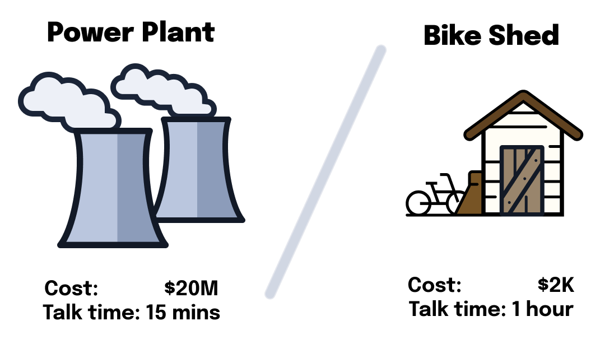
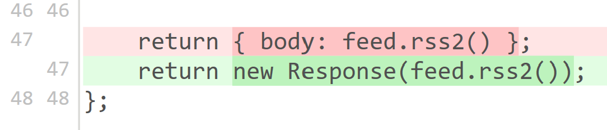
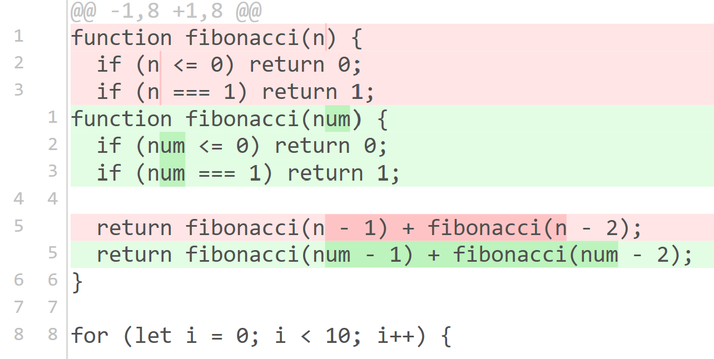
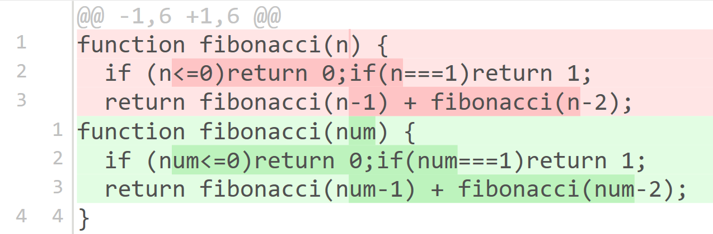
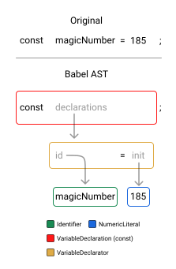

---
{
    title: "Linters, Formatters, and Type-Checkers",
    description: "",
    published: '2025-06-01T22:12:03.284Z',
    tags: ["react", "angular", "vue", "webdev"],
    order: 2
}
---

<details>
<summary>What tools are we learning in this chapter?</summary>

While there's a few other options in the linting, formatting, and type-checking space:

- [Biome](https://biomejs.dev/)
- [Oxlint](https://oxc.rs/docs/guide/usage/linter.html)
- [Flow](https://flow.org)

We'll instead be learning about [ESLint](https://eslint.org/), [Prettier](https://prettier.io/), and [TypeScript](https://www.typescriptlang.org/). Let's talk about why:

- ESLint is the de-facto linting solution for JavaScript projects, being downloaded nearly 500 million times a months on npm.
- [ESLint is working on becoming language agnostic.](https://eslint.org/blog/2024/07/whats-coming-next-for-eslint/) I suspect this will lead to growth of ESLint outside of JavaScript projects.
- Prettier is also adopted almost as well as ESLint, just barely shy of ESLint's downloads a month.
- Prettier is a strongly opinionated formatting solution with many edge cases covered. This means that we can spend less time configuring our tooling and allow the defaults to handle highly debated scenarios for us.
- TypeScript is the most widely used tool of the bunch, used far more often than alternative JavaScript superset languages.

> In our article, we'll use Prettier and ESLint separately from one-another. While there _are_ ways to glue them together to run Prettier _from_ ESLint (or even use ESLint as a Prettier replacement) [this practice should be avoided. We'll explore why later on.](#formatting-vs-linting)

With this covered - Let's dive in!

</details>

JavaScript is an incredibly flexible language. Both of the following code samples are semantically valid and functionally equal code blocks:

```javascript
// Valid pretty code
for (let i = 0; i < 10; i++) {
    console.log(i);
}
```

```javascript
// Also valid, albeit ugly, code
for(
let i
    = 0
; i
        < 10; i++
    ){
console.log(
    i
);}
```

While supported by any stable JavaScript environment, the first code sample is undeniably nicer than the second in terms of readability.

It would be swell if we were able to automatically have code formatted like the first code block, no matter how we wrote it?

------

What's more, this code is **also** semantically valid, but will throw an error at runtime:

```javascript
// This will throw an error, as the loop will never exit
// Notice how we're counting down using `--`, rather than up with `++`
for (let i = 0; i < 10; i--) {
    console.log(i);
}
```

Wouldn't it be nice if we could have some tooling established to catch this kind of "undefined variable" error programmatically?

------

Alternatively, wouldn't it be awesome if we were able to catch mistakes that would cause bugs due to type-mismatches, like this:

```typescript
const Balance = 3000;
const Income = "2000";
// NewBalance is now `"30002000"`, not `5000`
const NewBalance = Balance + Income;
```

----

Luckily for us, there are tools that solve all three of these problems!

- Formatters, like Prettier: Aimed at solving "What should my code look like?"
- Linters, like ESLint: Aimed at solving "What rules does my code break?"
- Type-Checkers, like TypeScript: Aimed at solving "What types are being enforced?"


Let's explore each of these tools, how to use them in our codebase, and what their primary advantages are.

# Formatters

As mentioned earlier, a formatter allows you to take messy code:

```javascript
function test(
arg
	)
{ return arg}
```

And format it into something more readable:

```javascript
function test(arg) {
  return arg;
}
```

Most coding languages have a community or an official code formatter. In the JavaScript ecosystem, that tool is more often than not "Prettier".

To install Prettier, we can update our `package.json` using our package manager of choice:

```shell
npm i -D prettier
```

Then add a script to execute Prettier against our source code files:

```json
"scripts": {
  "format": "prettier --write ."
},
```

Once the package is installed, you can run `npm run format` on any repository without any additional configuration:

<iframe data-frame-title="Prettier - StackBlitz" src="pfp-code:./ffg-ecosystem-prettier-6?template=node&embed=1&file=src%2Findex.js" sandbox="allow-modals allow-forms allow-popups allow-scripts allow-same-origin"></iframe>

> It's worth mentioning that Prettier supports React, Angular, and Vue all very well out of the box. You shouldn't need to add any additional configuration to get Prettier working with your other projects.
>
> You can [find more documentation on Prettier on their docs page.](https://prettier.io/)


## Fewer Bike Sheds

There's a humorous story amongst developers that goes something like:

> There's an organizational committee for the construction of a powerplant. The committee has all of the research required for the powerplant and the blueprints laid out in front of them. They talk for a bit about it and, after 15 minutes, come to the agreement that the powerplant can be moved forward with and developed.
>
> But then they get to talking about the employee bike shed. It'll make the lives of the employees better, yes, but _what color should the shed be_? They spend an hour talking about which color the shed should be and finally land on a nice shade of brown.

This story demonstrates how, without proper guidance and prioritization, insignificant issues (like the color of a shed) can triumph over more significant problems; like how to fund and organize the development of a powerplant.



> This story is often attributed with the ["Law of triviality"](https://en.wikipedia.org/wiki/Law_of_triviality), which states "people within an organization commonly give disproportionate weight to trivial issues."

This story has led to the term "bike-shedding" to refer to any argument that follows the law of triviality.

----

As you can imagine, many developers have very strong preferences for coding style. Some prefer semicolons, while others are vehemently against them.

By having a strongly opinionated tool like Prettier to establish the code conventions for you, you're able to sidestep many of these time-wasting arguments in favor of something built-in.

It's for this reason that, while Prettier can be configured fairly modularly, I suggest keeping most if not all of the defaults of Prettier.

## Reducing Merge Conflicts

Code style consistency and avoiding bike-shedding aren't the only benefits of formatters, either.

When using tools like [Git](https://git-scm.com/), it's common to store a difference between two snapshots of your code:



This is fundamental to how many code backup and versioning solutions work; they track a before and after of each line of code.

Because it tracks the difference in each line of code, it can sometimes figure out when a change is smaller, like the example above; but other times it's only able to see "enough changed in this line that I don't recognize anything from the previous change".

This inability to recognize differences makes it much harder to visually identify what's specifically changed between versions of the codebase.

For example, look at this well-formatted code:

```javascript
function fibonacci(n) {
  if (n <= 0) return 0;
  if (n === 1) return 1;

  return fibonacci(n - 1) + fibonacci(n - 2);
}

for (let i = 0; i < 10; i++) {
  console.log(fibonacci(i));
}
```

And see what the diff would be to change the `n` variable name to `num`:



And how that story changes when there's inconsistent formatting applied:

```javascript
function fibonacci(n) {
  if (n<=0)return 0;if(n===1)return 1;
  return fibonacci(n-1) + fibonacci(n-2);
}
```



----

Worse than the difficulties visually seeing code changes; this same problem makes things like [`git merge`](https://www.atlassian.com/git/tutorials/using-branches/git-merge) much more likely to introduce a [Git conflict](https://www.atlassian.com/git/tutorials/using-branches/merge-conflicts). These conflicts make code sharing and collaboration much harder to reconcile when too many variants of the code exist.

# Linters

While formatting is important to a well-organized codebase; it doesn't directly find bugs in your codebase.

Instead, this responsibility often comes down to a bit of tooling that evaluates your source code and detects common mistakes and patterns to avoid. This bit of tooling is called a "linter".

For example, we might have a bit of code that looks like this:

```javascript
// This code is broken, but would be caught by a linter like ESLint
for (let i = 0; i < 10; i--) {
    console.log(i);
}
```

Here, ESLint - the most popular JavaScript tool for linting - properly reports to us that:

> ```
> The update clause in this loop moves the variable in the wrong direction. eslint(for-direction)
> ```
>

Which sets us up for success in figuring out why this bug was happening and might likely even help prevent us from shipping the bug in the first place.

## How to set up ESLint

To install ESLint in your project, you'll start by installing some pre-requisite npm modules:

```shell
npm i -D eslint @eslint/js globals
```

Once this is established, we can create a configuration file for ESLint:

```javascript
// eslint.config.mjs
import globals from "globals";
import pluginJs from "@eslint/js";

export default [
  {languageOptions: { globals: globals.browser }},
  pluginJs.configs.recommended,
];
```

Here, we're telling ESLint that it should:

- Correctly detect any Browser code we'll use in our projects
- Apply the recommended linting rules to catch errors

Now when we reproduce our buggy code from before:

```javascript
// This is buggy code caught by ESLint
for (let i = 0; i < 10; i--) {
    console.log(i);
}
```

We get the previously mentioned error shown in our IDE:


> You can [find more on ESLint's capabilities and setup in their docs website.](https://eslint.org/)

## Adapt ESLint to your tools

While ESLint without many configuration changes will find many issues it can be made even more utilitarian when you inform it on what tools you use in your project.

For example, if you use a framework like React that supports JSX syntax, you can add a plugin for ESLint to detect common issues in JSX codebases.

<!-- ::start:tabs -->

### React

To add support for React additions to ESLint, we'll need to install an ESLint plugin:

```shell
npm i -D eslint-plugin-react eslint-plugin-react-hooks
```

And add the files to the ESLint configuration from earlier:

```javascript
import globals from "globals";
import pluginJs from "@eslint/js";
import pluginReact from "eslint-plugin-react";

export default [
  {
      files: ["**/*.{js,mjs,cjs,jsx}"],
      languageOptions: { globals: globals.browser },
      settings: { react: { version: "detect" } }
  },
  pluginJs.configs.recommended,
  pluginReact.configs.flat.recommended,
];
```

// TODO: ADD REACT HOOKS RULES WHEN FLAT CONFIG IS SUPPORTED:
// https://github.com/facebook/react/issues/28313

Now we can check this buggy code against the Rules of React Hooks linting configuration:

```jsx
// This is buggy code that ESLint will catch with React plugins configured
import {useState} from 'react'; 

let someBool = true;

export default function App() {
    if (someBool) {
        const [val, setVal] = useState(0);
        return <p onClick={() => setVal(val + 1)}>{val}</p>;
    }
    return null;
}
```

And see this error:

> ```
> React Hook "useState" is called conditionally. React Hooks must be called in the exact same order in every component render. Did you accidentally call a React Hook after an early return? eslint(react-hooks/rules-of-hooks)
> ```

<iframe data-frame-title="React ESLint - StackBlitz" src="pfp-code:./ffg-ecosystem-react-eslint-7?template=node&embed=1&file=src%2FApp.jsx" sandbox="allow-modals allow-forms allow-popups allow-scripts allow-same-origin"></iframe>

> You can learn more about the React ESLint's dependencies on their respective docs pages:
>
> - [`eslint-plugin-react`](https://github.com/jsx-eslint/eslint-plugin-react)
> - [`eslint-plugin-react-hooks`](https://github.com/facebook/react/tree/main/packages/eslint-plugin-react-hooks)

### Angular

> The Angular CLI - the quickest and official way to start new Angular projects - may already have ESLint configured for you when you generate a project using it. This outlines how to add ESLint to an Angular project not using the Angular CLI.

Let's install the dependencies required to use ESLint in our Angular project:

```shell
npm i -D angular-eslint typescript-eslint@rc-v8 typescript @types/eslint__js
```

And apply it to our ESLint configuration file:

```javascript
// @ts-check
// eslint.config.mjs

import pluginJs from "@eslint/js";
import pluginTs from 'typescript-eslint';
import pluginAngular from 'angular-eslint';

export default pluginTs.config(
  {
    files: ['**/*.ts'],
    extends: [
      pluginJs.configs.recommended,
      ...pluginTs.configs.recommendedTypeChecked,
      ...pluginAngular.configs.tsRecommended,
    ],
    languageOptions: {
      parserOptions: {
        projectService: true,
        // If TypeScript complains about this line, install `@types/node`
        tsconfigRootDir: import.meta.dirname,
      },
    },
    processor: pluginAngular.processInlineTemplates,
  },
  {
    files: ['**/*.html'],
    extends: [
      ...pluginAngular.configs.templateRecommended,
    ]
  },
);
```

This will:

- Add the recommended configuration of JavaScript ESLint rules
- Add the recommended configuration of TypeScript ESLint rules enhanced by TypeScript's types
- Add the recommended configuration of Angular's TypeScript ESLint rules
- Treat inline templates in Angular components as HTML files
- Add the recommended configuration of Angular's HTML ESLint rules

Once this is present, we can check it's working by throwing some buggy Angular code at it:

```angular-ts
import { Component } from "@angular/core";

// This is buggy code that ESLint will catch with Angular plugins configured
@Component({
	selector: "app-root",
	standalone: true,
	template: "<p>Hello, world!</p>"
})
export class AppThing {
}
```

> ```
> ESLint: Component class names should end with one of these suffixes: "Component" (https:// angular. dev/ style-guide#style-02-03)(@angular-eslint/ component-class-suffix)
> ```

<iframe data-frame-title="Angular ESLint - StackBlitz" src="pfp-code:./ffg-ecosystem-angular-eslint-7?template=node&embed=1&file=src%2Fmain.ts" sandbox="allow-modals allow-forms allow-popups allow-scripts allow-same-origin"></iframe>

> You can [find more linting rules and configurations in the `angular-eslint` docs](https://github.com/angular-eslint/angular-eslint).

### Vue

Adding ESLint support to your Vue app is fairly straightforward using the `eslint-vue-plugin` addon:

``` shell
npm i -D eslint-plugin-vue
```

```javascript
// eslint.config.mjs
import globals from "globals";
import pluginJs from "@eslint/js";
import pluginVue from "eslint-plugin-vue";

export default [
  {
      files: ["**/*.{js,mjs,cjs,vue}"],
      languageOptions: { globals: globals.browser }
  },
  pluginJs.configs.recommended,
  ...pluginVue.configs["flat/recommended"],
];
```

Now it'll catch common errors in our Vue SFC files like this one:

```vue
<script setup>
// This is buggy code that ESLint will catch with Vue plugins configured
export let msg = 'Hello!'
</script>
```

> ```
> `<script setup>` cannot contain ES module exports. eslint(vue/no-export-in-script-setup)
> ```

<iframe data-frame-title="Vue ESLint - StackBlitz" src="pfp-code:./ffg-ecosystem-vue-eslint-7?template=node&embed=1&file=src%2FApp.vue" sandbox="allow-modals allow-forms allow-popups allow-scripts allow-same-origin"></iframe>

> [Learn more about Vue's ESLint plugin from their docs website.](https://eslint.vuejs.org/) 

<!-- ::end:tabs --> 

# Formatting vs Linting {#formatting-vs-linting}

Formatting and linting your code both require deeper understanding of your codebase than "it is some text". This deeper understanding comes from the transformation of your source code into an abstract syntax tree (AST):



> [We spoke about this transformation of source code to AST in my article "How computers speak"](/posts/how-computers-speak).

It might be tempting to hear about how these two tools have similar internals to understand your code and think "Oh, sweet, we can reduce two tools into one" and try to merge your linter and formatter into one command.

In fact, there exist plugins to combine ESLint and Prettier:

- [`eslint-config-prettier`](https://github.com/prettier/eslint-config-prettier)
- [`eslint-plugin-prettier`](https://github.com/prettier/eslint-plugin-prettier)

And even a dedicated ESLint plugin to add formatting to your code:

- [ESLint Stylistic](https://eslint.style/)

However, while this might seem appealing at first, it's not a good idea to mix-n-match these tools in a single command.

These tools are not generally suggested by either [the ESLint team](https://eslint.org/blog/2023/10/deprecating-formatting-rules/) or [the Prettier team](https://prettier.io/docs/en/integrating-with-linters.html) because they:

- Bring heavy maintenance burden to both teams to support this workflow
- Introduce performance headaches for those that integrate Prettier into ESLint.

Consider the following:

Linters need to catch errors cautiously and may need to do a double-glance at your code to understand the context of some items.

Formatters, on the other hand, should be as fast as possible and will likely only look through your code once to get the job done.

Ultimately, this difference in expected behavior can force substantial performance problems when attempting to merge them into one tool; They're different tools built for different tasks.

> [You can learn more about why you should not be using ESLint to format tools from one of the TypeScript ESLint maintainers and ESLint committer, Josh Goldberg.](https://www.joshuakgoldberg.com/blog/you-probably-dont-need-eslint-config-prettier-or-eslint-plugin-prettier/)

# What is TypeScript?

JavaScript is what's known as a ["dynamically typed" programming language](https://developer.mozilla.org/en-US/docs/Web/JavaScript/Data_structures#dynamic_and_weak_typing).

This means that, along with other quirks and behaviors, you're able to take a variable of one type and change it to another.

For example, you might have a numeric value you want to store in a variable.

```javascript
let someValue = 123;
```

In some languages, this would be the end of the story; `someValue` would be required to always hold a number. In JavaScript, however, you're able to reassign this value to a string, object, or any other data type you'd like:

```javascript
someValue = {};
someValue = "Hello, world";
```

Moreover, JavaScript is also ["weakly typed"](https://en.wikipedia.org/wiki/Strong_and_weak_typing), which means that a mismatch in typings can cause an implicit type cast in many operations.

In layman's terms, this means that if you try to add a number and a string together:

``` javascript
123 + "456";
```

It will automatically convert the `123` number to a string of `"123"` to fulfill the behavior of `+` against one string.

As you can imagine, however, `"123456"` may not be the wanted result of this operation. Instead, you might want to have the numerical `579` instead.

This is where TypeScript comes into play as a type-checker; not only would it correctly warn you that the new value of this addition would be a string:

```typescript
const newVal = 123 + "456";
//    ^? const newVal: string
```

But we can even add explicit type declarations to warn us when compiling, say, we pass the wrong type to a function: 

```typescript
function add(val1: number, val2: number) {
    return val1 + val2;
}

// This is buggy code that TypeScript will catch
add(123, "123");
```

> ```
> Argument of type 'string' is not assignable to parameter of type 'number'.ts(2345)
> ```

Moreover, because of this newfound knowledge about variables' types, TypeScript can correctly warn you when you're about to introduce a bug based off of the knowledge of the type system:

```typescript
const Pi = "3.14159265";

// This is attempting to run `toFixed`, which is a method on number types
// on a string; which would throw a runtime error
const LessPi = Pi.toFixed(2);
```

> ````
> Property 'toFixed' does not exist on type '"3.14159265"'. Did you mean 'fixed'?(2551)
> ````

You can [learn more about TypeScript and what it is in this article I wrote](/posts/introduction-to-typescript) or from [the TypeScript docs website.](https://www.typescriptlang.org/)

----

To install TypeScript in your project, you can install it with your package manager:

```shell
npm i -D typescript
```

Then place a configuration file for TypeScript in `tsconfig.json`:

```json
{
    "compilerOptions": {
        "target": "esnext",
        "strict": true,
        "outDir": "dist"
    }
}
```

This tells our code that it should:

- Target the latest version of JavaScript (officially called "ECMAScript", which is shortened to "ES" here).
- Strictly enforce our types.
- Output type-removed JavaScript to the `dist` directory.

Finally, we add `tsc` to our `scripts` in our `package.json`:

```json
"scripts": {
  "tsc": "tsc"
},
```

From here, you'll write code in `.ts` files rather than `.js` files:

```typescript
// index.ts
const RoughlyPi: number = 3.14;

function areaOfCircle(radius: number) {
    return RoughlyPi * radius * radius;
}

const Radius: number = 5;

console.log(`Area of circle with radius ${Radius} is ${areaOfCircle(Radius)}`);
```

And compile them back to JavaScript using:

```shell
npm run tsc
```

> ```javascript
> // dist/index.js
> "use strict";
> const RoughlyPi = 3.14;
> function areaOfCircle(radius) {
>     return RoughlyPi * radius * radius;
> }
> const Radius = 5;
> console.log(`Area of circle with radius ${Radius} is ${areaOfCircle(Radius)}`);
> ```


## Use TypeScript with a framework

TypeScript works with your favorite pre-existing tools:

<!-- ::start:tabs -->

### React

To use TypeScript with React, you'll need to modify your `tsconfig.json` file mildly:

```json
{
    "compilerOptions": {
        "target": "esnext",
        "strict": true,
        "outDir": "dist",
        "module": "NodeNext",
        "moduleResolution": "nodenext",
        "jsx": "react-jsx"
    }
}
```

> Depending on your tooling, you may need to set `jsx` to `preserve` instead of `react-jsx`. Check the docs for your tools if this doesn't work for your needs.

Once this is done, you can change your `.jsx` files to `.tsx` and use the same `tsc` command from before to transform this:

```tsx
// index.tsx
const RoughlyPi: number = 3.14;

function areaOfCircle(radius: number) {
    return RoughlyPi * radius * radius;
}

function App() {
	const Radius: number = 5;
    return <p>Area of circle with radius {Radius} is {areaOfCircle(Radius)}</p>
}
```

To this:

````javascript
// dist/index.js
"use strict";
Object.defineProperty(exports, "__esModule", { value: true });
const jsx_runtime_1 = require("react/jsx-runtime");
const RoughlyPi = 3.14;
function areaOfCircle(radius) {
    return RoughlyPi * radius * radius;
}
function App() {
    const Radius = 5;
    return (0, jsx_runtime_1.jsxs)("p", { children: ["Area of circle with radius ", Radius, " is ", areaOfCircle(Radius)] });
}
````

### Angular

TypeScript is required to use Angular. If you've installed Angular and have it running, you have TypeScript running as well. As such, I won't be including instructions to include TypeScript in your Angular project; since they are (in terms of installation) one in the same.

### Vue

To use TypeScript with Vue, we'll need to replace our `tsc` command with one specifically meant for Vue's SFC format:

```shell
npm i -D vue-tsc
```

```
"scripts": {
  "tsc": "vue-tsc"
},
```

Then to use TypeScript in your SFCs you'll just add `lang="ts"` to your `<script setup>` tag:

```vue
<!-- index.vue -->
<script setup lang="ts">
const RoughlyPi: number = 3.14;

function areaOfCircle(radius: number) {
    return RoughlyPi * radius * radius;
}

const Radius: number = 5;
</script>

<template>
  <p>Area of circle with radius {{ Radius }} is {{ areaOfCircle(Radius) }}</p>
</template>
```

And have it transformed to `.js` when you run the `tsc` script:

```javascript
// dist/index.vue.js
/* __placeholder__ */
const { defineProps, defineSlots, defineEmits, defineExpose, defineModel, defineOptions, withDefaults, } = await import('vue');
const RoughlyPi = 3.14;
function areaOfCircle(radius) {
    return RoughlyPi * radius * radius;
}
const Radius = 5;
const __VLS_fnComponent = (await import('vue')).defineComponent({});
;
let __VLS_functionalComponentProps;
function __VLS_template() {
    let __VLS_ctx;
    /* Components */
    let __VLS_otherComponents;
    let __VLS_own;
    let __VLS_localComponents;
    let __VLS_components;
    let __VLS_styleScopedClasses;
    let __VLS_resolvedLocalAndGlobalComponents;
    __VLS_elementAsFunction(__VLS_intrinsicElements.p, __VLS_intrinsicElements.p)({});
    (__VLS_ctx.Radius);
    (__VLS_ctx.areaOfCircle(__VLS_ctx.Radius));
    // @ts-ignore
    [Radius, Radius, areaOfCircle,];
    if (typeof __VLS_styleScopedClasses === 'object' && !Array.isArray(__VLS_styleScopedClasses)) {
    }
    var __VLS_slots;
    return __VLS_slots;
    const __VLS_componentsOption = {};
    let __VLS_name;
    let __VLS_defineComponent;
    const __VLS_internalComponent = __VLS_defineComponent({
        setup() {
            return {
                areaOfCircle: areaOfCircle,
                Radius: Radius,
            };
        },
    });
}
export default (await import('vue')).defineComponent({
    setup() {
        return {};
    },
});
;
```

> You can [learn more about the Vue TSC project on their website.](https://github.com/vuejs/language-tools/tree/master/packages/tsc)

<!-- ::end:tabs -->

### Framework + Vite + TypeScript

While being able to type-check is cool, and seeing the generated `.js` file helps with the mental model we explored in the previous chapter, nothing beats actually being able to run the code itself.

Let's integrate our frameworks' TypeScript support into a bundled project:

<!-- ::start:tabs -->

#### React

Once TypeScript is set up for React as outlined before, adding it into our Vite bundler is relatively trivial; update the `index.html` file to point to the new `main.tsx` file rather than the old `main.jsx` file:

```html
<!doctype html>
<html lang="en">
  <head>
    <meta charset="UTF-8" />
    <meta name="viewport" content="width=device-width, initial-scale=1.0" />
  </head>
  <body>
    <div id="root"></div>
    <script type="module" src="/src/main.tsx"></script>
  </body>
</html>
```

<iframe data-frame-title="React TypeScript - StackBlitz" src="pfp-code:./ffg-ecosystem-react-typescript-8?template=node&embed=1&file=src%2FApp.tsx" sandbox="allow-modals allow-forms allow-popups allow-scripts allow-same-origin"></iframe>

#### Angular

Once again, the ability to use Angular with TypeScript is required. This means that any bundled option of Angular will already be preconfigured, not requiring additional work. Let's skip over to Vue's Vite support of TypeScript...

#### Vue

Because we don't care about Vue's `index.vue.js` file, we want to tell `vue-tsc` that "We don't want to generate the JS files; only type-check to make sure everything is type-checked before building the project". We can do that by updating our `package.json`'s `script` properties:

```json
"scripts": {
    "dev": "vite",
    "build": "vue-tsc --noEmit && vite build",
    "preview": "vite preview",
    "tsc": "vue-tsc"
},
```

After that, you should be off to the races!

<iframe data-frame-title="Vue TypeScript - StackBlitz" src="pfp-code:./ffg-ecosystem-vue-typescript-8?template=node&embed=1&file=src%2FApp.vue" sandbox="allow-modals allow-forms allow-popups allow-scripts allow-same-origin"></iframe>

<!-- ::end:tabs -->

## Using TypeScript with ESLint

TypeScript's ability to have metadata associated with your code allows more traditional linters like ESLint to add additional capabilities using said metadata.

To do this, we'll update our ESLint configuration from before to include a new plugin called `typescript-eslint`:

```
npm i -D typescript-eslint
```

```javascript
// @ts-check
// eslint.config.mjs
import globals from "globals";
import pluginJs from "@eslint/js";
import pluginTs from "typescript-eslint";

export default pluginTs.config(
  pluginJs.configs.recommended,
  ...pluginTs.configs.recommendedTypeChecked,
  {
    languageOptions: {
      parserOptions: {
        projectService: true,
        // If TypeScript complains about this line, install `@types/node`
        tsconfigRootDir: import.meta.dirname,
      },
      globals: globals.browser
    },
  }
);
```

> You will likely need to configure this differently for React, Angular, and Vue projects. Replace the array of configuration options from the non-TypeScript config file with a combination off `pluginTS.config` and add `...pluginTs.configs.recommended`. That should start as a good foundation for how to add in TypeScript ESLint support.

Once this is done, your ESLint will be superpowered with the capabilities that types have to offer. For example, you can now detect promises that are not properly waited on, which could cause a timing bug in your code:

```typescript
function wait(ms: number): Promise<void> {
  return new Promise((resolve) => setTimeout(resolve, ms));
}

console.log('Start');
await wait(500);
console.log("Halfway");
// This is buggy code that ESLint will catch with the TypeScript plugin configured
wait(500);
console.log('End');
```

> ```
> Promises must be awaited, end with a call to .catch, end with a call to .then with a rejection handler or be explicitly marked as ignored with the `void` operator. eslint(typescript-eslint/no-floating-promises)
> ```

> You can [learn more about the TypeScript ESLint project on their website.](https://typescript-eslint.io/)

