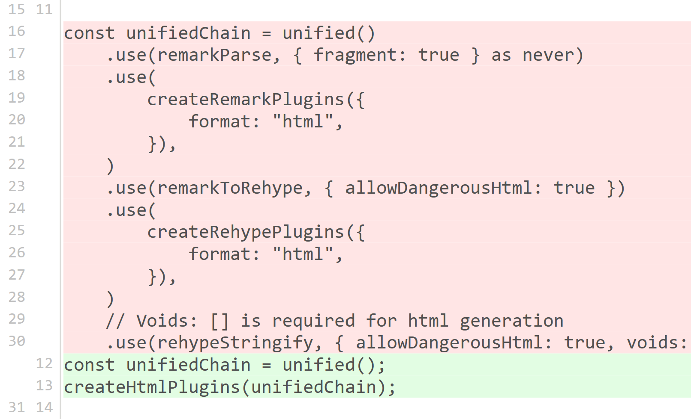
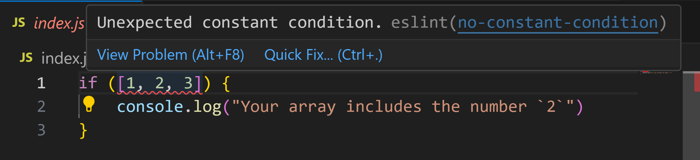

---
{
    title: "Linting and Formatting",
    description: "",
    published: '2025-01-01T22:12:03.284Z',
    tags: ["react", "angular", "vue", "webdev"],
    order: 2
}
---

<details>
<summary>What tools are we learning in this chapter?</summary>

While there's a few other options in the linting and formatting space:

- [Biome](https://biomejs.dev/)
- [Oxlint](https://oxc.rs/docs/guide/usage/linter.html)
- [Flow](https://flow.org)

We'll instead be learning about [ESLint](https://eslint.org/), [Prettier](https://prettier.io/), and [TypeScript](https://www.typescriptlang.org/). Let's talk about why:

- ESLint is the de-facto linting solution for JavaScript projects, being downloaded nearly 500 million times a months on NPM.
- [ESLint is working becoming language agnostic.](https://eslint.org/blog/2024/07/whats-coming-next-for-eslint/) I suspect this will lead to growth of ESLint outside of JavaScript projects.
- Prettier is also adopted almost as well as ESLint, just barely shy of ESLint's downloads a month.
- Prettier is a strongly opinionated formatting solution with many edge cases covered. This means that we can spend less time configuring our tooling and allow the defaults to handle highly debated scenarios for us.
- TypeScript is the most widely used tool of the bunch, used far more often than alternative JavaScript superset languages.
- While TypeScript isn't in the _exact same_ category of the other tools listed, it often plays an important role in formatting and linting

> In our article, we'll use Prettier and ESLint separately from one-another. While there _are_ ways to glue them together to run Prettier _from_ ESLint (or even use ESLint as a Prettier replacement) [this practice should be avoided. We'll explore why later on.](// TODO: Link to this part of the chapter)

With this covered - Let's dive in!

</details>

JavaScript is an incredibly flexible language. Both of the following code samples are semantically valid and functionally equal code blocks:

```javascript
// Valid pretty code
for (let i = 0; i < 10; i++) {
    console.log(i);
}
```

```javascript
// Also valid, albiet ugly, code
for(
let i
    = 0
; i
        < 10; i++
    ){
console.log(
    i
);}
```

While supported by any stable JavaScript environment, the first code sample is almost undeniably nicer than the second in terms of readability.

It would be swell if we were able to automatically have code formatted like the first code block, no matter how we wrote it?

------

What's more, this code is **also** semantically valid, but will throw an error at runtime:

```javascript
for (let i = 0; i < 10; i++) {
    // This will throw an error, as `ii` is not defined
    console.log(ii);
}
```

Wouldn't it be nice if we could have some tooling established to catch this kind of "undefined variable" error programmatically?

----

Luckily for us, there are tools that solve both of these problems!

- Formatters: Aimed at solving "What should my code look like?"
- Linters: Aimed at solving "What bugs will my code introduce?"

Let's explore each of these tools, how to use them in our codebase, and what their primary advantages are.

# Formatters

As demonstrated earlier, a formatter allows you to take messy code:

```javascript
function test(
arg
	)
{ return arg}
```

And format it into something more readible:

```javascript
function test(arg) {
  return arg;
}
```

Most all coding languages will either have a community or an official code formatter. In the JavaScript ecosystem, that tool is more often than not "Prettier".

To install Prettier, we can update our `package.json` using our package manager of choice:

```shell
npm i -D prettier
```

Then add a script to execute Prettier against our source code files:

```json
"scripts": {
  "format": "prettier ."
},
```

Once the package is installed, you can run `npm run format` on any repository without any additional configuration:

// TODO: Add iframe

> It's worth mentioning that Prettier supports React, Angular, and Vue all very well out of the box. You shouldn't need to add any additional configuration to get Prettier working with your other projects.


## Fewer Bike Sheds

There's a humorous story amongst developers that goes something like:

> There's an organizational committee for the construction of a powerplant. The committee has all of the research required for the powerplant and the blueprints laid out in front of them. They talk for a bit about it and, after 15 minutes, come to the agreement that the powerplant can be moved forward with and developed.
>
> But then they get to talking about the employee bike shed. It'll make the lives of the employees better, yes, but _what color should the shed be_? They spend an hour talking about which color the shed should be and finally land on a nice shade of brown.

This story demonstrates how, without proper guidance and prioritization, insignificant issues (like the color of a shed) can triumph over more significant problems; like how to fund and organize the development of a powerplant.


> This story is often attributed with the ["Law of triviality"](https://en.wikipedia.org/wiki/Law_of_triviality), which states "people within an organization commonly give disproportionate weight to trivial issues."

This story has led to the term "bike-shedding" to refer to any argument that follows the law of triviality.

----

As you can imagine, many developers have very strong preferences for coding style. Some prefer semicolons, while others are vehemently against them.

By having a strongly opinionated tool like Prettier to establish the code conventions for you, you're able to sidestep many of these time-wasting arguments in favor of something built-in.

It's for this reason that, while Prettier can be configured fairly modularly, I suggest keeping most if not all of the defaults of Prettier.

## Reducing Merge Conflicts

Code style consistency and avoiding bike-shedding aren't the only benefits of formatters, either.

When using tools like [Git](https://git-scm.com/), it's common to store a difference between two snapshots of your code:


This is fundamental to how many code backup and versioning solutions work; they track a before and after of each line of code.

Because it tracks the difference in each line of code, it can sometimes figure out when a change is smaller, like the example above; but other times it's only able to see "enough changed in this line that I don't recognize anything from the previous change":



This inability to recognize differences makes it much harder to visually identify what's specifically changed between versions of the codebase.

----

Worse than the difficulties visually seeing code changes; this same problem makes things like [`git merge`](https://www.atlassian.com/git/tutorials/using-branches/git-merge) much more likely to introduce a [Git conflict](https://www.atlassian.com/git/tutorials/using-branches/merge-conflicts). These conflicts make code sharing and collaboration much harder to reconcile when too many variants of the code exist.

# Linters

While formatting is important to a well-organized codebase; it doesn't often find bugs in your codebase.

Instead, this responsibility often comes down to a bit of tooling that evaluates your source code and detects common mistakes and patterns to avoid. This bit of tooling is called a "linter".

For example, we might have a bit of code that looks like this:

```javascript
// This code is broken, but would probably be
// caught by a linter like ESLint
if ([1, 2, 3]) {
	console.log("Your array includes the number `2`")
}
```

Here, we're passing an array to an `if` statement, rather than our intended `[1, 2, 3].includes(2)`.

While this might not seem like something a tool could detect for us, it might be able to pick up on the fact that `if ([])` would **always** run, and throw an error to you as a result. This would make catching this bug's solution substantially more obvious.

## How to set up ESLint

In JavaScript, the most utilized tool to lint your code is ESLint. To install ESLint in your project, you'll start by installing some pre-requisite NPM modules:

```shell
npm i -D eslint @eslint/js globals
```

Once this is established, we can create a configuration file for ESLint:

```javascript
// eslint.config.mjs
import globals from "globals";
import pluginJs from "@eslint/js";

export default [
  {languageOptions: { globals: globals.browser }},
  pluginJs.configs.recommended,
];
```

Here, we're telling ESLint that it should:

- Correctly detect any Browser code we'll use in our projects
- Apply the default linting rules to catch errors

Now when we reproduce our buggy code from before:

```javascript
// This is buggy code caught by ESLint
if ([1, 2, 3]) {
    console.log("Your array includes the number `2`")
}
```

We get the following error show up in our IDE:

> ```
> Unexpected constant condition. eslint(no-constant-condition)
> ```
>
> 

## Adapt ESLint to your tools

While ESLint without many configuration changes will find many issues it can be made even more utilitarian when you inform it on what tools you use in your project.

For example, if you use a framework like React that supports JSX syntax, you can add a plugin for ESLint to detect common issues in JSX codebases.

<!-- tabs:start -->

### React

To add support for React additions to ESLint, we'll need to install an ESLint plugin:

```shell
npm i -D eslint-plugin-react eslint-plugin-react-hooks
```

And add the files to the ESLint configuration from earlier:

```javascript
import globals from "globals";
import pluginJs from "@eslint/js";
import pluginReact from "eslint-plugin-react";

export default [
  {files: ["**/*.{js,mjs,cjs,jsx}"]},
  {languageOptions: { globals: globals.browser }},
  pluginJs.configs.recommended,
  {settings: { react: { version: "detect" } }},
  pluginReact.configs.flat.recommended,
];
```

// TODO: ADD REACT HOOKS RULES WHEN FLAT CONFIG IS SUPPORTED:
// https://github.com/facebook/react/issues/28313

Now we can check this buggy code against the Rules of React Hooks linting configuration:

```jsx
// This is buggy code that ESLint will catch with React plugins configured
import {useState} from 'react'; 

let someBool = true;

export default function App() {
    if (someBool) {
        const [val, setVal] = useState(0);
        return <p onClick={() => setVal(val + 1)}>{val}</p>
    }
    return null;
}
```

And see this error:

> ```
> React Hook "useState" is called conditionally. React Hooks must be called in the exact same order in every component render. Did you accidentally call a React Hook after an early return? eslint(react-hooks/rules-of-hooks)
> ```

// TODO: Add iframe

### Angular

> The Angular CLI - the quickest and official way to start new Angular projects - may already have ESLint configured for you when you generate a project using it. This outlines how to add ESLint to an Angular project not using the Angular CLI.

Let's install the dependencies required to use ESLint in our Angular project:

```shell
npm i -D angular-eslint typescript-eslint@rc-v8 typescript @types/eslint__js
```

And apply it to our ESLint configuration file:

```javascript
// @ts-check
// eslint.config.mjs

import pluginJs from "@eslint/js";
import pluginTs from 'typescript-eslint';
import pluginAngular from 'angular-eslint';

export default pluginTs.config(
  {
    files: ['**/*.ts'],
    extends: [
      pluginJs.configs.recommended,
      ...pluginTs.configs.recommended,
      ...pluginAngular.configs.tsRecommended,
    ],
    processor: pluginAngular.processInlineTemplates,
  },
  {
    files: ['**/*.html'],
    extends: [
      ...pluginAngular.configs.templateRecommended,
    ]
  },
);
```

This will:

- Add the recommended configuration of JavaScript ESLint rules
- Add the recommended configuration of TypeScript ESLint rules
- Add the recommended configuration of Angular's TypeScript ESLint rules
- Treat inline templates in Angular components as HTML files
- Add the recommended configuration of Angular's HTML ESLint rules

Once this is present, we can check it's working by throwing some buggy Angular code at it:

```angular-ts
import { Component } from "@angular/core";

// This is buggy code that ESLint will catch with Angular plugins configured
@Component({
    selector: "app-root"
})
export class AppComponent {
  ngOnInit() {
  	// Some code
    console.log("The app is initialized");
  }
}
```

> ```
> Lifecycle interface 'OnInit' should be implemented for method 'ngOnInit'. (https://angular.dev/style-guide#style-09-01) eslint(angular-eslint/use-lifecycle-interface)
> ```

// TODO: Add iframe

### Vue

Adding ESLint support to your Vue app is fairly straightforward using the `eslint-vue-plugin` addon:

``` shell
npm i -D eslint-plugin-vue
```

```javascript
// eslint.config.mjs
import globals from "globals";
import pluginJs from "@eslint/js";
import pluginVue from "eslint-plugin-vue";

export default [
  {files: ["**/*.{js,mjs,cjs,vue}"]},
  {languageOptions: { globals: globals.browser }},
  pluginJs.configs.recommended,
  ...pluginVue.configs["flat/recommended"],
];
```

Now it'll catch common errors in our Vue SFC files like this one:

```vue
<script setup>
// This is buggy code that ESLint will catch with Vue plugins configured
export let msg = 'Hello!'
</script>
```

> ```
> `<script setup>` cannot contain ES module exports. eslint(vue/no-export-in-script-setup)
> ```

// TODO: Add iframe

<!-- tabs:end --> 

# Formatting vs Linting

Formatting and linting your code both require deeper understanding of your codebase than "it is some text". This deeper understanding comes from the transformation of your source code into an AST:


> [We spoke about this transformation of source code to AST in my article "How computers speak"](/posts/how-computers-speak).

It might be tempting to hear about how these two tools have similar internals to understand your code and think "Oh, sweet, we can reduce two tools into one" and try to merge your linter and formatter into one command.

In fact, there exist plugins to combine ESLint and Prettier:

- [`eslint-config-prettier`](https://github.com/prettier/eslint-config-prettier)
- [`eslint-plugin-prettier`](https://github.com/prettier/eslint-plugin-prettier)

And even a dedicated ESLint plugin to add formatting to your code:

- [ESLint Stylistic](https://eslint.style/)

However, while this might seem appealing at first, it's not a good idea to mix-n-match these tools in a single command.

These tools are not generally suggested by either [the ESLint team](https://www.joshuakgoldberg.com/blog/you-probably-dont-need-eslint-config-prettier-or-eslint-plugin-prettier/) or [the Prettier team](https://prettier.io/docs/en/integrating-with-linters.html) because they:

- Bring heavy maintenance burden to both teams to support this workflow
- Are built for different tasks

Consider the following:

Linters need to catch errors cautiously and may need to do a double-glance at your code to understand the context of some items.

Formatters, on the other hand, should be as fast as possible and will likely only look through your code once to get the job done.

> [You can learn more about why you should not be using ESLint to format tools from one of the ESLint maintainers, Joshua K Goldberg.](https://www.joshuakgoldberg.com/blog/configuring-eslint-prettier-and-typescript-together/#stop-using-eslint-for-formatting)


# What is TypeScript?

At a very high level, TypeScript is a way to add types to your JavaScript codebase.

```typescript
const val: number = 123;
```

We can use this metadata to throw us an error when we're, say, passing the wrong type to a function: 

```typescript
// This is buggy code that TypeScript will catch
function add(val1: number, val2: number) {
    return val1 + val2;
}

add(123, "123")
```

> ```
> Argument of type 'string' is not assignable to parameter of type 'number'.ts(2345)
> ```

You can [learn more about TypeScript and what it is in this article I wrote.](/posts/introduction-to-typescript)

-----

TypeScript isn't _exactly_ a linter; instead it provides you a type system you can use to make your code more resilient to breakages.

However, [according to Wikipedia, the definition of a linter](https://en.wikipedia.org/wiki/Lint_(software)) is:

> [...] a static code analysis tool used to flag programming errors, bugs, stylistic errors and suspicious constructs.

Which sounds a lot like TypeScript to me.

However, some have pointed to the fact that TypeScript requires you to add additional code to your own for it to function as an indicator that TypeScript it its own programming language; an extension of JavaScript at that.

I'd argue it's both and that one argument does not preclude the other from being true...

-----

Regardless of whether TypeScript is a linter or a programming language in its own right - its utility is almost impossible to argue. This is why many choose to write their JavaScript projects exclusively in TypeScript nowadays.

To install TypeScript in your project, you can `npm i` it:

```shell
npm i -D typescript
```

Then place a configuration file for TypeScript in `tsconfig.json`:

```json
{
    "compilerOptions": {
        "target": "esnext",
        "lib": [
            "esnext",
            "dom"
        ],
        "strict": true,
        "outDir": "dist"
    }
}
```

This tells our code that it should:

- Target the latest version of JavaScript (officially called "EcmaScript", which is shortened to "ES" here).
- Include the required types to run our code in the browser.
- Strictly enforce our types.
- Output type-removed JavaScript to the `dist` directory.

Finally, we add `tsc` to our `scripts` in our `package.json`:

```json
"scripts": {
  "tsc": "tsc"
},
```

From here, you'll write code in `.ts` files rather than `.js` files:

```typescript
// index.ts
const RoughlyPi: number = 3.14;

function areaOfCircle(radius: number) {
    return RoughlyPi * radius * radius;
}

const Radius: number = 5;

console.log(`Area of circle with radius ${Radius} is ${areaOfCircle(Radius)}`);
```

And compile them back to JavaScript using:

```shell
npm run tsc
```

> ```javascript
> // dist/index.js
> "use strict";
> const RoughlyPi = 3.14;
> function areaOfCircle(radius) {
>     return RoughlyPi * radius * radius;
> }
> const Radius = 5;
> console.log(`Area of circle with radius ${Radius} is ${areaOfCircle(Radius)}`);
> ```


## Use TypeScript with a framework

TypeScript works with your favorite pre-existing tools:

<!-- tabs:start -->

### React

To use TypeScript with React, you'll need to modify your `tsconfig.json` file mildly:

```json
{
    "compilerOptions": {
        "target": "esnext",
        "lib": [
            "esnext",
            "dom"
        ],
        "strict": true,
        "outDir": "dist",
        "module": "NodeNext",
        "moduleResolution": "nodenext",
        "jsx": "react-jsx"
    }
}
```

Once this is done, you can change your `.jsx` files to `.tsx` and use the same `tsc` command from before to transform this:

```tsx
// index.tsx
const RoughlyPi: number = 3.14;

function areaOfCircle(radius: number) {
    return RoughlyPi * radius * radius;
}

function App() {
	const Radius: number = 5;
    return <p>Area of circle with radius {Radius} is {areaOfCircle(Radius)}</p>
}
```

To this:

````javascript
// dist/index.js
"use strict";
Object.defineProperty(exports, "__esModule", { value: true });
const jsx_runtime_1 = require("react/jsx-runtime");
const RoughlyPi = 3.14;
function areaOfCircle(radius) {
    return RoughlyPi * radius * radius;
}
function App() {
    const Radius = 5;
    return (0, jsx_runtime_1.jsxs)("p", { children: ["Area of circle with radius ", Radius, " is ", areaOfCircle(Radius)] });
}
````

### Angular

TypeScript is required to use Angular. If you've installed Angular and have it running, you have TypeScript running as well. As such, I won't be including instructions to include TypeScript in your Angular project; since they are (in terms of installation) one in the same.

### Vue

To use TypeScript with Vue, we'll need to replace our `tsc` command with one specifically meant for Vue's SFC format:

```shell
npm i -D vue-tsc
```

```
"scripts": {
  "tsc": "vue-tsc"
},
```

Then to use TypeScript in your SFCs you'll just add `lang="ts"` to your `<script setup>` tag:

```vue
<!-- index.vue -->
<script setup lang="ts">
const RoughlyPi: number = 3.14;

function areaOfCircle(radius: number) {
    return RoughlyPi * radius * radius;
}

const Radius: number = 5;
</script>

<template>
  <p>Area of circle with radius {{ Radius }} is {{ areaOfCircle(Radius) }}</p>
</template>
```

And have it transformed to `.js` when you run the `tsc` script:

```javascript
// dist/index.vue.js
/* __placeholder__ */
const { defineProps, defineSlots, defineEmits, defineExpose, defineModel, defineOptions, withDefaults, } = await import('vue');
const RoughlyPi = 3.14;
function areaOfCircle(radius) {
    return RoughlyPi * radius * radius;
}
const Radius = 5;
const __VLS_fnComponent = (await import('vue')).defineComponent({});
;
let __VLS_functionalComponentProps;
function __VLS_template() {
    let __VLS_ctx;
    /* Components */
    let __VLS_otherComponents;
    let __VLS_own;
    let __VLS_localComponents;
    let __VLS_components;
    let __VLS_styleScopedClasses;
    let __VLS_resolvedLocalAndGlobalComponents;
    __VLS_elementAsFunction(__VLS_intrinsicElements.p, __VLS_intrinsicElements.p)({});
    (__VLS_ctx.Radius);
    (__VLS_ctx.areaOfCircle(__VLS_ctx.Radius));
    // @ts-ignore
    [Radius, Radius, areaOfCircle,];
    if (typeof __VLS_styleScopedClasses === 'object' && !Array.isArray(__VLS_styleScopedClasses)) {
    }
    var __VLS_slots;
    return __VLS_slots;
    const __VLS_componentsOption = {};
    let __VLS_name;
    let __VLS_defineComponent;
    const __VLS_internalComponent = __VLS_defineComponent({
        setup() {
            return {
                areaOfCircle: areaOfCircle,
                Radius: Radius,
            };
        },
    });
}
export default (await import('vue')).defineComponent({
    setup() {
        return {};
    },
});
;
```

<!-- tabs:end -->


## Using TypeScript with ESLint

Regardless of whether or not TypeScript is truly a linter, its ability to have metadata associated with your code allows more formalized linters like ESLint to add additional capabilities using said metadata.

// TODO: Talk about TypeScript ESLint and rules like "Must await promises"

