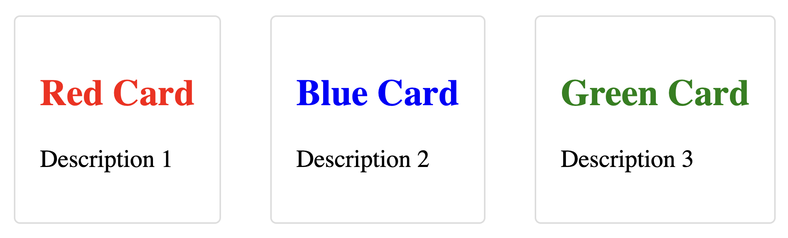
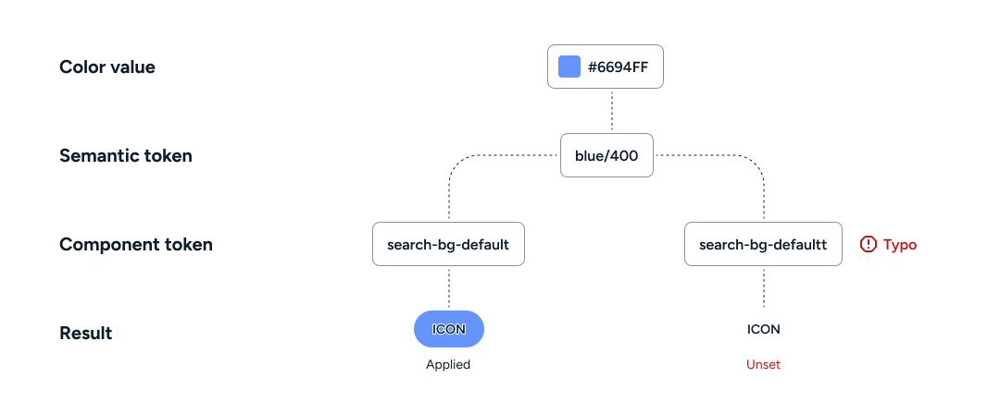
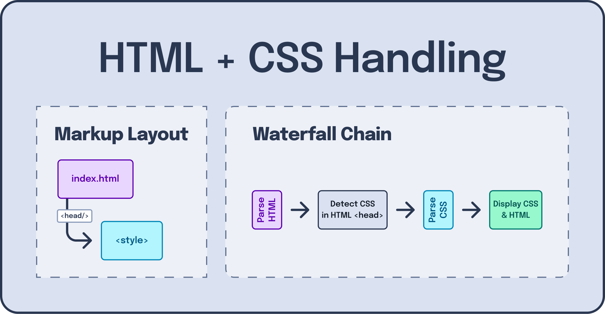
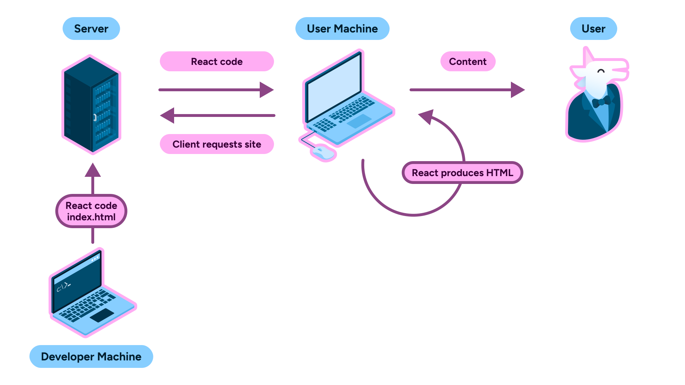
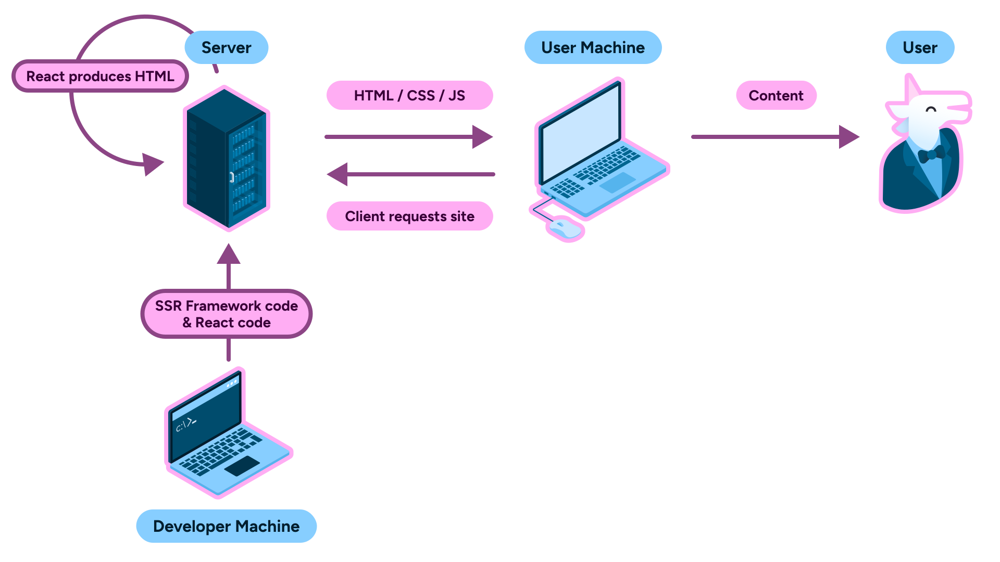

---
{
  title: "Styling",
  description: "Styling your web application comes in many flavors. Let's explore the different approaches you can take in your projects.",
  published: "2025-06-18T22:12:03.284Z",
  tags: ["react", "angular", "vue", "webdev"],
  order: 3,
}
---

<details>
<summary>What tools are we learning in this chapter?</summary>
Styling is a highly contested space in web development. Surely, no matter what tools I select there will always be someone with a different perspective on which tools I should have written about.

Just to name a few, here are some of the styling tools we're **not** talking about in this chapter:

- [Styled Components](https://styled-components.com/)
- [StyleX](https://stylexjs.com/)
- [UnoCSS](https://unocss.dev/)
- [Vanilla Extract](https://vanilla-extract.style/)
- [Less](https://lesscss.org/)

Given the broad range and number of tools we aren't looking at, what tools _are_ we going to be learning about? Well, in addition to a few built-in browser techniques, we'll touch on:

- [Tailwind](https://tailwindcss.com/) for its ubiquitous adoption among utility class libraries (nearly 10M downloads a week on NPM)
- [CSS Modules](https://github.com/css-modules/css-modules) for its close-to-bare CSS and invisible usage
- [SCSS](https://sass-lang.com/) for its broad adoption (13M downloads a week on NPM) and the ability to compile complex styling to raw CSS
- [Emotion](https://emotion.sh/) for its framework-agnostic approach to runtime CSS-in-JS
- [Panda CSS](https://panda-css.com/) for its framework-agnostic approach to compile away CSS-in-JS

Let's get into it.

</details>

CSS is awesome. It's also used in every web app out there, which makes sense given that it's one of the three core languages of the web: HTML, CSS, and JavaScript.

If we wanted to, for example, build the header bar of this mockup:


Our markup might look something like this:

```jsx
<header class="container">
	<LogoIcon />
	<SearchBar />
	<SettingsCog />
	<ProfilePicture />
</header>
```

With the `container` class being defined in CSS like so:

```css
/* header.css */
.container {
	display: flex;
	padding: 8px 24px;
	align-items: center;
	gap: 32px;
	border-bottom: 2px solid #f5f8ff;
	background: #fff;
}
```

This works out pretty well for some basic styling!


Now let's build out the search box:

```html
<div class="container">
	<SearchIcon />
</div>
```

```css
/* search-box.css */
.container {
	border-radius: 8px;
	color: #3366ff;
	background: rgba(102, 148, 255, 0.1);
	padding: 8px;
	flex-grow: 1;
}
```


Now let's import both of these CSS files into the same HTML file:

```html
<link rel="stylesheet" href="header.css" />
<link rel="stylesheet" href="search-box.css" />
```

Annnnd:


Oh, dear... It seems like the styling for the header has impacted the search box and vice versa.

---

This merging of styling is occurring because `container` is the same CSS identifier between the search box container and the header container; despite being in two different CSS files.

This problem is known as "scoping," and is a problem that gets worse the larger your codebase gets; it's hard to keep track of every preexisting class name that's been used.

# BEM Classes

One way to solve this problem of scoping in CSS relies on no external tooling than a self-motivated convention. This solution is called "BEM Classes."

BEM stands for "Box Element Modifier" and helps you establish scoping through uniquely named classes that are "namespaced" based on where on the screen they exist.


The example we demonstrated scoping problems within has two "boxes":

1. The header
2. The search box

As such, the container for these elements might be called:

```css
.header {
}

.search-box {
}
```

---

The "Elements" part of BEM is then referring to the elements within each "Box."

For example, both the header and the search box have icons inside. We would then prefix the "Box" name and then the name of the "Element":

```css
.header__icon {
}

.search-box__icon {
}
```

---

Finally, we have "Modifiers" to complete the "BEM" acronym.

For example, we might want to have two different colors of icons we support; sharing the rest of the styling across all header icons besides the color.

To do this, we'll prefix the name of the "Box" followed by what the "Modifier" does:

```css
.header--blue {
}

.search-box--grey {
}
```

---

BEM is a viable alternative for large-scale codebases if you follow its conventions well enough. Many people swear by its utility and the ability to leverage the platform itself to solve the scoping problem.

However, for some, even the need to remember what "Box" names have already been used can lead to confusion and other levels of scoping problems.

Let's look at some other alternatives to using the BEM methodology.

# Utility Classes

Another way you're able to solve the problem of scoping through convention is by leaning into the shared aspects of CSS classes as styling identifiers.

This means that instead of something like this:

```html
<div class="search-container"></div>

<style>
	.search-container {
		border-radius: 8px;
		color: #3366ff;
		background: rgba(102, 148, 255, 0.1);
		padding: 8px;
		flex-grow: 1;
	}
</style>
```

We could instead break these CSS rules into modular reusable classes:

```html
<div class="rounded-md padding-md grow blue-on-blue"></div>

<style>
	.rounded-md {
		border-radius: 8px;
	}

	.padding-md {
		padding: 8px;
	}

	.grow {
		flex-grow: 1;
	}

	.blue-on-blue {
		color: #3366ff;
		background: rgba(102, 148, 255, 0.1);
	}
</style>
```

This means that instead of having one-off classes that are used on a case-by-case basis, we have global classes that are reused across the entire application.

This comes with a few added benefits:

- Only one CSS file to worry about
- Less duplicated CSS shipped
- Easier to visualize styling from markup

But it also has its own downfalls:

- You have to figure out naming for every class; consistency can be challenging
- Your markup ends up cluttered with complex styles represented by many classes

## Tailwind

When the topic of utility classes comes up, Tailwind is not far behind.

Tailwind is a CSS framework that ships with all the utility classes you could ever need. Just like rolling your own utility classes, Tailwind's classes can be applied to any element and reused globally.

Our example from before might look something like this:

```html
<div class="rounded-lg p-8 grow bg-blue-50 text-blue-800"></div>
```


While Tailwind doesn't solve the cluttered markup challenges with hand-rolling your own utility classes, it comes with some additional benefits over utility classes:

- Ease of training. If someone's used Tailwind before, they know how to use it and what class names to use. Moreover, the Tailwind docs are very, _very_ polished.

  

- Pre-built styling tokens. No need to figure out what `padding-lg` or `padding-xl` should be; Tailwind ships with a strong color palette and sane defaults out-of-the-box for you to use as your design system base.

  

- IDE support. From color previews to class name auto-completion, Tailwind has many integrations with most IDEs you'd want to use.

  

### Install Tailwind

To install Tailwind, start by using your package manager to install the required packages:

```shell
npm install -D tailwindcss
```

Next, create a CSS file:

```css
/* src/styles.css */
@import "tailwindcss";
```

Finally, you'll configure Tailwind to integrate with your bundler:

<!-- ::start:tabs -->

#### React

To enable Tailwind in your React Vite project, you'll need to add a Vite plugin for TailwindCSS:

```shell
npm install -D @tailwindcss/vite
```

Then we'll add this to our Vite configuration:

```javascript
// vite.config.js
import { defineConfig } from "vite";
import react from "@vitejs/plugin-react";
import tailwindcss from "@tailwindcss/vite";

export default defineConfig({
	plugins: [react(), tailwindcss()],
});
```

Finally, we'll import our `src/styles.css` file into Vite's entry point of `index.html`:

```html {7}
<!doctype html>
<html lang="en">
	<head>
		<meta charset="UTF-8" />
		<meta name="viewport" content="width=device-width, initial-scale=1.0" />
		<title>Vite + React</title>
		<link rel="stylesheet" href="/src/style.css" />
	</head>
	<body>
		<div id="root"></div>
		<script type="module" src="/src/main.jsx"></script>
	</body>
</html>
```

#### Angular

Since the Angular CLI supports [PostCSS](https://postcss.org/) out-of-the-box, we can leverage it to add Tailwind.

> PostCSS is a CSS transformer that powers Tailwind's compilation of your CSS. (more on this later)

To start, install the required packages:

```shell
npm install -D tailwindcss @tailwindcss/postcss postcss
```

Then, create a `.postcssrc.json` file and place the Tailwind plugin inside:

```json
{
	"plugins": {
		"@tailwindcss/postcss": {}
	}
}
```

Now, so long as your `angular.json` file references the `src/style.css` file we added earlier, you should be off to the races!

#### Vue

Just like React, we'll use a Vite plugin to add Tailwind to our Vue app.

Install the package:

```shell
npm install -D @tailwindcss/vite
```

Add it to the Vite configuration:

```javascript
// vite.config.js
import { defineConfig } from "vite";
import vue from "@vitejs/plugin-vue";
import tailwindcss from "@tailwindcss/vite";

export default defineConfig({
	plugins: [vue(), tailwindcss()],
});
```

And import our `src/styles.css` file into Vite's `index.html`:

```html {7}
<!doctype html>
<html lang="en">
	<head>
		<meta charset="UTF-8" />
		<meta name="viewport" content="width=device-width, initial-scale=1.0" />
		<title>Vite + Vue</title>
		<link rel="stylesheet" href="/src/style.css" />
	</head>
	<body>
		<div id="root"></div>
		<script type="module" src="/src/main.js"></script>
	</body>
</html>
```

<!-- ::end:tabs -->

To make sure that Tailwind is properly configured, we can add it to our root component:

<!-- ::start:tabs -->

#### React

```jsx
const App = () => {
	return (
		<a
			className="bg-indigo-600 text-white py-2 px-4 rounded-md"
			href="https://discord.gg/FMcvc6T"
		>
			Join our Discord
		</a>
	);
};
```

<iframe data-frame-title="React Tailwind - StackBlitz" src="pfp-code:./ffg-ecosystem-react-tailwind-9?template=node&embed=1&file=src%2FApp.jsx" sandbox="allow-modals allow-forms allow-popups allow-scripts allow-same-origin"></iframe>

#### Angular

```angular-ts
@Component({
  selector: "app-root",
  changeDetection: ChangeDetectionStrategy.OnPush,
  template: `
      <a
        class="bg-indigo-600 text-white py-2 px-4 rounded-md"
        href="https://discord.gg/FMcvc6T"
      >
        Join our Discord
      </a>
  `,
})
export class App {}
```

<iframe data-frame-title="Angular Tailwind - StackBlitz" src="pfp-code:./ffg-ecosystem-angular-tailwind-9?template=node&embed=1&file=src%2Fmain.ts" sandbox="allow-modals allow-forms allow-popups allow-scripts allow-same-origin"></iframe>

#### Vue

```vue
<template>
	<a
		className="bg-indigo-600 text-white py-2 px-4 rounded-md"
		href="https://discord.gg/FMcvc6T"
	>
		Join our Discord
	</a>
</template>
```

<iframe data-frame-title="Vue Tailwind - StackBlitz" src="pfp-code:./ffg-ecosystem-vue-tailwind-9?template=node&embed=1&file=src%2FApp.vue" sandbox="allow-modals allow-forms allow-popups allow-scripts allow-same-origin"></iframe>

<!-- ::end:tabs -->

Once you preview the component, it should look like this:


### Tailwind Compilation

You might wonder:

> With **so many** utility classes in Tailwind, if I use it, the download size of my CSS must be huge!

Not so! See, when Tailwind generates the CSS for your application, it only adds in the classes you actually use within your templates.

This means that if you don't have any Tailwind classes in your code, only the prerequisite CSS generated will be included:


> You're even able to shrink this prerequisite CSS down if you'd like. We can customize our `src/style.css` file to only include the prerequisites we need for our project.
>
> To demonstrate this, you can remove all of the `@import`s of Tailwind, and you'll end up with `0kb` of CSS when you aren't using any Tailwind classes.

### Dynamic Classes using Tailwind

Because of Tailwind's "compile based on your code" strategy, it's able to have a distinct superpower over rolling your own utility classes: [Generating arbitrary CSS from class names.](https://tailwindcss.com/docs/adding-custom-styles#arbitrary-properties)

Say you want to blur an image:

```html

```


Or maybe you want to have a border width of a specific pixel value:

```html

```


You're able to truly make Tailwind your own.

<!-- ::start:tabs -->

<!-- ::start:no-ebook -->

#### React

<iframe data-frame-title="React Tailwind Image - StackBlitz" src="pfp-code:./ffg-ecosystem-react-tailwind-img-10?template=node&embed=1&file=src%2FApp.jsx" sandbox="allow-modals allow-forms allow-popups allow-scripts allow-same-origin"></iframe>

#### Angular

<iframe data-frame-title="Angular Tailwind Image - StackBlitz" src="pfp-code:./ffg-ecosystem-angular-tailwind-img-10?template=node&embed=1&file=src%2Fmain.ts" sandbox="allow-modals allow-forms allow-popups allow-scripts allow-same-origin"></iframe>

#### Vue

<iframe data-frame-title="Vue Tailwind Image - StackBlitz" src="pfp-code:./ffg-ecosystem-vue-tailwind-img-10?template=node&embed=1&file=src%2FApp.vue" sandbox="allow-modals allow-forms allow-popups allow-scripts allow-same-origin"></iframe>

<!-- ::end:no-ebook -->

<!-- ::end:tabs -->

# Scoped CSS

But not everyone wants to use utility classes for their solutions. For many, they just want to reuse their existing CSS knowledge with selectors and all just with the scoping problem solved for them.

Well, what if each CSS file had its own auto-scoping pre-applied?

```css
/* file-one.css */
.container {
}

/* When used, is transformed to */
.FILE_ONE_6591_container {
}

/* To preserve uniqueness against other CSS files */
```

Luckily for us, each framework has a solution to this problem.

<!-- ::start:tabs -->

## React

To automatically scope our CSS in our React application, we'll rely on Vite's built-in support for [CSS Modules](https://github.com/css-modules/css-modules).

To do this, we just need to add `.module.css` to the name of any CSS file:

```css
/* search-box.module.css */
.container {
	border-radius: 8px;
	color: #3366ff;
	background: rgba(102, 148, 255, 0.1);
	padding: 8px;
	display: flex;
}
```

Then we'll import the CSS in our JSX file and use the name of the class as a property on the imported object:

```jsx
// App.jsx
import style from "./search-box.module.css";

function SearchBox() {
	return (
		<div className={style.container}>
			<SearchIcon />
		</div>
	);
}
```

This will then generate the following markup and styling for us:

```html
<h1 class="_title_q98e2_3">The Framework Field Guide</h1>

<style>
	._title_q98e2_3 {
		font-weight: bold;
		text-decoration: underline;
		font-size: 2rem;
	}
</style>
```

This transformation of the class name will ensure that each CSS file has its own scope that's different from another.

<iframe data-frame-title="React Scoped CSS - StackBlitz" src="pfp-code:./ffg-ecosystem-react-scoped-css-11?template=node&embed=1&file=src%2FApp.jsx" sandbox="allow-modals allow-forms allow-popups allow-scripts allow-same-origin"></iframe>

## Angular

In Angular, we're able to use styles relative to the component by using either the `styleUrl` or `style` property in the `@Component` decorator:

```angular-ts
@Component({
  selector: 'search-box',
  changeDetection: ChangeDetectionStrategy.OnPush,
  imports: [SearchIcon],
  styles: [
    `
    .container {
        border-radius: 8px;
        color: #3366FF;
        background: rgba(102, 148, 255, 0.1);
        padding: 8px;
	    display: flex;
    }
 `,
  ],
  template: `
    <div class="container">
        <search-icon/>
    </div>
`,
})
export class SearchBox {}
```

Will generate the following CSS and Markup:

```html
<app-root _nghost-ng-c118366096="">
	<div _ngcontent-ng-c118366096="" class="container">
		<!-- ... -->
	</div>
</app-root>

<style>
	.container[_ngcontent-ng-c118366096] {
		border-radius: 8px;
		color: #3366ff;
		background: rgba(102, 148, 255, 0.1);
		padding: 8px;
		display: flex;
	}
</style>
```

This means that if we have two different components, each with their own `.title` CSS class; each will be isolated in their styling relative to their parent component.

<iframe data-frame-title="Angular Scoped CSS - StackBlitz" src="pfp-code:./ffg-ecosystem-angular-scoped-css-11?template=node&embed=1&file=src%2Fmain.ts" sandbox="allow-modals allow-forms allow-popups allow-scripts allow-same-origin"></iframe>

### Local and Global Styling

Say you have a root `App` component that you want to disable the CSS scoping; This would enable the styles of `App` to act as global styles for your app.

Angular supports doing this by changing the `encapsulation` property in the `@Component` decorator:

```angular-ts {18}
import { Component, ViewEncapsulation } from '@angular/core';

@Component({
  selector: 'search-box',
  changeDetection: ChangeDetectionStrategy.OnPush,
  imports: [SearchIcon],
  styles: [
    `
    .container {
        border-radius: 8px;
        color: #3366FF;
        background: rgba(102, 148, 255, 0.1);
        padding: 8px;
        display: flex;
    }
 `,
  ],
  encapsulation: ViewEncapsulation.None,
  template: `
    <div class="container">
        <search-icon/>
    </div>
  `,
})
export class SearchBox {}
```

> It's worth mentioning that `encapsulation` will affect _all_ of a component's `styles` and `styleUrls`. There's no way to customize the encapsulation for each of them individually.

<iframe data-frame-title="Angular Scoped CSS Global - StackBlitz" src="pfp-code:./ffg-ecosystem-angular-scoped-global-11?template=node&embed=1&file=src%2Fmain.ts" sandbox="allow-modals allow-forms allow-popups allow-scripts allow-same-origin"></iframe>

## Vue

Like Angular, Vue's SFC component format has scoped CSS as a feature built-in. There are two ways to do so in Vue:

1. Using the `scoped` attribute - which uses PostCSS to add a prefix to the styled elements automatically
2. Using the `module` attribute - which compiles down to [CSS Modules](https://github.com/css-modules/css-modules)

### `scoped` Attribute

To scope your CSS in a Vue SFC, you can add the `scoped` attribute to your `<style>` tag:

```vue
<script setup>
import SearchIcon from "./SearchIcon.vue";
</script>

<template>
	<div class="container">
		<SearchIcon />
	</div>
</template>

<style scoped>
.container {
	border-radius: 8px;
	color: #3366ff;
	background: rgba(102, 148, 255, 0.1);
	padding: 8px;
	display: flex;
}
</style>
```

This will output the following markup and styling:

```html
<div data-v-7a7a37b1="" class="title">
	<!-- ... -->
</div>

<style>
	.container[data-v-7a7a37b1] {
		border-radius: 8px;
		color: #3366ff;
		background: rgba(102, 148, 255, 0.1);
		padding: 8px;
		display: flex;
	}
</style>
```

<iframe data-frame-title="Vue Scoped CSS - StackBlitz" src="pfp-code:./ffg-ecosystem-vue-scoped-css-11?template=node&embed=1&file=src%2FApp.vue" sandbox="allow-modals allow-forms allow-popups allow-scripts allow-same-origin"></iframe>

#### Local and Global Styling

When using the `scoped` attribute, you can mix and match which styles are global and which are scoped.

You can either do this on a per-CSS-selector basis:

```vue
<!-- ... -->

<style scoped>
.red {
}

:global(.blue) {
}
</style>
```

Or have two `<style>` tags; one scoped and one global:

```vue
<!-- ... -->

<style scoped>
.red {
}
</style>

<style>
.blue {
}
</style>
```

<iframe data-frame-title="Vue Scoped CSS Global - StackBlitz" src="pfp-code:./ffg-ecosystem-vue-scoped-global-11?template=node&embed=1&file=src%2FApp.vue" sandbox="allow-modals allow-forms allow-popups allow-scripts allow-same-origin"></iframe>

### CSS Modules

CSS modules are an alternative way to structure your CSS in a scoped way. It transforms the class selectors using JS names for classes instead of a raw string.

To do this in Vue SFC components, we'll use `<style module>` and the `useCssModule` composable:

```vue
<script setup>
import { useCssModule } from "vue";
import SearchIcon from "./SearchIcon.vue";

const style = useCssModule();
</script>

<template>
	<div :class="style.container">
		<SearchIcon />
	</div>
</template>

<style module>
.container {
	border-radius: 8px;
	color: #3366ff;
	background: rgba(102, 148, 255, 0.1);
	padding: 8px;
	display: flex;
}
</style>
```

This will transform the class name itself, rather than adding any attributes to the impacted elements:

```html
<div class="_container_1nd3v_2">
	<!-- ... -->
</div>

<style>
	._container_1nd3v_2 {
		border-radius: 8px;
		color: #3366ff;
		background: rgba(102, 148, 255, 0.1);
		padding: 8px;
		display: flex;
	}
</style>
```

<iframe data-frame-title="Vue CSS Modules - StackBlitz" src="pfp-code:./ffg-ecosystem-vue-css-modules-11?template=node&embed=1&file=src%2FApp.vue" sandbox="allow-modals allow-forms allow-popups allow-scripts allow-same-origin"></iframe>

<!-- ::end:tabs -->

## Deep CSS

While scoping is an invaluable way to regulate your CSS in larger apps, you can often find yourself looking for an escape hatch when looking for ways to style child components.

For example, let's say that I have a list of cards that I want to change the colors of the title:



```html
<ul>
	<li class="red-card"><card /></li>
	<li class="blue-card"><card /></li>
	<li class="green-card"><card /></li>
</ul>
```

We could move the styling for the header into an input prop or move the card styling out to the parent component entirely, but this comes with challenges of their own.

Instead, what if we could keep our component's scoped styling but tell a specific bit of CSS to "inject" itself into the scope of any child components underneath?

Luckily for us, we can!

<!-- ::start:tabs -->

### React

React is able to bypass the scoping inside a CSS module file by prefixing `:global` to a selector, like so:

```css
/* App.module.css */
ul {
	display: flex;
	list-style: none;
}

.redCard :global [data-title] {
	color: red;
}

.blueCard :global [data-title] {
	color: blue;
}

.greenCard :global [data-title] {
	color: green;
}
```

Here, we're saying that the scoped `.redCard` class has a global selector of `[data-title]`, for example.

<iframe data-frame-title="React Deep CSS - StackBlitz" src="pfp-code:./ffg-ecosystem-react-deep-12?template=node&embed=1&file=src%2FApp.jsx" sandbox="allow-modals allow-forms allow-popups allow-scripts allow-same-origin"></iframe>

### Angular

Just like React's `:global` selector, Angular has had the `::ng-deep` selector to find a global path in our otherwise scoped CSS:

```angular-ts
@Component({
	selector: "app-root",
	changeDetection: ChangeDetectionStrategy.OnPush,
	imports: [Card],
	template: `
		<ul>
			<li class="red-card">
				<app-card title="Red Card" description="Description 1" />
			</li>
			<li class="blue-card">
				<app-card title="Blue Card" description="Description 2" />
			</li>
			<li class="green-card">
				<app-card title="Green Card" description="Description 3" />
			</li>
		</ul>
	`,
	styles: [
		`
			ul {
				display: flex;
				list-style: none;
			}

			.red-card ::ng-deep [data-title] {
				color: red;
			}

			.blue-card ::ng-deep [data-title] {
				color: blue;
			}

			.green-card ::ng-deep [data-title] {
				color: green;
			}
		`,
	],
})
export class App {}
```

> **Note**:
>
> `::ng-deep` was originally deprecated in Angular v7, but was officially undeprecated in Angular 18.

<iframe data-frame-title="Angular Deep CSS - StackBlitz" src="pfp-code:./ffg-ecosystem-angular-deep-12?template=node&embed=1&file=src%2Fmain.ts" sandbox="allow-modals allow-forms allow-popups allow-scripts allow-same-origin"></iframe>

### Vue

To make a selector global in a scoped Vue `<style>` component, we can wrap it in the `:deep` function from Vue:

```vue
<!--- App.vue -->
<script setup>
import Card from "./Card.vue";
</script>

<template>
	<ul>
		<li class="red-card">
			<Card title="Red Card" description="Description 1" />
		</li>
		<li class="blue-card">
			<Card title="Blue Card" description="Description 2" />
		</li>
		<li class="green-card">
			<Card title="Green Card" description="Description 3" />
		</li>
	</ul>
</template>

<style scoped>
ul {
	display: flex;
	list-style: none;
}

.red-card :deep([data-title]) {
	color: red;
}

.blue-card :deep([data-title]) {
	color: blue;
}

.green-card :deep([data-title]) {
	color: green;
}
</style>
```

<iframe data-frame-title="Vue Deep CSS - StackBlitz" src="pfp-code:./ffg-ecosystem-vue-deep-12?template=node&embed=1&file=src%2FApp.vue" sandbox="allow-modals allow-forms allow-popups allow-scripts allow-same-origin"></iframe>

<!-- ::end:tabs -->

# Sass

Modern CSS is amazing. Between older advancements like [CSS variables](https://developer.mozilla.org/en-US/docs/Web/CSS/Using_CSS_custom_properties) and [CSS grid](https://developer.mozilla.org/en-US/docs/Web/CSS/CSS_grid_layout) and newer updates like [View Transitions](https://developer.mozilla.org/en-US/docs/Web/CSS/view-transition-name) and [Scroll Animations](https://developer.mozilla.org/en-US/docs/Web/CSS/animation-timeline), sometimes it feels like CSS is capable of everything.

CSS variables, in particular, have made large-scale CSS organization much easier to manage. Tokenizing a design system like so:

```css
:root {
	/* You'd ideally want other colors in here as well */
	--blue-50: #f5f8ff;
	--blue-100: #d6e4ff;
	--blue-200: #afc9fd;
	--blue-300: #88aefc;
	--blue-400: #6694ff;
	--blue-500: #3366ff;
	--blue-600: #1942e6;
	--blue-700: #0f2cbd;
	--blue-800: #082096;
	--blue-900: #031677;
}
```

Means that developers and designers can work in tandem with one another much more than ever before.

You can even abstract these tokens to be contextually relevant to where they'll be used, like in a component:

```css
:root {
	--search-bg-default: var(--blue-400);
}
```

However, just like JavaScript, you can accidentally ship a variable that's not defined.

```css
.container {
	/* Notice the typo of `heder` instead of `header` */
	/* Because of this typo, no `background-color` will be defined for this class */
	background-color: var(--search-bg-defaultt);
}
```



This lack of variable definition will not throw an error either at build time or runtime, making it exceedingly hard to catch or debug in many instances.

[As we learned in our last chapter](/posts/ffg-ecosystem-linters-formatters-type-checkers), one common solution to this type of problem in JavaScript is to introduce TypeScript, which can check for many of these mistakes at build time. TypeScript then compiles down to JavaScript, which can run in your bowser.

Similarly, CSS has a slew of subset languages which compile down to CSS. One such language is "[Syntactically Awesome Style Sheets](https://sass-lang.com/)", or "Sass" for short.

> Sass has two options for syntax;
>
> 1. Sass, which deviates a fair bit from the standard CSS syntax:
>
>    ```sass
>    .container
>        border-radius: 8px;
>        color: #3366FF;
>        background: rgba(102, 148, 255, 0.1);
>        padding: 8px;
>        flex-grow: 1;
>    ```
>
> 2) SCSS, which extends CSS' syntax and, by default, looks very familiar:
>
>    ```scss
>    .container {
>    	border-radius: 8px;
>    	color: #3366ff;
>    	background: rgba(102, 148, 255, 0.1);
>    	padding: 8px;
>    	flex-grow: 1;
>    }
>    ```
>
> Because of the similarity to existing CSS, many choose SCSS over the Sass syntax; we'll follow suit and do the same.

Sass adds a slew of features to CSS:

- Compile-time variables
- Loops and conditional statements
- Functions
- Mixins

And so much more.

## Install Sass

To install Sass, you'll use your package manager:

```shell
npm install -D sass
```

Once it's installed, you can use it with your respective framework:

<!-- ::start:tabs -->

### React

When using Vite, we can use Sass alongside CSS modules by naming our files in a way that ends with `.module.scss` and using the names of the imported classes like before:

```scss
/* app.module.scss */

/* This is the syntax for a SCSS variable. More on that soon */
$blue_400: #6694ff;

.container {
	background-color: $blue_400;
	padding: 1rem;
}
```

```jsx
import style from "./app.module.scss";

export function App() {
	return (
		<div className={style.container}>
			<SearchIcon />
		</div>
	);
}
```

<iframe data-frame-title="React SCSS - StackBlitz" src="pfp-code:./ffg-ecosystem-react-sass-13?template=node&embed=1&file=src%2FApp.jsx" sandbox="allow-modals allow-forms allow-popups allow-scripts allow-same-origin"></iframe>

### Angular

With the package installed, we can use `styleUrl` to link to a dedicated `.scss` file, like so:

```scss
/* app.scss */

/* This is the syntax for a SCSS variable. More on that soon */
$blue_400: #6694ff;

.container {
	background-color: $blue_400;
	padding: 1rem;
}
```

```angular-ts
@Component({
  selector: 'app-root',
  imports: [SearchIcon],
  changeDetection: ChangeDetectionStrategy.OnPush,
  styleUrl: './app.scss',
  template: `
 	<div class="container">
        <search-icon/>
    </div>
    `,
})
export class App {}
```

<iframe data-frame-title="Angular SCSS - StackBlitz" src="pfp-code:./ffg-ecosystem-angular-sass-13?template=node&embed=1&file=src%2Fmain.ts" sandbox="allow-modals allow-forms allow-popups allow-scripts allow-same-origin"></iframe>

#### Inline SCSS Support

This doesn't work out of the box, however, with inline styles. For example, if you try to add SCSS code into the `styles` property in your `@Component` decorator:

```angular-ts
@Component({
  selector: 'app-root',
  imports: [SearchIcon],
  changeDetection: ChangeDetectionStrategy.OnPush,
  styles: [
    `
$blue_400: #6694FF;

.container {
    background-color: $blue_400;
    padding: 1rem;
}
`,
  ],
  template: `
	<div class="container">
        <search-icon/>
    </div>
	`,
})
export class App {}
```

You'll be greeted with this error:

```
▲ [WARNING] Unexpected "$" [plugin angular-compiler] [css-syntax-error]

    angular:styles/component:css;fd332d6991449d8e664dbb64acc576d5770fd57a43365fb9fe74755ecaad47ba;/src/main.ts:1:0:
      1 │ $blue_400: #6694FF;
        ╵ ^
```

To solve this, we'll need to modify our `angular.json` file.

```json
{
	"$schema": "./node_modules/@angular/cli/lib/config/schema.json",
	"version": 1,
	"newProjectRoot": "projects",
	"projects": {
		"your-app": {
			"projectType": "application",
			"schematics": {
				"@schematics/angular:component": {
					"style": "scss"
				}
			},
			"//": "...",
			"architect": {
				"build": {
					"builder": "@angular-devkit/build-angular:application",
					"options": {
						"//": "...",
						"inlineStyleLanguage": "scss"
					},
					"//": "..."
				},
				"//": "..."
			}
		}
	}
}
```

> This file can historically be very long, so we've omitted most of it. Make sure that these keys are set.

Once this is done, our inline styles will be treated as if they were inside a `.scss` file.

<iframe data-frame-title="Angular Inline SCSS - StackBlitz" src="pfp-code:./ffg-ecosystem-angular-inline-sass-13?template=node&embed=1&file=src%2Fmain.ts" sandbox="allow-modals allow-forms allow-popups allow-scripts allow-same-origin"></iframe>

### Vue

SCSS works seamlessly with SFC components. To enable this integration, we'll add `lang="scss"` to our `<style>` tag:

```vue
<script setup>
import SearchIcon from "./SearchIcon.vue";
</script>

<template>
	<div class="container">
		<SearchIcon />
	</div>
</template>

<style lang="scss">
/* This is the syntax for a SCSS variable. More on that soon */
$blue_400: #6694ff;

.container {
	background-color: $blue_400;
	padding: 1rem;
}
</style>
```

<iframe data-frame-title="Vue SCSS - StackBlitz" src="pfp-code:./ffg-ecosystem-vue-sass-13?template=node&embed=1&file=src%2FApp.vue" sandbox="allow-modals allow-forms allow-popups allow-scripts allow-same-origin"></iframe>

This works with the `scoped` and `module` attributes as well:

```vue
<script setup>
import SearchIcon from "./SearchIcon.vue";
</script>

<template>
	<div class="container">
		<SearchIcon />
	</div>
</template>

<style scoped lang="scss">
$blue_400: #6694ff;

.container {
	background-color: $blue_400;
	padding: 1rem;
}
</style>
```

```vue
<script setup>
import { useCssModule } from "vue";
import SearchIcon from "./SearchIcon.vue";

const style = useCssModule();
</script>

<template>
	<div :class="style.container">
		<SearchIcon />
	</div>
</template>

<style module lang="scss">
$blue_400: #6694ff;

.container {
	background-color: $blue_400;
	padding: 1rem;
}
</style>
```

<!-- ::end:tabs -->

## Compile-time variables

Let's look at that typo example from before, but this time use SCSS variables rather than CSS variables:

```scss
$header_color: #2a3751;

.title {
	color: $heder_color;
}
```

While before the only indication of a typo was the styling not applying, now we have a proper error exposed to us when we try to build the app:

```
Undefined variable.
  ╷
4 │   color: $heder_color;
  │          ^^^^^^^^^^^^
  ╵
  - 4:10  root stylesheet
```

### Media Query Variables

More than its utility in preventing typos, Sass variables are amazing when it comes to making media queries more consistent.

See, CSS variables are unable to be used inside media queries at this time:

```css
/* This is not valid CSS */
@media screen and (min-width: var(--mobile)) {
	/* ... */
}
```

However, because SCSS variables compile to vanilla CSS, we _can_ do something like this:

```scss
$mobile: 860px;
@media screen and (min-width: $mobile) {
	/* ... */
}
```

This makes enabling consistent media queries much easier to handle.

## Functions

Not only does Sass have the variable goodies of a compiled language, but it too has functions as well.

While there are many, the idea behind them is the same: Take inputs, transform them in some way, and output a new value.

We could, for example, change the opacity of a color:

```scss
p {
	color: transparentize(#fff, 0.5);
}

/* Outputs: */
p {
	color: rgba(255, 255, 255, 0.5);
}
```

Do math operations:

```scss
.header {
	font-size: #{round(2.2)}rem;
}

/* Outputs: */
.header {
	font-size: 2rem;
}
```

And much more.

> **Note:**
>
> It's worth mentioning that even CSS has a few "functions" of its own:
>
> `calc()`, `sin()`, `cos()`, `rotate()`, `opacity()` exist to transform your CSS without SCSS' functions.
>
> You can even use these CSS functions inside SCSS functions.
>
> [Learn more about CSS functions on MDN.](https://developer.mozilla.org/en-US/docs/Web/CSS/CSS_Functions)

### Writing our own Sass Functions

We can even write our own Sass functions like so:

```scss
@function getFavoriteColor() {
	@return purple;
}

.purple-bg {
	background-color: getFavoriteColor();
}
```

While this particular demo isn't very helpful, we'll explore how we can make more useful Sass functions soon.

## Loops and conditional statements

Just like any other language, Sass can do conditional statements. This can be useful when, say, you want a function to change its behavior based on a given set of inputs:

```scss
// Given a single color, get white or black, depending on what's more readable
@function getReadableColor($color) {
	@if (lightness($color) > 50%) {
		@return #000;
	} @else {
		@return #fff;
	}
}

.red-text {
	padding: 1rem;
	font-size: 1.5rem;
	background-color: darkred;
	/* White */
	color: getReadableColor(darkred);
}
```

<p style="padding: 1rem; font-size: 1.5rem; background-color: darkred; color: white;">Testing 123</p>

Likewise, we can even use lists and loops in Sass to generate a collection of items to use later:

```scss
// Given a single color, return an array of 10 colors that are lighter than the original color.
@function getGradient($color) {
	$colors: ();
	@for $i from 1 through 10 {
		$colors: append($colors, lighten($color, $i * 10%), comma);
	}
	@return linear-gradient(to right, $colors);
}

.gradient {
	background: getGradient(darkred);
}
```

<div style="height: 100px; width: 100%; background: linear-gradient(to right, #be0000, #f10000, #ff2525, #ff5858, #ff8b8b, #ffbebe, #fff1f1, white, white, white);
"></div>

<br/>

## Mixins

While functions are useful, they're only able to return a single value that can be used later. What if we could make a "function" that returns a set of CSS rules that can then be applied?

Well, in Sass, these CSS-rule functions are called "Mixins" and can be used like so:

```scss
@mixin text-color($color) {
	padding: 1rem;
	font-size: 1.5rem;
	background-color: $color;
	color: getReadableColor(darkred);
}

.red-bg {
	@include text-color(darkred);
}
```

# CSS-in-JS

Sass is a cool technology that's been used in codebases for many years now. However, isn't it unfortunate that we have to learn _yet another_ language to have features like the ones offered by Sass?

> It's not enough to learn TypeScript, JavaScript, HTML, and CSS; now we have to learn Sass' extensions as well?

This was some of the thoughts that went into building what we're talking about in this section: CSS-in-JS solutions.

Instead of having to use a new language, what if we could write CSS tokens, functions, and more using JavaScript and TypeScript as the extensions?

Well, with [Emotion](https://emotion.sh/docs/introduction) - we can!

```jsx
import { css } from "@emotion/css";

const headerColor = "#2A3751";

render(
	<h1
		className={css`
			color: ${headerColor};
			font-size: 2rem;
			text-decoration: underline;
		`}
	>
		I am a title
	</h1>,
);
```

By using this pattern, we're able to have all the features outlined from Sass represented in a language we're more familiar with.

## Installing Emotion

Start by installing the Emotion base in your project:

```shell
npm i @emotion/css
```

Now let's integrate it with our framework of choice:

<!-- ::start:tabs -->

### React

So here's the funny thing: The above code sample is actually using React and Emotion together:

```jsx
import { css } from "@emotion/css";

const headerColor = "#2A3751";

export function App() {
	return (
		<h1
			className={css`
				color: ${headerColor};
				font-size: 2rem;
				text-decoration: underline;
			`}
		>
			I am a title
		</h1>
	);
}
```

<iframe data-frame-title="React Emotion - StackBlitz" src="pfp-code:./ffg-ecosystem-react-emotion-14?template=node&embed=1&file=src%2FApp.jsx" sandbox="allow-modals allow-forms allow-popups allow-scripts allow-same-origin"></iframe>

This is valid code that we can use and extend as we see fit. However, that's not all; Emotion has another API available for React applications.

#### Emotion Styled API

Instead of the code sample above, what if we made the `<h1>` into its own component with the styled pre-applied?

This is possible, but we first need to install these modules:

```shell
npm i @emotion/styled @emotion/react
```

Now let's see the usage of this API:

```jsx
import styled from "@emotion/styled";

const headerColor = "#2A3751";

const H1 = styled.h1`
	color: ${headerColor};
	font-size: 2rem;
	text-decoration: underline;
`;

export function App() {
	return <H1>I am a heading</H1>;
}
```

<iframe data-frame-title="React Emotion Styled - StackBlitz" src="pfp-code:./ffg-ecosystem-react-emotion-styled-14?template=node&embed=1&file=src%2FApp.jsx" sandbox="allow-modals allow-forms allow-popups allow-scripts allow-same-origin"></iframe>

### Angular

To use Angular and Emotion together, we'll create a property in our class that contains our styles, then apply those styles to an element by binding it to the `class` attribute:

```angular-ts
import { css } from '@emotion/css';

@Component({
  selector: 'app-root',
  changeDetection: ChangeDetectionStrategy.OnPush,
  template: `
    <h1 [class]="styles">I am a heading</h1>
  `,
})
export class App {
  headerColor = '#2A3751';

  styles = css`
    color: ${this.headerColor};
    font-size: 2rem;
    text-decoration: underline;
   `;
}
```

<iframe data-frame-title="Angular Emotion - StackBlitz" src="pfp-code:./ffg-ecosystem-angular-emotion-14?template=node&embed=1&file=src%2Fmain.ts" sandbox="allow-modals allow-forms allow-popups allow-scripts allow-same-origin"></iframe>

### Vue

Let's use Emotion with Vue! To do this, we'll have a `css` template literal in our `<script setup>` tag and use that in our `:class` on an element:

```vue
<script setup>
import { css } from "@emotion/css";

const headerColor = "#2A3751";

const styles = css`
	color: ${headerColor};
	font-size: 2rem;
	text-decoration: underline;
`;
</script>

<template>
	<h1 :class="styles">I am a heading</h1>
</template>
```

<iframe data-frame-title="Vue Emotion - StackBlitz" src="pfp-code:./ffg-ecosystem-vue-emotion-14?template=node&embed=1&file=src%2FApp.vue" sandbox="allow-modals allow-forms allow-popups allow-scripts allow-same-origin"></iframe>

<!-- ::end:tabs -->

## Downsides of CSS-in-JS

The upsides of CSS-in-JS are abundant and useful:

- Shared language configuration for complex styling
- Dynamic styling based on runtime behavior
- Being able to ship a single JS file that includes styling (useful in some restrictive environments)

If these statements are true, why then are the download trends for traditional CSS-in-JS libraries (such as but not exclusive to Emotion CSS) trending downwards?


Well, there are also a lot of downsides to CSS-in-JS libraries. Let's zoom out and evaluate each of the major concerns with traditional CSS-in-JS libraries:

- Performance concerns
- Issues in static apps

### Performance Concerns

When building HTML files without JavaScript, you might have a `<style>` tag in your `<head>` element. This is the most ideal solution because it enables the CSS to be parsed alongside your HTML. This simul-parsing allows your CSS to display at the same time as your HTML, just like you'd expect:



However, when you use CSS-in-JS, you're adding a chain of pre-processing that needs to occur before the CSS can display:


> Look at that complexity increase as you add in CSS-in-JS solutions!

While the details of that pipeline aren't necessarily important at the moment, it _is_ important to note that this complexity increase has been caused because we've moved the execution and parsing of our CSS _into_ JavaScript. This movement of parsing and execution makes it harder for the browser to pre-emptively execute things.

This isn't a premature optimization to think about this kind of thing, either! It can impact your user in real-world ways like a "Flash Of Unstyled Content" (FOUC) where it displays your markup before the styling has a chance to load. Imagine we want some content on the screen to be hidden on initial load using `display: none`; that might not occur due to this FOUC.

<video src="../../../../posts/why-is-css-in-js-slow/display_none_fail.mp4"></video>

> To learn more about performance concerns in CSS-in-JS solutions, [check out our article on the topic.](/posts/why-is-css-in-js-slow)

### SSG and SSR Issues

This issue of FOUC is made even worse when we introduce static apps into the mix.

Unless you've specifically opted into static behavior, your React, Angular, and Vue apps are all "client-side rendered" (CSR). This means that you ship a hyper minimal HTML bundle and a more expressive JavaScript bundle to generate the intended HTML on the user's machine:



However, if we wanted to ship the full HTML bundle to the user, say to improve SEO, we might do that using "server-side rendering" (SSR):



> You can learn more about SSR and SSG apps in [our article, which introduces the concepts.](/posts/what-is-ssr-and-ssg)

However, especially in the context of CSS-in-JS apps, this can cause problems with initial layout. Because of the way the server executes the JavaScript required to generate the styles for your app, it may not properly hydrate the styling before your markup lands on the user's machine.

This again causes a FOUC but in a more extreme manner, since you now have to wait for your framework to replace the server-sent markup first as well as every step before it.

# Compiled CSS-in-JS

So! We now know that CSS-in-JS, while great for developer experience (DX), has problems with performance.

> Is there any way we can get the DX wins of CSS-in-JS while retaining the performance of other CSS solutions?

Indeed, dear reader! See, while some CSS-in-JS solutions rely on a JavaScript runtime on the user's machine to generate styles for us, others are able to generate the required CSS on the developer's machine, sidestepping problems with performance.

These CSS-in-JS solutions are able to fix their performance problems because they use "statistical analysis" to extract and compile the CSS from the inside of your JavaScript files into dedicated CSS files ahead-of-the-time.


---

> What is statistical analysis?

Think of statistical analysis as a scan through your codebase looking for dedicated keywords. In our case, the compiled CSS-in-JS library looks for code it recognizes in `app.js`. When it detects code it recognizes as "CSS," it moves it into a brand new **`app_generated.css`** and a fresh variant of `app.js` called **`app_generated.js`**.

This `app_generated.js` file is the same as before, but with a different bit of code injecting the CSS file into the place you originally had CSS:


---

One such compiled CSS-in-JS library is called "PandaCSS." Its API allows us to take code like this:

<!-- ::start:tabs -->

## React

```jsx
import { css } from "../styled-system/css";

export function App() {
	return (
		<div
			className={css({ bg: "red.400", height: "screen", width: "screen" })}
		/>
	);
}
```

## Angular

```angular-ts
import { css } from '../styled-system/css';

@Component({
  selector: 'app-root',
  changeDetection: ChangeDetectionStrategy.OnPush,
  template: `
    <div [class]="redBg"></div>
  `,
})
export class App {
	redBg = css({ bg: "red.400", height: "screen", width: "screen" });
}
```

## Vue

```vue
<script setup lang="ts">
import { css } from "../styled-system/css";
</script>

<template>
	<div :class="css({ bg: 'red.400', height: 'screen', width: 'screen' })"></div>
</template>
```

<!-- ::end:tabs -->

And transform it into this:

```html
<!DOCTYPE html>
<html lang="en">
	<head>
		<style>
			.bg_red\.400 {
				background: var(--colors-red-400);
			}

			.w_screen {
				width: 100vw;
			}

			.h_screen {
				height: 100vh;
			}
		</style>
	</head>
	<body>
		<!-- ... -->
	</body>
</html>
```

<!-- ::start:tabs -->

## React

```jsx
// App.jsx
export function App() {
	return <div className="bg_red.400 h_screen w_screen" />;
}
```

<iframe data-frame-title="React Panda - StackBlitz" src="pfp-code:./ffg-ecosystem-react-panda-15?template=node&embed=1&file=src%2FApp.jsx" sandbox="allow-modals allow-forms allow-popups allow-scripts allow-same-origin"></iframe>

## Angular

```angular-ts
@Component({
  selector: 'app-root',
  changeDetection: ChangeDetectionStrategy.OnPush,
  template: `
    <div [class]="redBg"></div>
  `,
})
export class App {
  redBg = "bg_red.400 h_screen w_screen";
}
```

<iframe data-frame-title="Angular Panda - StackBlitz" src="pfp-code:./ffg-ecosystem-angular-panda-15?template=node&embed=1&file=src%2Fmain.ts" sandbox="allow-modals allow-forms allow-popups allow-scripts allow-same-origin"></iframe>

## Vue

```vue
<template>
	<div class="bg_red.400 h_screen w_screen"></div>
</template>
```

<iframe data-frame-title="Vue Panda - StackBlitz" src="pfp-code:./ffg-ecosystem-vue-panda-15?template=node&embed=1&file=src%2FApp.vue" sandbox="allow-modals allow-forms allow-popups allow-scripts allow-same-origin"></iframe>

<!-- ::end:tabs -->

## Installing PandaCSS

Let's set up PandaCSS in our project!

To begin, install the dependencies using your package manager:

```shell
npm install --save-dev @pandacss/dev postcss
```

Create a file called `postcss.config.json` in Angular so that PostCSS knows to run PandaCSS:

```json
{
	"plugins": {
		"@pandacss/dev/postcss": {}
	}
}
```

Or in React / Vue using Vite we'll need to change the file to `postcss.config.js`:

```javascript
export default {
	plugins: {
		"@pandacss/dev/postcss": {},
	},
};
```

Then you'll want to configure a `panda.config.ts` file:

```typescript
import { defineConfig } from "@pandacss/dev";

export default defineConfig({
	// Whether to use css reset
	preflight: true,

	// Where to look for your css declarations
	include: ["./src/**/*.{js,jsx,ts,tsx,vue,html}"],

	// Files to exclude
	exclude: [],

	// The output directory for your css system
	outdir: "styled-system",
});
```

Add the following to your global `.css` file:

```css
/* src/styles.css */
@layer reset, base, tokens, recipes, utilities;
```

This is all executed at build time by a `prepare` command in your `package.json` file, so let's add that:

```diff
{
  "scripts": {
+    "prepare": "panda codegen",
  }
}
```

Finally, if you're using TypeScript we need to update our `tsconfig.json` file to include:

```diff
{
	"compilerOptions": {
+		"skipLibCheck": true
	}
}
```

That's it! You can now use PandaCSS in your projects!
