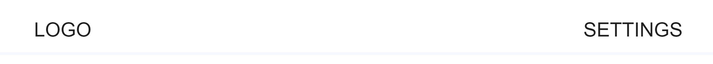
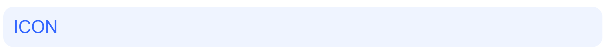
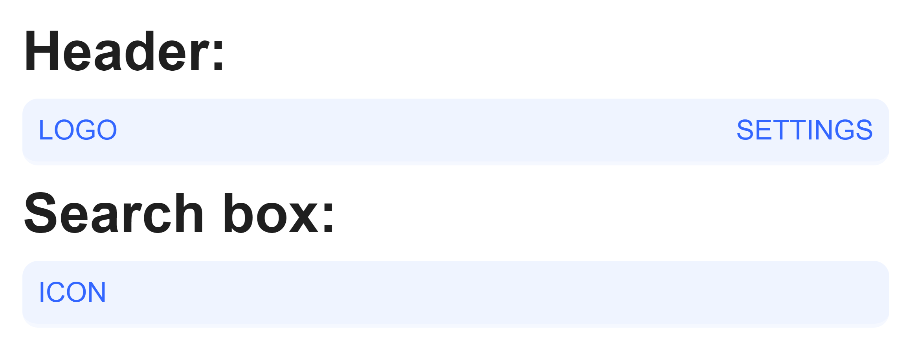
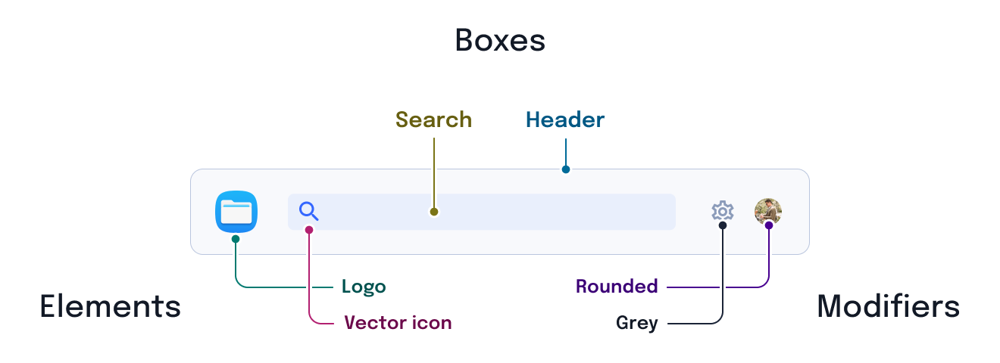
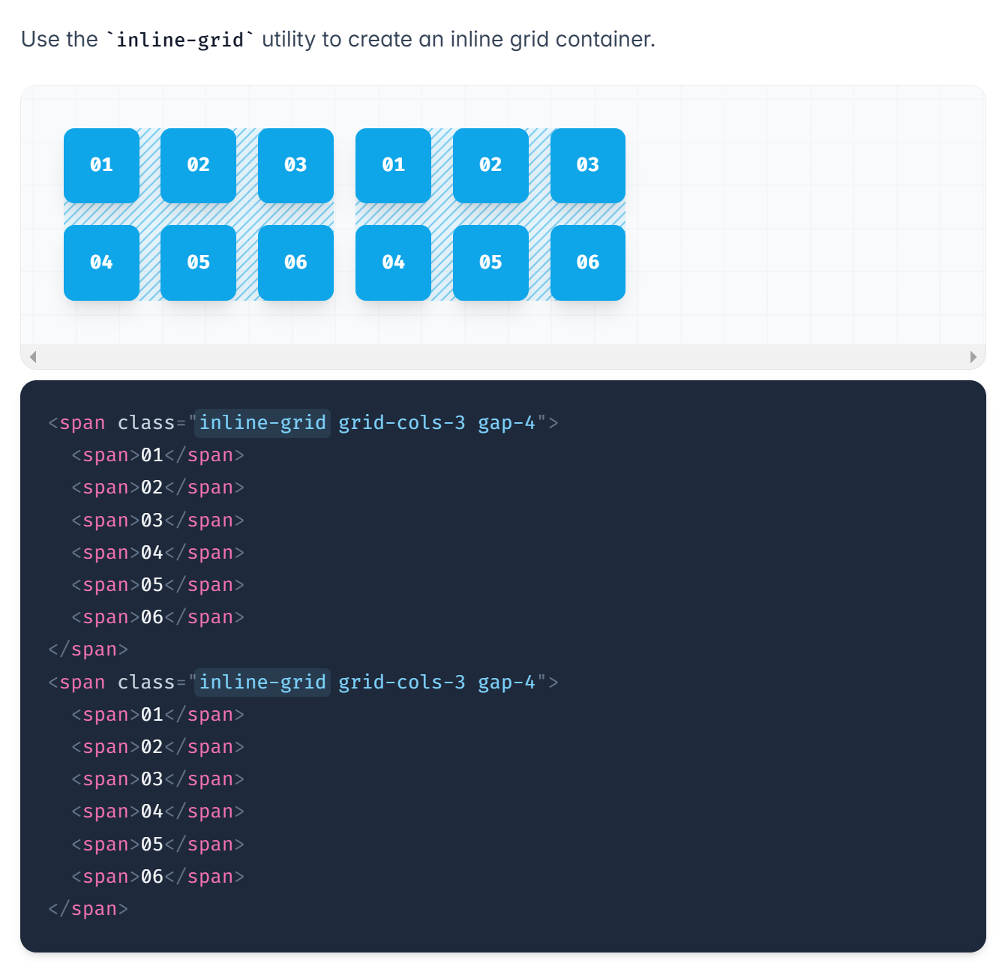
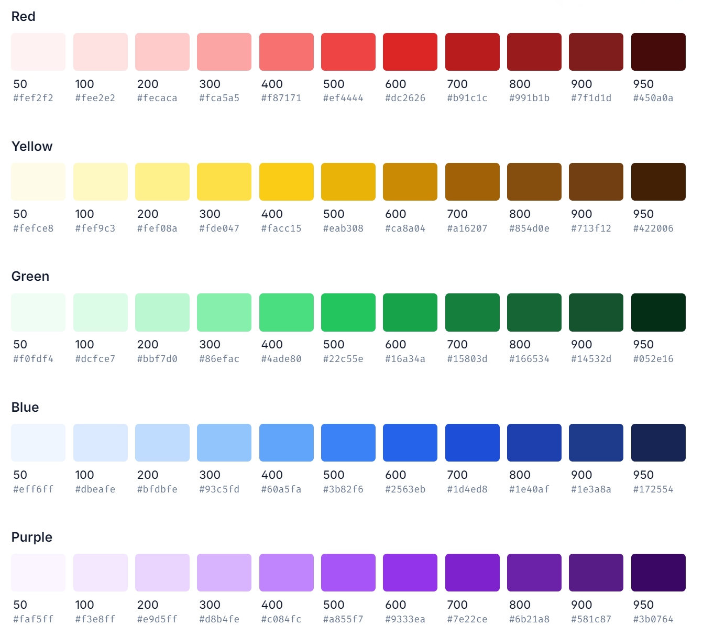
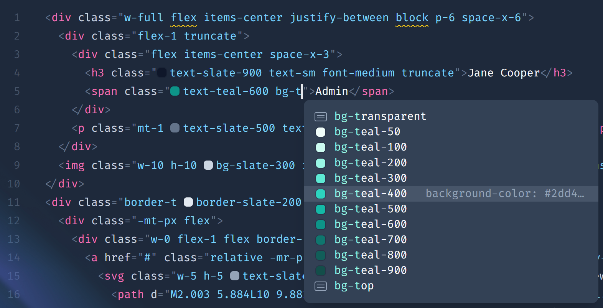
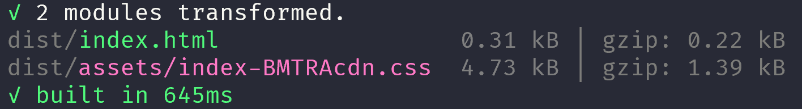

---
{
    title: "Styling",
    description: "",
    published: '2025-01-01T22:12:03.284Z',
    tags: ["react", "angular", "vue", "webdev"],
    order: 3
}
---

<details>
<summary>What tools are we learning in this chapter?</summary>
Styling is a highly contested space in web development. Surely, no matter what tools I select there will always be someone with a different perspective on which tools I should have written about.

Just to name a few, here's some of the styling tools we're not talking about in this chapter:

- [Styled Components](https://styled-components.com/)
- [StyleX](https://stylexjs.com/)
- [UnoCSS](https://unocss.dev/)
- [Vanilla Extract](vanilla-extract.style/)
- [Less](https://lesscss.org/)

Given the broad range and number of tools we aren't looking at, what tools _are_ we going to be learning about? Well, in addition to a few built-in browser techniques, we'll touch on:

- [Tailwind](https://tailwindcss.com/) for its ubiquitous adoption among utility class libraries (nearly 10M downloads a week on NPM) 
- [CSS Modules](https://github.com/css-modules/css-modules) for its close-to-bare CSS and invisible usage
- [SCSS](https://sass-lang.com/) for its broad adoption (13M downloads a week on NPM) and ability to compile complex styling to raw CSS
- [Emotion](https://emotion.sh/) for its framework agnostic approach to runtime CSS-in-JS
- [Panda CSS](https://panda-css.com/) for its framework agnostic approach to compiled away CSS-in-JS

Let's get into it.

</details>

CSS is awesome. It's also used in every web app out there; which makes sense given that it's one of the three core languages of the web: HTML, CSS, and JavaScript.

If we wanted to, for example, build the header bar of this mockup:


Our markup might look something like this:

```jsx
<header class="container">
	<LogoIcon/>
	<SearchBar/>
	<SettingsCog/>
	<ProfilePicture/>
</header>
```

With the `container` class being defined in CSS like so:

``` css
/* header.css */
.container {
    display: flex;
    padding: 8px 24px;
    align-items: center;
    gap: 32px;
    border-bottom: 2px solid #F5F8FF;
    background: #FFF;
}
```

This works out pretty well for some basic styling!



Now let's build out the search box:

```html
<div class="container">
	<SearchIcon/>
</div>
```

```css
/* search-box.css */
.container {
	border-radius: 8px;
    color: #3366FF;
    background: rgba(102, 148, 255, 0.1);
    padding: 8px;
    flex-grow: 1;
}
```



Now let's import both of these CSS files into the same HTML file:

```html
<link rel="stylesheet" href="header.css">
<link rel="stylesheet" href="search-box.css">
```

Annnnd:



Oh dear... It seems like the styling for the header has impacted the search box and vice-versa.

-----

This merging of styling is occurring because `container` is the same CSS identifier between the search box container and the header container; despite being in two different CSS files.

This problem is known as "scoping", and is a problem that gets worse the larger your codebase gets; it's hard to keep track of every preexisting class name that's been used.

# BEM Classes

One way to solve this problem of scoping in CSS relies on no external tooling than a self-motivated convention. This solution is called "BEM Classes".

BEM stands for "Box Element Modifier" and helps you establish scoping through uniquely named classes that are "namespaced" based on where on the screen they exist.



The example we demonstrated scoping problems within has two "boxes":

1) The header
2) The search box

As such, the container for these elements might be called:

```css
.header {}

.search-box {}
```

-----

The "Elements" part of BEM is then referring to the elements within each "Box".

For example, both the header and the search box have icons inside. We would then prefix the "Box" name and then the name of the "Element":

```css
.header__icon {}

.search-box__icon {}
```

------

Finally, we have "Modifiers" to complete the "BEM" acronym.

For example, we might want to have two different colors of icons we support; sharing the rest of the styling across all header icons besides the color.

To do this, we'll prefix the name of the "Box" followed by what the "Modifier" does:

```css
.header--blue {}

.search-box--grey {}
```

------

BEM is a viable alternative for large-scale codebases if you follow its conventions well enough. Many people swear by its utility and ability to leverage the platform itself to solve the scoping problem.

However, for some, even the need to remember what "Box" names have already been used can lead to confusion and other levels of scoping problems.

Let's look at some other alternatives to using the BEM methodology.

# Utility Classes

Another way you're able to solve the problem of scoping through convention is by leaning into the shared aspects of CSS classes as styling identifiers.

This means that instead of something like this:

```html
<div class="search-container"></div>

<style>
.search-container {
	border-radius: 8px;
    color: #3366FF;
    background: rgba(102, 148, 255, 0.1);
    padding: 8px;
    flex-grow: 1;
}
</style>
```

We could instead break these CSS rules into modular reusable classes:

```html
<div class="rounded-md padding-md grow blue-on-blue"></div>

<style>
.rounded-md {
	border-radius: 8px;
}

.padding-md {
	padding: 8px;
}

.grow {
    flex-grow: 1;
}

.blue-on-blue {
    color: #3366FF;
    background: rgba(102, 148, 255, 0.1);
}
</style>
```

This means that instead of having one-off classes that are utilized on a case by case basis, we have global classes that are reused across the entire application.

This comes with a few added benefits:

- Only one CSS file to worry about
- Less duplicated CSS shipped
- Easier to visualize styling from markup

But also has its own downfalls:

- You have to figure out naming for every class; consistency can be challenging
- Your markup ends up cluttered with complex styles represented by many classes

## Tailwind

When the topic of utility classes comes up, Tailwind is not far behind.

Tailwind is a CSS framework that ships with all of the utility classes you could ever need. Just like rolling your own utility classes, Tailwind's are able to be applied to any element and reused globally.

Our example from before might look something like this:

```html
<div class="rounded-lg p-8 grow bg-blue-50 text-blue-800"></div>
```


While Tailwind doesn't solve the cluttered markup challenges with hand-rolling your own utility classes, it comes with some additional benefits over utility classes:

- Ease of training. If someone's used Tailwind before, they know how to use it and what class names to use. Moreover, the Tailwind docs are very very polished.

  

- Pre-built styling tokens. No need to figure out what `padding-lg` or `padding-xl` should be; Tailwind ships with a strong color pallet and sane defaults out-of-the-box for you to use as your design system base.

  

- IDE support. From color previews to class name auto-completion, Tailwind has many integrations with most IDEs you'd want to use. 

  

### Install Tailwind

To install Tailwind, start by using your package manager to install the required packages:

```shell
npm install -D tailwindcss postcss autoprefixer
```

Then, create a `tailwind.config.js` file:

```javascript
// tailwind.config.js
/** @type {import('tailwindcss').Config} */
module.exports = {
    content: [
    "./index.html",
    "./src/**/*.{js,ts,jsx,tsx,html,vue}",
  ],
  theme: {
    extend: {},
  },
  plugins: [],
}
```

Next, create a CSS file:

```css
// src/styles.css
@tailwind base;
@tailwind components;
@tailwind utilities;
```

Finally, you'll configure Tailwind to integrate with your bundler:

<!-- ::start:tabs -->

#### React

To enable Tailwind in your React Vite project, you'll use Vite's built-in support for [PostCSS](https://postcss.org/https://postcss.org/). PostCSS is a CSS transformer that powers Tailwind's compilation of your CSS. (more on this later)

Let's start by configuring the PostCSS configuration:

```javascript
// postcss.config.js
export default {
  plugins: {
    tailwindcss: {},
    autoprefixer: {},
  },
}
```

Finally we'll import our `src/styles.css` file into Vite's entry point of `index.html`:

```html {7}
<!doctype html>
<html lang="en">
  <head>
    <meta charset="UTF-8" />
    <meta name="viewport" content="width=device-width, initial-scale=1.0" />
    <title>Vite + React</title>
    <link rel="stylesheet" href="/src/style.css" />
  </head>
  <body>
    <div id="root"></div>
    <script type="module" src="/src/main.jsx"></script>
  </body>
</html>
```

#### Angular

Since the Angular CLI supports Tailwind out-of-the-box, we don't need to do any additional configuration steps.

So long as your `angular.json` file references the `src/style.css` file we added earlier, you should be off to the races!

#### Vue

Just like React, we'll use [PostCSS](https://postcss.org/https://postcss.org/), the CSS transformer that powers Tailwind's compilation of your CSS, to add Tailwind to our Vue app.

Add the PostCSS configuration:

```javascript
// postcss.config.js
export default {
  plugins: {
    tailwindcss: {},
    autoprefixer: {},
  },
}
```

And import our `src/styles.css` file into Vite's `index.html`:

```html {7}
<!doctype html>
<html lang="en">
  <head>
    <meta charset="UTF-8" />
    <meta name="viewport" content="width=device-width, initial-scale=1.0" />
    <title>Vite + Vue</title>
    <link rel="stylesheet" href="/src/style.css" />
  </head>
  <body>
    <div id="root"></div>
    <script type="module" src="/src/main.js"></script>
  </body>
</html>
```

<!-- ::end:tabs -->

To make sure that Tailwind is properly configured, we can add it to our root component:

<!-- ::start:tabs -->

#### React

```jsx
const App = () => {
	return (
      <a
        className="bg-indigo-600 text-white py-2 px-4 rounded-md"
        href="https://discord.gg/FMcvc6T"
      >
        Join our Discord
      </a>
	)
}
```

// TODO: Add iframe

#### Angular

```angular-ts
@Component({
  selector: "app-root",
  standalone: true,
  template: `
      <a
        class="bg-indigo-600 text-white py-2 px-4 rounded-md"
        href="https://discord.gg/FMcvc6T"
      >
        Join our Discord
      </a>
  `,
})
export class App {}
```

// TODO: Add iframe

#### Vue

```vue
<template>
  <a
    className="bg-indigo-600 text-white py-2 px-4 rounded-md"
    href="https://discord.gg/FMcvc6T"
  >
    Join our Discord
  </a>
</template>
```

// TODO: Add iframe

<!-- ::end:tabs -->

Once you preview the component, it should look like this:


### Tailwind Compilation

You might wonder:

> With **so many** utility classes in Tailwind, if I use it the download size of my CSS must be huge!

Not so! See, when Tailwind generates the CSS for your application, it only adds in the classes you actually use within your templates.

This is why we had to add a list of files (via regex) to our `tailwind.config.js` file earlier: It's watching to see what classes to add to your CSS or not.

This means that if you don't have any Tailwind classes in your code, only the prerequisite CSS generated will be included:

 

> You're even able to shrink this prerequisite CSS down if you'd like. We can customize our `src/style.css` file to only include the prerequisites we need for our project. 
>
> To demonstrate this, you can remove all of the `@tailwind` imports and you'll end up with `0kb` of CSS when you aren't using any Tailwind classes.

### Dynamic Classes using Tailwind

Because of Tailwind's "compile based on your code" strategy, it's able to have a distinct superpower over rolling your own utility classes: [Generating arbitrary CSS from class names.](https://tailwindcss.com/docs/adding-custom-styles#arbitrary-properties)

Say you want to blur an image:

 ```html
 
 ```


Or maybe you want to have border width of a specific pixel value:

```html

```


You're able to truly make Tailwind your own.

// TODO: Add iframe to play with

# Scoped CSS

But not everyone wants to use utility classes for their solutions. For many, they just want to reuse their existing CSS knowledge with selectors and all just with the scoping problem solved for them.

Well, what if each CSS file had their own auto-scoping pre-applied?

```css
/* file-one.css */
.container {}

/* When used, is transformed to */
.FILE_ONE_6591_container {}

/* To preserve uniqueness against other CSS files */
```

Luckily for us, each framework has a solution to this problem.

<!-- ::start:tabs -->

## React

To automatically scope our CSS in our React application we'll rely on Vite's built-in support for [CSS Modules](https://github.com/css-modules/css-modules). 

To do this, we just need to add `.module.css` to the name of any CSS file:

```css
/* app.module.css */
.title {
  font-weight: bold;
  text-decoration: underline;
  font-size: 2rem;
}
```

Then we'll import the CSS in our JSX file and use the name of the class as a property on the imported object: 

```jsx
// App.jsx
import style from './app.module.css';

export function App() {
  return <h1 class={style.title}>The Framework Field Guide</h1>;
}
```

This will then generate the following markup and styling for us:

```html
<h1 class="_title_q98e2_3">The Framework Field Guide</h1>

<style>
._title_q98e2_3 {
    font-weight: bold;
    text-decoration: underline;
    font-size: 2rem;
}
</style>
```

This transformation of the class name will ensure that each CSS file has its own scope that's different from another.

// TODO: Add iframe

## Angular

In Angular, we're able to use styles relative to the component by using either the `styleUrl` or `style` property in the `@Component` decorator:

```angular-ts
@Component({
  selector: 'app-root',
  standalone: true,
  styles: [
    `
    .title {
      font-weight: bold;
      text-decoration: underline;
      font-size: 2rem;
    }
 `,
  ],
  template: `
    <h1 class="title">The Framework Field Guide</h1>
  `,
})
export class App {}
```

Will generate the following CSS and Markup:

```html
<app-root _nghost-ng-c118366096="">
    <h1 _ngcontent-ng-c118366096="" class="title">The Framework Field Guide</h1></app-root>

<style>
.title[_ngcontent-ng-c118366096] {
    font-weight: bold;
    text-decoration: underline;
    font-size: 2rem;
}
</style>
```

This means that if we have two different components, each with their own `.title` CSS class; each will be isolated in their styling relative to their parent component.

// TODO: Add iframe

### Local and Global Styling

Say you have a root `App` component that you want to disable the CSS scoping; This would enable the styles of `App` to act as global styles for your app.

 Angular supports doing this by changing the `encapsulation` property in the `@Component` decorator:

```angular-ts {15}
import { Component, ViewEncapsulation } from '@angular/core';

@Component({
  selector: 'app-root',
  standalone: true,
  styles: [
    `
    .title {
      font-weight: bold;
      text-decoration: underline;
      font-size: 2rem;
    }
 `,
  ],
  encapsulation: ViewEncapsulation.None,
  template: `
    <h1 class="title">The Framework Field Guide</h1>
  `,
})
export class App {}
```

> It's worth mentioning that `encapsulation` will affect _all_ of a component's `styles` and `styleUrls`. There's no way to customize the encapsulation for each of them individually.

// TODO: Add iframe

## Vue

Like Angular, Vue's SFC component format has scoped CSS as a feature built-in. There's two ways to do so in Vue:

1) Using the `scoped` attribute - which uses PostCSS to add a prefix to the styled elements automatically
2) Using the `module` attribute - which compiles down to [CSS Modules](https://github.com/css-modules/css-modules)

### `scoped` Attribute

To scope your CSS in a Vue SFC, you can add the `scoped` attribute to your `<style>` tag:

```vue
<template>
  <h1 class="title">The Framework Field Guide</h1>
</template>

<style scoped>
.title {
  font-weight: bold;
  text-decoration: underline;
  font-size: 2rem;
}
</style>
```

This will output the following markup and styling:

```html
<h1 data-v-7a7a37b1="" class="title">The Framework Field Guide</h1>

<style>
.title[data-v-7a7a37b1] {
    font-weight: bold;
    text-decoration: underline;
    font-size: 2rem;
}
</style>
```

// TODO: Add iframe

#### Local and Global Styling

When using the `scoped` attribute, you can mix and match which styles are global and which are scoped.

You can either do this on a per-CSS-selector basis:

```vue
<!-- ... -->

<style scoped>
.red {
}

:global(.blue) {
}
</style>
```

Or have two `<style>` tags; one scoped and one global:

```vue
<!-- ... -->

<style scoped>
.red {
}
</style>

<style>
.blue {
}
</style>
```

// TODO: Add iframe

### CSS Modules

CSS modules is an alternative way to structure your CSS in a scoped way. It transforms the class selectors using JS names for classes instead of a raw string.

To do this in Vue SFC components, we'll use `<style module>` and the `useCssModule` composible:

```vue
<script setup>
import { useCssModule } from 'vue';

const style = useCssModule();
</script>

<template>
  <h1 :class="style.title">The Framework Field Guide</h1>
</template>

<style module>
.title {
    font-weight: bold;
    text-decoration: underline;
    font-size: 2rem;
}
</style>
```

This will transform the class name itself, rather than adding any attributes to the impacted elements:

```html
<h1 class="_title_1nd3v_2">The Framework Field Guide</h1>

<style>
._title_1nd3v_2 {
    font-weight: bold;
    text-decoration: underline;
    font-size: 2rem;
}
</style>
```

// TODO: Add iframe

<!-- ::end:tabs -->

<!-- Editor's note: Should we talk about `::ng-deep` (Angular) and `:deep` (Vue)? -->

# Sass

Modern CSS is amazing.

// Talk about CSS variables

However, just like JavaScript, you can accidentally ship a variable that's not defined.

```css
.title {
	/* Notice the typo of `heder` instead of `header` */
    /* Because of this typo, no `color` will be defined for this class */
	color: var(--heder_color);
}
```

This lack of variable definition will not throw an error either at build time or runtime, making it exceedingly hard to catch or debug in many instances.

[As we learned in our last chapter](/posts/ffg-ecosystem-linters-formatters-type-checkers), one common solution to this type of problem in JavaScript is to introduce TypeScript which can check for many of these mistakes at build time. TypeScript then compiles down to JavaScript which can run in your bowser.

Similarly, CSS has a slew of subset languages which compile down to CSS. One such language is "[Syntactically Awesome Style Sheets](https://sass-lang.com/)", or "Sass" for short.

> Sass has two options for syntax;
>
> 1) Sass, which deviates a fair bit from the standard CSS syntax:
>
>    ```sass
>    .title
>      font-weight: bold
>      text-decoration: underline
>      font-size: 2rem
>    ```
>
> 2) SCSS, which extends CSS' syntax and, by default, looks very familiar:
>
>    ```scss
>    .title {
>      font-weight: bold;
>      text-decoration: underline;
>      font-size: 2rem;
>    }
>    ```
>
> Because of the similarity to existing CSS, many choose SCSS over the Sass syntax; we'll follow suit and do the same.

Sass adds a slew of features to CSS:

- Compile-time variables
- Loops and conditional statements
- Functions
- Mixins

And so much more.

## Install Sass

To install Sass you'll use your package manager:

```shell
npm install -D sass
```

Once it's installed, you can use it with your respective framework:

<!-- ::start:tabs -->

### React

When using Vite, we can use Sass alongside CSS modules by naming our files in a way that ends with `.module.scss` and using the names of the imported classes like before:

```scss
/* app.module.scss */

/* This is the syntax for a SCSS variable. More on that soon */
$red: #FF0000;

.title {
    color: $red;
}
```

````jsx
import style from "./app.module.scss"

export function App() {
	return <h1 class={style.title}>Hello, I am red</h1>
}
````

// TODO: Add iframe

### Angular

With the package installed, we can use `styleUrl` to link to a dedicated `.scss` file, like so:

```scss
/* app.component.scss */

/* This is the syntax for a SCSS variable. More on that soon */
$red: #ff0000;

.title {
  color: $red;
}
```

```angular-ts
@Component({
  selector: 'app-root',
  standalone: true,
  styleUrl: './app.component.scss',
  template: `
  <h1 class="title">Hello, I am red</h1>
  `,
})
export class App {}
```

// TODO: Add iframe

## Inline SCSS Support

This doesn't work out of the box, however, with inline styles. For example, if you try to add SCSS code into the  `styles` property in your `@Component` decorator:

```angular-ts
@Component({
  selector: 'app-root',
  standalone: true,
  styles: [
    `
  /* app.component.scss */

/* This is the syntax for a SCSS variable. More on that soon */
$red: #ff0000;

.title {
  color: $red;
}
`,
  ],
  template: `
  <h1 class="title">Hello, I am red</h1>
  `,
})
export class App {}
```

You'll be greeted with this error:

```
▲ [WARNING] Unexpected "$" [plugin angular-compiler] [css-syntax-error]

    angular:styles/component:css;fd332d6991449d8e664dbb64acc576d5770fd57a43365fb9fe74755ecaad47ba;/home/projects/stackblitz-starters-upht8y/src/main.ts:5:0:
      5 │ $red: #ff0000;
        ╵ ^
```

To solve this, we'll need to modify our `angular.json` file.

``` json
{
  "$schema": "./node_modules/@angular/cli/lib/config/schema.json",
  "version": 1,
  "newProjectRoot": "projects",
  "projects": {
    "your-app": {
      "projectType": "application",
      "schematics": {
        "@schematics/angular:component": {
          "style": "scss"
        }
      },
      "//": "...",
      "architect": {
        "build": {
          "builder": "@angular-devkit/build-angular:application",
          "options": {
            "//": "...",
            "inlineStyleLanguage": "scss"
          },
          "//": "..."
         },
        "//": "..."
      }
    }
  }
}
```

> This file can historically be very long, so we've omitted most of it. Just make sure that these keys are set.

Once this is done, our inline styles will be treated as if they were inside of a `.scss` file.

// TODO: Add iframe

### Vue

SCSS works seamlessly with SFC components. To enable this integration, we'll add `lang="scss"` to our `<style>` tag:

``` vue
<template>
  <h1 class="title">Hello, I am red</h1>
</template>

<style lang="scss">
/* This is the syntax for a SCSS variable. More on that soon */
$red: #ff0000;

.title {
  color: $red;
}
</style>
```

// TODO: Add iframe

This works with the `scoped` and `module` attributes as well:

```vue
<template>
  <h1 class="title">Hello, I am red</h1>
</template>

<style scoped lang="scss">
/* This is the syntax for a SCSS variable. More on that soon */
$red: #ff0000;

.title {
  color: $red;
}
</style>
```

```vue
<script setup>
import { useCssModule } from 'vue';
const style = useCssModule();
</script>

<template>
  <h1 :class="style.title">Hello, I am red</h1>
</template>

<style module lang="scss">
/* This is the syntax for a SCSS variable. More on that soon */
$red: #ff0000;

.title {
  color: $red;
}
</style>
```

<!-- ::end:tabs -->


## Compile-time variables

Let's look at that typo example from before, but this time use SCSS variables rather than CSS variables:

```scss
$header_color: #2A3751;

.title {
  color: $heder_color;
}
```

While before the only indication of a typo was the styling not applying, now we have a proper error exposed to us when we try to build the app:

``` 
Undefined variable.
  ╷
4 │   color: $heder_color;
  │          ^^^^^^^^^^^^
  ╵
  - 4:10  root stylesheet
```

## Loops and conditional statements


## Functions


## Mixins


// Talk about how adding in a compilation step into your stylesheets enables everything from CSS modules but also adds new features (tokens, etc)

// Talk about the downsides of using a new language for tokens and such

# CSS-in-JS 

// Talk about the benefits regarding typechecking, tokens, and more

// Then talk about the downsides of not working properly in SSR, SSG, or other static contexts

// Also downsides of the performance aspect

React: https://emotion.sh/docs/introduction

Also with React, talk about the `styled` API

Angular: https://stackblitz.com/edit/angular-ivy-v7vjkp?file=src%2Fapp%2Fapp.component.ts,src%2Fapp%2Fapp.component.html

Vue: https://stackblitz.com/edit/vue-ai8qpp?file=src%2FApp.vue

# Compiled CSS-in-JS

// Talk about how ASTs are able to explore your codebase pre-emtively and codegen CSS for you in a static way

React: https://panda-css.com/docs/installation/vite
Angular: https://panda-css.com/docs/installation/cli (Angular)
Vue: https://panda-css.com/docs/installation/vue