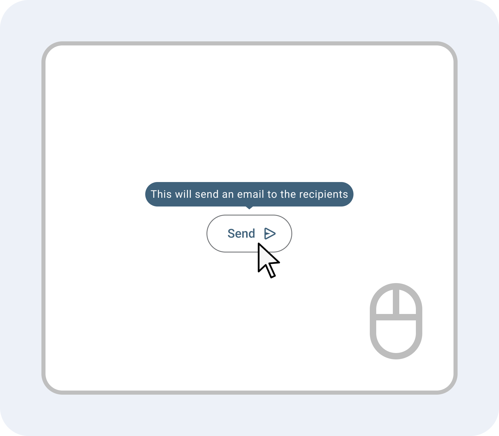

---
{
  title: "Directives",
  description: "If components are a way to share JS logic between multiple, composable DOM nodes; directives are a way to assign logic to any single DOM node.",
  published: "2024-03-11T12:14:00.000Z",
  authors: ["crutchcorn"],
  tags: ["react", "angular", "vue", "webdev"],
  attached: [],
  order: 14,
  collection: "framework-field-guide-fundamentals-v1-1",
  noindex: true,
  version: "v1.1",
  upToDateSlug: "ffg-fundamentals-directives",
}
---

In our last chapter, we talked about how you can create custom logic that is not associated with any particular component but can be used by said components to extend its logic.

This is helpful for sharing logic between components, but isn't the whole story of code reuse within React, Angular, and Vue.

For example, we may want logic associated with a given DOM node without having to create an entire component specifically for that purpose. This exact problem is what a **Directive** aims to solve.

# What Is a Directive {#what-is-a-directive}

Our ["Introduction to Components" chapter](/posts/ffg-fundamentals-v1-1-intro-to-components) mentioned how a component is a collection of structures, styling, and logic that's associated with one or more HTML nodes.

Conversely, a directive is a collection of JavaScript logic that you can apply to a single DOM element.

While this comparison between a directive and a component seems stark, think about it: Components have a collection of JavaScript logic that's applied to a single "virtual" element.

As a result, some frameworks, like Angular, take this comparison literally and use directives under the hood to create components.

Here's what a basic directive looks like in each of the three frameworks:

<!-- ::start:tabs -->

## React

React as a framework doesn't _quite_ have the concept of directives built in.

Luckily, this doesn't mean that we, as React developers, need to be left behind. Because a React component is effectively just a JavaScript function, we can use the base concept of a directive to create shared logic for DOM nodes.

Remember from our ["Element Reference" chapter that you can use a function associated with an element's `ref` property](/posts/ffg-fundamentals-v1-1-element-reference). We'll use this concept alongside the idea of a [custom hook](/posts/ffg-fundamentals-v1-1-shared-component-logic#custom-hooks-rules) to create an API to add logic to an HTML element:

```jsx
const useLogElement = () => {
	const ref = (el) => console.log(el);
	return { ref };
};

const App = () => {
	const { ref } = useLogElement();
	return <p ref={ref}>Hello, world</p>;
};
```

<!-- ::start:no-ebook -->
<iframe data-frame-title="React What is a Directive? - StackBlitz" src="pfp-code:./ffg-fundamentals-react-what-is-a-directive-104?template=node&embed=1&file=src%2Fmain.jsx"></iframe>
<!-- ::end:no-ebook -->

> We'll continue to cover alternative APIs in React that can do much of the same as directives in other frameworks. In the meantime, it might be beneficial to broaden your horizons and take a glance at what a "true" directive looks like in other frameworks.

## Angular

You set up a directive in Angular very similarly to how you might construct a component: using the `@Directive` decorator.

```angular-ts
import { Component, ElementRef, Directive } from "@angular/core";

@Directive({
	selector: "[sayHi]",
	standalone: true,
})
class LogElementDirective {
	constructor() {
		console.log("Hello, world!");
	}
}

@Component({
	selector: "app-root",
	standalone: true,
	imports: [LogElementDirective],
	template: ` <p sayHi>Hello, world</p> `,
})
class AppComponent {}
```

<!-- ::start:no-ebook -->
<iframe data-frame-title="Angular What is a Directive? - StackBlitz" src="pfp-code:./ffg-fundamentals-angular-what-is-a-directive-104?template=node&embed=1&file=src%2Fmain.ts"></iframe>
<!-- ::end:no-ebook -->

Here, we've told Angular to listen for any `sayHi` attributes ([using a CSS selector](https://developer.mozilla.org/en-US/docs/Web/CSS/Attribute_selectors)) and run a `console.log` any time an element with said attribute is rendered.

This isn't particularly useful, but demonstrates the most minimal version of what a directive looks like.

### Accessing a Directive's Underlying Element {#angular-underlying-element}

It's frequently more helpful to get a reference to the element that the attribute is present on. To do this, we'll use Angular's [dependency injection](/posts/ffg-fundamentals-v1-1-dependency-injection) to ask Angular for an `ElementRef` that's present within the framework's internals when you create a directive instance.

```angular-ts
@Directive({
	selector: "[logElement]",
	standalone: true,
})
class LogElementDirective {
	// el.nativeElement is a reference to the HTMLParagraphElement
	el = inject(ElementRef<any>);
}
```

But oh no! Our directive no longer uses the `constructor` function, which means that our `console.log` no longer runs. This is because you can no longer use a constructor function when using the inject keyword.

To fix this, we can extract our `inject` into a function that we can call from within our directive's class body:

```angular-ts
function findAndLogTheElement() {
	const el = inject(ElementRef<any>);
	// HTMLParagraphElement
	console.log(el.nativeElement);
	return el;
}

@Directive({
	selector: "[sayHi]",
	standalone: true,
})
class LogElementDirective {
	el = findAndLogTheElement();
}
```

<!-- ::start:no-ebook -->
<iframe data-frame-title="React Directive El Reference - StackBlitz" src="pfp-code:./ffg-fundamentals-angular-directive-el-reference-104?template=node&embed=1&file=src%2Fmain.ts"></iframe>
<!-- ::end:no-ebook -->

## Vue

Setting up a directive in Vue sees you create an object within our `setup` `script`.

Inside this object, we'll add a key for `created` and assign it a function to let Vue know to run said function when the directive is instantiated.

```vue
<!-- App.vue -->
<script setup>
const vSayHi = {
	created: () => console.log("Hello, world!"),
};
</script>

<template>
	<p v-say-hi>Hello, world</p>
</template>
```

<!-- ::start:no-ebook -->
<iframe data-frame-title="Vue What is a Directive? - StackBlitz" src="pfp-code:./ffg-fundamentals-vue-what-is-a-directive-104?template=node&embed=1&file=src%2FApp.vue"></iframe>
<!-- ::end:no-ebook -->

Directives in Vue must start with `v-` prefix (which is why our object starts with `v`) and are `dash-cased` when presented inside a `template`. This means that our `vSayHi` object directive is turned into `v-say-hi` when used in the template.

### Accessing a Directive's Underlying Element {#vue-underlying-element}

Instead of running a simple `console.log` on a string, let's use the first argument passed to our directive's `created` function
to access the underlying HTML element:

```vue
<!-- App.vue -->
<script setup>
const vSayHi = {
	created: (el) => console.log(el),
};
</script>

<template>
	<p v-say-hi>Hello, world</p>
</template>
```

<!-- ::start:no-ebook -->
<iframe data-frame-title="Vue Directive El Reference - StackBlitz" src="pfp-code:./ffg-fundamentals-vue-directive-el-reference-104?template=node&embed=1&file=src%2FApp.vue"></iframe>
<!-- ::end:no-ebook -->

<!-- ::end:tabs -->

Once our apps load up, you should see a `console.log` execute that prints out the [HTMLParagraphElement](https://developer.mozilla.org/en-US/docs/Web/API/HTMLParagraphElement) reference.

You'll notice that these directives' logics are applied to elements through some means of an attribute-like selector, similar to how a component has a named tag associated with it.

Now that we've seen what a directive looks like, let's apply it to some real-world examples.

# Basic Directives {#basic-directives}

Now that we have a reference to the underlying DOM node, we can use that to do various things with the element.

For example, let's say that we wanted to change the color of a button using nothing more than an HTML attribute — we can do that now using [the HTMLElement's `style` property](https://developer.mozilla.org/en-US/docs/Web/API/HTMLElement/style):

<!-- ::start:tabs -->

## React

```jsx
const useStyleBackground = () => {
	const ref = (el) => {
		el.style.background = "red";
	};
	return { ref };
};

const App = () => {
	const { ref } = useStyleBackground();
	return <button ref={ref}>Hello, world</button>;
};
```

<!-- ::start:no-ebook -->
<iframe data-frame-title="React Basic Directives - StackBlitz" src="pfp-code:./ffg-fundamentals-react-basic-directives-105?template=node&embed=1&file=src%2Fmain.jsx"></iframe>
<!-- ::end:no-ebook -->

## Angular

```angular-ts
function injectElAndStyle() {
	const el = inject(ElementRef<any>);
	el.nativeElement.style.background = "red";
	return el;
}

@Directive({
	selector: "[styleBackground]",
	standalone: true,
})
class StyleBackgroundDirective {
	el = injectElAndStyle();
}

@Component({
	selector: "app-root",
	standalone: true,
	imports: [StyleBackgroundDirective],
	template: ` <button styleBackground>Hello, world</button> `,
})
class AppComponent {}
```

<!-- ::start:no-ebook -->
<iframe data-frame-title="Angular Basic Directives - StackBlitz" src="pfp-code:./ffg-fundamentals-angular-basic-directives-105?template=node&embed=1&file=src%2Fmain.ts"></iframe>
<!-- ::end:no-ebook -->

## Vue

When using the `created` method inside a directive, we can gain access to the underlying DOM node the directive is applied to using the function's arguments.

The first argument that's passed to `created` is a DOM node reference that we can change the `style` property of to style our `button`.

```vue
<!-- App.vue -->
<script setup>
const vStyleBackground = {
	created: (el) => {
		el.style.background = "red";
	},
};
</script>

<template>
	<button v-style-background>Hello, world</button>
</template>
```

<!-- ::start:no-ebook -->
<iframe data-frame-title="Vue Basic Directives - StackBlitz" src="pfp-code:./ffg-fundamentals-vue-basic-directives-105?template=node&embed=1&file=src%2FApp.vue"></iframe>
<!-- ::end:no-ebook -->

<!-- ::end:tabs -->

> While this is a good demonstration of how you can use an element reference within a directive, styling an element is generally suggested to be done within a CSS file itself, unless you have good reason otherwise.
>
> This is because styling an element through JavaScript can cause issues with [server-side rendering](/posts/what-is-ssr-and-ssg#ssr), and can also cause [layout thrashing](https://developers.google.com/web/fundamentals/performance/rendering/avoid-large-complex-layouts-and-layout-thrashing) if done incorrectly.

# Side Effect Handlers in Directives {#side-effect-handlers}

[Previously, in the book, we've explored adding a `focus` event when an element is rendered](/posts/ffg-fundamentals-v1-1-component-reference#using-comp-ref). However, in this chapter, we explicitly had to call a `focus` method. What if we could have our `button` focus itself immediately when it's rendered onto the page?

Luckily, with directives, we can!

<!-- ::in-content-ad title="Consider supporting" body="Donating any amount will help towards further development of the Framework Field Guide." button-text="Sponsor my work" button-href="https://github.com/sponsors/crutchcorn/" -->

See, while a component has a series of side effects associated with it: being rendered, updated, cleaned up, and beyond — so too does an HTML element that's bound to a directive!

Because of this, we can hook into the ability to use [side effects](/posts/ffg-fundamentals-v1-1-side-effects) within directives so that it focuses when an element is rendered.

<!-- ::start:tabs -->

## React

As we already know, we can use built-in React hooks in our custom hooks, which means that we can use `useEffect` just like we could inside any other component.

```jsx
const useFocusElement = () => {
	const [el, setEl] = useState();

	useEffect(() => {
		if (!el) return;
		el.focus();
	}, [el]);

	const ref = (localEl) => {
		setEl(localEl);
	};
	return { ref };
};

const App = () => {
	const { ref } = useFocusElement();
	return <button ref={ref}>Hello, world</button>;
};
```

<!-- ::start:no-ebook -->
<iframe data-frame-title="React Directive Side Effects - StackBlitz" src="pfp-code:./ffg-fundamentals-react-directive-side-effects-106?template=node&embed=1&file=src%2Fmain.jsx"></iframe>
<!-- ::end:no-ebook -->

> Truthfully, this is a bad example for `useEffect`. Instead, I would simply run `localEl.focus()` inside of the `ref` function.

## Angular

Angular uses the same `implements` implementation for classes to use lifecycle methods in directives as it does components.

```angular-ts
@Directive({
	selector: "[focusElement]",
	standalone: true,
})
class StyleBackgroundDirective implements OnInit {
	el = inject(ElementRef<any>);

	ngOnInit() {
		this.el.nativeElement.focus();
	}
}

@Component({
	selector: "app-root",
	standalone: true,
	imports: [StyleBackgroundDirective],
	template: ` <button focusElement>Hello, world</button> `,
})
class AppComponent {}
```

<!-- ::start:no-ebook -->
<iframe data-frame-title="Angular Directive Side Effects - StackBlitz" src="pfp-code:./ffg-fundamentals-angular-directive-side-effects-106?template=node&embed=1&file=src%2Fmain.ts"></iframe>
<!-- ::end:no-ebook -->

## Vue

Just as you can use the `created` property on a directive object, you can change this property's name to match any of [Vue's component lifecycle method names](https://vuejs.org/guide/essentials/lifecycle.html).

```vue
<!-- App.vue -->
<script setup>
const vFocusElement = {
	mounted: (el) => {
		el.focus();
	},
};
</script>

<template>
	<button v-focus-element>Hello, world</button>
</template>
```

<!-- ::start:no-ebook -->
<iframe data-frame-title="Vue Directive Side Effects - StackBlitz" src="pfp-code:./ffg-fundamentals-vue-directive-side-effects-106?template=node&embed=1&file=src%2FApp.vue"></iframe>
<!-- ::end:no-ebook -->

For example, if we wanted to add a cleanup to this directive, we could change `mounted` to `unmounted` instead.

<!-- ::end:tabs -->

# Passing Data to Directives {#passing-data}

Let's look back at the directive we wrote to add colors to our button. It worked, but that red we were applying to the `button` element was somewhat harsh, wasn't it?

We could just set the color to a nicer shade of red — say, `#FFAEAE` — but then what if we wanted to re-use that code elsewhere to set a different button to blue?

To solve this issue regarding per-instance customization of a directive, let's add the ability to pass in data to a directive.

<!-- ::start:tabs -->

## React

Because a React Hook is a function at heart, we're able to pass values as we would to any other function:

```jsx
const useStyleBackground = (color) => {
	const ref = (el) => {
		el.style.background = color;
	};
	return { ref };
};

const App = () => {
	const { ref } = useStyleBackground("#FFAEAE");
	return <button ref={ref}>Hello, world</button>;
};
```

<!-- ::start:no-ebook -->
<iframe data-frame-title="React Pass Directives Data - StackBlitz" src="pfp-code:./ffg-fundamentals-react-pass-directives-data-107?template=node&embed=1&file=src%2Fmain.jsx"></iframe>
<!-- ::end:no-ebook -->

## Angular

To pass a value to an Angular directive, we can use the `@Input` directive, which is the same as a component.

However, one way that a directive's inputs differ from a component's is that you need to prepend the `selector` value as the `Input` variable name, like so:

<!-- Editor's note: I am intentionally lying that you have to prefix the name. Read on. -->

```angular-ts
@Directive({
	selector: "[styleBackground]",
	standalone: true,
})
class StyleBackgroundDirective implements OnInit {
	@Input() styleBackground!: string;

	el = inject(ElementRef<any>);

	ngOnInit() {
		this.el.nativeElement.style.background = this.styleBackground;
	}
}

@Component({
	selector: "app-root",
	standalone: true,
	imports: [StyleBackgroundDirective],
	template: ` <button styleBackground="#FFAEAE">Hello, world</button> `,
})
class AppComponent {}
```

<!-- ::start:no-ebook -->
<iframe data-frame-title="Angular Pass Directives Data - StackBlitz" src="pfp-code:./ffg-fundamentals-angular-pass-directives-data-107?template=node&embed=1&file=src%2Fmain.ts"></iframe>
<!-- ::end:no-ebook -->

## Vue

Vue's directives are not simply functions — they are objects that contain functions and can access the value bound to the directive using arguments on each property.

While the first argument of each lifecycle's key is an element reference (`el`), the second argument will always be the value assigned to the directive.

```vue
<!-- App.vue -->
<script setup>
const vStyleBackground = {
	mounted: (el, binding) => {
		el.style.background = binding.value;
	},
};
</script>

<template>
	<button v-style-background="'#FFAEAE'">Hello, world</button>
</template>
```

<!-- ::start:no-ebook -->
<iframe data-frame-title="Vue Pass Directives Data - StackBlitz" src="pfp-code:./ffg-fundamentals-vue-pass-directives-data-107?template=node&embed=1&file=src%2FApp.vue"></iframe>
<!-- ::end:no-ebook -->

You access the bindings' value through `binding.value`, but can also access things like the previous value by using `binding.oldValue`.

<!-- ::end:tabs -->

## Passing JavaScript Values {#passing-js-values}

Similar to how you can pass any valid JavaScript object to a component's inputs, you can do the same with a directive.

To demonstrate this, let's create a `Color` class that includes the following properties:

```javascript
class Color {
	constructor(r, g, b) {
		this.r = r;
		this.g = g;
		this.b = b;
	}
}
```

Then, we can render out this color inside our background styling directive:

<!-- ::start:tabs -->

### React

```jsx
class Color {
	constructor(r, g, b) {
		this.r = r;
		this.g = g;
		this.b = b;
	}
}

const colorInstance = new Color(255, 174, 174);

const useStyleBackground = (color) => {
	const ref = (el) => {
		el.style.background = `rgb(${color.r}, ${color.g}, ${color.b})`;
	};
	return { ref };
};

const App = () => {
	const { ref } = useStyleBackground(colorInstance);
	return <button ref={ref}>Hello, world</button>;
};
```

<!-- ::start:no-ebook -->
<iframe data-frame-title="React Directives Pass JS Data - StackBlitz" src="pfp-code:./ffg-fundamentals-react-directives-pass-js-data-108?template=node&embed=1&file=src%2Fmain.jsx"></iframe>
<!-- ::end:no-ebook -->

### Angular

```angular-ts
class Color {
	r: number;
	g: number;
	b: number;

	constructor(r: number, g: number, b: number) {
		this.r = r;
		this.g = g;
		this.b = b;
	}
}

@Directive({
	selector: "[styleBackground]",
	standalone: true,
})
class StyleBackgroundDirective implements OnInit {
	@Input() styleBackground!: Color;

	el = inject(ElementRef<any>);

	ngOnInit() {
		const color = this.styleBackground;
		this.el.nativeElement.style.background = `rgb(${color.r}, ${color.g}, ${color.b})`;
	}
}

@Component({
	selector: "app-root",

	standalone: true,
	imports: [StyleBackgroundDirective],
	template: ` <button [styleBackground]="color">Hello, world</button> `,
})
class AppComponent {
	color = new Color(255, 174, 174);
}
```

<!-- ::start:no-ebook -->
<iframe data-frame-title="Angular Directives Pass JS Data - StackBlitz" src="pfp-code:./ffg-fundamentals-angular-directives-pass-js-data-108?template=node&embed=1&file=src%2Fmain.ts"></iframe>
<!-- ::end:no-ebook -->

### Vue

```vue
<!-- App.vue -->
<script setup>
class Color {
	constructor(r, g, b) {
		this.r = r;
		this.g = g;
		this.b = b;
	}
}

const colorInstance = new Color(255, 174, 174);

const vStyleBackground = {
	mounted: (el, binding) => {
		const color = binding.value;
		el.style.background = `rgb(${color.r}, ${color.g}, ${color.b})`;
	},
};
</script>

<template>
	<button v-style-background="colorInstance">Hello, world</button>
</template>
```

<!-- ::start:no-ebook -->
<iframe data-frame-title="Vue Directives Pass JS Data - StackBlitz" src="pfp-code:./ffg-fundamentals-vue-directives-pass-js-data-108?template=node&embed=1&file=src%2FApp.vue"></iframe>
<!-- ::end:no-ebook -->

<!-- ::end:tabs -->

Now, we can customize the color using incremental updates to the RGB values of a color we're passing.

## Passing Multiple Values {#passing-multiple-values}

While a class instance of `Color` may be useful in production apps, for smaller projects, it might be nicer to manually pass the `r`, `g`, and `b` values directly to a directive without needing a class.

Just as we can pass multiple values to a component, we can do the same within a directive. Let's see how it's done for each of the three frameworks:

<!-- ::start:tabs -->

### React

Once again, the fact that a custom hook is still just a normal function provides us the ability to pass multiple arguments as if they are any other function.

```jsx
const useStyleBackground = (r, g, b) => {
	const ref = (el) => {
		el.style.background = `rgb(${r}, ${g}, ${b})`;
	};
	return { ref };
};

const App = () => {
	const { ref } = useStyleBackground(255, 174, 174);
	return <button ref={ref}>Hello, world</button>;
};
```

<!-- ::start:no-ebook -->
<iframe data-frame-title="React Pass Multiple Values - StackBlitz" src="pfp-code:./ffg-fundamentals-react-pass-multiple-values-109?template=node&embed=1&file=src%2Fmain.jsx"></iframe>
<!-- ::end:no-ebook -->

### Angular

I have to come clean about something: when I said, "A directive's input must be named the same as the attribute's selector," I was lying to keep things simple to explain.

In reality, you can name an input anything you'd like, but then you need to have an empty attribute with the same name as the selector.

```angular-ts
@Directive({
	selector: "[styleBackground]",
	standalone: true,
})
class StyleBackgroundDirective implements OnInit {
	@Input() r!: number;
	@Input() g!: number;
	@Input() b!: number;

	el = inject(ElementRef<any>);

	ngOnInit() {
		this.el.nativeElement.style.background = `rgb(${this.r}, ${this.g}, ${this.b})`;
	}
}

@Component({
	selector: "app-root",
	standalone: true,
	imports: [StyleBackgroundDirective],
	template: `
		<button styleBackground [r]="255" [g]="174" [b]="174">Hello, world</button>
	`,
})
class AppComponent {}
```

<!-- ::start:no-ebook -->
<iframe data-frame-title="Angular Pass Multiple Values - StackBlitz" src="pfp-code:./ffg-fundamentals-angular-pass-multiple-values-109?template=node&embed=1&file=src%2Fmain.ts"></iframe>
<!-- ::end:no-ebook -->

> If you forget to include the attribute with the same selector (in this case, `styleBackground`), you'll get the following error:
>
> ```
> Can't bind to 'r' since it isn't a known property of 'button'.
> ```

### Vue

Vue's directives do not directly support multiple arguments, as there's only one syntax to bind a value into a directive.

However, you can get around this limitation by passing an argument to the directive instead, like so:

```vue
<!-- App.vue -->
<script setup>
const vStyleBackground = {
	mounted: (el, binding) => {
		const color = binding.value;
		el.style.background = `rgb(${color.r}, ${color.g}, ${color.b})`;
	},
};
</script>

<template>
	<button v-style-background="{ r: 255, g: 174, b: 174 }">Hello, world</button>
</template>
```

<!-- ::start:no-ebook -->
<iframe data-frame-title="Vue Pass Multiple Values - StackBlitz" src="pfp-code:./ffg-fundamentals-vue-pass-multiple-values-109?template=node&embed=1&file=src%2FApp.vue"></iframe>
<!-- ::end:no-ebook -->

<!-- ::end:tabs -->

# Conditionally Rendered UI via Directives {#conditionally-rendered-ui}

The examples we've used to build out basic directives have previously all mutated elements that don't change their visibility; these elements are always rendered on screen and don't change that behavior programmatically.

But what if we wanted a directive that helped us dynamically render an element [like we do with our conditional rendering](/posts/ffg-fundamentals-v1-1-dynamic-html#conditional-rendering) but using only an attribute to trigger the render?

Luckily, we can do that!

---

Let's build out a basic "[feature flags](https://www.youtube.com/watch?v=c8KgKTgyFUE)" implementation, where we can decide if we want a part of the UI rendered based on specific values.

The basic idea of a feature flag is that you have multiple different UIs that you'd like to display to different users to test their effectiveness.

For example, say you want to test two different buttons and see which button gets your users to click on more items to purchase:

```html
<button>Add to cart</button>
```

```html
<button>Purchase this item</button>
```

You'd start a "feature flag" that separates your audience into two groups, show each group their respective button terminology, and measure their outcome on user's purchasing behaviors. You'd then take these measured results and use them to change the roadmap and functionality of your app.

While the separation of your users into "groups" (or "buckets") is typically done on the backend, let's just use a simple object for this demo.

```javascript
const flags = {
	addToCartButton: true,
	purchaseThisItemButton: false,
};
```

In this instance, we might render something like:

```html
<button id="addToCart">Add to Cart</button>
```

Let's build a basic version of this in each of our frameworks.

<!-- ::start:tabs -->

## React

React has a unique ability that the other frameworks do not. Using JSX, you're able to assign a bit of HTML template into a variable... But that doesn't mean that you have to use that variable.

The idea in a feature flag is that you conditionally render UI components.

See where I'm going with this?

Let's store a bit of UI into a JSX variable and pass it to a custom React Hook that either returns the JSX or `null` to render nothing, based on the `flags` named boolean.

```jsx
const flags = {
	addToCartButton: true,
	purchaseThisItemButton: false,
};

const useFeatureFlag = ({
	flag,
	enabledComponent,
	disabledComponent = null,
}) => {
	if (flags[flag]) {
		return { comp: enabledComponent };
	}
	return {
		comp: disabledComponent,
	};
};

function App() {
	const { comp: addToCartComp } = useFeatureFlag({
		flag: "addToCartButton",
		enabledComponent: <button>Add to cart</button>,
	});

	const { comp: purchaseComp } = useFeatureFlag({
		flag: "purchaseThisItemButton",
		enabledComponent: <button>Purchase this item</button>,
	});

	return (
		<div>
			{addToCartComp}
			{purchaseComp}
		</div>
	);
}
```

<!-- ::start:no-ebook -->
<iframe data-frame-title="React Conditionally Rendered UI - StackBlitz" src="pfp-code:./ffg-fundamentals-react-conditionally-rendered-ui-110?template=node&embed=1&file=src%2Fmain.jsx"></iframe>
<!-- ::end:no-ebook -->

## Angular

Before we get into how to implement this functionality in Angular, I first need to circle back to [how Angular uses `ng-template` to define a group of HTML elements that can then be rendered after the fact](/posts/ffg-fundamentals-v1-1-portals#ng-template).

While we previously have used `ng-template` as a shorthand for "Don't render this until later," the tag is capable of so much more.

For starters, did you know that you can pass data to an `ng-template`?

### Passing Data to `ng-template` Using `ngTemplateOutletContext` {#passing-data-to-ng-template}

To pass data to an `ng-template`, you need to provide a "context" object for what should be passed.

For example, let's say that we want to pass a "name" to a template. We can provide an object that looks like:

```javascript
{
	name: "Corbin";
}
```

And then render this data inside a template using:

```html
<ng-template let-name="name">
	<p>{{name}}</p>
</ng-template>
```

Here, we're saying that we want to bind the context key `name` to a `name` template variable. This template variable is then accessible to any HTML nodes under
the `ng-template`.

However, because `ng-template` doesn't render anything on its own, we'll need to supply a parent to render the `ng-template`'s contents. We do this using the `ngTemplateOutlet` directive:

```angular-ts
import { NgTemplateOutlet } from "@angular/common";

@Component({
	selector: "app-root",
	standalone: true,
	imports: [NgTemplateOutlet],
	template: `
		<ng-template #templ let-name="name">
			<p>{{ name }}</p>
		</ng-template>
		<div
			[ngTemplateOutlet]="templ"
			[ngTemplateOutletContext]="{ name: 'Corbin' }"
		></div>
	`,
})
class AppComponent {}
```

<!-- ::start:no-ebook -->
<iframe data-frame-title="Angular Pass Data to Template - StackBlitz" src="pfp-code:./ffg-fundamentals-angular-pass-data-to-template-110?template=node&embed=1&file=src%2Fmain.ts"></iframe>
<!-- ::end:no-ebook -->

We can even choose to use [an `ng-container`](/posts/ffg-fundamentals-v1-1-transparent-elements) instead of a `div` to avoid having a `div` in our rendered output:

```html
<ng-template #templ let-name="name">
	<p>{{name}}</p>
</ng-template>
<ng-container
	[ngTemplateOutlet]="templ"
	[ngTemplateOutletContext]="{name: 'Corbin'}"
>
</ng-container>
```

<!-- ::start:no-ebook -->
<iframe data-frame-title="Angular Pass Template Data No Div - StackBlitz" src="pfp-code:./ffg-fundamentals-angular-pass-template-data-no-div-110?template=node&embed=1&file=src%2Fmain.ts"></iframe>
<!-- ::end:no-ebook -->

#### Default Keys in Template Context {#default-keys-in-template-context}

Previously, we used a syntax like:

```html
<ng-template let-name="name">
	<p>{{name}}</p>
</ng-template>
```

To bind the `name` variable to the `name` context key. However, for contexts with a single value, this is a bit duplicative.

To solve this, we can pass a "default" key called `$implicit` and bind it like so:

```html
<ng-template let-name>
	<p>{{name}}</p>
</ng-template>
```

```angular-ts
@Component({
	selector: "app-root",
	standalone: true,
	imports: [NgTemplateOutlet],
	template: `
		<ng-template #templ let-name>{{ name }}</ng-template>
		<div
			[ngTemplateOutlet]="templ"
			[ngTemplateOutletContext]="{ $implicit: 'Corbin' }"
		></div>
	`,
})
class AppComponent {}
```

<!-- ::start:no-ebook -->
<iframe data-frame-title="Angular Default Keys in Context - StackBlitz" src="pfp-code:./ffg-fundamentals-angular-default-keys-in-context-110?template=node&embed=1&file=src%2Fmain.ts"></iframe>
<!-- ::end:no-ebook -->

### Seeing a Template Render a Comment {#seeing-a-template-render-a-comment}

While we've been using `inject` in directives to gain access to the directive's underlying HTML element, what happens if we bind a directive to an `ng-template`?

```angular-ts
@Directive({
	selector: "[beOnTemplate]",
	standalone: true,
})
class TemplateDirective {
	constructor() {
		alert("I am alive!");
	}
}

@Component({
	selector: "app-root",
	standalone: true,
	imports: [TemplateDirective],
	template: ` <ng-template beOnTemplate><p>Hello, world</p></ng-template> `,
})
class AppComponent {}
```

<!-- ::start:no-ebook -->
<iframe data-frame-title="Angular ngTemplate Directive - StackBlitz" src="pfp-code:./ffg-fundamentals-angular-ng-template-directive-110?template=node&embed=1&file=src%2Fmain.ts"></iframe>
<!-- ::end:no-ebook -->

Surprisingly, this `alert`s the `"I am alive!"` message despite nothing being shown on the screen!

> Why is this?

Well, there's a hint if we try to access the underlying HTML element using `ElementRef`:

```angular-ts
@Directive({
	selector: "[beOnTemplate]",
	standalone: true,
})
class TemplateDirective implements OnInit {
	el = inject(ElementRef<any>);
	ngOnInit() {
		// This will log a "Comment"
		console.log(this.el.nativeElement);
	}
}

@Component({
	selector: "app-root",
	standalone: true,
	imports: [TemplateDirective],
	template: ` <ng-template beOnTemplate><p>Hello, world</p></ng-template> `,
})
class AppComponent {}
```

<!-- ::start:no-ebook -->
<iframe data-frame-title="Angular ngTemplate Inject El - StackBlitz" src="pfp-code:./ffg-fundamentals-angular-ng-template-inject-el-110?template=node&embed=1&file=src%2Fmain.ts"></iframe>
<!-- ::end:no-ebook -->

In this example, we've logged a [Comment node](https://developer.mozilla.org/en-US/docs/Web/API/Comment). Interestingly, if we look at our rendered HTML, we'll see an HTML comment where our `ng-template` was:

```html
<!--container-->
```

While this is an implementation detail of Angular, it shows that Angular "renders" the `ng-template`, which can trigger side effects like Angular's `onInit` lifecycle methods. This is helpful when using a directive!

### Access a Template from a Directive {#access-a-template}

Now that we know we can attach a template from a directive, let's go one step further and render the respective template.

Here, we'll use dependency injection to get access to an `ng-template`'s `TemplateRef`:

```angular-ts
function injectTemplateAndLog() {
	const template = inject(TemplateRef);
	console.log(template);
	return template;
}

@Directive({
	selector: "[item]",
	standalone: true,
})
class ItemDirective {
	_template = injectTemplateAndLog();
}

@Component({
	selector: "app-root",
	standalone: true,
	imports: [ItemDirective],
	template: `
		<div>
			<ng-template item>
				<p>Hello, world!</p>
			</ng-template>
		</div>
	`,
})
class AppComponent {}
```

<!-- ::start:no-ebook -->
<iframe data-frame-title="Angular Template From Directive - StackBlitz" src="pfp-code:./ffg-fundamentals-angular-template-from-directive-110?template=node&embed=1&file=src%2Fmain.ts"></iframe>
<!-- ::end:no-ebook -->

> Because we're expecting Angular to pass an `ng-template` reference to `ItemDirective`, if we use the `item` attribute on anything other than a template, we'll end up with the following error:
>
> ```
> Error: NG0201: No provider for TemplateRef found. Find more at https://angular.dev/errors/NG0201
> ```

Doing this, we'll see that we get the `TemplateRef` as expected in our console:

```
TemplateRef {_declarationLView: Array[34], _declarationTContainer: {…}, elementRef: {…}}
```

To render this `TemplateRef`, we'll use a `ViewContainerRef`.

### Explaining Angular's Dom Structure {#explaining-angulars-dom-structure}

A `ViewContainerRef` is a reference to the nearest `ViewContainer`

> Huh?

Okay, okay, let's take a step back.

While Angular doesn't [use a virtual DOM (VDOM) like React and Vue do](/posts/ffg-fundamentals-v1-1-side-effects#rendering-committing-painting), it _does_ keep track of what is and isn't rendered.

To do this, Angular uses a compiler to create intelligent "template functions" when a component has a `template` (or `templateUrl`) field associated with it.

This means that:

```angular-ts
import { Component } from "@angular/core";
@Component({
	selector: "app-cmp",
	template: "<span>Your name is {{name}}</span>",
})
class AppCmp {
	name = "Alex";
}
```

Might compile to something like:

```angular-ts
import { Component } from "@angular/core";
import * as i0 from "@angular/core";
class AppCmp {
	constructor() {
		this.name = "Alex";
	}
}
AppCmp.ɵfac = function AppCmp_Factory(t) {
	return new (t || AppCmp)();
};
AppCmp.ɵcmp = i0.ɵɵdefineComponent({
	type: AppCmp,
	selectors: [["app-cmp"]],
	decls: 2,
	vars: 1,
	template: function AppCmp_Template(rf, ctx) {
		if (rf & 1) {
			i0.ɵɵelementStart(0, "span");
			i0.ɵɵtext(1);
			i0.ɵɵelementEnd();
		}
		if (rf & 2) {
			i0.ɵɵadvance(1);
			i0.ɵɵtextInterpolate1("Your name is ", ctx.name, "");
		}
	},
	encapsulation: 2,
});
(function () {
	(typeof ngDevMode === "undefined" || ngDevMode) &&
		i0.ɵsetClassMetadata(
			AppCmp,
			[
				{
					type: Component,
					args: [
						{
							selector: "app-cmp",
							template: "<span>Your name is {{name}}</span>",
						},
					],
				},
			],
			null,
			null,
		);
})();
```

> This code sample is taken from [the "How the Angular Compiler Works" article written by the Angular team](https://blog.angular.dev/how-the-angular-compiler-works-42111f9d2549).
>
> I explain how this code gets ran in detail in [my "Angular Internals: How Reactivity Works with Zone.js" article](/posts/angular-internals-zonejs).

When this compiler runs, it also creates a relationship between each component and their template. For each item in a template, there's either an `EmbeddedView` for HTML elements or a `Host View` for other components.

This means that this code:

```angular-ts
@Component({
	selector: "list-comp",
	standalone: true,
	template: `
		<ul>
			<li>Say hi</li>
			<li>It's polite</li>
		</ul>
	`,
})
class ListComp {}

@Component({
	selector: "app-root",
	standalone: true,
	imports: [ListComp],
	template: `
		<div>
			<p>Hello, world!</p>
		</div>
		<div>
			<p>Hello, humans!</p>
		</div>
		<list-comp />
	`,
})
class AppComponent {}
```

Might be seen by Angular as such:


### Using ViewContainer to Render a Template {#using-viewcontainer-to-render-a-template}

This isn't just theoretically helpful to learn, though; we're able to tell Angular that we want to gain access to the underlying `ViewContainer` via a [`ViewContainerRef`](https://angular.dev/api/core/ViewContainerRef).

Similarly, as a template is handled by an `EmbeddedView` in Angular's compiler, we can programmatically create an Embedded View using `ViewContainerRef.createEmbeddedView`:

```angular-ts
function injectAndRenderTemplate() {
	const templToRender = inject(TemplateRef<any>);
	const parentViewRef = inject(ViewContainerRef);

	parentViewRef.createEmbeddedView(templToRender);
	return templToRender;
}

@Directive({
	selector: "[passBackground]",
	standalone: true,
})
class PassBackgroundDirective {
	template = injectAndRenderTemplate();
}

@Component({
	selector: "app-root",
	standalone: true,
	imports: [PassBackgroundDirective],
	template: `
		<div>
			<ng-template passBackground>
				<p>Hello, world!</p>
			</ng-template>
		</div>
	`,
})
class AppComponent {}
```

Now, we should be able to see the `p` tag rendering!

<!-- ::start:no-ebook -->
<iframe data-frame-title="Angular ViewContainer Template - StackBlitz" src="pfp-code:./ffg-fundamentals-angular-viewcontainer-template-110?template=node&embed=1&file=src%2Fmain.ts"></iframe>
<!-- ::end:no-ebook -->

### Pass Data to Rendered Templates inside Directives {#pass-data-to-rendered-templates}

Just as we could pass data to a template inside a component using `ngTemplateOutletContext`, we can do the same using a second argument of `createEmbeddedView`:

```angular-ts
function injectAndRenderTemplate() {
	const templToRender = inject(TemplateRef<any>);
	const parentViewRef = inject(ViewContainerRef);

	parentViewRef.createEmbeddedView(templToRender, {
		backgroundColor: "grey",
	});
	return templToRender;
}

@Directive({
	selector: "[passBackground]",
	standalone: true,
})
class PassBackgroundDirective {
	template = injectAndRenderTemplate();
}

@Component({
	selector: "app-root",
	standalone: true,
	imports: [PassBackgroundDirective],
	template: `
		<div>
			<ng-template passBackground let-backgroundColor="backgroundColor">
				<p [style]="{ backgroundColor }">Hello, world!</p>
			</ng-template>
		</div>
	`,
})
class AppComponent {}
```

<!-- ::start:no-ebook -->
<iframe data-frame-title="Angular Rendered Template Data - StackBlitz" src="pfp-code:./ffg-fundamentals-angular-rendered-template-data-110?template=node&embed=1&file=src%2Fmain.ts"></iframe>
<!-- ::end:no-ebook -->

### Use Structural Directives to Make Work Easier {#use-structural-directives}

In our previous section, we used an `ng-template` combined with a `div` to render our app with the correct DOM structure.

However, did you know that adding `*` next to a directive turns it into a "Structural Directive"?

Doing so tells the directive to wrap the element inside an `ng-template` to use later.

This:

```html
<div>
	<ng-template someDirective>
		<p>Hi</p>
	</ng-template>
</div>
```

Is functionally the same as this:

```html
<div *someDirective>
	<p>Hi</p>
</div>
```

Knowing this, we can take our previous code and convert it to a structural directive:

```angular-ts
@Component({
	selector: "app-root",
	standalone: true,
	imports: [PassBackgroundDirective],
	template: `
		<div *passBackground="let backgroundColor = backgroundColor">
			<p [style]="{ backgroundColor }">Hello, world!</p>
		</div>
	`,
})
class AppComponent {}
```

<!-- ::start:no-ebook -->
<iframe data-frame-title="Angular Structural Directives - StackBlitz" src="pfp-code:./ffg-fundamentals-angular-structural-directives-110?template=node&embed=1&file=src%2Fmain.ts"></iframe>
<!-- ::end:no-ebook -->

> Structural directives are immensely powerful! [I wrote a 10k word long blog post all about them here.](/posts/angular-templates-start-to-source#structural-directives)

### Build the Feature Flag Behavior Using Structural Templates {#build-structural-template-feature-flag}

Now that we have our foundation written out, we can finally build a simple `featureFlag` directive that renders nothing if a `flag` is false but renders the contents if a flag is `true`:

```angular-ts
const flags: Record<string, boolean> = {
	addToCartButton: true,
	purchaseThisItemButton: false,
};

@Directive({
	selector: "[featureFlag]",
	standalone: true,
})
class FeatureFlagDirective implements OnChanges {
	@Input() featureFlag!: string;

	templToRender = inject(TemplateRef<any>);
	parentViewRef = inject(ViewContainerRef);

	embeddedView: EmbeddedViewRef<any> | null = null;

	ngOnChanges() {
		if (flags[this.featureFlag]) {
			this.embeddedView = this.parentViewRef.createEmbeddedView(
				this.templToRender,
			);
		} else if (this.embeddedView) {
			this.embeddedView.destroy();
		}
	}
}

@Component({
	selector: "app-root",
	standalone: true,
	imports: [FeatureFlagDirective],
	template: `
		<div>
			<button *featureFlag="'addToCartButton'">Add to cart</button>
			<button *featureFlag="'purchaseThisItemButton'">
				Purchase this item
			</button>
		</div>
	`,
})
class AppComponent {}
```

<!-- ::start:no-ebook -->
<iframe data-frame-title="Angular Conditionally Rendered UI - StackBlitz" src="pfp-code:./ffg-fundamentals-angular-conditionally-rendered-ui-110?template=node&embed=1&file=src%2Fmain.ts"></iframe>
<!-- ::end:no-ebook -->

## Vue

Unlike React and Angular, Vue does not have a way of storing parts of a template inside a variable without rendering it on-screen.

> While Vue _does_ [have the ability to use the `template` tag in some ways](/posts/ffg-fundamentals-v1-1-transparent-elements), it ultimately serves a different purpose than the one we're trying to implement here.

As a result, **Vue is unable to implement a `featureFlag` directive out-of-the-box** without some major code overhaul.

Instead, it's suggested to use a component to conditionally render parts of the UI instead:

```vue
<!-- FeatureFlag.vue -->
<script setup>
const flags = {
	addToCartButton: true,
	purchaseThisItemButton: false,
};

const props = defineProps(["name"]);
</script>

<template>
	<slot v-if="flags[props.name]"></slot>
</template>
```

```vue
<!-- App.vue -->
<script setup>
import FeatureFlag from "./FeatureFlag.vue";
</script>

<template>
	<FeatureFlag name="addToCartButton">
		<button>Add to cart</button>
	</FeatureFlag>
	<FeatureFlag name="purchaseThisItemButton">
		<button>Purchase this item</button>
	</FeatureFlag>
</template>
```

<!-- ::start:no-ebook -->
<iframe data-frame-title="Vue Conditionally Rendered UI - StackBlitz" src="pfp-code:./ffg-fundamentals-vue-conditionally-rendered-ui-110?template=node&embed=1&file=src%2FApp.vue"></iframe>
<!-- ::end:no-ebook -->

In my opinion, this is not as clean as using a directive since you need to have two additional HTML tags, but that's just one of the limitations of Vue's directive.

That said, this method is reasonable extensible as you can even use this `FeatureFlag` component to [fetch data from the server using an Async Component, a concept built into Vue](https://vuejs.org/guide/components/async.html#basic-usage).

> While you _could_ theoretically use things like `el.innerHTML` to mutate the HTML of a DOM node inside a directive to display what you'd like to, there are a few major limitations:
>
> - No live updating the values within said HTML
> - Difficult to capture DOM events
> - Slow performance
> - Brittle and easy to break

<!-- ::end:tabs -->

# Challenge {#challenge}

[In our "Portals" chapter, we implemented a tooltip that used portals to avoid issues with the stacking context:](/posts/ffg-fundamentals-v1-1-portals#challenge)



This code was functional and led to a nice user experience, but the tooltip wasn't broken out into its own components, making it challenging to share the code elsewhere.

Let's refactor that code so that we can add a `tooltip` directive so that adding a tooltip is as easy as adding an attribute! To make this challenge more focused on what we've learned in this chapter, let's simplify the design of our tooltip to something like the following:


To build this, we'll need to:

- Add a tooltip directive
- Allow for an input to the directive that's the contents
- Bind the tooltip to a button element

We can use the following CSS for the tooltip itself:

```css
.tooltip {
	position: absolute;
	background-color: #333;
	color: #fff;
	padding: 8px;
	border-radius: 4px;
	z-index: 1000;
}
```

Let's get started.

<!-- ::start:tabs -->

## React

To avoid having to add manual event listeners to our button, let's pass in a button and the contents of the tooltip using properties on a `useTooltip` custom hook:

```jsx
const useTooltip = ({ tooltipContents, innerContents }) => {
	const [isVisible, setIsVisible] = useState(false);
	const targetRef = useRef();
	const tooltipRef = useRef();

	const showTooltip = () => {
		setIsVisible(true);
	};

	const hideTooltip = () => {
		setIsVisible(false);
	};

	useEffect(() => {
		if (!isVisible || !tooltipRef.current || !targetRef.current) return;
		const targetRect = targetRef.current.getBoundingClientRect();

		tooltipRef.current.style.left = `${targetRect.left}px`;
		tooltipRef.current.style.top = `${targetRect.bottom}px`;
	}, [isVisible]);

	return (
		<div>
			<div
				ref={targetRef}
				onMouseEnter={showTooltip}
				onMouseLeave={hideTooltip}
			>
				{innerContents}
			</div>
			{isVisible &&
				createPortal(
					<div ref={tooltipRef} className="tooltip">
						{tooltipContents}
					</div>,
					document.body,
				)}
		</div>
	);
};

const App = () => {
	const tooltip = useTooltip({
		innerContents: <button>Hover me</button>,
		tooltipContents: "This is a tooltip",
	});

	return (
		<div>
			{tooltip}
			<style
				children={`
           .tooltip {
            position: absolute;
            background-color: #333;
            color: #fff;
            padding: 8px;
            border-radius: 4px;
            z-index: 1000;
          }
      `}
			/>
		</div>
	);
};
```

<!-- ::start:no-ebook -->

<details>

<summary>Final code output</summary>

<iframe data-frame-title="React Directives Challenge - StackBlitz" src="pfp-code:./ffg-fundamentals-react-directives-challenge-111?template=node&embed=1&file=src%2Fmain.jsx"></iframe>

</details>

<!-- ::end:no-ebook -->

## Angular

To get this working as expected in Angular, we'll combine everything we learned about structural directives alongside our typical directive knowledge.

Our API will eventually look like this:

```html
<button #tooltipBase>Hover me</button>
<div *tooltip="tooltipBase">This is a tooltip</div>
```

However, to get this to work, we need to use [Angular CDK's DOMPortal](https://material.angular.io/cdk/portal/api#DomPortal) instead of our previously known `TemplatePortal`, so that we can teleport the `div` itself to `body` and add properties to the `div` when we do so.

We'll build out a custom PortalService that uses a `DomPortalOutlet` to enable this:

```angular-ts
@Injectable({
	providedIn: "root",
})
class PortalService {
	outlet = new DomPortalOutlet(
		document.querySelector("body")!,
		undefined,
		undefined,
		undefined,
		document,
	);
}
```

> This code sample has a few peculiar `undefined`s here. This is because Angular will otherwise not work as intended without them.
>
> The order of the properties in `DomPortalOutlet` will likely change in the future allowing `document` to be passed first, but has not yet at the time of writing.

Then, we can bind to the `DomPortalOutput` by creating a `DOMPortal` like so:

```angular-ts
const viewRef = this.viewContainerRef.createEmbeddedView(this.templToRender);

// We need to access the `div` itself to attach to a DomPortal; this is how you do that.
this.el = viewRef.rootNodes[0] as HTMLElement;

// Now that we have the element reference, we can add a class and style properties
this.el.classList.add("tooltip");
this.el.style.left = `${left}px`;
this.el.style.top = `${bottom}px`;

setTimeout(() => {
	this.portalService.outlet.attach(new DomPortal(this.el));
});
```

Let's put it all together like so:

```angular-ts
@Directive({
	selector: "[tooltip]",
	standalone: true,
})
class TooltipDirective implements AfterViewInit, OnDestroy {
	@Input("tooltip") tooltipBase!: HTMLElement;
	viewContainerRef = inject(ViewContainerRef);
	templToRender = inject(TemplateRef<any>);

	portalService = inject(PortalService);

	ngAfterViewInit() {
		this.tooltipBase.addEventListener("mouseenter", () => {
			this.showTooltip();
		});
		this.tooltipBase.addEventListener("mouseleave", () => {
			this.hideTooltip();
		});
	}

	el: HTMLElement | null = null;

	showTooltip = () => {
		const { left, bottom } = this.tooltipBase.getBoundingClientRect();

		const viewRef = this.viewContainerRef.createEmbeddedView(
			this.templToRender,
		);

		this.el = viewRef.rootNodes[0] as HTMLElement;
		this.el.classList.add("tooltip");
		this.el.style.left = `${left}px`;
		this.el.style.top = `${bottom}px`;

		setTimeout(() => {
			this.portalService.outlet.attach(new DomPortal(this.el));
		});
	};

	hideTooltip = () => {
		// Detaching the portal does not remove the element from the DOM when using DomPortal rather than TemplatePortal
		this.portalService.outlet.detach();
		this.el?.remove();
	};

	ngOnDestroy() {
		this.hideTooltip();
	}
}

@Component({
	selector: "app-root",
	standalone: true,
	imports: [TooltipDirective],
	template: `
		<div>
			<button #tooltipBase>Hover me</button>
			<div *tooltip="tooltipBase">This is a tooltip</div>
		</div>
	`,
	encapsulation: ViewEncapsulation.None,
	styles: [
		`
			.tooltip {
				position: absolute;
				background-color: #333;
				color: #fff;
				padding: 8px;
				border-radius: 4px;
				z-index: 1000;
			}
		`,
	],
})
class AppComponent {}
```

And suddenly, our code works as we would expect!

<!-- ::start:no-ebook -->

<details>

<summary>Final code output</summary>

<iframe data-frame-title="Angular Directives Challenge - StackBlitz" src="pfp-code:./ffg-fundamentals-angular-directives-challenge-111?template=node&embed=1&file=src%2Fmain.ts"></iframe>

</details>

<!-- ::end:no-ebook -->

## Vue

The code from the other frameworks cannot be ported to Vue due to limitations with Vue's directives. This is because Vue does not have a way to store a template in a variable without rendering it on-screen.

That said, it would be pretty frustrating to not have anything to show for the end of this chapter. Keeping in mind the limitation of Vue's directives, let's build a directive that can be used to show a tooltip on hover:

```vue
<!-- App.vue -->
<script setup>
import { vTooltip } from "./vTooltip.js";

const obj = { current: null };
</script>

<template>
	<div>
		<button :ref="(el) => (obj.current = el)">Hover me</button>
		<!-- Anything passed to `v-tooltip` is not reactive, so we need to use an object with a mutable `current` property -->
		<div v-tooltip="obj">This is a tooltip</div>
	</div>
</template>

<style>
.tooltip {
	position: absolute;
	background-color: #333;
	color: #fff;
	padding: 8px;
	border-radius: 4px;
	z-index: 1000;
}
</style>
```

```javascript
// vTooltip.js
export const vTooltip = {
	beforeMount: (el) => {
		el.style.display = "none";
	},
	mounted: (el, binding) => {
		const baseEl = binding.value.current;
		el.classList.add("tooltip");

		baseEl.addEventListener("mouseenter", () => {
			const baseRect = baseEl.getBoundingClientRect();

			el.style.left = `${baseRect.left}px`;
			el.style.top = `${baseRect.bottom}px`;
			el.style.display = "block";
		});

		baseEl.addEventListener("mouseleave", () => {
			el.style.display = "none";
		});
	},
};
```

> This doesn't work quite the same as the component version of `<Tooltip>`
> Namely, it doesn't teleport the tooltip to the body, which might cause issues
> If you have a stacking context on the parent element.
>
> It also doesn't remove the tooltip from the DOM when it's not visible, but
> rather just hides it using `display: none`. This may cause performance issues
> if you have a lot of tooltips on the page.

<!-- ::start:no-ebook -->

<details>

<summary>Final code output</summary>

<iframe data-frame-title="Vue Directives Challenge - StackBlitz" src="pfp-code:./ffg-fundamentals-vue-directives-challenge-111?template=node&embed=1&file=src%2FApp.vue"></iframe>

</details>

<!-- ::end:no-ebook -->

<!-- ::end:tabs -->
