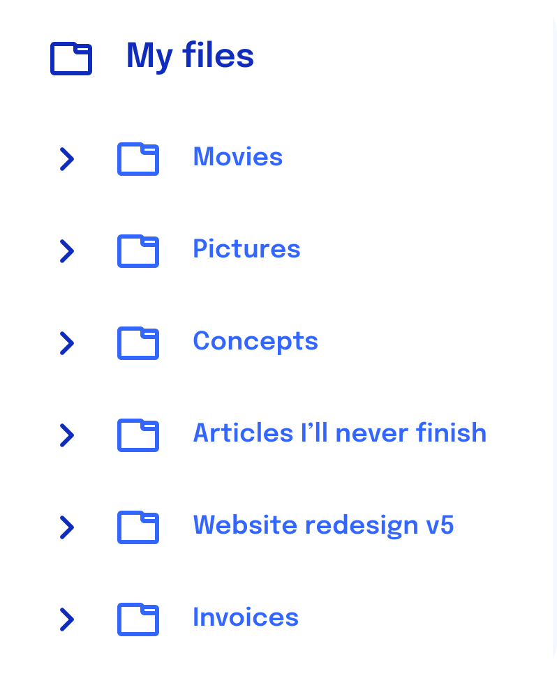

---
{
  title: "Introduction to Components",
  description: "Components are the core building block in which all applications written with React, Angular, and Vue are built. Let's explore what they are and how to build them.",
  published: "2024-03-11T12:02:00.000Z",
  authors: ["crutchcorn"],
  tags: ["react", "angular", "vue", "webdev"],
  attached: [],
  order: 2,
  collection: "framework-field-guide-fundamentals-v1-1",
  noindex: true,
  version: "v1.1",
  upToDateSlug: "ffg-fundamentals-intro-to-components",
}
---

> Before we can dive into how many front-end frameworks work, we need to set a baseline of information. If you're already familiar with how the DOM represents a tree and how the browser takes that information and uses it, great; You're ready to read ahead! Otherwise, it's strongly suggested that you look at [our post introducing the concepts](/posts/understanding-the-dom/) required to understand some baselines of this post.

You may have heard about various frameworks and libraries that modern front-end developers use to build large-scale applications. Among these frameworks are Angular, React, and Vue. While each of these libraries brings its own strengths and weaknesses, many of the core concepts are shared between them.

With this book, we will outline core concepts shared between them and how you can implement them in code in all three of the frameworks. This should provide a good reference when trying to learn one of these frameworks without pre-requisite knowledge or even trying to learn another framework with some pre-requisite of a different one.

First, let's explain why frameworks like Angular, React, or Vue differ from other libraries that may have come before them, like jQuery.

It all comes down to a single core concept at the heart of each: **Componentization**.

# What's an App, Anyway? {#whats-an-app-anyway}

Before we dive into the technical aspects, let's think about what an app consists of at a high level.

Take the following application into consideration.


Our app has many parts to it. For example, a sidebar containing navigation links, a list of files for a user to navigate, and a details pane about the user's selected file.

What's more, each part of the app needs different things.

The sidebar may not require complex programming logic, but we may want to style it with nice colors and highlight effects when the user hovers. Likewise, the file list may contain complex logic to handle a user right-clicking, dragging, and dropping files.

When you break it down, each part of the app has three primary concerns:

- Logic — What does the app do?
- Styling — How does the app look visually?
- Structure — How is the app laid out?

While the mockup above does a decent job of displaying things visually, let's look at what the app looks like structurally:


Here, each section is laid out without any additional styling: Simply a wireframe of what the page will look like, with each section containing blocks laid out in pretty straightforward ways. This is what HTML will help us build.

Now that we understand the structure, let's add some functionality. First, we'll include a small snippet of text in each section to outline our goals. We'd then use these as "acceptance" criteria in the future. This is what our logic will provide to the app.


Great! Now, let's go back and add the styling to recreate the mockup we had before!


We can think of each step of the process like we're adding in a new programming language.

- HTML is used for adding the structure of an application. The side nav might be a `<nav>` tag, for example.
- JavaScript adds the logic of the application on top of the structure.
- CSS makes everything look nice and potentially adds some minor UX improvements.

The way I typically think about these three pieces of tech is:

HTML is like building blueprints. It allows you to see the overarching pictures of what the result will look like. They define the walls, doors, and flow of a home.

JavaScript is like the electrical, plumbing, and appliances of the house. They allow you to interact with the building in a meaningful way.

CSS is like the paint and other decors that go into a home. They're what makes the house feel lived in and inviting. Of course, this decor does little without the rest of the home, but without the decor, it's a miserable experience.

# Parts of the App {#parts-of-app}

Now that we've introduced what an app looks like, let's go back for a moment. Remember how I said each app is made of parts? Let's explode the app's mockup into smaller pieces and look at them more in-depth.


Here, we can more distinctly see how each part of the app has its own structure, styling, and logic.

The file list, for example, contains the structure of each file being its own item, logic about what buttons do which actions, and some CSS to make it look engaging.

While the code for this section might look something like this:

```html
<section>
	<button id="addButton"><span class="icon">plus</span></button>
	<!-- ... -->
</section>
<ul>
	<li>
		<a href="/file/file_one">File one<span>12/03/21</span></a>
	</li>
	<!-- ... -->
	<ul>
		<script>
			var addButton = document.querySelector("#addButton");
			addButton.addEventListener("click", () => {
				// ...
			});
		</script>
	</ul>
</ul>
```

We might have a mental model to break down each section into smaller ones. If we use pseudocode to represent our mental model of the actual codebase, it might look something like this:

```html
<files-buttons>
	<add-button />
</files-buttons>
<files-list>
	<file name="File one" />
</files-list>
```

Luckily, by using frameworks, this mental model can be reflected in real code!

Let's look at what `<file>` might look like in each framework:

<!-- ::start:tabs -->

## React

```jsx
const File = () => {
	return (
		<div>
			<a href="/file/file_one">
				File one<span>12/03/21</span>
			</a>
		</div>
	);
};
```

Here, we're defining a component that we call `File`, which contains a set of instructions for how React is to create the associated HTML when the component is used.

These HTML creation instructions are defined using a syntax very similar to HTML — but in JavaScript instead. This syntax is called ["JSX"](https://reactjs.org/docs/introducing-jsx.html) and powers the show for every React application.

While JSX looks closer to HTML than standard JS, it is not supported in the language itself. Instead, a compiler (or transpiler) like [Babel](https://babeljs.io/) must compile down to regular JS. Under the hood, this JSX compiles down to function calls.

For example, the above would be turned into:

```javascript
var spanTag = React.createElement("span", null, "12/03/21");
var aTag = React.createElement(
	"a",
	{
		href: "/file/file_one",
	},
	"File one",
	spanTag,
);
React.createElement("div", null, aTag);
```

> While the above seems intimidating, it's worth mentioning that you'll likely never need to fall back on using `createElement` in an actual production application. Instead, this demonstrates why you need Babel in React applications.
>
> You also likely do not need to set up Babel yourself from scratch. Most tools that integrate with React handle it out-of-the-box for you invisibly.

## Angular

```angular-ts
import { Component } from "@angular/core";

@Component({
	selector: "file-item",
	standalone: true,
	template: `
		<div>
			<a href="/file/file_one">File one<span>12/03/21</span></a>
		</div>
	`,
})
class FileComponent {}
```

Here, we're using the `@Component` decorator to define a class component in Angular.

This decorator has a few properties passed to it. Going from the bottom-up:

1. `template`: The HTML associated with this component.
2. `standalone`: A flag telling the framework that this component is allowed to use the relatively new "Standalone" feature and can be used directly by another component.
3. `selector`: The name of the component that can be referenced inside the `template` of another component

> It's important to note that decorators (anything starting with `@`) are not supported in JavaScript itself. Instead, Angular uses [TypeScript](/posts/introduction-to-typescript/) to add types and other features to the language. From there, TypeScript compiles down to JavaScript.

> You may have noticed that this component is called `file-item` rather than `file`. Unlike the other frameworks in this book, Angular requires you to have a dash (`-`) in your selector name to avoid confusion with native HTML tags.

## Vue

```vue
<!-- File.vue -->
<template>
	<div>
		<a href="/file/file_one">File one<span>12/03/21</span></a>
	</div>
</template>
```

This is a specially named `.vue` file, which defines a Vue component called "File" and has a template for which HTML should be displayed when this component is used.

> Unlike the other frameworks, which require you to explicitly name your components, Vue uses the name of your `.vue` file to define the component's name.

Each Vue component uses an individual `.vue` file to contain its layout, styling, and logic. As such, these `.vue` files are often called "Single File Components," or SFCs for short.

While this SFC looks precisely like standard HTML with nothing special added, that will quickly change as we learn more about Vue.

<!-- ::end:tabs -->

These are called "components." Components have various aspects to them, which we'll learn about throughout the course of this book.

We can see that each framework has its own syntax to display these components, but they often share more similarities than you might think.

Now that we've defined our components, there's a question: how do you _use_ these components in HTML?

# Rendering the App {#rendering-app}

While these components might look like simple HTML, they're capable of much more advanced usage. Because of this, each framework actually uses JavaScript under the hood to "draw" these components on-screen.

**This process of "drawing" is called "rendering".** This is not a one-and-done, however. A component may render at various times throughout its usage on-screen, particularly when it needs to update data shown on-screen; we'll learn more about this later in the chapter.

Traditionally, when you build out a website with just HTML, you'd define an `index.html` file like so:

```html
<!-- index.html -->
<html>
	<body>
		<!-- Your HTML here -->
	</body>
</html>
```

Similarly, all apps built with React, Angular, and Vue start with an `index.html` file.

<!-- ::start:tabs -->

## React

```html
<!-- index.html -->
<html>
	<body>
		<div id="root"></div>
	</body>
</html>
```

## Angular

```html
<!-- index.html -->
<html>
	<body>
		<!-- This should match the `selector` of the -->
		<!-- component you want here -->
		<file-item></file-item>
	</body>
</html>
```

## Vue

```html
<!-- index.html -->
<html>
	<body>
		<div id="root"></div>
	</body>
</html>
```

<!-- ::end:tabs -->

Then, in JavaScript, you "render" a component into an element that acts as the "root" injection site for your framework to build your UI around.

<!-- ::start:tabs -->

## React

```jsx {1,13}
import { createRoot } from "react-dom/client";

const File = () => {
	return (
		<div>
			<a href="/file/file_one">
				File one<span>12/03/21</span>
			</a>
		</div>
	);
};

createRoot(document.getElementById("root")).render(<File />);
```

<!-- ::start:no-ebook -->
<iframe data-frame-title="React Rendering - StackBlitz" src="pfp-code:./ffg-fundamentals-react-rendering-1?template=node&embed=1&file=src%2Fmain.jsx&terminal=dev"></iframe>
<!-- ::end:no-ebook -->

## Angular

```angular-ts {2,15}
import { Component } from "@angular/core";
import { bootstrapApplication } from "@angular/platform-browser";

@Component({
	selector: "file-item",
	standalone: true,
	template: `
		<div>
			<a href="/file/file_one">File one<span>12/03/21</span></a>
		</div>
	`,
})
class FileComponent {}

bootstrapApplication(FileComponent);
```

<!-- ::start:no-ebook -->
<iframe data-frame-title="Angular Rendering - StackBlitz" src="pfp-code:./ffg-fundamentals-angular-rendering-1?template=node&embed=1&file=src%2Fmain.ts"></iframe>
<!-- ::end:no-ebook -->

## Vue

Because Vue's components all live within dedicated `.vue` SFCs, we have to use two distinct files to render a basic Vue app. We start with our `App.vue` component:

```vue
<!-- File.vue -->
<template>
	<div>
		<a href="/file/file_one">File one<span>12/03/21</span></a>
	</div>
</template>
```

Then, we can import this into our main JavaScript file:

```javascript {2,5}
// main.js
import { createApp } from "vue";
import File from "./File.vue";

createApp(File).mount("#root");
```

<!-- ::start:no-ebook -->
<iframe data-frame-title="Vue Rendering - StackBlitz" src="pfp-code:./ffg-fundamentals-vue-rendering-1?template=node&embed=1&file=src%2Fmain.js"></iframe>
<!-- ::end:no-ebook -->

<!-- ::end:tabs -->

Once a component is rendered, you can do a lot more with it!

For example, just like [nodes in the DOM]() have relationships, so too can components.

# Children, Siblings, and More, Oh My! {#relationships}

While our `File` component currently contains HTML elements, components may also contain other components!

<!-- ::start:tabs -->

## React

```jsx {11-19}
const File = () => {
	return (
		<div>
			<a href="/file/file_one">
				File one<span>12/03/21</span>
			</a>
		</div>
	);
};

const FileList = () => {
	return (
		<ul>
			<li>
				<File />
			</li>
		</ul>
	);
};
```

<!-- ::start:no-ebook -->
<iframe data-frame-title="React Parent/Child - StackBlitz" src="pfp-code:./ffg-fundamentals-react-parent-child-2?template=node&embed=1&file=src%2Fmain.jsx&terminal=dev"></iframe>
<!-- ::end:no-ebook -->

## Angular

```angular-ts {12-22}
@Component({
	selector: "file-item",
	standalone: true,
	template: `
		<div>
			<a href="/file/file_one">File one<span>12/03/21</span></a>
		</div>
	`,
})
class FileComponent {}

@Component({
	selector: "file-list",
	standalone: true,
	imports: [FileComponent],
	template: `
		<ul>
			<li><file-item /></li>
		</ul>
	`,
})
class FileListComponent {}
```

<!-- ::start:no-ebook -->
<iframe data-frame-title="Angular Parent/Child - StackBlitz" src="pfp-code:./ffg-fundamentals-angular-parent-child-2?template=node&embed=1&file=src%2Fmain.ts,src%2Findex.html"></iframe>
<!-- ::end:no-ebook -->

Notice how we've told our `FileListComponent` to `import` `FileComponent` by passing it the `imports` array.

## Vue

As we mentioned earlier, you can only have one component in a `.vue` SFC. Here, we have our existing `File` component:

```vue
<!-- File.vue -->
<template>
	<div>
		<a href="/file/file_one">File one<span>12/03/21</span></a>
	</div>
</template>
```

Which we can `import` into another component to use it there:

```vue
<!-- FileList.vue -->
<script setup>
import File from "./File.vue";
</script>

<template>
	<ul>
		<li><File /></li>
	</ul>
</template>
```

<!-- ::start:no-ebook -->
<iframe data-frame-title="Vue Parent/Child - StackBlitz" src="pfp-code:./ffg-fundamentals-vue-parent-child-2?template=node&embed=1&file=src%2FFileList.vue&terminal=dev"></iframe>
<!-- ::end:no-ebook -->

We can `import` and use our component immediately because any variable we expose inside of `<script setup>` is automatically available in the `<template>` portion of our SFC.

> Notice that our `script` tag has a `setup` attribute! Without it, our code won't work the right way!

We must import all the components we'll use in our parent component! Otherwise, Vue will throw an error:

> Failed to resolve component: file

<!-- ::end:tabs -->

Looking through our `File` component, we'll notice that we're rendering multiple elements inside a single component. Funnily enough, this has the fun side effect that we can also render multiple components inside a parent component.

<!-- ::start:tabs -->

## React

```jsx
const FileList = () => {
	return (
		<ul>
			<li>
				<File />
			</li>
			<li>
				<File />
			</li>
			<li>
				<File />
			</li>
		</ul>
	);
};
```

<!-- ::start:no-ebook -->
<iframe data-frame-title="React Component Reuse - StackBlitz" src="pfp-code:./ffg-fundamentals-react-component-reuse-3?template=node&embed=1&file=src%2Fmain.jsx"></iframe>
<!-- ::end:no-ebook -->

## Angular

```angular-ts
@Component({
	selector: "file-list",
	standalone: true,
	imports: [FileComponent],
	template: `
		<ul>
			<li><file-item /></li>
			<li><file-item /></li>
			<li><file-item /></li>
		</ul>
	`,
})
class FileListComponent {}
```

<!-- ::start:no-ebook -->
<iframe data-frame-title="Angular Component Reuse - StackBlitz" src="pfp-code:./ffg-fundamentals-angular-component-reuse-3?template=node&embed=1&file=src%2Fmain.ts"></iframe>
<!-- ::end:no-ebook -->

## Vue

```vue
<!-- FileList.vue -->
<script setup>
import File from "./File.vue";
</script>

<template>
	<ul>
		<li><File /></li>
		<li><File /></li>
		<li><File /></li>
	</ul>
</template>
```

<!-- ::start:no-ebook -->
<iframe data-frame-title="Vue Component Reuse - StackBlitz" src="pfp-code:./ffg-fundamentals-vue-component-reuse-3?template=node&embed=1&file=src%2FFileList.vue"></iframe>
<!-- ::end:no-ebook -->

<!-- ::end:tabs -->

This is a handy feature of components. It allows you to reuse aspects of your structure (and styling + logic, but I'm getting ahead of myself) without repeating yourself. It allows for a very DRY architecture where your code is declared once and reused elsewhere.

> That stands for "Don't repeat yourself" and is often heralded as a gold standard of code quality!

It's worth remembering that we're using the term "parent" to refer to our `FileList` component in relation to our `File` component. This is because, like the DOM tree, each framework's set of components reflects a tree.


This means that the related `File` components are "siblings" of one another, each with a "parent" of `FileList`.

We can extend this hierarchical relationship to have "grandchildren" and beyond as well:

<!-- ::start:tabs -->

## React

```jsx {1-3,5-15,20}
const FileDate = () => {
	return <span>12/03/21</span>;
};

const File = () => {
	return (
		<div>
			<a href="/file/file_one">
				File one
				<FileDate />
			</a>
		</div>
	);
};

const FileList = () => {
	return (
		<ul>
			<li>
				<File />
			</li>
			<li>
				<File />
			</li>
			<li>
				<File />
			</li>
		</ul>
	);
};
```

<!-- ::start:no-ebook -->
<iframe data-frame-title="React Component Hierarchy - StackBlitz" src="pfp-code:./ffg-fundamentals-react-component-hierarchy-4?template=node&embed=1&file=src%2Fmain.jsx"></iframe>
<!-- ::end:no-ebook -->

## Angular

```angular-ts {1-6,11,14,23,26}
@Component({
	selector: "file-date",
	standalone: true,
	template: `<span>12/03/21</span>`,
})
class FileDateComponent {}

@Component({
	selector: "file-item",
	standalone: true,
	imports: [FileDateComponent],
	template: `
		<div>
			<a href="/file/file_one">File one<file-date /></a>
		</div>
	`,
})
class FileComponent {}

@Component({
	selector: "file-list",
	standalone: true,
	imports: [FileComponent],
	template: `
		<ul>
			<li><file-item /></li>
			<li><file-item /></li>
			<li><file-item /></li>
		</ul>
	`,
})
class FileListComponent {}
```

<!-- ::start:no-ebook -->
<iframe data-frame-title="Angular Component Hierarchy - StackBlitz" src="pfp-code:./ffg-fundamentals-angular-component-hierarchy-4?template=node&embed=1&file=src%2Fmain.ts"></iframe>
<!-- ::end:no-ebook -->

## Vue

```vue
<!-- FileDate.vue -->
<template>
	<span>12/03/21</span>
</template>
```

```vue
<!-- File.vue -->
<script setup>
import FileDate from "./FileDate.vue";
</script>

<template>
	<div>
		<a href="/file/file_one">File one<FileDate /></a>
	</div>
</template>
```

```vue
<!-- FileList.vue -->
<script setup>
import File from "./File.vue";
</script>

<template>
	<ul>
		<li><File /></li>
		<li><File /></li>
		<li><File /></li>
	</ul>
</template>
```

<!-- ::start:no-ebook -->
<iframe data-frame-title="Vue Component Hierarchy - StackBlitz" src="pfp-code:./ffg-fundamentals-vue-component-hierarchy-4?template=node&embed=1&file=src%2FFileList.vue,src%2FFile.vue,src%2FFileDate.vue"></iframe>
<!-- ::end:no-ebook -->

<!-- ::end:tabs -->

# Logic {#logic}

HTML isn't the only thing components can store, however! As we mentioned earlier, apps (and, by extension, each part of the respective apps) require three parts:

- Structure (HTML)
- Styling (CSS)
- Logic (JS)

Components can handle all three!

Let's look at how we can declare logic in a component by making `file-date` show the current date instead of a static date.

We'll start by adding a variable containing the current date in a human-readable string of `MM/DD/YY`.

<!-- ::start:tabs -->

## React

```jsx
const FileDate = () => {
	const dateStr = `${
		new Date().getMonth() + 1
	}/${new Date().getDate()}/${new Date().getFullYear()}`;

	return <span>12/03/21</span>;
};
```

<!-- ::start:no-ebook -->
<iframe data-frame-title="React Inline Logic - StackBlitz" src="pfp-code:./ffg-fundamentals-react-inline-logic-5?template=node&embed=1&file=src%2Fmain.jsx"></iframe>
<!-- ::end:no-ebook -->

## Angular

```angular-ts
@Component({
	selector: "file-date",
	standalone: true,
	template: `<span>12/03/21</span>`,
})
class FileDateComponent {
	dateStr = `${
		new Date().getMonth() + 1
	}/${new Date().getDate()}/${new Date().getFullYear()}`;
}
```

<!-- ::start:no-ebook -->
<iframe data-frame-title="Angular Inline Logic - StackBlitz" src="pfp-code:./ffg-fundamentals-angular-inline-logic-5?template=node&embed=1&file=src%2Fmain.ts"></iframe>
<!-- ::end:no-ebook -->

## Vue

```vue
<!-- FileDate.vue -->
<script setup>
const dateStr = `${
	new Date().getMonth() + 1
}/${new Date().getDate()}/${new Date().getFullYear()}`;
</script>

<template>
	<span>12/03/21</span>
</template>
```

<!-- ::start:no-ebook -->
<iframe data-frame-title="Vue Inline Logic - StackBlitz" src="pfp-code:./ffg-fundamentals-vue-inline-logic-5?template=node&embed=1&file=src%2FFileDate.vue"></iframe>
<!-- ::end:no-ebook -->

<!-- ::end:tabs -->

> We're not using this new `dateStr` variable yet. This is intentional; we'll use it here shortly.

While this logic to set this variable works, it's a bit verbose (and slow due to recreating the `Date` object thrice) - let's break it out into a method contained within the component.

```javascript
function formatDate() {
	const today = new Date();
	// Month starts at 0, annoyingly
	const monthNum = today.getMonth() + 1;
	const dateNum = today.getDate();
	const yearNum = today.getFullYear();
	return monthNum + "/" + dateNum + "/" + yearNum;
}
```

<!-- ::start:tabs -->

## React

```jsx {1-8,11}
function formatDate() {
	const today = new Date();
	// Month starts at 0, annoyingly
	const monthNum = today.getMonth() + 1;
	const dateNum = today.getDate();
	const yearNum = today.getFullYear();
	return monthNum + "/" + dateNum + "/" + yearNum;
}

const FileDate = () => {
	const dateStr = formatDate();
	return <span>12/03/21</span>;
};
```

<!-- ::start:no-ebook -->
<iframe data-frame-title="React Extracted Logic - StackBlitz" src="pfp-code:./ffg-fundamentals-react-extracted-logic-6?template=node&embed=1&file=src%2Fmain.jsx"></iframe>
<!-- ::end:no-ebook -->

> Because React can easily access functions outside the component declaration, we decided to move it outside the component scope. This allows us to avoid re-declaring this function in every render, which the other frameworks don't do, thanks to different philosophies.

## Angular

```angular-ts {7,9-16}
@Component({
	selector: "file-date",
	standalone: true,
	template: `<span>12/03/21</span>`,
})
class FileDateComponent {
	dateStr = this.formatDate();

	formatDate() {
		const today = new Date();
		// Month starts at 0, annoyingly
		const monthNum = today.getMonth() + 1;
		const dateNum = today.getDate();
		const yearNum = today.getFullYear();
		return monthNum + "/" + dateNum + "/" + yearNum;
	}
}
```

<!-- ::start:no-ebook -->
<iframe data-frame-title="Angular Extracted Logic - StackBlitz" src="pfp-code:./ffg-fundamentals-angular-extracted-logic-6?template=node&embed=1&file=src%2Fmain.ts"></iframe>
<!-- ::end:no-ebook -->

## Vue

```vue {3-10,12}
<!-- FileDate.vue -->
<script setup>
function formatDate() {
	const today = new Date();
	// Month starts at 0, annoyingly
	const monthNum = today.getMonth() + 1;
	const dateNum = today.getDate();
	const yearNum = today.getFullYear();
	return monthNum + "/" + dateNum + "/" + yearNum;
}

const dateStr = formatDate();
</script>

<template>
	<span>12/03/21</span>
</template>
```

<!-- ::start:no-ebook -->
<iframe data-frame-title="Vue Extracted Logic - StackBlitz" src="pfp-code:./ffg-fundamentals-vue-extracted-logic-6?template=node&embed=1&file=src%2FFileDate.vue"></iframe>
<!-- ::end:no-ebook -->

<!-- ::end:tabs -->

# Intro to Side Effects {#side-effects}

Let's verify that our `formatDate` method outputs the correct value by telling our components, "Once you're rendered on screen, `console.log` the value of that data."

<!-- ::start:tabs -->

### React

```jsx {1,15-17}
import { useEffect } from "react";

function formatDate() {
	const today = new Date();
	// Month starts at 0, annoyingly
	const month = today.getMonth() + 1;
	const date = today.getDate();
	const year = today.getFullYear();
	return month + "/" + date + "/" + year;
}

const FileDate = () => {
	const dateStr = formatDate();

	useEffect(() => {
		console.log(dateStr);
	}, []);

	return <span>12/03/21</span>;
};
```

<!-- ::start:no-ebook -->
<iframe data-frame-title="React Side Effect Intro - StackBlitz" src="pfp-code:./ffg-fundamentals-react-side-effect-intro-7?template=node&embed=1&file=src%2Fmain.jsx"></iframe>
<!-- ::end:no-ebook -->

### Angular

```angular-ts {1,8,11-13}
import { Component, OnInit } from "@angular/core";

@Component({
	selector: "file-date",
	standalone: true,
	template: `<span>12/03/21</span>`,
})
class FileDateComponent implements OnInit {
	dateStr = this.formatDate();

	ngOnInit() {
		console.log(this.dateStr);
	}

	formatDate() {
		const today = new Date();
		// Month starts at 0, annoyingly
		const monthNum = today.getMonth() + 1;
		const dateNum = today.getDate();
		const yearNum = today.getFullYear();
		return monthNum + "/" + dateNum + "/" + yearNum;
	}
}
```

<!-- ::start:no-ebook -->
<iframe data-frame-title="Angular Side Effect Intro - StackBlitz" src="pfp-code:./ffg-fundamentals-angular-side-effect-intro-7?template=node&embed=1&file=src%2Fmain.ts"></iframe>
<!-- ::end:no-ebook -->

### Vue

```vue {3,16-18}
<!-- FileDate.vue -->
<script setup>
import { onMounted } from "vue";

function formatDate() {
	const today = new Date();
	// Month starts at 0, annoyingly
	const monthNum = today.getMonth() + 1;
	const dateNum = today.getDate();
	const yearNum = today.getFullYear();
	return monthNum + "/" + dateNum + "/" + yearNum;
}

const dateStr = formatDate();

onMounted(() => {
	console.log(dateStr);
});
</script>

<template>
	<span>12/03/21</span>
</template>
```

<!-- ::start:no-ebook -->
<iframe data-frame-title="Vue Side Effect Intro - StackBlitz" src="pfp-code:./ffg-fundamentals-vue-side-effect-intro-7?template=node&embed=1&file=src%2FFileDate.vue"></iframe>
<!-- ::end:no-ebook -->

<!-- ::end:tabs -->

Here, we're telling each respective framework to log the value of `dateStr` to the console once the component is rendered for the first time.

> Wait, "for the first time?"

Yup! React, Angular, and Vue can all update (or "re-render") when needed.

For example, let's say you want to show `dateStr` to a user, but later in the day, the time switches over. While you'd have to handle the code to keep track of the time, **the respective framework would notice that you've modified the values of `dateStr` and re-render the component to display the new value**.

While the method each framework uses to tell _when_ to re-render is different, they all have a highly stable method of doing so.

<!-- ::in-content-ad title="Consider supporting" body="Donating any amount will help towards further development of the Framework Field Guide." button-text="Sponsor my work" button-href="https://github.com/sponsors/crutchcorn/" -->

This feature is arguably the most significant advantage of building an application with one of these frameworks.

**This ability to track data being changed relies on the concept of handling "side effects"**. While we'll touch on this more in our future chapter called ["Side effects"](/posts/ffg-fundamentals-v1-1-side-effects), you can think of a "side effect" as any change made to a component's data: Either through a user's input or the component's output changing.

Speaking of updating data on-screen - let's look at how we can dynamically display data on a page.

# Display {#display}

While displaying the value in the console works well for debugging, it's not much help to the user. After all, more than likely, your users won't know what a console even is. Let's show `dateStr` on-screen

<!-- ::start:tabs -->

### React

```jsx {13}
function formatDate() {
	const today = new Date();
	// Month starts at 0, annoyingly
	const monthNum = today.getMonth() + 1;
	const dateNum = today.getDate();
	const yearNum = today.getFullYear();
	return monthNum + "/" + dateNum + "/" + yearNum;
}

const FileDate = () => {
	const dateStr = formatDate();

	return <span>{dateStr}</span>;
};
```

<!-- ::start:no-ebook -->
<iframe data-frame-title="React Display - StackBlitz" src="pfp-code:./ffg-fundamentals-react-display-8?template=node&embed=1&file=src%2Fmain.jsx"></iframe>
<!-- ::end:no-ebook -->

### Angular

```angular-ts {4}
@Component({
	selector: "file-date",
	standalone: true,
	template: `<span>{{ dateStr }}</span>`,
})
class FileDateComponent {
	dateStr = this.formatDate();

	formatDate() {
		const today = new Date();
		// Month starts at 0, annoyingly
		const monthNum = today.getMonth() + 1;
		const dateNum = today.getDate();
		const yearNum = today.getFullYear();
		return monthNum + "/" + dateNum + "/" + yearNum;
	}
}
```

<!-- ::start:no-ebook -->
<iframe data-frame-title="Angular Display - StackBlitz" src="pfp-code:./ffg-fundamentals-angular-display-8?template=node&embed=1&file=src%2Fmain.ts"></iframe>
<!-- ::end:no-ebook -->

Every class property inside the component instance is usable inside the `@Component`'s `template`.

### Vue

```vue {18}
<!-- FileDate.vue -->
<script setup>
import { onMounted } from "vue";

function formatDate() {
	const today = new Date();
	// Month starts at 0, annoyingly
	const monthNum = today.getMonth() + 1;
	const dateNum = today.getDate();
	const yearNum = today.getFullYear();
	return monthNum + "/" + dateNum + "/" + yearNum;
}

const dateStr = formatDate();
</script>

<template>
	<span>{{ dateStr }}</span>
</template>
```

<!-- ::start:no-ebook -->
<iframe data-frame-title="Vue Display - StackBlitz" src="pfp-code:./ffg-fundamentals-vue-display-8?template=node&embed=1&file=src%2FFileDate.vue"></iframe>
<!-- ::end:no-ebook -->

Here, we're using the fact that every variable inside of `<script setup>` is automatically exposed to our `<template>` code.

<!-- ::end:tabs -->

Here, we're using each framework's method of injecting the state into a component. For React, we'll use the `{}` syntax to interpolate JavaScript into the template, while Vue and Angular both rely on `{{}}` syntax.

## Live Updating {#reactivity}

But what happens if we update `dateStr` after the fact? Say we have a `setTimeout` call that updates the date to tomorrow's date after 5 minutes.

Let's think about what that code might look like:

```javascript
// This is non-framework-specific pseudocode
setTimeout(() => {
	// 24 hours, 60 minutes, 60 seconds, 1000 milliseconds
	const tomorrow = new Date(Date.now() + 24 * 60 * 60 * 1000);
	const tomorrowDate = formatDate(tomorrow);
	dateStr = tomorrowDate;
	// This is not a real method in any of these frameworks
	// But the idea of re-rendering after data has changed IS
	// an integral part of these frameworks. They just do it differently
	rerender();
}, 5000);
```

Let's see what that looks like in practice for each framework:

<!-- ::start:tabs -->

### React

In the pseudocode sample we wrote before, we update the value of `dateStr` and then re-render the containing component to update a value on-screen using two lines of code.

In React, we use a single line of code to do both and have a special `useState` method to tell React what data needs changing.

```jsx {14-21}
import { useState, useEffect } from "react";

function formatDate(inputDate) {
	// Month starts at 0, annoyingly
	const month = inputDate.getMonth() + 1;
	const date = inputDate.getDate();
	const year = inputDate.getFullYear();
	return month + "/" + date + "/" + year;
}

const FileDate = () => {
	const [dateStr, setDateStr] = useState(formatDate(new Date()));

	useEffect(() => {
		setTimeout(() => {
			// 24 hours, 60 minutes, 60 seconds, 1000 milliseconds
			const tomorrow = new Date(Date.now() + 24 * 60 * 60 * 1000);
			const tomorrowDate = formatDate(tomorrow);
			setDateStr(tomorrowDate);
		}, 5000);
	}, []);

	return <span>{dateStr}</span>;
};
```

<!-- ::start:no-ebook -->
<iframe data-frame-title="React Live Display - StackBlitz" src="pfp-code:./ffg-fundamentals-react-live-display-9?template=node&embed=1&file=src%2Fmain.jsx"></iframe>
<!-- ::end:no-ebook -->

`useState` is what React uses to store data that the developer wants to persist between renders. Its first argument (that we're passing a string into) sets the initial value.

We then use [array destructuring](https://developer.mozilla.org/en-US/docs/Web/JavaScript/Reference/Operators/Destructuring_assignment) to convert the returned array into two variables. Another way to write this code is:

```jsx
const dateArr = useState(
	`${
		new Date().getMonth() + 1
	}/${new Date().getDate()}/${new Date().getFullYear()}`,
);
const dateStr = dateArr[0];
const setDateStr = dateArr[1];
```

Here, we're using `setDateStr` to tell React that it should re-render, which will update the value of `dateStr`. This differs from Angular and Vue, where you don't have to explicitly tell the framework when to re-render.

#### Rules of React Hooks {#rules-of-hooks}

`useState` and `useEffect` are both what are known as ["React Hooks"](https://reactjs.org/docs/hooks-intro.html). Hooks are React's method of "hooking" functionality into React's framework code. They allow you to do a myriad of functionalities in React components.

Hooks can be identified as a function that starts with the word "`use`". Some other Hooks we'll touch on in the future will include [`useMemo`](/posts/ffg-fundamentals-v1-1-derived-values), [`useReducer`](/posts/ffg-fundamentals-v1-1-dependency-injection#reducer-pattern), and others.

Something to keep in mind when thinking about Hooks is that they have limitations placed on them by React itself. Namely, React Hooks must:

- Be called from a component\* (no normal functions)
- Not be called conditionally inside a component (no `if` statements)
- Not be called inside a loop (no `for` or `while` loops)

```jsx
// ❌ Not allowed, component names must start with a capital letter, otherwise it's seen as a normal function
const windowSize = () => {
	const [dateStr, setDateStr] = useState(formatDate(new Date()));

	// ...
};
```

```jsx
// ❌ Not allowed, you must use a hook _inside_ a component
const [dateStr, setDateStr] = useState(formatDate(new Date()));

const Component = () => {
	return <p>The date is: {dateStr}</p>;
};
```

```jsx
// ❌ Not allowed, you cannot `return` before using a hook
const WindowSize = () => {
	if (bool) return "Today";
	const [dateStr, setDateStr] = useState(formatDate(new Date()));

	// ...
};
```

We'll [learn more about the nuances surrounding Hooks](/posts/ffg-fundamentals-v1-1-shared-component-logic#custom-hook-rules) in the future, but for now, just remember that they're the way you interface with React's APIs.

### Angular

While React takes a very explicit method of telling the framework when to re-render a component, Angular does the opposite and implicitly knows when you need to re-render based on the data changed.

All it takes in Angular to trigger a re-render is to update a variable's value:

```angular-ts {11-17}
import { Component, OnInit } from "@angular/core";

@Component({
	selector: "file-date",
	standalone: true,
	template: `<span>{{ dateStr }}</span>`,
})
class FileDateComponent implements OnInit {
	dateStr = this.formatDate(new Date());

	ngOnInit() {
		setTimeout(() => {
			// 24 hours, 60 minutes, 60 seconds, 1000 milliseconds
			const tomorrow = new Date(Date.now() + 24 * 60 * 60 * 1000);
			this.dateStr = this.formatDate(tomorrow);
		}, 5000);
	}

	formatDate(inputDate: Date) {
		// Month starts at 0, annoyingly
		const monthNum = inputDate.getMonth() + 1;
		const dateNum = inputDate.getDate();
		const yearNum = inputDate.getFullYear();
		return monthNum + "/" + dateNum + "/" + yearNum;
	}
}
```

<!-- ::start:no-ebook -->
<iframe data-frame-title="Angular Live Display - StackBlitz" src="pfp-code:./ffg-fundamentals-angular-live-display-9?template=node&embed=1&file=src%2Fmain.ts"></iframe>
<!-- ::end:no-ebook -->

### Vue

Similar to how React has `useState` in order to set data in a component, Vue introduces an API called `ref` in order to have data updates trigger a re-render.

```vue {15-21}
<!-- FileDate.vue -->
<script setup>
import { ref, onMounted } from "vue";

function formatDate(inputDate) {
	// Month starts at 0, annoyingly
	const monthNum = inputDate.getMonth() + 1;
	const dateNum = inputDate.getDate();
	const yearNum = inputDate.getFullYear();
	return monthNum + "/" + dateNum + "/" + yearNum;
}

const dateStr = ref(formatDate(new Date()));

onMounted(() => {
	setTimeout(() => {
		// 24 hours, 60 minutes, 60 seconds, 1000 milliseconds
		const tomorrow = new Date(Date.now() + 24 * 60 * 60 * 1000);
		dateStr.value = formatDate(tomorrow);
	}, 5000);
});
</script>

<template>
	<span>{{ dateStr }}</span>
</template>
```

<!-- ::start:no-ebook -->
<iframe data-frame-title="Vue Live Display - StackBlitz" src="pfp-code:./ffg-fundamentals-vue-live-display-9?template=node&embed=1&file=src%2FFileDate.vue"></iframe>
<!-- ::end:no-ebook -->

> Notice how we're using `.value` to update the value inside of `<script>` but don't use `.value` inside of `<template>`. This isn't a mistake — it's just how Vue's `ref` works!

<!-- ::end:tabs -->

If you sit on these screens for a while, you'll see that they update automatically!

**This idea of a data update triggering other code is called "reactivity"** and is a central part of these frameworks.

While the frameworks detect reactive changes under the hood differently, they all handle updating the DOM for you. This allows you to focus on the logic intended to update what's on-screen as opposed to the code that updates the DOM itself.

This is important because to update the DOM in an efficient way requires significant heavy lifting. In fact, **two of these frameworks (React and Vue) store an entire copy of the DOM in memory to keep that update as lightweight as possible**. In the third book of this book series, "Internals", we'll learn how this works under the hood and how to build our work version of this DOM mirroring.

# Attribute Binding {#attr-binding}

Text isn't the only thing that frameworks are capable of live updating, however!

Just like each framework has a way to have state rendered into text on-screen, it can also update HTML attributes for an element.

Currently, our `date` component doesn't read out [particularly kindly to screen-readers](/posts/intro-to-web-accessibility) since it would only read out as numbers. Let's change that by adding an `aria-label` of a human-readable date to our `date` component.

<!-- ::start:tabs -->

### React

```jsx {6}
const FileDate = () => {
	const [dateStr, setDateStr] = useState(formatDate(new Date()));

	// ...

	return <span aria-label="January 10th, 2023">{dateStr}</span>;
};
```

### Angular

```angular-ts {6}
import { Component, OnInit } from "@angular/core";

@Component({
	selector: "file-date",
	standalone: true,
	template: ` <span aria-label="January 10th, 2023">{{ dateStr }}</span> `,
})
class FileDateComponent implements OnInit {
	dateStr = this.formatDate(new Date());

	// ...
}
```

### Vue

```vue {9}
<!-- FileDate.vue -->
<script setup>
// ...

const dateStr = ref(formatDate(new Date()));
</script>

<template>
	<span aria-label="January 10th, 2023">{{ dateStr }}</span>
</template>
```

<!-- ::end:tabs -->

Now, [when we use a screen reader](/posts/intro-to-web-accessibility), it'll read out "January 10th" instead of "One dash ten".

However, while this may have worked before the `date` was dynamically formatted, it won't be correct for most of the year. (Luckily for us, a broken clock is correct at least once a day.)

Let's correct that by adding in a `formatReadableDate` method and reflect that in the attribute:

<!-- ::start:tabs -->

### React

```jsx {26,30}
import { useState, useEffect } from "react";

function formatReadableDate(inputDate) {
	const months = [
		"January",
		"February",
		"March",
		"April",
		"May",
		"June",
		"July",
		"August",
		"September",
		"October",
		"November",
		"December",
	];
	const monthStr = months[inputDate.getMonth()];
	const dateSuffixStr = dateSuffix(inputDate.getDate());
	const yearNum = inputDate.getFullYear();
	return monthStr + " " + dateSuffixStr + "," + yearNum;
}

const FileDate = () => {
	const [dateStr, setDateStr] = useState(formatDate(new Date()));
	const [labelText, setLabelText] = useState(formatReadableDate(new Date()));

	// ...

	return <span aria-label={labelText}>{dateStr}</span>;
};

function dateSuffix(dayNumber) {
	const lastDigit = dayNumber % 10;
	if (lastDigit == 1 && dayNumber != 11) {
		return dayNumber + "st";
	}
	if (lastDigit == 2 && dayNumber != 12) {
		return dayNumber + "nd";
	}
	if (lastDigit == 3 && dayNumber != 13) {
		return dayNumber + "rd";
	}
	return dayNumber + "th";
}
```

<!-- ::start:no-ebook -->
<iframe data-frame-title="React Attribute Binding - StackBlitz" src="pfp-code:./ffg-fundamentals-react-attribute-binding-10?template=node&embed=1&file=src%2Fmain.jsx"></iframe>
<!-- ::end:no-ebook -->

> Notice the `{}` used after the `=` to assign the attribute value. This is pretty similar to the syntax to interpolate text into the DOM!

### Angular

```angular-ts {6,10}
import { Component, OnInit } from "@angular/core";

@Component({
	selector: "file-date",
	standalone: true,
	template: ` <span [attr.aria-label]="labelText">{{ dateStr }}</span> `,
})
class FileDateComponent implements OnInit {
	dateStr = this.formatDate(new Date());
	labelText = this.formatReadableDate(new Date());

	// ...

	dateSuffix(dayNumber: number) {
		const lastDigit = dayNumber % 10;
		if (lastDigit == 1 && dayNumber != 11) {
			return dayNumber + "st";
		}
		if (lastDigit == 2 && dayNumber != 12) {
			return dayNumber + "nd";
		}
		if (lastDigit == 3 && dayNumber != 13) {
			return dayNumber + "rd";
		}
		return dayNumber + "th";
	}

	formatReadableDate(inputDate: Date) {
		const months = [
			"January",
			"February",
			"March",
			"April",
			"May",
			"June",
			"July",
			"August",
			"September",
			"October",
			"November",
			"December",
		];
		const monthStr = months[inputDate.getMonth()];
		const dateSuffixStr = this.dateSuffix(inputDate.getDate());
		const yearNum = inputDate.getFullYear();
		return monthStr + " " + dateSuffixStr + "," + yearNum;
	}
}
```

<!-- ::start:no-ebook -->
<iframe data-frame-title="Angular Attribute Binding - StackBlitz" src="pfp-code:./ffg-fundamentals-angular-attribute-binding-10?template=node&embed=1&file=src%2Fmain.ts"></iframe>
<!-- ::end:no-ebook -->

> Unlike the `{{}}` that you'd use to bind text to the DOM, you use `[]` to bind attributes in Angular.
>
> "`attr`" stands for "attribute." We'll see the other usage for the `[]` syntax momentarily.

### Vue

```vue {41,47}
<!-- FileDate.vue -->
<script setup>
// ...

function formatReadableDate(inputDate) {
	const months = [
		"January",
		"February",
		"March",
		"April",
		"May",
		"June",
		"July",
		"August",
		"September",
		"October",
		"November",
		"December",
	];
	const monthStr = months[inputDate.getMonth()];
	const dateSuffixStr = dateSuffix(inputDate.getDate());
	const yearNum = inputDate.getFullYear();
	return monthStr + " " + dateSuffixStr + "," + yearNum;
}

function dateSuffix(dayNumber) {
	const lastDigit = dayNumber % 10;
	if (lastDigit == 1 && dayNumber != 11) {
		return dayNumber + "st";
	}
	if (lastDigit == 2 && dayNumber != 12) {
		return dayNumber + "nd";
	}
	if (lastDigit == 3 && dayNumber != 13) {
		return dayNumber + "rd";
	}
	return dayNumber + "th";
}

const dateStr = ref(formatDate(new Date()));
const labelText = ref(formatReadableDate(new Date()));

// ...
</script>

<template>
	<span v-bind:aria-label="labelText">{{ dateStr }}</span>
</template>
```

<!-- ::start:no-ebook -->
<iframe data-frame-title="Vue Attribute Binding - StackBlitz" src="pfp-code:./ffg-fundamentals-vue-attribute-binding-10?template=node&embed=1&file=src%2FFileDate.vue"></iframe>
<!-- ::end:no-ebook -->

> In Vue, `v-bind` has a shorter syntax that does the same thing. If you ax the `v-bind` and leave the `:`, it works the same way.
>
> This means that:
>
> ```html
> <span v-bind:aria-label="labelText">{{dateStr}}</span>
> ```
>
> And:
>
> ```html
> <span :aria-label="labelText">{{dateStr}}</span>
> ```
>
> Both work to bind to an attribute in HTML.

<!-- ::end:tabs -->

> This code isn't exactly what you might expect to see in production. If you're looking to write production code, you may want to look into [derived values](/posts/ffg-fundamentals-v1-1-derived-values) to base the `labelText` and `date` values off of the same [`Date` object](https://developer.mozilla.org/en-US/docs/Web/JavaScript/Reference/Global_Objects/Date) directly. This would let you avoid calling `new Date` twice, but I'm getting ahead of myself - we'll touch on derived values in a future section.

Awesome! Now, it should read the file's date properly to a screen reader!

# Inputs {#inputs}

Our file list is starting to look good! That said, a file list containing the same file repeatedly isn't much of a file list. Ideally, we'd like to pass the file's name into our `File` component to add a bit of variance.

Luckily for us, components accept arguments just like functions! These arguments are most often called "inputs" or "properties" (shortened to "props") in the component world.

Let's have the file name be an input to our `File` component:

<!-- ::start:tabs -->

## React

```jsx {1-10,16}
const File = (props) => {
	return (
		<div>
			<a href="/file/file_one">
				{props.fileName}
				<FileDate />
			</a>
		</div>
	);
};

const FileList = () => {
	return (
		<ul>
			<li>
				<File fileName={"File one"} />
			</li>
			<li>
				<File fileName={"File two"} />
			</li>
			<li>
				<File fileName={"File three"} />
			</li>
		</ul>
	);
};
```

<!-- ::start:no-ebook -->
<iframe data-frame-title="React Props - StackBlitz" src="pfp-code:./ffg-fundamentals-react-props-11?template=node&embed=1&file=src%2Fmain.jsx"></iframe>
<!-- ::end:no-ebook -->

> React uses an object to contain all properties that we want to pass to a component. We can use [parameter destructuring](https://developer.mozilla.org/en-US/docs/Web/JavaScript/Reference/Operators/Destructuring_assignment) to get the properties without having to use `props` before the name of the parameter we really want, like so:
>
> ```jsx
> const File = ({ fileName }) => {
> 	return (
> 		<div>
> 			<a href="/file/file_one">
> 				{fileName}
> 				<FileDate />
> 			</a>
> 		</div>
> 	);
> };
> ```
>
> Since this is extremely common in production React applications, we'll be using this style going forward.
>
> Similarly, while `{}` is required to bind a variable to an input or attribute in React, since we're only passing a string here, we could alternatively write:
>
> ```jsx
> <File fileName="File one" />
> ```

## Angular

```angular-ts {1,14,23}
import { Input, Component } from "@angular/core";

@Component({
	selector: "file-item",
	standalone: true,
	imports: [FileDateComponent],
	template: `
		<div>
			<a href="/file/file_one">{{ fileName }}<file-date /></a>
		</div>
	`,
})
class FileComponent {
	@Input() fileName!: string;
}

@Component({
	selector: "file-list",
	standalone: true,
	imports: [FileComponent],
	template: `
		<ul>
			<li><file-item [fileName]="'File one'" /></li>
			<li><file-item [fileName]="'File two'" /></li>
			<li><file-item [fileName]="'File three'" /></li>
		</ul>
	`,
})
class FileListComponent {}
```

<!-- ::start:no-ebook -->
<iframe data-frame-title="Angular Props - StackBlitz" src="pfp-code:./ffg-fundamentals-angular-props-11?template=node&embed=1&file=src%2Fmain.ts"></iframe>
<!-- ::end:no-ebook -->

> See? Told you we'd cover what `[]` would be used for. It's the same binding syntax as with attributes!
>
> We're also using the `@Input` decorator to declare inputs for each component input.

## Vue

```vue {5,10}
<!-- File.vue -->
<script setup>
import FileDate from "./FileDate.vue";

const props = defineProps(["fileName"]);
</script>

<template>
	<div>
		<a href="/file/file_one">{{ props.fileName }}<FileDate /></a>
	</div>
</template>
```

```vue {8}
<!-- FileList.vue -->
<script setup>
import File from "./File.vue";
</script>

<template>
	<ul>
		<li><File :fileName="'File one'" /></li>
		<li><File :fileName="'File two'" /></li>
		<li><File :fileName="'File three'" /></li>
	</ul>
</template>
```

<!-- ::start:no-ebook -->
<iframe data-frame-title="Vue Props - StackBlitz" src="pfp-code:./ffg-fundamentals-vue-props-11?template=node&embed=1&file=src%2FFile.vue"></iframe>
<!-- ::end:no-ebook -->

> We don't need to import `defineProps`, instead, Vue uses some compiler magic to provide it as a globally accessible method.
>
> Here, we need to declare each property using `defineProps` on our component; otherwise, the input value won't be available to the rest of the component.
>
> Also, when we talked about attribute binding, we mentioned `:` is shorthand for `v-bind:`. The same applies here too. You could alternatively write:
>
> ```html
> <File v-bind:fileName="'File three'" />
> ```

<!-- ::end:tabs -->

Here, we can see each `File` being rendered with its own name.

One way of thinking about passing properties to a component is to "pass down" data to our children's components. Remember, these components make a parent/child relationship to one another.

It's exciting what progress we're making! But oh no - the links are still static! Each file has the same `href` property as the last. Let's fix that!

## Multiple Properties {#multi-props}

Like functions, components can accept as many properties as you'd like to pass. Let's add another for `href`:

<!-- ::start:tabs -->

### React

```jsx {1-10,16}
const File = ({ fileName, href }) => {
	return (
		<div>
			<a href={href}>
				{fileName}
				<FileDate />
			</a>
		</div>
	);
};

const FileList = () => {
	return (
		<ul>
			<li>
				<File fileName="File one" href="/file/file_one" />
			</li>
			<li>
				<File fileName="File two" href="/file/file_two" />
			</li>
			<li>
				<File fileName="File three" href="/file/file_three" />
			</li>
		</ul>
	);
};
```

<!-- ::start:no-ebook -->
<iframe data-frame-title="React Multi Props - StackBlitz" src="pfp-code:./ffg-fundamentals-react-multi-props-12?template=node&embed=1&file=src%2Fmain.jsx"></iframe>
<!-- ::end:no-ebook -->

### Angular

```angular-ts {12-13,22}
@Component({
	selector: "file-item",
	standalone: true,
	imports: [FileDateComponent],
	template: `
		<div>
			<a [attr.href]="href">{{ fileName }}<file-date /></a>
		</div>
	`,
})
class FileComponent {
	@Input() fileName!: string;
	@Input() href!: string;
}

@Component({
	selector: "file-list",
	standalone: true,
	imports: [FileComponent],
	template: `
		<ul>
			<li><file-item [fileName]="'File one'" [href]="'/file/file_one'" /></li>
			<li><file-item [fileName]="'File two'" [href]="'/file/file_two'" /></li>
			<li>
				<file-item [fileName]="'File three'" [href]="'/file/file_three'" />
			</li>
		</ul>
	`,
})
class FileListComponent {}
```

<!-- ::start:no-ebook -->
<iframe data-frame-title="Angular Multi Props - StackBlitz" src="pfp-code:./ffg-fundamentals-angular-multi-props-12?template=node&embed=1&file=src%2Fmain.ts"></iframe>
<!-- ::end:no-ebook -->

### Vue

```vue {5}
<!-- File.vue -->
<script setup>
import FileDate from "./FileDate.vue";

const props = defineProps(["fileName", "href"]);
</script>

<template>
	<div>
		<a :href="props.href">{{ props.fileName }}<FileDate /></a>
	</div>
</template>
```

```vue {8}
<!-- FileList.vue -->
<script setup>
import File from "./File.vue";
</script>

<template>
	<ul>
		<li><File :fileName="'File one'" :href="'/file/file_one'" /></li>
		<li><File :fileName="'File two'" :href="'/file/file_two'" /></li>
		<li><File :fileName="'File three'" :href="'/file/file_three'" /></li>
	</ul>
</template>
```

<!-- ::start:no-ebook -->
<iframe data-frame-title="Vue Multi Props - StackBlitz" src="pfp-code:./ffg-fundamentals-vue-multi-props-12?template=node&embed=1&file=src%2FFile.vue"></iframe>
<!-- ::end:no-ebook -->

<!-- ::end:tabs -->

## Object Passing {#obj-passing}

While we've been using strings to pass values to a component as an input, this isn't always the case.

Input properties can be of any JavaScript type. This can include objects, strings, numbers, arrays, class instances, or anything in between!

To showcase this, let's add the ability to pass a `Date` class instance to our `file-date` component. After all, each file in the list of our files will likely be created at different times.

<!-- ::start:tabs -->

### React

```jsx {2-3,15}
const FileDate = ({ inputDate }) => {
	const [dateStr, setDateStr] = useState(formatDate(inputDate));
	const [labelText, setLabelText] = useState(formatReadableDate(inputDate));

	// ...

	return <span aria-label={labelText}>{dateStr}</span>;
};

const File = ({ href, fileName }) => {
	return (
		<div>
			<a href={href}>
				{fileName}
				<FileDate inputDate={new Date()} />
			</a>
		</div>
	);
};
```

<!-- ::start:no-ebook -->
<iframe data-frame-title="React Object Props - StackBlitz" src="pfp-code:./ffg-fundamentals-react-object-props-13?template=node&embed=1&file=src%2Fmain.jsx"></iframe>
<!-- ::end:no-ebook -->

### Angular

```angular-ts {9,11-21,34,40}
import { Component, OnInit } from "@angular/core";

@Component({
	selector: "file-date",
	standalone: true,
	template: `<span [attr.aria-label]="labelText">{{ dateStr }}</span>`,
})
class FileDateComponent {
	@Input() inputDate!: Date;

	/**
	 * You cannot access `Input` data from the root (constructor)
	 * of the class
	 */
	dateStr = "";
	labelText = "";

	ngOnInit() {
		this.dateStr = this.formatDate(this.inputDate);
		this.labelText = this.formatReadableDate(this.inputDate);
	}

	// ...
}

@Component({
	selector: "file-item",
	standalone: true,
	imports: [FileDateComponent],
	template: `
		<div>
			<a [attr.href]="href">
				{{ fileName }}
				<file-date [inputDate]="inputDate" />
			</a>
		</div>
	`,
})
class FileComponent {
	inputDate = new Date();

	// ...
}
```

<!-- ::start:no-ebook -->
<iframe data-frame-title="Angular Object Props - StackBlitz" src="pfp-code:./ffg-fundamentals-angular-object-props-13?template=node&embed=1&file=src%2Fmain.ts"></iframe>
<!-- ::end:no-ebook -->

You'll notice that we had to move the logic to set the `dateStr` and `labelText` values to the `ngOnInit` method.
This is because Angular doesn't allow you to access `@Input` values in the root (AKA the "constructor") of a component's class.

> If you're unfamiliar with what a class constructor is and how it associates with root-level class properties, I'd suggest reading through
> this guide I wrote about [using JavaScript classes without the `class` keyword](/posts/js-classes-without-keyword)

### Vue

```vue {5}
<!-- FileDate.vue -->
<script setup>
// ...

const props = defineProps(["inputDate"]);

const dateStr = ref(formatDate(props.inputDate));
const labelText = ref(formatReadableDate(props.inputDate));

// ...
</script>

<template>
	<span :aria-label="labelText">{{ dateStr }}</span>
</template>
```

```vue {7,13}
<!-- File.vue -->
<script setup>
import FileDate from "./FileDate.vue";

const props = defineProps(["fileName", "href"]);

const inputDate = new Date();
</script>

<template>
	<div>
		<a :href="props.href"
			>{{ props.fileName }}
			<FileDate :inputDate="inputDate" />
		</a>
	</div>
</template>
```

<!-- ::start:no-ebook -->
<iframe data-frame-title="Vue Object Props - StackBlitz" src="pfp-code:./ffg-fundamentals-vue-object-props-13?template=node&embed=1&file=src%2FFile.vue"></iframe>
<!-- ::end:no-ebook -->

<!-- ::end:tabs -->

> Once again, I have to add a minor asterisk next to this code sample. Right now, if you update the `inputDate` value after the initial render, it will not show the new date string in `FileDate`. This is because we're setting the value of `dateStr` and `labelText` only once and not updating the values.
>
> Each framework has a way of live-updating this value for us, as we might usually expect, by [using a derived value](/posts/ffg-fundamentals-v1-1-derived-values), but we'll touch on that in a future section.

## Props Rules {#prop-rules}

While it's true that a component property can be passed a JavaScript object, there's a rule you **must** follow when it comes to object props:

You must not mutate component prop values.

For example, here's some code that **will not work as expected**:

<!-- ::start:tabs -->

### React

```jsx
const GenericList = ({ inputArray }) => {
	// This is NOT allowed and will break things
	inputArray.push("some value");

	// ...
};
```

### Angular

```angular-ts
import { Component, OnInit } from "@angular/core";

@Component({
	selector: "generic-list",
	standalone: true,
	// ...
})
class GenericListComponent implements OnInit {
	@Input() inputArray: string[];

	ngOnInit() {
		// This is NOT allowed and will break things
		this.inputArray.push("some value");
	}

	// ...
}
```

> Technically, Angular supports this in some capacity, but it's fragile at best and downright won't work in some instances. It's generally recommended to avoid this pattern even if you _technically_ can use it in some instances.

### Vue

```vue
<!-- GenericList.vue -->
<script setup>
import { onMounted } from "vue";

const props = defineProps(["inputArray"]);

onMounted(() => {
	// This is NOT allowed and will break things
	props.inputArray.push("some value");
});
</script>
<!-- ... -->
```

<!-- ::end:tabs -->

You're not intended to mutate properties because it breaks two key concepts of application architecture with components:

1. [What it means to be a "pure" function](/posts/ffg-fundamentals-v1-1-side-effects#whats-a-side-effect)
2. [Unidirectionality of component flow](/posts/master-react-unidirectional-data-flow)

# Event Binding {#event-binding}

Binding values to an HTML attribute is a powerful way to control your UI, but that's only half the story. Showing information to the user is one thing, but you must also react to a user's input.

One way you can do this is [by binding a DOM event](https://developer.mozilla.org/en-US/docs/Learn/JavaScript/Building_blocks/Events) emitted by a user's behavior.

In the mockup we saw before, the list of our files has a hover state for the file list. However, when the user clicks on a file, it should be highlighted more distinctly.


Let's add an `isSelected` property to our `file` component to add hover styling conditionally, then update it when the user clicks on it.

While we're at it, let's migrate our `File` component to use a `button` instead of a `div`. After all, [it's important for accessibility and SEO to use semantic elements to indicate what element is which in the DOM](/posts/intro-to-web-accessibility#html-semantic-tags).

<!-- ::start:tabs -->

### React

```jsx {2,5,10-15}
const File = ({ fileName }) => {
	const [isSelected, setSelected] = useState(false);

	const selectFile = () => {
		setSelected(!isSelected);
	};

	return (
		<button
			onClick={selectFile}
			style={
				isSelected
					? { backgroundColor: "blue", color: "white" }
					: { backgroundColor: "white", color: "blue" }
			}
		>
			{fileName}
			<FileDate inputDate={new Date()} />
		</button>
	);
};
```

<!-- ::start:no-ebook -->
<iframe data-frame-title="React Event Binding - StackBlitz" src="pfp-code:./ffg-fundamentals-react-event-binding-14?template=node&embed=1&file=src%2Fmain.jsx"></iframe>
<!-- ::end:no-ebook -->

There are three major things of note in this code sample:

1. The `style` property differs from what you might see in a typical HTML code sample.

   EG: `"background-color: blue; color: white;"` becomes `{backgroundColor: 'blue', color: 'white'}`.

   This is required to embed CSS directly inside JSX's `style` property. If you move this code out to a dedicated CSS file and use classes, you can use the more traditional syntax.

2. We're using the second value of the `useState` returned array.

   The second value of the array returned by `useState` is used to update the value assigned to the first variable. So, when `setSelected` is called, it will then update the value of `isSelected`, and the component is re-rendered.

3) We prefix the event name we're listening for with `on` and capitalize the first letter of the event name.

   EG: `click` becomes `onClick`.

### Angular

```angular-ts {7-12,20-24}
@Component({
	selector: "file-item",
	standalone: true,
	imports: [FileDateComponent],
	template: `
		<button
			(click)="selectFile()"
			[style]="
				isSelected
					? 'background-color: blue; color: white'
					: 'background-color: white; color: blue'
			"
		>
			{{ fileName }}
			<file-date [inputDate]="inputDate" />
		</button>
	`,
})
class FileComponent {
	isSelected = false;
	selectFile() {
		this.isSelected = !this.isSelected;
	}

	inputDate = new Date();
	@Input() fileName!: string;
}
```

<!-- ::start:no-ebook -->
<iframe data-frame-title="Angular Event Binding - StackBlitz" src="pfp-code:./ffg-fundamentals-angular-event-binding-14?template=node&embed=1&file=src%2Fmain.ts"></iframe>
<!-- ::end:no-ebook -->

Instead of the `[]` symbols to do input binding, we're using the `()` symbols to bind to any built-in browser name.

### Vue

```vue {7-10,15-20}
<!-- File.vue -->
<script setup>
import { ref } from "vue";
const props = defineProps(["fileName"]);

const inputDate = new Date();
const isSelected = ref(false);
function selectFile() {
	isSelected.value = !isSelected.value;
}
</script>

<template>
	<button
		v-on:click="selectFile()"
		:style="
			isSelected
				? 'background-color: blue; color: white'
				: 'background-color: white; color: blue'
		"
	>
		{{ props.fileName }}
		<FileDate :inputDate="inputDate" />
	</button>
</template>
```

Here, we're binding the `style` property using Vue's binding. You may notice that when binding via `style`, you use an object notation for styling instead of the usual string.

We're also using a [ternary statement](https://developer.mozilla.org/en-US/docs/Web/JavaScript/Reference/Operators/Conditional_Operator) (`condition ? trueVal : falseVal`) to act as a single-line `if` statement to decide which style to use.

<!-- ::start:no-ebook -->
<iframe data-frame-title="Vue Event Binding - StackBlitz" src="pfp-code:./ffg-fundamentals-vue-event-binding-14?template=node&embed=1&file=src%2FFile.vue"></iframe>
<!-- ::end:no-ebook -->

We can use `v-on` bind prefix to bind a method to any event. This supports any built-in browser event name.

There's also a shorthand syntax, just like there is one for attribute bindings. Instead of `v-on:`, we can use the `@` symbol.

This means:

```html
<button v-on:click="selectFile()"></button>
```

Can be rewritten into:

```html
<button @click="selectFile()"></button>
```

<!-- ::end:tabs -->

# Outputs {#outputs}

Components aren't limited to only being able to receive a value from its parent; You're also able to send values back to the parent from the child component.

The way this usually works is by passing data upwards via a custom event, much like those emitted by the browser. Similar to how our event binding used some new syntax along with familiar concepts, we'll do the same with event emitting.

While listening for a `click` event in our `File` component works well enough when we only have one file, it introduces some odd behavior with multiple files. Namely, it allows us to select more than one file at a time simply by clicking. Let's assume this isn't the expected behavior and instead emit a `selected` custom event to allow for only one selected file at a time.

<!-- ::start:tabs -->

### React

React expects you to pass in a function as opposed to emitting an event and listening for it.

This differs slightly from Vue and Angular but has the same fundamental idea of "sending data to a parent component."

```jsx {3,7,21-29,34-39}
import { useState } from "react";

const File = ({ href, fileName, isSelected, onSelected }) => {
	//  `href` is temporarily unused
	return (
		<button
			onClick={onSelected}
			style={
				isSelected
					? { backgroundColor: "blue", color: "white" }
					: { backgroundColor: "white", color: "blue" }
			}
		>
			{fileName}
			{/* ... */}
		</button>
	);
};

const FileList = () => {
	const [selectedIndex, setSelectedIndex] = useState(-1);

	const onSelected = (idx) => {
		if (selectedIndex === idx) {
			setSelectedIndex(-1);
			return;
		}
		setSelectedIndex(idx);
	};

	return (
		<ul>
			<li>
				<File
					isSelected={selectedIndex === 0}
					onSelected={() => onSelected(0)}
					fileName="File one"
					href="/file/file_one"
				/>
			</li>
			<li>
				<File
					isSelected={selectedIndex === 1}
					onSelected={() => onSelected(1)}
					fileName="File two"
					href="/file/file_two"
				/>
			</li>
			<li>
				<File
					isSelected={selectedIndex === 2}
					onSelected={() => onSelected(2)}
					fileName="File three"
					href="/file/file_three"
				/>
			</li>
		</ul>
	);
};
```

<!-- ::start:no-ebook -->
<iframe data-frame-title="React Outputs - StackBlitz" src="pfp-code:./ffg-fundamentals-react-outputs-15?template=node&embed=1&file=src%2Fmain.jsx"></iframe>
<!-- ::end:no-ebook -->

### Angular

Angular provides us a simple `@Output` decorator that enables us to `emit()` events from a child component up to the parent. This is fairly similar to how we pass _in_ data using an `@Input` decorator.

```angular-ts {9,26,38-43,65,67-73}
import { Component, Input, EventEmitter, Output } from "@angular/core";

@Component({
	selector: "file-item",
	standalone: true,
	imports: [FileDateComponent],
	template: `
		<button
			(click)="selected.emit()"
			[style]="
				isSelected
					? 'background-color: blue; color: white'
					: 'background-color: white; color: blue'
			"
		>
			{{ fileName }}
			<!-- ... -->
		</button>
	`,
})
class FileComponent {
	@Input() fileName!: string;
	// `href` is temporarily unused
	@Input() href!: string;
	@Input() isSelected!: boolean;
	@Output() selected = new EventEmitter();

	// ...
}

@Component({
	selector: "file-list",
	standalone: true,
	imports: [FileComponent],
	template: `
		<ul>
			<li>
				<file-item
					(selected)="onSelected(0)"
					[isSelected]="selectedIndex === 0"
					fileName="File one"
					href="/file/file_one"
				/>
			</li>
			<li>
				<file-item
					(selected)="onSelected(1)"
					[isSelected]="selectedIndex === 1"
					fileName="File two"
					href="/file/file_two"
				/>
			</li>
			<li>
				<file-item
					(selected)="onSelected(2)"
					[isSelected]="selectedIndex === 2"
					fileName="File three"
					href="/file/file_three"
				/>
			</li>
		</ul>
	`,
})
class FileListComponent {
	selectedIndex = -1;

	onSelected(idx: number) {
		if (this.selectedIndex === idx) {
			this.selectedIndex = -1;
			return;
		}
		this.selectedIndex = idx;
	}
}
```

<!-- ::start:no-ebook -->
<iframe data-frame-title="Angular Outputs - StackBlitz" src="pfp-code:./ffg-fundamentals-angular-outputs-15?template=node&embed=1&file=src%2Fmain.ts"></iframe>
<!-- ::end:no-ebook -->

### Vue

Vue introduces the idea of an emitted event using the `defineEmits` global function:

```vue {7,12}
<!-- File.vue -->
<script setup>
// ...
// `href` is temporarily unused
const props = defineProps(["isSelected", "fileName", "href"]);

const emit = defineEmits(["selected"]);
</script>

<template>
	<button
		v-on:click="emit('selected')"
		:style="
			isSelected
				? 'background-color: blue; color: white'
				: 'background-color: white; color: blue'
		"
	>
		{{ fileName }}
		<!-- ... -->
	</button>
</template>
```

> The `defineEmits` function does not need to be imported from `vue`, since Vue's compiler handles that for us.

```vue {6,8-14,21}
<!-- FileList.vue -->
<script setup>
import { ref } from "vue";
import File from "./File.vue";

const selectedIndex = ref(-1);

function onSelected(idx) {
	if (selectedIndex.value === idx) {
		selectedIndex.value = -1;
		return;
	}
	selectedIndex.value = idx;
}
</script>

<template>
	<ul>
		<li>
			<File
				@selected="onSelected(0)"
				:isSelected="selectedIndex === 0"
				fileName="File one"
				href="/file/file_one"
			/>
		</li>
		<li>
			<File
				@selected="onSelected(1)"
				:isSelected="selectedIndex === 1"
				fileName="File two"
				href="/file/file_two"
			/>
		</li>
		<li>
			<File
				@selected="onSelected(2)"
				:isSelected="selectedIndex === 2"
				fileName="File three"
				href="/file/file_three"
			/>
		</li>
	</ul>
</template>
```

<!-- ::start:no-ebook -->
<iframe data-frame-title="Vue Outputs - StackBlitz" src="pfp-code:./ffg-fundamentals-vue-outputs-15?template=node&embed=1&file=src%2FFile.vue"></iframe>
<!-- ::end:no-ebook -->

<!-- ::end:tabs -->

> Keep in mind: This code isn't _quite_ production-ready. There are some accessibility concerns with this code and might require things like [`aria-selected`](https://developer.mozilla.org/en-US/docs/Web/Accessibility/ARIA/Attributes/aria-selected) and more to fix.

Here, we're using a simple number-based index to act as an `id` of sorts for each file. This allows us to keep track of which file is currently selected or not. Likewise, if the user selects an index that's already been selected, we will set the `isSelected` index to a number that no file has associated.

You may notice that we've also removed our `isSelected` state and logic from our `file` component. This is because we're following the practices of ["raising state".](/posts/master-react-unidirectional-data-flow)

# Challenge {#challenge}

Now that we have a solid grasp on the fundamentals of components, let's build some ourselves!

Namely, I want us to create a primitive version of the following:



To do this, let's:

1. Create a sidebar component
2. Add a list of buttons with sidebar items' names
3. Make an `ExpandableDropdown` component
4. Add a `name` input to the dropdown and display it
5. Add an `expanded` input to the dropdown and display it
6. Use an output to toggle the `expanded` input
7. Make our `expanded` property functional

## Creating Our First Components {#challenge-creating-comps}

Let's kick off this process by creating our `index.html` and a basic component to render:

<!-- ::start:tabs -->

### React

```html
<!-- index.html -->
<html>
	<body>
		<div id="root"></div>
	</body>
</html>
```

```jsx
import { createRoot } from "react-dom";

const Sidebar = () => {
	return <p>Hello, world!</p>;
};

createRoot(document.getElementById("root")).render(<Sidebar />);
```

### Angular

```html
<!-- index.html -->
<html>
	<body>
		<app-sidebar></app-sidebar>
	</body>
</html>
```

```angular-ts
import { Component } from "@angular/core";
import { bootstrapApplication } from "@angular/platform-browser";
@Component({
	selector: "app-sidebar",
	standalone: true,
	template: ` <p>Hello, world!</p> `,
})
class SidebarComponent {}
bootstrapApplication(SidebarComponent);
```

### Vue

```html
<!-- index.html -->
<html>
	<body>
		<div id="root"></div>
	</body>
</html>
```

```js
// main.js
import { createApp } from "vue";
import Sidebar from "./Sidebar.vue";

createApp(Sidebar).mount("#root");
```

```vue
<!-- Sidebar.vue -->
<template>
	<p>Hello, world!</p>
</template>
```

<!-- ::end:tabs -->

Now that we have an initial testbed for our component let's add a list of buttons with the names of the sidebar list items:

<!-- ::start:tabs -->

### React

```jsx
const Sidebar = () => {
	return (
		<div>
			<h1>My Files</h1>
			<div>
				<button>Movies</button>
			</div>
			<div>
				<button>Pictures</button>
			</div>
			<div>
				<button>Concepts</button>
			</div>
			<div>
				<button>Articles I'll Never Finish</button>
			</div>
			<div>
				<button>Website Redesigns v5</button>
			</div>
			<div>
				<button>Invoices</button>
			</div>
		</div>
	);
};
```

### Angular

```angular-ts
@Component({
	selector: "app-sidebar",
	standalone: true,
	template: `
		<div>
			<h1>My Files</h1>
			<div><button>Movies</button></div>
			<div><button>Pictures</button></div>
			<div><button>Concepts</button></div>
			<div><button>Articles I'll Never Finish</button></div>
			<div><button>Website Redesigns v5</button></div>
			<div><button>Invoices</button></div>
		</div>
	`,
})
class SidebarComponent {}
```

### Vue

```vue
<!-- Sidebar.vue -->
<template>
	<div>
		<h1>My Files</h1>
		<div><button>Movies</button></div>
		<div><button>Pictures</button></div>
		<div><button>Concepts</button></div>
		<div><button>Articles I'll Never Finish</button></div>
		<div><button>Website Redesigns v5</button></div>
		<div><button>Invoices</button></div>
	</div>
</template>
```

<!-- ::end:tabs -->

This repeated `div` and `button` combo makes me think that we should extract each of these items to a component since we want to both:

- Reuse the HTML layout
- Expand the current functionality

Start by extracting the `div` and `button` to their own component, which we'll call `ExpandableDropdown`.

<!-- ::start:tabs -->

### React

```jsx
const ExpandableDropdown = ({ name }) => {
	return (
		<div>
			<button>{name}</button>
		</div>
	);
};

const Sidebar = () => {
	return (
		<div>
			<h1>My Files</h1>
			<ExpandableDropdown name="Movies" />
			<ExpandableDropdown name="Pictures" />
			<ExpandableDropdown name="Concepts" />
			<ExpandableDropdown name="Articles I'll Never Finish" />
			<ExpandableDropdown name="Website Redesigns v5" />
			<ExpandableDropdown name="Invoices" />
		</div>
	);
};
```

### Angular

```angular-ts
@Component({
	selector: "expandable-dropdown",
	standalone: true,
	template: `
		<div>
			<button>
				{{ name }}
			</button>
		</div>
	`,
})
class ExpandableDropdownComponent {
	@Input() name!: string;
}

@Component({
	selector: "app-sidebar",
	standalone: true,
	imports: [ExpandableDropdownComponent],
	template: `
		<div>
			<h1>My Files</h1>
			<expandable-dropdown name="Movies" />
			<expandable-dropdown name="Pictures" />
			<expandable-dropdown name="Concepts" />
			<expandable-dropdown name="Articles I'll Never Finish" />
			<expandable-dropdown name="Website Redesigns v5" />
			<expandable-dropdown name="Invoices" />
		</div>
	`,
})
class SidebarComponent {}
```

### Vue

```vue
<!-- Sidebar.vue -->
<script setup>
import ExpandableDropdown from "./ExpandableDropdown.vue";
</script>

<template>
	<div>
		<h1>My Files</h1>
		<ExpandableDropdown name="Movies" />
		<ExpandableDropdown name="Pictures" />
		<ExpandableDropdown name="Concepts" />
		<ExpandableDropdown name="Articles I'll Never Finish" />
		<ExpandableDropdown name="Website Redesigns v5" />
		<ExpandableDropdown name="Invoices" />
	</div>
</template>
```

```vue
<!-- ExpandableDropdown.vue -->
<script setup>
const props = defineProps(["name"]);
</script>

<template>
	<div>
		<button>
			{{ props.name }}
		</button>
	</div>
</template>
```

<!-- ::end:tabs -->

We should now see a list of buttons with a name associated with each!

## Making Our Components Functional {#challenge-making-comps-functional}

Now that we've created the initial structure of our components, let's work on making them functional.

To start, we'll:

- Create an `expanded` property for each button
- Pass the `expanded` property using an input
- Display the value of `expanded` inside of our `ExpandableDropdown` component

<!-- ::start:tabs -->

### React

```jsx
const ExpandableDropdown = ({ name, expanded }) => {
	return (
		<div>
			<button>{name}</button>
			<div>{expanded ? "Expanded" : "Collapsed"}</div>
		</div>
	);
};

const Sidebar = () => {
	// Just to show that the value is displaying properly
	const [moviesExpanded, setMoviesExpanded] = useState(true);
	const [picturesExpanded, setPicturesExpanded] = useState(false);
	const [conceptsExpanded, setConceptsExpanded] = useState(false);
	const [articlesExpanded, setArticlesExpanded] = useState(false);
	const [redesignExpanded, setRedesignExpanded] = useState(false);
	const [invoicesExpanded, setInvoicesExpanded] = useState(false);

	return (
		<div>
			<h1>My Files</h1>
			<ExpandableDropdown name="Movies" expanded={moviesExpanded} />
			<ExpandableDropdown name="Pictures" expanded={picturesExpanded} />
			<ExpandableDropdown name="Concepts" expanded={conceptsExpanded} />
			<ExpandableDropdown
				name="Articles I'll Never Finish"
				expanded={articlesExpanded}
			/>
			<ExpandableDropdown
				name="Website Redesigns v5"
				expanded={redesignExpanded}
			/>
			<ExpandableDropdown name="Invoices" expanded={invoicesExpanded} />
		</div>
	);
};
```

### Angular

```angular-ts
@Component({
	selector: "expandable-dropdown",
	standalone: true,
	template: `
		<div>
			<button>
				{{ name }}
			</button>
			<div>
				{{ expanded ? "Expanded" : "Collapsed" }}
			</div>
		</div>
	`,
})
class ExpandableDropdownComponent {
	@Input() name!: string;
	@Input() expanded!: boolean;
}

@Component({
	selector: "app-sidebar",
	standalone: true,
	imports: [ExpandableDropdownComponent],
	template: `
		<div>
			<h1>My Files</h1>
			<expandable-dropdown name="Movies" [expanded]="moviesExpanded" />
			<expandable-dropdown name="Pictures" [expanded]="picturesExpanded" />
			<expandable-dropdown name="Concepts" [expanded]="conceptsExpanded" />
			<expandable-dropdown
				name="Articles I'll Never Finish"
				[expanded]="articlesExpanded"
			/>
			<expandable-dropdown
				name="Website Redesigns v5"
				[expanded]="redesignExpanded"
			/>
			<expandable-dropdown name="Invoices" [expanded]="invoicesExpanded" />
		</div>
	`,
})
class SidebarComponent {
	// Just to show that the value is displaying properly
	moviesExpanded = true;
	picturesExpanded = false;
	conceptsExpanded = false;
	articlesExpanded = false;
	redesignExpanded = false;
	invoicesExpanded = false;
}
```

### Vue

```vue
<!-- Sidebar.vue -->
<script setup>
import { ref } from "vue";
import ExpandableDropdown from "./ExpandableDropdown.vue";

// Just to show that the value is displaying properly
const moviesExpanded = ref(true);
const picturesExpanded = ref(false);
const conceptsExpanded = ref(false);
const articlesExpanded = ref(false);
const redesignExpanded = ref(false);
const invoicesExpanded = ref(false);
</script>

<template>
	<div>
		<h1>My Files</h1>
		<ExpandableDropdown name="Movies" :expanded="moviesExpanded" />
		<ExpandableDropdown name="Pictures" :expanded="picturesExpanded" />
		<ExpandableDropdown name="Concepts" :expanded="conceptsExpanded" />
		<ExpandableDropdown
			name="Articles I'll Never Finish"
			:expanded="articlesExpanded"
		/>
		<ExpandableDropdown
			name="Website Redesigns v5"
			:expanded="redesignExpanded"
		/>
		<ExpandableDropdown name="Invoices" :expanded="invoicesExpanded" />
	</div>
</template>
```

```vue
<!-- ExpandableDropdown.vue -->
<script setup>
const props = defineProps(["name", "expanded"]);
</script>

<template>
	<div>
		<button>
			{{ props.name }}
		</button>
		<div>
			{{ props.expanded ? "Expanded" : "Collapsed" }}
		</div>
	</div>
</template>
```

> Remember to add our new `expanded` property name inside of `defineProps`! Otherwise, this component won't bind the value correctly.

<!-- ::end:tabs -->

Let's now add an output to allow our component to toggle the `expanded` input.

<!-- ::start:tabs -->

### React

```jsx
const ExpandableDropdown = ({ name, expanded, onToggle }) => {
	return (
		<div>
			<button onClick={onToggle}>{name}</button>
			<div>{expanded ? "Expanded" : "Collapsed"}</div>
		</div>
	);
};

const Sidebar = () => {
	// Just to show that the value is displaying properly
	const [moviesExpanded, setMoviesExpanded] = useState(true);
	const [picturesExpanded, setPicturesExpanded] = useState(false);
	const [conceptsExpanded, setConceptsExpanded] = useState(false);
	const [articlesExpanded, setArticlesExpanded] = useState(false);
	const [redesignExpanded, setRedesignExpanded] = useState(false);
	const [invoicesExpanded, setInvoicesExpanded] = useState(false);

	return (
		<div>
			<h1>My Files</h1>
			<ExpandableDropdown
				name="Movies"
				expanded={moviesExpanded}
				onToggle={() => setMoviesExpanded(!moviesExpanded)}
			/>
			<ExpandableDropdown
				name="Pictures"
				expanded={picturesExpanded}
				onToggle={() => setPicturesExpanded(!picturesExpanded)}
			/>
			<ExpandableDropdown
				name="Concepts"
				expanded={conceptsExpanded}
				onToggle={() => setConceptsExpanded(!conceptsExpanded)}
			/>
			<ExpandableDropdown
				name="Articles I'll Never Finish"
				expanded={articlesExpanded}
				onToggle={() => setArticlesExpanded(!articlesExpanded)}
			/>
			<ExpandableDropdown
				name="Website Redesigns v5"
				expanded={redesignExpanded}
				onToggle={() => setRedesignExpanded(!redesignExpanded)}
			/>
			<ExpandableDropdown
				name="Invoices"
				expanded={invoicesExpanded}
				onToggle={() => setInvoicesExpanded(!invoicesExpanded)}
			/>
		</div>
	);
};
```

### Angular

```angular-ts
@Component({
	selector: "expandable-dropdown",
	standalone: true,
	template: `
		<div>
			<button (click)="toggle.emit()">
				{{ name }}
			</button>
			<div>
				{{ expanded ? "Expanded" : "Collapsed" }}
			</div>
		</div>
	`,
})
class ExpandableDropdownComponent {
	@Input() name!: string;
	@Input() expanded!: boolean;
	@Output() toggle = new EventEmitter();
}

@Component({
	selector: "app-sidebar",
	standalone: true,
	imports: [ExpandableDropdownComponent],
	template: `
		<div>
			<h1>My Files</h1>
			<expandable-dropdown
				name="Movies"
				[expanded]="moviesExpanded"
				(toggle)="moviesExpanded = !moviesExpanded"
			/>
			<expandable-dropdown
				name="Pictures"
				[expanded]="picturesExpanded"
				(toggle)="picturesExpanded = !picturesExpanded"
			/>
			<expandable-dropdown
				name="Concepts"
				[expanded]="conceptsExpanded"
				(toggle)="conceptsExpanded = !conceptsExpanded"
			/>
			<expandable-dropdown
				name="Articles I'll Never Finish"
				[expanded]="articlesExpanded"
				(toggle)="articlesExpanded = !articlesExpanded"
			/>
			<expandable-dropdown
				name="Website Redesigns v5"
				[expanded]="redesignExpanded"
				(toggle)="redesignExpanded = !redesignExpanded"
			/>
			<expandable-dropdown
				name="Invoices"
				[expanded]="invoicesExpanded"
				(toggle)="invoicesExpanded = !invoicesExpanded"
			/>
		</div>
	`,
})
class SidebarComponent {
	moviesExpanded = true;
	picturesExpanded = false;
	conceptsExpanded = false;
	articlesExpanded = false;
	redesignExpanded = false;
	invoicesExpanded = false;
}
```

### Vue

```vue
<!-- Sidebar.vue -->
<script setup>
import { ref } from "vue";
import ExpandableDropdown from "./ExpandableDropdown.vue";

// Just to show that the value is displaying properly
const moviesExpanded = ref(true);
const picturesExpanded = ref(false);
const conceptsExpanded = ref(false);
const articlesExpanded = ref(false);
const redesignExpanded = ref(false);
const invoicesExpanded = ref(false);
</script>

<template>
	<div>
		<h1>My Files</h1>
		<ExpandableDropdown
			name="Movies"
			:expanded="moviesExpanded"
			@toggle="moviesExpanded = !moviesExpanded"
		/>
		<ExpandableDropdown
			name="Pictures"
			:expanded="picturesExpanded"
			@toggle="picturesExpanded = !picturesExpanded"
		/>
		<ExpandableDropdown
			name="Concepts"
			:expanded="conceptsExpanded"
			@toggle="conceptsExpanded = !conceptsExpanded"
		/>
		<ExpandableDropdown
			name="Articles I'll Never Finish"
			:expanded="articlesExpanded"
			@toggle="articlesExpanded = !articlesExpanded"
		/>
		<ExpandableDropdown
			name="Website Redesigns v5"
			:expanded="redesignExpanded"
			@toggle="redesignExpanded = !redesignExpanded"
		/>
		<ExpandableDropdown
			name="Invoices"
			:expanded="invoicesExpanded"
			@toggle="invoicesExpanded = !invoicesExpanded"
		/>
	</div>
</template>
```

```vue
<!-- ExpandableDropdown.vue -->
<script setup>
const props = defineProps(["name", "expanded"]);
const emit = defineEmits(["toggle"]);
</script>

<template>
	<div>
		<button @click="emit('toggle')">
			{{ props.name }}
		</button>
		<div>
			{{ props.expanded ? "Expanded" : "Collapsed" }}
		</div>
	</div>
</template>
```

<!-- ::end:tabs -->

Finally, we can update our `ExpandableDropdown` component to hide and show the contents of the dropdown by using [an HTML attribute called "hidden".](https://developer.mozilla.org/en-US/docs/Web/HTML/Global_attributes/hidden) When this attribute is `true`, it will hide the contents, but when `false`, it will display them.

<!-- ::start:tabs -->

### React

```jsx
const ExpandableDropdown = ({ name, expanded, onToggle }) => {
	return (
		<div>
			<button onClick={onToggle}>
				{expanded ? "V " : "> "}
				{name}
			</button>
			<div hidden={!expanded}>More information here</div>
		</div>
	);
};
```

<!-- ::start:no-ebook -->

<details>

<summary>Final code output</summary>

<iframe data-frame-title="React Intro Challenge - StackBlitz" src="pfp-code:./ffg-fundamentals-react-intro-challenge-16?template=node&embed=1&file=src%2Fmain.jsx"></iframe>

</details>

<!-- ::end:no-ebook -->

### Angular

```angular-ts
@Component({
	selector: "expandable-dropdown",
	standalone: true,
	template: `
		<div>
			<button (click)="toggle.emit()">
				{{ expanded ? "V" : ">" }}
				{{ name }}
			</button>
			<div [hidden]="!expanded">More information here</div>
		</div>
	`,
})
class ExpandableDropdownComponent {
	@Input() name!: string;
	@Input() expanded!: boolean;
	@Output() toggle = new EventEmitter();
}
```

<!-- ::start:no-ebook -->

<details>

<summary>Final code output</summary>

<iframe data-frame-title="Angular Intro Challenge - StackBlitz" src="pfp-code:./ffg-fundamentals-angular-intro-challenge-16?template=node&embed=1&file=src%2Fmain.ts"></iframe>

</details>

<!-- ::end:no-ebook -->

### Vue

```vue
<!-- ExpandableDropdown.vue -->
<script setup>
const props = defineProps(["name", "expanded"]);
const emit = defineEmits(["toggle"]);
</script>

<template>
	<div>
		<button @click="emit('toggle')">
			{{ expanded ? "V" : ">" }}
			{{ name }}
		</button>
		<div :hidden="!expanded">More information here</div>
	</div>
</template>
```

<!-- ::start:no-ebook -->

<details>

<summary>Final code output</summary>

<iframe data-frame-title="Vue Intro Challenge - StackBlitz" src="pfp-code:./ffg-fundamentals-vue-intro-challenge-16?template=node&embed=1&file=src%2FExpandableDropdown.vue"></iframe>

</details>

<!-- ::end:no-ebook -->

<!-- ::end:tabs -->
