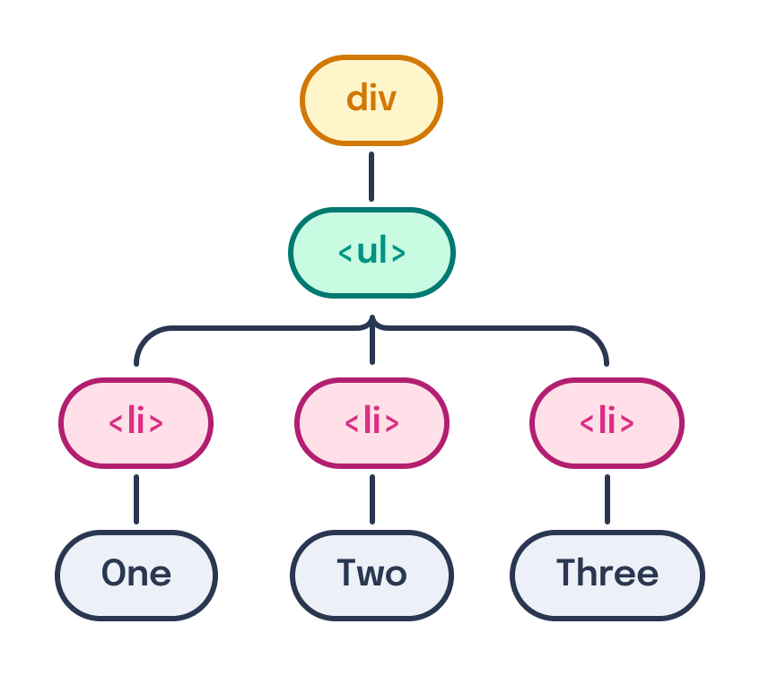
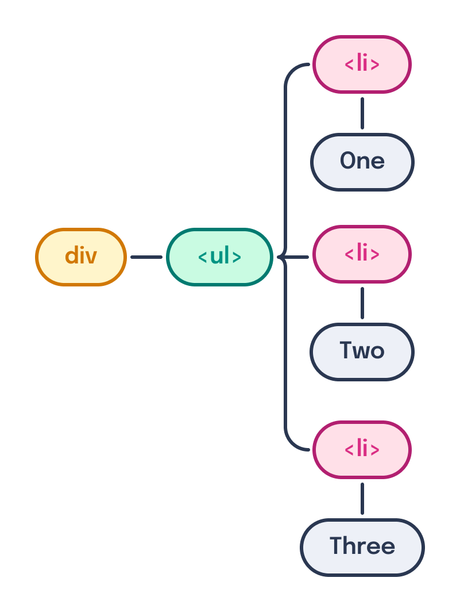
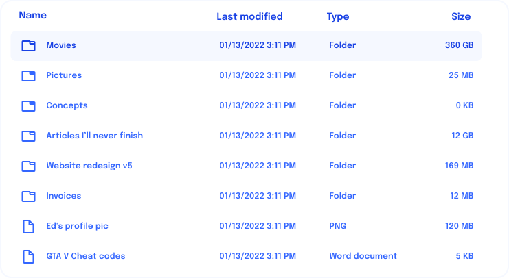
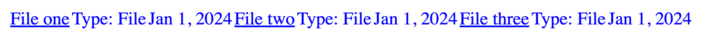

---
{
  title: "Passing Children",
  description: "Just like HTML nodes have parents and children, so too do framework components. Let's learn how React, Angular, and Vue allow you to pass children to your components.",
  published: "2024-03-11T12:07:00.000Z",
  authors: ["crutchcorn"],
  tags: ["react", "angular", "vue", "webdev"],
  attached: [],
  order: 7,
  collection: "framework-field-guide-fundamentals-v1-1",
  noindex: true,
  version: "v1.1",
  upToDateSlug: "ffg-fundamentals-passing-children",
}
---

As we've mentioned before, [in the DOM, your HTML elements have a relationship with respect to one another](/posts/understanding-the-dom).

For example, the following:

```html
<div>
	<ul>
		<li>One</li>
		<li>Two</li>
		<li>Three</li>
	</ul>
</div>
```

Would construct the following DOM tree:



This is how the DOM constructs nodes as parents and children. Notice how the `<li>` is distinctly below the `<ul>` tag rather than a syntax like:

```html
<!-- This isn't correct HTML to do what we want -->
<div
	ul="
        li='One'
        li='Two'
        li='Three'
    "
/>
```

While the above looks strange and counter-intuitive, let's look at how we define the same list if each element is a dedicated component using the methods we've created thus far:

<!-- ::start:tabs -->

# React

```jsx
const ListItem = ({ name }) => {
	return <li>{name}</li>;
};

const List = () => {
	return (
		<ul>
			<ListItem name="One" />
			<ListItem name="Two" />
			<ListItem name="Three" />
		</ul>
	);
};

const Container = () => {
	return (
		<div>
			<List />
		</div>
	);
};
```

# Angular

```angular-ts
@Component({
	selector: "list-item",
	standalone: true,
	template: ` <li>{{ name }}</li> `,
})
class ListItemComponent {
	@Input() name!: string;
}

@Component({
	selector: "app-list",
	standalone: true,
	imports: [ListItemComponent],
	template: `
		<ul>
			<list-item name="One" />
			<list-item name="Two" />
			<list-item name="Three" />
		</ul>
	`,
})
class ListComponent {}

@Component({
	selector: "app-container",
	standalone: true,
	imports: [ListComponent],
	template: `
		<div>
			<app-list />
		</div>
	`,
})
class ContainerComponent {}
```

# Vue

```vue
<!-- ListItem.vue -->
<script setup>
const props = defineProps(["name"]);
</script>

<template>
	<li>{{ props.name }}</li>
</template>
```

```vue
<!-- List.vue -->
<script setup>
import ListItem from "./ListItem.vue";
</script>

<template>
	<ul>
		<ListItem name="One" />
		<ListItem name="Two" />
		<ListItem name="Three" />
	</ul>
</template>
```

```vue
<!-- Container.vue -->
<script setup>
import List from "./List.vue";
</script>

<template>
	<div>
		<List />
	</div>
</template>
```

<!-- ::end:tabs -->

This is fairly similar to that strange fake nested HTML syntax. The alternative component usage syntax that matches closer to the DOM might otherwise look like this:

```jsx
<Component>
	<OtherComponent />
</Component>
```

This mismatch occurs because if we look at how our components are defined, we're building out our previous components **deeply** rather than **broadly**.



This is the difference between building apps with HTML alone and building them with a frontend framework; while the DOM is typically thought of as one-dimensional, there are really two dimensions that are exposed more thoroughly by the framework's ability to construct this tree in a more fine-grained manner.

<!-- ::in-content-ad title="Consider supporting" body="Donating any amount will help towards further development of the Framework Field Guide." button-text="Sponsor my work" button-href="https://github.com/sponsors/crutchcorn/" -->

Let's move the component tree back to being breadth first by using a feature that may sound familiar: Passing children.

# Passing Basic Children {#passing-basic-children}

Before we explore passing children with our frameworks, let's first think of a potential use case for when we want to do this.

For example, say you want the `button` to have a "pressed" effect whenever you click on it. Then, when you click on it for a second time, it unclicks. This might look something like the following:

<!-- ::start:tabs -->

### React

```jsx
const ToggleButton = ({ text }) => {
	const [pressed, setPressed] = useState(false);
	return (
		<button
			onClick={() => setPressed(!pressed)}
			style={{
				backgroundColor: pressed ? "black" : "white",
				color: pressed ? "white" : "black",
			}}
			type="button"
			aria-pressed={pressed}
		>
			{text}
		</button>
	);
};

const ToggleButtonList = () => {
	return (
		<>
			<ToggleButton text="Hello world!" />
			<ToggleButton text="Hello other friends!" />
		</>
	);
};
```

<!-- ::start:no-ebook -->
<iframe data-frame-title="React No Passing Demo - StackBlitz" src="pfp-code:./ffg-fundamentals-react-no-passing-demo-54?template=node&embed=1&file=src%2Fmain.jsx"></iframe>
<!-- ::end:no-ebook -->

### Angular

```angular-ts
@Component({
	selector: "toggle-button",
	standalone: true,
	template: `
		<button
			(click)="togglePressed()"
			[style]="
				pressed
					? 'background-color: black; color: white;'
					: 'background-color: white;color: black'
			"
			type="button"
			[attr.aria-pressed]="pressed"
		>
			{{ text }}
		</button>
	`,
})
class ToggleButtonComponent {
	@Input() text!: string;
	pressed = false;
	togglePressed() {
		this.pressed = !this.pressed;
	}
}

@Component({
	selector: "toggle-button-list",
	standalone: true,
	imports: [ToggleButtonComponent],
	template: `
		<toggle-button text="Hello world!" />
		<toggle-button text="Hello other friends!" />
	`,
})
class ToggleButtonListComponent {}
```

<!-- ::start:no-ebook -->
<iframe data-frame-title="Angular No Passing Demo - StackBlitz" src="pfp-code:./ffg-fundamentals-angular-no-passing-demo-54?template=node&embed=1&file=src%2Fmain.ts"></iframe>
<!-- ::end:no-ebook -->

### Vue

```vue
<!-- ToggleButton.vue -->
<script setup>
import { ref } from "vue";

const pressed = ref(false);

const props = defineProps(["text"]);

function togglePressed() {
	pressed.value = !pressed.value;
}
</script>

<template>
	<button
		@click="togglePressed()"
		:style="
			pressed
				? 'background-color: black; color: white'
				: 'background-color: white; color: black'
		"
		type="button"
		:aria-pressed="pressed"
	>
		{{ props.text || "Test" }}
	</button>
</template>
```

```vue
<!-- ToggleButtonList.vue -->
<script setup>
import ToggleButton from "./ToggleButton.vue";
</script>

<template>
	<ToggleButton text="Hello world!" />
	<ToggleButton text="Hello other friends!" />
</template>
```

<!-- ::start:no-ebook -->
<iframe data-frame-title="Vue No Passing Demo - StackBlitz" src="pfp-code:./ffg-fundamentals-vue-no-passing-demo-54?template=node&embed=1&file=src%2FToggleButtonList.vue"></iframe>
<!-- ::end:no-ebook -->

<!-- ::end:tabs -->

Here, we're passing `text` as a string property to assign text. But oh no! What if we wanted to add a `span` inside of the `button` to add bolded text? After all, if you pass `Hello, <span>world</span>!`, it wouldn't render the `span`, but instead render the `<span>` as text.


Instead, **let's allow the parent of our `ToggleButton` to pass in a template that's then rendered into the component**.

<!-- ::start:tabs -->

### React

In React, JSX that's passed as a child to a component can be accessed through a special `children` component property name:

```jsx
// "children" is a preserved property name by React. It reflects passed child nodes
const ToggleButton = ({ children }) => {
	const [pressed, setPressed] = useState(false);
	return (
		<button
			onClick={() => setPressed(!pressed)}
			style={{
				backgroundColor: pressed ? "black" : "white",
				color: pressed ? "white" : "black",
			}}
			type="button"
			aria-pressed={pressed}
		>
			{/* We then utilize this special property name as any */}
			{/* other JSX variable to display its contents */}
			{children}
		</button>
	);
};

const ToggleButtonList = () => {
	return (
		<>
			<ToggleButton>
				Hello <span style={{ fontWeight: "bold" }}>world</span>!
			</ToggleButton>
			<ToggleButton>Hello other friends!</ToggleButton>
		</>
	);
};
```

<!-- ::start:no-ebook -->
<iframe data-frame-title="React Passing Basic Children - StackBlitz" src="pfp-code:./ffg-fundamentals-react-passing-basic-children-55?template=node&embed=1&file=src%2Fmain.jsx"></iframe>
<!-- ::end:no-ebook -->

### Angular

Angular has a special tag called `ng-content` that acts as a pass-through for all children's content passed to a component.

```angular-ts
@Component({
	selector: "toggle-button",
	standalone: true,
	template: `
		<button
			(click)="togglePressed()"
			[style]="
				pressed
					? 'background-color: black; color: white;'
					: 'background-color: white;color: black'
			"
			type="button"
			[attr.aria-pressed]="pressed"
		>
			<ng-content />
		</button>
	`,
})
class ToggleButtonComponent {
	pressed = false;
	togglePressed() {
		this.pressed = !this.pressed;
	}
}

@Component({
	selector: "toggle-button-list",
	standalone: true,
	imports: [ToggleButtonComponent],
	template: `
		<toggle-button>
			Hello <span style="font-weight: bold;">world</span>!
		</toggle-button>
		<toggle-button>Hello other friends!</toggle-button>
	`,
})
class ToggleButtonListComponent {}
```

<!-- ::start:no-ebook -->
<iframe data-frame-title="Angular Passing Basic Children - StackBlitz" src="pfp-code:./ffg-fundamentals-angular-passing-basic-children-55?template=node&embed=1&file=src%2Fmain.ts"></iframe>
<!-- ::end:no-ebook -->

Because `ng-content` is built into [Angular's compiler](https://blog.angular.dev/how-the-angular-compiler-works-42111f9d2549), we do not need to import anything into our component to use the feature.

### Vue

When in Vue-land, the `slot` tag is used to pass children through to a component's template.

```vue
<!-- ToggleButton.vue -->
<script setup>
import { ref } from "vue";

const pressed = ref(false);

function togglePressed() {
	pressed.value = !pressed.value;
}
</script>

<template>
	<button
		@click="togglePressed()"
		:style="
			pressed
				? 'background-color: black; color: white'
				: 'background-color: white; color: black'
		"
		type="button"
		:aria-pressed="pressed"
	>
		<slot></slot>
	</button>
</template>
```

```vue
<!-- ToggleButtonList.vue -->
<script setup>
import ToggleButton from "./ToggleButton.vue";
</script>

<template>
	<ToggleButton>
		Hello <span style="font-weight: bold">world</span>!
	</ToggleButton>
	<ToggleButton>Hello other friends!</ToggleButton>
</template>
```

<!-- ::start:no-ebook -->
<iframe data-frame-title="Vue Passing Basic Children - StackBlitz" src="pfp-code:./ffg-fundamentals-vue-passing-basic-children-55?template=node&embed=1&file=src%2FToggleButtonList.vue"></iframe>
<!-- ::end:no-ebook -->

Because `slot` is a built-in component of Vue, we do not need to import it from the `vue` package.

<!-- ::end:tabs -->

Here, we're able to pass a `span` and other elements directly to our `ToggleButton` component as _children_.

## Using Other Framework Features with Component Children {#using-other-feats-with-comp-children}

However, because these templates have the full power of the frameworks at their disposal, these _children_ have superpowers! Let's add a `for` loop into our children's template to say hello to all of our friends:

<!-- ::start:tabs -->

### React

```jsx
function ToggleButtonList() {
	const friends = ["Kevin,", "Evelyn,", "and James"];
	return (
		<>
			<ToggleButton>
				Hello{" "}
				{friends.map((friend) => (
					<span>{friend} </span>
				))}
				!
			</ToggleButton>
			<ToggleButton>
				Hello other friends
				<RainbowExclamationMark />
			</ToggleButton>
		</>
	);
}

function RainbowExclamationMark() {
	const rainbowGradient = `
    linear-gradient(
      180deg,
      #fe0000 16.66%,
      #fd8c00 16.66%,
      33.32%,
      #ffe500 33.32%,
      49.98%,
      #119f0b 49.98%,
      66.64%,
      #0644b3 66.64%,
      83.3%,
      #c22edc 83.3%
    )
  `;

	return (
		<span
			style={{
				fontSize: "3rem",
				background: rainbowGradient,
				backgroundSize: "100%",
				WebkitBackgroundClip: "text",
				WebkitTextFillColor: "transparent",
				MozBackgroundClip: "text",
			}}
		>
			!
		</span>
	);
}
```

<!-- ::start:no-ebook -->
<iframe data-frame-title="React Use With Other Features - StackBlitz" src="pfp-code:./ffg-fundamentals-react-use-with-other-features-56?template=node&embed=1&file=src%2Fmain.jsx"></iframe>
<!-- ::end:no-ebook -->

### Angular

```angular-ts
@Component({
	selector: "rainbow-exclamation-mark",
	standalone: true,
	template: ` <span>!</span> `,
	// These styles will only apply to this component
	styles: [
		`
			span {
				font-size: 3rem;
				background: linear-gradient(
					180deg,
					#fe0000 16.66%,
					#fd8c00 16.66%,
					33.32%,
					#ffe500 33.32%,
					49.98%,
					#119f0b 49.98%,
					66.64%,
					#0644b3 66.64%,
					83.3%,
					#c22edc 83.3%
				);
				background-size: 100%;
				-webkit-background-clip: text;
				-webkit-text-fill-color: transparent;
				-moz-background-clip: text;
			}
		`,
	],
})
class RainbowExclamationMarkComponent {}

@Component({
	selector: "toggle-button-list",
	standalone: true,
	imports: [ToggleButtonComponent, RainbowExclamationMarkComponent],
	template: `
		<toggle-button>
			Hello @for (friend of friends; track friend) { <span>{{ friend }} </span> }!
		</toggle-button>
		<toggle-button>
			Hello other friends<rainbow-exclamation-mark />
		</toggle-button>
	`,
})
class ToggleButtonListComponent {
	friends = ["Kevin,", "Evelyn,", "and James"];
}
```

<!-- ::start:no-ebook -->
<iframe data-frame-title="Angular Use With Other Features - StackBlitz" src="pfp-code:./ffg-fundamentals-angular-use-with-other-features-56?template=node&embed=1&file=src%2Fmain.ts"></iframe>
<!-- ::end:no-ebook -->

### Vue

```vue
<!-- ToggleButtonList.vue -->
<script setup>
import ToggleButton from "./ToggleButton.vue";
import RainbowExclamationMark from "./RainbowExclamationMark.vue";

const friends = ["Kevin,", "Evelyn,", "and James"];
</script>

<template>
	<ToggleButton
		>Hello <span v-for="friend of friends">{{ friend }} </span>!</ToggleButton
	>
	<ToggleButton
		>Hello other friends
		<RainbowExclamationMark />
	</ToggleButton>
</template>
```

```vue
<!-- RainbowExclamationMark.vue -->
<template>
	<span>!</span>
</template>

<!-- "scoped" means the styles only apply to this component -->
<style scoped>
span {
	font-size: 3rem;
	background: linear-gradient(
		180deg,
		#fe0000 16.66%,
		#fd8c00 16.66%,
		33.32%,
		#ffe500 33.32%,
		49.98%,
		#119f0b 49.98%,
		66.64%,
		#0644b3 66.64%,
		83.3%,
		#c22edc 83.3%
	);
	background-size: 100%;
	-webkit-background-clip: text;
	-webkit-text-fill-color: transparent;
	-moz-background-clip: text;
}
</style>
```

<!-- ::start:no-ebook -->
<iframe data-frame-title="Vue Use With Other Features - StackBlitz" src="pfp-code:./ffg-fundamentals-vue-use-with-other-features-56?template=node&embed=1&file=src%2FToggleButtonList.vue"></iframe>
<!-- ::end:no-ebook -->

<!-- ::end:tabs -->

As you can see, we can use any features inside our `children` - even other components!

> [Thanks to Sarah Fossheim for the guide on how to add clipped background text like our exclamation mark!](https://fossheim.io/writing/posts/css-text-gradient/)

# Named Children {#named-children}

While passing one set of elements is useful in its own right, many components require there to be more than one "slot" of data you can pass.

For example, take this dropdown component:

<details>
<summary>Let's build this dropdown component</summary>
These tend to be useful for FAQ pages, hidden content, and more!
</details>

This dropdown component has two potential places where passing elements would be beneficial:

```html
<Dropdown>
	<DropdownHeader>Let's build this dropdown component</DropdownHeader>
	<DropdownBody>
		These tend to be useful for FAQ pages, hidden contents, and more!
	</DropdownBody>
</Dropdown>
```

Let's build this component with an API similar to the above using "named children."

<!-- ::start:tabs -->

## React

Something worth reminding is that JSX constructs a value, just like a number or string, that you can then store to a variable.

```jsx
const table = <p>Test</p>;
```

This can be passed to a function, like `console.log`, or anything any other JavaScript value can do.

```jsx
console.log(<p>Test</p>); // ReactElement
```

Because of this behavior, to pass more than one JSX value to a component, we can use function parameters and pass them that way.

```jsx
const Dropdown = ({ children, header, expanded, toggle }) => {
	return (
		<>
			<button
				onClick={toggle}
				aria-expanded={expanded}
				aria-controls="dropdown-contents"
			>
				{expanded ? "V" : ">"} {header}
			</button>
			<div id="dropdown-contents" role="region" hidden={!expanded}>
				{children}
			</div>
		</>
	);
};

function App() {
	const [expanded, setExpanded] = useState(false);
	return (
		<Dropdown
			expanded={expanded}
			toggle={() => setExpanded(!expanded)}
			header={<>Let's build this dropdown component</>}
		>
			These tend to be useful for FAQ pages, hidden contents, and more!
		</Dropdown>
	);
}
```

<!-- ::start:no-ebook -->
<iframe data-frame-title="React Named Children - StackBlitz" src="pfp-code:./ffg-fundamentals-react-named-children-57?template=node&embed=1&file=src%2Fmain.jsx"></iframe>
<!-- ::end:no-ebook -->

## Angular

`ng-content` allows you to pass a `select` property to have specific children projected in dedicated locations. This `select` property takes [CSS selector query values](https://developer.mozilla.org/en-US/docs/Web/CSS/CSS_Selectors). Knowing this, we can pass the attribute query for `header` by wrapping the attribute name in square brackets like so:

```angular-ts
@Component({
	selector: "dropdown-comp",
	standalone: true,
	template: `
		<button
			(click)="toggle.emit()"
			:aria-expanded="expanded"
			aria-controls="dropdown-contents"
		>
			{{ expanded ? "V" : ">" }} <ng-content select="[header]" />
		</button>
		<div id="dropdown-contents" role="region" [hidden]="!expanded">
			<ng-content />
		</div>
	`,
})
class DropdownComponent {
	@Input() expanded!: boolean;
	@Output() toggle = new EventEmitter();
}

@Component({
	selector: "app-root",
	standalone: true,
	imports: [DropdownComponent],
	template: `
		<dropdown-comp [expanded]="expanded" (toggle)="expanded = !expanded">
			<ng-container header>Let's build this dropdown component</ng-container>
			These tend to be useful for FAQ pages, hidden contents, and more!
		</dropdown-comp>
	`,
})
class AppComponent {
	expanded = false;
}
```

<!-- ::start:no-ebook -->
<iframe data-frame-title="Angular Named Children - StackBlitz" src="pfp-code:./ffg-fundamentals-angular-named-children-57?template=node&embed=1&file=src%2Fmain.ts"></iframe>
<!-- ::end:no-ebook -->

Once `ng-content` finds related elements that match the `select` query, they will be content projected into the appropriate locations. If not matched by a `ng-content[select]`, they will be projected to a non `select` enabled `ng-content`.

## Vue

Similar to how Angular's `ng-content[select]` query works, Vue allows you to pass a `name` to the `slot` component to a projected and named content.

```vue
<!-- Dropdown.vue -->
<script setup>
const props = defineProps(["expanded"]);

const emit = defineEmits(["toggle"]);
</script>

<template>
	<button
		@click="emit('toggle')"
		:aria-expanded="expanded"
		aria-controls="dropdown-contents"
	>
		{{ props.expanded ? "V" : ">" }} <slot name="header" />
	</button>
	<div id="dropdown-contents" role="region" :hidden="!props.expanded">
		<slot />
	</div>
</template>
```

```vue
<!-- App.vue -->
<script setup>
import { ref } from "vue";
import Dropdown from "./Dropdown.vue";

const expanded = ref(false);
</script>

<template>
	<Dropdown :expanded="expanded" @toggle="expanded = !expanded">
		<template v-slot:header>Let's build this dropdown component</template>
		These tend to be useful for FAQ pages, hidden contents, and more!
	</Dropdown>
</template>
```

Here, we can see that `slot` is querying for a `header` template slot. This query is then satisfied by `App`'s template for the heading `template` element.

`v-slot` also has a shorthand of `#`, similar to how `v-bind` has a shorthand of `:`. Using this shorthand, we can modify our `App` component to look like:

```vue {11}
<!-- App.vue -->
<script setup>
import { ref } from "vue";
import Dropdown from "./Dropdown.vue";

const expanded = ref(false);
</script>

<template>
	<Dropdown :expanded="expanded" @toggle="expanded = !expanded">
		<template #header>Let's build this dropdown component</template>
		These tend to be useful for FAQ pages, hidden contents, and more!
	</Dropdown>
</template>
```

<!-- ::start:no-ebook -->
<iframe data-frame-title="Vue Named Children - StackBlitz" src="pfp-code:./ffg-fundamentals-vue-named-children-57?template=node&embed=1&file=src%2FApp.vue"></iframe>
<!-- ::end:no-ebook -->

<!-- ::end:tabs -->

> A simple version of this dropdown component is actually built into the browser as [`<details>`](https://developer.mozilla.org/en-US/docs/Web/HTML/Element/details) and [`<summary>`](https://developer.mozilla.org/en-US/docs/Web/HTML/Element/summary) HTML tags. Building our own is an experiment intended mostly for learning. For production environment, it's highly suggested to use those built-in elements instead.

# Using Passed Children to Build a Table {#passing-children-table}

Now that we're familiar with how to pass a child to a component, let's apply it to one of the components we've been building for our file hosting application: our files "list."



While this _does_ constitute a list of files, there are actually two dimensions of data: Down and right. This makes this "list" really more of a "table". As such, it's actually a bit of a misconception to use the Unordered List (`<ul>`) and List Item (`<li>`) elements for this specific UI element.

Instead, let's build out an HTML `table` element. A normal HTML table might look something like this:

```html
<table>
	<thead>
		<tr>
			<th>Name</th>
		</tr>
	</thead>
	<tbody>
		<tr>
			<td>Movies</td>
		</tr>
	</tbody>
</table>
```

Where `th` acts as a heading data item, and `td` acts as a bit of data on a given row and column.

Let's refactor our file list to use this DOM layout:

<!-- ::start:tabs -->

## React

```jsx
const File = ({ href, fileName, isSelected, onSelected, isFolder }) => {
	const [inputDate, setInputDate] = useState(new Date());

	// ...

	return (
		<tr
			onClick={onSelected}
			aria-selected={isSelected}
			style={
				isSelected
					? { backgroundColor: "blue", color: "white" }
					: { backgroundColor: "white", color: "blue" }
			}
		>
			<td>
				<a href={href} style={{ color: "inherit" }}>
					{fileName}
				</a>
			</td>
			<td>{isFolder ? "Type: Folder" : "Type: File"}</td>
			<td>{!isFolder && <FileDate inputDate={inputDate} />}</td>
		</tr>
	);
};

const filesArray = [
	{
		fileName: "File one",
		href: "/file/file_one",
		isFolder: false,
	},
	{
		fileName: "File two",
		href: "/file/file_two",
		isFolder: false,
	},
	{
		fileName: "File three",
		href: "/file/file_three",
		isFolder: false,
	},
];

// This was previously called "FileList"
const FileTableBody = () => {
	// ...
	return (
		<tbody>
			{filesArray.map((file) => {
				return (
					<Fragment key={file.id}>
						{!file.isFolder && (
							<File
								fileName={file.fileName}
								href={file.href}
								isSelected={false}
								isFolder={file.isFolder}
								onSelected={() => {}}
							/>
						)}
					</Fragment>
				);
			})}
		</tbody>
	);
};

// This is a new component
const FileTable = () => {
	return (
		<table style={{ borderSpacing: 0 }}>
			<FileTableBody />
		</table>
	);
};
```

<!-- ::start:no-ebook -->
<iframe data-frame-title="React File Table - StackBlitz" src="pfp-code:./ffg-fundamentals-react-file-table-58?template=node&embed=1&file=src%2Fmain.jsx"></iframe>
<!-- ::end:no-ebook -->

## Angular

Angular is unlike the other frameworks covered in this book. For example, let's say we port the table components from the other frameworks one-to-one into Angular.

```angular-ts
@Component({
	selector: "file-item",
	standalone: true,
	imports: [FileDateComponent],
	template: `
		<tr [attr.aria-selected]="isSelected" (click)="selected.emit()">
			<!-- Removed other children for readability -->
			<td>
				<a [href]="href" style="color: inherit">{{ fileName }}</a>
			</td>
		</tr>
	`,
})
class FileComponent {
	// ...
}

@Component({
	selector: "file-table-body",
	standalone: true,
	imports: [FileComponent],
	template: `
		<tbody>
			@for (file of filesArray; let i = $index; track file.id) {
				<!-- Removed props for readability -->
				<file-item />
			}
		</tbody>
	`,
})
class FileTableBody {
	// ...
}

@Component({
	selector: "file-table",
	standalone: true,
	imports: [FileTableBody],
	template: `
		<table style="border-spacing: 0;">
			<file-table-body />
		</table>
	`,
})
class FileTableComponent {}
```

If we render this, we'll see the following incorrectly formatted table:



<!-- ::start:no-ebook -->
<iframe data-frame-title="Angular Broken File Table - StackBlitz" src="pfp-code:./ffg-fundamentals-angular-broken-file-table-58?template=node&embed=1&file=src%2Fmain.ts"></iframe>
<!-- ::end:no-ebook -->

> This table is not formatted correctly. Where are the rows? Why is everything horizontally lined up next to one-another?

This is because if you look at the output of the `FileTableComponent` being rendered, you'll find the following markup:

```html
<file-table>
	<table>
		<file-table-body>
			<tbody>
				<file-item>
					<tr>
						<td><a>File one</a></td>
					</tr>
				</file-item>
				<file-item>
					<tr>
						<td><a>File two</a></td>
					</tr>
				</file-item>
				<file-item>
					<tr>
						<td><a>File three</a></td>
					</tr>
				</file-item>
			</tbody>
		</file-table-body>
	</table>
</file-table>
```

Here, you'll notice that the `<tbody>` isn't under `<table>`; it's under a `<file-table-body>` in between those two elements. Similarly, `<tr>` isn't under `<tbody>`, it's under `<file-item>`.

These changes to the markup are not allowed or understood by the HTML specification, which is why our table is formatted so weirdly.

Instead, our markup needs to look like this:

```html
<file-table>
	<table>
		<tbody>
			<tr>
				<td><a>File one</a></td>
			</tr>
			<tr>
				<td><a>File two</a></td>
			</tr>
			<tr>
				<td><a>File three</a></td>
			</tr>
		</tbody>
	</table>
</file-table>
```

> Why doesn't our markup look like that already?

The reason our markup isn't correct is that we're creating non-default host elements in our Angular components.

### Angular Host Elements and Bindings {#angular-host-elements}

> What are Angular host elements?

When you use a `selector` in Angular to create an element, that selector stays in the DOM:

```angular-ts
@Component({
	selector: "list-item",
	standalone: true,
	template: "",
})
class ListItemComponent {}
```

Rendering this component will yield the following DOM elements:

```html
<list-item></list-item>
```

This `list-item` selector-named element is known as a component's "host element." This host element preservation is different from how React and Vue work, which don't have the concept of in-DOM host nodes.

> [I've written more about host elements in my article on the topic](/posts/angular-templates-dont-work-how-you-think). Please read this if you're left a bit confused on how host elements work.

At first, this might seem like a roadblock to implementing our `list-item` component properly. However, there are two features that we can use to fix this problem:

1. Selecting HTML elements with an attribute name
2. Host element element/property binding

Combined, this might look something like this:

```angular-ts
@Component({
	selector: "tr[file-item]",
	standalone: true,
	host: {
		"(click)": "selected.emit()",
		"[style]": `
			isSelected ?
				'background-color: blue; color: white' :
				'background-color: white; color: blue'
		`,
	},
	template: ` <td>{{ fileName }}</td> `,
})
class FileItemComponent {
	@Input() fileName: string;
	@Input() isSelected: boolean;
	@Output() selected = new EventEmitter();
}
```

Where `host` allows us to bind our typical event handlers and attributes to the `tr` element selected by our new `selector` of `tr[file-item]`.

> The host element might seem confusing at first, but is super useful in the right contexts. [See my article on the property for more information.](/posts/angular-dynamic-host-usage)

### Building a Functional Angular Table {#functional-angular-table}

Knowing how `host` and `selector` can properly work together, let's finally build the Angular table that we wanted to from the start:

```angular-ts
@Component({
	selector: "tr[file-item]",
	standalone: true,
	imports: [FileDateComponent],
	host: {
		"[attr.aria-selected]": "isSelected",
		"(click)": "selected.emit()",
		"[style]": `
			isSelected ?
				'background-color: blue; color: white' :
				'background-color: white; color: blue'
		`,
	},
	template: `
		<td>
			<a [href]="href" style="color: inherit">{{ fileName }}</a>
		</td>
		@if (isFolder) {
			<td>Type: Folder</td>
		} else {
			<td>Type: File</td>
		}
		<td>
			@if (!isFolder) {
				<file-date [inputDate]="inputDate" />
			}
		</td>
	`,
})
class FileComponent implements OnInit, OnDestroy {
	@Input() fileName!: string;
	@Input() href!: string;
	@Input() isSelected!: boolean;
	@Input() isFolder!: boolean;
	@Output() selected = new EventEmitter();
	inputDate = new Date();

	// ...
}

// This was previously called "FileList"
@Component({
	selector: "tbody[file-table-body]",
	standalone: true,
	imports: [FileComponent],
	template: `
		@for (file of filesArray; let i = $index; track file.id) {
			@if (!file.isFolder) {
				<tr
					file-item
					[isSelected]="false"
					[fileName]="file.fileName"
					[href]="file.href"
					[isFolder]="file.isFolder"
				></tr>
			}
		}
	`,
})
class FileTableBodyComponent {
	filesArray: File[] = [
		{
			fileName: "File one",
			href: "/file/file_one",
			isFolder: false,
			id: 1,
		},
		{
			fileName: "File two",
			href: "/file/file_two",
			isFolder: false,
			id: 2,
		},
		// ...
	];
}

// This is a new component
@Component({
	selector: "file-table",
	standalone: true,
	imports: [FileTableBody],
	template: `
		<table style="border-spacing: 0;">
			<tbody file-table-body></tbody>
		</table>
	`,
})
class FileTableComponent {}
```

<!-- ::start:no-ebook -->
<iframe data-frame-title="Angular File Table - StackBlitz" src="pfp-code:./ffg-fundamentals-angular-file-table-58?template=node&embed=1&file=src%2Fmain.ts"></iframe>
<!-- ::end:no-ebook -->

## Vue

```vue
<!-- File.vue -->
<script setup>
import { ref } from "vue";
import FileDate from "./FileDate.vue";

const props = defineProps(["fileName", "href", "isSelected", "isFolder"]);
const emit = defineEmits(["selected"]);

const inputDate = ref(new Date());

// ...
</script>

<template>
	<tr
		@click="emit('selected')"
		:aria-selected="props.isSelected"
		:style="
			props.isSelected
				? { backgroundColor: 'blue', color: 'white' }
				: { backgroundColor: 'white', color: 'blue' }
		"
	>
		<td>
			<a :href="props.href" style="color: inherit">{{ props.fileName }}</a>
		</td>
		<td v-if="props.isFolder">Type: Folder</td>
		<td v-else>Type: File</td>
		<td><FileDate v-if="!props.isFolder" :inputDate="inputDate" /></td>
	</tr>
</template>
```

```vue
<!-- FileTableBody -->
<!-- This was previously called "FileList" -->
<script setup>
import File from "./File.vue";

// ...

const filesArray = [
	{
		fileName: "File one",
		href: "/file/file_one",
		isFolder: false,
	},
	{
		fileName: "File two",
		href: "/file/file_two",
		isFolder: false,
	},
	{
		fileName: "File three",
		href: "/file/file_three",
		isFolder: false,
	},
];
</script>

<template>
	<tbody>
		<template v-for="file in filesArray">
			<File
				v-if="!file.isFolder"
				:fileName="file.fileName"
				:href="file.href"
				:isFolder="file.isFolder"
				:isSelected="false"
			/>
		</template>
	</tbody>
</template>
```

```vue
<!-- FileTable.vue -->
<script setup>
import FileTableBody from "./FileTableBody.vue";
</script>

<template>
	<table>
		<FileTableBody />
	</table>
</template>
```

<!-- ::start:no-ebook -->
<iframe data-frame-title="Vue File Table - StackBlitz" src="pfp-code:./ffg-fundamentals-vue-file-table-58?template=node&embed=1&file=src%2FFileTable.vue"></iframe>
<!-- ::end:no-ebook -->

<!-- ::end:tabs -->

<!-- Author's note: It's not clear what the best A11Y pattern is here. The best guide for this seems to be an incomplete WCAG guide -->

<!-- https://w3c.github.io/aria-practices/examples/grid/advancedDataGrid.html -->

<!-- That said, it seems like the best overall pattern here is that the row selection should have `aria-selected` (not `aria-pressed`) with the information present -->

---

Now that we have an explicit `FileTable` component, let's see if we're able to style it a bit more with a replacement `FileTableContainer` component, which uses passing children to style the underlying `table` element.

<!-- ::start:tabs -->

## React

```jsx
const FileTableContainer = ({ children }) => {
	return (
		<table
			style={{
				color: "#3366FF",
				border: "2px solid #3366FF",
				borderSpacing: 0,
				padding: "0.5rem",
			}}
		>
			{children}
		</table>
	);
};

const FileTable = () => {
	return (
		<FileTableContainer>
			<FileTableBody />
		</FileTableContainer>
	);
};
```

<!-- ::start:no-ebook -->
<iframe data-frame-title="React File Table Container - StackBlitz" src="pfp-code:./ffg-fundamentals-react-file-table-container-59?template=node&embed=1&file=src%2Fmain.jsx"></iframe>
<!-- ::end:no-ebook -->

## Angular

```angular-ts
@Component({
	selector: "file-table-container",
	standalone: true,
	template: `
		<table
			style="color: #3366FF; border: 2px solid #3366FF; border-spacing: 0; padding: 0.5rem"
		>
			<ng-content></ng-content>
		</table>
	`,
})
class FileTableContainerComponent {}

@Component({
	selector: "file-table",
	standalone: true,
	imports: [FileTableContainerComponent, FileTableBody],
	template: `
		<file-table-container><tbody file-table-body /></file-table-container>
	`,
})
class FileTableComponent {}
```

<!-- ::start:no-ebook -->
<iframe data-frame-title="Angular File Table Container - StackBlitz" src="pfp-code:./ffg-fundamentals-angular-file-table-container-59?template=node&embed=1&file=src%2Fmain.ts"></iframe>
<!-- ::end:no-ebook -->

## Vue

```vue
<!-- FileTableContainer.vue -->
<template>
	<table
		style="
			color: #3366ff;
			border: 2px solid #3366ff;
			border-spacing: 0;
			padding: 0.5rem;
		"
	>
		<slot></slot>
	</table>
</template>
```

```vue
<!-- FileTable.vue -->
<script setup>
import FileTableContainer from "./FileTableContainer.vue";
import FileTableBody from "./FileTableBody.vue";
</script>

<template>
	<FileTableContainer><FileTableBody /></FileTableContainer>
</template>
```

<!-- ::start:no-ebook -->
<iframe data-frame-title="Vue File Table Container - StackBlitz" src="pfp-code:./ffg-fundamentals-vue-file-table-container-59?template=node&embed=1&file=src%2FFileTable.vue"></iframe>
<!-- ::end:no-ebook -->

<!-- ::end:tabs -->

# Challenge {#challenge}

Let's make this chapter's challenge a continuation of the table that we just built in the last section. See, our previous table only had the files themselves, not the header. Let's change that by adding in a second set of children we can pass, like so:

```jsx
<table>
	<FileHeader />
	<FileList />
</table>
```

<!-- ::start:tabs -->

## React

```jsx
const FileTableContainer = ({ children, header }) => {
	return (
		<table
			style={{
				color: "#3366FF",
				border: "2px solid #3366FF",
				padding: "0.5rem",
				borderSpacing: 0,
			}}
		>
			<thead>{header}</thead>
			{children}
		</table>
	);
};

const FileTable = () => {
	const headerEl = (
		<tr>
			<th>Name</th>
			<th>File Type</th>
			<th>Date</th>
		</tr>
	);

	return (
		<FileTableContainer header={headerEl}>
			<FileTableBody />
		</FileTableContainer>
	);
};
```

<!-- ::start:no-ebook -->

<details>

<summary>Final code output</summary>

<iframe data-frame-title="React Passing Challenge - StackBlitz" src="pfp-code:./ffg-fundamentals-react-passing-challenge-60?template=node&embed=1&file=src%2Fmain.jsx"></iframe>

</details>

<!-- ::end:no-ebook -->

## Angular

```angular-ts
@Component({
	selector: "file-table-container",
	standalone: true,
	template: `
		<table
			style="color: #3366FF; border: 2px solid #3366FF; border-spacing: 0; padding: 0.5rem"
		>
			<thead>
				<ng-content select="[header]"></ng-content>
			</thead>
			<ng-content></ng-content>
		</table>
	`,
})
class FileTableContainerComponent {}

@Component({
	selector: "file-table",
	standalone: true,
	imports: [FileTableContainerComponent, FileTableBodyComponent],
	template: `
		<file-table-container>
			<tr header>
				<th>Name</th>
				<th>Date</th>
			</tr>
			<file-table-body />
		</file-table-container>
	`,
})
class FileTableComponent {}
```

<!-- ::start:no-ebook -->

<details>

<summary>Final code output</summary>

<iframe data-frame-title="Angular Passing Challenge - StackBlitz" src="pfp-code:./ffg-fundamentals-angular-passing-challenge-60?template=node&embed=1&file=src%2Fmain.ts"></iframe>

</details>

<!-- ::end:no-ebook -->

## Vue

```vue
<!-- FileTableContainer.vue -->
<template>
	<table
		style="
			color: #3366ff;
			border: 2px solid #3366ff;
			border-spacing: 0;
			padding: 0.5rem;
		"
	>
		<thead>
			<slot name="header"></slot>
		</thead>
		<slot></slot>
	</table>
</template>
```

```vue
<!-- FileTable.vue -->
<script setup>
import FileTableContainer from "./FileTableContainer.vue";
import FileTableBody from "./FileTableBody.vue";
</script>

<template>
	<FileTableContainer>
		<template #header>
			<tr>
				<th>Name</th>
				<th>File Type</th>
				<th>Date</th>
			</tr>
		</template>
		<FileTableBody />
	</FileTableContainer>
</template>
```

<!-- ::start:no-ebook -->

<details>

<summary>Final code output</summary>

<iframe data-frame-title="Vue Passing Challenge - StackBlitz" src="pfp-code:./ffg-fundamentals-vue-passing-challenge-60?template=node&embed=1&file=src%2FFileTable.vue"></iframe>

</details>

<!-- ::end:no-ebook -->

<!-- ::end:tabs -->
