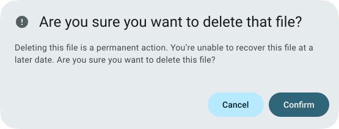
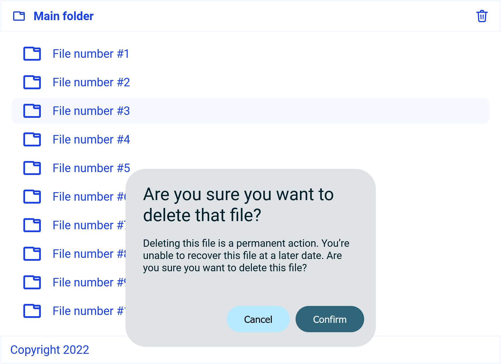
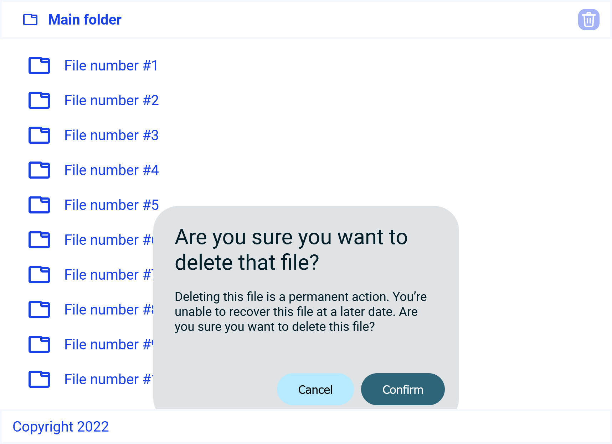
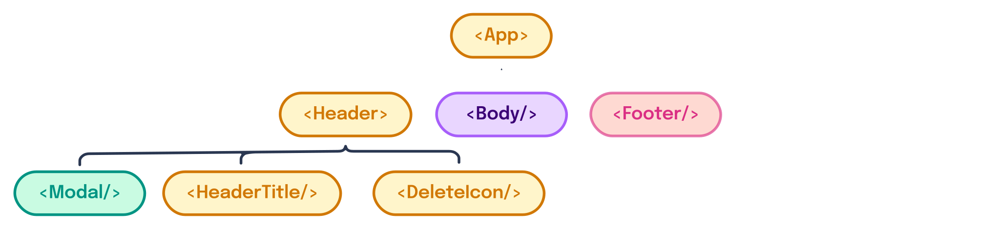
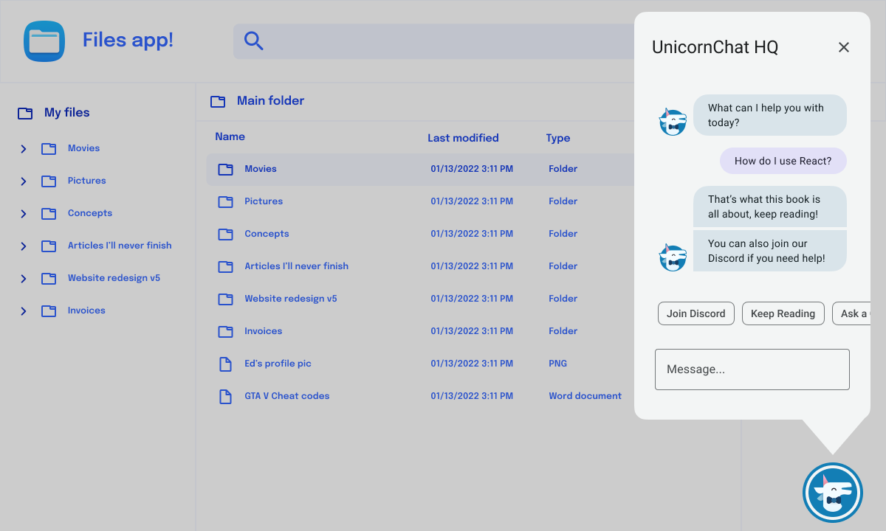
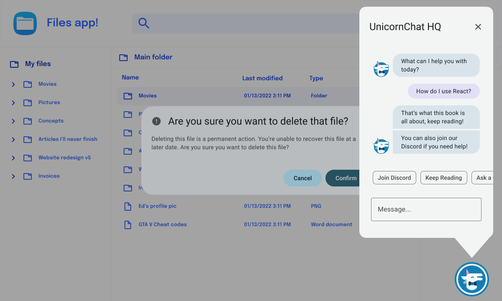
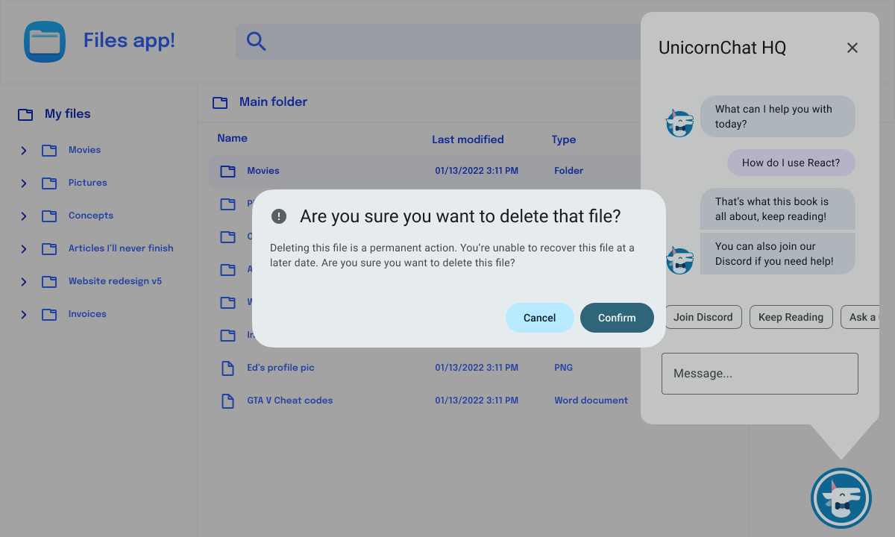
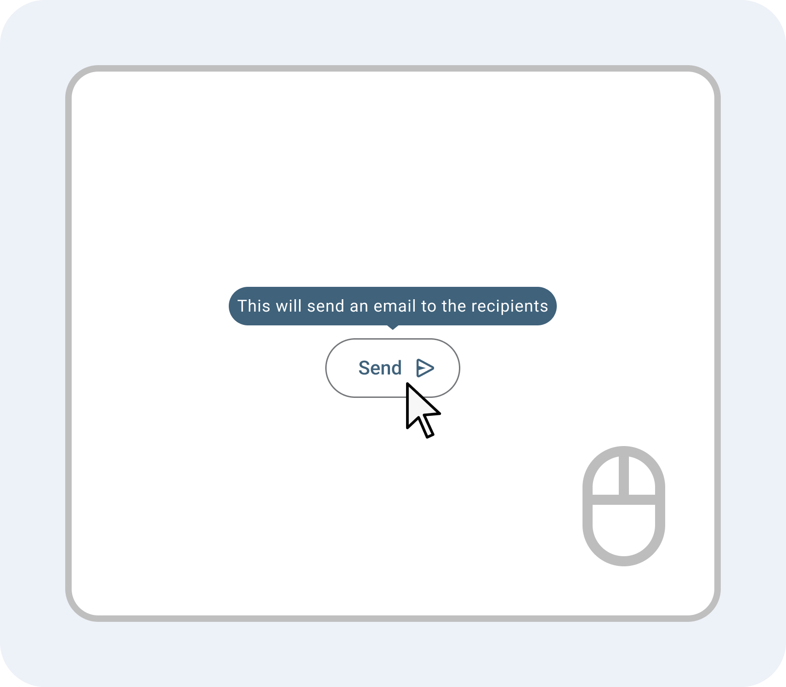
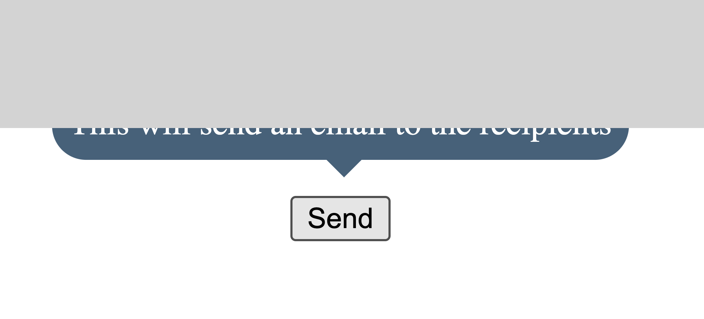

---
{
  title: "Portals",
  description: "When building an app in React, Angular, or Vue, you'll often find that overlapping components can become a real problem. Rendering order can be confusing; let's fix that with portals.",
  published: "2024-03-11T12:12:00.000Z",
  authors: ["crutchcorn"],
  tags: ["react", "angular", "vue", "webdev"],
  attached: [],
  order: 12,
  collection: "framework-field-guide-fundamentals-v1-1",
  noindex: true,
  version: "v1.1",
  upToDateSlug: "ffg-fundamentals-portals",
}
---

Do you ever start up your favorite application, click an action button, and then **boom**, there's a popup from the application about your interaction?

For example, you might click the "delete" button and then be greeted by a "Are you sure you'd like to delete the file?" pop-up.



These are called "modals" and, [despite the anguish of many developers](https://modalzmodalzmodalz.com), they're widely used as a method to grab a user's attention in applications of all kinds.

You may be surprised to learn that they can be challenging to implement despite their ubiquity.

However, you may not be surprised to learn that these modals are so common that **there's an API in React, Angular, and Vue that makes modals easier to implement**, an API that's almost exclusively for these kinds of modal components.

What is this API called? **Portals**.

Why do we need a dedicated API for this use case? **CSS**.

# The Problem with Modals; CSS Stacking Contexts {#stacking-contexts}

Let's build the "Delete file" modal we saw in our framework of choice:

<!-- ::start:tabs -->

## React

```jsx
const Modal = () => {
	return (
		<div>
			<div class="modal-container">
				<h1 class="title">Are you sure you want to delete that file?</h1>
				<p class="body-text">
					Deleting this file is a permanent action. You’re unable to recover
					this file at a later date. Are you sure you want to delete this file?
				</p>
				<div class="buttons-container">
					<button class="cancel">Cancel</button>
					<button class="confirm">Confirm</button>
				</div>
			</div>
		</div>
	);
};
```

## Angular

```angular-ts
@Component({
	selector: "delete-modal",
	standalone: true,
	template: `
		<div>
			<div class="modal-container">
				<h1 class="title">Are you sure you want to delete that file?</h1>
				<p class="body-text">
					Deleting this file is a permanent action. You’re unable to recover
					this file at a later date. Are you sure you want to delete this file?
				</p>
				<div class="buttons-container">
					<button class="cancel">Cancel</button>
					<button class="confirm">Confirm</button>
				</div>
			</div>
		</div>
	`,
})
class ModalComponent {}
```

## Vue

```vue
<!-- Modal.vue -->
<template>
	<div>
		<div class="modal-container">
			<h1 class="title">Are you sure you want to delete that file?</h1>
			<p class="body-text">
				Deleting this file is a permanent action. You’re unable to recover this
				file at a later date. Are you sure you want to delete this file?
			</p>
			<div class="buttons-container">
				<button class="cancel">Cancel</button>
				<button class="confirm">Confirm</button>
			</div>
		</div>
	</div>
</template>
```

<!-- ::end:tabs -->

<br/>

<!-- ::start:no-ebook -->

<details>
<summary>
CSS for the modal
</summary>

<br/>

```css
.modal-container {
	position: fixed;
	top: 50%;
	left: 50%;
	transform: translateX(-50%) translateY(-50%);
	padding: 20px 0px 0px;
	background: #e0e3e5;
	border-radius: 28px;
	font-family: "Roboto", sans-serif;
	color: #001f28;
}

.title {
	margin: 0;
	padding: 0px 24px 16px;
	font-size: 24px;
	font-weight: 400;
}

.body-text {
	margin: 0;
	padding: 0px 24px 24px;
	font-size: 14px;
}

.buttons-container {
	display: flex;
	justify-content: flex-end;
	padding: 16px;
	gap: 8px;
}

.buttons-container button {
	margin: 4px 0;
	padding: 10px 24px;
	border-radius: 1000px;
	border: none;
}

.cancel {
	background: #b8eaff;
}

.cancel:hover {
	filter: brightness(0.8);
}

.cancel:active {
	filter: brightness(0.6);
}

.confirm {
	background: #2e6578;
	color: white;
}

.confirm:hover {
	filter: brightness(1.4);
}

.confirm:active {
	filter: brightness(1.8);
}
```

</details>

<!-- ::end:no-ebook -->

Now that we have that modal, let's build a small version of the folder app we've been building in this book. This version of the app should showcase the modal, the header, and a copyright footer:



<!-- ::start:tabs -->

## React

```jsx
const App = () => {
	return (
		<div>
			<Header />
			<Body />
			<Footer />
		</div>
	);
};
```

```jsx
const Header = () => {
	return (
		<>
			<div class="header-container">
				<span class="icon-container">
					<FolderIcon />
				</span>
				<span class="header-title">Main folder</span>
				<span class="auto"></span>
				<button class="icon-btn">
					<DeleteIcon />
				</button>
			</div>
		</>
	);
};
```

```jsx
const Body = () => {
	return (
		<ul class="list-container">
			{Array.from({ length: 10 }, (_, i) => (
				<li class="list-item">
					<FolderIcon />
					<span>File number #{i + 1}</span>
				</li>
			))}
		</ul>
	);
};
```

```jsx
const Footer = () => {
	return <div class="footer-container">Copyright 2022</div>;
};
```

<!-- ::start:no-ebook -->

```jsx
const DeleteIcon = () => {
	return (
		<svg viewBox="0 0 20 21">
			<path d="M9 8V16H7.5L7 8H9Z" fill="currentColor" />
			<path d="M12.5 16L13 8H11V16H12.5Z" fill="currentColor" />
			<path
				d="M8 0C7.56957 0 7.18743 0.27543 7.05132 0.683772L6.27924 3H1C0.447715 3 0 3.44772 0 4C0 4.55228 0.447715 5 1 5H2.56055L3.38474 18.1871C3.48356 19.7682 4.79471 21 6.3789 21H13.6211C15.2053 21 16.5164 19.7682 16.6153 18.1871L17.4395 5H19C19.5523 5 20 4.55228 20 4C20 3.44772 19.5523 3 19 3H13.7208L12.9487 0.683772C12.8126 0.27543 12.4304 0 12 0H8ZM12.9767 5C12.9921 5.00036 13.0076 5.00036 13.0231 5H15.4355L14.6192 18.0624C14.5862 18.5894 14.1492 19 13.6211 19H6.3789C5.85084 19 5.41379 18.5894 5.38085 18.0624L4.56445 5H6.97694C6.99244 5.00036 7.00792 5.00036 7.02334 5H12.9767ZM11.6126 3H8.38743L8.72076 2H11.2792L11.6126 3Z"
				fill="currentColor"
			/>
		</svg>
	);
};
```

```jsx
const FolderIcon = () => {
	return (
		<svg viewBox="0 0 20 16">
			<path
				d="M20 14C20 15.1046 19.1046 16 18 16H2C0.895431 16 0 15.1046 0 14V2C0 0.895431 0.89543 0 2 0H11C11.7403 0 12.3866 0.402199 12.7324 1H18C19.1046 1 20 1.89543 20 3V14ZM11 4V2H2V14H18V6H13C11.8954 6 11 5.10457 11 4ZM13 3V4H18V3H13Z"
				fill="currentColor"
			/>
		</svg>
	);
};
```

<!-- ::end:no-ebook -->

<!-- ::start:only-ebook -->

```jsx
const DeleteIcon = () => {
	return <svg viewBox="0 0 20 21">{/*	... */}</svg>;
};
```

```jsx
const FolderIcon = () => {
	return <svg viewBox="0 0 20 16">{/*	... */}</svg>;
};
```

<!-- ::end:only-ebook -->

## Angular

```angular-ts
@Component({
	selector: "app-root",
	standalone: true,
	imports: [HeaderComponent, BodyComponent, FooterComponent],
	template: `
		<div>
			<header-comp />
			<body-comp />
			<footer-comp />
		</div>
	`,
})
class AppComponent {}
```

```angular-ts
@Component({
	selector: "header-comp",
	standalone: true,
	imports: [FolderIconComponent, DeleteIconComponent],
	template: `
		<div class="header-container">
			<span class="icon-container">
				<folder-icon />
			</span>
			<span class="header-title">Main folder</span>
			<span class="auto"></span>
			<button class="icon-btn">
				<delete-icon />
			</button>
		</div>
	`,
})
class HeaderComponent {}
```

```angular-ts
@Component({
	selector: "body-comp",
	standalone: true,
	imports: [FolderIconComponent],
	template: `
		<ul class="list-container">
			@for (fileIdx of files; track fileIdx) {
				<li class="list-item">
					<folder-icon />
					<span>File number {{ fileIdx + 1 }}</span>
				</li>
			}
		</ul>
	`,
})
class BodyComponent {
	files = Array.from({ length: 10 }, (_, i) => i);
}
```

```angular-ts
@Component({
	selector: "footer-comp",
	standalone: true,
	template: ` <div class="footer-container">Copyright 2022</div> `,
})
class FooterComponent {}
```

<!-- ::start:no-ebook -->

```angular-ts
@Component({
	selector: "folder-icon",
	standalone: true,
	template: `
		<svg viewBox="0 0 20 16">
			<path
				d="M20 14C20 15.1046 19.1046 16 18 16H2C0.895431 16 0 15.1046 0 14V2C0 0.895431 0.89543 0 2 0H11C11.7403 0 12.3866 0.402199 12.7324 1H18C19.1046 1 20 1.89543 20 3V14ZM11 4V2H2V14H18V6H13C11.8954 6 11 5.10457 11 4ZM13 3V4H18V3H13Z"
				fill="currentColor"
			/>
		</svg>
	`,
})
class FolderIconComponent {}
```

```angular-ts
@Component({
	selector: "delete-icon",
	standalone: true,
	template: `
		<svg viewBox="0 0 20 21">
			<path d="M9 8V16H7.5L7 8H9Z" fill="currentColor" />
			<path d="M12.5 16L13 8H11V16H12.5Z" fill="currentColor" />
			<path
				d="M8 0C7.56957 0 7.18743 0.27543 7.05132 0.683772L6.27924 3H1C0.447715 3 0 3.44772 0 4C0 4.55228 0.447715 5 1 5H2.56055L3.38474 18.1871C3.48356 19.7682 4.79471 21 6.3789 21H13.6211C15.2053 21 16.5164 19.7682 16.6153 18.1871L17.4395 5H19C19.5523 5 20 4.55228 20 4C20 3.44772 19.5523 3 19 3H13.7208L12.9487 0.683772C12.8126 0.27543 12.4304 0 12 0H8ZM12.9767 5C12.9921 5.00036 13.0076 5.00036 13.0231 5H15.4355L14.6192 18.0624C14.5862 18.5894 14.1492 19 13.6211 19H6.3789C5.85084 19 5.41379 18.5894 5.38085 18.0624L4.56445 5H6.97694C6.99244 5.00036 7.00792 5.00036 7.02334 5H12.9767ZM11.6126 3H8.38743L8.72076 2H11.2792L11.6126 3Z"
				fill="currentColor"
			/>
		</svg>
	`,
})
class DeleteIconComponent {}
```

<!-- ::end:no-ebook -->

<!-- ::start:only-ebook -->

```angular-ts
@Component({
	selector: "folder-icon",
	standalone: true,
	template: `
		<svg viewBox="0 0 20 16">
            <!-- ... -->
        </svg>
	`,
})
class FolderIconComponent {}
```

```angular-ts
@Component({
	selector: "delete-icon",
	standalone: true,
	template: `
		<svg viewBox="0 0 20 21">
			<!-- ... -->
		</svg>
	`,
})
class DeleteIconComponent {}
```

<!-- ::end:only-ebook -->

## Vue

```vue
<!-- App.vue -->
<script setup>
import Header from "./Header.vue";
import Body from "./Body.vue";
import Footer from "./Footer.vue";
</script>

<template>
	<div>
		<Header />
		<Body />
		<Footer />
	</div>
</template>
```

```vue
<!-- Header.vue -->
<script setup>
import FolderIcon from "./FolderIcon.vue";
import DeleteIcon from "./DeleteIcon.vue";
</script>

<template>
	<div class="header-container">
		<span class="icon-container">
			<FolderIcon />
		</span>
		<span class="header-title">Main folder</span>
		<span class="auto"></span>
		<button class="icon-btn">
			<DeleteIcon />
		</button>
	</div>
</template>
```

```vue
<!-- Body.vue -->
<script setup>
import FolderIcon from "./FolderIcon.vue";

const files = Array.from({ length: 10 }, (_, i) => i);
</script>

<template>
	<ul class="list-container">
		<li class="list-item" v-for="fileIdx of files">
			<FolderIcon />
			<span>File number {{ fileIdx + 1 }}</span>
		</li>
	</ul>
</template>
```

```vue
<!-- Footer.vue -->
<template>
	<div class="footer-container">Copyright 2022</div>
</template>
```

<!-- ::start:no-ebook -->

```vue
<!-- DeleteIcon.vue -->
<template>
	<svg viewBox="0 0 20 21">
		<path d="M9 8V16H7.5L7 8H9Z" fill="currentColor" />
		<path d="M12.5 16L13 8H11V16H12.5Z" fill="currentColor" />
		<path
			d="M8 0C7.56957 0 7.18743 0.27543 7.05132 0.683772L6.27924 3H1C0.447715 3 0 3.44772 0 4C0 4.55228 0.447715 5 1 5H2.56055L3.38474 18.1871C3.48356 19.7682 4.79471 21 6.3789 21H13.6211C15.2053 21 16.5164 19.7682 16.6153 18.1871L17.4395 5H19C19.5523 5 20 4.55228 20 4C20 3.44772 19.5523 3 19 3H13.7208L12.9487 0.683772C12.8126 0.27543 12.4304 0 12 0H8ZM12.9767 5C12.9921 5.00036 13.0076 5.00036 13.0231 5H15.4355L14.6192 18.0624C14.5862 18.5894 14.1492 19 13.6211 19H6.3789C5.85084 19 5.41379 18.5894 5.38085 18.0624L4.56445 5H6.97694C6.99244 5.00036 7.00792 5.00036 7.02334 5H12.9767ZM11.6126 3H8.38743L8.72076 2H11.2792L11.6126 3Z"
			fill="currentColor"
		/>
	</svg>
</template>
```

```vue
<!-- FolderIcon.vue -->
<template>
	<svg viewBox="0 0 20 16">
		<path
			d="M20 14C20 15.1046 19.1046 16 18 16H2C0.895431 16 0 15.1046 0 14V2C0 0.895431 0.89543 0 2 0H11C11.7403 0 12.3866 0.402199 12.7324 1H18C19.1046 1 20 1.89543 20 3V14ZM11 4V2H2V14H18V6H13C11.8954 6 11 5.10457 11 4ZM13 3V4H18V3H13Z"
			fill="currentColor"
		/>
	</svg>
</template>
```

<!-- ::end:no-ebook -->

<!-- ::start:only-ebook -->

```vue
<!-- DeleteIcon.vue -->
<template>
	<svg viewBox="0 0 20 21">
		<!-- ... -->
	</svg>
</template>
```

```vue
<!-- FolderIcon.vue -->
<template>
	<svg viewBox="0 0 20 16">
		<!-- ... -->
	</svg>
</template>
```

<!-- ::end:only-ebook -->

<!-- ::end:tabs -->

<br/>

<!-- ::start:no-ebook -->

<details>
<summary>CSS for the Rest of the App</summary>

<br/>

```css
body {
	margin: 0;
	padding: 0;
}

.header-container {
	display: flex;
	align-items: center;
	gap: 0.5rem;
	padding: 8px 12px;
	border: 2px solid #f5f8ff;
	background: white;
	color: #1a42e6;
	position: fixed;
	top: 0;
	left: 0;
	width: 100%;
	box-sizing: border-box;
	z-index: 1;
}

.header-title {
	font-family: "Roboto", sans-serif;
	font-weight: bold;
}

.auto {
	margin: 0 auto;
}

.icon-btn,
.icon-container {
	box-sizing: border-box;
	background: none;
	border: none;
	color: #1a42e6;
	border-radius: 0.5rem;
	height: 24px;
	width: 24px;
	display: flex;
	align-items: center;
	justify-content: center;
	padding: 4px;
}

.icon-btn svg {
	width: 100%;
}

.icon-btn:hover {
	background: rgba(26, 66, 229, 0.2);
}

.icon-btn:active {
	background: rgba(26, 66, 229, 0.4);
	color: white;
}

.list-container {
	list-style: none;
	display: flex;
	flex-direction: column;
	gap: 0.25rem;
	margin: 0;
	margin-top: 2.5rem;
	padding: 1rem;
}

.list-item {
	padding: 0.5rem 1rem;
	display: flex;
	align-items: center;
	gap: 1rem;
	color: #1a42e6;
	font-family: "Roboto", sans-serif;
	border-radius: 0.5rem;
}

.list-item:hover {
	background: rgba(245, 248, 255, 1);
}

.list-item svg {
	width: 24px;
}

.footer-container {
	font-family: "Roboto", sans-serif;
	position: relative;
	z-index: 2;
	background: white;
	color: #1a42e6;
	padding: 8px 12px;
	border: 2px solid #f5f8ff;
}
```

</details>

<!-- ::end:no-ebook -->

Awesome! This is looking good. Now, let's add the ability to open our dialog from our `Header` component.

To do this, we'll:

- Add our `Modal` component into our `Header` component
- Add some state to conditionally render `Modal` depending on if the user has clicked on the delete icon

<!-- ::start:tabs -->

## React

```jsx
const Header = () => {
	const [showModal, setShowModal] = useState(false);
	return (
		<>
			<div class="header-container">
				{showModal && <Modal />}
				<span class="icon-container">
					<FolderIcon />
				</span>
				<span class="header-title">Main folder</span>
				<span class="auto"></span>
				<button class="icon-btn" onClick={() => setShowModal(true)}>
					<DeleteIcon />
				</button>
			</div>
		</>
	);
};
```

<!-- ::start:no-ebook -->
<iframe data-frame-title="React Buggy Dialog - StackBlitz" src="pfp-code:./ffg-fundamentals-react-buggy-dialog-94?template=node&embed=1&file=src%2Fmain.jsx"></iframe>
<!-- ::end:no-ebook -->

## Angular

```angular-ts
@Component({
	selector: "header-comp",
	standalone: true,
	imports: [ModalComponent, FolderIconComponent, DeleteIconComponent],
	template: `
		<div class="header-container">
			@if (shouldShowModal)
				<delete-modal />
			}
			<span class="icon-container">
				<folder-icon />
			</span>
			<span class="header-title">Main folder</span>
			<span class="auto"></span>
			<button class="icon-btn" (click)="showModal()">
				<delete-icon />
			</button>
		</div>
	`,
})
class HeaderComponent {
	shouldShowModal = false;

	showModal() {
		this.shouldShowModal = true;
	}
}
```

<!-- ::start:no-ebook -->
<iframe data-frame-title="Angular Buggy Dialog - StackBlitz" src="pfp-code:./ffg-fundamentals-angular-buggy-dialog-94?template=node&embed=1&file=src%2Fmain.ts"></iframe>
<!-- ::end:no-ebook -->

## Vue

```vue
<!-- Header.vue -->
<script setup>
import FolderIcon from "./FolderIcon.vue";
import DeleteIcon from "./DeleteIcon.vue";
import Modal from "./Modal.vue";
import { ref } from "vue";
const shouldShowModal = ref(false);

function showModal() {
	shouldShowModal.value = true;
}
</script>

<template>
	<div class="header-container">
		<Modal v-if="shouldShowModal" />
		<span class="icon-container">
			<FolderIcon />
		</span>
		<span class="header-title">Main folder</span>
		<span class="auto"></span>
		<button class="icon-btn" @click="showModal()">
			<DeleteIcon />
		</button>
	</div>
</template>
```

<!-- ::start:no-ebook -->
<iframe data-frame-title="Vue Buggy Dialog - StackBlitz" src="pfp-code:./ffg-fundamentals-vue-buggy-dialog-94?template=node&embed=1&file=src%2FApp.vue"></iframe>
<!-- ::end:no-ebook -->

<!-- ::end:tabs -->

But wait... When we render the app and open our dialog, why does it look like it's _under_ the `Footer` component?!

<!-- ::start:no-ebook -->

> **Note:**
> If you're running the code embed above, you may have to open it in a new tab and try resizing your window to see the bug.

<!-- ::end:no-ebook -->



Why is that? After all, `Modal` has a `z-index` of `99`, while `Footer` only has a `z-index` of `2`!

While the long answer of "Why is the modal rendering under the footer in this example" includes a mention of [stacking contexts](/posts/css-stacking-context), the short answer is ["A higher `z-index` number doesn't always guarantee that your element is always on the top."](/posts/css-stacking-context)

> While both of those links lead to the same place, I worry that this might still be too subtle of a hint to [**go read the article I wrote that explains exactly why this `z-index` behavior occurs.**](/posts/css-stacking-context)

To solve this, we'll reach for the JavaScript API built into React, Angular, and Vue that we mentioned at the start of this chapter: Portals.

# What Is a JavaScript Portal? {#what-is-a-portal}

The basic idea behind a JavaScript Portal builds on top of [the concepts like components we introduced in our first chapter](/posts/ffg-fundamentals-v1-1-intro-to-components).

Imagine you have a set of components that represent the small app we just built:



In this component layout, the `Modal` was showing under the `Footer` component. The reason this was happening is that the `Modal` is trapped under a ["CSS Stacking Context"](/posts/css-stacking-context).

Let's simplify the chart and see what I mean;


Here, we can see that despite `Modal` being assigned a `z-index` of `99`, it's trapped under the `Header`, which is a `z-index` of `1`. The `Modal` cannot escape this encapsulated `z-index` painting order, and as a result, the `Footer` shows up on top.

<!-- ::in-content-ad title="Consider supporting" body="Donating any amount will help towards further development of the Framework Field Guide." button-text="Sponsor my work" button-href="https://github.com/sponsors/crutchcorn/" -->

Ideally, to solve this problem, we'd want to move `Modal` to be in our HTML after the `Footer`, like so:


But how can we do this without moving the `Modal` component outside the `Header` component?

This is where JavaScript portals come into play. **Portals allow you to render the HTML for a component in a different location of the DOM tree than the location of our component tree**.

This is to say that your framework components will be laid out like the tree on the left but will render out like the flat structure on the right.

Let's take a look at how we can build these portals ourselves.

# Using Local Portals {#using-local-portals}

While it's not the most useful example of using a portal, let's see how we can use a portal to teleport part of a UI to another part of the same component:

<!-- ::start:tabs -->

## React

While most of React's APIs can be imported directly from `react`, the ability to create portals actually comes from the `react-dom` package.

Once imported, we can use `ReactDOM.createPortal` to render JSX into an HTML element.

```jsx
import { useMemo, useState } from "react";
import { createPortal } from "react-dom";

function App() {
	const [portalRef, setPortalRef] = useState(null);

	const portal = useMemo(() => {
		if (!portalRef) return null;
		return createPortal(<div>Hello world!</div>, portalRef);
	}, [portalRef]);

	return (
		<>
			<div
				ref={(el) => setPortalRef(el)}
				style={{ height: "100px", width: "100px", border: "2px solid black" }}
			>
				<div />
			</div>
			{portal}
		</>
	);
}
```

<!-- ::start:no-ebook -->
<iframe data-frame-title="React Local Portals - StackBlitz" src="pfp-code:./ffg-fundamentals-react-local-portals-95?template=node&embed=1&file=src%2Fmain.jsx"></iframe>
<!-- ::end:no-ebook -->

You'll notice that we're then displaying the return of `createPortal` - `portal` - within the component. This allows the portal to be activated, which will place the `Hello world!` inside of the `div`.

## Angular

While the other frameworks have something akin to a portal system built into their frameworks' core, Angular does not. Instead, the Angular team maintains a library called [the "Angular CDK"](https://cdk.angular.io) to have shared UI code for utilities such as portals.

Before we can talk about the Angular CDK, however, we have to talk about an Angular feature called "templates".

### Explaining `ng-template` {#ng-template}

An `ng-template` allows you to store multiple tags as children without rendering them. You can then take those tags and render them in special ways in the future using Angular APIs.

Take the following code:

```angular-html
<ng-template> Hello, <strong>world</strong>! </ng-template>
```

This will convert to the following HTML:

```html
```

> Wait, but there's nothing there...

Correct! By default, an `ng-template` will not render anything at all.

> So then what's the point?

The point is that we can use the `ng-template` as a sort of "template" for rendering content in the future. We can assign the `ng-template` to a template variable, and then render that variable in the future.

```angular-html
<ng-template #tag>
	This template is now assigned to the "tag" template variable.
</ng-template>
```

This variable can then be passed to a number of Angular APIs to render the contents of the `ng-template` in a special way. Think of `<ng-template>` as a sort of "template" for rendering content in the future.

### Using Angular CDK Portals {#explaining-angular-cdk-portals}

Now that we understand `ng-template`, we can talk about the Angular CDK.

To use the Angular CDK, you'll first need to install it into your project:

```shell
npm i @angular/cdk
```

From here, we can import components and utilities directly from the CDK.

```angular-ts
import { PortalModule, DomPortal } from "@angular/cdk/portal";

@Component({
	selector: "app-root",
	standalone: true,
	imports: [PortalModule],
	template: `
		<div style="height: 100px; width: 100px; border: 2px solid black;">
			<ng-template [cdkPortalOutlet]="domPortal" />
		</div>
		<div #portalContent>Hello world!</div>
	`,
})
class AppComponent implements AfterViewInit {
	@ViewChild("portalContent") portalContent!: ElementRef<HTMLElement>;

	domPortal!: DomPortal<any>;

	ngAfterViewInit() {
		// This is to avoid an:
		// "Expression has changed after it was checked"
		// error when trying to set domPortal
		setTimeout(() => {
			this.domPortal = new DomPortal(this.portalContent);
		}, 0);
	}
}
```

<!-- ::start:no-ebook -->
<iframe data-frame-title="Angular Local Portals - StackBlitz" src="pfp-code:./ffg-fundamentals-angular-local-portals-95?template=node&embed=1&file=src%2Fmain.ts"></iframe>
<!-- ::end:no-ebook -->

You'll notice that we're creating a variable called `domPortal` that we assign an instance of `DomPortal`. This `DomPortal` instance allows us to take a captured reference to some HTML (in this case, a `div` with `Hello world!`), and project it elsewhere.

This `domPortal` is then assigned to a `[cdkPortalOutlet]` input. This input is automatically created on all `ng-template`s when `PortalModule` is imported.

> If you forget to import `PortalModule`, you'll see an error like so:
>
> ```
>  Can't bind to 'cdkPortalOutlet' since it isn't a known property of 'ng-template' (used in the 'AppComponent' component template).
> ```

This `cdkPortalOutlet` is where the captured HTML is then projected into.

> Our code here uses a `setTimeout` to avoid an error of "Expression has changed after it was checked."
>
> The reason for this occurring is quite complex (and out of scope), but you can read about it more with the following resources:
>
> - [Official Angular video explaining "Expression has changed"](https://angular.dev/errors/NG0100)
> - [Everything you need to know about the `ExpressionChangedAfterItHasBeenCheckedError` error](https://indepth.dev/posts/1001/everything-you-need-to-know-about-the-expressionchangedafterithasbeencheckederror-error)
> - [Angular Debugging "Expression has changed after it was checked": Simple Explanation (and Fix)](https://blog.angular-university.io/angular-debugging/)

### Rendering `ng-template` {#rendering-ng-template}

Because we're using a `div` to act as the parent element of the portal's contents, there might be a flash of the `div` on screen before our `ngAfterViewInit` occurs. This flash happens because a `div` is an HTML element that renders its contents on the screen, and then our `ngAfterViewInit` goes back and removes the `div` from the DOM.

As such, we may want to use an `ng-template`, which does not render to the DOM in the first place:

```angular-ts
import { PortalModule, TemplatePortal } from "@angular/cdk/portal";

@Component({
	selector: "app-root",
	standalone: true,
	imports: [PortalModule],
	template: `
		<div style="height: 100px; width: 100px; border: 2px solid black;">
			<ng-template [cdkPortalOutlet]="domPortal" />
		</div>
		<ng-template #portalContent>Hello, this is a template portal</ng-template>
	`,
})
class AppComponent implements AfterViewInit {
	@ViewChild("portalContent") portalContent!: TemplateRef<unknown>;

	viewContainerRef = inject(ViewContainerRef);
	domPortal!: TemplatePortal<any>;

	ngAfterViewInit() {
		// This is to avoid an:
		// "Expression has changed after it was checked"
		// error when trying to set domPortal
		setTimeout(() => {
			this.domPortal = new TemplatePortal(
				this.portalContent,
				this.viewContainerRef,
			);
		}, 0);
	}
}
```

<!-- ::start:no-ebook -->
<iframe data-frame-title="Angular Local ngTemplate - StackBlitz" src="pfp-code:./ffg-fundamentals-angular-local-ng-template-95?template=node&embed=1&file=src%2Fmain.ts"></iframe>
<!-- ::end:no-ebook -->

## Vue

Vue may have the most minimal portal API of them all: You use the built-in `Teleport` component and tell it which HTML element you want it to render to using the `to` input.

```vue
<!-- App.vue -->
<script setup>
import { ref } from "vue";

const portalContainerEl = ref(null);
</script>

<template>
	<div style="height: 100px; width: 100px; border: 2px solid black">
		<div ref="portalContainerEl"></div>
	</div>
	<div v-if="portalContainerEl">
		<Teleport :to="portalContainerEl">Hello, world!</Teleport>
	</div>
</template>
```

> We need the `v-if` in this code to ensure that `portalContainerEl` has already been rendered and is ready to project content.

<!-- ::start:no-ebook -->
<iframe data-frame-title="Vue Local Portals - StackBlitz" src="pfp-code:./ffg-fundamentals-vue-local-portals-95?template=node&embed=1&file=src%2FApp.vue"></iframe>
<!-- ::end:no-ebook -->

<!-- ::end:tabs -->

> It's worth mentioning that this is not the most useful example of a portal, because if we are within the same component, we could simply move the elements around freely, with full control over a component.

Now that we know how to apply portals within a component, let's see how we can apply a portal to be at the root of the entire application.

# Application-Wide Portals {#app-wide-portals}

In local portals, we were able to see that implementations of portals rely on an [element reference](/posts/ffg-fundamentals-v1-1-element-reference) to be set to a variable. This tells us where we should render our portal's contents.

While this worked, it didn't do much to solve the original issue that portals were set out to solve; overlapping stacking contexts.

If there was a way that we could provide a variable to all the application's components, then we could have a way to solve the stacking context problem within our apps...

> But wait, Corbin, there _is_ a way we can provide all a variable to the rest of our app! We learned how to do that using [dependency injection from the root of the app!](/posts/ffg-fundamentals-v1-1-dependency-injection)

Good call, keen reader! Let's do that.

<!-- ::start:tabs -->

## React

If we remember [our dependency injection chapter, React uses a `context` to provide and consume data using dependency injection](/posts/ffg-fundamentals-v1-1-dependency-injection).

We can pair this with our `createPortal` API to keep track of where we want to provide a portal:

```jsx
const PortalContext = createContext();

function ChildComponent() {
	const portalRef = useContext(PortalContext);
	if (!portalRef) return null;
	return createPortal(<div>Hello, world!</div>, portalRef);
}

function App() {
	const [portalRef, setPortalRef] = useState(null);

	return (
		<PortalContext.Provider value={portalRef}>
			<div
				ref={(el) => setPortalRef(el)}
				style={{ height: "100px", width: "100px", border: "2px solid black" }}
			>
				<div />
			</div>
			<ChildComponent />
		</PortalContext.Provider>
	);
}
```

<!-- ::start:no-ebook -->
<iframe data-frame-title="React App-Wide Portals - StackBlitz" src="pfp-code:./ffg-fundamentals-react-app-wide-portals-96?template=node&embed=1&file=src%2Fmain.jsx"></iframe>
<!-- ::end:no-ebook -->

## Angular

In Angular, we can use a basic service to share our instance of a `Portal` between multiple components, parent and child alike.

```angular-ts
import { Portal, PortalModule, TemplatePortal } from "@angular/cdk/portal";

@Injectable({
	providedIn: "root",
})
class PortalService {
	portal: Portal<any> | null = null;
}

@Component({
	selector: "modal-comp",
	standalone: true,
	template: ` <ng-template #portalContent>Hello, world!</ng-template> `,
})
class ModalComponent {
	@ViewChild("portalContent") portalContent!: TemplateRef<unknown>;

	viewContainerRef = inject(ViewContainerRef);
	domPortal!: TemplatePortal<any>;

	portalService = inject(PortalService);

	ngAfterViewInit() {
		// This is to avoid an:
		// "Expression has changed after it was checked"
		// error when trying to set domPortal
		setTimeout(() => {
			this.portalService.portal = new TemplatePortal(
				this.portalContent,
				this.viewContainerRef,
			);
		});
	}
}

@Component({
	selector: "app-root",
	standalone: true,
	imports: [PortalModule, ModalComponent],
	template: `
		@if (portalService.portal) {
			<div style="height: 100px; width: 100px; border: 2px solid black;">
				<ng-template [cdkPortalOutlet]="portalService.portal" />
			</div>
		}
		<modal-comp />
	`,
})
class AppComponent {
	portalService = inject(PortalService);
}
```

We then `inject` that value to provide data into it and read from it in any related components.

We're also making sure that our portal exists before rending it in our `AppComponent` using `@if (portalService.portal)`.

<!-- ::start:no-ebook -->
<iframe data-frame-title="Angular App-Wide Portals - StackBlitz" src="pfp-code:./ffg-fundamentals-angular-app-wide-portals-96?template=node&embed=1&file=src%2Fmain.ts"></iframe>
<!-- ::end:no-ebook -->

## Vue

Once again, Vue's straightforward API approach is visible through the pairing of its `provide` API, which hosts a variable of the location to present portals into, and its `Teleport` API, which enables the portal's usage.

```vue
<!-- App.vue -->
<script setup>
import { ref, provide } from "vue";
import Child from "./Child.vue";

const portalContainerEl = ref(null);
provide("portalContainerEl", portalContainerEl);
</script>

<template>
	<div style="height: 100px; width: 100px; border: 2px solid black">
		<div ref="portalContainerEl"></div>
	</div>
	<Child />
</template>
```

```vue
<!-- Child.vue -->
<script setup>
import { inject } from "vue";

const portalContainerEl = inject("portalContainerEl");
</script>

<template>
	<div v-if="portalContainerEl">
		<Teleport :to="portalContainerEl">Hello, world!</Teleport>
	</div>
</template>
```

<!-- ::start:no-ebook -->
<iframe data-frame-title="Vue App-Wide Portals - StackBlitz" src="pfp-code:./ffg-fundamentals-vue-app-wide-portals-96?template=node&embed=1&file=src%2FApp.vue"></iframe>
<!-- ::end:no-ebook -->

<!-- ::end:tabs -->

Our portals should be able to render over all the other content we draw within our apps now!

# HTML-Wide Portals {#html-wide-portals}

If you only use React, Angular, or Vue in your apps, you can fairly safely use application-wide portals without any significant hiccups... But most applications don't _just_ use React, Angular, or Vue.

Consider the following scenario:

You're tasked with implementing a chat overlay system on your marketing website. This overlay system aims to help users get in touch with a customer support rep when they get stuck in a pinch.

They want the UI to look something like this:



While you could build this out yourself, it's often costly to do so. Not only do you have to build out your own chat UI, but you also have to build out the backend login system for your customer reps to use, the server communication between them, and more.

Luckily for you, it just so happens that a service called "UnicornChat" solves this exact problem!

> UnicornChat doesn't exist, but many other services exist like it. Any reference you see to "UnicornChat" in this article is purely fictional, but based on real companies that exist to solve this problem. The APIs I'll demonstrate are often very similar to what these companies really offer.

UnicornChat integrates with your app by adding a `script` tag to your HTML's `head` tag:

```html
<!-- This is an example and does not really work -->
<script src="https://example.com/unicorn-chat.min.js"></script>
```

It handles everything else for you! It will add a button to the end of your `<body>` tag, like so:

```html
<body>
	<div id="app"><!-- Your React app here --></div>
	<div id="unicorn-chat-contents"><!-- UnicornChat UI here --></div>
</body>
```

This is awesome, and it solved your ticket immediately... or so you thought.

When QA goes to test your app, they come back with a brand-new bug you've never seen before; The UnicornChat UI draws on top of your file deletion confirmation dialog.



This is because the contents of your React app are rendered before the UnicornChat UI since the UnicornChat code is in a `div` that's after your React's container `div`.

How can we solve this? By placing our portal's contents in the `body` itself after the UnicornChat UI.

<!-- ::start:tabs -->

## React

Using the second argument of `createPortal`, we can pass a reference to the HTML `body` element by simply using a `querySelector`.

We'll then wrap that `querySelector` into a `useMemo` so that we know not to re-fetch that reference again after it is grabbed once.

```jsx
function ChildComponent() {
	const bodyEl = useMemo(() => {
		return document.querySelector("body");
	}, []);
	return createPortal(<div>Hello, world!</div>, bodyEl);
}

function App() {
	return (
		<>
			{/* Even though it's rendered first, it shows up last because it's being appended to `<body>` */}
			<ChildComponent />
			<div
				style={{ height: "100px", width: "100px", border: "2px solid black" }}
			/>
		</>
	);
}
```

<!-- ::start:no-ebook -->
<iframe data-frame-title="React HTML-Wide Portals - StackBlitz" src="pfp-code:./ffg-fundamentals-react-html-wide-portals-97?template=node&embed=1&file=src%2Fmain.jsx"></iframe>
<!-- ::end:no-ebook -->

## Angular

To use a portal that attaches directly to `body` in Angular, we need to switch from using a `cdkPortalOutlet` to manually attaching and detaching a portal to a `DomPortalOutlet`.

We can reuse our existing global service to create one of these `DomPortalOutlet`s and attach and detach it in our `modal` component, like so:

```angular-ts
import { TemplatePortal, DomPortalOutlet } from "@angular/cdk/portal";

@Injectable({
	providedIn: "root",
})
class PortalService {
	outlet = new DomPortalOutlet(document.querySelector("body")!);
}

@Component({
	selector: "modal-comp",
	standalone: true,
	template: ` <ng-template #portalContent>Test</ng-template> `,
})
class ModalComponent implements OnDestroy {
	@ViewChild("portalContent") portalContent!: TemplateRef<unknown>;

	viewContainerRef = inject(ViewContainerRef);
	domPortal!: TemplatePortal<any>;

	portalService = inject(PortalService);

	ngAfterViewInit() {
		// This is to avoid an:
		// "Expression has changed after it was checked"
		// error when trying to set domPortal
		setTimeout(() => {
			this.portalService.outlet.attach(
				new TemplatePortal(this.portalContent, this.viewContainerRef),
			);
		});
	}

	ngOnDestroy() {
		this.portalService.outlet.detach();
	}
}

@Component({
	selector: "app-root",
	standalone: true,
	imports: [ModalComponent],
	template: `
		<!-- Even though it's rendered first, it shows up last because it's being appended to <body> -->
		<modal-comp />
		<div style="height: 100px; width: 100px; border: 2px solid black;"></div>
	`,
})
class AppComponent {}
```

<!-- ::start:no-ebook -->
<iframe data-frame-title="Angular HTML-Wide Portals - StackBlitz" src="pfp-code:./ffg-fundamentals-angular-html-wide-portals-97?template=node&embed=1&file=src%2Fmain.ts"></iframe>
<!-- ::end:no-ebook -->

## Vue

While we've previously been passing a `ref` to `Teleport`'s `to` property, we can instead use a string of an element to query using `document.querySelector`.

This means that we can pass `"body"` to our `Teleport` component and have it render the portal contents at the end of the DOM body.

```vue
<!-- Child.vue -->
<script setup></script>

<template>
	<Teleport to="body">Hello, world!</Teleport>
</template>
```

```vue
<!-- App.vue -->
<script setup>
import Child from "./Child.vue";
</script>

<template>
	<!-- Even though it's rendered first, it shows up last because it's being appended to <body> -->
	<Child />
	<div style="height: 100px; width: 100px; border: 2px solid black"></div>
</template>
```

<!-- ::start:no-ebook -->
<iframe data-frame-title="Vue HTML-Wide Portals - StackBlitz" src="pfp-code:./ffg-fundamentals-vue-html-wide-portals-97?template=node&embed=1&file=src%2FApp.vue"></iframe>
<!-- ::end:no-ebook -->

<!-- ::end:tabs -->

Now, when you test the issue again, you find your modal is above the UnicornChat UI.



# Challenge {#challenge}

If we look back to [our Element Reference chapter's code challenge](/posts/ffg-fundamentals-v1-1-element-reference#challenge), you might remember that we were tasked with creating a tooltip component:



The code we wrote previously for this challenge worked well, but it had a major flaw; it would not show up above other elements with a higher `z-index` in the stacking context.



<!-- ::start:tabs -->

### React

<!-- ::start:no-ebook -->
<iframe data-frame-title="React Portals Pre-Challenge - StackBlitz" src="pfp-code:./ffg-fundamentals-react-portals-pre-challenge-98?template=node&embed=1&file=src%2Fmain.jsx"></iframe>
<!-- ::end:no-ebook -->

### Angular

<!-- ::start:no-ebook -->
<iframe data-frame-title="Angular Portals Pre-Challenge - StackBlitz" src="pfp-code:./ffg-fundamentals-angular-portals-pre-challenge-98?template=node&embed=1&file=src%2Fmain.ts"></iframe>
<!-- ::end:no-ebook -->

### Vue

<!-- ::start:no-ebook -->
<iframe data-frame-title="Vue Portals Pre-Challenge - StackBlitz" src="pfp-code:./ffg-fundamentals-vue-portals-pre-challenge-98?template=node&embed=1&file=src%2Fmain.ts"></iframe>
<!-- ::end:no-ebook -->

<!-- ::end:tabs -->

To fix this, we'll need to wrap our tooltip in a portal and render it at the end of the `body` tag:

<!-- ::start:tabs -->

### React

```jsx {57,94-95}
function App() {
	const buttonRef = useRef();

	const mouseOverTimeout = useRef();

	const [tooltipMeta, setTooltipMeta] = useState({
		x: 0,
		y: 0,
		height: 0,
		width: 0,
		show: false,
	});

	const onMouseOver = () => {
		mouseOverTimeout.current = setTimeout(() => {
			const bounding = buttonRef.current.getBoundingClientRect();
			setTooltipMeta({
				x: bounding.x,
				y: bounding.y,
				height: bounding.height,
				width: bounding.width,
				show: true,
			});
		}, 1000);
	};

	const onMouseLeave = () => {
		setTooltipMeta({
			x: 0,
			y: 0,
			height: 0,
			width: 0,
			show: false,
		});
		clearTimeout(mouseOverTimeout.current);
	};

	useEffect(() => {
		return () => {
			clearTimeout(mouseOverTimeout.current);
		};
	}, []);

	return (
		<div>
			<div
				style={{
					height: 100,
					width: "100%",
					background: "lightgrey",
					position: "relative",
					zIndex: 2,
				}}
			/>
			<div style={{ paddingLeft: "10rem", paddingTop: "2rem" }}>
				{tooltipMeta.show &&
					createPortal(
						<div
							style={{
								zIndex: 9,
								display: "flex",
								overflow: "visible",
								justifyContent: "center",
								width: `${tooltipMeta.width}px`,
								position: "fixed",
								top: `${tooltipMeta.y - tooltipMeta.height - 16 - 6 - 8}px`,
								left: `${tooltipMeta.x}px`,
							}}
						>
							<div
								style={{
									whiteSpace: "nowrap",
									padding: "8px",
									background: "#40627b",
									color: "white",
									borderRadius: "16px",
								}}
							>
								This will send an email to the recipients
							</div>
							<div
								style={{
									height: "12px",
									width: "12px",
									transform: "rotate(45deg) translateX(-50%)",
									background: "#40627b",
									bottom: "calc(-6px - 4px)",
									position: "absolute",
									left: "50%",
									zIndex: -1,
								}}
							/>
						</div>,
						document.body,
					)}
				<button
					onMouseOver={onMouseOver}
					onMouseLeave={onMouseLeave}
					ref={buttonRef}
				>
					Send
				</button>
			</div>
		</div>
	);
}
```

<!-- ::start:no-ebook -->

<details>

<summary>Final code output</summary>

<iframe data-frame-title="React Portals Challenge - StackBlitz" src="pfp-code:./ffg-fundamentals-react-portals-challenge-99?template=node&embed=1&file=src%2Fmain.jsx"></iframe>

</details>

<!-- ::end:no-ebook -->

### Angular

```angular-ts {1-6,24,69,84,86-87,107-109,120-122}
@Injectable({
	providedIn: "root",
})
class PortalService {
	outlet = new DomPortalOutlet(document.querySelector("body")!);
}

@Component({
	selector: "app-root",
	standalone: true,
	template: `
		<div
			style="
				height: 100px;
				width: 100%;
				background: lightgrey;
				position: relative;
				z-index: 2;
			"
		></div>
		<div
			style="z-index: 1; position: relative; padding-left: 10rem; padding-top: 2rem"
		>
			<ng-template #portalContent>
				<div
					[style]="
						'
				z-index: 9;
        display: flex;
        overflow: visible;
        justify-content: center;
        width: ' +
						tooltipMeta.width +
						'px;
        position: fixed;
        top: ' +
						(tooltipMeta.y - tooltipMeta.height - 16 - 6 - 8) +
						'px;
        left: ' +
						tooltipMeta.x +
						'px;
      '
					"
				>
					<div
						style="
          white-space: nowrap;
          padding: 8px;
          background: #40627b;
          color: white;
          border-radius: 16px;
        "
					>
						This will send an email to the recipients
					</div>
					<div
						style="
          height: 12px;
          width: 12px;
          transform: rotate(45deg) translateX(-50%);
          background: #40627b;
          bottom: calc(-6px - 4px);
          position: absolute;
          left: 50%;
          zIndex: -1;
        "
					></div>
				</div>
			</ng-template>

			<button
				#buttonRef
				(mouseover)="onMouseOver()"
				(mouseleave)="onMouseLeave()"
			>
				Send
			</button>
		</div>
	`,
})
class AppComponent implements OnDestroy {
	@ViewChild("buttonRef") buttonRef!: ElementRef<HTMLElement>;

	@ViewChild("portalContent") portalContent!: TemplateRef<unknown>;

	viewContainerRef = inject(ViewContainerRef);
	portalService = inject(PortalService);

	tooltipMeta = {
		x: 0,
		y: 0,
		height: 0,
		width: 0,
	};

	mouseOverTimeout: any = null;

	onMouseOver() {
		this.mouseOverTimeout = setTimeout(() => {
			const bounding = this.buttonRef.nativeElement.getBoundingClientRect();
			this.tooltipMeta = {
				x: bounding.x,
				y: bounding.y,
				height: bounding.height,
				width: bounding.width,
			};
			this.portalService.outlet.attach(
				new TemplatePortal(this.portalContent, this.viewContainerRef),
			);
		}, 1000);
	}

	onMouseLeave() {
		this.tooltipMeta = {
			x: 0,
			y: 0,
			height: 0,
			width: 0,
		};
		if (this.portalService.outlet.hasAttached()) {
			this.portalService.outlet.detach();
		}
		clearTimeout(this.mouseOverTimeout);
	}

	ngOnDestroy() {
		clearTimeout(this.mouseOverTimeout);
	}
}
```

<!-- ::start:no-ebook -->

<details>

<summary>Final code output</summary>

<iframe data-frame-title="Angular Portals Challenge - StackBlitz" src="pfp-code:./ffg-fundamentals-angular-portals-challenge-99?template=node&embed=1&file=src%2Fmain.ts"></iframe>

</details>

<!-- ::end:no-ebook -->

### Vue

```vue {64,101}
<!-- App.vue -->
<script setup>
import { ref, onUnmounted } from "vue";

const buttonRef = ref();

const mouseOverTimeout = ref(null);

const tooltipMeta = ref({
	x: 0,
	y: 0,
	height: 0,
	width: 0,
	show: false,
});

const onMouseOver = () => {
	mouseOverTimeout.value = setTimeout(() => {
		const bounding = buttonRef.value.getBoundingClientRect();
		tooltipMeta.value = {
			x: bounding.x,
			y: bounding.y,
			height: bounding.height,
			width: bounding.width,
			show: true,
		};
	}, 1000);
};

const onMouseLeave = () => {
	tooltipMeta.value = {
		x: 0,
		y: 0,
		height: 0,
		width: 0,
		show: false,
	};
	clearTimeout(mouseOverTimeout.current);
};

onUnmounted(() => {
	clearTimeout(mouseOverTimeout.current);
});
</script>

<template>
	<div
		style="
			height: 100px;
			width: 100%;
			background: lightgrey;
			position: relative;
			z-index: 2;
		"
	></div>
	<div
		style="
			z-index: 1;
			position: relative;
			padding-left: 10rem;
			padding-top: 2rem;
		"
	>
		<Teleport to="body" v-if="tooltipMeta.show">
			<div
				:style="`
				z-index: 9;
        display: flex;
        overflow: visible;
        justify-content: center;
        width: ${tooltipMeta.width}px;
        position: fixed;
        top: ${tooltipMeta.y - tooltipMeta.height - 16 - 6 - 8}px;
        left: ${tooltipMeta.x}px;
      `"
			>
				<div
					:style="`
          white-space: nowrap;
          padding: 8px;
          background: #40627b;
          color: white;
          border-radius: 16px;
        `"
				>
					This will send an email to the recipients
				</div>
				<div
					:style="`
          height: 12px;
          width: 12px;
          transform: rotate(45deg) translateX(-50%);
          background: #40627b;
          bottom: calc(-6px - 4px);
          position: absolute;
          left: 50%;
          zIndex: -1;
        `"
				></div>
			</div>
		</Teleport>
		<button
			ref="buttonRef"
			@mouseover="onMouseOver()"
			@mouseleave="onMouseLeave()"
		>
			Send
		</button>
	</div>
</template>
```

<!-- ::start:no-ebook -->

<details>

<summary>Final code output</summary>

<iframe data-frame-title="Vue Portals Challenge - StackBlitz" src="pfp-code:./ffg-fundamentals-vue-portals-challenge-99?template=node&embed=1&file=src%2FApp.vue"></iframe>

</details>

<!-- ::end:no-ebook -->

<!-- ::end:tabs -->
