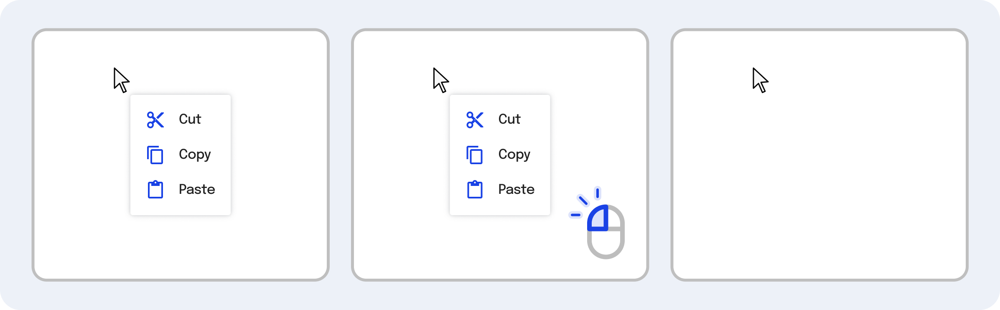

---
{
  title: "Shared Component Logic",
  description: "Components provide a great way to share layout, styling, and logic between multiple parts of your app. But what about times you only need to share logic in React, Angular, and Vue?",
  published: "2024-03-11T12:13:00.000Z",
  authors: ["crutchcorn"],
  tags: ["react", "angular", "vue", "webdev"],
  attached: [],
  order: 13,
  collection: "framework-field-guide-fundamentals-v1-1",
  noindex: true,
  version: "v1.1",
  upToDateSlug: "ffg-fundamentals-shared-component-logic",
}
---

Components are awesome. They allow you to make your code logic more modular and associate that logic with a related collection of DOM nodes. More importantly than that, **components are _composable_**; You can take two components and use them together to build a third that employs them both.

Sometimes, while building components, you may find yourself needing to share logic between multiple components.

> We're not talking about sharing state or logic _between_ instances of the same component:
>
> **IE**: Two instances of the same component sharing the same data.
>
> Instead, **we're talking about a way to share logic for each _instance_ of a component**.
>
> **IE**: Two instances of the same component have their own data.

For example, let's say that you have some component code that detects the current window size. While this might seem like a simple problem at first, it requires you to:

- Get the initial window size and share that data with the component
- Add and clean up event listeners for when the user resizes their browser window
- Compose the window sizing logic inside other shared logic, such as an `onlyShowOnMobile` boolean

The method of how this logic is shared between components differs from framework to framework.

| Framework | Method Of Logic Sharing |
| --------- | ----------------------- |
| React     | Custom Hooks            |
| Angular   | Services                |
| Vue       | Compositions            |

We'll spend the chapter talking about how to do all of this and see how we can apply these methods to production code.

But here's my favorite part about these methods: We don't have to introduce any new APIs to use them. Instead, we'll combine a culmination of other APIs we've learned to this point.

Without further ado, let's build the window size shared logic.

# Sharing Data Storage Methods {#sharing-data-storage}

The first step of creating composable shared logic is to create a way to store data in an instance of the logic:

<!-- ::start:tabs -->

## React

In a typical React component, we'd store data using the `useState` or `useReducer` hook. Using React's custom hooks, we'll use the same APIs to create our own hook that combines (or composes) these other APIs:

```jsx
const useWindowSize = () => {
	const [height, setHeight] = useState(window.innerHeight);
	const [width, setWidth] = useState(window.innerWidth);

	return { height, width };
};
```

We can then use this `useWindowSize` custom hook just as we would any other hook:

```jsx
const App = () => {
	const { height, width } = useWindowSize();

	return (
		<p>
			The window is {height}px high and {width}px wide
		</p>
	);
};
```

<!-- ::start:no-ebook -->
<iframe data-frame-title="React Shared Data Storage - StackBlitz" src="pfp-code:./ffg-fundamentals-react-shared-data-storage-100?template=node&embed=1&file=src%2Fmain.jsx"></iframe>
<!-- ::end:no-ebook -->

### Rules of Custom Hooks {#custom-hooks-rules}

[In our "Intro to Components" chapter, we covered the rules of React's built-in hooks](/posts/ffg-fundamentals-v1-1-intro-to-components#rules-of-hooks).

We mentioned that there are a few rules for any hooks:

- Be called from a component\* (no normal functions)
- Not be called conditionally inside a component (no `if` statements)
- Not be called inside a loop (no `for` or `while` loops)

While these rules are mostly true, **let's expand the first point to include "other hooks"** as a place you're allowed to call a hook from.

Now that we've corrected that, it's a good time to mention that **custom hooks also follow these rules**.

There's one additional rule that custom hooks must follow, and that's:

- Your custom Hook's name must start with `use`.

To recap, this means that **the following custom hooks are not allowed**:

```jsx
// ❌ Not allowed, the function name must start with `use`
const getWindowSize = () => {
	const [height, setHeight] = useState(window.innerHeight);
	const [width, setWidth] = useState(window.innerWidth);

	return { height, width };
};
```

```jsx
const useWindowSize = () => {
	const [height, setHeight] = useState(window.innerHeight);
	const [width, setWidth] = useState(window.innerWidth);

	return { height, width };
};

// ❌ Not allowed, you must use a hook _inside_ a component or another hook
const { height, width } = useWindowSize();

const Component = () => {
	return <p>Height is: {height}</p>;
};
```

```jsx
const useWindowSize = () => {
	const [height, setHeight] = useState(window.innerHeight);
	const [width, setWidth] = useState(window.innerWidth);

	return { height, width };
};

function getWindowSize() {
	// ❌ Not allowed, you cannot use a hook inside a non-hook function
	const { height, width } = useWindowSize();
	return { height, width };
}
```

```jsx
const useWindowSize = () => {
	// ❌ Not allowed, you cannot `return` before using a hook
	if (bool) return { height: 0, width: 0 };
	const [height, setHeight] = useState(window.innerHeight);
	const [width, setWidth] = useState(window.innerWidth);

	return { height, width };
};
```

## Angular

To share data setup between components in Angular, we'll create an instance of a class that can be provided by each consuming component.

Just as we covered [in the dependency injection chapter](/posts/ffg-fundamentals-v1-1-dependency-injection#basic-values), we'll use `Injectable` to create a class that can be provided to a component instance.

```angular-ts
@Injectable()
class WindowSize {
	height = window.innerHeight;
	width = window.innerWidth;
}

@Component({
	selector: "app-root",
	standalone: true,
	template: `
		<p>
			The window is {{ windowSize.height }}px high and {{ windowSize.width }}px
			wide
		</p>
	`,
	providers: [WindowSize],
})
class AppComponent {
	windowSize = inject(WindowSize);
}
```

<!-- ::start:no-ebook -->
<iframe data-frame-title="Angular Shared Data Storage - StackBlitz" src="pfp-code:./ffg-fundamentals-angular-shared-data-storage-100?template=node&embed=1&file=src%2Fmain.ts"></iframe>
<!-- ::end:no-ebook -->

## Vue

Because Vue's `ref` and `reactive` data reactivity systems work anywhere, we can extract these values to a dedicated function called `useWindowSize`.

```javascript
// use-window-size.js
import { ref } from "vue";

export const useWindowSize = () => {
	const height = ref(window.innerHeight);
	const width = ref(window.innerWidth);
	return { height, width };
};
```

This custom function is often called a "composition" since we're using Vue's Composition API inside it. We can then use this composition inside our setup `script` like so:

```vue
<!-- App.vue -->
<script setup>
import { useWindowSize } from "./use-window-size";

const { height, width } = useWindowSize();
</script>

<template>
	<p>The window is {{ height }}px high and {{ width }}px wide</p>
</template>
```

<!-- ::start:no-ebook -->
<iframe data-frame-title="Vue Shared Data Storage - StackBlitz" src="pfp-code:./ffg-fundamentals-vue-shared-data-storage-100?template=node&embed=1&file=src%2FApp.vue"></iframe>
<!-- ::end:no-ebook -->

> While React requires you to name your custom hooks "useX," you don't have to do the same with custom compositions. We could have easily called this code `createWindowSize` and have it work just as well.
>
> We still use the `use` composition prefix to keep things readable. While this is subjective, it's the naming convention the ecosystem seems to favor for compositions like this.

<!-- ::end:tabs -->

# Sharing Side Effect Handlers {#sharing-side-effect-handlers}

While sharing data between a consuming component is helpful in its own right, this is only a fraction of the capabilities these frameworks have for cross-component logic reuse.

One of the most powerful things that can be reused between components is [side effect](/posts/ffg-fundamentals-v1-1-side-effects) logic.

Using this, we can say something along the lines of:

> When a component that implements this shared bit of code renders, do this behavior.

And combine it with our data storage to say:

> When the component renders, store some calculation and expose it back to the consuming component.

This can be a bit vague to discuss without code, so let's dive in.

While our last code sample was able to expose the browser window's height and width, it didn't respond to window resizing. This means that if you resized the browser window, the value of `height` and `width` would no longer be accurate.

Let's use [the window listener side effect we built in our "Side Effects" chapter](/posts/ffg-fundamentals-v1-1-side-effects#cleaning-event-listeners) to add an event handler to listen for window resizing.

<!-- ::start:tabs -->

## React

```jsx
const useWindowSize = () => {
	const [height, setHeight] = useState(window.innerHeight);
	const [width, setWidth] = useState(window.innerWidth);

	useEffect(() => {
		function onResize() {
			setHeight(window.innerHeight);
			setWidth(window.innerWidth);
		}

		window.addEventListener("resize", onResize);

		// Remember to cleanup the listener
		return () => window.removeEventListener("resize", onResize);
	}, []);

	return { height, width };
};
```

... That's it!

There's nothing more we need to do inside our `useWindowSize` consuming component; it simply works transparently as if we had placed the `useEffect` in the component itself.

```jsx
const App = () => {
	const { height, width } = useWindowSize();
	return (
		<p>
			The window is {height}px high and {width}px wide
		</p>
	);
};
```

<!-- ::start:no-ebook -->
<iframe data-frame-title="React Sharing Side Effect - StackBlitz" src="pfp-code:./ffg-fundamentals-react-sharing-side-effect-101?template=node&embed=1&file=src%2Fmain.jsx"></iframe>
<!-- ::end:no-ebook -->

<!-- ::start:no-ebook -->

> Notice that we've changed exactly zero lines of code from our previous example of this component! ✨ Magic ✨

<!-- ::end:no-ebook -->

<!-- ::start:only-ebook -->

> Notice that we've changed exactly zero lines of code from our previous example of this component! Magic!

<!-- ::end:only-ebook -->

## Angular

While Angular can _technically_ [create a base component that shares its lifecycle with a consuming component](/posts/angular-extend-class), it's messy, fragile, and overall considered a malpractice.

Instead, we can use a per-component injectable that uses its own `constructor` and `ngOnDestroy` lifecycle methods.

> Technically `constructor` isn't strictly a lifecycle method, but `Injectable`s don't have access to `ngOnInit`; only `ngOnDestroy`.
>
> The reason `Injectable`s don't have `ngOnInit` is because that method means something very specific under-the-hood, pertaining to UI data binding. Because an `Injectable` can't UI data bind, it has no need for `ngOnInit` and instead the `constructor` takes the role of setting up side effects.

```angular-ts
@Injectable()
class WindowSize implements OnDestroy {
	height = 0;
	width = 0;

	constructor() {
		this.height = window.innerHeight;
		this.width = window.innerWidth;
		// In a component, we might add this in an `OnInit`, but `Injectable` classes only have `OnDestroy`
		window.addEventListener("resize", this.onResize);
	}
	onResize = () => {
		this.height = window.innerHeight;
		this.width = window.innerWidth;
	};
	ngOnDestroy() {
		window.removeEventListener("resize", this.onResize);
	}
}

@Component({
	selector: "app-root",
	standalone: true,
	template: `
		<p>
			The window is {{ windowSize.height }}px high and {{ windowSize.width }}px
			wide
		</p>
	`,
	providers: [WindowSize],
})
class AppComponent {
	windowSize = inject(WindowSize);
}
```

<!-- ::start:no-ebook -->
<iframe data-frame-title="Angular Sharing Side Effect - StackBlitz" src="pfp-code:./ffg-fundamentals-angular-sharing-side-effect-101?template=node&embed=1&file=src%2Fmain.ts"></iframe>
<!-- ::end:no-ebook -->

> This code isn't ideal; the Angular team knows this. This is why they're working on introducing a new method of side effect handling (and data storage) [called "Signals"](https://angular.dev/guide/signals). At the time of writing, Signals are still in the experimental phase, but they're worth keeping an eye on.

> While this is the only method we'll be looking at in this book for writing this code, [Lars Gyrup Brink Nielsen showcased how we could improve this code using RxJS in another article on the Playful Programming site.](/posts/angular-extend-class#The-Angular-way-to-fix-the-code)

## Vue

Sharing side effects handling within custom compositions is just as straightforward as using them within components. We can simply use the same `onMounted` and `onUnmounted` lifecycle methods as we do within our `setup` `script`.

```javascript
// use-window-size.js
import { onMounted, onUnmounted, ref } from "vue";

export const useWindowSize = () => {
	const height = ref(window.innerHeight);
	const width = ref(window.innerWidth);

	function onResize() {
		height.value = window.innerHeight;
		width.value = window.innerWidth;
	}

	onMounted(() => {
		window.addEventListener("resize", onResize);
	});

	onUnmounted(() => {
		window.removeEventListener("resize", onResize);
	});

	return { height, width };
};
```

```vue
<!-- App.vue -->
<script setup>
import { useWindowSize } from "./use-window-size";

const { height, width } = useWindowSize();
</script>

<template>
	<p>The window is {{ height }}px high and {{ width }}px wide</p>
</template>
```

<!-- ::start:no-ebook -->
<iframe data-frame-title="Vue Sharing Side Effect - StackBlitz" src="pfp-code:./ffg-fundamentals-vue-sharing-side-effect-101?template=node&embed=1&file=src%2FApp.vue"></iframe>
<!-- ::end:no-ebook -->

> We could have also used the `watch` or `watchEffect` composition methods, but chose not to for this example.

<!-- ::end:tabs -->

# Composing Custom Logic {#composing-custom-logic}

We've covered how shared logic can access data storage and side-effect handlers. Now let's talk about the fun stuff: Composability.

Not only can you call your custom logic from components, but you can call them from other shared logic fragments.

<!-- ::in-content-ad title="Consider supporting" body="Donating any amount will help towards further development of the Framework Field Guide." button-text="Sponsor my work" button-href="https://github.com/sponsors/crutchcorn/" -->

For example, let's say that we want to take our window size getter and create another custom logic fragment that composes it.

If we were using plain-ole functions, it might look something like this:

```javascript
function getWindowSize() {
	return {
		height: window.innerHeight,
		width: window.innerWidth,
	};
}

function isMobile() {
	const { height, width } = getWindowSize();
	if (width <= 480) return true;
	else return false;
}
```

But this comes with downsides when trying to include this logic in a framework, such as:

- No access to side effect cleanup
- No automatic-re-rendering when `height` or `width` changes

Luckily for us, we can do this with our frameworks with full access to all the other framework-specific APIs we've covered until now.

<!-- ::start:tabs -->

## React

So, do you remember how we used `useState` inside of `useWindowSize`? That's because all hooks are composable.

This is true for custom hooks as well, meaning that we can do the following code:

```jsx
const useMobileCheck = () => {
	const { width } = useWindowSize();

	if (width <= 480) return { isMobile: true };
	else return { isMobile: false };
};
```

Without modifying the `useWindowSize` component.

To consume our new `useMobileCheck` component is just as straightforward as it was to use `useWindowSize`:

```jsx
const Component = () => {
	const { isMobile } = useMobileCheck();

	return <p>Is this a mobile device? {isMobile ? "Yes" : "No"}</p>;
};
```

<!-- ::start:no-ebook -->
<iframe data-frame-title="React Composing Logic - StackBlitz" src="pfp-code:./ffg-fundamentals-react-composing-logic-102?template=node&embed=1&file=src%2Fmain.jsx"></iframe>
<!-- ::end:no-ebook -->

## Angular

Just as we can use dependency injection to provide an instance of our `WindowSize` class, we can use an instance of our provided `WindowSize` class inside a new `IsMobile` class that's also provided in a class.

First, though, we need to provide a way to add behavior to our `onResize` class:

```angular-ts
@Injectable()
class WindowSize implements OnDestroy {
	height = 0;
	width = 0;

	// We'll overwrite this behavior in another service
	_listener!: () => void | undefined;

	constructor() {
		this.onResize();
		window.addEventListener("resize", this.onResize);
	}

	onResize = () => {
		this.height = window.innerHeight;
		this.width = window.innerWidth;
		// We will call this "listener" function if it's present
		if (this._listener) {
			this._listener();
		}
	};

	ngOnDestroy() {
		window.removeEventListener("resize", this.onResize);
	}
}
```

Now that we have this ability to tap into the `resize` event handler let's write our own `IsMobile` class:

```angular-ts
@Injectable()
class IsMobile {
	isMobile = false;

	// We cannot use the `inject` function here, because we need to overwrite our `constructor` behavior
	// and it's an either-or decision to use `constructor` or the `inject` function
	constructor(private windowSize: WindowSize) {
		windowSize._listener = () => {
			if (windowSize.width <= 480) this.isMobile = true;
			else this.isMobile = false;
		};
	}
}
```

This allows us to have an `isMobile` field that we can access from our `AppComponent` class:

```angular-ts
@Component({
	selector: "app-root",
	standalone: true,
	template: ` <p>Is mobile? {{ isMobile.isMobile }}</p> `,
	providers: [WindowSize, IsMobile],
})
class AppComponent {
	isMobile = inject(IsMobile);
}
```

<!-- ::start:no-ebook -->
<iframe data-frame-title="Angular Composing Logic - StackBlitz" src="pfp-code:./ffg-fundamentals-angular-composing-logic-102?template=node&embed=1&file=src%2Fmain.ts"></iframe>
<!-- ::end:no-ebook -->

Something worth mentioning is that we need to provide both `WindowSize` and `IsMobile`; otherwise, we'll get an error like so:

```
Error: R3InjectorError(AppModule)[WindowSize -> WindowSize -> WindowSize]:
NullInjectorError: No provider for WindowSize!
```

> This process of creating an `isMobile` field would be a lot easier with [`RxJS`](https://rxjs.dev/), which is widely used amongst Angular apps. However, I'm holding off on teaching RxJS until [the second "Framework Field Guide" book, which covers the "Ecosystem" of the frameworks more in-depth.](https://framework.guide)

## Vue

Composing custom composables (say that 10 times fast) is a straightforward task, thanks to custom composables acting like normal functions.

```javascript
// use-mobile-check.js
import { computed } from "vue";
import { useWindowSize } from "./use-window-size";

export const useMobileCheck = () => {
	const { height, width } = useWindowSize();
	const isMobile = computed(() => {
		if (width.value <= 480) return true;
		else return false;
	});

	return { isMobile };
};
```

> Notice that we aren't showing the source code for `useWindowSize` again, that's because we haven't changed it!

Then, to use this new composable in our components, we use it just like we did our previous composables:

```vue
<!-- App.vue -->
<script setup>
import { useMobileCheck } from "./use-mobile-check";

const { isMobile } = useMobileCheck();
</script>

<template>
	<p>Is this a mobile device? {{ isMobile ? "Yes" : "No" }}</p>
</template>
```

<!-- ::start:no-ebook -->
<iframe data-frame-title="Vue Composing Logic - StackBlitz" src="pfp-code:./ffg-fundamentals-vue-composing-logic-102?template=node&embed=1&file=src%2Fmain.ts"></iframe>
<!-- ::end:no-ebook -->

<!-- ::end:tabs -->

# Challenge {#challenge}

Let's take everything we've learned about shared-component logic and use it to recreate [our `ContextMenu` component from the "Component Reference" chapter](/posts/ffg-fundamentals-v1-1-component-reference) in smaller pieces.



Let's break these components into smaller pieces that we'll create composable logic for:

1. A listener for clicks outside the context menu
2. A composition that gets the bounds of the context menu's parent element

## Step 1: Create an Outside Click Composition {#challenge-step-1}

To listen for clicks outside the context menu, we can leverage some JavaScript akin to the following:

```javascript
const closeIfOutsideOfContext = (e) => {
	const isClickInside = ref.value.contains(e.target);
	if (isClickInside) return;
	closeContextMenu();
};

document.addEventListener("click", closeIfOutsideOfContext);
```

Let's turn this into a composition that we can use in our `ContextMenu` component.

<!-- ::start:tabs -->

### React

```jsx
const useOutsideClick = ({ ref, onClose }) => {
	useEffect(() => {
		const closeIfOutsideOfContext = (e) => {
			const isClickInside = ref.current.contains(e.target);
			if (isClickInside) return;
			onClose();
		};
		document.addEventListener("click", closeIfOutsideOfContext);
		return () => document.removeEventListener("click", closeIfOutsideOfContext);
	}, [onClose]);
};
```

Now that we have our `useOutsideClick` hook written, we can use it in our `ContextMenu` component:

```jsx
const ContextMenu = forwardRef(({ x, y, onClose }, ref) => {
	const divRef = useRef();

	useImperativeHandle(ref, () => ({
		focus: () => divRef.current && divRef.current.focus(),
	}));

	useOutsideClick({ ref: divRef, onClose });

	return (
		<div
			tabIndex={0}
			ref={divRef}
			style={{
				position: "fixed",
				top: y + 20,
				left: x + 20,
				background: "white",
				border: "1px solid black",
				borderRadius: 16,
				padding: "1rem",
			}}
		>
			<button onClick={() => onClose()}>X</button>
			This is a context menu
		</div>
	);
});
```

### Angular

While we were able to use the `constructor` to set up our event listeners in previous code samples, we need to explicitly have a `setup` function in this code sample.

This is because our `ViewChild` element reference isn't available until `AfterViewInit`, and isn't immediately accessible from `constructor`:

<!-- Editor's note: This is true even with {static: true} -->

```angular-ts
@Injectable()
class CloseIfOutSideContext implements OnDestroy {
	getCloseIfOutsideFunction = (
		contextMenu: ElementRef<HTMLElement>,
		close: EventEmitter<any>,
	) => {
		return (e: MouseEvent) => {
			const contextMenuEl = contextMenu?.nativeElement;
			if (!contextMenuEl) return;
			const isClickInside = contextMenuEl.contains(e.target as HTMLElement);
			if (isClickInside) return;
			close.emit();
		};
	};

	setup(contextMenu: ElementRef<HTMLElement>, close: EventEmitter<any>) {
		this.closeIfOutsideOfContext = this.getCloseIfOutsideFunction(
			contextMenu,
			close,
		);
		document.addEventListener("click", this.closeIfOutsideOfContext);
	}

	ngOnDestroy() {
		document.removeEventListener("click", this.closeIfOutsideOfContext);
		this.closeIfOutsideOfContext = () => {};
	}

	closeIfOutsideOfContext: (e: MouseEvent) => void = () => {};
}
```

Let's embed this service class in our `ContextMenu` component:

```angular-ts
@Component({
	selector: "context-menu",
	standalone: true,
	template: `
		<div
			#contextMenu
			tabIndex="0"
			[style]="{
				position: 'fixed',
				top: y + 20,
				left: x + 20,
				background: 'white',
				border: '1px solid black',
				borderRadius: 16,
				padding: '1rem'
			}"
		>
			<button (click)="close.emit()">X</button>
			This is a context menu
		</div>
	`,
	providers: [CloseIfOutSideContext],
})
class ContextMenuComponent implements OnInit {
	@ViewChild("contextMenu", { static: true })
	contextMenu!: ElementRef<HTMLElement>;

	@Input() x: number = 0;
	@Input() y: number = 0;
	@Output() close = new EventEmitter();

	closeIfOutside = inject(CloseIfOutSideContext);

	ngOnInit() {
		this.closeIfOutside.setup(this.contextMenu, this.close);
	}

	focus() {
		this.contextMenu.nativeElement.focus();
	}
}
```

### Vue

```javascript
// use-outside-click.js
import { onMounted, onUnmounted } from "vue";

export const useOutsideClick = ({ ref, onClose }) => {
	const closeIfOutsideOfContext = (e) => {
		const isClickInside = ref.value.contains(e.target);
		if (isClickInside) return;
		onClose();
	};

	onMounted(() => {
		document.addEventListener("click", closeIfOutsideOfContext);
	});

	onUnmounted(() => {
		document.removeEventListener("click", closeIfOutsideOfContext);
	});
};
```

Then, we can use this composition in our `ContextMenu` component:

```vue
<!-- ContextMenu.vue -->
<script setup>
import { onMounted, onUnmounted, ref } from "vue";
import { useOutsideClick } from "./use-outside-click";

const props = defineProps(["x", "y"]);
const emit = defineEmits(["close"]);
const contextMenuRef = ref(null);

useOutsideClick({ ref: contextMenuRef, onClose: () => emit("close") });

function focusMenu() {
	contextMenuRef.value.focus();
}
defineExpose({
	focusMenu,
});
</script>

<template>
	<div
		tabIndex="0"
		ref="contextMenuRef"
		:style="{
			position: 'fixed',
			top: props.y + 20,
			left: props.x + 20,
			background: 'white',
			border: '1px solid black',
			borderRadius: 16,
			padding: '1rem',
		}"
	>
		<button @click="$emit('close')">X</button>
		This is a context menu
	</div>
</template>
```

<!-- ::end:tabs -->

## Step 2: Create a Bounds Composable {#challenge-step-2}

Now let's move the bounds' size checking into a composable as well. This is done in JavaScript like so:

```javascript
const resizeListener = () => {
	if (!el) return;
	const localBounds = el.getBoundingClientRect();
	setBounds(localBounds);
};
resizeListener();
window.addEventListener("resize", resizeListener);
window.removeEventListener("resize", resizeListener);
```

<!-- ::start:tabs -->

### React

```jsx
const useBounds = () => {
	const [bounds, setBounds] = useState({
		height: 0,
		width: 0,
		x: 0,
		y: 0,
	});

	const [el, setEl] = useState(null);

	const ref = useCallback((el) => {
		setEl(el);
	}, []);

	useEffect(() => {
		const resizeListener = () => {
			if (!el) return;
			const localBounds = el.getBoundingClientRect();
			setBounds(localBounds);
		};
		resizeListener();
		window.addEventListener("resize", resizeListener);
		window.removeEventListener("resize", resizeListener);
	}, [el]);

	return { ref, bounds };
};
```

Now we wrap this into our `App` root:

```jsx
function App() {
	const { ref, bounds } = useBounds();

	// An addEventListener is easier to tackle when inside the conditional render
	// Add that as an exploration for `useImperativeHandle`
	const [isOpen, setIsOpen] = useState(false);

	function onContextMenu(e) {
		e.preventDefault();
		setIsOpen(true);
	}

	const contextMenuRef = useRef();

	useEffect(() => {
		if (isOpen && contextMenuRef.current) {
			contextMenuRef.current.focus();
		}
	}, [isOpen]);

	return (
		<>
			<div style={{ marginTop: "5rem", marginLeft: "5rem" }}>
				<div ref={ref} onContextMenu={onContextMenu}>
					Right click on me!
				</div>
			</div>
			{isOpen && (
				<ContextMenu
					x={bounds.x}
					y={bounds.y}
					ref={contextMenuRef}
					onClose={() => setIsOpen(false)}
				/>
			)}
		</>
	);
}
```

<!-- ::start:no-ebook -->

<details>

<summary>Final code output</summary>

<iframe data-frame-title="React Shared Logic Challenge - StackBlitz" src="pfp-code:./ffg-fundamentals-react-shared-logic-challenge-103?template=node&embed=1&file=src%2Fmain.jsx"></iframe>

</details>

<!-- ::end:no-ebook -->

### Angular

```angular-ts
@Injectable()
class BoundsContext implements OnDestroy {
	bounds = {
		height: 0,
		width: 0,
		x: 0,
		y: 0,
	};

	contextOrigin: ElementRef | undefined;

	resizeListener = () => {
		if (!this.contextOrigin) return;
		this.bounds = this.contextOrigin.nativeElement.getBoundingClientRect();
	};

	setup(contextOrigin: ElementRef) {
		this.bounds = contextOrigin.nativeElement.getBoundingClientRect();
		this.contextOrigin = contextOrigin;

		window.addEventListener("resize", this.resizeListener);
	}

	ngOnDestroy() {
		window.removeEventListener("resize", this.resizeListener);
		this.contextOrigin = undefined;
	}
}
```

We can then use this service in our `AppComponent`:

```angular-ts
@Component({
	selector: "app-root",
	standalone: true,
	imports: [ContextMenuComponent],
	template: `
		<div [style]="{ marginTop: '5rem', marginLeft: '5rem' }">
			<div #contextOrigin (contextmenu)="open($event)">Right click on me!</div>
		</div>
		@if (isOpen) {
			<context-menu
				#contextMenu
				[x]="boundsContext.bounds.x"
				[y]="boundsContext.bounds.y"
				(close)="close()"
			/>
		}
	`,
	providers: [BoundsContext],
})
class AppComponent implements AfterViewInit {
	@ViewChild("contextOrigin")
	contextOrigin!: ElementRef<HTMLElement>;
	@ViewChildren("contextMenu") contextMenu!: QueryList<ContextMenuComponent>;

	isOpen = false;

	boundsContext = inject(BoundsContext);

	ngAfterViewInit() {
		this.boundsContext.setup(this.contextOrigin);
		this.contextMenu.changes.forEach(() => {
			const isLoaded = this?.contextMenu?.first;
			if (!isLoaded) return;
			this.contextMenu.first.focus();
		});
	}

	close() {
		this.isOpen = false;
	}

	open(e: UIEvent) {
		e.preventDefault();
		this.isOpen = true;
	}
}
```

<!-- ::start:no-ebook -->

<details>

<summary>Final code output</summary>

<iframe data-frame-title="Angular Shared Logic Challenge - StackBlitz" src="pfp-code:./ffg-fundamentals-angular-shared-logic-challenge-103?template=node&embed=1&file=src%2Fmain.ts"></iframe>

</details>

<!-- ::end:no-ebook -->

### Vue

```javascript
// use-bounds.js
import { ref, onMounted, onUnmounted } from "vue";

export const useBounds = () => {
	const elRef = ref();

	const bounds = ref({
		height: 0,
		width: 0,
		x: 0,
		y: 0,
	});

	function resizeListener() {
		if (!elRef.value) return;
		bounds.value = elRef.value.getBoundingClientRect();
	}
	onMounted(() => {
		resizeListener();
		window.addEventListener("resize", resizeListener);
	});
	onUnmounted(() => {
		window.removeEventListener("resize", resizeListener);
	});

	return { bounds, ref: elRef };
};
```

And finally, we'll use this composition in `App`:

```vue
<!-- App.vue -->
<script setup>
import { onMounted, onUnmounted, ref } from "vue";
import ContextMenu from "./ContextMenu.vue";
import { useBounds } from "./use-bounds";
const isOpen = ref(false);

const { ref: contextOrigin, bounds } = useBounds();
const contextMenu = ref();

function close() {
	isOpen.value = false;
}
function open(e) {
	e.preventDefault();
	isOpen.value = true;
	setTimeout(() => {
		contextMenu.value.focusMenu();
	}, 0);
}
</script>

<template>
	<div :style="{ marginTop: '5rem', marginLeft: '5rem' }">
		<div ref="contextOrigin" @contextmenu="open($event)">
			Right click on me!
		</div>
	</div>
	<ContextMenu
		ref="contextMenu"
		v-if="isOpen"
		:x="bounds.x"
		:y="bounds.y"
		@close="close()"
	/>
</template>
```

<!-- ::start:no-ebook -->

<details>

<summary>Final code output</summary>

<iframe data-frame-title="Vue Shared Logic Challenge - StackBlitz" src="pfp-code:./ffg-fundamentals-vue-shared-logic-challenge-103?template=node&embed=1&file=src%2FApp.vue"></iframe>

</details>

<!-- ::end:no-ebook -->

<!-- ::end:tabs -->
